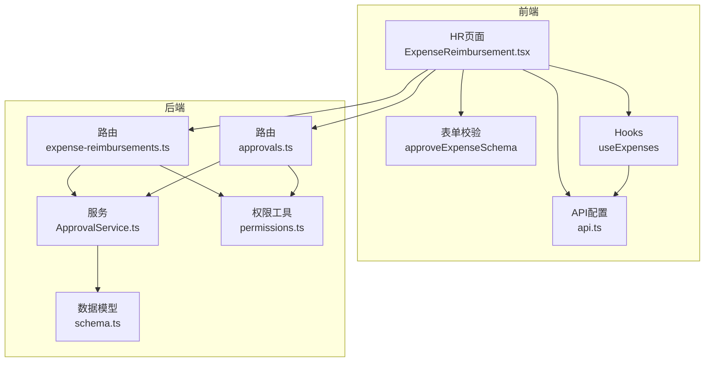
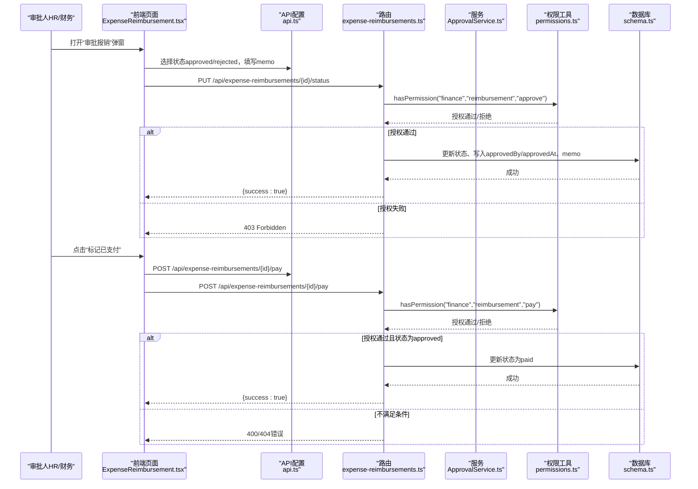
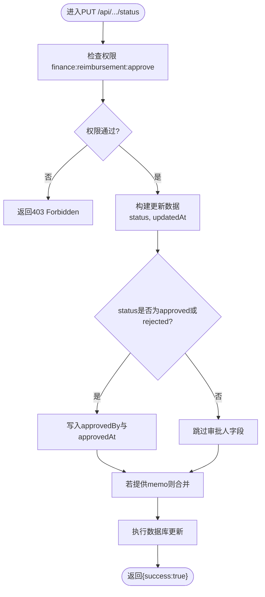
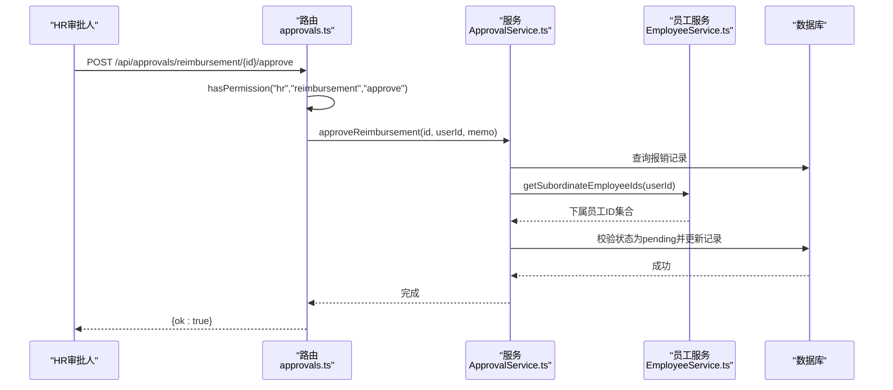
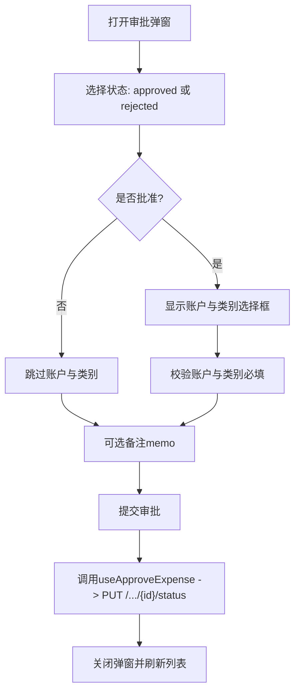
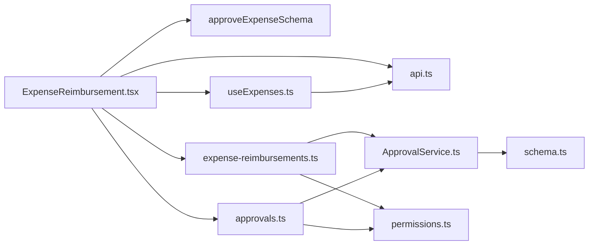

# 费用报销审批

<cite>
**本文引用的文件**
- [backend/src/routes/expense-reimbursements.ts](file://backend/src/routes/expense-reimbursements.ts)
- [backend/src/services/ApprovalService.ts](file://backend/src/services/ApprovalService.ts)
- [backend/src/utils/permissions.ts](file://backend/src/utils/permissions.ts)
- [backend/src/middleware/permission.ts](file://backend/src/middleware/permission.ts)
- [backend/src/db/schema.ts](file://backend/src/db/schema.ts)
- [backend/src/types.ts](file://backend/src/types.ts)
- [frontend/src/features/hr/pages/ExpenseReimbursement.tsx](file://frontend/src/features/hr/pages/ExpenseReimbursement.tsx)
- [frontend/src/validations/expense.schema.ts](file://frontend/src/validations/expense.schema.ts)
- [frontend/src/config/api.ts](file://frontend/src/config/api.ts)
- [frontend/src/hooks/business/useExpenses.ts](file://frontend/src/hooks/business/useExpenses.ts)
- [backend/src/routes/approvals.ts](file://backend/src/routes/approvals.ts)
- [backend/test/services/ApprovalService.test.ts](file://backend/test/services/ApprovalService.test.ts)
- [backend/test/routes/approvals.test.ts](file://backend/test/routes/approvals.test.ts)
- [backend/openapi.json](file://backend/openapi.json)
</cite>

## 目录
1. [简介](#简介)
2. [项目结构](#项目结构)
3. [核心组件](#核心组件)
4. [架构总览](#架构总览)
5. [详细组件分析](#详细组件分析)
6. [依赖关系分析](#依赖关系分析)
7. [性能与并发特性](#性能与并发特性)
8. [故障排查指南](#故障排查指南)
9. [结论](#结论)
10. [附录](#附录)

## 简介
本文件面向财务与HR流程，系统化梳理“费用报销审批”全流程，重点围绕以下目标：
- 通过PUT /api/expense-reimbursements/{id}/status更新报销状态的API，覆盖approved与rejected两种状态转换逻辑。
- 明确审批权限控制（finance:reimbursement:approve）与审批人信息记录机制（approvedBy、approvedAt）。
- 解释前端审批表单中状态选择与备注输入的交互逻辑，并说明批准时账户与类别的必填约束。
- 描述审批通过后的财务入账准备，包括关联账户与类别的业务规则。
- 提供部门经理审批下属报销申请的完整示例，以及处理审批冲突的策略建议。

## 项目结构
报销审批涉及前后端协作的关键模块如下：
- 后端
  - 路由层：/api/expense-reimbursements（状态更新、支付）、/api/approvals（HR侧审批入口）
  - 服务层：ApprovalService（统一审批逻辑，含权限校验）
  - 权限工具：hasPermission、requirePermission、canApproveApplication等
  - 数据模型：expenseReimbursements表字段（状态、审批人、备注等）
- 前端
  - 页面：HR侧“员工报销管理”，包含审批弹窗、状态标签、凭证预览
  - 表单校验：approveExpenseSchema（批准时账户与类别必填）
  - API配置：api.expenseReimbursementsApprove、api.expenseReimbursementsPay
  - Hooks：useApproveExpense、usePayExpense

图表来源
- [frontend/src/features/hr/pages/ExpenseReimbursement.tsx](file://frontend/src/features/hr/pages/ExpenseReimbursement.tsx#L1-L741)
- [frontend/src/validations/expense.schema.ts](file://frontend/src/validations/expense.schema.ts#L1-L29)
- [frontend/src/config/api.ts](file://frontend/src/config/api.ts#L1-L179)
- [frontend/src/hooks/business/useExpenses.ts](file://frontend/src/hooks/business/useExpenses.ts#L1-L103)
- [backend/src/routes/expense-reimbursements.ts](file://backend/src/routes/expense-reimbursements.ts#L1-L263)
- [backend/src/routes/approvals.ts](file://backend/src/routes/approvals.ts#L230-L310)
- [backend/src/services/ApprovalService.ts](file://backend/src/services/ApprovalService.ts#L1-L283)
- [backend/src/utils/permissions.ts](file://backend/src/utils/permissions.ts#L1-L330)
- [backend/src/db/schema.ts](file://backend/src/db/schema.ts#L1-L200)

章节来源
- [backend/src/routes/expense-reimbursements.ts](file://backend/src/routes/expense-reimbursements.ts#L1-L263)
- [backend/src/routes/approvals.ts](file://backend/src/routes/approvals.ts#L230-L310)
- [backend/src/services/ApprovalService.ts](file://backend/src/services/ApprovalService.ts#L1-L283)
- [backend/src/utils/permissions.ts](file://backend/src/utils/permissions.ts#L1-L330)
- [frontend/src/features/hr/pages/ExpenseReimbursement.tsx](file://frontend/src/features/hr/pages/ExpenseReimbursement.tsx#L1-L741)
- [frontend/src/validations/expense.schema.ts](file://frontend/src/validations/expense.schema.ts#L1-L29)
- [frontend/src/config/api.ts](file://frontend/src/config/api.ts#L1-L179)
- [frontend/src/hooks/business/useExpenses.ts](file://frontend/src/hooks/business/useExpenses.ts#L1-L103)

## 核心组件
- 后端状态更新API（PUT /api/expense-reimbursements/{id}/status）
  - 权限：finance:reimbursement:approve
  - 支持状态：pending、approved、rejected
  - 审批人记录：当status为approved或rejected时，写入approvedBy与approvedAt
  - 备注：可选memo字段随请求更新
- HR侧审批入口（POST /api/approvals/reimbursement/{id}/{approve|reject}）
  - 权限：hr:reimbursement:approve
  - 业务：调用ApprovalService.approveReimbursement或rejectReimbursement
  - 审批人记录：approvedBy、approvedAt、memo
- 前端审批表单
  - 状态选择：approved/rejected
  - 批准时强制选择账户与类别；拒绝时可不选
  - 备注输入：可选memo
- 支付流程（POST /api/expense-reimbursements/{id}/pay）
  - 权限：finance:reimbursement:pay
  - 规则：仅approved状态可支付，支付后状态置为paid

章节来源
- [backend/src/routes/expense-reimbursements.ts](file://backend/src/routes/expense-reimbursements.ts#L160-L216)
- [backend/src/routes/approvals.ts](file://backend/src/routes/approvals.ts#L230-L310)
- [backend/src/services/ApprovalService.ts](file://backend/src/services/ApprovalService.ts#L198-L234)
- [frontend/src/features/hr/pages/ExpenseReimbursement.tsx](file://frontend/src/features/hr/pages/ExpenseReimbursement.tsx#L623-L726)
- [frontend/src/validations/expense.schema.ts](file://frontend/src/validations/expense.schema.ts#L15-L29)

## 架构总览
下图展示从前端到后端的审批与支付调用链路，以及关键状态流转与权限控制点。

图表来源
- [frontend/src/features/hr/pages/ExpenseReimbursement.tsx](file://frontend/src/features/hr/pages/ExpenseReimbursement.tsx#L360-L371)
- [frontend/src/config/api.ts](file://frontend/src/config/api.ts#L103-L106)
- [backend/src/routes/expense-reimbursements.ts](file://backend/src/routes/expense-reimbursements.ts#L160-L262)
- [backend/src/utils/permissions.ts](file://backend/src/utils/permissions.ts#L80-L114)

## 详细组件分析

### 后端状态更新API（PUT /api/expense-reimbursements/{id}/status）
- 权限控制
  - 使用hasPermission("finance","reimbursement","approve")进行鉴权
  - 若无权限，抛出403错误
- 请求体
  - status：枚举值pending、approved、rejected
  - memo：可选
- 更新逻辑
  - 无论何种状态，均更新status与updatedAt
  - 当status为approved或rejected时，同时写入approvedBy与approvedAt
  - 若请求携带memo，则合并到记录memo字段
- 返回
  - 成功返回{success:true}

图表来源
- [backend/src/routes/expense-reimbursements.ts](file://backend/src/routes/expense-reimbursements.ts#L189-L215)
- [backend/src/utils/permissions.ts](file://backend/src/utils/permissions.ts#L80-L114)

章节来源
- [backend/src/routes/expense-reimbursements.ts](file://backend/src/routes/expense-reimbursements.ts#L160-L216)

### HR侧审批入口（POST /api/approvals/reimbursement/{id}/{approve|reject}）
- 权限控制
  - 使用hasPermission("hr","reimbursement","approve")进行鉴权
- 业务逻辑
  - 调用ApprovalService.approveReimbursement或rejectReimbursement
  - 服务层会校验记录存在性、状态是否为pending，并检查审批人与申请人关系（仅能审批下属）
  - 更新approvedBy、approvedAt、memo等字段
- 审计日志
  - 调用logAuditAction记录审批动作

图表来源
- [backend/src/routes/approvals.ts](file://backend/src/routes/approvals.ts#L230-L310)
- [backend/src/services/ApprovalService.ts](file://backend/src/services/ApprovalService.ts#L198-L234)

章节来源
- [backend/src/routes/approvals.ts](file://backend/src/routes/approvals.ts#L230-L310)
- [backend/src/services/ApprovalService.ts](file://backend/src/services/ApprovalService.ts#L198-L234)

### 前端审批表单交互逻辑
- 状态选择
  - 仅提供approved与rejected两个选项
- 批准时的账户与类别
  - 当选择approved时，表单动态显示“支出账户”和“支出类别”，二者均为必填
- 备注输入
  - 可选memo，支持审批备注
- 操作按钮
  - “审批”弹窗提交后，调用useApproveExpense（对应后端PUT /.../{id}/status）
  - “标记已支付”按钮调用usePayExpense（对应后端POST /.../{id}/pay）

图表来源
- [frontend/src/features/hr/pages/ExpenseReimbursement.tsx](file://frontend/src/features/hr/pages/ExpenseReimbursement.tsx#L623-L726)
- [frontend/src/validations/expense.schema.ts](file://frontend/src/validations/expense.schema.ts#L15-L29)
- [frontend/src/hooks/business/useExpenses.ts](file://frontend/src/hooks/business/useExpenses.ts#L80-L90)
- [frontend/src/config/api.ts](file://frontend/src/config/api.ts#L103-L106)

章节来源
- [frontend/src/features/hr/pages/ExpenseReimbursement.tsx](file://frontend/src/features/hr/pages/ExpenseReimbursement.tsx#L623-L726)
- [frontend/src/validations/expense.schema.ts](file://frontend/src/validations/expense.schema.ts#L15-L29)
- [frontend/src/hooks/business/useExpenses.ts](file://frontend/src/hooks/business/useExpenses.ts#L80-L90)

### 支付流程（POST /api/expense-reimbursements/{id}/pay）
- 权限控制
  - hasPermission("finance","reimbursement","pay")
- 业务规则
  - 仅approved状态可支付
  - 支付成功后状态置为paid
- 返回
  - {success:true}

章节来源
- [backend/src/routes/expense-reimbursements.ts](file://backend/src/routes/expense-reimbursements.ts#L218-L262)

### 审批权限控制与审批人信息记录
- 权限矩阵
  - PUT /.../{id}/status：finance:reimbursement:approve
  - POST /.../{id}/pay：finance:reimbursement:pay
  - HR侧审批入口：hr:reimbursement:approve
- 审批人信息
  - 当status为approved或rejected时，后端自动写入approvedBy与approvedAt
  - HR侧审批入口同样写入上述字段
- 下属审批校验
  - HR侧审批服务会通过EmployeeService.getSubordinateEmployeeIds(userId)校验是否为下属
  - 若非下属，抛出403错误

章节来源
- [backend/src/utils/permissions.ts](file://backend/src/utils/permissions.ts#L80-L114)
- [backend/src/routes/expense-reimbursements.ts](file://backend/src/routes/expense-reimbursements.ts#L189-L215)
- [backend/src/routes/approvals.ts](file://backend/src/routes/approvals.ts#L230-L310)
- [backend/src/services/ApprovalService.ts](file://backend/src/services/ApprovalService.ts#L198-L234)

### 审批通过后的财务入账准备（账户与类别）
- 前端在批准时强制要求选择“支出账户”和“支出类别”，确保后续入账数据完整性
- 后端状态更新API不强制要求账户与类别，但HR侧审批入口会在服务层更新记录
- 支付流程要求状态为approved，支付后状态变为paid，便于财务对账

章节来源
- [frontend/src/validations/expense.schema.ts](file://frontend/src/validations/expense.schema.ts#L15-L29)
- [frontend/src/features/hr/pages/ExpenseReimbursement.tsx](file://frontend/src/features/hr/pages/ExpenseReimbursement.tsx#L671-L720)
- [backend/src/routes/expense-reimbursements.ts](file://backend/src/routes/expense-reimbursements.ts#L218-L262)

### 完整示例：部门经理审批下属报销申请
- 场景
  - 经理A审批员工B的报销申请
- 前端
  - 打开“审批报销”弹窗，选择approved，选择账户与类别，填写memo
  - 点击“确认”，调用useApproveExpense
- 后端
  - HR侧路由校验hr:reimbursement:approve权限
  - 调用ApprovalService.approveReimbursement
  - 校验B是否为A的下属，校验记录状态为pending
  - 更新记录：status=approved、approvedBy=经理A、approvedAt=当前时间、memo=备注
- 财务
  - 经理A审批完成后，财务可调用POST /.../{id}/pay将状态置为paid

章节来源
- [backend/src/routes/approvals.ts](file://backend/src/routes/approvals.ts#L230-L310)
- [backend/src/services/ApprovalService.ts](file://backend/src/services/ApprovalService.ts#L198-L234)
- [frontend/src/features/hr/pages/ExpenseReimbursement.tsx](file://frontend/src/features/hr/pages/ExpenseReimbursement.tsx#L623-L726)

### 审批冲突处理策略
- 并发场景
  - 若多个审批人同时尝试修改同一记录，后端状态更新API仅更新status与时间戳字段
  - 建议前端在提交审批前读取最新状态，避免重复提交导致的覆盖
- 业务一致性
  - HR侧审批入口在服务层会检查记录是否存在且状态为pending，防止重复审批
  - 若出现异常，测试用例覆盖了非下属审批被拒绝的场景，可作为参考

章节来源
- [backend/src/services/ApprovalService.ts](file://backend/src/services/ApprovalService.ts#L198-L234)
- [backend/test/services/ApprovalService.test.ts](file://backend/test/services/ApprovalService.test.ts#L275-L291)
- [backend/test/routes/approvals.test.ts](file://backend/test/routes/approvals.test.ts#L107-L118)

## 依赖关系分析
- 组件耦合
  - 前端ExpenseReimbursement.tsx依赖api.ts、useExpenses.ts、approveExpenseSchema
  - 后端routes依赖services、permissions、schema
- 外部依赖
  - OpenAPI文档导出包含上述端点的请求/响应定义
- 循环依赖
  - 未发现循环导入；路由、服务、权限工具分层清晰

图表来源
- [frontend/src/features/hr/pages/ExpenseReimbursement.tsx](file://frontend/src/features/hr/pages/ExpenseReimbursement.tsx#L1-L741)
- [frontend/src/config/api.ts](file://frontend/src/config/api.ts#L1-L179)
- [frontend/src/validations/expense.schema.ts](file://frontend/src/validations/expense.schema.ts#L1-L29)
- [frontend/src/hooks/business/useExpenses.ts](file://frontend/src/hooks/business/useExpenses.ts#L1-L103)
- [backend/src/routes/expense-reimbursements.ts](file://backend/src/routes/expense-reimbursements.ts#L1-L263)
- [backend/src/routes/approvals.ts](file://backend/src/routes/approvals.ts#L230-L310)
- [backend/src/services/ApprovalService.ts](file://backend/src/services/ApprovalService.ts#L1-L283)
- [backend/src/utils/permissions.ts](file://backend/src/utils/permissions.ts#L1-L330)
- [backend/src/db/schema.ts](file://backend/src/db/schema.ts#L1-L200)

章节来源
- [backend/openapi.json](file://backend/openapi.json#L15868-L16248)

## 性能与并发特性
- 数据库更新
  - 状态更新为单条记录写入，复杂度O(1)，索引层面建议确保id主键与状态查询字段具备索引以提升筛选效率
- 并发控制
  - 建议在前端增加防抖与幂等提交策略，避免重复提交导致的状态覆盖
- 权限检查
  - hasPermission与canApproveApplication均为纯函数式检查，开销极低

[本节为通用指导，无需特定文件引用]

## 故障排查指南
- 403 Forbidden（权限不足）
  - 检查当前用户是否具备finance:reimbursement:approve或hr:reimbursement:approve权限
  - 确认用户职位与部门模块权限配置
- 400 Business Error（状态非法）
  - 确认报销记录状态为pending，否则无法再次审批
- 404 Not Found（记录不存在）
  - 确认id有效且记录存在
- 非下属审批被拒
  - HR侧审批服务会校验审批人与申请人关系，仅能审批下属
- 支付失败
  - 仅approved状态可支付，若状态非approved将返回错误

章节来源
- [backend/src/routes/expense-reimbursements.ts](file://backend/src/routes/expense-reimbursements.ts#L189-L262)
- [backend/src/services/ApprovalService.ts](file://backend/src/services/ApprovalService.ts#L198-L234)
- [backend/test/services/ApprovalService.test.ts](file://backend/test/services/ApprovalService.test.ts#L275-L291)
- [backend/test/routes/approvals.test.ts](file://backend/test/routes/approvals.test.ts#L107-L118)

## 结论
本方案通过明确的权限边界、严格的审批校验与清晰的前端交互，实现了从“提交—审批—支付”的闭环流程。approved与rejected状态转换逻辑简单可靠，配合approvedBy/approvedAt记录，便于审计与追踪。前端在批准时强制选择账户与类别，为财务入账提供了必要的业务数据保障。建议在生产环境中结合前端防抖与幂等策略，进一步提升并发安全性与用户体验。

[本节为总结性内容，无需特定文件引用]

## 附录

### API定义与字段说明
- PUT /api/expense-reimbursements/{id}/status
  - 权限：finance:reimbursement:approve
  - 请求体：status（枚举）、memo（可选）
  - 响应：{success:true}
- POST /api/expense-reimbursements/{id}/pay
  - 权限：finance:reimbursement:pay
  - 规则：仅approved状态可支付，支付后状态置为paid
- POST /api/approvals/reimbursement/{id}/approve
  - 权限：hr:reimbursement:approve
  - 业务：调用ApprovalService.approveReimbursement，校验下属关系与状态

章节来源
- [backend/src/routes/expense-reimbursements.ts](file://backend/src/routes/expense-reimbursements.ts#L160-L262)
- [backend/src/routes/approvals.ts](file://backend/src/routes/approvals.ts#L230-L310)
- [backend/openapi.json](file://backend/openapi.json#L15868-L16248)