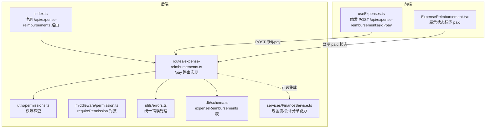
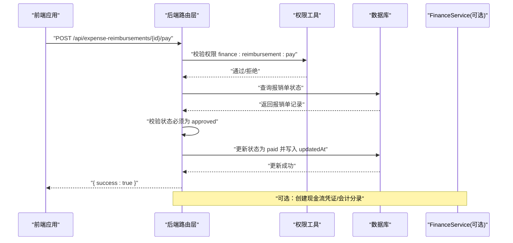
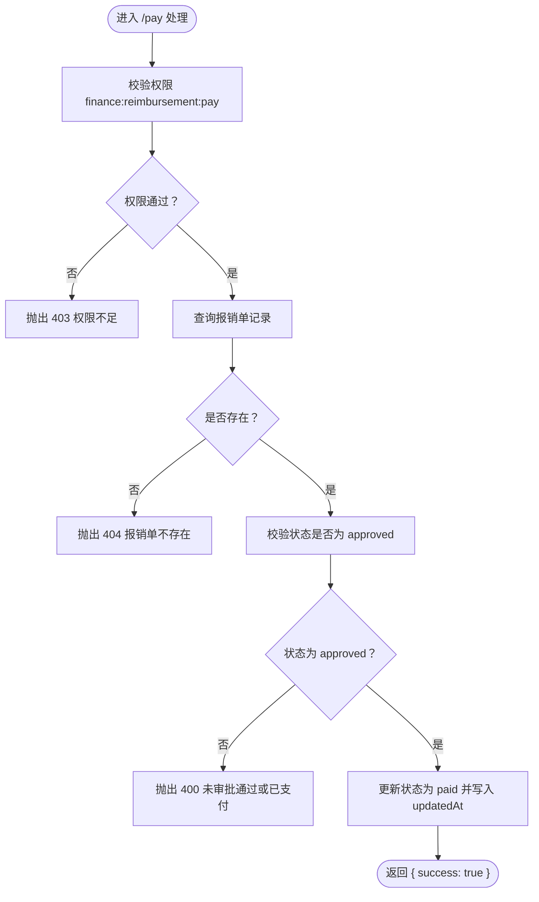
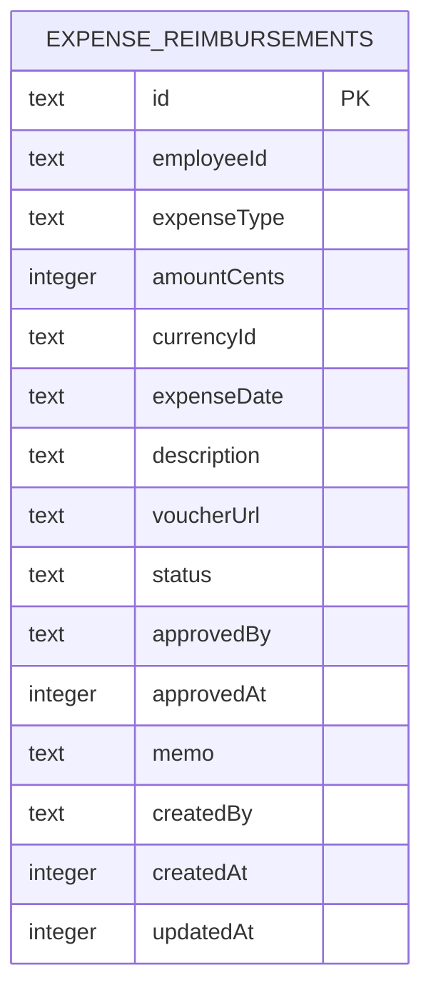
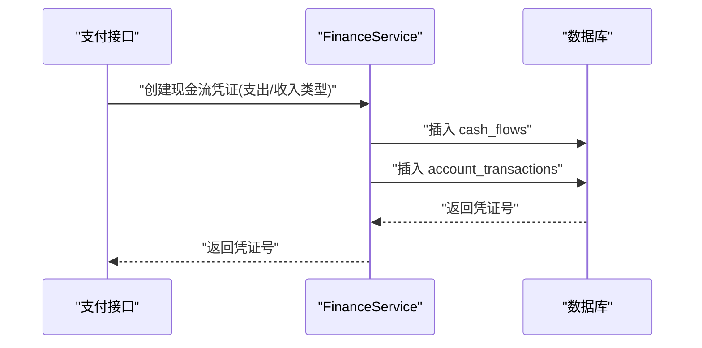
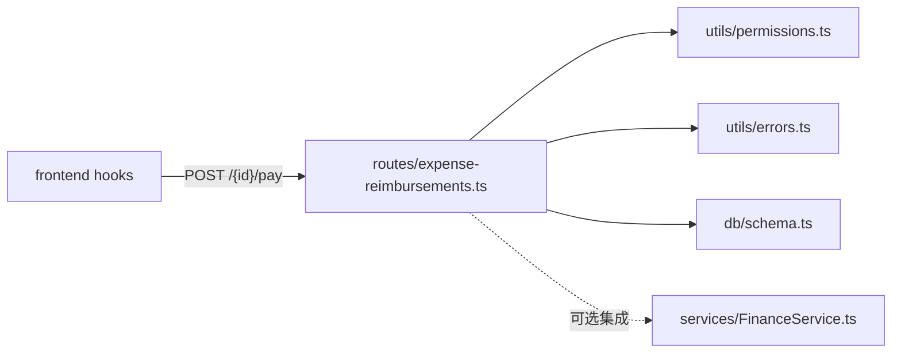

# 费用报销支付

<cite>
**本文引用的文件**
- [backend/src/routes/expense-reimbursements.ts](file://backend/src/routes/expense-reimbursements.ts)
- [backend/src/services/FinanceService.ts](file://backend/src/services/FinanceService.ts)
- [backend/src/utils/permissions.ts](file://backend/src/utils/permissions.ts)
- [backend/src/middleware/permission.ts](file://backend/src/middleware/permission.ts)
- [backend/src/utils/errors.ts](file://backend/src/utils/errors.ts)
- [backend/src/db/schema.ts](file://backend/src/db/schema.ts)
- [backend/src/index.ts](file://backend/src/index.ts)
- [backend/openapi.json](file://backend/openapi.json)
- [frontend/src/hooks/business/useExpenses.ts](file://frontend/src/hooks/business/useExpenses.ts)
- [frontend/src/features/hr/pages/ExpenseReimbursement.tsx](file://frontend/src/features/hr/pages/ExpenseReimbursement.tsx)
</cite>

## 目录
1. [简介](#简介)
2. [项目结构](#项目结构)
3. [核心组件](#核心组件)
4. [架构总览](#架构总览)
5. [详细组件分析](#详细组件分析)
6. [依赖关系分析](#依赖关系分析)
7. [性能考量](#性能考量)
8. [故障排查指南](#故障排查指南)
9. [结论](#结论)
10. [附录](#附录)

## 简介
本文档面向财务人员与开发者，系统性说明“费用报销支付”功能的技术实现与使用方法。重点覆盖：
- 通过 POST /api/expense-reimbursements/{id}/pay 执行支付的 API 调用流程
- 权限校验（finance:reimbursement:pay）与状态验证（仅 approved 可支付）
- 支付后状态变更为 paid 的机制
- 与财务现金流系统的集成点（现金流凭证与会计分录）
- 支付操作的不可逆性及其业务影响
- 财务人员批量处理已批准报销支付的建议方案与异常处理策略（如重复支付尝试）

## 项目结构
费用报销支付相关代码主要分布在后端路由层、服务层与数据库模式层，前端通过 hooks 触发支付请求并刷新界面。



图表来源
- [backend/src/index.ts](file://backend/src/index.ts#L110-L121)
- [backend/src/routes/expense-reimbursements.ts](file://backend/src/routes/expense-reimbursements.ts#L218-L262)
- [backend/src/utils/permissions.ts](file://backend/src/utils/permissions.ts#L80-L114)
- [backend/src/middleware/permission.ts](file://backend/src/middleware/permission.ts#L12-L39)
- [backend/src/utils/errors.ts](file://backend/src/utils/errors.ts#L34-L54)
- [backend/src/db/schema.ts](file://backend/src/db/schema.ts#L350-L368)
- [backend/src/services/FinanceService.ts](file://backend/src/services/FinanceService.ts#L71-L128)
- [frontend/src/hooks/business/useExpenses.ts](file://frontend/src/hooks/business/useExpenses.ts#L92-L102)
- [frontend/src/features/hr/pages/ExpenseReimbursement.tsx](file://frontend/src/features/hr/pages/ExpenseReimbursement.tsx#L30-L35)

章节来源
- [backend/src/index.ts](file://backend/src/index.ts#L110-L121)
- [backend/src/routes/expense-reimbursements.ts](file://backend/src/routes/expense-reimbursements.ts#L218-L262)
- [frontend/src/hooks/business/useExpenses.ts](file://frontend/src/hooks/business/useExpenses.ts#L92-L102)
- [frontend/src/features/hr/pages/ExpenseReimbursement.tsx](file://frontend/src/features/hr/pages/ExpenseReimbursement.tsx#L30-L35)

## 核心组件
- 路由层：提供 /api/expense-reimbursements/{id}/pay 接口，负责权限校验与状态验证，并将状态更新为 paid
- 权限工具：基于职位权限模型，校验 finance:reimbursement:pay 权限
- 错误处理：统一返回业务错误与通用错误
- 数据库模式：expenseReimbursements 表定义了状态字段与关键时间戳
- 服务层：FinanceService 提供创建现金流凭证与会计分录的能力，可用于支付后的财务入账
- 前端：通过 useExpenses 的 useMutation 触发支付请求，并在成功后刷新列表

章节来源
- [backend/src/routes/expense-reimbursements.ts](file://backend/src/routes/expense-reimbursements.ts#L218-L262)
- [backend/src/utils/permissions.ts](file://backend/src/utils/permissions.ts#L80-L114)
- [backend/src/utils/errors.ts](file://backend/src/utils/errors.ts#L34-L54)
- [backend/src/db/schema.ts](file://backend/src/db/schema.ts#L350-L368)
- [backend/src/services/FinanceService.ts](file://backend/src/services/FinanceService.ts#L71-L128)
- [frontend/src/hooks/business/useExpenses.ts](file://frontend/src/hooks/business/useExpenses.ts#L92-L102)

## 架构总览
费用报销支付的端到端流程如下：



图表来源
- [backend/src/routes/expense-reimbursements.ts](file://backend/src/routes/expense-reimbursements.ts#L241-L261)
- [backend/src/utils/permissions.ts](file://backend/src/utils/permissions.ts#L80-L114)
- [backend/src/db/schema.ts](file://backend/src/db/schema.ts#L350-L368)
- [backend/src/services/FinanceService.ts](file://backend/src/services/FinanceService.ts#L71-L128)

## 详细组件分析

### 支付接口：POST /api/expense-reimbursements/{id}/pay
- 请求路径：/api/expense-reimbursements/{id}/pay
- 方法：POST
- 权限要求：finance:reimbursement:pay
- 参数：路径参数 id（报销单 ID）
- 返回：JSON 对象 { success: boolean }
- 业务规则：
  - 仅当状态为 approved 时允许支付
  - 成功后将状态更新为 paid，并更新 updatedAt
  - 若不存在或状态不满足，抛出业务错误



图表来源
- [backend/src/routes/expense-reimbursements.ts](file://backend/src/routes/expense-reimbursements.ts#L241-L261)
- [backend/src/utils/errors.ts](file://backend/src/utils/errors.ts#L34-L54)

章节来源
- [backend/src/routes/expense-reimbursements.ts](file://backend/src/routes/expense-reimbursements.ts#L218-L262)
- [backend/openapi.json](file://backend/openapi.json#L16208-L16245)

### 权限检查机制
- 权限模型：基于职位的模块与子模块权限集合，支持通配符与模块访问范围
- 路由层直接调用 hasPermission(c, 'finance', 'reimbursement', 'pay') 进行校验
- 中间件提供 requirePermission 与 protectRoute 封装，便于复用

```mermaid
classDiagram
class PermissionUtils {
+hasPermission(c, module, subModule, action) bool
+requirePermission(module, subModule, action)
+protectRoute(module, subModule, action, handler)
}
class ExpenseReimbursementsRoutes {
+POST /{id}/pay
}
ExpenseReimbursementsRoutes --> PermissionUtils : "调用 hasPermission"
```

图表来源
- [backend/src/utils/permissions.ts](file://backend/src/utils/permissions.ts#L80-L114)
- [backend/src/middleware/permission.ts](file://backend/src/middleware/permission.ts#L12-L39)
- [backend/src/routes/expense-reimbursements.ts](file://backend/src/routes/expense-reimbursements.ts#L241-L245)

章节来源
- [backend/src/utils/permissions.ts](file://backend/src/utils/permissions.ts#L80-L114)
- [backend/src/middleware/permission.ts](file://backend/src/middleware/permission.ts#L12-L39)
- [backend/src/routes/expense-reimbursements.ts](file://backend/src/routes/expense-reimbursements.ts#L241-L245)

### 状态验证与更新逻辑
- expenseReimbursements 表的状态字段默认为 pending，经审批后变为 approved
- 支付前严格校验状态为 approved，否则拒绝
- 成功后将状态更新为 paid，并更新 updatedAt



图表来源
- [backend/src/db/schema.ts](file://backend/src/db/schema.ts#L350-L368)

章节来源
- [backend/src/db/schema.ts](file://backend/src/db/schema.ts#L350-L368)
- [backend/src/routes/expense-reimbursements.ts](file://backend/src/routes/expense-reimbursements.ts#L247-L261)

### 与财务现金流系统的集成点
- FinanceService 提供创建现金流凭证与会计分录的能力，典型流程：
  - 计算凭证号
  - 计算余额前后值
  - 插入 cash_flows 与 account_transactions
- 在报销支付后，可选择在此处生成支付凭证，形成闭环



图表来源
- [backend/src/services/FinanceService.ts](file://backend/src/services/FinanceService.ts#L71-L128)

章节来源
- [backend/src/services/FinanceService.ts](file://backend/src/services/FinanceService.ts#L71-L128)

### 不可逆性与业务影响
- 支付后状态变为 paid，通常意味着资金已付出，业务上不可逆
- 前端展示 paid 状态，用于提醒财务与申请人
- 重复支付尝试会被状态校验拦截，避免重复入账

章节来源
- [frontend/src/features/hr/pages/ExpenseReimbursement.tsx](file://frontend/src/features/hr/pages/ExpenseReimbursement.tsx#L30-L35)
- [backend/src/routes/expense-reimbursements.ts](file://backend/src/routes/expense-reimbursements.ts#L250-L259)

### 前端调用与状态展示
- 前端通过 useMutation 触发 POST /api/expense-reimbursements/{id}/pay
- 成功后刷新查询键，重新拉取列表
- 前端页面展示 paid 状态标签

章节来源
- [frontend/src/hooks/business/useExpenses.ts](file://frontend/src/hooks/business/useExpenses.ts#L92-L102)
- [frontend/src/features/hr/pages/ExpenseReimbursement.tsx](file://frontend/src/features/hr/pages/ExpenseReimbursement.tsx#L30-L35)

## 依赖关系分析
- 路由层依赖权限工具与错误处理
- 路由层读写 expenseReimbursements 表
- 服务层 FinanceService 与数据库交互，提供现金流凭证能力
- 前端通过 hooks 与后端交互



图表来源
- [backend/src/routes/expense-reimbursements.ts](file://backend/src/routes/expense-reimbursements.ts#L218-L262)
- [backend/src/utils/permissions.ts](file://backend/src/utils/permissions.ts#L80-L114)
- [backend/src/utils/errors.ts](file://backend/src/utils/errors.ts#L34-L54)
- [backend/src/db/schema.ts](file://backend/src/db/schema.ts#L350-L368)
- [backend/src/services/FinanceService.ts](file://backend/src/services/FinanceService.ts#L71-L128)
- [frontend/src/hooks/business/useExpenses.ts](file://frontend/src/hooks/business/useExpenses.ts#L92-L102)

章节来源
- [backend/src/routes/expense-reimbursements.ts](file://backend/src/routes/expense-reimbursements.ts#L218-L262)
- [backend/src/services/FinanceService.ts](file://backend/src/services/FinanceService.ts#L71-L128)
- [frontend/src/hooks/business/useExpenses.ts](file://frontend/src/hooks/business/useExpenses.ts#L92-L102)

## 性能考量
- 查询与更新均为单记录操作，复杂度低
- 建议在前端对批量支付场景进行节流与并发控制，避免频繁请求
- 如需在支付后生成现金流凭证，注意异步化与幂等设计，避免重复入账

## 故障排查指南
- 403 权限不足：确认当前用户职位是否具备 finance:reimbursement:pay 权限
- 404 报销单不存在：确认 id 是否正确
- 400 未审批通过或已支付：仅 approved 状态可支付；若已 paid 则无法再次支付
- 500 服务器内部错误：检查后端日志与数据库连接

章节来源
- [backend/src/utils/errors.ts](file://backend/src/utils/errors.ts#L34-L54)
- [backend/src/routes/expense-reimbursements.ts](file://backend/src/routes/expense-reimbursements.ts#L247-L261)

## 结论
费用报销支付功能以最小必要逻辑实现：严格的权限校验、状态前置验证与原子状态更新。支付后状态 paid 明确了业务上的不可逆性。结合 FinanceService，可在支付完成后生成现金流凭证，完善财务入账闭环。对于批量处理，建议前端侧进行合理的并发与重试策略，并在后端保持幂等与不可重复入账的设计。

## 附录

### API 定义摘要
- 路径：/api/expense-reimbursements/{id}/pay
- 方法：POST
- 权限：finance:reimbursement:pay
- 请求体：无
- 响应：{ success: boolean }

章节来源
- [backend/openapi.json](file://backend/openapi.json#L16208-L16245)
- [backend/src/routes/expense-reimbursements.ts](file://backend/src/routes/expense-reimbursements.ts#L218-L262)

### 前端调用示例（路径参考）
- 使用 useMutation 发起支付请求：[frontend/src/hooks/business/useExpenses.ts](file://frontend/src/hooks/business/useExpenses.ts#L92-L102)
- 成功后刷新查询键：[frontend/src/hooks/business/useExpenses.ts](file://frontend/src/hooks/business/useExpenses.ts#L98-L101)

### 批量处理建议（代码示例思路）
以下为“代码示例思路”，请根据团队技术栈与安全策略自行实现：
- 步骤
  - 前端：按筛选条件列出状态为 approved 的报销单
  - 批量提交：逐个调用 POST /api/expense-reimbursements/{id}/pay，设置并发上限
  - 幂等性：对同一 id 的重复支付请求，后端会因状态非 approved 而拒绝；前端可缓存已处理的 id，避免重复提交
  - 异常处理：捕获 400/403/404/500，提示用户并记录日志
  - 成功回调：刷新查询键，重新渲染列表
- 注意事项
  - 严格遵守权限校验与状态校验
  - 与 FinanceService 集成时，确保凭证生成的幂等与一致性

章节来源
- [backend/src/routes/expense-reimbursements.ts](file://backend/src/routes/expense-reimbursements.ts#L241-L261)
- [backend/src/services/FinanceService.ts](file://backend/src/services/FinanceService.ts#L71-L128)
- [frontend/src/hooks/business/useExpenses.ts](file://frontend/src/hooks/business/useExpenses.ts#L92-L102)