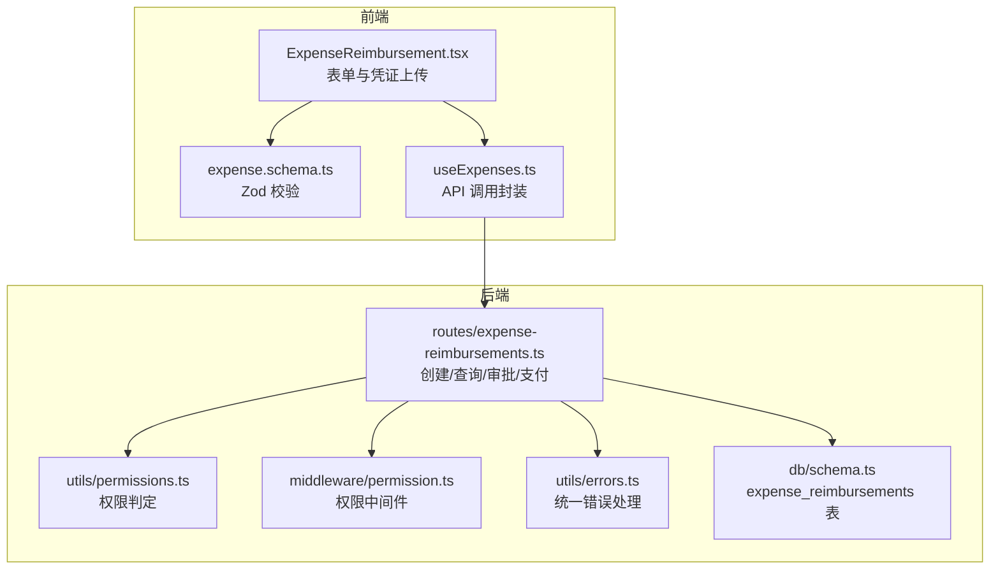
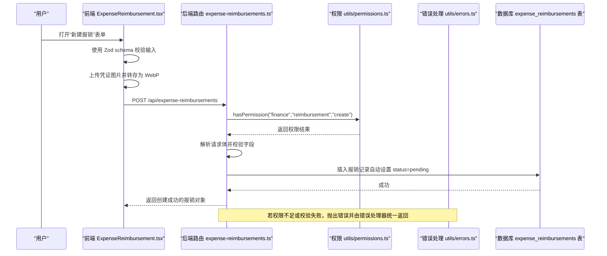
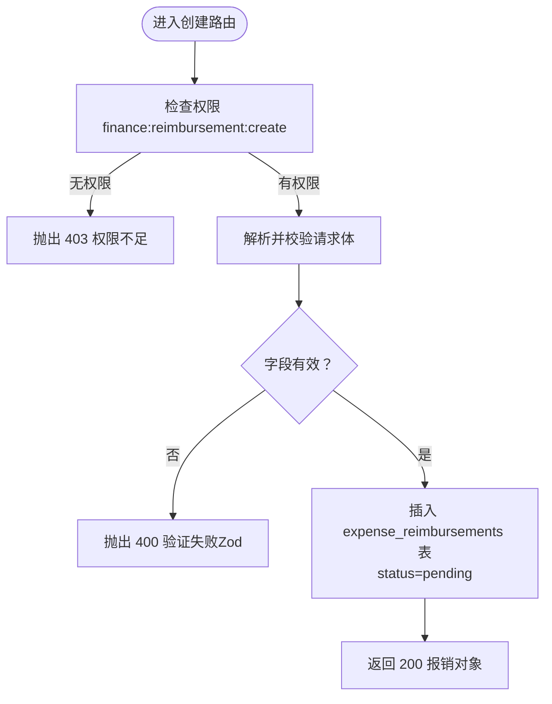
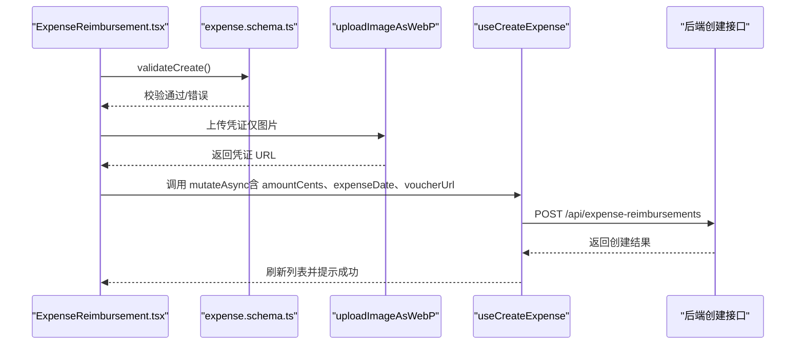
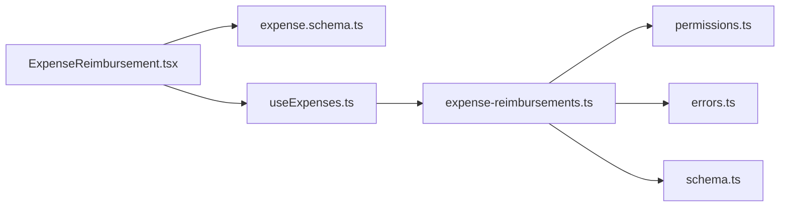

# 费用报销申请

<cite>
**本文引用的文件**
- [backend/src/routes/expense-reimbursements.ts](file://backend/src/routes/expense-reimbursements.ts)
- [backend/src/utils/permissions.ts](file://backend/src/utils/permissions.ts)
- [backend/src/middleware/permission.ts](file://backend/src/middleware/permission.ts)
- [backend/src/utils/errors.ts](file://backend/src/utils/errors.ts)
- [backend/src/db/schema.ts](file://backend/src/db/schema.ts)
- [frontend/src/features/hr/pages/ExpenseReimbursement.tsx](file://frontend/src/features/hr/pages/ExpenseReimbursement.tsx)
- [frontend/src/validations/expense.schema.ts](file://frontend/src/validations/expense.schema.ts)
- [frontend/src/hooks/business/useExpenses.ts](file://frontend/src/hooks/business/useExpenses.ts)
- [backend/openapi.json](file://backend/openapi.json)
</cite>

## 目录
1. [简介](#简介)
2. [项目结构](#项目结构)
3. [核心组件](#核心组件)
4. [架构总览](#架构总览)
5. [详细组件分析](#详细组件分析)
6. [依赖关系分析](#依赖关系分析)
7. [性能考量](#性能考量)
8. [故障排查指南](#故障排查指南)
9. [结论](#结论)
10. [附录](#附录)

## 简介
本文档面向“费用报销申请”功能，围绕后端路由与数据库模型、前端表单与校验、以及前后端协作流程进行系统化说明。重点覆盖：
- 通过 POST /api/expense-reimbursements 创建报销申请的请求体字段、含义与验证规则
- 前端使用 zod schema 的表单校验逻辑
- 后端权限检查（finance:reimbursement:create）与自动设置 pending 状态的机制
- 凭证上传处理与展示
- 不同类型报销（差旅费、办公用品等）的示例与错误处理策略（金额为负数、缺少必填字段等）

## 项目结构
该功能涉及后端路由、权限与错误处理、数据库模型，以及前端页面、表单校验与调用钩子。

图表来源
- [backend/src/routes/expense-reimbursements.ts](file://backend/src/routes/expense-reimbursements.ts#L1-L263)
- [backend/src/utils/permissions.ts](file://backend/src/utils/permissions.ts#L80-L114)
- [backend/src/middleware/permission.ts](file://backend/src/middleware/permission.ts#L1-L39)
- [backend/src/utils/errors.ts](file://backend/src/utils/errors.ts#L1-L114)
- [backend/src/db/schema.ts](file://backend/src/db/schema.ts#L352-L368)
- [frontend/src/features/hr/pages/ExpenseReimbursement.tsx](file://frontend/src/features/hr/pages/ExpenseReimbursement.tsx#L1-L741)
- [frontend/src/validations/expense.schema.ts](file://frontend/src/validations/expense.schema.ts#L1-L29)
- [frontend/src/hooks/business/useExpenses.ts](file://frontend/src/hooks/business/useExpenses.ts#L1-L103)

章节来源
- [backend/src/routes/expense-reimbursements.ts](file://backend/src/routes/expense-reimbursements.ts#L1-L263)
- [frontend/src/features/hr/pages/ExpenseReimbursement.tsx](file://frontend/src/features/hr/pages/ExpenseReimbursement.tsx#L1-L741)

## 核心组件
- 后端路由：负责接收创建报销申请的请求，执行权限检查、数据校验、写入数据库并返回标准响应。
- 前端页面：提供报销申请表单，包含金额、日期、类型、说明、凭证上传等字段；使用 Zod schema 进行前端校验。
- 权限系统：基于职位与部门模块配置，判断用户是否具备 finance:reimbursement:create 权限。
- 错误处理：统一捕获业务错误与 Zod 校验错误，输出标准化错误响应。
- 数据库模型：expense_reimbursements 表存储报销记录，含状态、金额、币种、凭证 URL 等字段。

章节来源
- [backend/src/routes/expense-reimbursements.ts](file://backend/src/routes/expense-reimbursements.ts#L11-L39)
- [backend/src/utils/permissions.ts](file://backend/src/utils/permissions.ts#L80-L114)
- [backend/src/utils/errors.ts](file://backend/src/utils/errors.ts#L34-L54)
- [backend/src/db/schema.ts](file://backend/src/db/schema.ts#L352-L368)
- [frontend/src/validations/expense.schema.ts](file://frontend/src/validations/expense.schema.ts#L1-L29)

## 架构总览
下图展示了从前端到后端再到数据库的整体流程，以及权限与错误处理的关键节点。

图表来源
- [backend/src/routes/expense-reimbursements.ts](file://backend/src/routes/expense-reimbursements.ts#L112-L157)
- [backend/src/utils/permissions.ts](file://backend/src/utils/permissions.ts#L88-L114)
- [backend/src/utils/errors.ts](file://backend/src/utils/errors.ts#L59-L112)
- [backend/src/db/schema.ts](file://backend/src/db/schema.ts#L352-L368)
- [frontend/src/features/hr/pages/ExpenseReimbursement.tsx](file://frontend/src/features/hr/pages/ExpenseReimbursement.tsx#L132-L164)

## 详细组件分析

### 后端：创建报销申请（POST /api/expense-reimbursements）
- 请求方法与路径：POST /api/expense-reimbursements
- 权限要求：finance:reimbursement:create
- 请求体字段与含义：
  - employeeId：员工标识
  - expenseType：报销类型（travel、office、meal、transport、other）
  - amountCents：金额（分），需大于 0
  - currencyId：币种，默认 CNY
  - expenseDate：报销日期（YYYY-MM-DD）
  - description：报销说明
  - voucherUrl：凭证 URL（可选，创建时可为空，后续可更新）
  - memo：备注（可选）
- 自动设置：
  - status 默认为 pending
  - createdBy 设置为当前用户 ID
  - createdAt/updatedAt 设置为当前时间戳
- 响应：
  - 返回完整的报销对象（包含自动生成的 id、status、时间戳等）

图表来源
- [backend/src/routes/expense-reimbursements.ts](file://backend/src/routes/expense-reimbursements.ts#L112-L157)
- [backend/src/utils/errors.ts](file://backend/src/utils/errors.ts#L59-L112)
- [backend/src/db/schema.ts](file://backend/src/db/schema.ts#L352-L368)

章节来源
- [backend/src/routes/expense-reimbursements.ts](file://backend/src/routes/expense-reimbursements.ts#L112-L157)
- [backend/src/utils/errors.ts](file://backend/src/utils/errors.ts#L59-L112)
- [backend/src/db/schema.ts](file://backend/src/db/schema.ts#L352-L368)

### 前端：表单校验与凭证上传
- 表单字段与校验（Zod）：
  - employeeId：必填
  - expenseType：必填
  - amount：最小值 0.01（前端校验）
  - expenseDate：必须是有效日期
  - description：必填
  - currencyId：必填
  - voucherUrl：可选（逻辑层校验，提交前必须上传凭证）
  - memo：可选
- 凭证上传：
  - 前端限制仅允许图片文件
  - 上传成功后返回 URL，随后在提交时随请求体发送
- 提交流程：
  - 校验通过后，先上传凭证，再调用后端创建接口
  - 金额以“元”为单位，提交前转换为“分”（amountCents）

图表来源
- [frontend/src/features/hr/pages/ExpenseReimbursement.tsx](file://frontend/src/features/hr/pages/ExpenseReimbursement.tsx#L132-L164)
- [frontend/src/validations/expense.schema.ts](file://frontend/src/validations/expense.schema.ts#L1-L29)
- [frontend/src/hooks/business/useExpenses.ts](file://frontend/src/hooks/business/useExpenses.ts#L44-L53)

章节来源
- [frontend/src/features/hr/pages/ExpenseReimbursement.tsx](file://frontend/src/features/hr/pages/ExpenseReimbursement.tsx#L132-L164)
- [frontend/src/validations/expense.schema.ts](file://frontend/src/validations/expense.schema.ts#L1-L29)
- [frontend/src/hooks/business/useExpenses.ts](file://frontend/src/hooks/business/useExpenses.ts#L44-L53)

### 权限检查与自动状态设置
- 权限检查：
  - 后端在创建接口中调用 hasPermission('finance','reimbursement','create')
  - 无权限直接抛出 403
- 自动状态：
  - 创建时 status 默认为 pending
  - 由后端写入，无需前端传入

章节来源
- [backend/src/routes/expense-reimbursements.ts](file://backend/src/routes/expense-reimbursements.ts#L138-L156)
- [backend/src/utils/permissions.ts](file://backend/src/utils/permissions.ts#L88-L114)

### 数据模型与字段映射
- expense_reimbursements 表关键字段：
  - id、employeeId、expenseType、amountCents、currencyId、expenseDate、description、voucherUrl、status、approvedBy、approvedAt、memo、createdBy、createdAt、updatedAt
- 字段默认值与约束：
  - status 默认 pending
  - currencyId 默认 CNY
  - amountCents 为整数（分）

章节来源
- [backend/src/db/schema.ts](file://backend/src/db/schema.ts#L352-L368)

### API 定义与 OpenAPI
- 创建接口：
  - 方法：POST
  - 路径：/api/expense-reimbursements
  - 请求体字段：expense_type、amountCents、expense_date、description、currencyId、voucherUrl、memo
  - 响应体：报销对象（包含 id、employeeId、expenseType、amountCents、expenseDate、description、status 等）
- 查询接口：
  - 方法：GET
  - 路径：/api/expense-reimbursements
  - 查询参数：employeeId、status
  - 响应体：报销对象数组

章节来源
- [backend/openapi.json](file://backend/openapi.json#L13257-L13440)
- [backend/openapi.json](file://backend/openapi.json#L15995-L16143)

## 依赖关系分析
- 前端依赖：
  - 表单校验依赖 expense.schema.ts
  - API 调用依赖 useExpenses.ts 中的 useMutation
- 后端依赖：
  - 路由依赖权限工具 hasPermission
  - 错误处理依赖统一错误类与中间件
  - 数据库依赖 expense_reimbursements 表结构

图表来源
- [frontend/src/features/hr/pages/ExpenseReimbursement.tsx](file://frontend/src/features/hr/pages/ExpenseReimbursement.tsx#L1-L741)
- [frontend/src/validations/expense.schema.ts](file://frontend/src/validations/expense.schema.ts#L1-L29)
- [frontend/src/hooks/business/useExpenses.ts](file://frontend/src/hooks/business/useExpenses.ts#L1-L103)
- [backend/src/routes/expense-reimbursements.ts](file://backend/src/routes/expense-reimbursements.ts#L1-L263)
- [backend/src/utils/permissions.ts](file://backend/src/utils/permissions.ts#L80-L114)
- [backend/src/utils/errors.ts](file://backend/src/utils/errors.ts#L1-L114)
- [backend/src/db/schema.ts](file://backend/src/db/schema.ts#L352-L368)

章节来源
- [backend/src/routes/expense-reimbursements.ts](file://backend/src/routes/expense-reimbursements.ts#L1-L263)
- [frontend/src/features/hr/pages/ExpenseReimbursement.tsx](file://frontend/src/features/hr/pages/ExpenseReimbursement.tsx#L1-L741)

## 性能考量
- 前端：
  - 金额转换与日期格式化在客户端完成，减少后端负担
  - 凭证上传采用 WebP 格式，有助于减小体积
- 后端：
  - 创建接口仅做必要校验与插入，避免复杂联表查询
  - 列表查询支持按 employeeId 与 status 过滤，便于前端分页与筛选

[本节为通用建议，不直接分析具体文件]

## 故障排查指南
- 常见错误与处理：
  - 400 验证失败：Zod 校验未通过（如金额为负、日期无效、必填字段缺失）
  - 403 权限不足：当前用户不具备 finance:reimbursement:create 权限
  - 404 资源不存在：审批/支付阶段对报销单进行查询时未找到
  - 400 业务错误：支付前未审批通过或已支付
- 前端常见问题：
  - 未上传凭证即提交：前端会在提交前强制要求上传图片凭证
  - 金额为负或小于最小值：前端 Zod 校验会阻止提交
  - 日期格式不正确：前端使用 dayjs 校验，确保格式为 YYYY-MM-DD

章节来源
- [backend/src/utils/errors.ts](file://backend/src/utils/errors.ts#L59-L112)
- [frontend/src/validations/expense.schema.ts](file://frontend/src/validations/expense.schema.ts#L1-L29)
- [frontend/src/features/hr/pages/ExpenseReimbursement.tsx](file://frontend/src/features/hr/pages/ExpenseReimbursement.tsx#L132-L164)

## 结论
本功能通过前后端协同实现了“费用报销申请”的完整闭环：前端负责表单校验与凭证上传，后端负责权限控制与数据持久化，并在创建时自动设置 pending 状态。OpenAPI 文档明确了请求与响应结构，配合统一错误处理，提升了系统的可观测性与一致性。

[本节为总结性内容，不直接分析具体文件]

## 附录

### 字段说明与验证规则
- employeeId：必填，字符串
- expenseType：必填，枚举值（travel、office、meal、transport、other）
- amountCents：必填，整数，> 0
- currencyId：可选，默认 CNY
- expenseDate：必填，字符串，YYYY-MM-DD
- description：必填，字符串，长度 ≥ 1
- voucherUrl：可选，字符串
- memo：可选，字符串

章节来源
- [backend/src/routes/expense-reimbursements.ts](file://backend/src/routes/expense-reimbursements.ts#L30-L39)
- [backend/openapi.json](file://backend/openapi.json#L13407-L13433)
- [frontend/src/validations/expense.schema.ts](file://frontend/src/validations/expense.schema.ts#L1-L29)

### 示例场景
- 差旅费（travel）：在前端选择类型为 travel，填写金额、日期、说明与凭证后提交
- 办公用品（office）：在前端选择类型为 office，填写对应信息后提交
- 其他类型（meal、transport、other）：同上，分别选择对应类型

章节来源
- [frontend/src/features/hr/pages/ExpenseReimbursement.tsx](file://frontend/src/features/hr/pages/ExpenseReimbursement.tsx#L446-L456)
- [backend/src/routes/expense-reimbursements.ts](file://backend/src/routes/expense-reimbursements.ts#L30-L39)