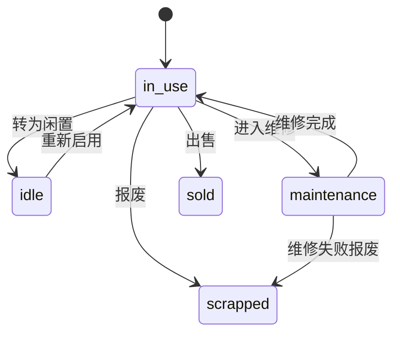
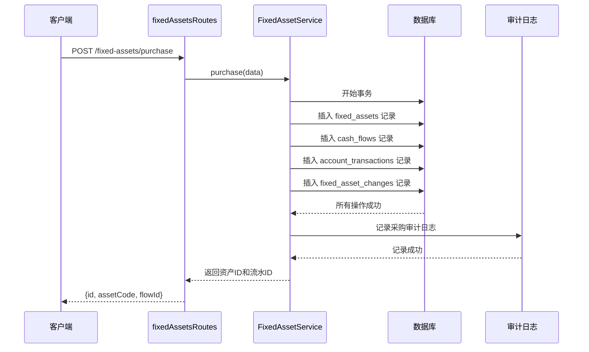
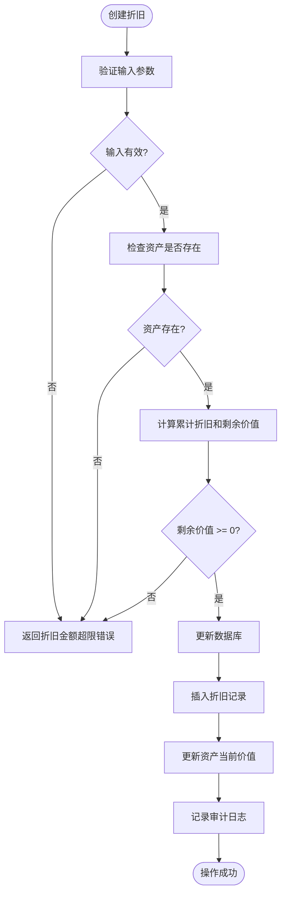
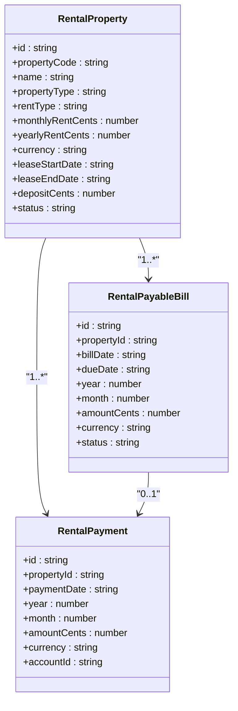
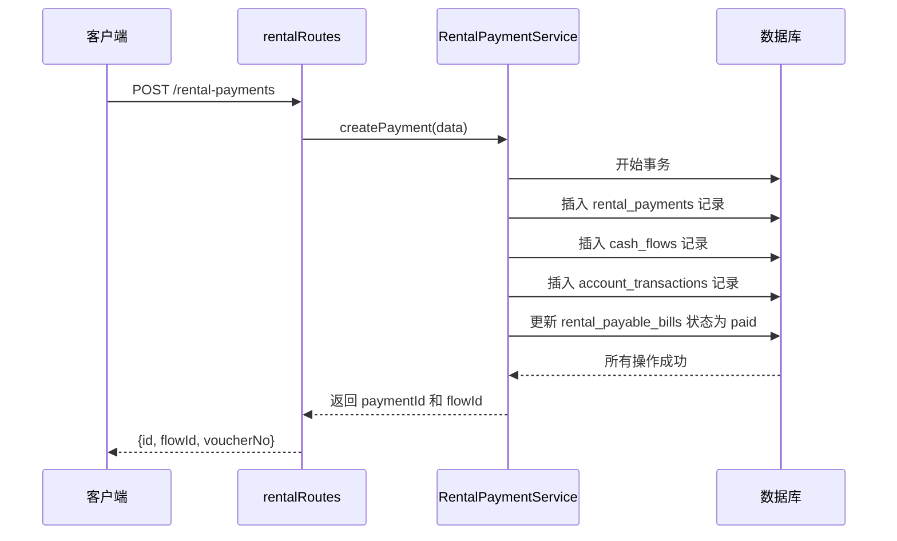
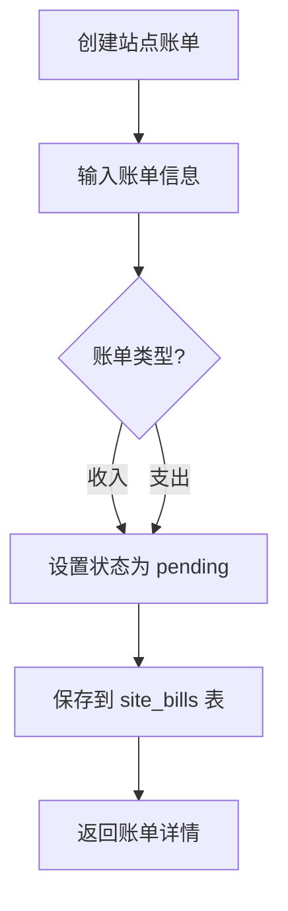
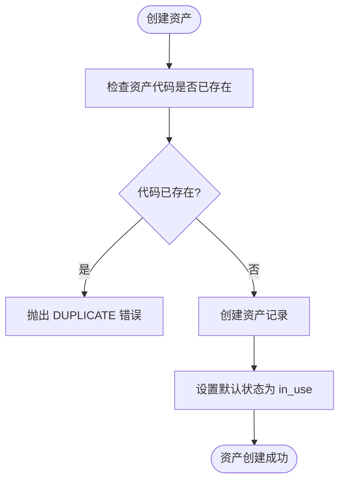
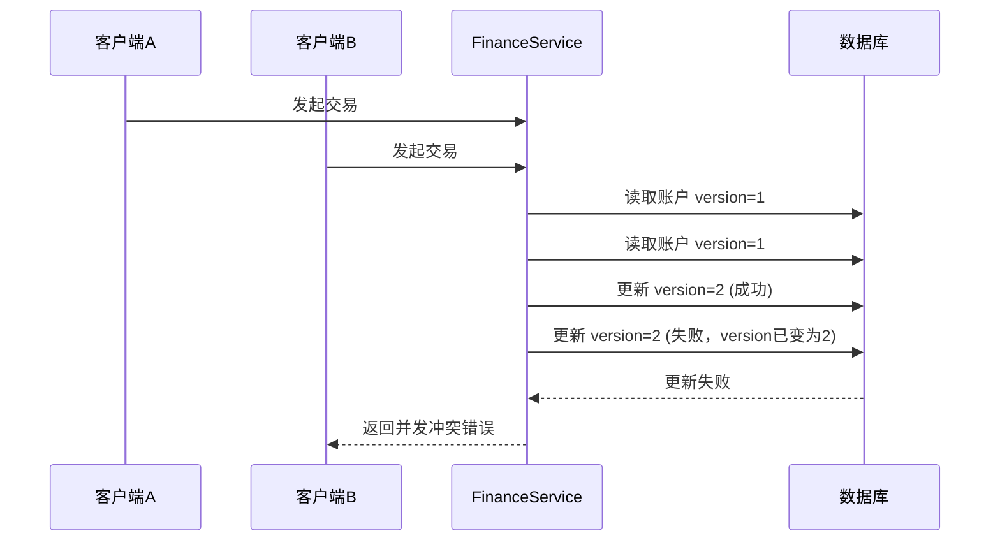

# 资产与租赁管理API

<cite>
**Referenced Files in This Document**   
- [fixed-assets.ts](file://backend/src/routes/v2/fixed-assets.ts)
- [rental.ts](file://backend/src/routes/v2/rental.ts)
- [site-bills.ts](file://backend/src/routes/v2/site-bills.ts)
- [FixedAssetService.ts](file://backend/src/services/FixedAssetService.ts)
- [FixedAssetDepreciationService.ts](file://backend/src/services/FixedAssetDepreciationService.ts)
- [RentalPropertyService.ts](file://backend/src/services/RentalPropertyService.ts)
- [RentalPaymentService.ts](file://backend/src/services/RentalPaymentService.ts)
- [business.schema.ts](file://backend/src/schemas/business.schema.ts)
- [schema.sql](file://backend/src/db/schema.sql)
</cite>

## 目录
1. [简介](#简介)
2. [资产全生命周期管理](#资产全生命周期管理)
3. [租赁合同与付款计划](#租赁合同与付款计划)
4. [站点账单生成与支付](#站点账单生成与支付)
5. [业务规则实现细节](#业务规则实现细节)
6. [幂等性设计](#幂等性设计)

## 简介
本API文档详细说明了财务系统中的固定资产与租赁管理模块。该模块涵盖了资产登记、折旧计算、调拨、处置以及物业租赁、账单管理、宿舍分配等核心功能。文档重点解析了资产全生命周期管理接口的状态转换机制、租赁合同与付款计划的关联逻辑，以及站点账单的生成与支付流程。

## 资产全生命周期管理

本节详细说明`fixed-assets.ts`中定义的固定资产全生命周期管理接口，包括采购、折旧、报废等操作的状态转换。

### 资产登记与查询
系统提供完整的资产CRUD（创建、读取、更新、删除）接口，支持通过资产代码、名称、状态、部门等条件进行查询。

**资产状态**
- **in_use (在用)**: 资产已采购并投入使用，这是创建资产时的默认状态。
- **idle (闲置)**: 资产当前未被使用。
- **maintenance (维修中)**: 资产正在维修。
- **scrapped (已报废)**: 资产已报废处理。
- **sold (已出售)**: 资产已出售。

**Section sources**
- [fixed-assets.ts](file://backend/src/routes/v2/fixed-assets.ts#L32-L115)
- [FixedAssetService.ts](file://backend/src/services/FixedAssetService.ts#L25-L88)

### 资产采购与流水生成
`/fixed-assets/purchase` 接口用于采购固定资产，该操作会同时创建资产记录和对应的财务流水。

**Diagram sources**
- [fixed-assets.ts](file://backend/src/routes/v2/fixed-assets.ts#L614-L692)
- [FixedAssetService.ts](file://backend/src/services/FixedAssetService.ts#L313-L468)

### 折旧计算与处理
`/fixed-assets/{id}/depreciation` 接口用于为固定资产创建折旧记录。系统会自动计算累计折旧和剩余价值，并更新资产的当前价值。

**Diagram sources**
- [fixed-assets.ts](file://backend/src/routes/v2/fixed-assets.ts#L487-L546)
- [FixedAssetDepreciationService.ts](file://backend/src/services/FixedAssetDepreciationService.ts#L20-L76)

### 资产调拨与处置
系统支持资产的内部调拨和外部处置（出售）。

#### 资产调拨
`/fixed-assets/{id}/transfer` 接口用于转移资产的使用部门、位置或保管人。此操作会自动创建一条变更记录（`fixed_asset_changes`），记录变更前后的状态。

#### 资产出售
`/fixed-assets/{id}/sell` 接口用于出售资产。此操作会：
1.  更新资产状态为`sold`。
2.  创建一笔收入类型的财务流水。
3.  创建一条资产变更记录，记录出售详情。

**Section sources**
- [fixed-assets.ts](file://backend/src/routes/v2/fixed-assets.ts#L548-L765)
- [FixedAssetService.ts](file://backend/src/services/FixedAssetService.ts#L469-L607)

## 租赁合同与付款计划

本节解释`rental.ts`中租赁合同与付款计划的关联机制。

### 租赁物业管理
系统通过`rental_properties`表管理所有租赁物业（如办公室、宿舍、仓库）。每个物业记录包含租赁类型（月租/年租）、租金、租期、押金等关键信息。

**租赁物业状态**
- **active (租用中)**: 租约有效，物业正在使用。
- **expired (已到期)**: 租约已过期。
- **terminated (已终止)**: 租约提前终止。

**Diagram sources**
- [rental.ts](file://backend/src/routes/v2/rental.ts#L24-L482)
- [RentalPropertyService.ts](file://backend/src/services/RentalPropertyService.ts#L17-L239)

### 付款计划与账单生成
系统通过`generatePayableBills`接口自动生成应付账单。其逻辑如下：
1.  查询所有状态为`active`且有租期的物业。
2.  根据物业的付款周期（如每月一付、每季度一付）和付款日，计算下一个应付日期。
3.  如果应付日期在当前日期之前或当天，则生成一张新的应付账单（`rentalPayableBills`），状态为`unpaid`。

当用户通过`createPayment`接口支付租金时，系统会：
1.  创建`rental_payments`记录。
2.  创建对应的财务流水和账户交易记录。
3.  **自动更新**关联的应付账单状态为`paid`。

**Diagram sources**
- [rental.ts](file://backend/src/routes/v2/rental.ts#L717-L763)
- [RentalPaymentService.ts](file://backend/src/services/RentalPaymentService.ts#L244-L343)

## 站点账单生成与支付

本节说明`site-bills.ts`中站点账单的生成与支付流程。

### 站点账单管理
`site-bills.ts`模块管理与特定站点相关的收入和支出账单，如水电费、物业费等。

**账单类型**
- **income (收入)**: 站点产生的收入。
- **expense (支出)**: 站点产生的支出。

系统提供创建、查询、更新和删除站点账单的接口。当账单状态为`pending`时，表示待支付；支付后状态更新为`paid`。

**Section sources**
- [site-bills.ts](file://backend/src/routes/v2/site-bills.ts#L52-L279)

## 业务规则实现细节

本节详细说明资产编号生成规则、折旧方法配置、租赁押金处理等业务规则的实现。

### 资产编号生成规则
系统通过`assetCode`字段管理资产编号。核心规则是**唯一性校验**：
- 在创建或采购资产时，服务层会先查询`fixed_assets`表，检查`assetCode`是否已存在。
- 如果存在，则抛出`DUPLICATE`错误，阻止重复创建。

**Section sources**
- [FixedAssetService.ts](file://backend/src/services/FixedAssetService.ts#L201-L208)

### 折旧方法配置
系统允许在创建资产时指定折旧方法（`depreciationMethod`），但目前的折旧计算逻辑（在`FixedAssetDepreciationService`中）是**固定**的，即直接指定折旧金额。这意味着：
- `depreciationMethod`字段被存储，但未用于自动计算。
- 实际的折旧金额由用户在创建折旧记录时手动输入。

### 租赁押金处理
租赁押金（`depositCents`）在系统中作为物业的一个属性被记录。其处理逻辑如下：
- **记录**: 在创建或更新租赁物业时，可以设置押金金额。
- **管理**: 押金本身不生成财务流水或账单。它被视为一笔待退还的款项，其退还通常通过其他财务流程（如费用报销或直接付款）处理。

## 幂等性设计

本系统通过多种机制防止重复创建，确保操作的幂等性。

### 唯一性约束
核心机制是数据库层面的唯一性约束和应用层的重复检查。
- **资产代码**: `fixed_assets`表的`assetCode`字段在应用层有唯一性检查。
- **租赁付款**: `rental_payments`表通过`property_id`, `year`, `month`的组合来防止对同一物业的同一月份重复付款。

### 乐观锁
对于账户余额等需要并发控制的场景，系统使用了乐观锁机制。
- 在`FinanceService`中，`accounts`表有一个`version`字段。
- 当进行财务操作时，会检查当前`version`是否与预期一致，若不一致则抛出并发冲突错误，要求客户端重试。

**Section sources**
- [FixedAssetService.ts](file://backend/src/services/FixedAssetService.ts#L201-L208)
- [RentalPaymentService.ts](file://backend/src/services/RentalPaymentService.ts#L76-L88)
- [optimistic-lock.ts](file://backend/src/utils/optimistic-lock.ts#L16-L32)