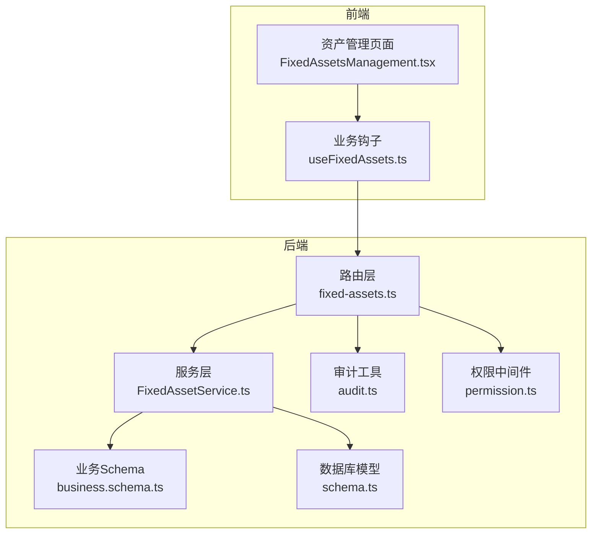
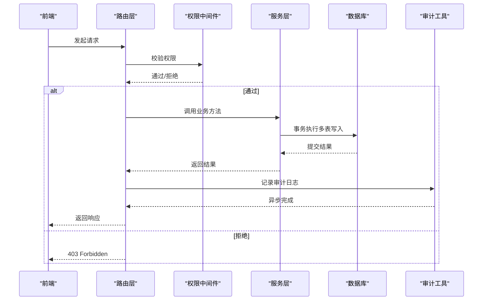
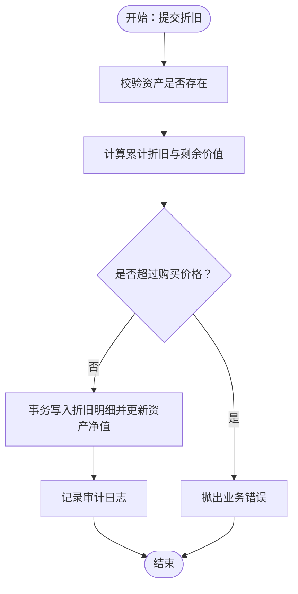
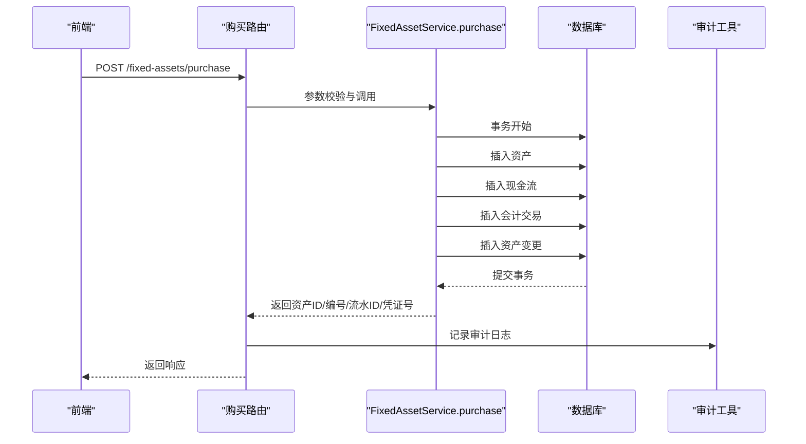
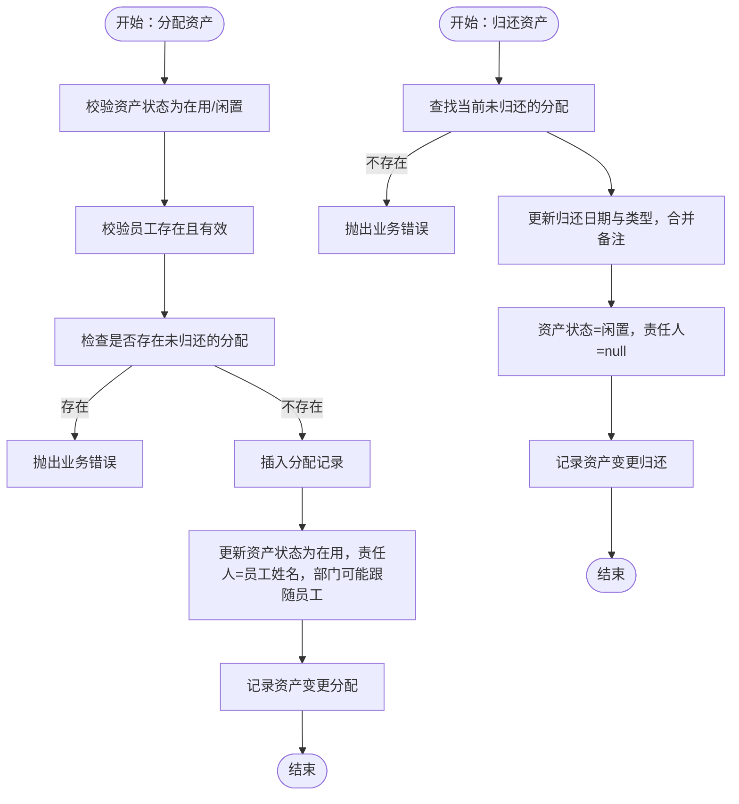
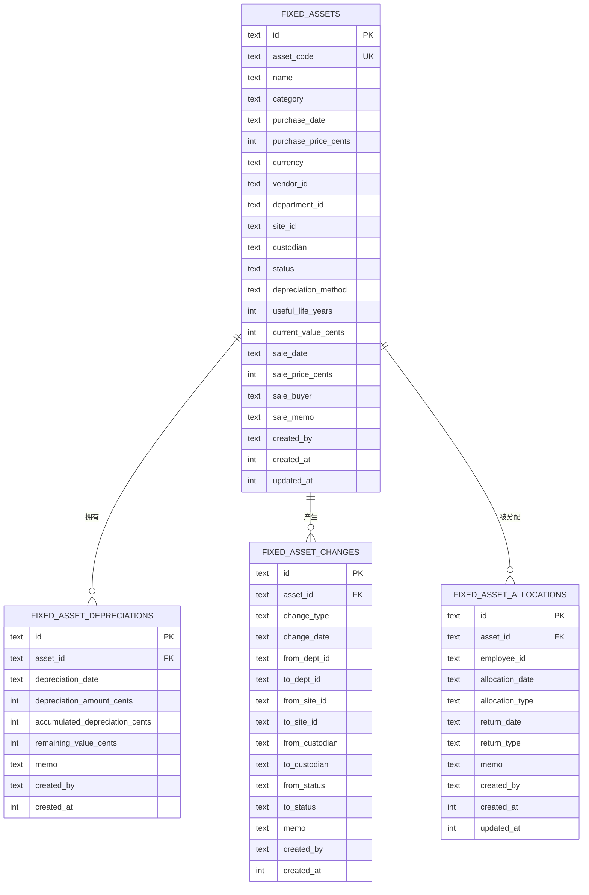
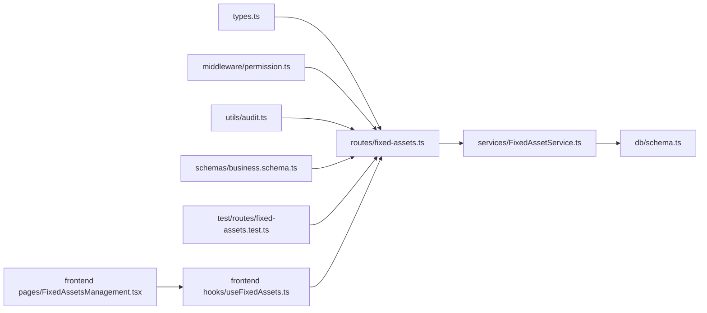

# 固定资产API

<cite>
**本文引用的文件**
- [backend/src/routes/fixed-assets.ts](file://backend/src/routes/fixed-assets.ts)
- [backend/src/services/FixedAssetService.ts](file://backend/src/services/FixedAssetService.ts)
- [backend/src/db/schema.ts](file://backend/src/db/schema.ts)
- [backend/src/schemas/business.schema.ts](file://backend/src/schemas/business.schema.ts)
- [backend/src/utils/audit.ts](file://backend/src/utils/audit.ts)
- [backend/src/middleware/permission.ts](file://backend/src/middleware/permission.ts)
- [backend/src/types.ts](file://backend/src/types.ts)
- [backend/test/routes/fixed-assets.test.ts](file://backend/test/routes/fixed-assets.test.ts)
- [frontend/src/features/assets/pages/FixedAssetsManagement.tsx](file://frontend/src/features/assets/pages/FixedAssetsManagement.tsx)
- [frontend/src/hooks/business/useFixedAssets.ts](file://frontend/src/hooks/business/useFixedAssets.ts)
</cite>

## 目录
1. [简介](#简介)
2. [项目结构](#项目结构)
3. [核心组件](#核心组件)
4. [架构总览](#架构总览)
5. [详细组件分析](#详细组件分析)
6. [依赖关系分析](#依赖关系分析)
7. [性能考量](#性能考量)
8. [故障排查指南](#故障排查指南)
9. [结论](#结论)
10. [附录](#附录)

## 简介
本文件面向固定资产全生命周期管理，覆盖采购、分配、折旧、转移与处置等环节。文档聚焦后端路由与服务层实现，解释各接口的请求/响应结构、权限控制、审计日志与财务流水集成，并给出前端调用与展示要点。读者无需深入代码即可理解资产从创建到处置的完整流程。

## 项目结构
- 后端采用 Hono + Drizzle ORM，路由位于 routes 层，业务逻辑封装在 services 层，数据模型定义在 db/schema.ts 中。
- 前端通过 React Query 钩子调用后端接口，页面组件负责表单校验与交互。

图表来源
- [backend/src/routes/fixed-assets.ts](file://backend/src/routes/fixed-assets.ts#L1-L730)
- [backend/src/services/FixedAssetService.ts](file://backend/src/services/FixedAssetService.ts#L1-L779)
- [backend/src/db/schema.ts](file://backend/src/db/schema.ts#L464-L532)
- [backend/src/schemas/business.schema.ts](file://backend/src/schemas/business.schema.ts#L248-L1016)
- [backend/src/utils/audit.ts](file://backend/src/utils/audit.ts#L1-L92)
- [backend/src/middleware/permission.ts](file://backend/src/middleware/permission.ts#L1-L39)

章节来源
- [backend/src/routes/fixed-assets.ts](file://backend/src/routes/fixed-assets.ts#L1-L730)
- [backend/src/services/FixedAssetService.ts](file://backend/src/services/FixedAssetService.ts#L1-L779)
- [backend/src/db/schema.ts](file://backend/src/db/schema.ts#L464-L532)
- [backend/src/schemas/business.schema.ts](file://backend/src/schemas/business.schema.ts#L248-L1016)
- [backend/src/utils/audit.ts](file://backend/src/utils/audit.ts#L1-L92)
- [backend/src/middleware/permission.ts](file://backend/src/middleware/permission.ts#L1-L39)

## 核心组件
- 路由层：定义所有固定资产相关接口，含列表、详情、创建、更新、删除、折旧、转移、购买（带财务）、出售（带财务）、分配、归还等。
- 服务层：封装 CRUD、业务规则校验、事务处理、财务流水生成、审计日志记录。
- 数据模型：固定资产管理表、折旧明细表、资产变更记录表、资产分配表等。
- 业务Schema：统一输入输出校验，保证前后端契约一致。
- 审计与权限：统一审计日志记录与权限拦截。

章节来源
- [backend/src/routes/fixed-assets.ts](file://backend/src/routes/fixed-assets.ts#L1-L730)
- [backend/src/services/FixedAssetService.ts](file://backend/src/services/FixedAssetService.ts#L1-L779)
- [backend/src/db/schema.ts](file://backend/src/db/schema.ts#L464-L532)
- [backend/src/schemas/business.schema.ts](file://backend/src/schemas/business.schema.ts#L248-L1016)
- [backend/src/utils/audit.ts](file://backend/src/utils/audit.ts#L1-L92)
- [backend/src/middleware/permission.ts](file://backend/src/middleware/permission.ts#L1-L39)

## 架构总览
固定资产API遵循“路由-服务-数据”分层设计，所有写操作均通过权限中间件校验，读取操作进行用户岗位校验；服务层在关键业务点开启事务，确保数据一致性；财务相关操作与现金流表、会计交易表联动；审计日志异步记录，不影响主流程。

图表来源
- [backend/src/routes/fixed-assets.ts](file://backend/src/routes/fixed-assets.ts#L298-L327)
- [backend/src/middleware/permission.ts](file://backend/src/middleware/permission.ts#L1-L39)
- [backend/src/services/FixedAssetService.ts](file://backend/src/services/FixedAssetService.ts#L417-L539)
- [backend/src/utils/audit.ts](file://backend/src/utils/audit.ts#L61-L92)

## 详细组件分析

### 接口总览与权限
- 列表资产：GET /fixed-assets（支持搜索、状态、部门、分类过滤）
- 获取资产详情：GET /fixed-assets/{id}
- 创建资产：POST /fixed-assets（需权限：asset.fixed.create）
- 更新资产：PUT /fixed-assets/{id}（需权限：asset.fixed.update）
- 删除资产：DELETE /fixed-assets/{id}（需权限：asset.fixed.delete）
- 创建折旧：POST /fixed-assets/{id}/depreciation（需权限：asset.fixed.depreciate）
- 资产转移：POST /fixed-assets/{id}/transfer（需权限：asset.fixed.transfer）
- 购买资产（带财务）：POST /fixed-assets/purchase（需权限：asset.fixed.create）
- 出售资产（带财务）：POST /fixed-assets/{id}/sell（需权限：asset.fixed.dispose）
- 分配资产：POST /fixed-assets/allocate（需权限：asset.fixed.allocate）
- 归还资产：POST /fixed-assets/{id}/return（需权限：asset.fixed.allocate）

章节来源
- [backend/src/routes/fixed-assets.ts](file://backend/src/routes/fixed-assets.ts#L29-L94)
- [backend/src/routes/fixed-assets.ts](file://backend/src/routes/fixed-assets.ts#L177-L267)
- [backend/src/routes/fixed-assets.ts](file://backend/src/routes/fixed-assets.ts#L269-L411)
- [backend/src/routes/fixed-assets.ts](file://backend/src/routes/fixed-assets.ts#L413-L509)
- [backend/src/routes/fixed-assets.ts](file://backend/src/routes/fixed-assets.ts#L511-L576)
- [backend/src/routes/fixed-assets.ts](file://backend/src/routes/fixed-assets.ts#L578-L635)
- [backend/src/routes/fixed-assets.ts](file://backend/src/routes/fixed-assets.ts#L637-L729)
- [backend/src/middleware/permission.ts](file://backend/src/middleware/permission.ts#L1-L39)

### 资产创建与更新
- 创建资产
  - 请求体：资产编号、名称、类别、购买日期、购买价格（分）、币种、部门、站点、供应商、责任人、状态、折旧方法、使用年限、当前净值、备注等。
  - 服务层：校验资产编号唯一性，初始化状态为在用，当前净值默认等于购买价格。
  - 审计：记录创建动作与关键字段摘要。
- 更新资产
  - 支持修改名称、类别、购买日期、购买价格、币种、部门、站点、供应商、责任人、状态、备注等。
  - 若状态/部门/站点/责任人发生变更，自动记录变更日志。
  - 审计：记录更新动作与请求体。

章节来源
- [backend/src/routes/fixed-assets.ts](file://backend/src/routes/fixed-assets.ts#L269-L327)
- [backend/src/routes/fixed-assets.ts](file://backend/src/routes/fixed-assets.ts#L329-L411)
- [backend/src/services/FixedAssetService.ts](file://backend/src/services/FixedAssetService.ts#L218-L301)
- [backend/src/services/FixedAssetService.ts](file://backend/src/services/FixedAssetService.ts#L280-L301)
- [backend/src/schemas/business.schema.ts](file://backend/src/schemas/business.schema.ts#L248-L286)
- [backend/src/utils/audit.ts](file://backend/src/utils/audit.ts#L61-L92)

### 资产删除
- 限制条件：若存在折旧记录则禁止删除。
- 事务：删除资产的同时级联删除其变更记录。
- 审计：记录删除动作。

章节来源
- [backend/src/routes/fixed-assets.ts](file://backend/src/routes/fixed-assets.ts#L382-L411)
- [backend/src/services/FixedAssetService.ts](file://backend/src/services/FixedAssetService.ts#L304-L323)

### 折旧管理（createDepreciation）
- 接口：POST /fixed-assets/{id}/depreciation
- 输入：折旧日期、折旧金额（分）、备注
- 业务逻辑：
  - 校验资产存在性
  - 计算累计折旧与剩余价值，防止超过购买价格
  - 写入折旧明细表并同步更新资产当前净值
  - 审计：记录折旧动作与金额
- 前端展示：详情页“折旧记录”Tab 展示历史折旧明细。

图表来源
- [backend/src/routes/fixed-assets.ts](file://backend/src/routes/fixed-assets.ts#L413-L458)
- [backend/src/services/FixedAssetService.ts](file://backend/src/services/FixedAssetService.ts#L325-L369)
- [backend/src/utils/audit.ts](file://backend/src/utils/audit.ts#L61-L92)

章节来源
- [backend/src/routes/fixed-assets.ts](file://backend/src/routes/fixed-assets.ts#L413-L458)
- [backend/src/services/FixedAssetService.ts](file://backend/src/services/FixedAssetService.ts#L325-L369)

### 资产转移（transfer）
- 接口：POST /fixed-assets/{id}/transfer
- 输入：调拨日期、目标部门、目标站点、目标责任人、备注
- 业务逻辑：
  - 至少提供一个变更字段（部门/站点/责任人）
  - 写入资产变更记录，同时更新资产的目标字段
  - 审计：记录转移动作与目标字段

章节来源
- [backend/src/routes/fixed-assets.ts](file://backend/src/routes/fixed-assets.ts#L460-L509)
- [backend/src/services/FixedAssetService.ts](file://backend/src/services/FixedAssetService.ts#L371-L415)
- [backend/src/schemas/business.schema.ts](file://backend/src/schemas/business.schema.ts#L691-L700)

### 购买（purchase）与财务流水（flows）
- 接口：POST /fixed-assets/purchase
- 输入：资产编号、名称、类别、购买日期、购买价格（分）、币种、账户ID、费用科目ID、供应商、部门、站点、责任人、备注、凭证URL、折旧方法、使用年限
- 业务逻辑（事务内）：
  - 校验账户有效性与币种匹配
  - 创建资产记录（状态为在用，当前净值=购买价格）
  - 生成凭证号（按业务日期计数序列）
  - 写入现金流表（支出）
  - 写入会计交易表（余额前/后计算）
  - 记录资产变更（购买）
  - 审计：记录购买动作与金额
- 输出：资产ID、资产编号、流水ID、凭证号

图表来源
- [backend/src/routes/fixed-assets.ts](file://backend/src/routes/fixed-assets.ts#L511-L576)
- [backend/src/services/FixedAssetService.ts](file://backend/src/services/FixedAssetService.ts#L417-L539)
- [backend/src/utils/audit.ts](file://backend/src/utils/audit.ts#L61-L92)

章节来源
- [backend/src/routes/fixed-assets.ts](file://backend/src/routes/fixed-assets.ts#L511-L576)
- [backend/src/services/FixedAssetService.ts](file://backend/src/services/FixedAssetService.ts#L417-L539)
- [backend/src/schemas/business.schema.ts](file://backend/src/schemas/business.schema.ts#L954-L973)

### 出售（sell）与财务处理
- 接口：POST /fixed-assets/{id}/sell
- 输入：出售日期、出售价格（分）、币种、收入账户ID、收入科目ID、凭证URL、买家、卖方备注、备注
- 业务逻辑（事务内）：
  - 校验资产存在且未出售
  - 校验账户有效性与币种匹配
  - 更新资产状态为已出售，记录出售信息
  - 生成凭证号（按业务日期计数序列）
  - 写入现金流表（收入）
  - 写入会计交易表（余额前/后计算）
  - 记录资产变更（出售）
  - 审计：记录出售动作与价格

章节来源
- [backend/src/routes/fixed-assets.ts](file://backend/src/routes/fixed-assets.ts#L578-L635)
- [backend/src/services/FixedAssetService.ts](file://backend/src/services/FixedAssetService.ts#L541-L642)
- [backend/src/schemas/business.schema.ts](file://backend/src/schemas/business.schema.ts#L721-L733)

### 分配（allocate）与归还（return）
- 分配
  - 接口：POST /fixed-assets/allocate
  - 规则：仅对“在用/闲置”状态资产允许分配；同一资产同一时间仅允许一次未归还的分配
  - 动作：创建分配记录，更新资产状态为在用，责任人更新为员工姓名，部门可能随员工所在部门变化
  - 记录资产变更（分配）
- 归还
  - 接口：POST /fixed-assets/{id}/return
  - 规则：仅对当前未归还的分配允许归还
  - 动作：更新分配记录的归还日期与类型，资产状态回退为闲置，责任人清空
  - 记录资产变更（归还）

图表来源
- [backend/src/routes/fixed-assets.ts](file://backend/src/routes/fixed-assets.ts#L637-L729)
- [backend/src/services/FixedAssetService.ts](file://backend/src/services/FixedAssetService.ts#L644-L779)

章节来源
- [backend/src/routes/fixed-assets.ts](file://backend/src/routes/fixed-assets.ts#L637-L729)
- [backend/src/services/FixedAssetService.ts](file://backend/src/services/FixedAssetService.ts#L644-L779)

### 查询接口
- 列表资产：GET /fixed-assets（支持 search、status、departmentId、category）
- 列表分类：GET /fixed-assets/categories
- 列表分配：GET /fixed-assets/allocations（支持 assetId、employeeId、returned）
- 资产详情：GET /fixed-assets/{id}（包含折旧与变更历史）

章节来源
- [backend/src/routes/fixed-assets.ts](file://backend/src/routes/fixed-assets.ts#L29-L94)
- [backend/src/routes/fixed-assets.ts](file://backend/src/routes/fixed-assets.ts#L97-L121)
- [backend/src/routes/fixed-assets.ts](file://backend/src/routes/fixed-assets.ts#L123-L175)
- [backend/src/routes/fixed-assets.ts](file://backend/src/routes/fixed-assets.ts#L177-L267)

### 数据模型与关系
- 固定资产表：资产基础信息、当前净值、状态、折旧相关信息
- 折旧明细表：每次折旧的日期、金额、累计折旧、剩余价值
- 资产变更表：记录状态变更、转移、分配、归还、购买、出售等
- 资产分配表：记录分配与归还情况

图表来源
- [backend/src/db/schema.ts](file://backend/src/db/schema.ts#L464-L532)

章节来源
- [backend/src/db/schema.ts](file://backend/src/db/schema.ts#L464-L532)

### 审计日志与权限控制
- 审计：所有写操作均调用审计工具异步记录，包含操作者、实体、实体ID、时间、详情、IP与IP归属地。
- 权限：路由层通过保护中间件校验模块/子模块/动作权限，未授权直接返回403。

章节来源
- [backend/src/utils/audit.ts](file://backend/src/utils/audit.ts#L1-L92)
- [backend/src/middleware/permission.ts](file://backend/src/middleware/permission.ts#L1-L39)
- [backend/src/routes/fixed-assets.ts](file://backend/src/routes/fixed-assets.ts#L298-L327)

### 前端对接要点
- 列表与详情：通过 React Query 钩子拉取数据，支持分页与筛选。
- 表单校验：前端对日期、金额、币种等进行格式化与校验，再调用后端接口。
- 操作反馈：成功后刷新缓存，弹出提示，必要时打开详情查看折旧与变更历史。

章节来源
- [frontend/src/features/assets/pages/FixedAssetsManagement.tsx](file://frontend/src/features/assets/pages/FixedAssetsManagement.tsx#L1-L523)
- [frontend/src/hooks/business/useFixedAssets.ts](file://frontend/src/hooks/business/useFixedAssets.ts#L1-L156)

## 依赖关系分析

图表来源
- [backend/src/types.ts](file://backend/src/types.ts#L1-L88)
- [backend/src/routes/fixed-assets.ts](file://backend/src/routes/fixed-assets.ts#L1-L730)
- [backend/src/middleware/permission.ts](file://backend/src/middleware/permission.ts#L1-L39)
- [backend/src/utils/audit.ts](file://backend/src/utils/audit.ts#L1-L92)
- [backend/src/schemas/business.schema.ts](file://backend/src/schemas/business.schema.ts#L248-L1016)
- [backend/src/services/FixedAssetService.ts](file://backend/src/services/FixedAssetService.ts#L1-L779)
- [backend/src/db/schema.ts](file://backend/src/db/schema.ts#L464-L532)
- [backend/test/routes/fixed-assets.test.ts](file://backend/test/routes/fixed-assets.test.ts#L1-L323)
- [frontend/src/hooks/business/useFixedAssets.ts](file://frontend/src/hooks/business/useFixedAssets.ts#L1-L156)
- [frontend/src/features/assets/pages/FixedAssetsManagement.tsx](file://frontend/src/features/assets/pages/FixedAssetsManagement.tsx#L1-L523)

章节来源
- [backend/src/types.ts](file://backend/src/types.ts#L1-L88)
- [backend/test/routes/fixed-assets.test.ts](file://backend/test/routes/fixed-assets.test.ts#L1-L323)

## 性能考量
- 查询优化：列表接口支持多条件过滤，建议在高频字段上建立索引（如部门ID、状态、创建时间）。
- 批量操作：前端支持批量删除，后端未提供批量删除接口，建议在业务允许范围内考虑批量接口以减少往返。
- 事务边界：购买/出售涉及多表写入，应尽量保持事务短小，避免长事务锁竞争。
- 审计日志：审计为异步记录，不影响主流程，但应关注日志表写入压力。

[本节为通用指导，不直接分析具体文件]

## 故障排查指南
- 403 Forbidden：检查用户权限是否具备对应模块/动作权限。
- 404 Not Found：资产不存在或查询参数错误。
- 业务错误：
  - 删除失败：资产存在折旧记录导致无法删除。
  - 折旧超限：累计折旧超过购买价格。
  - 资产状态不符：分配/归还仅对特定状态资产生效。
  - 账户校验失败：账户不存在、已停用或币种不匹配。
- 审计日志：确认审计中间件是否正常工作，IP与IP归属地信息是否可获取。

章节来源
- [backend/src/services/FixedAssetService.ts](file://backend/src/services/FixedAssetService.ts#L304-L323)
- [backend/src/services/FixedAssetService.ts](file://backend/src/services/FixedAssetService.ts#L325-L369)
- [backend/src/services/FixedAssetService.ts](file://backend/src/services/FixedAssetService.ts#L644-L779)
- [backend/src/services/FixedAssetService.ts](file://backend/src/services/FixedAssetService.ts#L417-L539)
- [backend/src/utils/audit.ts](file://backend/src/utils/audit.ts#L1-L92)

## 结论
固定资产API围绕“资产全生命周期”构建，覆盖采购、分配、折旧、转移与处置，并与财务流水深度集成。通过严格的权限控制、事务保障与审计日志，确保业务合规与数据一致。前端通过标准化的钩子与页面组件，提供直观的操作体验。建议后续根据业务增长增加批量接口与更细粒度的统计分析能力。

[本节为总结性内容，不直接分析具体文件]

## 附录

### 接口清单与要点
- GET /fixed-assets：列表资产，支持搜索、状态、部门、分类过滤
- GET /fixed-assets/categories：获取资产分类
- GET /fixed-assets/allocations：获取资产分配列表
- GET /fixed-assets/{id}：获取资产详情（含折旧与变更历史）
- POST /fixed-assets：创建资产（需权限：asset.fixed.create）
- PUT /fixed-assets/{id}：更新资产（需权限：asset.fixed.update）
- DELETE /fixed-assets/{id}：删除资产（需权限：asset.fixed.delete）
- POST /fixed-assets/{id}/depreciation：创建折旧（需权限：asset.fixed.depreciate）
- POST /fixed-assets/{id}/transfer：资产转移（需权限：asset.fixed.transfer）
- POST /fixed-assets/purchase：购买资产（带财务）（需权限：asset.fixed.create）
- POST /fixed-assets/{id}/sell：出售资产（带财务）（需权限：asset.fixed.dispose）
- POST /fixed-assets/allocate：分配资产（需权限：asset.fixed.allocate）
- POST /fixed-assets/{id}/return：归还资产（需权限：asset.fixed.allocate）

章节来源
- [backend/src/routes/fixed-assets.ts](file://backend/src/routes/fixed-assets.ts#L29-L94)
- [backend/src/routes/fixed-assets.ts](file://backend/src/routes/fixed-assets.ts#L97-L121)
- [backend/src/routes/fixed-assets.ts](file://backend/src/routes/fixed-assets.ts#L123-L175)
- [backend/src/routes/fixed-assets.ts](file://backend/src/routes/fixed-assets.ts#L177-L267)
- [backend/src/routes/fixed-assets.ts](file://backend/src/routes/fixed-assets.ts#L269-L411)
- [backend/src/routes/fixed-assets.ts](file://backend/src/routes/fixed-assets.ts#L413-L509)
- [backend/src/routes/fixed-assets.ts](file://backend/src/routes/fixed-assets.ts#L511-L576)
- [backend/src/routes/fixed-assets.ts](file://backend/src/routes/fixed-assets.ts#L578-L635)
- [backend/src/routes/fixed-assets.ts](file://backend/src/routes/fixed-assets.ts#L637-L729)