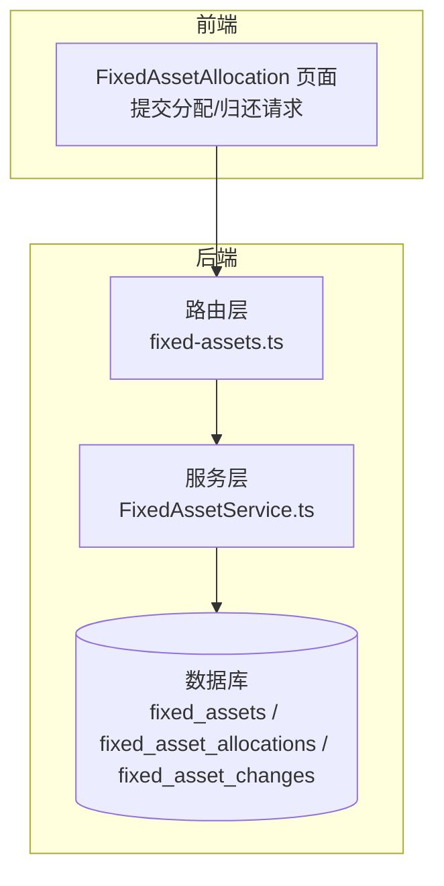
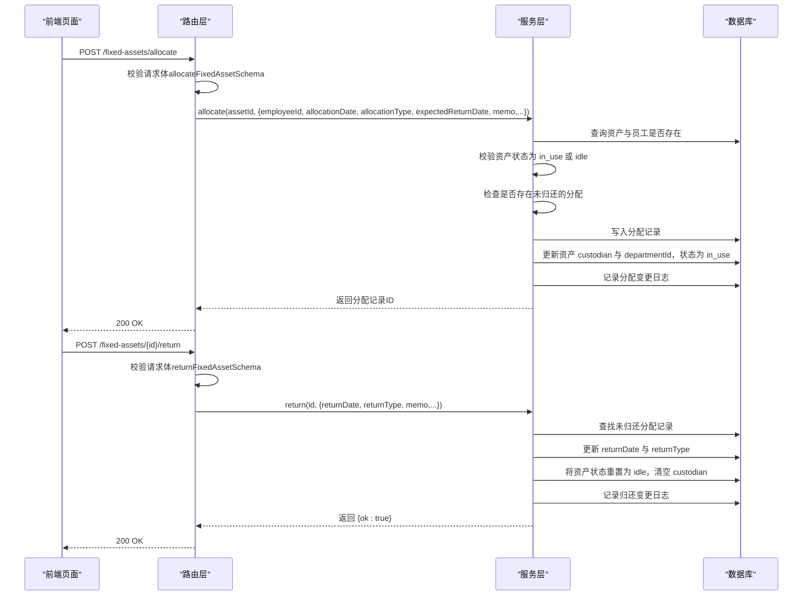
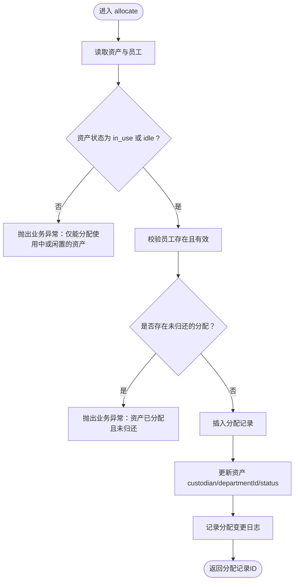
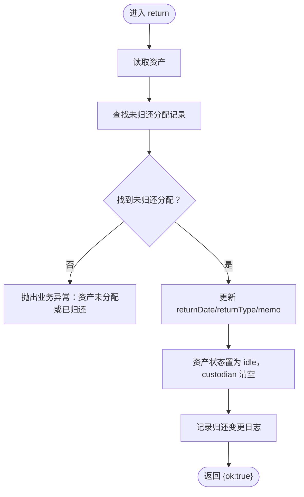
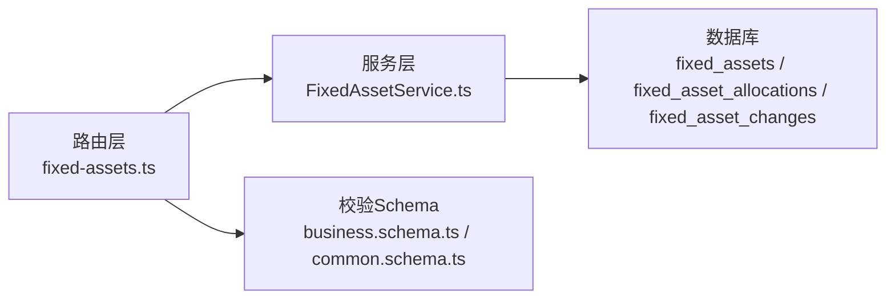

# 资产分配与归还API

<cite>
**本文引用的文件**
- [backend/src/routes/fixed-assets.ts](file://backend/src/routes/fixed-assets.ts)
- [backend/src/services/FixedAssetService.ts](file://backend/src/services/FixedAssetService.ts)
- [backend/src/schemas/business.schema.ts](file://backend/src/schemas/business.schema.ts)
- [backend/src/schemas/common.schema.ts](file://backend/src/schemas/common.schema.ts)
- [backend/src/db/schema.ts](file://backend/src/db/schema.ts)
- [frontend/src/features/assets/pages/FixedAssetAllocation.tsx](file://frontend/src/features/assets/pages/FixedAssetAllocation.tsx)
- [frontend/src/config/api.ts](file://frontend/src/config/api.ts)
- [backend/test/routes/fixed-assets.test.ts](file://backend/test/routes/fixed-assets.test.ts)
</cite>

## 目录
1. [简介](#简介)
2. [项目结构](#项目结构)
3. [核心组件](#核心组件)
4. [架构总览](#架构总览)
5. [详细组件分析](#详细组件分析)
6. [依赖关系分析](#依赖关系分析)
7. [性能考量](#性能考量)
8. [故障排查指南](#故障排查指南)
9. [结论](#结论)
10. [附录](#附录)

## 简介
本文件面向资产分配与归还API的使用者与维护者，系统性说明以下内容：
- /fixed-assets/allocate 端点的资产分配流程与校验
- /fixed-assets/{id}/return 端点的资产归还流程与校验
- allocateFixedAssetSchema 中 employeeId、allocationDate、expectedReturnDate 的验证规则
- FixedAssetService.allocate 方法如何检查资产状态（仅限 in_use 或 idle）、创建分配记录并更新资产保管人与部门信息
- FixedAssetService.return 方法如何查找未归还的分配记录、更新归还日期并将资产状态重置为 idle
- 分配类型 allocationType 与归还类型 returnType 的枚举值及其在变更日志中的记录方式
- 员工入职分配与离职归还的典型场景示例

## 项目结构
资产分配与归还功能由三层组成：
- 路由层：定义 /fixed-assets/allocate 与 /fixed-assets/{id}/return 的HTTP接口，负责请求解析、权限控制与审计日志
- 服务层：实现 FixedAssetService.allocate 与 FixedAssetService.return 的业务逻辑
- 数据层：固定资产管理表 fixed_assets、分配记录表 fixed_asset_allocations、变更日志表 fixed_asset_changes

图表来源
- [backend/src/routes/fixed-assets.ts](file://backend/src/routes/fixed-assets.ts#L637-L729)
- [backend/src/services/FixedAssetService.ts](file://backend/src/services/FixedAssetService.ts#L644-L779)
- [backend/src/db/schema.ts](file://backend/src/db/schema.ts#L464-L532)

章节来源
- [backend/src/routes/fixed-assets.ts](file://backend/src/routes/fixed-assets.ts#L637-L729)
- [backend/src/services/FixedAssetService.ts](file://backend/src/services/FixedAssetService.ts#L644-L779)
- [backend/src/db/schema.ts](file://backend/src/db/schema.ts#L464-L532)

## 核心组件
- 路由层
  - /fixed-assets/allocate：POST，接收资产ID、员工ID、分配日期、分配类型、预期归还日期等，返回分配记录ID
  - /fixed-assets/{id}/return：POST，接收归还日期、归还类型、备注等，返回成功标记
- 服务层
  - allocate(id, data)：校验资产状态与员工有效性，确保同一资产当前无未归还分配，写入分配记录并更新资产保管人与部门，记录分配变更日志
  - return(id, data)：查找未归还分配记录，更新归还日期与归还类型，将资产状态重置为 idle 并记录归还变更日志
- 数据层
  - 固定资产表 fixed_assets：包含资产状态、保管人、部门等字段
  - 分配记录表 fixed_asset_allocations：记录每次分配与归还
  - 变更日志表 fixed_asset_changes：记录资产状态、部门、保管人等变更及分配/归还事件

章节来源
- [backend/src/routes/fixed-assets.ts](file://backend/src/routes/fixed-assets.ts#L637-L729)
- [backend/src/services/FixedAssetService.ts](file://backend/src/services/FixedAssetService.ts#L644-L779)
- [backend/src/db/schema.ts](file://backend/src/db/schema.ts#L464-L532)

## 架构总览
下图展示从客户端到数据库的完整调用链路与关键校验点：

图表来源
- [backend/src/routes/fixed-assets.ts](file://backend/src/routes/fixed-assets.ts#L637-L729)
- [backend/src/services/FixedAssetService.ts](file://backend/src/services/FixedAssetService.ts#L644-L779)
- [backend/src/schemas/business.schema.ts](file://backend/src/schemas/business.schema.ts#L288-L307)
- [backend/src/schemas/business.schema.ts](file://backend/src/schemas/business.schema.ts#L736-L742)

## 详细组件分析

### 分配端点 /fixed-assets/allocate
- 请求体校验
  - 使用 allocateFixedAssetSchema，要求：
    - assetId：UUID
    - employeeId：UUID
    - allocationDate：YYYY-MM-DD 日期格式
    - allocationType：枚举，允许值为 employee_onboarding、transfer、temporary（默认值为 employee_onboarding）
    - expectedReturnDate：YYYY-MM-DD（可选）
    - memo：字符串（可选）
- 业务逻辑要点
  - 校验资产存在且状态为 in_use 或 idle
  - 校验员工存在且有效
  - 确保该资产当前无未归还的分配记录
  - 写入分配记录（含 allocationType、memo）
  - 更新资产 custodian 为员工姓名、departmentId 为员工部门（若员工有部门则优先使用员工部门，否则保留原部门）
  - 将资产状态置为 in_use
  - 记录分配变更日志（changeType: allocation）

图表来源
- [backend/src/services/FixedAssetService.ts](file://backend/src/services/FixedAssetService.ts#L644-L717)
- [backend/src/schemas/business.schema.ts](file://backend/src/schemas/business.schema.ts#L288-L307)

章节来源
- [backend/src/routes/fixed-assets.ts](file://backend/src/routes/fixed-assets.ts#L637-L729)
- [backend/src/services/FixedAssetService.ts](file://backend/src/services/FixedAssetService.ts#L644-L717)
- [backend/src/schemas/business.schema.ts](file://backend/src/schemas/business.schema.ts#L288-L307)

### 归还端点 /fixed-assets/{id}/return
- 请求体校验
  - 使用 returnFixedAssetSchema，要求：
    - returnDate：YYYY-MM-DD 日期格式
    - returnType：枚举，允许值为 employee_resignation、transfer、expired、other（默认值为 employee_resignation）
    - memo：字符串（可选）
- 业务逻辑要点
  - 校验资产存在
  - 查找未归还的分配记录（returnDate 为空）
  - 更新该分配记录的 returnDate 与 returnType，并合并 memo
  - 将资产状态重置为 idle，custodian 清空
  - 记录归还变更日志（changeType: return）

图表来源
- [backend/src/services/FixedAssetService.ts](file://backend/src/services/FixedAssetService.ts#L719-L777)
- [backend/src/schemas/business.schema.ts](file://backend/src/schemas/business.schema.ts#L736-L742)

章节来源
- [backend/src/routes/fixed-assets.ts](file://backend/src/routes/fixed-assets.ts#L684-L729)
- [backend/src/services/FixedAssetService.ts](file://backend/src/services/FixedAssetService.ts#L719-L777)
- [backend/src/schemas/business.schema.ts](file://backend/src/schemas/business.schema.ts#L736-L742)

### 数据模型与字段说明
- 固定资产表 fixed_assets
  - 关键字段：assetCode、name、category、purchaseDate、purchasePriceCents、currency、vendorId、departmentId、siteId、custodian、status、depreciationMethod、usefulLifeYears、currentValueCents、memo、saleDate、salePriceCents、saleBuyer、saleMemo、createdBy、createdAt、updatedAt
  - 状态枚举：in_use、idle、maintenance、scrapped、sold
- 分配记录表 fixed_asset_allocations
  - 关键字段：assetId、employeeId、allocationDate、allocationType、returnDate、returnType、memo、createdBy、createdAt、updatedAt
  - 分配类型枚举：employee_onboarding、transfer、temporary
  - 归还类型枚举：employee_resignation、transfer、expired、other
- 变更日志表 fixed_asset_changes
  - 关键字段：assetId、changeType、changeDate、fromDeptId、toDeptId、fromSiteId、toSiteId、fromCustodian、toCustodian、fromStatus、toStatus、memo、createdBy、createdAt
  - 变更类型：status_change、transfer、allocation、return、purchase、sale

章节来源
- [backend/src/db/schema.ts](file://backend/src/db/schema.ts#L464-L532)

### 前端交互与典型场景
- 前端页面 FixedAssetAllocation 提供“分配资产”和“归还资产”的交互入口
  - 分配时选择资产与员工，填写分配日期与分配类型，默认分配类型为“员工入职”
  - 归还时选择未归还的分配记录，填写归还日期与归还类型，默认类型为“员工离职”
- API 映射
  - 分配：POST /api/fixed-assets/{id}/allocate
  - 归还：POST /api/fixed-assets/{id}/allocations/{id}/return

章节来源
- [frontend/src/features/assets/pages/FixedAssetAllocation.tsx](file://frontend/src/features/assets/pages/FixedAssetAllocation.tsx#L1-L355)
- [frontend/src/config/api.ts](file://frontend/src/config/api.ts#L128-L138)

## 依赖关系分析
- 路由层依赖服务层
  - /fixed-assets/allocate -> FixedAssetService.allocate
  - /fixed-assets/{id}/return -> FixedAssetService.return
- 服务层依赖数据库
  - 读取资产与员工信息
  - 插入/更新分配记录
  - 更新资产状态与保管人
  - 写入变更日志
- 校验层
  - allocateFixedAssetSchema 与 returnFixedAssetSchema 在路由层进行输入校验
  - 通用日期格式校验 dateSchema 与 UUID 校验 uuidSchema 在公共schema中定义

图表来源
- [backend/src/routes/fixed-assets.ts](file://backend/src/routes/fixed-assets.ts#L637-L729)
- [backend/src/services/FixedAssetService.ts](file://backend/src/services/FixedAssetService.ts#L644-L779)
- [backend/src/schemas/business.schema.ts](file://backend/src/schemas/business.schema.ts#L288-L307)
- [backend/src/schemas/business.schema.ts](file://backend/src/schemas/business.schema.ts#L736-L742)
- [backend/src/schemas/common.schema.ts](file://backend/src/schemas/common.schema.ts#L10-L16)

章节来源
- [backend/src/routes/fixed-assets.ts](file://backend/src/routes/fixed-assets.ts#L637-L729)
- [backend/src/services/FixedAssetService.ts](file://backend/src/services/FixedAssetService.ts#L644-L779)
- [backend/src/schemas/business.schema.ts](file://backend/src/schemas/business.schema.ts#L288-L307)
- [backend/src/schemas/business.schema.ts](file://backend/src/schemas/business.schema.ts#L736-L742)
- [backend/src/schemas/common.schema.ts](file://backend/src/schemas/common.schema.ts#L10-L16)

## 性能考量
- 事务保证
  - allocate 与 return 均使用数据库事务，确保分配记录、资产状态与变更日志的一致性
- 查询优化
  - 分配前对未归还分配的查询使用 returnDate IS NULL 条件
  - 资产状态检查仅涉及单条资产读取与员工读取
- 日志与审计
  - 路由层在分配/归还后记录审计动作，便于追踪但可能带来额外写入成本

章节来源
- [backend/src/services/FixedAssetService.ts](file://backend/src/services/FixedAssetService.ts#L644-L779)
- [backend/src/routes/fixed-assets.ts](file://backend/src/routes/fixed-assets.ts#L637-L729)

## 故障排查指南
- 常见错误与定位
  - 资产状态非 in_use/idle：检查资产状态是否被其他流程修改
  - 员工不存在或已停用：确认员工ID与激活状态
  - 资产已分配且未归还：检查是否存在未归还的分配记录
  - 资产未分配或已归还：确认目标资产是否存在未归还分配
- 建议排查步骤
  - 确认请求体符合 allocateFixedAssetSchema 与 returnFixedAssetSchema 的约束
  - 检查数据库中 fixed_asset_allocations 是否存在未归还记录
  - 核对 fixed_assets 表 status 字段值
  - 查看 fixed_asset_changes 中最近的分配/归还记录
- 测试参考
  - 后端测试覆盖了分配与归还的路由行为，可作为集成测试参考

章节来源
- [backend/src/services/FixedAssetService.ts](file://backend/src/services/FixedAssetService.ts#L644-L779)
- [backend/test/routes/fixed-assets.test.ts](file://backend/test/routes/fixed-assets.test.ts#L289-L322)

## 结论
资产分配与归还API通过严格的输入校验、状态检查与事务保障，实现了对固定资产生命周期中“占用-归还”环节的可靠管理。分配与归还均产生对应的变更日志，便于审计与追溯。建议在生产环境中结合前端交互与权限控制，确保流程合规与数据一致。

## 附录

### API 定义摘要
- 分配资产
  - 方法：POST
  - 路径：/fixed-assets/allocate
  - 请求体字段：assetId、employeeId、allocationDate、allocationType、expectedReturnDate、memo
  - 返回：分配记录ID
- 归还资产
  - 方法：POST
  - 路径：/fixed-assets/{id}/return
  - 请求体字段：returnDate、returnType、memo
  - 返回：{ ok: true }

章节来源
- [backend/src/routes/fixed-assets.ts](file://backend/src/routes/fixed-assets.ts#L637-L729)
- [backend/src/schemas/business.schema.ts](file://backend/src/schemas/business.schema.ts#L288-L307)
- [backend/src/schemas/business.schema.ts](file://backend/src/schemas/business.schema.ts#L736-L742)

### 枚举与默认值
- 分配类型 allocationType
  - 枚举：employee_onboarding、transfer、temporary
  - 默认值：employee_onboarding
- 归还类型 returnType
  - 枚举：employee_resignation、transfer、expired、other
  - 默认值：employee_resignation

章节来源
- [backend/src/schemas/business.schema.ts](file://backend/src/schemas/business.schema.ts#L288-L307)
- [backend/src/schemas/business.schema.ts](file://backend/src/schemas/business.schema.ts#L736-L742)

### 典型场景示例
- 员工入职分配
  - 场景：新员工入职，将笔记本电脑分配给该员工
  - 步骤：调用 /fixed-assets/allocate，allocationType 为 employee_onboarding，expectedReturnDate 可选
  - 结果：资产状态变为 in_use，custodian 更新为员工姓名，departmentId 更新为员工部门
- 离职归还
  - 场景：员工离职，回收其使用的笔记本电脑
  - 步骤：调用 /fixed-assets/{id}/return，returnType 为 employee_resignation
  - 结果：分配记录标记归还，资产状态重置为 idle，custodian 清空

章节来源
- [backend/src/services/FixedAssetService.ts](file://backend/src/services/FixedAssetService.ts#L644-L779)
- [frontend/src/features/assets/pages/FixedAssetAllocation.tsx](file://frontend/src/features/assets/pages/FixedAssetAllocation.tsx#L1-L355)