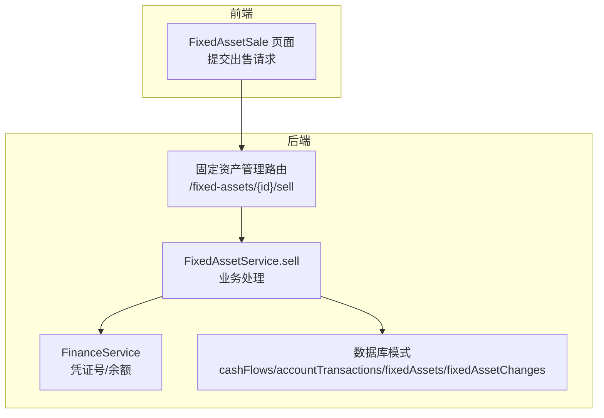
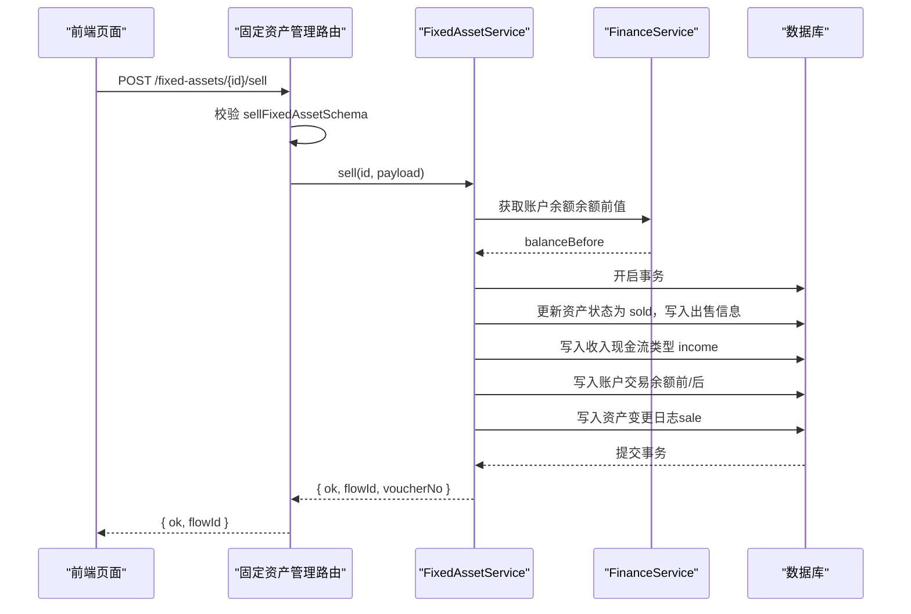
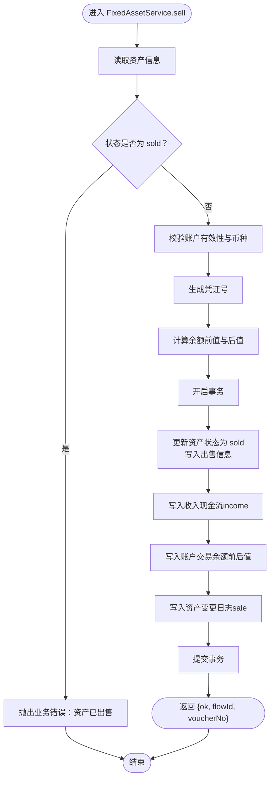
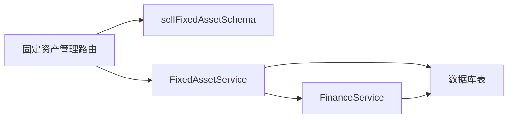

# 资产处置API

<cite>
**本文引用的文件**
- [backend/src/routes/fixed-assets.ts](file://backend/src/routes/fixed-assets.ts)
- [backend/src/services/FixedAssetService.ts](file://backend/src/services/FixedAssetService.ts)
- [backend/src/schemas/business.schema.ts](file://backend/src/schemas/business.schema.ts)
- [backend/src/services/FinanceService.ts](file://backend/src/services/FinanceService.ts)
- [backend/src/db/schema.ts](file://backend/src/db/schema.ts)
- [frontend/src/features/assets/pages/FixedAssetSale.tsx](file://frontend/src/features/assets/pages/FixedAssetSale.tsx)
</cite>

## 目录
1. [简介](#简介)
2. [项目结构](#项目结构)
3. [核心组件](#核心组件)
4. [架构总览](#架构总览)
5. [详细组件分析](#详细组件分析)
6. [依赖关系分析](#依赖关系分析)
7. [性能考量](#性能考量)
8. [故障排查指南](#故障排查指南)
9. [结论](#结论)
10. [附录](#附录)

## 简介
本文件面向“资产处置API”的使用与实现，聚焦通过后端路由 /{id}/sell 出售固定资产的完整流程。文档将：
- 解释 sellFixedAssetSchema 的校验规则：出售价格、出售日期、币种、财务账户与分类等；
- 描述 FixedAssetService.sell 方法的处理流程：状态校验、事务性更新资产、生成收入性质的现金流与账户交易、记录资产变更日志；
- 说明出售操作与财务模块的集成：凭证号生成、账户余额计算与更新；
- 提供完整的调用示例与成功响应中 flowId 的用途说明。

## 项目结构
资产处置API位于后端路由层与服务层之间，前端页面负责收集用户输入并发起请求。核心文件如下：
- 后端路由：定义 /{id}/sell 接口，绑定 sellFixedAssetSchema 并调用服务层；
- 服务层：FixedAssetService.sell 实现业务逻辑；
- 模式校验：business.schema.ts 中的 sellFixedAssetSchema；
- 财务服务：FinanceService 提供凭证号生成与余额计算；
- 数据库模式：cashFlows、accountTransactions、fixedAssets、fixedAssetChanges 等表支撑交易与日志。

图表来源
- [backend/src/routes/fixed-assets.ts](file://backend/src/routes/fixed-assets.ts#L578-L635)
- [backend/src/services/FixedAssetService.ts](file://backend/src/services/FixedAssetService.ts#L541-L642)
- [backend/src/services/FinanceService.ts](file://backend/src/services/FinanceService.ts#L1-L200)
- [backend/src/db/schema.ts](file://backend/src/db/schema.ts#L165-L200)

章节来源
- [backend/src/routes/fixed-assets.ts](file://backend/src/routes/fixed-assets.ts#L578-L635)
- [backend/src/services/FixedAssetService.ts](file://backend/src/services/FixedAssetService.ts#L541-L642)
- [backend/src/schemas/business.schema.ts](file://backend/src/schemas/business.schema.ts#L720-L733)
- [backend/src/services/FinanceService.ts](file://backend/src/services/FinanceService.ts#L1-L200)
- [backend/src/db/schema.ts](file://backend/src/db/schema.ts#L165-L200)

## 核心组件
- 路由层（/fixed-assets/{id}/sell）
  - 使用 sellFixedAssetSchema 对请求体进行校验；
  - 调用 FixedAssetService.sell 并返回 { ok, flowId }；
- 服务层（FixedAssetService.sell）
  - 校验资产存在性与状态（防止重复出售）；
  - 校验账户有效性、启用状态与币种一致性；
  - 在事务中执行四步操作：更新资产状态与出售信息、创建收入现金流、创建账户交易、记录资产变更日志；
  - 返回 { ok, flowId, voucherNo }；
- 财务服务（FinanceService）
  - 生成凭证号（按业务日期计数序列）；
  - 计算账户余额（基于时间戳前最后一条交易）；
- 数据库模式
  - 固定资产表：记录资产状态、出售信息；
  - 现金流表：记录收支流水及凭证号；
  - 账户交易表：记录每笔交易的余额前后值；
  - 资产变更日志表：记录资产状态变化轨迹。

章节来源
- [backend/src/routes/fixed-assets.ts](file://backend/src/routes/fixed-assets.ts#L578-L635)
- [backend/src/services/FixedAssetService.ts](file://backend/src/services/FixedAssetService.ts#L541-L642)
- [backend/src/services/FinanceService.ts](file://backend/src/services/FinanceService.ts#L1-L200)
- [backend/src/db/schema.ts](file://backend/src/db/schema.ts#L165-L200)

## 架构总览
下图展示从请求到落库的关键交互路径与事务边界。

图表来源
- [backend/src/routes/fixed-assets.ts](file://backend/src/routes/fixed-assets.ts#L578-L635)
- [backend/src/services/FixedAssetService.ts](file://backend/src/services/FixedAssetService.ts#L541-L642)
- [backend/src/services/FinanceService.ts](file://backend/src/services/FinanceService.ts#L1-L200)

## 详细组件分析

### 1) 请求体校验：sellFixedAssetSchema
- 字段与约束
  - saleDate：必填，日期格式；
  - salePriceCents：必填，整数，必须大于0；
  - currency：必填，3位币种代码；
  - accountId：必填，账户ID；
  - categoryId：必填，收入类目ID；
  - voucherUrl：可选，URL；
  - saleBuyer：可选，买方信息；
  - saleMemo：可选，出售备注；
  - memo：可选，通用备注。
- 作用
  - 在路由层对请求体进行强校验，确保后续业务处理的数据质量；
  - 与前端页面保持一致的字段命名与类型约定。

章节来源
- [backend/src/schemas/business.schema.ts](file://backend/src/schemas/business.schema.ts#L720-L733)
- [backend/src/routes/fixed-assets.ts](file://backend/src/routes/fixed-assets.ts#L578-L635)

### 2) 服务层：FixedAssetService.sell 处理流程
- 输入参数
  - id：资产ID；
  - payload：包含 saleDate、salePriceCents、currency、accountId、categoryId、voucherUrl、saleBuyer、saleMemo、memo、createdBy 等。
- 核心步骤
  1) 资产存在性与状态校验
     - 若资产不存在，抛出未找到错误；
     - 若资产状态已是 sold，抛出业务错误（防止重复出售）。
  2) 账户校验
     - 账户存在且启用；
     - 账户币种与请求币种一致。
  3) 凭证号生成
     - 基于业务日期 bizDate 计数，生成 JZYYYYMMDD-PPP 格式的凭证号。
  4) 余额计算
     - 通过 FinanceService.getAccountBalanceBefore 计算余额前值；
     - 余额后值 = 余额前值 + 收入金额（salePriceCents）。
  5) 事务内执行
     - 更新资产：status=sold、saleDate、salePriceCents、saleBuyer、saleMemo 等；
     - 写入收入现金流：类型 income、部门/站点、对方、摘要等；
     - 写入账户交易：记录交易日期、类型、金额、余额前后值；
     - 写入资产变更日志：changeType=sale、fromStatus、toStatus 等。
  6) 返回
     - 返回 { ok: true, flowId, voucherNo }，其中 flowId 用于前端关联现金流记录。

图表来源
- [backend/src/services/FixedAssetService.ts](file://backend/src/services/FixedAssetService.ts#L541-L642)
- [backend/src/services/FinanceService.ts](file://backend/src/services/FinanceService.ts#L1-L200)

章节来源
- [backend/src/services/FixedAssetService.ts](file://backend/src/services/FixedAssetService.ts#L541-L642)

### 3) 与财务模块的集成
- 凭证号生成
  - FinanceService.getNextVoucherNo 或服务内部按业务日期计数生成；
  - 规则：JZYYYYMMDD-PPP，其中 PPP 为当日序号（3位左填充）。
- 余额计算
  - 依据交易日期与创建时间戳，取“上一笔交易”的 balanceAfterCents 作为余额前值；
  - 若无历史交易，则取账户期初 openingCents。
- 现金流与账户交易
  - 现金流类型为 income；
  - 账户交易记录交易日期、类型、金额、余额前后值，保证账实相符。

章节来源
- [backend/src/services/FinanceService.ts](file://backend/src/services/FinanceService.ts#L1-L200)
- [backend/src/services/FixedAssetService.ts](file://backend/src/services/FixedAssetService.ts#L541-L642)
- [backend/src/db/schema.ts](file://backend/src/db/schema.ts#L165-L200)

### 4) 数据模型与日志
- 固定资产表（fixedAssets）
  - 关键字段：status、saleDate、salePriceCents、saleBuyer、saleMemo；
  - 用于记录资产的出售状态与相关信息。
- 现金流表（cashFlows）
  - 关键字段：voucherNo、bizDate、type、accountId、categoryId、amountCents、counterparty、memo、voucherUrl；
  - 用于记录每笔收支流水。
- 账户交易表（accountTransactions）
  - 关键字段：flowId、transactionDate、transactionType、amountCents、balanceBeforeCents、balanceAfterCents；
  - 用于逐笔追踪账户余额变动。
- 资产变更日志表（fixedAssetChanges）
  - 关键字段：changeType、changeDate、fromStatus、toStatus、memo；
  - 用于审计与追溯资产状态变化。

章节来源
- [backend/src/db/schema.ts](file://backend/src/db/schema.ts#L463-L518)
- [backend/src/db/schema.ts](file://backend/src/db/schema.ts#L165-L200)

### 5) 前端调用示例与字段映射
- 前端页面 FixedAssetSale.tsx
  - 表单字段：sale_date、sale_price_cents、accountId、categoryId、sale_buyer、voucherUrl、sale_memo、memo；
  - 金额转换：前端将单价元转为分（乘以100）后再提交；
  - 币种匹配：根据资产币种过滤可用账户；
  - 成功提示：显示生成的凭证号（来自后端返回的 voucherNo）。
- 典型请求体（字段名与后端一致）
  - saleDate：YYYY-MM-DD；
  - salePriceCents：整数分；
  - currency：3位币种代码；
  - accountId、categoryId：UUID；
  - 可选：saleBuyer、saleMemo、memo、voucherUrl。
- 成功响应
  - { ok: true, flowId }；
  - flowId 用于前端关联到对应的现金流记录，便于查看凭证与明细。

章节来源
- [frontend/src/features/assets/pages/FixedAssetSale.tsx](file://frontend/src/features/assets/pages/FixedAssetSale.tsx#L120-L150)
- [backend/src/routes/fixed-assets.ts](file://backend/src/routes/fixed-assets.ts#L578-L635)

## 依赖关系分析
- 路由层依赖
  - sellFixedAssetSchema：请求体校验；
  - FixedAssetService：业务处理入口。
- 服务层依赖
  - FinanceService：凭证号与余额计算；
  - 数据库：事务内写入多张表。
- 数据库依赖
  - 固定资产表、现金流表、账户交易表、资产变更日志表。

图表来源
- [backend/src/routes/fixed-assets.ts](file://backend/src/routes/fixed-assets.ts#L578-L635)
- [backend/src/services/FixedAssetService.ts](file://backend/src/services/FixedAssetService.ts#L541-L642)
- [backend/src/services/FinanceService.ts](file://backend/src/services/FinanceService.ts#L1-L200)
- [backend/src/db/schema.ts](file://backend/src/db/schema.ts#L165-L200)

章节来源
- [backend/src/routes/fixed-assets.ts](file://backend/src/routes/fixed-assets.ts#L578-L635)
- [backend/src/services/FixedAssetService.ts](file://backend/src/services/FixedAssetService.ts#L541-L642)
- [backend/src/services/FinanceService.ts](file://backend/src/services/FinanceService.ts#L1-L200)
- [backend/src/db/schema.ts](file://backend/src/db/schema.ts#L165-L200)

## 性能考量
- 事务边界
  - 将资产更新、现金流、账户交易、变更日志放在同一事务中，保证一致性与原子性。
- 查询优化
  - 余额计算通过“交易日期+创建时间戳”排序取最近一条，避免全表扫描；
  - 账户币种校验在服务层一次性完成，减少后续失败重试成本。
- 并发控制
  - 通过状态检查（sold）避免重复出售；
  - 业务日期+序号生成凭证号，天然具备并发安全的顺序性。

[本节为通用建议，无需特定文件来源]

## 故障排查指南
- 常见错误与定位
  - 资产不存在：检查资产ID是否正确；
  - 资产已出售：状态为 sold 时禁止再次出售；
  - 账户不存在或停用：确认 accountId 存在且 active=1；
  - 币种不匹配：账户 currency 必须与请求 currency 一致；
  - 金额非法：salePriceCents 必须为正整数；
  - 日期格式：saleDate 必须为合法日期字符串。
- 日志与审计
  - 成功后可在 cashFlows 与 accountTransactions 中核对凭证号与余额；
  - 资产变更日志 fixedAssetChanges 记录了 sale 操作的 from/to 状态与摘要。

章节来源
- [backend/src/services/FixedAssetService.ts](file://backend/src/services/FixedAssetService.ts#L541-L642)
- [backend/src/db/schema.ts](file://backend/src/db/schema.ts#L165-L200)
- [backend/src/db/schema.ts](file://backend/src/db/schema.ts#L463-L518)

## 结论
资产处置API通过严格的请求体校验、严谨的服务层事务处理与财务模块集成，实现了从“出售请求”到“现金流与账户交易记账”的闭环。其关键价值在于：
- 明确的校验规则保障数据质量；
- 事务内的原子性操作确保账实一致；
- 凭证号与余额计算遵循统一规范；
- flowId 与 voucherNo 为后续审计与对账提供可靠线索。

[本节为总结性内容，无需特定文件来源]

## 附录

### A. 字段与类型对照（后端）
- saleDate：字符串（YYYY-MM-DD）
- salePriceCents：整数（分）
- currency：字符串（3位币种代码）
- accountId：字符串（UUID）
- categoryId：字符串（UUID）
- voucherUrl：字符串（URL，可选）
- saleBuyer：字符串（可选）
- saleMemo：字符串（可选）
- memo：字符串（可选）

章节来源
- [backend/src/schemas/business.schema.ts](file://backend/src/schemas/business.schema.ts#L720-L733)

### B. 成功响应字段说明
- ok：布尔值，表示操作成功；
- flowId：字符串，现金流记录ID，可用于前端关联查看；
- voucherNo：字符串，凭证号，用于财务归档与审计。

章节来源
- [backend/src/services/FixedAssetService.ts](file://backend/src/services/FixedAssetService.ts#L641-L642)
- [backend/src/routes/fixed-assets.ts](file://backend/src/routes/fixed-assets.ts#L578-L635)