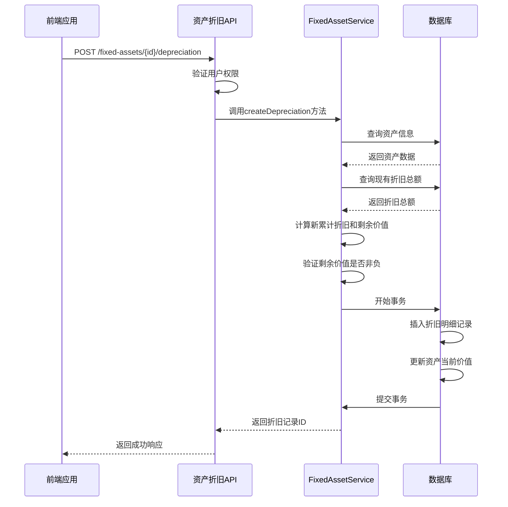
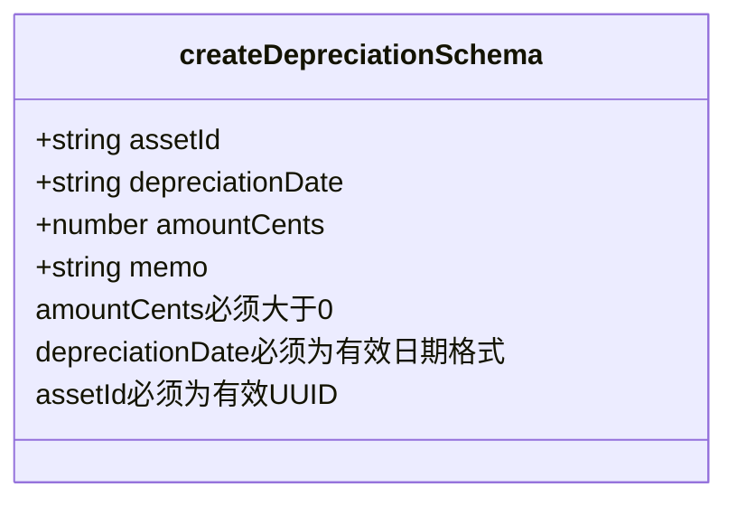
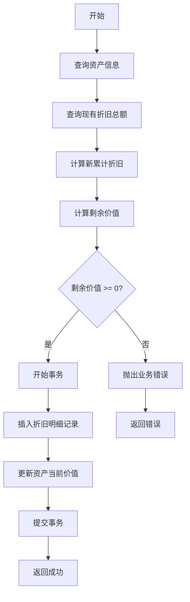
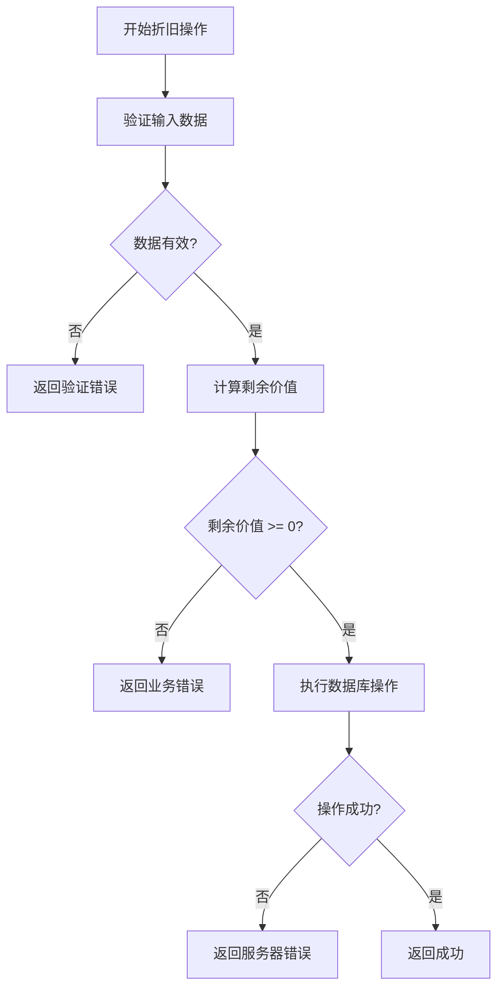
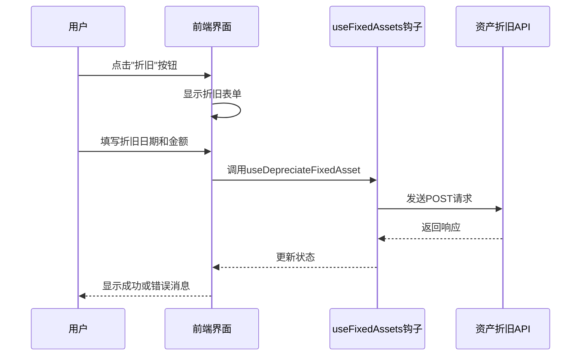

# 资产折旧API

<cite>
**本文档引用的文件**   
- [fixed-assets.ts](file://backend/src/routes/fixed-assets.ts)
- [FixedAssetService.ts](file://backend/src/services/FixedAssetService.ts)
- [business.schema.ts](file://backend/src/schemas/business.schema.ts)
- [schema.ts](file://backend/src/db/schema.ts)
- [errors.ts](file://backend/src/utils/errors.ts)
- [FixedAssetsManagement.tsx](file://frontend/src/features/assets/pages/FixedAssetsManagement.tsx)
- [useFixedAssets.ts](file://frontend/src/hooks/business/useFixedAssets.ts)
</cite>

## 目录
1. [简介](#简介)
2. [资产折旧端点](#资产折旧端点)
3. [折旧数据验证](#折旧数据验证)
4. [折旧业务逻辑](#折旧业务逻辑)
5. [折旧计算示例](#折旧计算示例)
6. [错误处理](#错误处理)
7. [前端交互流程](#前端交互流程)

## 简介
资产折旧API是财务管理系统中的核心功能之一，用于处理固定资产的折旧操作。该API允许用户为特定资产创建折旧记录，系统会自动计算累计折旧和剩余价值，并在事务中同步更新相关数据。本文档详细说明了通过/{id}/depreciation端点创建折旧记录的流程，包括数据验证规则、业务逻辑实现、计算示例以及错误处理机制。

**Section sources**
- [fixed-assets.ts](file://backend/src/routes/fixed-assets.ts#L413-L458)
- [FixedAssetService.ts](file://backend/src/services/FixedAssetService.ts#L325-L369)

## 资产折旧端点
资产折旧API通过POST请求访问/{id}/depreciation端点来创建折旧记录。该端点需要提供资产ID作为路径参数，并在请求体中包含折旧日期和折旧金额等信息。系统会验证输入数据的合法性，确保折旧金额不超过资产原值，并在事务中完成所有相关数据的更新。

**Diagram sources **
- [fixed-assets.ts](file://backend/src/routes/fixed-assets.ts#L413-L458)
- [FixedAssetService.ts](file://backend/src/services/FixedAssetService.ts#L325-L369)

**Section sources**
- [fixed-assets.ts](file://backend/src/routes/fixed-assets.ts#L413-L458)
- [FixedAssetService.ts](file://backend/src/services/FixedAssetService.ts#L325-L369)

## 折旧数据验证
系统通过Zod Schema对折旧数据进行严格验证，确保数据的完整性和正确性。`createDepreciationSchema`定义了折旧记录所需的所有字段及其验证规则。

**Diagram sources **
- [business.schema.ts](file://backend/src/schemas/business.schema.ts#L302-L308)

**Section sources**
- [business.schema.ts](file://backend/src/schemas/business.schema.ts#L302-L308)

### 折旧金额验证
折旧金额(amountCents)的验证规则如下：
- 必须为正整数
- 必须大于0
- 以分为单位存储，避免浮点数精度问题

### 折旧日期验证
折旧日期(depreciationDate)的验证规则如下：
- 必须为有效的日期格式(YYYY-MM-DD)
- 不能为空
- 必须是过去或当前日期

## 折旧业务逻辑
`FixedAssetService.createDepreciation`方法实现了核心的折旧业务逻辑，包括累计折旧计算、剩余价值计算、数据验证和事务处理。

**Diagram sources **
- [FixedAssetService.ts](file://backend/src/services/FixedAssetService.ts#L325-L369)

**Section sources**
- [FixedAssetService.ts](file://backend/src/services/FixedAssetService.ts#L325-L369)

### 累计折旧和剩余价值计算
系统通过以下公式计算累计折旧和剩余价值：
- **累计折旧** = 现有累计折旧总额 + 本次折旧金额
- **剩余价值** = 资产购买价格 - 累计折旧

### 数据同步更新
系统在数据库事务中同步更新两个关键数据：
1. 在`fixed_asset_depreciations`表中插入新的折旧明细记录
2. 更新`fixed_assets`表中资产的`currentValueCents`字段

### 事务处理
所有数据库操作都在事务中执行，确保数据的一致性。如果任何一步操作失败，整个事务将回滚，避免数据不一致的情况。

## 折旧计算示例
以下是一个按月直线法折旧的计算示例：

**Diagram sources **
- [FixedAssetService.ts](file://backend/src/services/FixedAssetService.ts#L340-L341)

**Section sources**
- [FixedAssetService.ts](file://backend/src/services/FixedAssetService.ts#L340-L341)

### 计算过程
假设某资产购买价格为1200元(120000分)，预计使用年限为1年(12个月)，采用直线法折旧：
- 月折旧额 = 120000 ÷ 12 = 10000分
- 第1个月折旧后：累计折旧10000分，剩余价值110000分
- 第2个月折旧后：累计折旧20000分，剩余价值100000分
- 以此类推，直到第12个月折旧完成后，剩余价值为0

## 错误处理
系统对折旧操作中的各种异常情况进行了完善的错误处理，确保数据的完整性和系统的稳定性。

**Diagram sources **
- [errors.ts](file://backend/src/utils/errors.ts#L48-L49)
- [FixedAssetService.ts](file://backend/src/services/FixedAssetService.ts#L343-L344)

**Section sources**
- [errors.ts](file://backend/src/utils/errors.ts#L48-L49)
- [FixedAssetService.ts](file://backend/src/services/FixedAssetService.ts#L343-L344)

### 超额折旧错误
当折旧金额超过资产购买价格时，系统会返回特定的业务错误：
- **错误代码**: BUSINESS_ERROR
- **错误消息**: '折旧金额超过购买价格'
- **HTTP状态码**: 400

此错误确保了资产的剩余价值不会变为负数，维护了财务数据的准确性。

## 前端交互流程
前端应用通过一系列组件和钩子与资产折旧API进行交互，为用户提供友好的操作界面。

**Diagram sources **
- [FixedAssetsManagement.tsx](file://frontend/src/features/assets/pages/FixedAssetsManagement.tsx#L505-L518)
- [useFixedAssets.ts](file://frontend/src/hooks/business/useFixedAssets.ts#L118-L128)

**Section sources**
- [FixedAssetsManagement.tsx](file://frontend/src/features/assets/pages/FixedAssetsManagement.tsx#L505-L518)
- [useFixedAssets.ts](file://frontend/src/hooks/business/useFixedAssets.ts#L118-L128)

### 前端组件
前端主要包含以下组件：
- **折旧模态框**: 用于收集折旧信息的表单
- **折旧表单**: 包含折旧日期和金额输入字段
- **状态管理**: 使用React Query管理API调用状态

### 数据流
前端数据流遵循以下流程：
1. 用户在界面触发折旧操作
2. 前端组件收集用户输入
3. 通过useDepreciateFixedAsset钩子调用API
4. 处理API响应并更新UI状态
5. 显示操作结果给用户