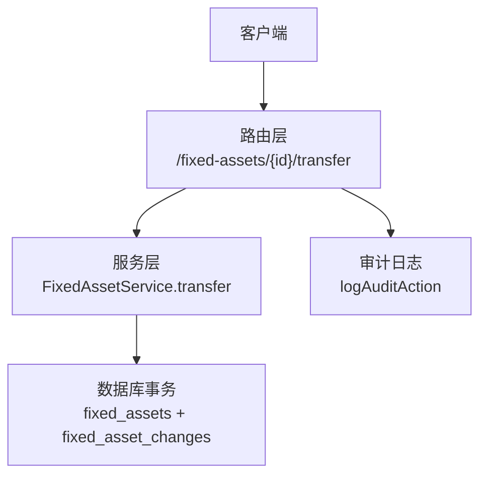
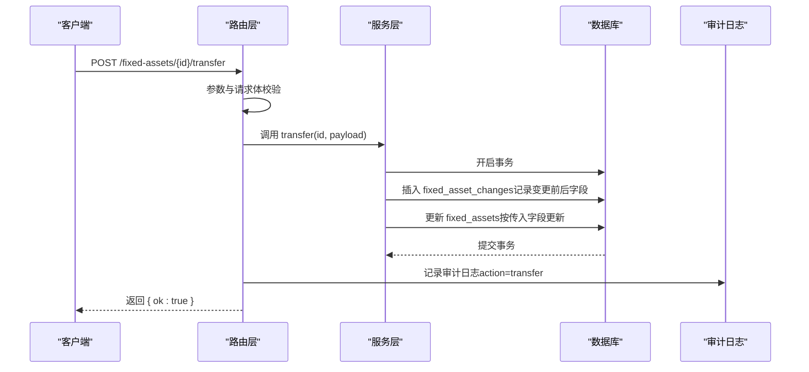
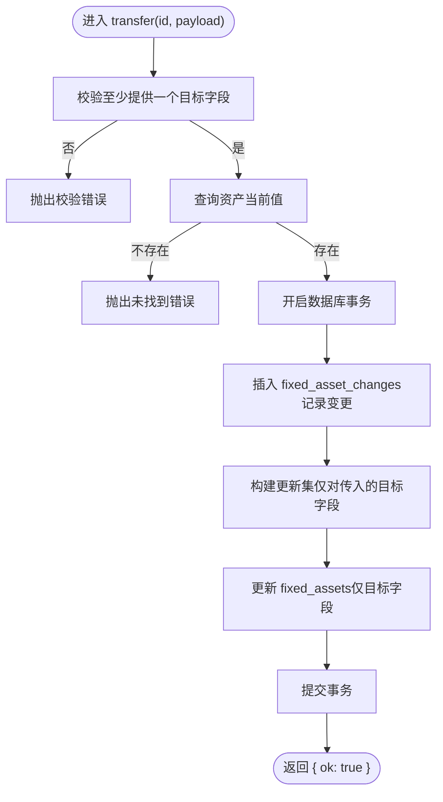
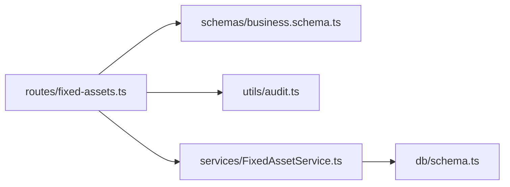

# 资产转移API

<cite>
**本文引用的文件**
- [backend/src/routes/fixed-assets.ts](file://backend/src/routes/fixed-assets.ts)
- [backend/src/services/FixedAssetService.ts](file://backend/src/services/FixedAssetService.ts)
- [backend/src/schemas/business.schema.ts](file://backend/src/schemas/business.schema.ts)
- [backend/src/db/schema.ts](file://backend/src/db/schema.ts)
- [backend/src/utils/audit.ts](file://backend/src/utils/audit.ts)
- [backend/openapi.json](file://backend/openapi.json)
- [backend/test/routes/fixed-assets.test.ts](file://backend/test/routes/fixed-assets.test.ts)
- [frontend/src/validations/fixedAsset.schema.ts](file://frontend/src/validations/fixedAsset.schema.ts)
</cite>

## 目录
1. [简介](#简介)
2. [项目结构](#项目结构)
3. [核心组件](#核心组件)
4. [架构总览](#架构总览)
5. [详细组件分析](#详细组件分析)
6. [依赖关系分析](#依赖关系分析)
7. [性能考量](#性能考量)
8. [故障排查指南](#故障排查指南)
9. [结论](#结论)
10. [附录](#附录)

## 简介
本文件面向财务与资产管理系统的使用者与开发者，系统性说明“资产转移”API的端点与行为，包括：
- 端点路径与HTTP方法：POST /fixed-assets/{id}/transfer
- 请求体校验规则：transfer_date（必填）、to_department_id/to_site_id/to_custodian 至少一个必填
- 服务层实现：在单个数据库事务内同时更新资产主记录并写入资产变更日志
- 审计日志：记录操作类型为“transfer”，并包含目标字段
- 跨部门转移示例与字段省略逻辑：未提供的目标字段保持不变

## 项目结构
资产转移API由三层构成：
- 路由层：定义端点、参数与请求体校验
- 服务层：执行业务逻辑（校验、事务、写日志、更新主表）
- 数据层：固定资产管理表与变更日志表

图表来源
- [backend/src/routes/fixed-assets.ts](file://backend/src/routes/fixed-assets.ts#L460-L509)
- [backend/src/services/FixedAssetService.ts](file://backend/src/services/FixedAssetService.ts#L371-L415)
- [backend/src/db/schema.ts](file://backend/src/db/schema.ts#L464-L518)
- [backend/src/utils/audit.ts](file://backend/src/utils/audit.ts#L61-L92)

章节来源
- [backend/src/routes/fixed-assets.ts](file://backend/src/routes/fixed-assets.ts#L460-L509)
- [backend/src/services/FixedAssetService.ts](file://backend/src/services/FixedAssetService.ts#L371-L415)
- [backend/src/db/schema.ts](file://backend/src/db/schema.ts#L464-L518)
- [backend/src/utils/audit.ts](file://backend/src/utils/audit.ts#L61-L92)

## 核心组件
- 端点定义与权限控制：路由层对转移操作进行权限校验与参数解析
- 业务服务：服务层负责校验请求体、读取资产当前值、在事务中写入变更日志并更新主表
- 数据模型：固定资产管理表与变更日志表的字段映射
- 审计日志：统一记录操作者、实体、详情等

章节来源
- [backend/src/routes/fixed-assets.ts](file://backend/src/routes/fixed-assets.ts#L460-L509)
- [backend/src/services/FixedAssetService.ts](file://backend/src/services/FixedAssetService.ts#L371-L415)
- [backend/src/db/schema.ts](file://backend/src/db/schema.ts#L464-L518)
- [backend/src/utils/audit.ts](file://backend/src/utils/audit.ts#L61-L92)

## 架构总览
资产转移的调用链如下：

图表来源
- [backend/src/routes/fixed-assets.ts](file://backend/src/routes/fixed-assets.ts#L460-L509)
- [backend/src/services/FixedAssetService.ts](file://backend/src/services/FixedAssetService.ts#L371-L415)
- [backend/src/utils/audit.ts](file://backend/src/utils/audit.ts#L61-L92)

## 详细组件分析

### 端点与请求体校验
- 端点：POST /fixed-assets/{id}/transfer
- 权限：受保护路由，需具备资产模块“转移”权限
- 请求体校验：
  - transfer_date（必填）：日期字符串，遵循后端OpenAPI约束
  - 至少提供以下之一：to_department_id、to_site_id、to_custodian
  - 可选字段：memo
- 前端校验（前端侧）：字段名采用小驼峰命名（如 transfer_date、to_department_id）

章节来源
- [backend/src/routes/fixed-assets.ts](file://backend/src/routes/fixed-assets.ts#L460-L509)
- [backend/src/schemas/business.schema.ts](file://backend/src/schemas/business.schema.ts#L693-L699)
- [backend/openapi.json](file://backend/openapi.json#L8185-L8226)
- [frontend/src/validations/fixedAsset.schema.ts](file://frontend/src/validations/fixedAsset.schema.ts#L27-L33)

### 服务层实现：FixedAssetService.transfer
- 校验逻辑：
  - 若未提供 to_department_id、to_site_id、to_custodian 三者中的至少一项，则抛出校验错误
  - 若资产不存在，抛出未找到错误
- 事务处理：
  - 写入固定资产变更日志（fixed_asset_changes），字段包含：
    - change_type: "transfer"
    - change_date: 传入的转移日期
    - from_* 与 to_* 字段：分别记录变更前后的部门、站点、保管人
    - memo、created_by、created_at
  - 更新固定资产主表（fixed_assets），仅对传入的目标字段进行更新，未传入的字段保持不变
  - 最后更新时间（updated_at）始终同步更新

图表来源
- [backend/src/services/FixedAssetService.ts](file://backend/src/services/FixedAssetService.ts#L371-L415)

章节来源
- [backend/src/services/FixedAssetService.ts](file://backend/src/services/FixedAssetService.ts#L371-L415)

### 数据模型与字段映射
- 固定资产主表（fixed_assets）关键字段：
  - department_id、site_id、custodian、status 等
- 变更日志表（fixed_asset_changes）关键字段：
  - asset_id、change_type、change_date、from_dept_id、to_dept_id、from_site_id、to_site_id、from_custodian、to_custodian、memo、created_by、created_at

章节来源
- [backend/src/db/schema.ts](file://backend/src/db/schema.ts#L464-L518)

### 审计日志与变更类型
- 路由层在成功处理后调用审计日志工具，记录：
  - action: "transfer"
  - entity: "fixed_asset"
  - entityId: 资产ID
  - detail: 包含目标字段（部门、站点、保管人）的JSON字符串
- 变更类型（change_type）在变更日志中固定为 "transfer"

章节来源
- [backend/src/routes/fixed-assets.ts](file://backend/src/routes/fixed-assets.ts#L487-L508)
- [backend/src/utils/audit.ts](file://backend/src/utils/audit.ts#L61-L92)
- [backend/src/services/FixedAssetService.ts](file://backend/src/services/FixedAssetService.ts#L371-L415)

### 跨部门转移调用示例
- 示例场景：将资产从部门A转移到部门B，同时更新保管人
- 请求体要点：
  - transfer_date：转移日期
  - to_department_id：目标部门ID（必填）
  - to_custodian：新保管人（可选）
  - memo：备注（可选）
- 注意：若仅提供 to_department_id，则 to_site_id 与 to_custodian 保持不变

章节来源
- [backend/test/routes/fixed-assets.test.ts](file://backend/test/routes/fixed-assets.test.ts#L225-L239)
- [backend/src/routes/fixed-assets.ts](file://backend/src/routes/fixed-assets.ts#L460-L509)

## 依赖关系分析
- 路由层依赖：
  - 业务Schema（transferFixedAssetSchema）用于请求体校验
  - 权限中间件（protectRoute）与审计日志工具（logAuditAction）
- 服务层依赖：
  - 数据库（Drizzle ORM）访问固定资产管理表与变更日志表
  - 错误封装（Errors）用于抛出业务与校验异常
- 数据层：
  - fixed_assets 表与 fixed_asset_changes 表的结构定义

图表来源
- [backend/src/routes/fixed-assets.ts](file://backend/src/routes/fixed-assets.ts#L460-L509)
- [backend/src/schemas/business.schema.ts](file://backend/src/schemas/business.schema.ts#L693-L699)
- [backend/src/utils/audit.ts](file://backend/src/utils/audit.ts#L61-L92)
- [backend/src/services/FixedAssetService.ts](file://backend/src/services/FixedAssetService.ts#L371-L415)
- [backend/src/db/schema.ts](file://backend/src/db/schema.ts#L464-L518)

章节来源
- [backend/src/routes/fixed-assets.ts](file://backend/src/routes/fixed-assets.ts#L460-L509)
- [backend/src/services/FixedAssetService.ts](file://backend/src/services/FixedAssetService.ts#L371-L415)
- [backend/src/db/schema.ts](file://backend/src/db/schema.ts#L464-L518)

## 性能考量
- 单事务写入：变更日志与主表更新在同一事务中完成，保证一致性与原子性
- 仅更新传入字段：减少不必要的字段写入，降低锁竞争与写放大
- 批量查询与映射：列表与详情接口中对关联表的批量查询与映射逻辑，有助于减少往返次数（与转移接口同属同一模块）

## 故障排查指南
- 常见错误与定位：
  - 缺少必要字段：当未提供 to_department_id、to_site_id、to_custodian 中的至少一项时，服务层会抛出校验错误
  - 资产不存在：当资产ID无效或被删除时，服务层抛出未找到错误
  - 审计日志未记录：确认路由层是否调用了审计日志工具，以及执行上下文是否支持 waitUntil
- 建议排查步骤：
  - 检查请求体字段是否符合Schema要求（日期格式、UUID格式）
  - 确认资产ID有效且存在
  - 查看服务层事务是否正常提交
  - 核对审计日志表是否存在对应记录

章节来源
- [backend/src/services/FixedAssetService.ts](file://backend/src/services/FixedAssetService.ts#L371-L415)
- [backend/src/routes/fixed-assets.ts](file://backend/src/routes/fixed-assets.ts#L487-L508)
- [backend/src/utils/audit.ts](file://backend/src/utils/audit.ts#L61-L92)

## 结论
资产转移API通过严格的请求体校验、单事务内的变更日志与主表更新，确保了数据一致性与可追溯性。审计日志与变更日志共同记录了“转移”这一关键操作及其影响范围，便于后续审计与问题追踪。跨部门转移时，未提供的目标字段将保持不变，满足实际业务需求。

## 附录

### API定义与字段说明
- 端点：POST /fixed-assets/{id}/transfer
- 请求体字段：
  - transfer_date：必填，日期字符串
  - to_department_id：可选，目标部门ID
  - to_site_id：可选，目标站点ID
  - to_custodian：可选，新保管人
  - memo：可选，备注
- 响应：{ ok: boolean }

章节来源
- [backend/src/routes/fixed-assets.ts](file://backend/src/routes/fixed-assets.ts#L460-L509)
- [backend/src/schemas/business.schema.ts](file://backend/src/schemas/business.schema.ts#L693-L699)
- [backend/openapi.json](file://backend/openapi.json#L8185-L8226)