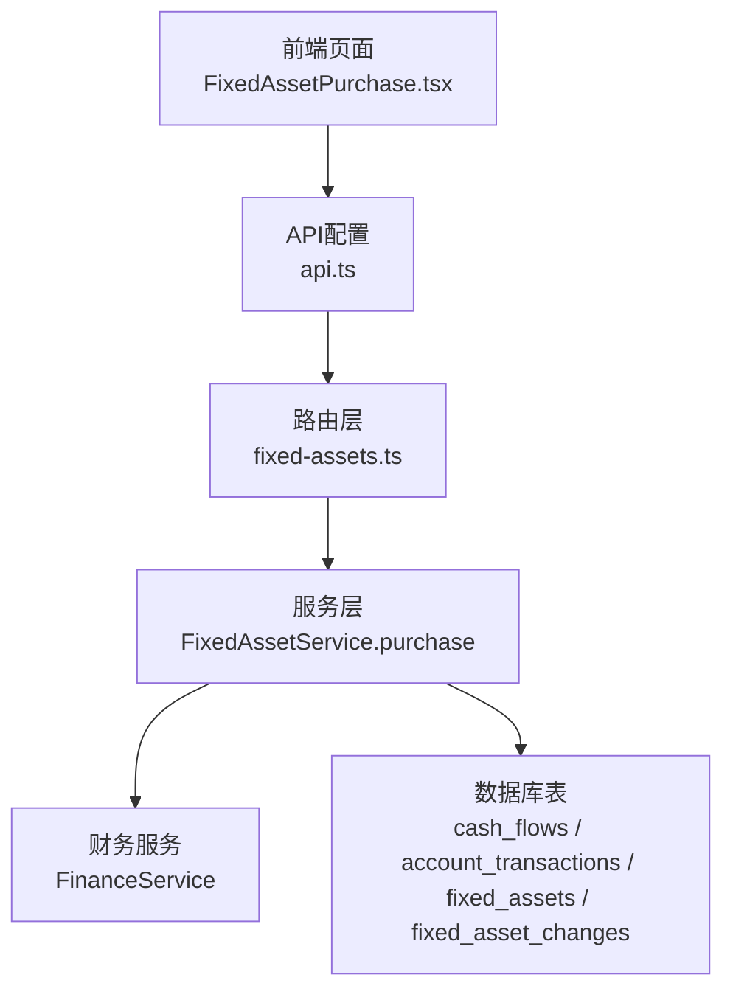
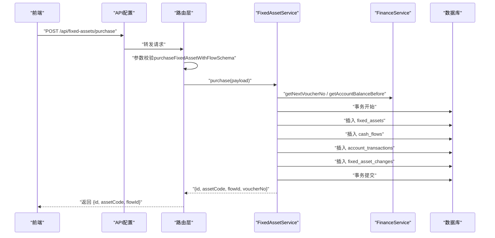
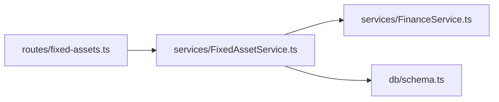

# 资产采购API

<cite>
**本文引用的文件**
- [backend/src/routes/fixed-assets.ts](file://backend/src/routes/fixed-assets.ts)
- [backend/src/services/FixedAssetService.ts](file://backend/src/services/FixedAssetService.ts)
- [backend/src/schemas/business.schema.ts](file://backend/src/schemas/business.schema.ts)
- [backend/src/services/FinanceService.ts](file://backend/src/services/FinanceService.ts)
- [backend/src/db/schema.ts](file://backend/src/db/schema.ts)
- [frontend/src/features/assets/pages/FixedAssetPurchase.tsx](file://frontend/src/features/assets/pages/FixedAssetPurchase.tsx)
- [frontend/src/config/api.ts](file://frontend/src/config/api.ts)
</cite>

## 目录
1. [简介](#简介)
2. [项目结构](#项目结构)
3. [核心组件](#核心组件)
4. [架构总览](#架构总览)
5. [详细组件分析](#详细组件分析)
6. [依赖关系分析](#依赖关系分析)
7. [性能考量](#性能考量)
8. [故障排查指南](#故障排查指南)
9. [结论](#结论)
10. [附录](#附录)

## 简介
本文件面向财务与资产管理人员，系统化说明“资产采购API”的完整流程与实现细节。重点覆盖：
- 通过/purchase端点创建固定资产并同步生成财务流水的完整流程
- 使用purchaseFixedAssetWithFlowSchema进行请求参数校验
- 在FixedAssetService.purchase方法中如何在一个事务内完成资产创建、现金流水生成、账户交易记录与资产变更日志的原子性操作
- 采购日期与凭证号的生成规则
- 如何根据采购金额更新账户余额
- 包含采购发票凭证上传的完整调用示例及返回字段用途

## 项目结构
资产采购API位于后端路由层与服务层之间，前端通过统一API配置调用后端接口。关键文件如下：
- 路由层：/api/fixed-assets/purchase
- 服务层：FixedAssetService.purchase
- 参数校验：purchaseFixedAssetWithFlowSchema
- 财务服务：FinanceService（凭证号生成、余额计算）
- 数据模型：cash_flows、account_transactions等

图表来源
- [backend/src/routes/fixed-assets.ts](file://backend/src/routes/fixed-assets.ts#L511-L576)
- [backend/src/services/FixedAssetService.ts](file://backend/src/services/FixedAssetService.ts#L417-L539)
- [backend/src/services/FinanceService.ts](file://backend/src/services/FinanceService.ts#L28-L39)
- [backend/src/db/schema.ts](file://backend/src/db/schema.ts#L165-L193)
- [frontend/src/features/assets/pages/FixedAssetPurchase.tsx](file://frontend/src/features/assets/pages/FixedAssetPurchase.tsx#L109-L128)
- [frontend/src/config/api.ts](file://frontend/src/config/api.ts#L128-L134)

章节来源
- [backend/src/routes/fixed-assets.ts](file://backend/src/routes/fixed-assets.ts#L511-L576)
- [backend/src/services/FixedAssetService.ts](file://backend/src/services/FixedAssetService.ts#L417-L539)
- [backend/src/services/FinanceService.ts](file://backend/src/services/FinanceService.ts#L28-L39)
- [backend/src/db/schema.ts](file://backend/src/db/schema.ts#L165-L193)
- [frontend/src/features/assets/pages/FixedAssetPurchase.tsx](file://frontend/src/features/assets/pages/FixedAssetPurchase.tsx#L109-L128)
- [frontend/src/config/api.ts](file://frontend/src/config/api.ts#L128-L134)

## 核心组件
- 路由层（/api/fixed-assets/purchase）
  - 接收JSON请求体，使用purchaseFixedAssetWithFlowSchema进行参数校验
  - 调用FixedAssetService.purchase执行业务逻辑
  - 返回资产ID、资产编号与流水ID
- 服务层（FixedAssetService.purchase）
  - 校验资产编号唯一性
  - 校验账户有效性、币种一致性
  - 生成凭证号（JZ+YYYYMMDD-序号）
  - 计算余额（基于FinanceService.getAccountBalanceBefore）
  - 在单个事务中写入：资产、现金流水、账户交易、资产变更日志
- 财务服务（FinanceService）
  - 提供getNextVoucherNo与getAccountBalanceBefore等能力
- 数据模型（cash_flows、account_transactions、fixed_assets、fixed_asset_changes）
  - 用于持久化资产、流水、交易与变更日志

章节来源
- [backend/src/routes/fixed-assets.ts](file://backend/src/routes/fixed-assets.ts#L511-L576)
- [backend/src/services/FixedAssetService.ts](file://backend/src/services/FixedAssetService.ts#L417-L539)
- [backend/src/services/FinanceService.ts](file://backend/src/services/FinanceService.ts#L28-L39)
- [backend/src/db/schema.ts](file://backend/src/db/schema.ts#L165-L193)

## 架构总览
下图展示从请求到落库的完整调用链路与事务边界：

图表来源
- [backend/src/routes/fixed-assets.ts](file://backend/src/routes/fixed-assets.ts#L511-L576)
- [backend/src/services/FixedAssetService.ts](file://backend/src/services/FixedAssetService.ts#L417-L539)
- [backend/src/services/FinanceService.ts](file://backend/src/services/FinanceService.ts#L28-L39)
- [backend/src/db/schema.ts](file://backend/src/db/schema.ts#L165-L193)

## 详细组件分析

### 请求参数校验：purchaseFixedAssetWithFlowSchema
- 资产信息（assetCode, name, category, purchaseDate, purchasePriceCents, currency, vendorId, departmentId, siteId, custodian, location, memo, depreciationMethod, usefulLifeYears）
- 财务信息（accountId, categoryId, voucherUrl）
- 校验要点
  - 必填项与类型约束（如币种为3位代码、金额非负、日期格式）
  - 凭证URL可选，但若提供需符合URL格式
  - accountId、categoryId为UUID
- 前端调用时，会将金额乘以100转换为“分”单位，日期格式为“YYYY-MM-DD”

章节来源
- [backend/src/schemas/business.schema.ts](file://backend/src/schemas/business.schema.ts#L952-L973)
- [frontend/src/features/assets/pages/FixedAssetPurchase.tsx](file://frontend/src/features/assets/pages/FixedAssetPurchase.tsx#L109-L128)

### 服务层：FixedAssetService.purchase
- 原子性保障
  - 使用数据库事务包裹资产创建、流水生成、交易记录与变更日志
- 关键步骤
  - 校验资产编号唯一性
  - 校验账户存在、启用状态、币种一致
  - 生成凭证号（JZ+YYYYMMDD-三位序号）
  - 计算余额（balanceBefore、balanceAfter）
  - 写入四类记录：
    - 固定资产：资产基本信息与状态
    - 现金流：expense类型，关联账户、类别、部门、站点、供应商、摘要、凭证URL
    - 账户交易：记录交易日期、类型、金额、余额前后
    - 资产变更日志：purchase类型，记录状态变化与摘要
- 返回值
  - id（资产ID）、assetCode（资产编号）、flowId（流水ID）、voucherNo（凭证号）

章节来源
- [backend/src/services/FixedAssetService.ts](file://backend/src/services/FixedAssetService.ts#L417-L539)

### 路由层：/api/fixed-assets/purchase
- 路径：/api/fixed-assets/purchase
- 方法：POST
- 请求体：purchaseFixedAssetWithFlowSchema
- 响应体：包含id、assetCode、flowId
- 权限控制：requirePermission('asset', 'fixed', 'create')

章节来源
- [backend/src/routes/fixed-assets.ts](file://backend/src/routes/fixed-assets.ts#L511-L576)

### 数据模型：cash_flows 与 account_transactions
- cash_flows
  - 字段：id、voucherNo、bizDate、type、accountId、categoryId、amountCents、siteId、departmentId、counterparty、memo、voucherUrl、createdBy、createdAt
  - 用途：记录每笔现金流水
- account_transactions
  - 字段：id、accountId、flowId、transactionDate、transactionType、amountCents、balanceBeforeCents、balanceAfterCents、createdAt
  - 用途：记录账户的逐笔交易与余额变动

章节来源
- [backend/src/db/schema.ts](file://backend/src/db/schema.ts#L165-L193)

### 凭证号生成规则与余额更新
- 凭证号生成
  - 规则：JZ + 业务日期（YYYYMMDD） + “-” + 当日流水计数的三位序号（从001起）
  - 生成逻辑：统计bizDate当日已有流水数量，序号为(count+1)补零至3位
- 余额更新
  - 通过FinanceService.getAccountBalanceBefore获取“业务日期前一时刻”的余额
  - 支出场景：balanceAfter = balanceBefore - purchasePriceCents
  - 流水与交易记录中的余额字段均基于此计算

章节来源
- [backend/src/services/FixedAssetService.ts](file://backend/src/services/FixedAssetService.ts#L444-L463)
- [backend/src/services/FinanceService.ts](file://backend/src/services/FinanceService.ts#L28-L39)
- [backend/src/services/FinanceService.ts](file://backend/src/services/FinanceService.ts#L41-L69)

### 完整调用示例（前端到后端）
- 前端页面：FixedAssetPurchase.tsx
  - 上传凭证：支持图片格式转换为WebP后上传，返回URL并填充到voucherUrl
  - 表单提交：将金额转换为“分”，日期格式化为“YYYY-MM-DD”
  - 发送请求：POST /api/fixed-assets/purchase
- 后端路由：/api/fixed-assets/purchase
  - 校验参数：purchaseFixedAssetWithFlowSchema
  - 调用服务：FixedAssetService.purchase
  - 返回：{ id, assetCode, flowId }

章节来源
- [frontend/src/features/assets/pages/FixedAssetPurchase.tsx](file://frontend/src/features/assets/pages/FixedAssetPurchase.tsx#L86-L128)
- [frontend/src/config/api.ts](file://frontend/src/config/api.ts#L128-L134)
- [backend/src/routes/fixed-assets.ts](file://backend/src/routes/fixed-assets.ts#L511-L576)

## 依赖关系分析
- 路由层依赖服务层
- 服务层依赖财务服务与数据库
- 数据库依赖cash_flows、account_transactions、fixed_assets、fixed_asset_changes等表

图表来源
- [backend/src/routes/fixed-assets.ts](file://backend/src/routes/fixed-assets.ts#L511-L576)
- [backend/src/services/FixedAssetService.ts](file://backend/src/services/FixedAssetService.ts#L417-L539)
- [backend/src/services/FinanceService.ts](file://backend/src/services/FinanceService.ts#L28-L39)
- [backend/src/db/schema.ts](file://backend/src/db/schema.ts#L165-L193)

章节来源
- [backend/src/routes/fixed-assets.ts](file://backend/src/routes/fixed-assets.ts#L511-L576)
- [backend/src/services/FixedAssetService.ts](file://backend/src/services/FixedAssetService.ts#L417-L539)
- [backend/src/services/FinanceService.ts](file://backend/src/services/FinanceService.ts#L28-L39)
- [backend/src/db/schema.ts](file://backend/src/db/schema.ts#L165-L193)

## 性能考量
- 单事务批量写入：减少跨模块调用次数，降低锁竞争与回滚成本
- 余额计算采用“业务日期前一时刻”快照，避免并发写入导致的瞬时不一致
- 凭证号按业务日期计数，天然具备顺序性与可追溯性

## 故障排查指南
- 常见错误与定位
  - 资产编号重复：服务层检测到重复即抛出业务异常
  - 账户不存在或停用：服务层校验账户状态
  - 币种不匹配：服务层校验账户币种与请求币种一致
  - 参数校验失败：路由层使用purchaseFixedAssetWithFlowSchema进行严格校验
- 日志与审计
  - 路由层在成功后记录审计动作（purchase）
- 建议排查步骤
  - 检查请求体是否满足purchaseFixedAssetWithFlowSchema
  - 确认账户存在且启用、币种一致
  - 确认凭证URL有效（若提供）
  - 查看事务是否成功提交（关注cash_flows、account_transactions、fixed_assets、fixed_asset_changes）

章节来源
- [backend/src/services/FixedAssetService.ts](file://backend/src/services/FixedAssetService.ts#L436-L443)
- [backend/src/routes/fixed-assets.ts](file://backend/src/routes/fixed-assets.ts#L541-L576)

## 结论
资产采购API通过严格的参数校验、严谨的事务边界与清晰的数据模型，实现了“资产创建+财务流水+账户余额+变更日志”的一体化原子操作。凭证号生成与余额计算遵循明确规则，便于审计与对账。前端通过统一API配置与凭证上传流程，简化了用户操作体验。

## 附录

### 返回字段说明
- id：资产ID（字符串）
- assetCode：资产编号（字符串）
- flowId：流水ID（字符串）
- voucherNo：凭证号（字符串，仅服务层内部使用，路由层返回中未包含）

章节来源
- [backend/src/services/FixedAssetService.ts](file://backend/src/services/FixedAssetService.ts#L538-L539)
- [backend/src/routes/fixed-assets.ts](file://backend/src/routes/fixed-assets.ts#L565-L574)