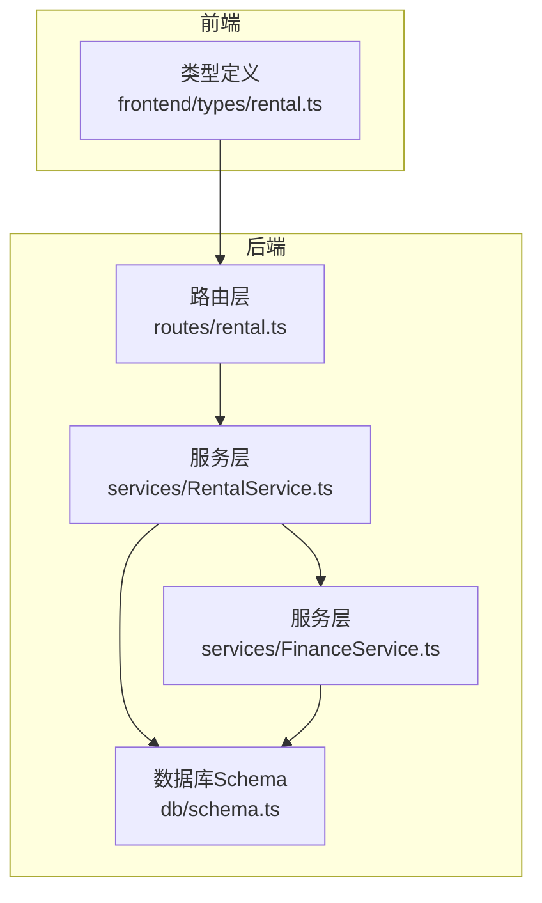
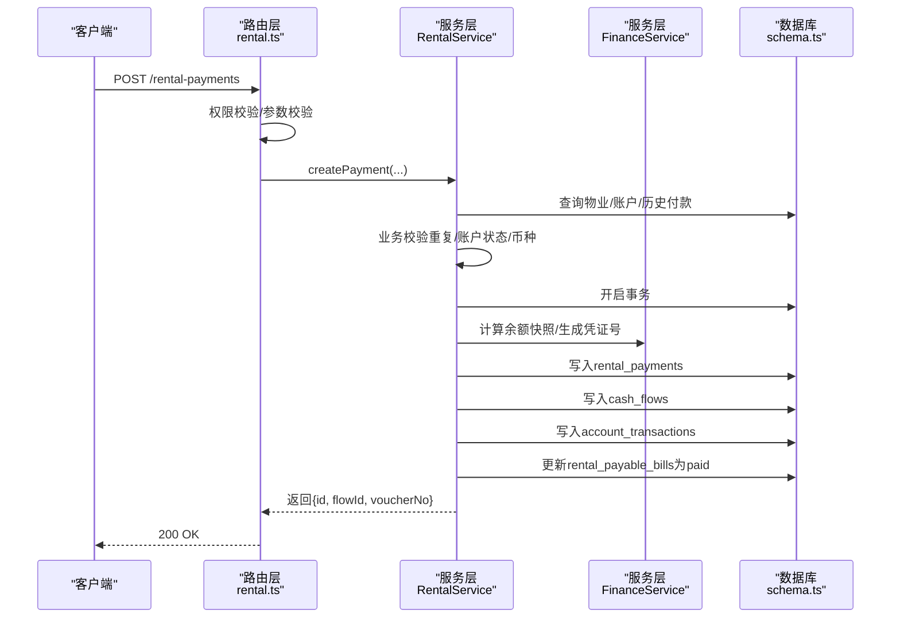
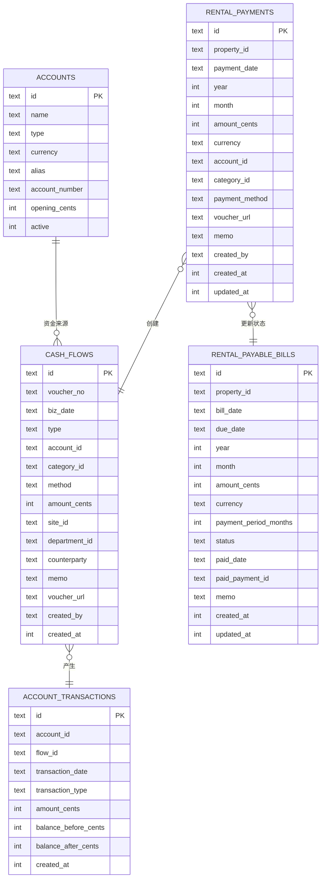
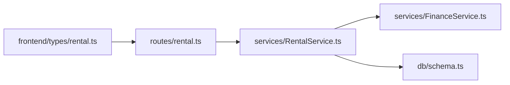

# 付款管理API

<cite>
**本文引用的文件**
- [backend/src/routes/rental.ts](file://backend/src/routes/rental.ts)
- [backend/src/services/RentalService.ts](file://backend/src/services/RentalService.ts)
- [backend/src/services/FinanceService.ts](file://backend/src/services/FinanceService.ts)
- [backend/src/db/schema.ts](file://backend/src/db/schema.ts)
- [backend/src/schemas/business.schema.ts](file://backend/src/schemas/business.schema.ts)
- [backend/openapi.json](file://backend/openapi.json)
- [frontend/src/types/rental.ts](file://frontend/src/types/rental.ts)
</cite>

## 目录
1. [简介](#简介)
2. [项目结构](#项目结构)
3. [核心组件](#核心组件)
4. [架构总览](#架构总览)
5. [详细组件分析](#详细组件分析)
6. [依赖关系分析](#依赖关系分析)
7. [性能考量](#性能考量)
8. [故障排查指南](#故障排查指南)
9. [结论](#结论)
10. [附录](#附录)

## 简介
本文件面向“付款管理API”，聚焦于租赁付款的创建、更新、删除接口，以及与财务流水的联动机制（凭证号生成、账户余额计算、现金流水创建）。同时覆盖应付账单状态自动更新为“已支付”的逻辑、付款记录查询接口（支持按房产、年份、月份过滤）、以及付款创建时的业务校验规则（账户状态、币种匹配、重复付款检查等）。

## 项目结构
- 后端路由层：定义REST接口、请求/响应OpenAPI模式、权限控制与审计日志。
- 服务层：实现业务逻辑，包含事务性写入、余额快照计算、凭证号生成、应付账单状态更新等。
- 数据层：Drizzle ORM映射SQLite表结构，包含租赁付款、现金流水、账户交易、应付账单等。
- 前端类型：提供前端侧的类型定义，便于对接接口返回数据。

图表来源
- [backend/src/routes/rental.ts](file://backend/src/routes/rental.ts#L390-L571)
- [backend/src/services/RentalService.ts](file://backend/src/services/RentalService.ts#L206-L350)
- [backend/src/services/FinanceService.ts](file://backend/src/services/FinanceService.ts#L27-L69)
- [backend/src/db/schema.ts](file://backend/src/db/schema.ts#L165-L193)
- [frontend/src/types/rental.ts](file://frontend/src/types/rental.ts#L1-L141)

章节来源
- [backend/src/routes/rental.ts](file://backend/src/routes/rental.ts#L390-L571)
- [backend/src/services/RentalService.ts](file://backend/src/services/RentalService.ts#L206-L350)
- [backend/src/db/schema.ts](file://backend/src/db/schema.ts#L165-L193)

## 核心组件
- 路由层（rental.ts）：提供“创建/更新/删除付款”和“查询付款列表”接口，并进行权限校验与审计日志记录。
- 服务层（RentalService）：实现付款创建的完整业务流程，包括重复付款检查、账户状态与币种校验、事务内写入、应付账单状态更新。
- 服务层（FinanceService）：提供凭证号生成、账户余额快照计算等通用财务能力。
- 数据层（schema.ts）：定义cash_flows、account_transactions、rental_payments、rental_payable_bills等核心表结构。

章节来源
- [backend/src/routes/rental.ts](file://backend/src/routes/rental.ts#L390-L571)
- [backend/src/services/RentalService.ts](file://backend/src/services/RentalService.ts#L206-L350)
- [backend/src/services/FinanceService.ts](file://backend/src/services/FinanceService.ts#L27-L69)
- [backend/src/db/schema.ts](file://backend/src/db/schema.ts#L165-L193)

## 架构总览
付款创建的端到端流程如下：
- 路由层接收请求，进行权限校验与参数校验。
- 服务层执行业务规则：重复付款检查、账户有效性与币种匹配、事务内写入。
- 服务层调用FinanceService生成凭证号并计算余额快照，写入cash_flows与account_transactions。
- 服务层更新对应应付账单状态为“已支付”。

图表来源
- [backend/src/routes/rental.ts](file://backend/src/routes/rental.ts#L436-L491)
- [backend/src/services/RentalService.ts](file://backend/src/services/RentalService.ts#L238-L349)
- [backend/src/services/FinanceService.ts](file://backend/src/services/FinanceService.ts#L27-L69)
- [backend/src/db/schema.ts](file://backend/src/db/schema.ts#L165-L193)

## 详细组件分析

### 接口定义与权限
- 创建租赁付款
  - 方法与路径：POST /rental-payments
  - 请求体：包含propertyId、paymentDate、year、month、amountCents、currency、accountId、categoryId、paymentMethod、voucherUrl、memo等字段。
  - 响应：返回id、flowId、voucherNo。
  - 权限：需要“asset.rental.create”。
  - 审计：记录创建动作与关键字段。
- 更新租赁付款
  - 方法与路径：PUT /rental-payments/{id}
  - 请求体：可选字段包括paymentDate、amountCents、voucherUrl、memo。
  - 权限：需要“asset.reent.update”。
  - 审计：记录更新动作与字段。
- 删除租赁付款
  - 方法与路径：DELETE /rental-payments/{id}
  - 权限：需要“asset.rental.delete”。
  - 审计：记录删除动作与关键信息。
- 查询付款列表
  - 方法与路径：GET /rental-payments
  - 查询参数：propertyId、year、month。
  - 响应：返回results数组，包含payment及关联属性。

章节来源
- [backend/src/routes/rental.ts](file://backend/src/routes/rental.ts#L390-L571)
- [backend/openapi.json](file://backend/openapi.json#L12059-L12106)

### 业务校验规则（创建时）
- 物业存在性：若找不到对应物业，抛出未找到错误。
- 重复付款检查：同一propertyId+year+month不允许重复创建。
- 账户有效性与状态：账户必须存在且处于启用状态。
- 币种匹配：付款货币需与账户币种一致。
- 参数约束：amountCents必须为正整数，year/month在有效范围内，currency为3位代码。

章节来源
- [backend/src/services/RentalService.ts](file://backend/src/services/RentalService.ts#L238-L266)
- [backend/src/schemas/business.schema.ts](file://backend/src/schemas/business.schema.ts#L580-L603)

### 凭证号生成与会计分录
- 凭证号生成：基于业务日期bizDate统计当日流水数量，生成序列号，拼接为JZYYYYMMDD-SSS格式。
- 现金流水（cash_flows）：插入一条expense记录，包含账户、部门、摘要、附件等。
- 账户交易（account_transactions）：插入一条交易记录，记录余额快照（balanceBefore/balanceAfter）。
- 余额计算：通过FinanceService的快照算法，取指定日期时间点前最近一笔交易的balanceAfter作为基准，或取账户期初余额。

章节来源
- [backend/src/services/RentalService.ts](file://backend/src/services/RentalService.ts#L272-L349)
- [backend/src/services/FinanceService.ts](file://backend/src/services/FinanceService.ts#L27-L69)
- [backend/src/db/schema.ts](file://backend/src/db/schema.ts#L165-L193)

### 应付账单状态自动更新
- 在付款创建成功后，服务层会将对应propertyId、year、month且状态为“unpaid”的应付账单更新为“paid”，并记录paidDate与paidPaymentId。
- 若应付账单不存在或已支付，则抛出业务异常。

章节来源
- [backend/src/services/RentalService.ts](file://backend/src/services/RentalService.ts#L336-L346)

### 付款记录查询（按房产、年份、月份过滤）
- 支持的查询参数：propertyId、year、month。
- 返回字段：payment及关联的propertyCode、propertyName、propertyType、accountName、categoryName、createdByName等。
- 排序：按年、月、创建时间降序。

章节来源
- [backend/src/routes/rental.ts](file://backend/src/routes/rental.ts#L391-L434)
- [backend/src/services/RentalService.ts](file://backend/src/services/RentalService.ts#L208-L236)

### 数据模型关系

图表来源
- [backend/src/db/schema.ts](file://backend/src/db/schema.ts#L165-L193)
- [backend/src/db/schema.ts](file://backend/src/db/schema.ts#L563-L579)
- [backend/src/db/schema.ts](file://backend/src/db/schema.ts#L614-L631)

## 依赖关系分析
- 路由层依赖服务层：所有业务逻辑由RentalService承载。
- 服务层依赖FinanceService：用于凭证号生成与余额快照计算。
- 服务层依赖数据库Schema：读写rental_payments、cash_flows、account_transactions、rental_payable_bills等。
- 前端类型依赖后端接口返回结构：用于类型安全的前端展示与交互。

图表来源
- [backend/src/routes/rental.ts](file://backend/src/routes/rental.ts#L390-L571)
- [backend/src/services/RentalService.ts](file://backend/src/services/RentalService.ts#L206-L350)
- [backend/src/services/FinanceService.ts](file://backend/src/services/FinanceService.ts#L27-L69)
- [backend/src/db/schema.ts](file://backend/src/db/schema.ts#L165-L193)
- [frontend/src/types/rental.ts](file://frontend/src/types/rental.ts#L1-L141)

## 性能考量
- 事务边界：付款创建采用数据库事务，确保cash_flows、account_transactions与rental_payments的一致性，避免中间态。
- 并发与快照：余额计算基于“交易日期严格小于等于目标日期，且创建时间严格小于目标时间”的条件，保证回溯一致性。
- 索引建议：cash_flows与account_transactions的biz_date、transaction_date、accountId、flowId等字段可考虑建立索引以提升查询性能（当前为SQLite默认索引策略）。
- 批量查询：列表查询使用LEFT JOIN关联多表，建议在高频查询场景下对关联键建立索引。

[本节为通用指导，不直接分析具体文件]

## 故障排查指南
- 重复付款错误：当同一propertyId+year+month已存在付款记录时，会触发重复错误。请检查输入参数或先删除历史记录再重试。
- 账户停用/币种不匹配：账户不存在、账户停用或币种与账户不一致会导致业务错误。请核对accountId与currency。
- 未找到物业/应付账单：若物业或应付账单不存在，将抛出未找到错误。请确认propertyId与账单状态。
- 审计日志：路由层在创建/更新/删除付款时记录审计动作，可用于问题定位与追踪。

章节来源
- [backend/src/services/RentalService.ts](file://backend/src/services/RentalService.ts#L238-L266)
- [backend/src/routes/rental.ts](file://backend/src/routes/rental.ts#L462-L491)

## 结论
本API围绕“租赁付款”实现了完整的闭环：从创建、更新、删除到与财务流水的联动，包括凭证号生成、余额快照、应付账单状态更新。通过严格的业务校验与事务保障，确保了数据一致性与可追溯性。查询接口支持按房产、年份、月份过滤，满足日常对账与报表需求。

[本节为总结性内容，不直接分析具体文件]

## 附录

### 接口一览（按功能分组）
- 付款管理
  - POST /rental-payments：创建付款
  - PUT /rental-payments/{id}：更新付款
  - DELETE /rental-payments/{id}：删除付款
  - GET /rental-payments：查询付款列表（支持propertyId/year/month过滤）

章节来源
- [backend/src/routes/rental.ts](file://backend/src/routes/rental.ts#L390-L571)
- [backend/openapi.json](file://backend/openapi.json#L12059-L12106)

### 关键字段说明（创建请求体）
- propertyId：所属物业ID
- paymentDate：付款日期
- year/month：所属会计期间
- amountCents：金额（分）
- currency：币种（3位代码）
- accountId：付款账户ID
- categoryId：费用分类ID（可选）
- paymentMethod：付款方式（可选）
- voucherUrl：凭证URL（可选）
- memo：备注（可选）

章节来源
- [backend/src/schemas/business.schema.ts](file://backend/src/schemas/business.schema.ts#L580-L603)
- [backend/src/routes/rental.ts](file://backend/src/routes/rental.ts#L436-L491)