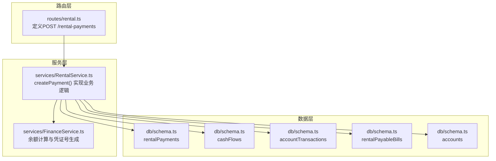
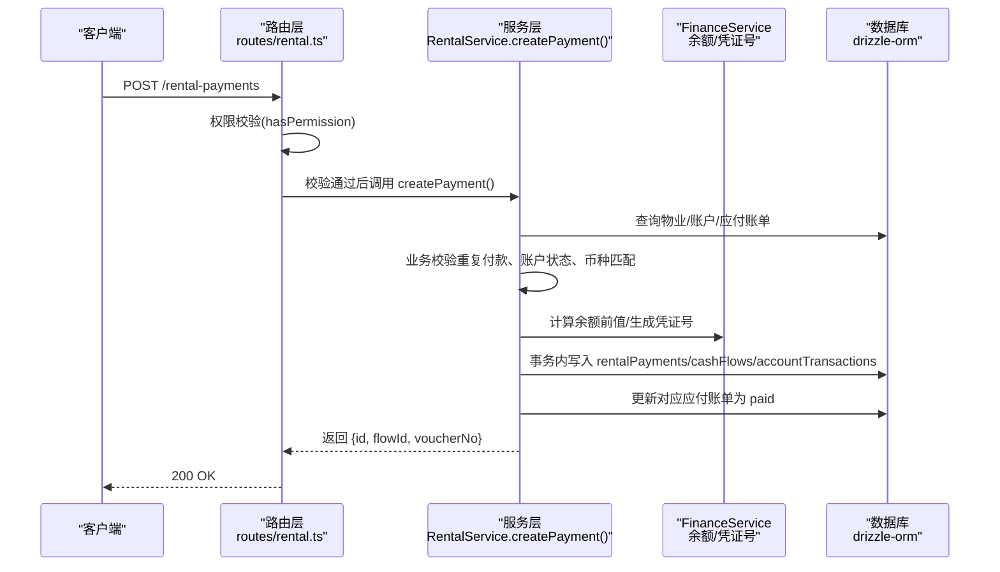
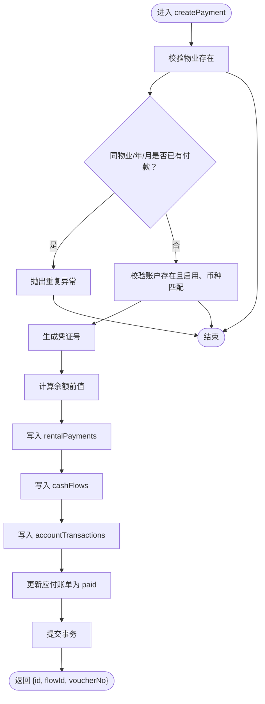
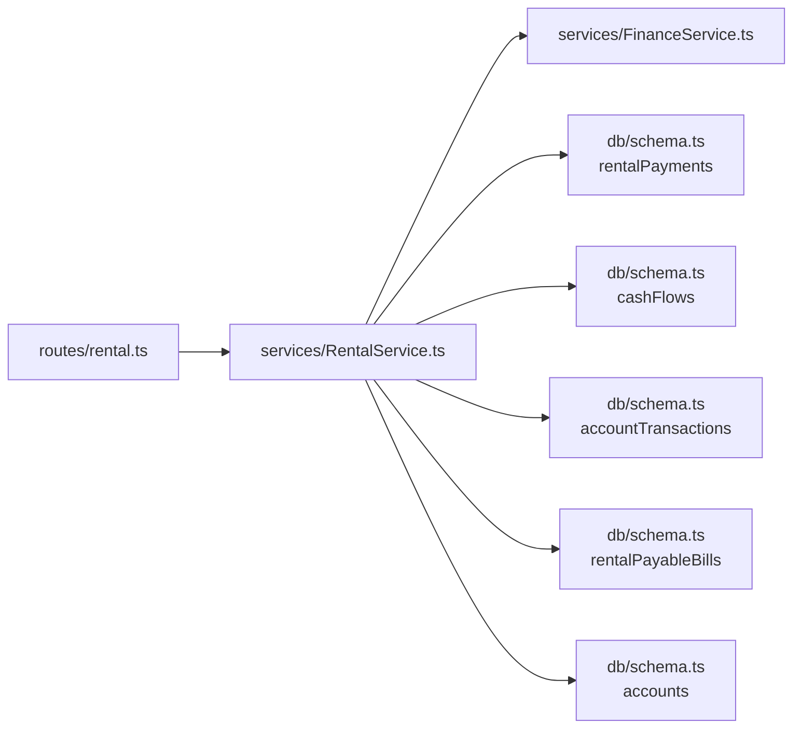

# 创建付款记录

<cite>
**本文引用的文件**
- [backend/src/routes/rental.ts](file://backend/src/routes/rental.ts)
- [backend/src/services/RentalService.ts](file://backend/src/services/RentalService.ts)
- [backend/src/schemas/business.schema.ts](file://backend/src/schemas/business.schema.ts)
- [backend/src/db/schema.ts](file://backend/src/db/schema.ts)
- [backend/src/services/FinanceService.ts](file://backend/src/services/FinanceService.ts)
- [backend/test/routes/rental.test.ts](file://backend/test/routes/rental.test.ts)
- [frontend/src/types/rental.ts](file://frontend/src/types/rental.ts)
</cite>

## 目录
1. [简介](#简介)
2. [项目结构](#项目结构)
3. [核心组件](#核心组件)
4. [架构总览](#架构总览)
5. [详细组件分析](#详细组件分析)
6. [依赖关系分析](#依赖关系分析)
7. [性能考量](#性能考量)
8. [故障排查指南](#故障排查指南)
9. [结论](#结论)

## 简介
本文件面向“创建租赁付款记录”的API，提供从接口定义、业务校验规则、数据流到系统行为的完整说明。目标读者既包括开发者，也包括非技术用户。内容涵盖：
- 接口请求方法与路径
- 必填字段与校验规则
- 业务逻辑与约束（重复付款、账户状态与币种匹配）
- 成功响应字段（付款ID、财务流水ID、凭证号）
- 操作触发的后续流程（财务流水创建、账户余额更新、应付账单状态变更）

## 项目结构
围绕“创建租赁付款记录”，涉及以下关键模块：
- 路由层：定义HTTP端点、请求体Schema、响应Schema
- 服务层：实现业务逻辑、事务控制、跨表更新
- 数据层：数据库表结构（含应付账单、现金流、账户交易）
- 前端类型：统一字段语义，便于前后端协作

图表来源
- [backend/src/routes/rental.ts](file://backend/src/routes/rental.ts#L436-L491)
- [backend/src/services/RentalService.ts](file://backend/src/services/RentalService.ts#L238-L350)
- [backend/src/services/FinanceService.ts](file://backend/src/services/FinanceService.ts#L28-L39)
- [backend/src/db/schema.ts](file://backend/src/db/schema.ts#L165-L200)
- [backend/src/db/schema.ts](file://backend/src/db/schema.ts#L614-L631)

章节来源
- [backend/src/routes/rental.ts](file://backend/src/routes/rental.ts#L436-L491)
- [backend/src/services/RentalService.ts](file://backend/src/services/RentalService.ts#L238-L350)
- [backend/src/db/schema.ts](file://backend/src/db/schema.ts#L165-L200)
- [backend/src/db/schema.ts](file://backend/src/db/schema.ts#L614-L631)

## 核心组件
- 路由与请求体Schema
  - POST /rental-payments
  - 请求体Schema：createRentalPaymentSchema
- 服务层实现
  - createPayment：执行业务校验、事务写入、财务流水与账户交易、应付账单状态更新
- 数据层模型
  - rentalPayments、cashFlows、accountTransactions、rentalPayableBills、accounts

章节来源
- [backend/src/routes/rental.ts](file://backend/src/routes/rental.ts#L436-L491)
- [backend/src/schemas/business.schema.ts](file://backend/src/schemas/business.schema.ts#L580-L593)
- [backend/src/services/RentalService.ts](file://backend/src/services/RentalService.ts#L238-L350)
- [backend/src/db/schema.ts](file://backend/src/db/schema.ts#L165-L200)
- [backend/src/db/schema.ts](file://backend/src/db/schema.ts#L614-L631)

## 架构总览
下图展示“创建租赁付款记录”的端到端调用序列，包括权限校验、业务校验、事务写入、财务流水与账户交易、应付账单状态更新。

图表来源
- [backend/src/routes/rental.ts](file://backend/src/routes/rental.ts#L461-L491)
- [backend/src/services/RentalService.ts](file://backend/src/services/RentalService.ts#L238-L350)
- [backend/src/services/FinanceService.ts](file://backend/src/services/FinanceService.ts#L28-L39)

## 详细组件分析

### 接口定义与请求体Schema
- 方法与路径
  - POST /rental-payments
- 请求体Schema（createRentalPaymentSchema）
  - 必填字段
    - propertyId：UUID
    - paymentDate：日期字符串
    - year：整数（2000~2100）
    - month：整数（1~12）
    - amountCents：正整数（分）
    - currency：3位币种代码
    - accountId：UUID
  - 可选字段
    - categoryId、paymentMethod、voucherUrl、memo
- 响应Schema
  - id：付款记录ID
  - flowId：财务流水ID
  - voucherNo：凭证号

章节来源
- [backend/src/routes/rental.ts](file://backend/src/routes/rental.ts#L436-L491)
- [backend/src/schemas/business.schema.ts](file://backend/src/schemas/business.schema.ts#L580-L593)

### 业务校验规则
- 物业存在性校验
  - 若找不到对应propertyId，抛出未找到异常
- 防止重复付款
  - 同一propertyId+year+month仅允许一条付款记录；若已存在则抛出重复异常
- 账户状态与币种匹配
  - 账户必须存在且处于启用状态
  - 账户币种需与请求中的currency一致
- 金额与币种格式
  - amountCents必须为正整数
  - currency必须为3位大写字母

章节来源
- [backend/src/services/RentalService.ts](file://backend/src/services/RentalService.ts#L252-L266)
- [backend/src/schemas/business.schema.ts](file://backend/src/schemas/business.schema.ts#L580-L593)

### 事务与数据写入流程
- 事务边界
  - 使用数据库事务包裹写入，保证一致性
- 写入顺序与字段
  - rentalPayments：插入付款记录
  - cashFlows：创建财务流水（凭证号由FinanceService生成）
  - accountTransactions：记录账户交易明细（余额前/后）
  - rentalPayableBills：将对应应付账单标记为paid，并回写paidDate与paidPaymentId
- 凭证号生成
  - 依据bizDate统计当日流水数量，生成JZYYYYMMDD-NNN格式的凭证号

图表来源
- [backend/src/services/RentalService.ts](file://backend/src/services/RentalService.ts#L238-L350)
- [backend/src/services/FinanceService.ts](file://backend/src/services/FinanceService.ts#L28-L39)

章节来源
- [backend/src/services/RentalService.ts](file://backend/src/services/RentalService.ts#L238-L350)
- [backend/src/services/FinanceService.ts](file://backend/src/services/FinanceService.ts#L28-L39)

### 成功响应字段说明
- id：本次创建的租赁付款记录ID
- flowId：创建的财务流水ID
- voucherNo：凭证号（JZYYYYMMDD-NNN）

章节来源
- [backend/src/routes/rental.ts](file://backend/src/routes/rental.ts#L436-L491)
- [backend/src/services/RentalService.ts](file://backend/src/services/RentalService.ts#L336-L349)

### 触发的后续流程
- 财务流水创建
  - 在cashFlows中新增一条expense类型的流水，包含bizDate、amountCents、accountId、memo等
- 账户余额更新
  - 在accountTransactions中新增一条交易记录，记录balanceBeforeCents与balanceAfterCents
- 应付账单状态更新
  - 将对应propertyId、year、month且status为unpaid的应付账单更新为paid，并写入paidDate与paidPaymentId

章节来源
- [backend/src/services/RentalService.ts](file://backend/src/services/RentalService.ts#L302-L349)
- [backend/src/db/schema.ts](file://backend/src/db/schema.ts#L165-L200)
- [backend/src/db/schema.ts](file://backend/src/db/schema.ts#L614-L631)

### 前后端字段映射参考
- 前端类型定义中包含RentalPayment字段，用于展示与交互
- 后端请求体Schema与前端类型在字段命名上保持一致，便于对接

章节来源
- [frontend/src/types/rental.ts](file://frontend/src/types/rental.ts#L67-L88)
- [backend/src/schemas/business.schema.ts](file://backend/src/schemas/business.schema.ts#L580-L593)

## 依赖关系分析
- 路由依赖服务层
  - routes/rental.ts在POST /rental-payments中调用RentalService.createPayment
- 服务层依赖数据层与财务服务
  - RentalService.createPayment依赖FinanceService进行余额计算与凭证号生成
  - RentalService.createPayment依赖drizzle-orm访问数据库表
- 数据层表之间的关系
  - rentalPayments与rentalPayableBills通过propertyId、year、month关联
  - cashFlows与accountTransactions通过flowId关联
  - accounts为账户基础信息来源

图表来源
- [backend/src/routes/rental.ts](file://backend/src/routes/rental.ts#L461-L491)
- [backend/src/services/RentalService.ts](file://backend/src/services/RentalService.ts#L238-L350)
- [backend/src/services/FinanceService.ts](file://backend/src/services/FinanceService.ts#L28-L39)
- [backend/src/db/schema.ts](file://backend/src/db/schema.ts#L165-L200)
- [backend/src/db/schema.ts](file://backend/src/db/schema.ts#L614-L631)

章节来源
- [backend/src/routes/rental.ts](file://backend/src/routes/rental.ts#L461-L491)
- [backend/src/services/RentalService.ts](file://backend/src/services/RentalService.ts#L238-L350)
- [backend/src/db/schema.ts](file://backend/src/db/schema.ts#L165-L200)
- [backend/src/db/schema.ts](file://backend/src/db/schema.ts#L614-L631)

## 性能考量
- 事务原子性
  - 所有写入均在单事务中完成，避免中间态数据不一致
- 查询与写入
  - 重复付款校验使用精确条件（propertyId、year、month）
  - 账户币种匹配在写入前一次性完成，减少后续回滚成本
- 凭证号生成
  - 依据bizDate计数生成，避免并发冲突时的锁竞争

[本节为通用指导，无需特定文件来源]

## 故障排查指南
- 403 禁止访问
  - 当前用户缺少“asset.rental.create”权限
  - 检查权限配置与登录状态
- 404 物业不存在
  - propertyId无效或已被删除
  - 核对propertyId是否正确
- 409 重复付款
  - 同一propertyId+year+month已存在付款记录
  - 请检查是否需要更新而非重复创建
- 400 业务错误：账户已停用/币种不匹配
  - accountId对应的账户未启用或币种与请求不一致
  - 修正账户选择或币种
- 200 成功但后续状态异常
  - 若应付账单未更新为paid，请检查对应propertyId、year、month是否匹配
  - 检查是否有多个应付账单处于unpaid状态

章节来源
- [backend/src/routes/rental.ts](file://backend/src/routes/rental.ts#L461-L491)
- [backend/src/services/RentalService.ts](file://backend/src/services/RentalService.ts#L252-L266)
- [backend/test/routes/rental.test.ts](file://backend/test/routes/rental.test.ts#L195-L215)

## 结论
“创建租赁付款记录”API通过严格的业务校验与事务保障，确保数据一致性与合规性。其核心价值在于：
- 明确的必填字段与校验规则，降低错误输入风险
- 自动化生成财务流水与凭证号，完善财务档案
- 自动更新账户余额与应付账单状态，提升财务自动化水平