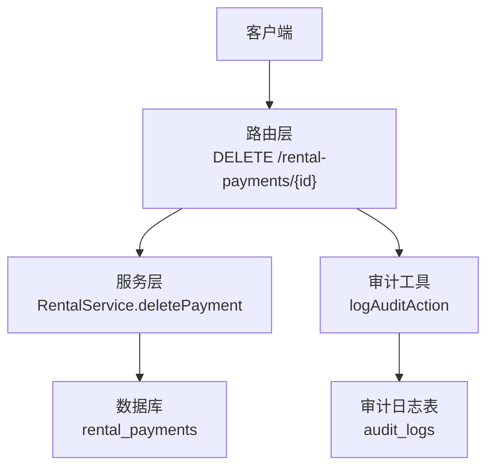
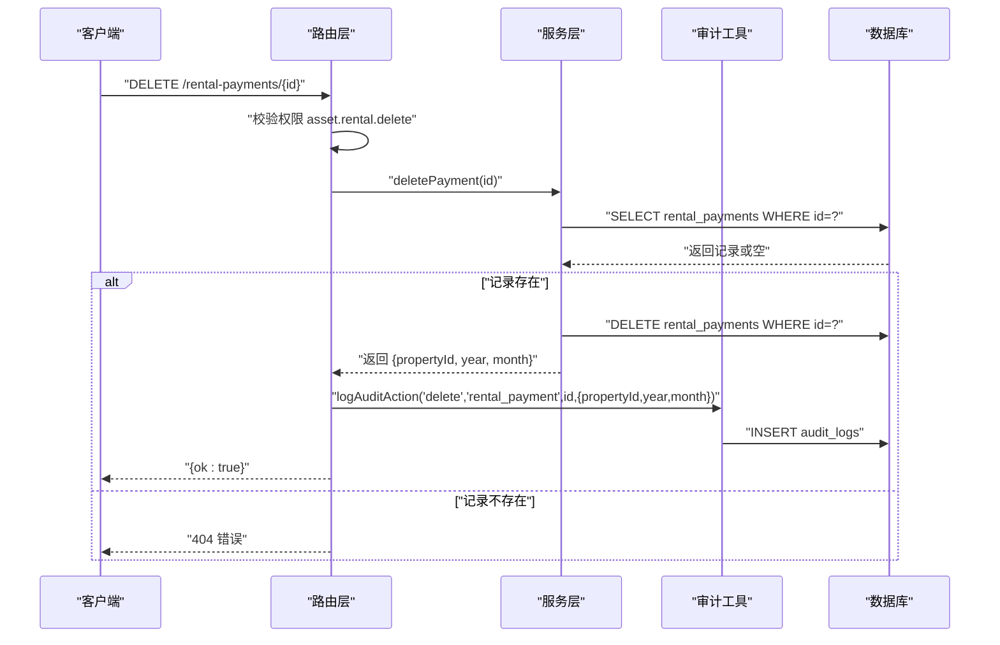
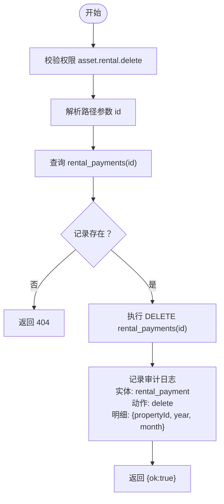
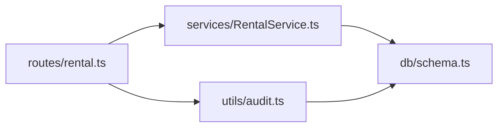

# 删除付款记录

<cite>
**本文引用的文件**
- [backend/src/routes/rental.ts](file://backend/src/routes/rental.ts)
- [backend/src/services/RentalService.ts](file://backend/src/services/RentalService.ts)
- [backend/src/utils/audit.ts](file://backend/src/utils/audit.ts)
- [backend/src/db/schema.ts](file://backend/src/db/schema.ts)
- [backend/src/db/schema.sql](file://backend/src/db/schema.sql)
- [backend/test/routes/rental.test.ts](file://backend/test/routes/rental.test.ts)
</cite>

## 目录
1. [简介](#简介)
2. [项目结构](#项目结构)
3. [核心组件](#核心组件)
4. [架构总览](#架构总览)
5. [详细组件分析](#详细组件分析)
6. [依赖关系分析](#依赖关系分析)
7. [性能考量](#性能考量)
8. [故障排查指南](#故障排查指南)
9. [结论](#结论)

## 简介
本文件面向“删除租赁付款记录”的API，提供完整的技术与操作说明。根据仓库实现：
- 删除接口为HTTP DELETE，路径为 /rental-payments/{id}，需提供付款记录ID作为路径参数。
- 删除操作为硬删除（直接从数据库移除），不包含软删除或标记删除逻辑。
- 删除后会触发审计日志记录，记录实体类型为 rental_payment，并包含被删除记录的 propertyId、year、month 字段。
- 在创建付款记录时，系统会同时创建财务流水（cash_flows）与账户交易记录（account_transactions），但删除付款记录不会回滚这些财务流水。

## 项目结构
围绕删除付款记录的相关模块分布如下：
- 路由层：定义DELETE /rental-payments/{id}端点，校验权限并调用服务层。
- 服务层：执行删除逻辑，返回被删除记录的关键信息用于审计。
- 审计工具：统一记录审计日志，包含操作者、实体、实体ID、明细等。
- 数据模型：rental_payments 表存储付款记录；cash_flows、account_transactions 与付款创建时关联。
- 测试：验证DELETE端点返回状态与响应体。

图表来源
- [backend/src/routes/rental.ts](file://backend/src/routes/rental.ts#L536-L568)
- [backend/src/services/RentalService.ts](file://backend/src/services/RentalService.ts#L359-L365)
- [backend/src/utils/audit.ts](file://backend/src/utils/audit.ts#L61-L92)
- [backend/src/db/schema.ts](file://backend/src/db/schema.ts#L165-L193)

章节来源
- [backend/src/routes/rental.ts](file://backend/src/routes/rental.ts#L536-L568)
- [backend/src/services/RentalService.ts](file://backend/src/services/RentalService.ts#L359-L365)
- [backend/src/utils/audit.ts](file://backend/src/utils/audit.ts#L61-L92)
- [backend/src/db/schema.ts](file://backend/src/db/schema.ts#L165-L193)

## 核心组件
- 路由层（DELETE /rental-payments/{id}）
  - 权限校验：要求具备 asset.rental.delete 权限。
  - 参数解析：从路径参数提取付款记录ID。
  - 业务调用：调用服务层 RentalService.deletePayment。
  - 审计记录：调用 logAuditAction 记录删除动作，明细包含 propertyId、year、month。
  - 响应：返回 { ok: true }。
- 服务层（RentalService.deletePayment）
  - 查询：按ID查询付款记录是否存在。
  - 删除：执行硬删除（DELETE）。
  - 返回：返回被删除记录的 propertyId、year、month，供审计使用。
- 审计工具（logAuditAction）
  - 统一记录审计日志，包含操作者ID、动作、实体、实体ID、明细JSON、IP与IP归属地。
- 数据模型（rental_payments）
  - 存储付款记录，包含 propertyId、year、month 等关键字段，删除时用于审计明细。

章节来源
- [backend/src/routes/rental.ts](file://backend/src/routes/rental.ts#L536-L568)
- [backend/src/services/RentalService.ts](file://backend/src/services/RentalService.ts#L359-L365)
- [backend/src/utils/audit.ts](file://backend/src/utils/audit.ts#L61-L92)
- [backend/src/db/schema.ts](file://backend/src/db/schema.ts#L563-L579)

## 架构总览
删除付款记录的调用链路如下：

图表来源
- [backend/src/routes/rental.ts](file://backend/src/routes/rental.ts#L555-L568)
- [backend/src/services/RentalService.ts](file://backend/src/services/RentalService.ts#L359-L365)
- [backend/src/utils/audit.ts](file://backend/src/utils/audit.ts#L61-L92)

## 详细组件分析

### 删除接口定义与行为
- 接口路径：/rental-payments/{id}
- 方法：DELETE
- 权限：asset.rental.delete
- 请求参数：路径参数 id（UUID）
- 成功响应：{ ok: true }
- 失败场景：
  - 无权限：抛出禁止访问错误。
  - 未找到记录：抛出未找到错误。
- 审计明细：包含 propertyId、year、month。

章节来源
- [backend/src/routes/rental.ts](file://backend/src/routes/rental.ts#L536-L568)

### 服务层删除逻辑
- 查询存在性：按ID查询付款记录。
- 删除执行：对 rental_payments 表执行硬删除。
- 返回值：返回被删除记录的 propertyId、year、month，供审计使用。

章节来源
- [backend/src/services/RentalService.ts](file://backend/src/services/RentalService.ts#L359-L365)

### 审计日志记录
- 实体类型：rental_payment
- 动作：delete
- 明细字段：propertyId、year、month
- IP与IP归属地：从请求头自动采集并写入审计日志表。

章节来源
- [backend/src/routes/rental.ts](file://backend/src/routes/rental.ts#L560-L567)
- [backend/src/utils/audit.ts](file://backend/src/utils/audit.ts#L61-L92)

### 数据模型与约束
- rental_payments 表包含 propertyId、year、month 等字段，删除时用于审计明细。
- 删除付款记录不会影响 cash_flows 与 account_transactions，因为删除逻辑为硬删除且未回滚财务流水。

章节来源
- [backend/src/db/schema.ts](file://backend/src/db/schema.ts#L563-L579)
- [backend/src/db/schema.ts](file://backend/src/db/schema.ts#L165-L193)
- [backend/src/db/schema.sql](file://backend/src/db/schema.sql#L529-L576)

### 删除限制条件与现状
- 当前实现为硬删除，未设置软删除或标记删除字段。
- 由于删除逻辑直接执行 DELETE，未检查是否已关联财务流水；因此删除后不会自动回滚或清理财务流水。
- 若未来需要支持“仅可删除未关联财务流水”的限制，可在服务层增加对 cash_flows 的关联检查后再执行删除。

章节来源
- [backend/src/services/RentalService.ts](file://backend/src/services/RentalService.ts#L359-L365)
- [backend/src/db/schema.ts](file://backend/src/db/schema.ts#L165-L193)

### 删除操作触发的审计日志记录
- 记录内容：实体类型 rental_payment，动作 delete，实体ID为付款记录ID，明细包含 propertyId、year、month。
- 记录来源：路由层在删除完成后调用审计工具记录。

章节来源
- [backend/src/routes/rental.ts](file://backend/src/routes/rental.ts#L560-L567)
- [backend/src/utils/audit.ts](file://backend/src/utils/audit.ts#L61-L92)

### 删除流程图（基于当前实现）

图表来源
- [backend/src/routes/rental.ts](file://backend/src/routes/rental.ts#L555-L568)
- [backend/src/services/RentalService.ts](file://backend/src/services/RentalService.ts#L359-L365)
- [backend/src/utils/audit.ts](file://backend/src/utils/audit.ts#L61-L92)

## 依赖关系分析
- 路由层依赖服务层进行业务处理。
- 服务层依赖数据库进行读写。
- 审计工具独立于业务逻辑，统一记录审计日志。
- 数据模型定义了删除操作所涉及的核心表。

图表来源
- [backend/src/routes/rental.ts](file://backend/src/routes/rental.ts#L536-L568)
- [backend/src/services/RentalService.ts](file://backend/src/services/RentalService.ts#L359-L365)
- [backend/src/utils/audit.ts](file://backend/src/utils/audit.ts#L61-L92)
- [backend/src/db/schema.ts](file://backend/src/db/schema.ts#L165-L193)

章节来源
- [backend/src/routes/rental.ts](file://backend/src/routes/rental.ts#L536-L568)
- [backend/src/services/RentalService.ts](file://backend/src/services/RentalService.ts#L359-L365)
- [backend/src/utils/audit.ts](file://backend/src/utils/audit.ts#L61-L92)
- [backend/src/db/schema.ts](file://backend/src/db/schema.ts#L165-L193)

## 性能考量
- 删除操作为单条记录的硬删除，复杂度为 O(1)，数据库层面通常很快。
- 审计日志写入采用异步等待（waitUntil），避免阻塞主请求响应。
- 由于删除不涉及财务流水回滚，整体开销较小。

章节来源
- [backend/src/utils/audit.ts](file://backend/src/utils/audit.ts#L82-L91)

## 故障排查指南
- 403 禁止访问：检查用户是否具备 asset.rental.delete 权限。
- 404 未找到：确认付款记录ID是否存在。
- 审计日志缺失：确认审计工具可用且网络环境允许异步等待。
- 财务流水未回滚：当前实现为硬删除，不会自动回滚 cash_flows/account_transactions；如需此能力，请评估在服务层增加关联检查与回滚逻辑。

章节来源
- [backend/src/routes/rental.ts](file://backend/src/routes/rental.ts#L555-L568)
- [backend/src/utils/audit.ts](file://backend/src/utils/audit.ts#L82-L91)

## 结论
- 删除租赁付款记录API为硬删除，不包含软删除或标记删除逻辑。
- 删除后会记录审计日志，明细包含 propertyId、year、month。
- 删除操作不会自动回滚已创建的财务流水；若业务需要“仅可删除未关联财务流水”，建议在服务层增加对 cash_flows 的关联检查后再执行删除。