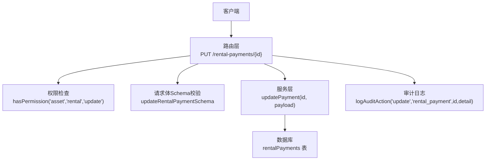
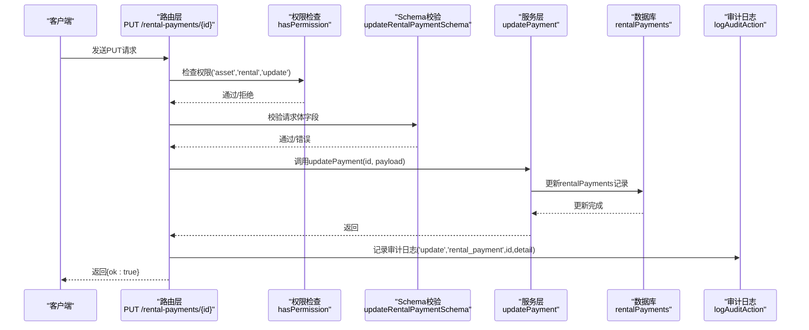
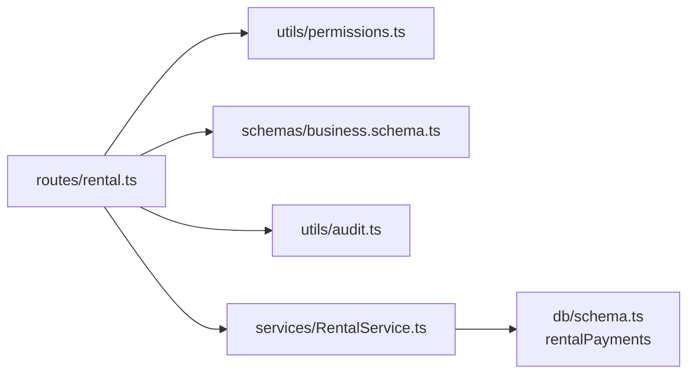

# 更新付款记录

<cite>
**本文引用的文件**
- [backend/src/routes/rental.ts](file://backend/src/routes/rental.ts)
- [backend/src/services/RentalService.ts](file://backend/src/services/RentalService.ts)
- [backend/src/schemas/business.schema.ts](file://backend/src/schemas/business.schema.ts)
- [backend/src/utils/permissions.ts](file://backend/src/utils/permissions.ts)
- [backend/src/utils/audit.ts](file://backend/src/utils/audit.ts)
- [backend/src/db/schema.ts](file://backend/src/db/schema.ts)
- [backend/test/routes/rental.test.ts](file://backend/test/routes/rental.test.ts)
</cite>

## 目录
1. [简介](#简介)
2. [项目结构](#项目结构)
3. [核心组件](#核心组件)
4. [架构总览](#架构总览)
5. [详细组件分析](#详细组件分析)
6. [依赖关系分析](#依赖关系分析)
7. [性能考量](#性能考量)
8. [故障排查指南](#故障排查指南)
9. [结论](#结论)

## 简介
本文件面向“更新租赁付款记录”API（PUT /rental-payments/{id}），提供完整的技术与操作说明。该API用于修改已存在的租赁付款记录中的以下字段：
- paymentDate：付款日期
- amountCents：金额（分）
- voucherUrl：凭证链接
- memo：备注

同时明确以下关键约束与行为：
- 权限控制：仅具备“资产-租赁-更新”权限的用户可调用。
- 数据验证：基于OpenAPI Schema进行输入校验。
- 不可篡改性：更新仅作用于付款记录本身，不修改已生成的财务流水与账户交易，确保历史数据不可篡改。
- 审计日志：每次更新均记录审计日志，便于追踪。

## 项目结构
围绕“更新租赁付款记录”的相关代码分布如下：
- 路由层：定义并暴露PUT接口，负责鉴权、参数解析与调用服务层。
- 服务层：实现业务逻辑，执行数据库更新。
- 模式层：定义请求体Schema，保障输入合法性。
- 权限工具：封装权限检查方法。
- 审计工具：统一记录审计日志。
- 数据库Schema：定义付款记录表结构及关联实体。

图表来源
- [backend/src/routes/rental.ts](file://backend/src/routes/rental.ts#L493-L534)
- [backend/src/services/RentalService.ts](file://backend/src/services/RentalService.ts#L352-L357)
- [backend/src/schemas/business.schema.ts](file://backend/src/schemas/business.schema.ts#L596-L603)
- [backend/src/utils/permissions.ts](file://backend/src/utils/permissions.ts#L88-L114)
- [backend/src/utils/audit.ts](file://backend/src/utils/audit.ts#L61-L91)
- [backend/src/db/schema.ts](file://backend/src/db/schema.ts#L563-L579)

章节来源
- [backend/src/routes/rental.ts](file://backend/src/routes/rental.ts#L493-L534)
- [backend/src/services/RentalService.ts](file://backend/src/services/RentalService.ts#L352-L357)
- [backend/src/schemas/business.schema.ts](file://backend/src/schemas/business.schema.ts#L596-L603)
- [backend/src/utils/permissions.ts](file://backend/src/utils/permissions.ts#L88-L114)
- [backend/src/utils/audit.ts](file://backend/src/utils/audit.ts#L61-L91)
- [backend/src/db/schema.ts](file://backend/src/db/schema.ts#L563-L579)

## 核心组件
- 路由与控制器
  - 定义了PUT /rental-payments/{id}接口，使用OpenAPI Route进行声明，并通过zod对请求体进行Schema校验。
  - 在处理前进行权限检查：仅当用户具备“资产-租赁-更新”权限时才允许更新。
  - 调用服务层的updatePayment方法，传入要更新的字段。
  - 记录审计日志，记录动作、实体、实体ID与变更详情。
- 服务层
  - updatePayment(id, payload)：根据id查询现有记录，若不存在则抛出未找到错误；存在则执行更新，仅更新payload中提供的字段，时间戳自动更新。
- 数据模型
  - rentalPayments表包含paymentDate、amountCents、voucherUrl、memo等字段，以及创建者、创建与更新时间等元数据。
- 权限与审计
  - 权限检查通过hasPermission实现，审计日志通过logAuditAction统一记录。

章节来源
- [backend/src/routes/rental.ts](file://backend/src/routes/rental.ts#L493-L534)
- [backend/src/services/RentalService.ts](file://backend/src/services/RentalService.ts#L352-L357)
- [backend/src/db/schema.ts](file://backend/src/db/schema.ts#L563-L579)
- [backend/src/utils/permissions.ts](file://backend/src/utils/permissions.ts#L88-L114)
- [backend/src/utils/audit.ts](file://backend/src/utils/audit.ts#L61-L91)

## 架构总览
下图展示从客户端到数据库的完整调用链路，突出“仅更新付款记录”的边界，以及审计日志的落点。

图表来源
- [backend/src/routes/rental.ts](file://backend/src/routes/rental.ts#L493-L534)
- [backend/src/services/RentalService.ts](file://backend/src/services/RentalService.ts#L352-L357)
- [backend/src/utils/audit.ts](file://backend/src/utils/audit.ts#L61-L91)
- [backend/src/schemas/business.schema.ts](file://backend/src/schemas/business.schema.ts#L596-L603)

## 详细组件分析

### 接口定义与权限控制
- 接口路径与方法：PUT /rental-payments/{id}
- 请求体Schema：updateRentalPaymentSchema，允许更新paymentDate、amountCents、voucherUrl、memo等字段。
- 权限要求：hasPermission('asset','rental','update')，未满足时抛出禁止访问错误。
- 处理流程：解析参数与请求体，调用服务层，记录审计日志，返回成功响应。

章节来源
- [backend/src/routes/rental.ts](file://backend/src/routes/rental.ts#L493-L534)
- [backend/src/schemas/business.schema.ts](file://backend/src/schemas/business.schema.ts#L596-L603)
- [backend/src/utils/permissions.ts](file://backend/src/utils/permissions.ts#L88-L114)

### 服务层更新逻辑
- 校验：先查询是否存在该id的付款记录，不存在则抛出未找到错误。
- 更新：对提供的字段执行更新，同时更新updatedAt时间戳。
- 不涉及财务流水与账户交易：该更新不触发现金流与账户交易表的任何变更，确保历史数据不可篡改。

章节来源
- [backend/src/services/RentalService.ts](file://backend/src/services/RentalService.ts#L352-L357)
- [backend/src/db/schema.ts](file://backend/src/db/schema.ts#L563-L579)

### 数据验证流程
- 请求体Schema对各字段进行类型与范围校验：
  - paymentDate：日期格式校验
  - amountCents：正整数校验
  - voucherUrl：URL格式校验
  - memo：字符串可空
- 未通过校验将返回相应错误，阻止进入业务逻辑。

章节来源
- [backend/src/schemas/business.schema.ts](file://backend/src/schemas/business.schema.ts#L596-L603)

### 审计日志记录
- 日志内容：记录操作人、动作（update）、实体（rental_payment）、实体ID、变更详情（请求体JSON）。
- IP与位置：从请求头中提取客户端IP与城市/国家信息，写入审计日志。
- 异步记录：使用waitUntil确保日志异步写入，不影响主流程响应。

章节来源
- [backend/src/utils/audit.ts](file://backend/src/utils/audit.ts#L61-L91)

### 不可篡改性说明
- 更新仅针对rentalPayments表，不修改cashFlows与accountTransactions表。
- 这样设计确保历史财务流水与账户余额快照保持稳定，防止对已发生业务的篡改。

章节来源
- [backend/src/services/RentalService.ts](file://backend/src/services/RentalService.ts#L352-L357)
- [backend/src/db/schema.ts](file://backend/src/db/schema.ts#L165-L193)

### 测试覆盖
- 单元测试验证：
  - 路由层对PUT /rental-payments/{id}的调用返回200与{ok:true}。
  - 服务层updatePayment被正确调用。
  - 权限检查与Schema校验在测试中通过mock配合。

章节来源
- [backend/test/routes/rental.test.ts](file://backend/test/routes/rental.test.ts#L217-L228)

## 依赖关系分析
- 路由层依赖：
  - 权限工具：hasPermission
  - Schema：updateRentalPaymentSchema
  - 审计工具：logAuditAction
  - 服务层：RentalService.updatePayment
- 服务层依赖：
  - 数据库：rentalPayments表
- 数据库层：
  - rentalPayments表字段与业务含义清晰，支撑“仅更新付款记录”的边界。

图表来源
- [backend/src/routes/rental.ts](file://backend/src/routes/rental.ts#L493-L534)
- [backend/src/utils/permissions.ts](file://backend/src/utils/permissions.ts#L88-L114)
- [backend/src/utils/audit.ts](file://backend/src/utils/audit.ts#L61-L91)
- [backend/src/schemas/business.schema.ts](file://backend/src/schemas/business.schema.ts#L596-L603)
- [backend/src/services/RentalService.ts](file://backend/src/services/RentalService.ts#L352-L357)
- [backend/src/db/schema.ts](file://backend/src/db/schema.ts#L563-L579)

## 性能考量
- 更新操作为单条记录写入，复杂度低，性能开销主要来自数据库I/O与事务提交。
- 审计日志采用异步记录，避免阻塞主流程。
- 若未来存在批量更新场景，建议在路由层增加幂等与速率限制策略，以降低并发压力。

## 故障排查指南
- 403 禁止访问
  - 检查用户是否具备“资产-租赁-更新”权限。
  - 确认部门模块访问范围与职位权限配置。
- 404 未找到
  - 检查id是否有效，确认目标付款记录是否存在。
- 400 参数错误
  - 校验请求体字段是否符合updateRentalPaymentSchema要求（日期、正整数、URL等）。
- 审计日志缺失
  - 确认logAuditAction是否被调用，检查waitUntil是否可用；必要时在本地环境复现并观察日志输出。

章节来源
- [backend/src/utils/permissions.ts](file://backend/src/utils/permissions.ts#L88-L114)
- [backend/src/services/RentalService.ts](file://backend/src/services/RentalService.ts#L352-L357)
- [backend/src/utils/audit.ts](file://backend/src/utils/audit.ts#L61-L91)

## 结论
“更新租赁付款记录”API严格遵循“仅更新付款记录、不修改财务流水与账户交易”的原则，结合严格的权限控制与Schema校验，确保数据安全与可追溯性。每次更新都会产生审计日志，便于事后审计与问题定位。该设计既满足业务灵活性，又维护了财务数据的不可篡改性与一致性。