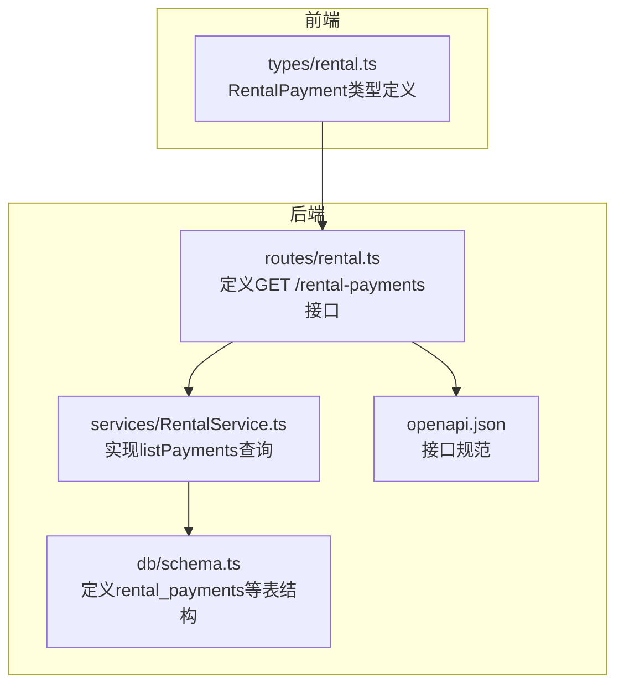
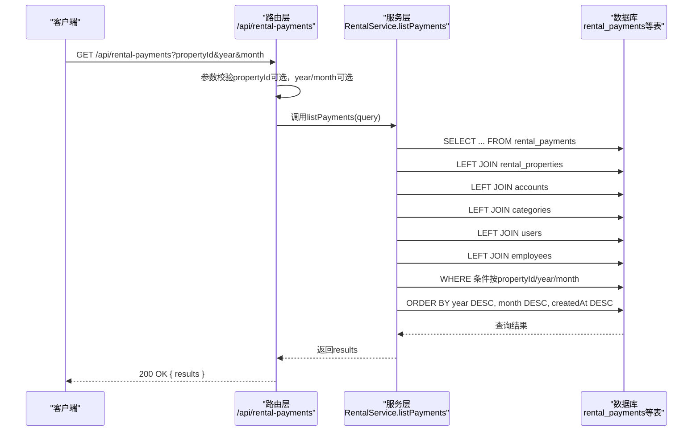
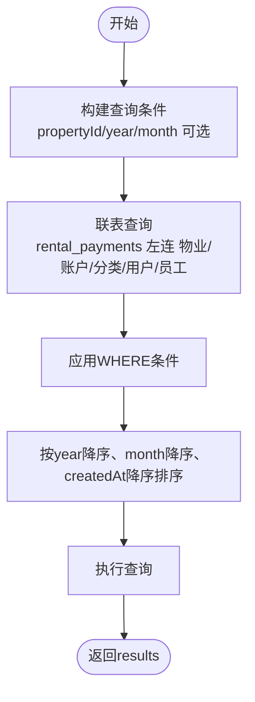
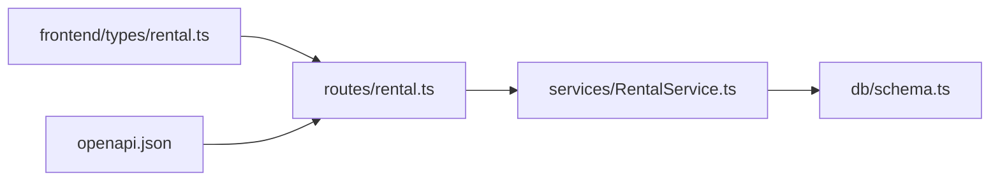

# 查询付款记录

<cite>
**本文引用的文件**
- [backend/src/routes/rental.ts](file://backend/src/routes/rental.ts)
- [backend/src/services/RentalService.ts](file://backend/src/services/RentalService.ts)
- [backend/src/db/schema.ts](file://backend/src/db/schema.ts)
- [backend/openapi.json](file://backend/openapi.json)
- [frontend/src/types/rental.ts](file://frontend/src/types/rental.ts)
- [backend/test/routes/rental.test.ts](file://backend/test/routes/rental.test.ts)
</cite>

## 目录
1. [简介](#简介)
2. [项目结构](#项目结构)
3. [核心组件](#核心组件)
4. [架构总览](#架构总览)
5. [详细组件分析](#详细组件分析)
6. [依赖关系分析](#依赖关系分析)
7. [性能考量](#性能考量)
8. [故障排查指南](#故障排查指南)
9. [结论](#结论)
10. [附录](#附录)

## 简介
本文件面向后端与前端开发者，系统性说明“查询租赁付款记录”API的接口设计、数据结构、排序规则与使用方式。该API支持通过物业ID、年份、月份进行过滤，并返回包含付款详情、关联物业信息、账户名称、分类名称以及创建人姓名的完整结果集。查询结果按年份、月份与创建时间倒序排列，便于快速定位最新记录。

## 项目结构
围绕“查询付款记录”的关键文件分布如下：
- 路由层：定义HTTP GET接口、参数校验与响应结构
- 服务层：封装数据库查询逻辑，执行联表查询并应用过滤条件与排序
- 数据模型：定义付款记录表结构及关联字段
- 前端类型：定义前端侧期望的数据结构
- 测试：验证路由行为与返回结构

图表来源
- [backend/src/routes/rental.ts](file://backend/src/routes/rental.ts#L391-L434)
- [backend/src/services/RentalService.ts](file://backend/src/services/RentalService.ts#L208-L236)
- [backend/src/db/schema.ts](file://backend/src/db/schema.ts#L563-L579)
- [backend/openapi.json](file://backend/openapi.json#L11904-L11947)
- [frontend/src/types/rental.ts](file://frontend/src/types/rental.ts#L67-L88)

章节来源
- [backend/src/routes/rental.ts](file://backend/src/routes/rental.ts#L391-L434)
- [backend/src/services/RentalService.ts](file://backend/src/services/RentalService.ts#L208-L236)
- [backend/src/db/schema.ts](file://backend/src/db/schema.ts#L563-L579)
- [backend/openapi.json](file://backend/openapi.json#L11904-L11947)
- [frontend/src/types/rental.ts](file://frontend/src/types/rental.ts#L67-L88)

## 核心组件
- 接口路径与方法
  - 方法：GET
  - 路径：/api/rental-payments
  - 权限：需具备用户身份（路由层会校验）
- 请求参数
  - propertyId：可选，字符串（UUID），用于按物业过滤
  - year：可选，整数或空值，用于按年份过滤
  - month：可选，整数或空值，用于按月份过滤
- 返回结构
  - results：数组，元素为对象，包含以下字段：
    - payment：付款记录详情（来自付款表）
    - propertyCode：关联物业编码（来自物业表）
    - propertyName：关联物业名称（来自物业表）
    - propertyType：关联物业类型（来自物业表）
    - accountName：账户名称（来自账户表）
    - categoryName：分类名称（来自分类表）
    - createdByName：创建人姓名（来自员工表）

章节来源
- [backend/src/routes/rental.ts](file://backend/src/routes/rental.ts#L391-L434)
- [backend/openapi.json](file://backend/openapi.json#L11904-L11947)
- [backend/src/services/RentalService.ts](file://backend/src/services/RentalService.ts#L208-L236)
- [frontend/src/types/rental.ts](file://frontend/src/types/rental.ts#L67-L88)

## 架构总览
下图展示从客户端到数据库的调用链路与联表查询关系。

图表来源
- [backend/src/routes/rental.ts](file://backend/src/routes/rental.ts#L391-L434)
- [backend/src/services/RentalService.ts](file://backend/src/services/RentalService.ts#L208-L236)
- [backend/src/db/schema.ts](file://backend/src/db/schema.ts#L563-L579)

## 详细组件分析

### 路由层：GET /api/rental-payments
- 功能：接收propertyId、year、month三个可选查询参数，校验后调用服务层查询，并返回标准结构results。
- 关键点：
  - 参数校验：propertyId为UUID可选，year/month为整数可选
  - 权限控制：路由层会检查用户身份（未满足将拒绝访问）
  - 响应结构：results数组，元素包含payment与关联字段

章节来源
- [backend/src/routes/rental.ts](file://backend/src/routes/rental.ts#L391-L434)

### 服务层：RentalService.listPayments
- 功能：根据查询条件构建联表查询，返回付款记录及其关联信息，并按年份、月份与创建时间倒序。
- 查询要点：
  - 过滤条件：propertyId、year、month三者均为可选，存在即加入WHERE条件
  - 联表关系：
    - rental_payments -> rental_properties（propertyId=id）
    - rental_payments -> accounts（accountId=id）
    - rental_payments -> categories（categoryId=id）
    - rental_payments -> users（createdBy=id）
    - users -> employees（users.email=employees.email）
  - 排序规则：先按year降序，再按month降序，最后按createdAt降序

章节来源
- [backend/src/services/RentalService.ts](file://backend/src/services/RentalService.ts#L208-L236)

### 数据模型：rental_payments 表
- 字段概览（与查询相关）：
  - id、propertyId、paymentDate、year、month、amountCents、currency、accountId、categoryId、paymentMethod、voucherUrl、memo、createdBy、createdAt、updatedAt
- 作用：存储每笔付款记录，作为查询主表

章节来源
- [backend/src/db/schema.ts](file://backend/src/db/schema.ts#L563-L579)

### 前端类型：RentalPayment
- 用途：前端侧期望的付款记录字段集合，包含property_name、accountName、categoryName、createdBy_name等
- 说明：服务层返回的payment字段为原始付款记录，前端类型用于UI渲染与显示

章节来源
- [frontend/src/types/rental.ts](file://frontend/src/types/rental.ts#L67-L88)

### 接口规范：OpenAPI
- 路径：/api/rental-payments
- 方法：GET
- 参数：propertyId（可选）、year（可选）、month（可选）
- 响应：results数组，元素包含payment与property/account/category/createdBy等字段

章节来源
- [backend/openapi.json](file://backend/openapi.json#L11904-L11947)

### 使用示例
- 查询特定物业的全部付款历史
  - 请求：GET /api/rental-payments?propertyId={物业ID}
  - 结果：返回该物业的所有付款记录，按年、月、创建时间倒序
- 查询某年某月的所有付款记录
  - 请求：GET /api/rental-payments?year={年}&month={月}
  - 结果：返回该年月的所有付款记录
- 组合过滤：同时指定propertyId、year、month
  - 请求：GET /api/rental-payments?propertyId={物业ID}&year={年}&month={月}
  - 结果：返回该物业在该年月的付款记录

章节来源
- [backend/src/routes/rental.ts](file://backend/src/routes/rental.ts#L391-L434)
- [backend/src/services/RentalService.ts](file://backend/src/services/RentalService.ts#L208-L236)

### 排序逻辑详解
- 排序字段：year、month、createdAt
- 排序方向：均按降序排列
- 设计意图：
  - 年份优先，确保最新年度在前
  - 同一年内按月份倒序，便于查看最近月份
  - 最后按创建时间倒序，保证同一天内最新记录优先

图表来源
- [backend/src/services/RentalService.ts](file://backend/src/services/RentalService.ts#L208-L236)

## 依赖关系分析
- 路由层依赖服务层：路由负责参数校验与权限控制，随后调用服务层执行业务逻辑
- 服务层依赖数据库：通过Drizzle ORM执行联表查询与排序
- 数据模型依赖：服务层基于schema.ts中定义的表结构进行联表
- 前端类型依赖：前端类型用于UI渲染，与后端返回结构保持一致

图表来源
- [backend/src/routes/rental.ts](file://backend/src/routes/rental.ts#L391-L434)
- [backend/src/services/RentalService.ts](file://backend/src/services/RentalService.ts#L208-L236)
- [backend/src/db/schema.ts](file://backend/src/db/schema.ts#L563-L579)
- [frontend/src/types/rental.ts](file://frontend/src/types/rental.ts#L67-L88)
- [backend/openapi.json](file://backend/openapi.json#L11904-L11947)

## 性能考量
- 过滤字段建议：
  - propertyId、year、month均为可选，建议在高频查询场景中尽量组合使用，以减少扫描范围
- 排序字段：
  - 排序基于year、month、createdAt，建议在上述列上建立索引以提升排序与过滤性能
- 联表数量：
  - 当前联表涉及5张表，建议评估是否可通过物化视图或缓存优化热点查询

[本节为通用性能建议，不直接分析具体文件]

## 故障排查指南
- 无权限访问
  - 现象：返回403或被拒绝
  - 处理：确认已登录且具备相应权限
- 参数格式错误
  - 现象：参数非UUID或year/month非整数导致校验失败
  - 处理：确保propertyId为合法UUID，year/month为整数或省略
- 无数据返回
  - 现象：返回空数组
  - 处理：检查过滤条件是否过于严格；尝试放宽条件或清除无效参数
- 排序不符合预期
  - 现象：排序顺序与预期不符
  - 处理：确认排序字段为year、month、createdAt，且均为降序

章节来源
- [backend/src/routes/rental.ts](file://backend/src/routes/rental.ts#L391-L434)
- [backend/test/routes/rental.test.ts](file://backend/test/routes/rental.test.ts#L181-L193)

## 结论
“查询租赁付款记录”API通过清晰的参数过滤与稳定的排序策略，为用户提供灵活的历史检索能力。结合物业、账户、分类与创建人的关联信息，能够满足财务与运营的多维度核对需求。建议在生产环境中为关键列建立索引，并在前端合理展示返回字段，以获得最佳体验。

[本节为总结性内容，不直接分析具体文件]

## 附录
- 接口定义（OpenAPI）
  - 路径：/api/rental-payments
  - 方法：GET
  - 参数：propertyId（可选）、year（可选）、month（可选）
  - 响应：results数组，元素包含payment与property/account/category/createdBy等字段

章节来源
- [backend/openapi.json](file://backend/openapi.json#L11904-L11947)