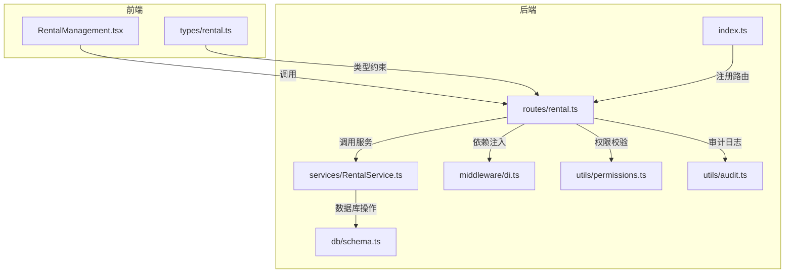
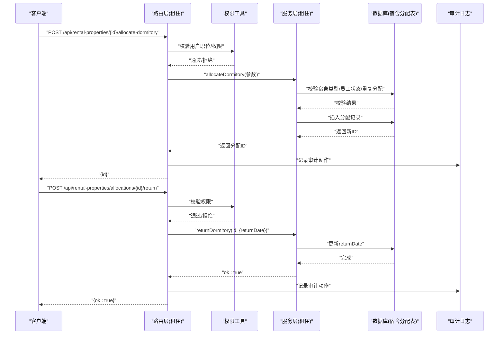
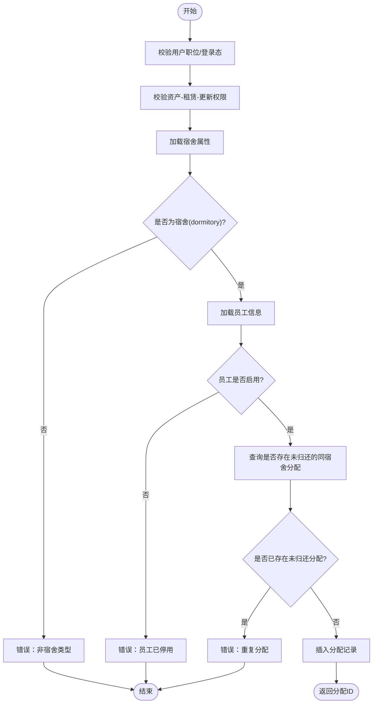
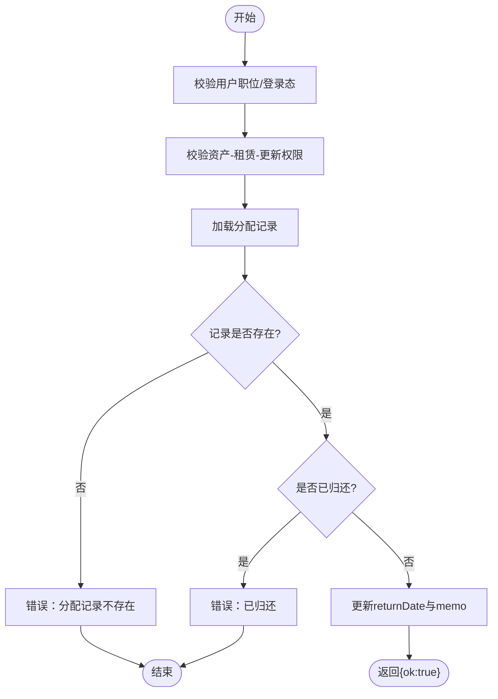
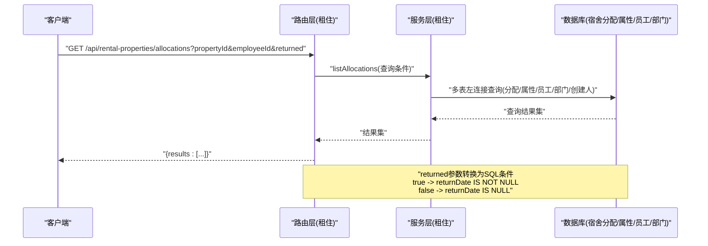
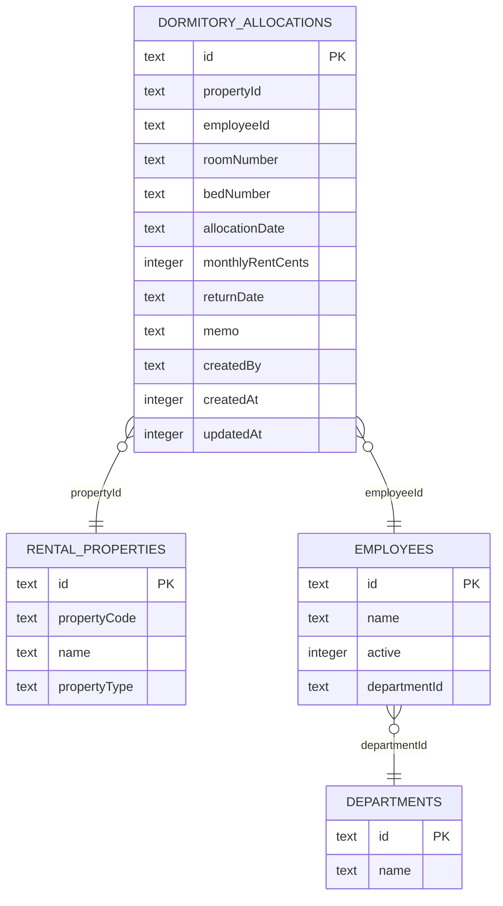
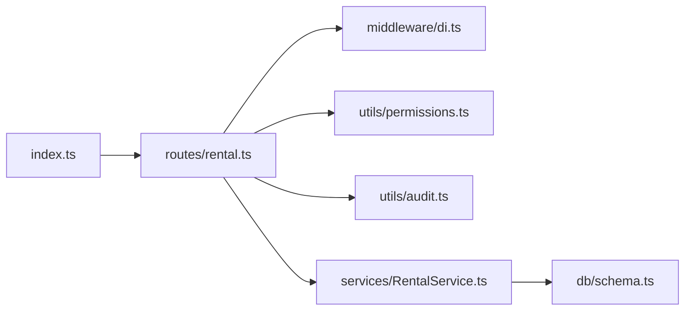

# 宿舍分配API

<cite>
**本文引用的文件**
- [backend/src/routes/rental.ts](file://backend/src/routes/rental.ts)
- [backend/src/services/RentalService.ts](file://backend/src/services/RentalService.ts)
- [backend/src/schemas/business.schema.ts](file://backend/src/schemas/business.schema.ts)
- [backend/src/schemas/common.schema.ts](file://backend/src/schemas/common.schema.ts)
- [backend/src/db/schema.ts](file://backend/src/db/schema.ts)
- [backend/src/middleware/di.ts](file://backend/src/middleware/di.ts)
- [backend/src/utils/permissions.ts](file://backend/src/utils/permissions.ts)
- [backend/src/utils/audit.ts](file://backend/src/utils/audit.ts)
- [backend/src/index.ts](file://backend/src/index.ts)
- [frontend/src/features/assets/pages/RentalManagement.tsx](file://frontend/src/features/assets/pages/RentalManagement.tsx)
- [frontend/src/types/rental.ts](file://frontend/src/types/rental.ts)
</cite>

## 目录
1. [简介](#简介)
2. [项目结构](#项目结构)
3. [核心组件](#核心组件)
4. [架构总览](#架构总览)
5. [详细组件分析](#详细组件分析)
6. [依赖关系分析](#依赖关系分析)
7. [性能考虑](#性能考虑)
8. [故障排查指南](#故障排查指南)
9. [结论](#结论)
10. [附录](#附录)

## 简介
本文件面向“宿舍分配API”的使用与维护，覆盖员工宿舍的分配与归还流程，以及分配记录查询能力。内容包含：
- 员工宿舍分配接口：员工验证、宿舍类型检查、重复分配校验
- 宿舍归还接口：业务逻辑与状态管理
- 分配记录查询接口：支持按房产、员工、归还状态过滤，并关联员工与部门信息
- 前端集成要点与数据模型映射

## 项目结构
后端采用分层设计：
- 路由层：定义REST接口、请求/响应模式与权限控制
- 服务层：封装业务逻辑与数据库操作
- 数据层：Drizzle ORM表结构定义
- 中间件：依赖注入、权限与审计日志
- 前端：页面组件与类型定义

图表来源
- [backend/src/routes/rental.ts](file://backend/src/routes/rental.ts#L1-L200)
- [backend/src/services/RentalService.ts](file://backend/src/services/RentalService.ts#L1-L120)
- [backend/src/db/schema.ts](file://backend/src/db/schema.ts#L590-L644)
- [backend/src/middleware/di.ts](file://backend/src/middleware/di.ts#L39-L62)
- [backend/src/utils/permissions.ts](file://backend/src/utils/permissions.ts#L1-L120)
- [backend/src/utils/audit.ts](file://backend/src/utils/audit.ts#L1-L120)
- [backend/src/index.ts](file://backend/src/index.ts#L100-L120)

章节来源
- [backend/src/routes/rental.ts](file://backend/src/routes/rental.ts#L1-L200)
- [backend/src/services/RentalService.ts](file://backend/src/services/RentalService.ts#L1-L120)
- [backend/src/db/schema.ts](file://backend/src/db/schema.ts#L590-L644)
- [backend/src/middleware/di.ts](file://backend/src/middleware/di.ts#L39-L62)
- [backend/src/index.ts](file://backend/src/index.ts#L100-L120)

## 核心组件
- 路由层（routes/rental.ts）
  - 提供宿舍分配、归还与分配记录查询接口
  - 使用OpenAPI路由定义与Zod校验
  - 权限校验与审计日志记录
- 服务层（services/RentalService.ts）
  - 实现宿舍分配与归还的核心业务逻辑
  - 查询分配记录并关联员工与部门信息
  - 校验宿舍类型、员工有效性与重复分配
- 数据层（db/schema.ts）
  - 定义宿舍分配表与相关联的属性字段
- 前端（RentalManagement.tsx、types/rental.ts）
  - 页面组件与类型定义，支撑分配弹窗与列表展示

章节来源
- [backend/src/routes/rental.ts](file://backend/src/routes/rental.ts#L61-L200)
- [backend/src/services/RentalService.ts](file://backend/src/services/RentalService.ts#L367-L486)
- [backend/src/db/schema.ts](file://backend/src/db/schema.ts#L590-L612)
- [frontend/src/features/assets/pages/RentalManagement.tsx](file://frontend/src/features/assets/pages/RentalManagement.tsx#L960-L998)
- [frontend/src/types/rental.ts](file://frontend/src/types/rental.ts#L53-L110)

## 架构总览
后端通过路由层接收请求，经权限与校验后交由服务层执行业务逻辑，服务层基于Drizzle ORM访问数据库，最终返回结果并记录审计日志。

图表来源
- [backend/src/routes/rental.ts](file://backend/src/routes/rental.ts#L135-L200)
- [backend/src/services/RentalService.ts](file://backend/src/services/RentalService.ts#L431-L486)
- [backend/src/utils/permissions.ts](file://backend/src/utils/permissions.ts#L1-L120)
- [backend/src/utils/audit.ts](file://backend/src/utils/audit.ts#L1-L120)

## 详细组件分析

### 接口一：员工宿舍分配
- 接口路径与方法
  - POST /api/rental-properties/{id}/allocate-dormitory
- 请求体参数
  - employeeId：员工UUID
  - allocationDate：分配日期（YYYY-MM-DD）
  - roomNumber：房间号（可空）
  - bedNumber：床位号（可空）
  - monthlyRentCents：员工需支付的月租金（可空，非负整数）
  - memo：备注（可空）
- 返回
  - { id }：分配记录ID
- 权限与前置校验
  - 用户职位存在性校验
  - 拥有资产-租赁-更新权限
- 业务逻辑
  - 校验宿舍类型为“dormitory”
  - 校验员工存在且处于启用状态
  - 校验同一宿舍未存在未归还的分配记录
  - 插入分配记录并记录创建人
- 审计日志
  - 记录动作类型“allocate”、实体“dormitory”，携带属性ID与员工ID

图表来源
- [backend/src/routes/rental.ts](file://backend/src/routes/rental.ts#L135-L159)
- [backend/src/services/RentalService.ts](file://backend/src/services/RentalService.ts#L431-L474)
- [backend/src/schemas/business.schema.ts](file://backend/src/schemas/business.schema.ts#L608-L615)

章节来源
- [backend/src/routes/rental.ts](file://backend/src/routes/rental.ts#L135-L159)
- [backend/src/services/RentalService.ts](file://backend/src/services/RentalService.ts#L431-L474)
- [backend/src/schemas/business.schema.ts](file://backend/src/schemas/business.schema.ts#L608-L615)

### 接口二：员工宿舍归还
- 接口路径与方法
  - POST /api/rental-properties/allocations/{id}/return
- 请求体参数
  - returnDate：归还日期（YYYY-MM-DD）
  - memo：备注（可空）
- 返回
  - { ok: true }
- 权限与前置校验
  - 用户职位存在性校验
  - 拥有资产-租赁-更新权限
- 业务逻辑
  - 校验分配记录存在
  - 校验未归还状态（避免重复归还）
  - 更新returnDate与memo
- 审计日志
  - 记录动作类型“return”、实体“dormitory_allocation”

图表来源
- [backend/src/routes/rental.ts](file://backend/src/routes/rental.ts#L161-L200)
- [backend/src/services/RentalService.ts](file://backend/src/services/RentalService.ts#L476-L486)

章节来源
- [backend/src/routes/rental.ts](file://backend/src/routes/rental.ts#L161-L200)
- [backend/src/services/RentalService.ts](file://backend/src/services/RentalService.ts#L476-L486)

### 接口三：宿舍分配记录查询
- 接口路径与方法
  - GET /api/rental-properties/allocations
- 查询参数
  - propertyId：宿舍ID（可选）
  - employeeId：员工ID（可选）
  - returned：是否已归还（可选，true/false）
- 返回
  - results：数组，每项包含
    - allocation：分配记录对象
    - propertyCode/propertyName：宿舍编码与名称
    - employeeName：员工姓名
    - employeeDepartmentId/employeeDepartmentName：员工所在部门ID与名称
    - createdByName：创建人姓名
- 关联查询
  - 左连接宿舍属性、员工、部门与创建人用户信息
- 状态过滤
  - returned=true：仅返回已归还记录
  - returned=false：仅返回未归还记录
  - returned缺失：不限制归还状态

图表来源
- [backend/src/routes/rental.ts](file://backend/src/routes/rental.ts#L61-L107)
- [backend/src/services/RentalService.ts](file://backend/src/services/RentalService.ts#L369-L429)

章节来源
- [backend/src/routes/rental.ts](file://backend/src/routes/rental.ts#L61-L107)
- [backend/src/services/RentalService.ts](file://backend/src/services/RentalService.ts#L369-L429)

### 数据模型与字段
- 宿舍分配表（dormitoryAllocations）
  - 字段：id、propertyId、employeeId、roomNumber、bedNumber、allocationDate、monthlyRentCents、returnDate、memo、createdBy、createdAt、updatedAt
- 关键字段说明
  - propertyId：宿舍属性ID（外键）
  - employeeId：员工ID（外键）
  - allocationDate：分配日期
  - returnDate：归还日期（未归还时为空）
  - monthlyRentCents：员工需支付的月租金（可空）

图表来源
- [backend/src/db/schema.ts](file://backend/src/db/schema.ts#L590-L612)

章节来源
- [backend/src/db/schema.ts](file://backend/src/db/schema.ts#L590-L612)

### 前端集成要点
- 页面组件
  - 分配弹窗包含员工选择、房间号、床位号、分配日期、员工需支付月租金、备注等字段
- 类型定义
  - DormitoryAllocation：分配记录结构，包含员工姓名、部门名称、分配/归还时间等

章节来源
- [frontend/src/features/assets/pages/RentalManagement.tsx](file://frontend/src/features/assets/pages/RentalManagement.tsx#L960-L998)
- [frontend/src/types/rental.ts](file://frontend/src/types/rental.ts#L53-L110)

## 依赖关系分析
- 路由依赖
  - 权限工具：用于校验用户职位与资产-租赁-更新权限
  - 审计工具：记录分配与归还动作
  - 依赖注入：将RentalService注入到路由上下文
- 服务层依赖
  - Drizzle ORM：数据库查询与事务
  - 错误工具：统一错误码与消息
- 数据层依赖
  - 宿舍分配表与相关联的属性、员工、部门表

图表来源
- [backend/src/routes/rental.ts](file://backend/src/routes/rental.ts#L1-L20)
- [backend/src/middleware/di.ts](file://backend/src/middleware/di.ts#L39-L62)
- [backend/src/utils/permissions.ts](file://backend/src/utils/permissions.ts#L1-L120)
- [backend/src/utils/audit.ts](file://backend/src/utils/audit.ts#L1-L120)
- [backend/src/services/RentalService.ts](file://backend/src/services/RentalService.ts#L1-L20)
- [backend/src/db/schema.ts](file://backend/src/db/schema.ts#L590-L612)
- [backend/src/index.ts](file://backend/src/index.ts#L100-L120)

章节来源
- [backend/src/routes/rental.ts](file://backend/src/routes/rental.ts#L1-L20)
- [backend/src/middleware/di.ts](file://backend/src/middleware/di.ts#L39-L62)
- [backend/src/utils/permissions.ts](file://backend/src/utils/permissions.ts#L1-L120)
- [backend/src/utils/audit.ts](file://backend/src/utils/audit.ts#L1-L120)
- [backend/src/services/RentalService.ts](file://backend/src/services/RentalService.ts#L1-L20)
- [backend/src/db/schema.ts](file://backend/src/db/schema.ts#L590-L612)
- [backend/src/index.ts](file://backend/src/index.ts#L100-L120)

## 性能考虑
- 查询优化
  - 分配记录查询使用多表左连接，建议在相关列上建立索引（如propertyId、employeeId、returnDate）
- 并发与事务
  - 分配与归还均为单条记录写入，事务开销较小
- 前端渲染
  - 列表分页与筛选参数应合理设置，避免一次性拉取过多数据

[本节为通用指导，无需列出具体文件来源]

## 故障排查指南
- 常见错误与定位
  - “物业不存在”：propertyId无效或被删除
  - “该物业不是宿舍”：propertyType非dormitory
  - “员工不存在”：employeeId无效
  - “员工已停用”：员工active=0
  - “员工已分配到该宿舍”：同一宿舍存在未归还分配
  - “分配记录不存在”：归还时传入的分配ID无效
  - “已归还”：重复归还
- 审计日志
  - 分配与归还均会记录审计日志，便于追踪操作人与对象
- 建议排查步骤
  - 确认请求参数格式（UUID、日期格式）
  - 检查权限与职位校验是否通过
  - 查看服务层抛出的具体错误类型与消息
  - 核对数据库中宿舍属性与员工状态

章节来源
- [backend/src/services/RentalService.ts](file://backend/src/services/RentalService.ts#L431-L486)
- [backend/src/routes/rental.ts](file://backend/src/routes/rental.ts#L135-L200)
- [backend/src/utils/audit.ts](file://backend/src/utils/audit.ts#L1-L120)

## 结论
本API围绕“宿舍分配与归还”提供清晰的接口边界与严格的业务校验，结合分配记录查询与员工/部门关联，满足日常管理需求。通过权限与审计机制保障操作安全与可追溯性。建议在生产环境完善索引与分页策略，持续监控错误日志以提升稳定性。

[本节为总结性内容，无需列出具体文件来源]

## 附录

### 接口一览与参数说明
- POST /api/rental-properties/{id}/allocate-dormitory
  - 路由定义与权限校验：参见 [backend/src/routes/rental.ts](file://backend/src/routes/rental.ts#L135-L159)
  - 业务逻辑：参见 [backend/src/services/RentalService.ts](file://backend/src/services/RentalService.ts#L431-L474)
  - 请求体Schema：参见 [backend/src/schemas/business.schema.ts](file://backend/src/schemas/business.schema.ts#L608-L615)
- POST /api/rental-properties/allocations/{id}/return
  - 路由定义与权限校验：参见 [backend/src/routes/rental.ts](file://backend/src/routes/rental.ts#L161-L200)
  - 业务逻辑：参见 [backend/src/services/RentalService.ts](file://backend/src/services/RentalService.ts#L476-L486)
  - 请求体Schema：参见 [backend/src/schemas/business.schema.ts](file://backend/src/schemas/business.schema.ts#L1012-L1015)
- GET /api/rental-properties/allocations
  - 路由定义与查询参数：参见 [backend/src/routes/rental.ts](file://backend/src/routes/rental.ts#L61-L107)
  - 业务逻辑与关联查询：参见 [backend/src/services/RentalService.ts](file://backend/src/services/RentalService.ts#L369-L429)

### 数据模型字段参考
- 宿舍分配表字段：参见 [backend/src/db/schema.ts](file://backend/src/db/schema.ts#L590-L612)