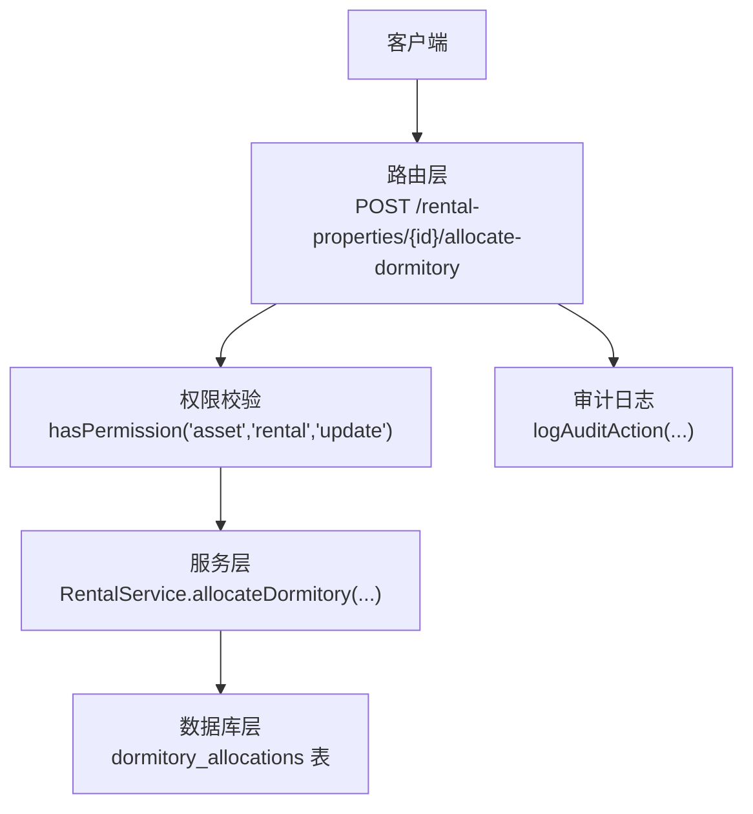
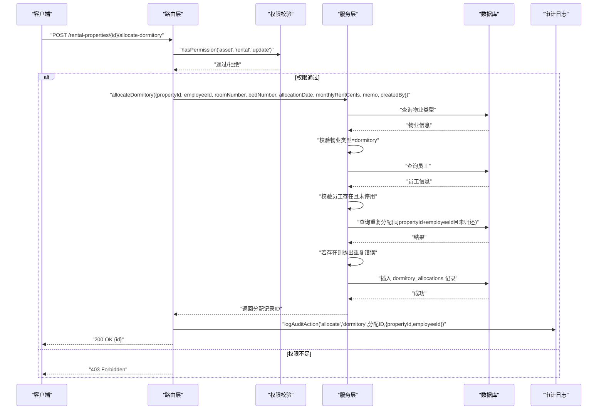
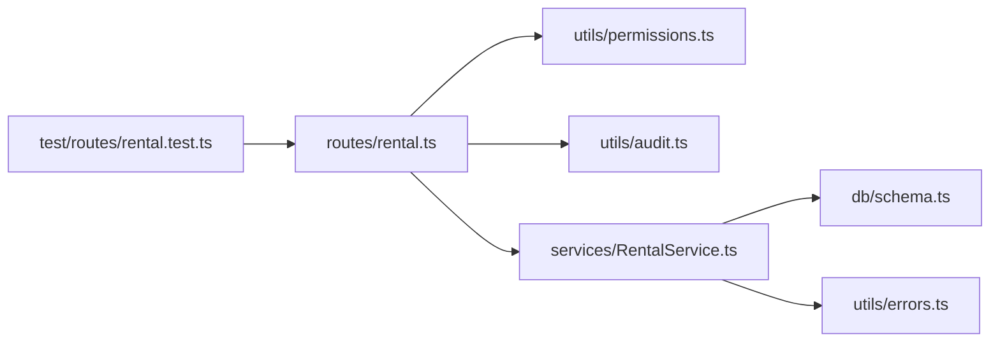

# 宿舍分配接口

<cite>
**本文引用的文件**
- [routes/rental.ts](file://backend/src/routes/rental.ts)
- [services/RentalService.ts](file://backend/src/services/RentalService.ts)
- [schemas/business.schema.ts](file://backend/src/schemas/business.schema.ts)
- [db/schema.ts](file://backend/src/db/schema.ts)
- [utils/errors.ts](file://backend/src/utils/errors.ts)
- [utils/audit.ts](file://backend/src/utils/audit.ts)
- [test/routes/rental.test.ts](file://backend/test/routes/rental.test.ts)
</cite>

## 目录
1. [简介](#简介)
2. [项目结构](#项目结构)
3. [核心组件](#核心组件)
4. [架构总览](#架构总览)
5. [详细组件分析](#详细组件分析)
6. [依赖关系分析](#依赖关系分析)
7. [性能考虑](#性能考虑)
8. [故障排查指南](#故障排查指南)
9. [结论](#结论)
10. [附录](#附录)

## 简介
本文件面向“宿舍分配接口”的使用与实现，聚焦于 POST /rental-properties/{id}/allocate-dormitory 接口。内容涵盖：
- 请求参数与约束
- 员工验证流程（存在性与状态校验）
- 物业类型校验（仅允许宿舍类型）
- 重复分配校验（同一员工在同一宿舍不可重复分配）
- 成功与错误响应示例
- 审计日志记录方式

## 项目结构
该接口位于后端路由层，通过 OpenAPI 路由定义，调用 RentalService 进行业务处理，并在成功后记录审计日志。

图表来源
- [routes/rental.ts](file://backend/src/routes/rental.ts#L109-L159)
- [services/RentalService.ts](file://backend/src/services/RentalService.ts#L431-L474)
- [utils/audit.ts](file://backend/src/utils/audit.ts#L61-L92)

章节来源
- [routes/rental.ts](file://backend/src/routes/rental.ts#L109-L159)
- [services/RentalService.ts](file://backend/src/services/RentalService.ts#L431-L474)

## 核心组件
- 路由层：定义接口路径、请求体与响应体结构，执行权限校验与审计日志记录。
- 服务层：实现业务逻辑，包括物业类型校验、员工存在性与状态校验、重复分配校验以及插入分配记录。
- 数据模型：dormitory_allocations 表存储宿舍分配记录。
- 错误处理：统一错误类型与状态码映射。
- 审计日志：记录操作人、动作、实体与明细。

章节来源
- [routes/rental.ts](file://backend/src/routes/rental.ts#L109-L159)
- [services/RentalService.ts](file://backend/src/services/RentalService.ts#L431-L474)
- [db/schema.ts](file://backend/src/db/schema.ts#L599-L612)
- [utils/errors.ts](file://backend/src/utils/errors.ts#L34-L54)
- [utils/audit.ts](file://backend/src/utils/audit.ts#L61-L92)

## 架构总览
接口调用序列如下：

图表来源
- [routes/rental.ts](file://backend/src/routes/rental.ts#L135-L159)
- [services/RentalService.ts](file://backend/src/services/RentalService.ts#L431-L474)
- [utils/audit.ts](file://backend/src/utils/audit.ts#L61-L92)

## 详细组件分析

### 接口定义与请求参数
- 方法与路径：POST /rental-properties/{id}/allocate-dormitory
- 路径参数
  - id: 字符串，UUID，必填
- 请求体参数（application/json）
  - employeeId: 字符串，UUID，必填
  - allocationDate: 字符串，日期，必填
  - roomNumber: 字符串，可空
  - bedNumber: 字符串，可空
  - monthlyRentCents: 整数，非负，可空
  - memo: 字符串，可空
- 响应
  - 200: { id: 分配记录ID }

章节来源
- [routes/rental.ts](file://backend/src/routes/rental.ts#L109-L133)
- [schemas/business.schema.ts](file://backend/src/schemas/business.schema.ts#L608-L615)

### 权限与认证
- 路由层在处理前调用 hasPermission('asset','rental','update') 进行权限校验，未通过时抛出 403 错误。

章节来源
- [routes/rental.ts](file://backend/src/routes/rental.ts#L135-L136)
- [utils/errors.ts](file://backend/src/utils/errors.ts#L34-L54)

### 员工验证流程
- 存在性校验：根据 employeeId 查询员工，不存在则返回 404。
- 状态校验：若员工 active=0（已停用），返回 400 业务错误。
- 以上逻辑在服务层实现。

章节来源
- [services/RentalService.ts](file://backend/src/services/RentalService.ts#L445-L447)

### 宿舍类型检查逻辑
- 根据 propertyId 查询物业，若不存在返回 404。
- 若 propertyType 不为 'dormitory'，返回 400 业务错误。

章节来源
- [services/RentalService.ts](file://backend/src/services/RentalService.ts#L441-L444)

### 重复分配校验机制
- 在同一宿舍（propertyId）下，同一员工（employeeId）且未归还（returnDate 为空）的记录视为重复分配。
- 若存在重复记录，抛出 409 重复错误。

章节来源
- [services/RentalService.ts](file://backend/src/services/RentalService.ts#L449-L454)

### 数据库模型与插入逻辑
- dormitory_allocations 表包含字段：id、propertyId、employeeId、roomNumber、bedNumber、allocationDate、monthlyRentCents、returnDate、memo、createdBy、createdAt、updatedAt。
- 插入时写入上述字段，并设置 createdAt/updatedAt 为当前时间戳。

章节来源
- [db/schema.ts](file://backend/src/db/schema.ts#L599-L612)
- [services/RentalService.ts](file://backend/src/services/RentalService.ts#L459-L471)

### 成功响应
- 返回 { id: 分配记录ID }，状态码 200。

章节来源
- [routes/rental.ts](file://backend/src/routes/rental.ts#L158-L159)

### 错误响应
- 403 权限不足：路由层在权限校验失败时抛出。
- 400 参数错误/业务错误：
  - 员工不存在或已停用
  - 物业不存在或非宿舍类型
  - 重复分配
- 409 重复分配：当同一员工在同一宿舍未归还时触发。
- 404 资源不存在：物业或员工不存在时触发。
- 400 验证错误：请求体不符合 Zod Schema 约束时触发（由全局错误处理器返回）。

章节来源
- [routes/rental.ts](file://backend/src/routes/rental.ts#L135-L136)
- [services/RentalService.ts](file://backend/src/services/RentalService.ts#L441-L474)
- [utils/errors.ts](file://backend/src/utils/errors.ts#L34-L54)

### 审计日志记录
- 成功分配后，调用 logAuditAction 记录审计日志，包含：
  - actorId：当前用户ID
  - action：allocate
  - entity：dormitory
  - entityId：分配记录ID
  - detail：包含 propertyId 与 employeeId 的 JSON 字符串
- 日志记录采用异步等待，避免阻塞主流程。

章节来源
- [routes/rental.ts](file://backend/src/routes/rental.ts#L153-L156)
- [utils/audit.ts](file://backend/src/utils/audit.ts#L61-L92)

## 依赖关系分析
- 路由层依赖权限工具与审计工具，并注入服务层实例。
- 服务层依赖数据库访问与错误类型。
- 数据模型定义来自数据库表结构。
- 测试文件覆盖了接口的基本行为与错误场景。

图表来源
- [routes/rental.ts](file://backend/src/routes/rental.ts#L1-L20)
- [services/RentalService.ts](file://backend/src/services/RentalService.ts#L1-L20)
- [db/schema.ts](file://backend/src/db/schema.ts#L599-L612)
- [utils/errors.ts](file://backend/src/utils/errors.ts#L34-L54)
- [utils/audit.ts](file://backend/src/utils/audit.ts#L61-L92)
- [test/routes/rental.test.ts](file://backend/test/routes/rental.test.ts#L1-L40)

章节来源
- [routes/rental.ts](file://backend/src/routes/rental.ts#L1-L20)
- [services/RentalService.ts](file://backend/src/services/RentalService.ts#L1-L20)
- [db/schema.ts](file://backend/src/db/schema.ts#L599-L612)
- [utils/errors.ts](file://backend/src/utils/errors.ts#L34-L54)
- [utils/audit.ts](file://backend/src/utils/audit.ts#L61-L92)
- [test/routes/rental.test.ts](file://backend/test/routes/rental.test.ts#L1-L40)

## 性能考虑
- 单次分配涉及三次数据库读取（物业、员工、重复校验），建议：
  - 在高频场景下对 propertyId 与 employeeId 建立合适的索引，以优化重复校验与员工查询。
  - 将审计日志记录异步化（当前已通过 waitUntil 实现），避免阻塞响应。
- 对于大规模并发分配，建议引入队列或批量处理策略，减少数据库压力。

## 故障排查指南
- 403 权限不足
  - 检查调用方是否具备 'asset.rental.update' 权限。
- 404 物业/员工不存在
  - 确认 propertyId 与 employeeId 是否正确，且对应资源存在。
- 400 业务错误
  - 物业类型非宿舍或员工已停用。
- 409 重复分配
  - 同一员工在同一宿舍尚未归还，需先执行归还操作或调整分配策略。
- 400 验证错误
  - 检查请求体字段类型与约束是否满足 Schema 要求。

章节来源
- [routes/rental.ts](file://backend/src/routes/rental.ts#L135-L136)
- [services/RentalService.ts](file://backend/src/services/RentalService.ts#L441-L474)
- [utils/errors.ts](file://backend/src/utils/errors.ts#L34-L54)

## 结论
POST /rental-properties/{id}/allocate-dormitory 接口通过严格的权限控制、员工与物业状态校验、重复分配保护以及审计日志记录，确保宿舍分配的安全与可追溯。遵循本文档的参数约束与错误处理指引，可稳定地集成该接口。

## 附录

### 请求参数一览
- id: 路径参数，UUID，必填
- employeeId: 请求体字段，UUID，必填
- allocationDate: 请求体字段，日期，必填
- roomNumber: 请求体字段，字符串，可空
- bedNumber: 请求体字段，字符串，可空
- monthlyRentCents: 请求体字段，整数，非负，可空
- memo: 请求体字段，字符串，可空

章节来源
- [routes/rental.ts](file://backend/src/routes/rental.ts#L109-L133)
- [schemas/business.schema.ts](file://backend/src/schemas/business.schema.ts#L608-L615)

### 成功与错误响应示例
- 成功响应
  - 状态码：200
  - 示例：{ "id": "分配记录ID" }
- 错误响应
  - 403 权限不足：{ "error": "权限不足", "code": "FORBIDDEN" }
  - 400 参数错误/业务错误：{ "error": "员工不存在/已停用/物业不存在/非宿舍类型/重复分配", "code": "BUSINESS_ERROR" }
  - 409 重复分配：{ "error": "员工已分配到该宿舍", "code": "DUPLICATE" }
  - 404 资源不存在：{ "error": "员工/物业不存在", "code": "NOT_FOUND" }
  - 400 验证错误：{ "error": "验证失败", "code": "VALIDATION_ERROR", "details": { "errors": [...] } }

章节来源
- [routes/rental.ts](file://backend/src/routes/rental.ts#L135-L159)
- [services/RentalService.ts](file://backend/src/services/RentalService.ts#L441-L474)
- [utils/errors.ts](file://backend/src/utils/errors.ts#L34-L54)

### 审计日志记录细节
- 动作：allocate
- 实体：dormitory
- 明细：包含 propertyId 与 employeeId 的 JSON 字符串
- 异步记录：使用 waitUntil 提升用户体验

章节来源
- [routes/rental.ts](file://backend/src/routes/rental.ts#L153-L156)
- [utils/audit.ts](file://backend/src/utils/audit.ts#L61-L92)