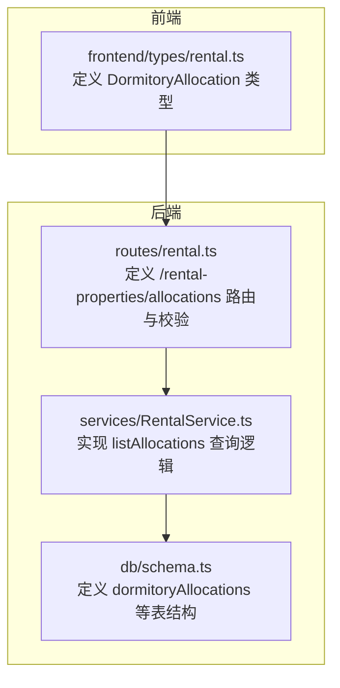
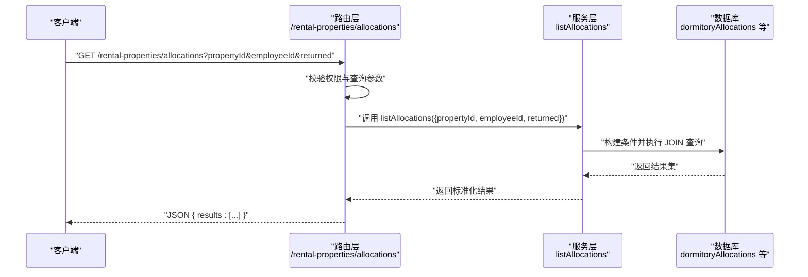
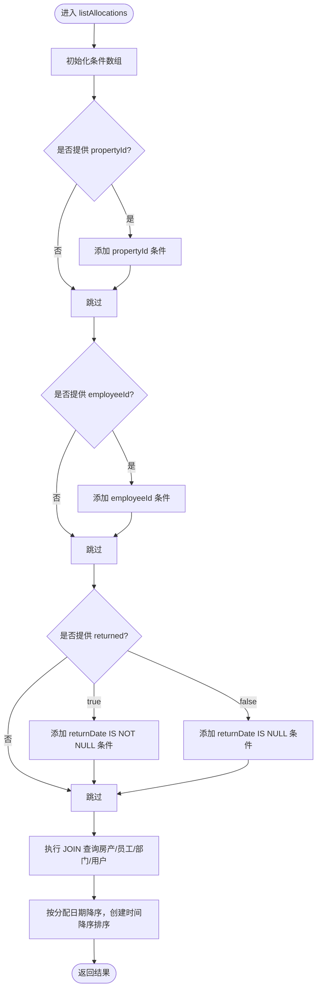
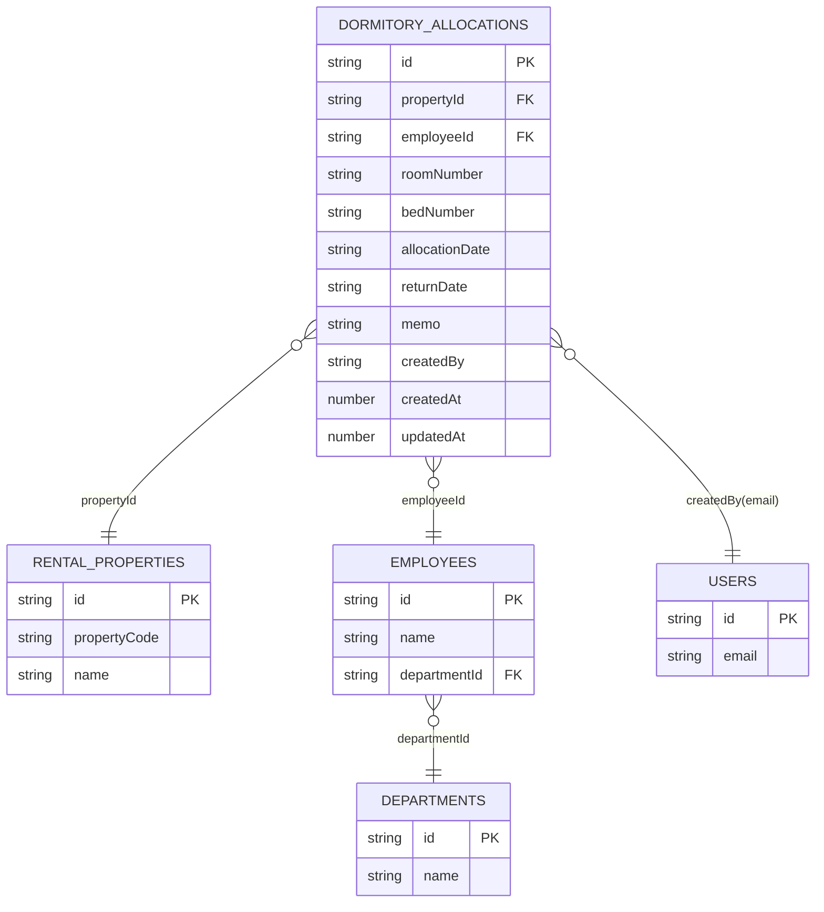

# 宿舍分配查询接口

<cite>
**本文引用的文件**
- [backend/src/routes/rental.ts](file://backend/src/routes/rental.ts)
- [backend/src/services/RentalService.ts](file://backend/src/services/RentalService.ts)
- [backend/src/db/schema.ts](file://backend/src/db/schema.ts)
- [backend/test/routes/rental.test.ts](file://backend/test/routes/rental.test.ts)
- [frontend/src/types/rental.ts](file://frontend/src/types/rental.ts)
</cite>

## 目录
1. [简介](#简介)
2. [项目结构](#项目结构)
3. [核心组件](#核心组件)
4. [架构总览](#架构总览)
5. [详细组件分析](#详细组件分析)
6. [依赖关系分析](#依赖关系分析)
7. [性能考量](#性能考量)
8. [故障排查指南](#故障排查指南)
9. [结论](#结论)
10. [附录](#附录)

## 简介
本文件面向“宿舍分配查询接口”的使用与实现，聚焦于后端路由与服务层对 GET /rental-properties/allocations 的处理逻辑，包括：
- 查询参数支持：propertyId（按房产过滤）、employeeId（按员工过滤）、returned（按归还状态过滤）
- 返回结果中的关联信息：房产代码、房产名称、员工姓名、员工所在部门信息、创建人姓名等
- 排序规则：按分配日期降序，再按创建时间降序
- 常见查询场景与请求/响应示例
- 如何通过该接口实现宿舍分配记录的列表展示与筛选

## 项目结构
该接口位于后端路由模块中，由路由层解析查询参数并调用服务层执行数据库查询，最终返回标准化的结果数组。

图表来源
- [backend/src/routes/rental.ts](file://backend/src/routes/rental.ts#L61-L107)
- [backend/src/services/RentalService.ts](file://backend/src/services/RentalService.ts#L369-L429)
- [backend/src/db/schema.ts](file://backend/src/db/schema.ts#L599-L612)
- [frontend/src/types/rental.ts](file://frontend/src/types/rental.ts#L53-L65)

章节来源
- [backend/src/routes/rental.ts](file://backend/src/routes/rental.ts#L61-L107)
- [backend/src/services/RentalService.ts](file://backend/src/services/RentalService.ts#L369-L429)
- [backend/src/db/schema.ts](file://backend/src/db/schema.ts#L599-L612)
- [frontend/src/types/rental.ts](file://frontend/src/types/rental.ts#L53-L65)

## 核心组件
- 路由层（routes/rental.ts）
  - 定义 GET /rental-properties/allocations 的请求体与响应体结构
  - 解析查询参数 propertyId、employeeId、returned，并进行权限校验
  - 将查询参数传递给服务层并返回标准化结果
- 服务层（services/RentalService.ts）
  - 实现 listAllocations，根据传入条件构造 SQL 条件
  - 关联查询：房产代码/名称、员工姓名、员工部门名称、创建人姓名
  - 按分配日期降序、创建时间降序排序
- 数据库模型（db/schema.ts）
  - dormitoryAllocations 表存储宿舍分配记录
  - 与 rentalProperties、employees、departments、users 等表建立关联

章节来源
- [backend/src/routes/rental.ts](file://backend/src/routes/rental.ts#L61-L107)
- [backend/src/services/RentalService.ts](file://backend/src/services/RentalService.ts#L369-L429)
- [backend/src/db/schema.ts](file://backend/src/db/schema.ts#L599-L612)

## 架构总览
下图展示了从客户端到数据库的完整调用链路与数据流向。

图表来源
- [backend/src/routes/rental.ts](file://backend/src/routes/rental.ts#L61-L107)
- [backend/src/services/RentalService.ts](file://backend/src/services/RentalService.ts#L369-L429)

## 详细组件分析

### 路由层：GET /rental-properties/allocations
- 请求参数
  - propertyId：可选，UUID，用于按房产过滤
  - employeeId：可选，UUID，用于按员工过滤
  - returned：可选，枚举值 "true" 或 "false"，用于按归还状态过滤
- 响应结构
  - results：数组，每项包含 allocation（分配记录对象）、propertyCode、propertyName、employeeName、employeeDepartmentId、employeeDepartmentName、createdByName 等字段
- 权限与安全
  - 调用 getUserPosition 进行登录态校验；未登录或无岗位信息将返回禁止访问

章节来源
- [backend/src/routes/rental.ts](file://backend/src/routes/rental.ts#L61-L107)

### 服务层：listAllocations 查询逻辑
- 查询条件
  - propertyId：精确匹配分配记录的 propertyId
  - employeeId：精确匹配分配记录的 employeeId
  - returned：true 表示 returnDate 非空；false 表示 returnDate 为空；未提供则不限制
- 关联字段
  - 房产：propertyCode、propertyName
  - 员工：employeeName、employeeDepartmentId、employeeDepartmentName
  - 创建人：createdByName（通过 users.email 与 employees.name 关联）
- 排序规则
  - 先按分配日期降序，再按创建时间降序

图表来源
- [backend/src/services/RentalService.ts](file://backend/src/services/RentalService.ts#L369-L429)

章节来源
- [backend/src/services/RentalService.ts](file://backend/src/services/RentalService.ts#L369-L429)

### 数据模型与关联关系
- dormitoryAllocations：宿舍分配主表，包含分配日期、房间号、床号、归还日期、备注、创建人等
- rentalProperties：房产信息，用于提供 propertyCode、propertyName
- employees：员工信息，用于提供 employeeName、departmentId
- departments：部门信息，用于提供部门名称
- users：用户信息，用于通过 email 关联到 employees.name，从而得到创建人姓名

图表来源
- [backend/src/db/schema.ts](file://backend/src/db/schema.ts#L534-L612)

章节来源
- [backend/src/db/schema.ts](file://backend/src/db/schema.ts#L534-L612)

### 前端类型与展示建议
- 前端类型定义中包含 DormitoryAllocation，字段包括 id、propertyId、employeeId、employeeName、employee_departmentName、room_number、bed_number、allocationDate、returnDate、monthlyRentCents、createdAt 等
- 展示建议
  - 列表字段：房产代码、房产名称、员工姓名、部门名称、房间号、床号、分配日期、归还日期、创建时间
  - 筛选器：propertyId、employeeId、returned（true/false）
  - 排序：默认按分配日期降序，再按创建时间降序

章节来源
- [frontend/src/types/rental.ts](file://frontend/src/types/rental.ts#L53-L65)

## 依赖关系分析
- 路由层依赖服务层提供的 listAllocations 方法
- 服务层依赖数据库 schema 中的 dormitoryAllocations、rentalProperties、employees、departments、users 等表
- 前端类型与后端响应结构保持一致，便于直接映射

图表来源
- [backend/src/routes/rental.ts](file://backend/src/routes/rental.ts#L61-L107)
- [backend/src/services/RentalService.ts](file://backend/src/services/RentalService.ts#L369-L429)
- [backend/src/db/schema.ts](file://backend/src/db/schema.ts#L534-L612)
- [frontend/src/types/rental.ts](file://frontend/src/types/rental.ts#L53-L65)

章节来源
- [backend/src/routes/rental.ts](file://backend/src/routes/rental.ts#L61-L107)
- [backend/src/services/RentalService.ts](file://backend/src/services/RentalService.ts#L369-L429)
- [backend/src/db/schema.ts](file://backend/src/db/schema.ts#L534-L612)
- [frontend/src/types/rental.ts](file://frontend/src/types/rental.ts#L53-L65)

## 性能考量
- 查询条件
  - 建议在 dormitoryAllocations 上为 propertyId、employeeId、allocationDate、createdAt 建立索引，以提升过滤与排序性能
- 关联查询
  - JOIN 涉及 employees、departments、users，确保这些表的外键字段有索引，避免全表扫描
- 分页策略
  - 当前实现未包含分页参数；若数据量较大，建议在路由层增加 limit/offset 或 cursor-based 分页参数，并在服务层实现分页查询

[本节为通用性能建议，不直接分析具体文件，故无章节来源]

## 故障排查指南
- 403 禁止访问
  - 可能原因：未登录或 getUserPosition 返回空
  - 处理：确认登录态与用户岗位信息
- 400 参数错误
  - 可能原因：returned 非 "true"/"false" 字符串
  - 处理：确保 returned 仅传入 "true" 或 "false"
- 业务异常
  - returned 为 true/false 时，服务层会转换为 SQL 条件；若出现不符合预期的结果，请检查数据库中 returnDate 是否正确维护
- 前端显示异常
  - 确认前端类型与后端响应字段一致；若字段缺失，需同步调整类型定义或后端返回结构

章节来源
- [backend/src/routes/rental.ts](file://backend/src/routes/rental.ts#L94-L107)
- [backend/src/services/RentalService.ts](file://backend/src/services/RentalService.ts#L369-L429)

## 结论
- GET /rental-properties/allocations 提供了灵活的宿舍分配记录查询能力，支持按房产、员工与归还状态三类条件过滤
- 返回结果包含丰富的关联信息，便于前端直接展示与筛选
- 排序规则明确，符合业务直观性
- 建议后续引入分页与索引优化，以支撑更大规模的数据查询

[本节为总结性内容，不直接分析具体文件，故无章节来源]

## 附录

### 接口定义与示例

- 接口路径
  - GET /rental-properties/allocations
- 查询参数
  - propertyId：可选，UUID
  - employeeId：可选，UUID
  - returned：可选，"true" 或 "false"
- 响应结构
  - results：数组，每项包含：
    - allocation：分配记录对象
    - propertyCode：房产代码
    - propertyName：房产名称
    - employeeName：员工姓名
    - employeeDepartmentId：员工部门ID
    - employeeDepartmentName：员工部门名称
    - createdByName：创建人姓名
- 排序规则
  - 按分配日期降序，再按创建时间降序

- 请求示例
  - 获取某员工的分配记录：GET /rental-properties/allocations?employeeId={员工ID}
  - 获取某房产的分配记录：GET /rental-properties/allocations?propertyId={房产ID}
  - 获取未归还的分配记录：GET /rental-properties/allocations?returned=false
  - 组合筛选：GET /rental-properties/allocations?propertyId={房产ID}&employeeId={员工ID}&returned=true

- 响应示例
  - 返回包含 results 数组，数组中每个元素为一条分配记录及其关联信息

章节来源
- [backend/src/routes/rental.ts](file://backend/src/routes/rental.ts#L61-L107)
- [backend/src/services/RentalService.ts](file://backend/src/services/RentalService.ts#L369-L429)
- [backend/test/routes/rental.test.ts](file://backend/test/routes/rental.test.ts#L135-L147)
- [frontend/src/types/rental.ts](file://frontend/src/types/rental.ts#L53-L65)