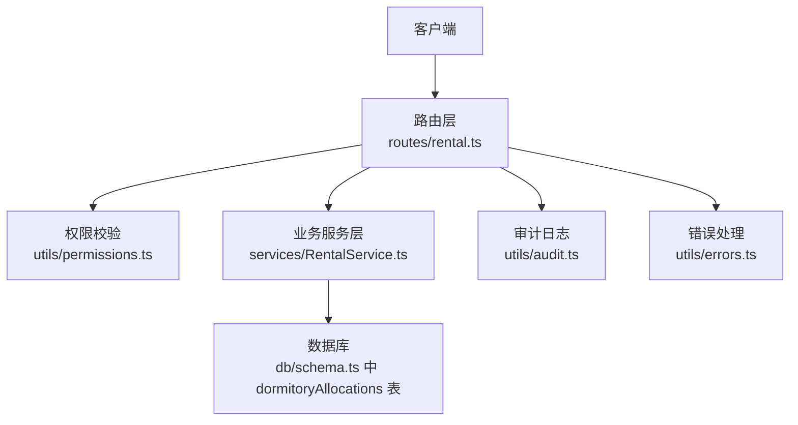
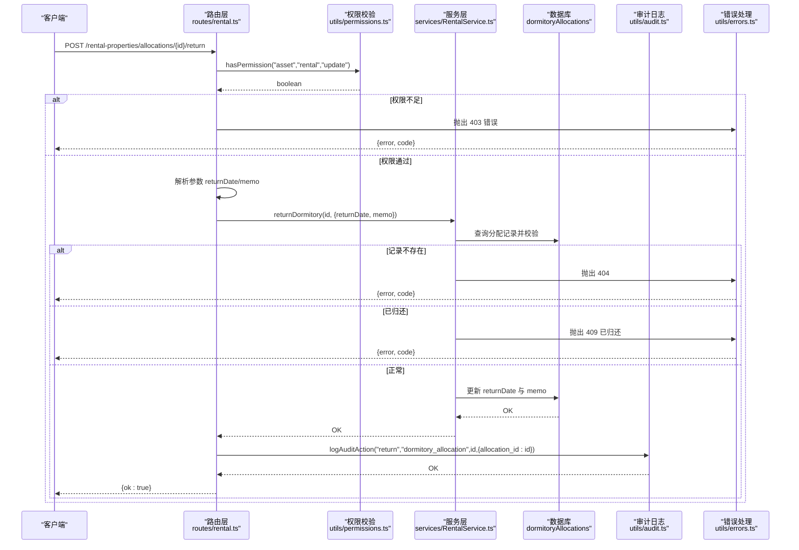
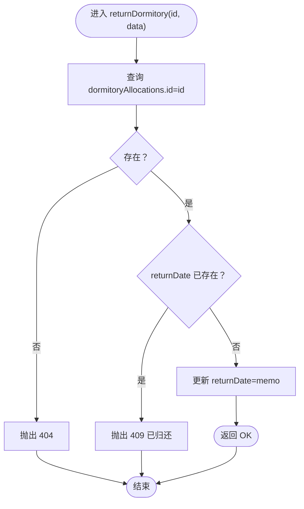
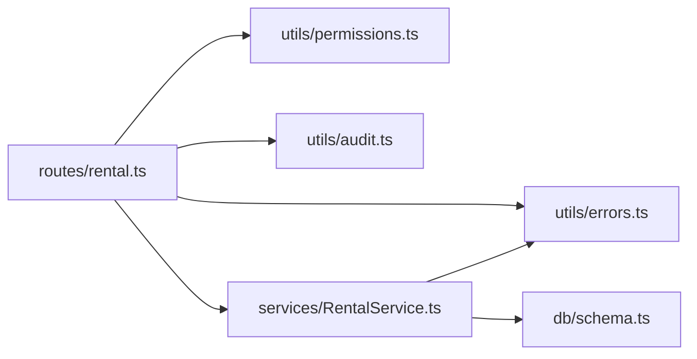

# 宿舍归还接口

<cite>
**本文引用的文件**
- [backend/src/routes/rental.ts](file://backend/src/routes/rental.ts)
- [backend/src/services/RentalService.ts](file://backend/src/services/RentalService.ts)
- [backend/src/db/schema.ts](file://backend/src/db/schema.ts)
- [backend/src/schemas/business.schema.ts](file://backend/src/schemas/business.schema.ts)
- [backend/src/utils/audit.ts](file://backend/src/utils/audit.ts)
- [backend/src/utils/errors.ts](file://backend/src/utils/errors.ts)
- [backend/src/utils/permissions.ts](file://backend/src/utils/permissions.ts)
- [backend/test/routes/rental.test.ts](file://backend/test/routes/rental.test.ts)
</cite>

## 目录
1. [简介](#简介)
2. [项目结构](#项目结构)
3. [核心组件](#核心组件)
4. [架构总览](#架构总览)
5. [详细组件分析](#详细组件分析)
6. [依赖关系分析](#依赖关系分析)
7. [性能考量](#性能考量)
8. [故障排查指南](#故障排查指南)
9. [结论](#结论)

## 简介
本文档面向“宿舍归还接口”的使用者与维护者，详细说明 POST /rental-properties/allocations/{id}/return 的业务逻辑与实现细节。内容涵盖：
- 接口路径与权限要求
- 归还流程的状态校验与业务约束
- 参数 returnDate 与 memo 的处理方式
- 对 dormitoryAllocations 表 returnDate 字段的更新策略
- 成功与各类错误响应示例（403、400、404、409）
- 审计日志记录规范（记录动作、实体、关联分配ID）

## 项目结构
该接口位于后端路由层，通过 Hono + Zod OpenAPI 定义，并委托给 RentalService 进行业务处理，最终持久化到数据库。权限校验与审计日志分别由权限工具与审计工具负责。

图表来源
- [backend/src/routes/rental.ts](file://backend/src/routes/rental.ts#L161-L200)
- [backend/src/utils/permissions.ts](file://backend/src/utils/permissions.ts#L80-L114)
- [backend/src/services/RentalService.ts](file://backend/src/services/RentalService.ts#L476-L486)
- [backend/src/db/schema.ts](file://backend/src/db/schema.ts#L599-L612)
- [backend/src/utils/audit.ts](file://backend/src/utils/audit.ts#L61-L92)
- [backend/src/utils/errors.ts](file://backend/src/utils/errors.ts#L34-L54)

章节来源
- [backend/src/routes/rental.ts](file://backend/src/routes/rental.ts#L161-L200)

## 核心组件
- 路由定义与请求处理：在 routes/rental.ts 中定义了 returnDormitoryRoute，并在处理器中进行权限校验、参数解析、调用服务层并记录审计日志。
- 业务服务层：RentalService.returnDormitory 实现具体业务逻辑，包括分配记录存在性与重复归还校验、returnDate 与 memo 更新。
- 数据模型：dormitoryAllocations 表包含 returnDate 字段，用于标识宿舍归还时间。
- 参数校验：returnDormitorySchema 约束 returnDate 与 memo 的格式。
- 权限控制：hasPermission 校验 asset.rental.update 权限。
- 错误处理：Errors 提供统一错误类型，错误处理器按状态码返回标准响应。
- 审计日志：logAuditAction 记录归还操作及关联的分配ID。

章节来源
- [backend/src/routes/rental.ts](file://backend/src/routes/rental.ts#L161-L200)
- [backend/src/services/RentalService.ts](file://backend/src/services/RentalService.ts#L476-L486)
- [backend/src/db/schema.ts](file://backend/src/db/schema.ts#L599-L612)
- [backend/src/schemas/business.schema.ts](file://backend/src/schemas/business.schema.ts#L1010-L1016)
- [backend/src/utils/permissions.ts](file://backend/src/utils/permissions.ts#L80-L114)
- [backend/src/utils/errors.ts](file://backend/src/utils/errors.ts#L34-L54)
- [backend/src/utils/audit.ts](file://backend/src/utils/audit.ts#L61-L92)

## 架构总览
下图展示从客户端到数据库的完整调用链路与关键节点。

图表来源
- [backend/src/routes/rental.ts](file://backend/src/routes/rental.ts#L187-L200)
- [backend/src/utils/permissions.ts](file://backend/src/utils/permissions.ts#L80-L114)
- [backend/src/services/RentalService.ts](file://backend/src/services/RentalService.ts#L476-L486)
- [backend/src/utils/audit.ts](file://backend/src/utils/audit.ts#L61-L92)
- [backend/src/utils/errors.ts](file://backend/src/utils/errors.ts#L34-L54)

## 详细组件分析

### 接口定义与权限
- 路径：POST /rental-properties/allocations/{id}/return
- 权限：需要具备 asset.rental.update 权限，否则返回 403。
- 请求体参数：
  - returnDate：必填，日期格式
  - memo：可选，字符串
- 响应：
  - 成功：200，{ ok: true }

章节来源
- [backend/src/routes/rental.ts](file://backend/src/routes/rental.ts#L161-L185)
- [backend/src/schemas/business.schema.ts](file://backend/src/schemas/business.schema.ts#L1010-L1016)
- [backend/src/utils/permissions.ts](file://backend/src/utils/permissions.ts#L80-L114)

### 业务逻辑与状态管理
- 分配记录存在性校验：若找不到对应 id 的分配记录，抛出 404。
- 重复归还校验：若分配记录已有 returnDate，则抛出 409（业务错误）。
- 更新策略：
  - 将 dormitoryAllocations.returnDate 设置为请求体中的 returnDate
  - 若请求体提供 memo，则覆盖原 memo；否则保留原 memo
  - 更新 updatedAt 时间戳

图表来源
- [backend/src/services/RentalService.ts](file://backend/src/services/RentalService.ts#L476-L486)

章节来源
- [backend/src/services/RentalService.ts](file://backend/src/services/RentalService.ts#L476-L486)

### 参数处理与数据模型
- 参数 returnDate：来自请求体，作为更新值写入 dormitoryAllocations.returnDate。
- 参数 memo：来自请求体，若提供则更新；否则保留原值。
- 数据库表 dormitoryAllocations 的字段 returnDate 即为本次更新的目标列。

章节来源
- [backend/src/schemas/business.schema.ts](file://backend/src/schemas/business.schema.ts#L1010-L1016)
- [backend/src/db/schema.ts](file://backend/src/db/schema.ts#L599-L612)

### 审计日志记录
- 记录动作：return
- 记录实体：dormitory_allocation
- 关联ID：使用分配记录的 id
- 日志内容：包含 allocation_id 字段，便于审计追踪

章节来源
- [backend/src/routes/rental.ts](file://backend/src/routes/rental.ts#L193-L200)
- [backend/src/utils/audit.ts](file://backend/src/utils/audit.ts#L61-L92)

### 错误响应示例
- 403 权限不足
  - 触发场景：调用方不具备 asset.rental.update 权限
  - 返回字段：error、code
- 400 参数错误（验证失败）
  - 触发场景：请求体不符合 returnDormitorySchema 约束
  - 返回字段：error、code、details（含字段路径与消息）
- 400 业务错误（已归还）
  - 触发场景：分配记录已存在 returnDate
  - 返回字段：error、code
- 404 未找到记录
  - 触发场景：分配记录不存在
  - 返回字段：error、code
- 200 成功
  - 触发场景：正常归还
  - 返回字段：{ ok: true }

章节来源
- [backend/src/utils/errors.ts](file://backend/src/utils/errors.ts#L34-L54)
- [backend/src/routes/rental.ts](file://backend/src/routes/rental.ts#L187-L200)
- [backend/test/routes/rental.test.ts](file://backend/test/routes/rental.test.ts#L166-L179)

## 依赖关系分析
- 路由层依赖权限工具与审计工具，同时对请求体进行 Zod 校验。
- 服务层依赖数据库 schema 与错误工具，执行业务校验与更新。
- 测试用例覆盖了成功路径与基本参数校验。

图表来源
- [backend/src/routes/rental.ts](file://backend/src/routes/rental.ts#L161-L200)
- [backend/src/utils/permissions.ts](file://backend/src/utils/permissions.ts#L80-L114)
- [backend/src/utils/audit.ts](file://backend/src/utils/audit.ts#L61-L92)
- [backend/src/utils/errors.ts](file://backend/src/utils/errors.ts#L34-L54)
- [backend/src/services/RentalService.ts](file://backend/src/services/RentalService.ts#L476-L486)
- [backend/src/db/schema.ts](file://backend/src/db/schema.ts#L599-L612)

章节来源
- [backend/src/routes/rental.ts](file://backend/src/routes/rental.ts#L161-L200)
- [backend/src/services/RentalService.ts](file://backend/src/services/RentalService.ts#L476-L486)
- [backend/src/db/schema.ts](file://backend/src/db/schema.ts#L599-L612)

## 性能考量
- 单条记录更新：仅涉及一次 SELECT（存在性/重复性校验）与一次 UPDATE，开销极低。
- 并发场景：若同一分配记录并发多次归还，重复归还校验会阻止后续更新，避免竞态。
- 审计日志：采用异步等待（waitUntil）记录，不影响主流程响应时间。

## 故障排查指南
- 403 权限不足
  - 检查调用方是否具备 asset.rental.update 权限
  - 确认用户职位权限配置
- 400 参数错误
  - 检查 returnDate 是否为合法日期
  - 检查 memo 是否为字符串
- 404 未找到记录
  - 确认分配记录 id 是否正确
  - 检查数据库中 dormitoryAllocations 是否存在该 id
- 409 已归还
  - 分配记录已存在 returnDate，无需重复归还
- 审计日志缺失
  - 检查 logAuditAction 是否被调用
  - 确认执行上下文 waitUntil 是否可用

章节来源
- [backend/src/utils/permissions.ts](file://backend/src/utils/permissions.ts#L80-L114)
- [backend/src/utils/errors.ts](file://backend/src/utils/errors.ts#L34-L54)
- [backend/src/routes/rental.ts](file://backend/src/routes/rental.ts#L187-L200)
- [backend/src/utils/audit.ts](file://backend/src/utils/audit.ts#L61-L92)

## 结论
POST /rental-properties/allocations/{id}/return 接口实现了宿舍归还的核心业务：严格的权限控制、完备的存在性与重复性校验、精确的字段更新与审计日志记录。遵循本文档的参数约定与错误处理规范，可确保接口稳定可靠地服务于资产管理与财务核算需求。