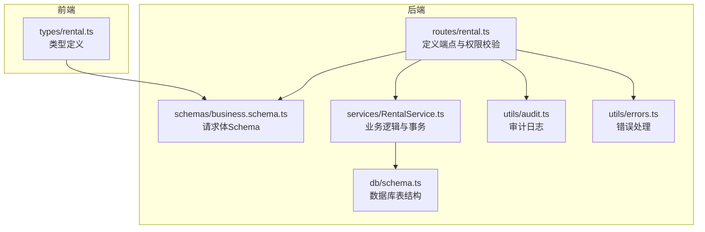
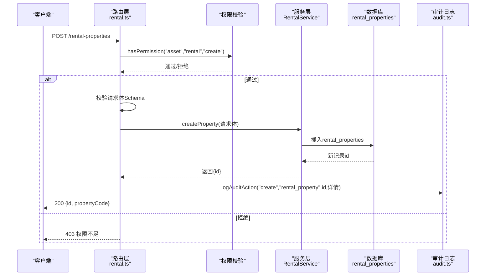
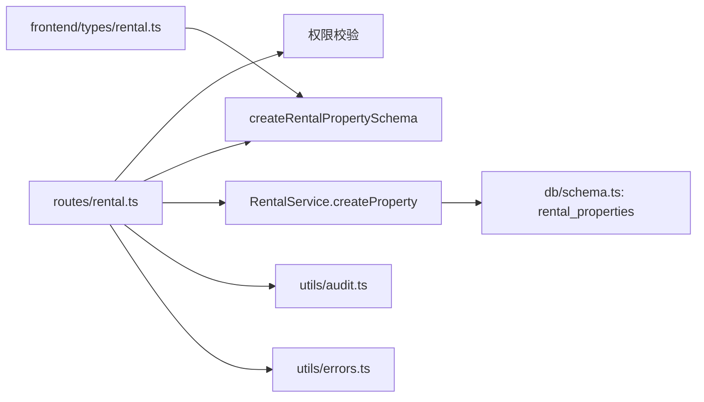

# 创建房产

<cite>
**本文引用的文件**
- [backend/src/routes/rental.ts](file://backend/src/routes/rental.ts)
- [backend/src/services/RentalService.ts](file://backend/src/services/RentalService.ts)
- [backend/src/schemas/business.schema.ts](file://backend/src/schemas/business.schema.ts)
- [backend/src/utils/audit.ts](file://backend/src/utils/audit.ts)
- [backend/src/utils/errors.ts](file://backend/src/utils/errors.ts)
- [backend/src/db/schema.ts](file://backend/src/db/schema.ts)
- [backend/test/routes/rental.test.ts](file://backend/test/routes/rental.test.ts)
- [frontend/src/types/rental.ts](file://frontend/src/types/rental.ts)
</cite>

## 目录
1. [简介](#简介)
2. [项目结构](#项目结构)
3. [核心组件](#核心组件)
4. [架构总览](#架构总览)
5. [详细组件分析](#详细组件分析)
6. [依赖关系分析](#依赖关系分析)
7. [性能考量](#性能考量)
8. [故障排查指南](#故障排查指南)
9. [结论](#结论)

## 简介
本文件面向“创建租赁房产”API，提供完整的接口说明与实现解析，包括：
- 接口方法、URL、权限要求
- 请求体字段说明与约束
- 成功响应与错误响应
- 审计日志记录规范
- 数据库模型映射与服务层逻辑

## 项目结构
围绕“创建租赁房产”的关键文件组织如下：
- 路由层：定义HTTP端点、请求校验与权限控制
- 服务层：执行业务逻辑、数据持久化与跨表事务
- 模式层：定义请求体Schema与数据库表结构
- 工具层：统一错误处理、审计日志记录
- 前端类型：对字段命名与类型进行约束参考

图表来源
- [backend/src/routes/rental.ts](file://backend/src/routes/rental.ts#L229-L295)
- [backend/src/services/RentalService.ts](file://backend/src/services/RentalService.ts#L97-L158)
- [backend/src/schemas/business.schema.ts](file://backend/src/schemas/business.schema.ts#L80-L117)
- [backend/src/db/schema.ts](file://backend/src/db/schema.ts#L534-L561)
- [backend/src/utils/audit.ts](file://backend/src/utils/audit.ts#L61-L92)
- [backend/src/utils/errors.ts](file://backend/src/utils/errors.ts#L34-L54)
- [frontend/src/types/rental.ts](file://frontend/src/types/rental.ts#L17-L51)

章节来源
- [backend/src/routes/rental.ts](file://backend/src/routes/rental.ts#L229-L295)
- [backend/src/services/RentalService.ts](file://backend/src/services/RentalService.ts#L97-L158)
- [backend/src/schemas/business.schema.ts](file://backend/src/schemas/business.schema.ts#L80-L117)
- [backend/src/db/schema.ts](file://backend/src/db/schema.ts#L534-L561)
- [backend/src/utils/audit.ts](file://backend/src/utils/audit.ts#L61-L92)
- [backend/src/utils/errors.ts](file://backend/src/utils/errors.ts#L34-L54)
- [frontend/src/types/rental.ts](file://frontend/src/types/rental.ts#L17-L51)

## 核心组件
- 端点与权限
  - 方法：POST
  - URL：/rental-properties
  - 权限：asset:rental:create
- 请求体Schema
  - 字段清单与约束详见“请求体字段说明”
- 服务层
  - 校验重复的propertyCode
  - 插入rental_properties记录
  - 返回新生成的id
- 审计日志
  - 操作类型：create
  - 资源类型：rental_property
  - 关联信息：propertyCode、name、propertyType等

章节来源
- [backend/src/routes/rental.ts](file://backend/src/routes/rental.ts#L229-L295)
- [backend/src/schemas/business.schema.ts](file://backend/src/schemas/business.schema.ts#L80-L117)
- [backend/src/services/RentalService.ts](file://backend/src/services/RentalService.ts#L122-L158)
- [backend/src/utils/audit.ts](file://backend/src/utils/audit.ts#L61-L92)

## 架构总览
下图展示“创建租赁房产”的端到端调用链路与职责分工。

图表来源
- [backend/src/routes/rental.ts](file://backend/src/routes/rental.ts#L229-L295)
- [backend/src/services/RentalService.ts](file://backend/src/services/RentalService.ts#L122-L158)
- [backend/src/utils/audit.ts](file://backend/src/utils/audit.ts#L61-L92)

## 详细组件分析

### 请求与响应规范
- 请求方法：POST
- URL：/rental-properties
- 权限要求：asset:rental:create
- 请求体Schema（字段与约束）
  - propertyCode：必填，字符串
  - name：必填，字符串
  - propertyType：枚举 office、warehouse、dormitory、other
  - currency：必填，3位币种代码
  - rentType：枚举 monthly、yearly
  - monthlyRentCents：非负整数，当rentType=monthly时必填
  - yearlyRentCents：非负整数，当rentType=yearly时必填
  - departmentId：可选，UUID
  - siteId：可选，UUID
  - paymentAccountId：可选，UUID
  - address：可选，字符串
  - areaSqm：可选，正数
  - paymentPeriodMonths：可选，正整数，默认1
  - landlordName：可选，字符串
  - landlordContact：可选，字符串
  - leaseStartDate：可选，日期
  - leaseEndDate：可选，日期
  - depositCents：可选，非负整数
  - paymentMethod：可选，字符串
  - paymentDay：可选，1~31之间的整数，默认1
  - status：可选，字符串，默认active
  - contractFileUrl：可选，合法URL
  - memo：可选，字符串

- 成功响应（200）
  - 返回：{ id: string, propertyCode: string }
- 错误响应
  - 400：请求体校验失败（Zod）
  - 400：业务错误（例如重复的propertyCode）
  - 403：权限不足
  - 500：服务器内部错误

章节来源
- [backend/src/routes/rental.ts](file://backend/src/routes/rental.ts#L229-L295)
- [backend/src/schemas/business.schema.ts](file://backend/src/schemas/business.schema.ts#L80-L117)
- [backend/src/utils/errors.ts](file://backend/src/utils/errors.ts#L34-L54)

### 服务层实现要点
- 重复性校验
  - 依据propertyCode查询是否存在重复，若存在则抛出重复错误
- 默认值与派生字段
  - rentType默认monthly
  - paymentPeriodMonths默认1
  - paymentDay默认1
  - departmentId在propertyType为office时才写入，否则置空
  - status默认active
- 数据持久化
  - 插入rental_properties表，返回生成的id
- 事务与一致性
  - 当前createProperty为单表插入，未见跨表事务；如后续扩展需注意事务边界

章节来源
- [backend/src/services/RentalService.ts](file://backend/src/services/RentalService.ts#L122-L158)
- [backend/src/db/schema.ts](file://backend/src/db/schema.ts#L534-L561)

### 审计日志记录
- 操作类型：create
- 资源类型：rental_property
- 关联信息：包含propertyCode、name、propertyType等关键字段
- 记录时机：服务层返回成功后，路由层调用logAuditAction记录

章节来源
- [backend/src/routes/rental.ts](file://backend/src/routes/rental.ts#L288-L294)
- [backend/src/utils/audit.ts](file://backend/src/utils/audit.ts#L61-L92)

### 数据模型映射
- rental_properties表字段与请求体字段一一对应，部分字段存在默认值与派生逻辑（如paymentPeriodMonths、paymentDay、status、departmentId）

章节来源
- [backend/src/db/schema.ts](file://backend/src/db/schema.ts#L534-L561)

### 前端类型参考
- 前端类型定义中包含propertyCode、name、propertyType、currency、rentType、monthlyRentCents、yearlyRentCents、departmentId、status、memo、contractFileUrl等字段，便于前后端对齐

章节来源
- [frontend/src/types/rental.ts](file://frontend/src/types/rental.ts#L17-L51)

## 依赖关系分析
- 路由层依赖
  - 权限校验：hasPermission("asset","rental","create")
  - 请求体Schema：createRentalPropertySchema
  - 服务层：RentalService.createProperty
  - 审计日志：logAuditAction
  - 错误处理：Errors（FORBIDDEN、DUPLICATE、BUSINESS_ERROR等）
- 服务层依赖
  - 数据库：rental_properties
  - 金融/流水相关：在付款模块中使用（与创建房产无直接耦合）
- 前后端类型
  - 前端类型与后端Schema保持一致字段名与语义，便于对接

图表来源
- [backend/src/routes/rental.ts](file://backend/src/routes/rental.ts#L229-L295)
- [backend/src/schemas/business.schema.ts](file://backend/src/schemas/business.schema.ts#L80-L117)
- [backend/src/services/RentalService.ts](file://backend/src/services/RentalService.ts#L122-L158)
- [backend/src/db/schema.ts](file://backend/src/db/schema.ts#L534-L561)
- [backend/src/utils/audit.ts](file://backend/src/utils/audit.ts#L61-L92)
- [backend/src/utils/errors.ts](file://backend/src/utils/errors.ts#L34-L54)
- [frontend/src/types/rental.ts](file://frontend/src/types/rental.ts#L17-L51)

## 性能考量
- 单次插入rental_properties，无复杂索引扫描
- propertyCode唯一性校验依赖唯一索引，建议确保索引存在以避免全表扫描
- 审计日志采用waitUntil异步提交，不影响主流程响应时间
- 若后续扩展涉及多表事务（如同时生成应付账单），应评估事务锁竞争与回滚成本

## 故障排查指南
- 403 权限不足
  - 确认当前用户具备asset:rental:create权限
  - 检查路由层hasPermission调用是否通过
- 400 重复的物业代码
  - 服务层基于propertyCode查询重复，确认是否已有同编码
- 400 验证失败
  - 检查请求体是否满足createRentalPropertySchema约束
  - 特别关注rentType与monthlyRentCents/yearlyRentCents的互斥关系
- 500 服务器内部错误
  - 查看全局错误处理器输出的错误日志
  - 确认数据库连接与事务执行状态

章节来源
- [backend/src/routes/rental.ts](file://backend/src/routes/rental.ts#L254-L295)
- [backend/src/services/RentalService.ts](file://backend/src/services/RentalService.ts#L122-L158)
- [backend/src/utils/errors.ts](file://backend/src/utils/errors.ts#L59-L113)

## 结论
“创建租赁房产”API通过明确的权限控制、严格的请求体校验、清晰的服务层实现与完善的审计日志，确保了功能的正确性与可追溯性。建议在后续迭代中：
- 明确并完善propertyCode唯一索引
- 在扩展多表事务时，统一事务边界与异常处理
- 对审计日志的detail字段进行结构化存储，便于检索与报表