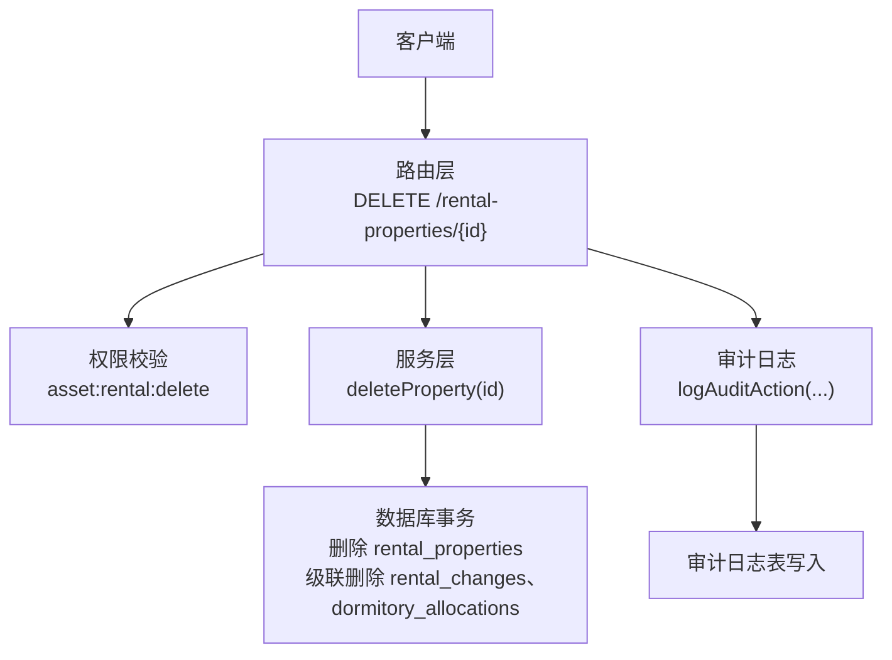
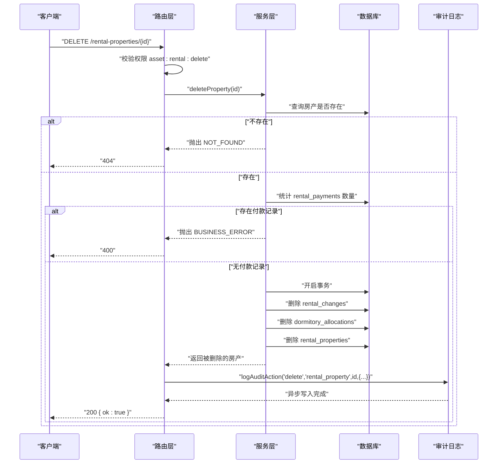
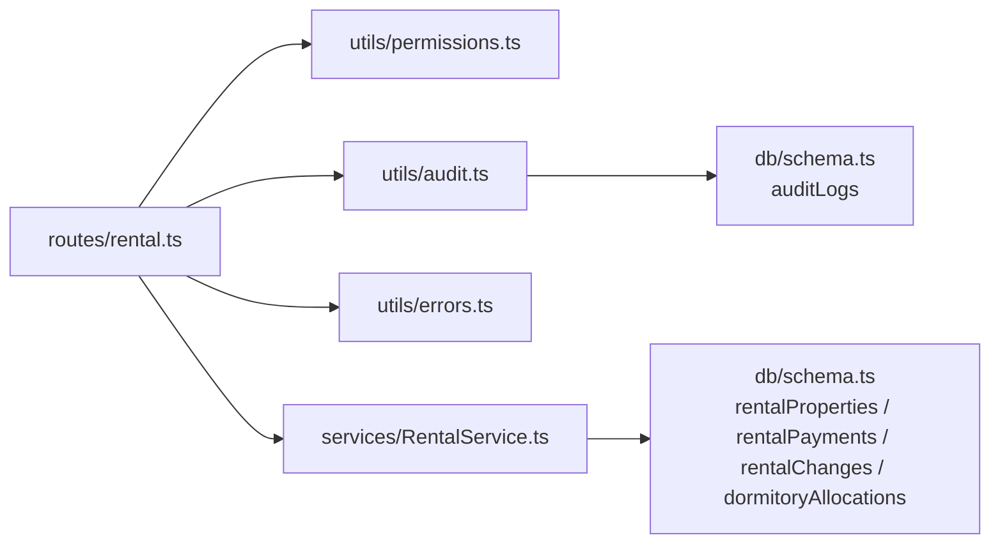

# 删除房产

<cite>
**本文引用的文件**
- [backend/src/routes/rental.ts](file://backend/src/routes/rental.ts)
- [backend/src/services/RentalService.ts](file://backend/src/services/RentalService.ts)
- [backend/src/utils/audit.ts](file://backend/src/utils/audit.ts)
- [backend/src/utils/errors.ts](file://backend/src/utils/errors.ts)
- [backend/test/routes/rental.test.ts](file://backend/test/routes/rental.test.ts)
</cite>

## 目录
1. [简介](#简介)
2. [项目结构](#项目结构)
3. [核心组件](#核心组件)
4. [架构总览](#架构总览)
5. [详细组件分析](#详细组件分析)
6. [依赖关系分析](#依赖关系分析)
7. [性能考量](#性能考量)
8. [故障排查指南](#故障排查指南)
9. [结论](#结论)

## 简介
本文件面向“删除租赁房产”API的使用与实现，聚焦以下目标：
- 明确API端点：HTTP方法为DELETE、URL路径为/rental-properties/{id}、权限要求为asset:rental:delete。
- 解释删除约束：若该房产存在任何付款记录（rental_payments），则无法删除并返回业务错误（400）。
- 描述删除事务性：在删除房产记录的同时，会级联删除其关联的变更记录（rental_changes）和宿舍分配记录（dormitory_allocations）。
- 规范成功响应（200）格式与常见错误响应（403权限不足、404不存在、400业务错误）。
- 说明删除时的审计日志记录方式。

## 项目结构
围绕“删除房产”的相关代码主要分布在以下模块：
- 路由层：定义DELETE /rental-properties/{id}端点，校验权限并调用服务层。
- 服务层：执行删除逻辑，包含约束检查与事务性删除。
- 审计日志：统一记录审计事件，支持异步写入。
- 错误处理：统一抛出业务错误与HTTP状态码映射。

图表来源
- [backend/src/routes/rental.ts](file://backend/src/routes/rental.ts#L359-L387)
- [backend/src/services/RentalService.ts](file://backend/src/services/RentalService.ts#L190-L204)
- [backend/src/utils/audit.ts](file://backend/src/utils/audit.ts#L61-L92)

章节来源
- [backend/src/routes/rental.ts](file://backend/src/routes/rental.ts#L359-L387)
- [backend/src/services/RentalService.ts](file://backend/src/services/RentalService.ts#L190-L204)
- [backend/src/utils/audit.ts](file://backend/src/utils/audit.ts#L61-L92)

## 核心组件
- 路由层（DELETE /rental-properties/{id}）
  - 校验权限：asset:rental:delete。
  - 调用服务层删除方法，返回成功响应。
  - 删除完成后记录审计日志。
- 服务层（deleteProperty）
  - 校验房产是否存在。
  - 检查是否存在付款记录（rental_payments），若有则抛出业务错误（400）。
  - 在事务内删除：rental_changes、dormitory_allocations、rental_properties。
- 审计日志（logAuditAction）
  - 异步记录actor、action、entity、entityId、detail等信息。
- 错误处理（Errors）
  - 提供BUSINESS_ERROR、FORBIDDEN、NOT_FOUND等错误类型及HTTP状态码映射。

章节来源
- [backend/src/routes/rental.ts](file://backend/src/routes/rental.ts#L359-L387)
- [backend/src/services/RentalService.ts](file://backend/src/services/RentalService.ts#L190-L204)
- [backend/src/utils/audit.ts](file://backend/src/utils/audit.ts#L61-L92)
- [backend/src/utils/errors.ts](file://backend/src/utils/errors.ts#L34-L54)

## 架构总览
删除流程的端到端交互如下：

图表来源
- [backend/src/routes/rental.ts](file://backend/src/routes/rental.ts#L359-L387)
- [backend/src/services/RentalService.ts](file://backend/src/services/RentalService.ts#L190-L204)
- [backend/src/utils/audit.ts](file://backend/src/utils/audit.ts#L61-L92)

## 详细组件分析

### 路由层：DELETE /rental-properties/{id}
- 权限要求：asset:rental:delete。
- 请求参数：路径参数id（UUID）。
- 成功响应：200，JSON对象{ ok: true }。
- 错误响应：
  - 403：权限不足（FORBIDDEN）。
  - 404：房产不存在（NOT_FOUND）。
  - 400：存在付款记录（BUSINESS_ERROR）。
- 审计日志：删除成功后记录一次审计事件，实体类型为rental_property，包含propertyCode与name。

章节来源
- [backend/src/routes/rental.ts](file://backend/src/routes/rental.ts#L359-L387)
- [backend/test/routes/rental.test.ts](file://backend/test/routes/rental.test.ts#L124-L133)

### 服务层：deleteProperty(id)
- 业务约束：
  - 若房产不存在，抛出NOT_FOUND。
  - 若存在任何付款记录（rental_payments），抛出BUSINESS_ERROR（400）。
- 事务性删除：
  - 在同一事务中按顺序删除：
    1) rental_changes（按propertyId过滤）
    2) dormitory_allocations（按propertyId过滤）
    3) rental_properties（按id过滤）
- 返回值：返回被删除的房产对象（用于审计日志记录）。

章节来源
- [backend/src/services/RentalService.ts](file://backend/src/services/RentalService.ts#L190-L204)

### 审计日志：logAuditAction
- 记录字段：actorId（用户ID）、action（delete）、entity（rental_property）、entityId（房产ID）、detail（JSON字符串，含propertyCode与name）。
- 异步写入：通过executionCtx.waitUntil确保不阻塞主流程。

章节来源
- [backend/src/utils/audit.ts](file://backend/src/utils/audit.ts#L61-L92)
- [backend/src/routes/rental.ts](file://backend/src/routes/rental.ts#L378-L386)

### 错误处理：Errors
- BUSINESS_ERROR：用于业务规则拒绝（如存在付款记录）。
- FORBIDDEN：用于权限不足。
- NOT_FOUND：用于资源不存在。

章节来源
- [backend/src/utils/errors.ts](file://backend/src/utils/errors.ts#L34-L54)

## 依赖关系分析
- 路由层依赖：
  - 权限工具：hasPermission。
  - 服务层：RentalService。
  - 审计工具：logAuditAction。
  - 错误工具：Errors。
- 服务层依赖：
  - 数据库：drizzle-orm，涉及表rentalProperties、rentalPayments、rentalChanges、dormitoryAllocations。
  - FinanceService（在其他功能中使用，此处不涉及）。
- 审计日志依赖：
  - 数据库：auditLogs表。
  - 请求上下文：获取用户ID、IP与IP归属地信息。

图表来源
- [backend/src/routes/rental.ts](file://backend/src/routes/rental.ts#L1-L20)
- [backend/src/services/RentalService.ts](file://backend/src/services/RentalService.ts#L1-L12)
- [backend/src/utils/audit.ts](file://backend/src/utils/audit.ts#L1-L12)

## 性能考量
- 删除操作为单事务内的多表删除，建议在数据库侧对相关表建立合适的索引（如rental_payments.propertyId、rental_changes.propertyId、dormitory_allocations.propertyId）以降低统计与删除成本。
- 审计日志采用异步写入，避免阻塞主流程，但需关注数据库写入压力与队列积压。

## 故障排查指南
- 403 权限不足
  - 检查调用方是否具备asset:rental:delete权限。
  - 参考：路由层权限校验逻辑。
- 404 房产不存在
  - 确认传入的id是否正确且存在。
  - 参考：服务层查询逻辑。
- 400 存在付款记录无法删除
  - 先清理或核销相关付款记录后再删除。
  - 参考：服务层统计与拒绝逻辑。
- 审计日志缺失
  - 确认executionCtx.waitUntil可用，且DB连接正常。
  - 参考：审计日志异步写入逻辑。

章节来源
- [backend/src/routes/rental.ts](file://backend/src/routes/rental.ts#L378-L387)
- [backend/src/services/RentalService.ts](file://backend/src/services/RentalService.ts#L190-L204)
- [backend/src/utils/audit.ts](file://backend/src/utils/audit.ts#L61-L92)

## 结论
删除租赁房产的API设计遵循严格的业务约束与事务一致性：
- 必须具备asset:rental:delete权限。
- 若存在付款记录则拒绝删除（400）。
- 删除操作在事务内级联清理变更与宿舍分配记录。
- 成功删除后记录审计日志，便于追踪。