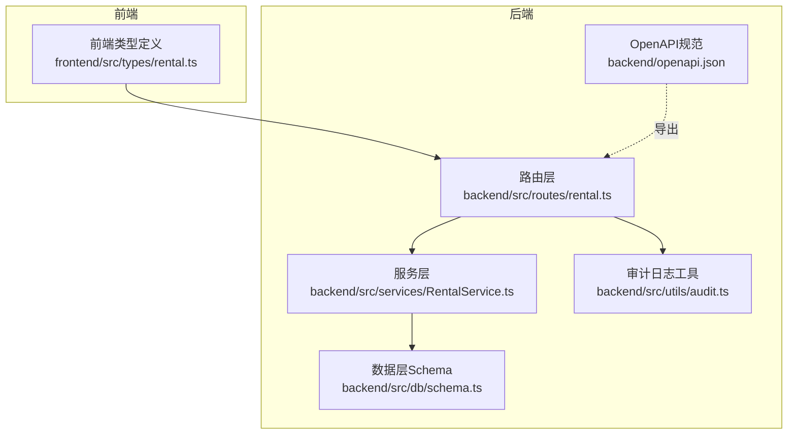
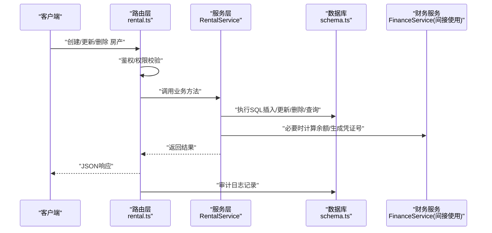
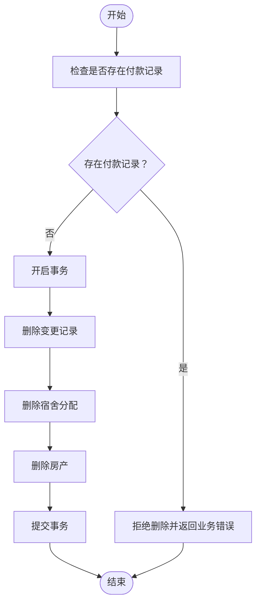
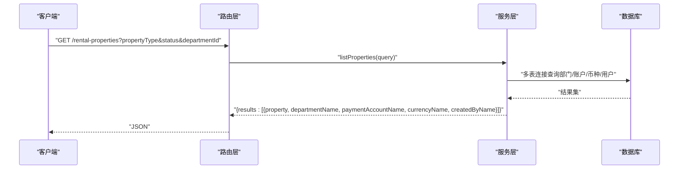
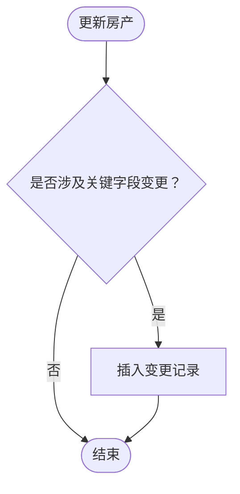
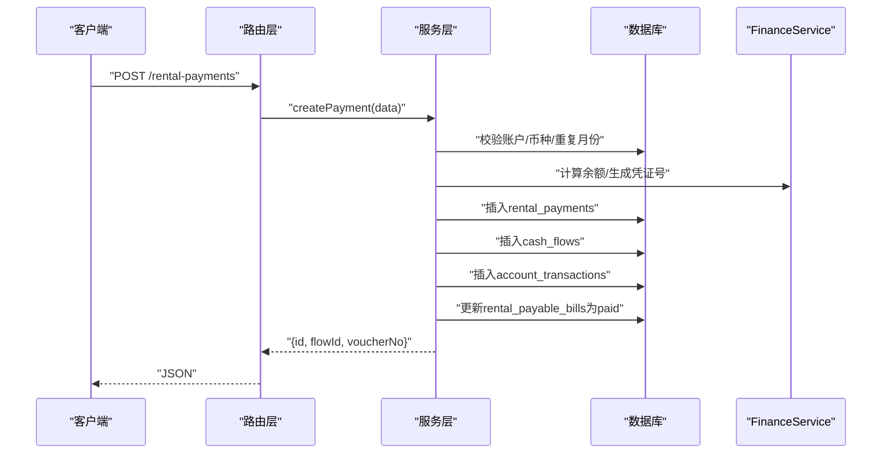
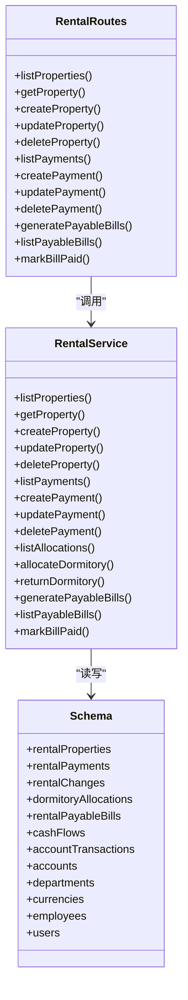
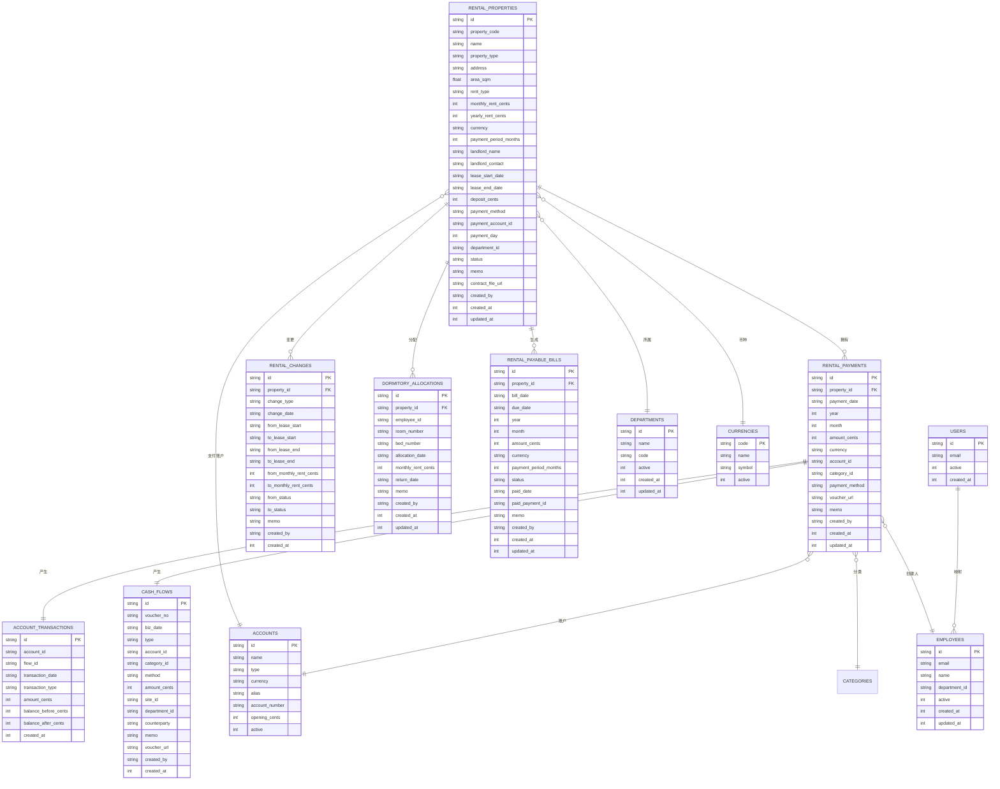

# 房产管理API

<cite>
**本文引用的文件**
- [backend/src/routes/rental.ts](file://backend/src/routes/rental.ts)
- [backend/src/services/RentalService.ts](file://backend/src/services/RentalService.ts)
- [backend/src/db/schema.ts](file://backend/src/db/schema.ts)
- [backend/src/schemas/business.schema.ts](file://backend/src/schemas/business.schema.ts)
- [backend/src/utils/audit.ts](file://backend/src/utils/audit.ts)
- [frontend/src/types/rental.ts](file://frontend/src/types/rental.ts)
- [backend/openapi.json](file://backend/openapi.json)
</cite>

## 目录
1. [简介](#简介)
2. [项目结构](#项目结构)
3. [核心组件](#核心组件)
4. [架构总览](#架构总览)
5. [详细组件分析](#详细组件分析)
6. [依赖关系分析](#依赖关系分析)
7. [性能考量](#性能考量)
8. [故障排查指南](#故障排查指南)
9. [结论](#结论)
10. [附录](#附录)

## 简介
本文件面向“房产管理API”的使用者与维护者，系统化梳理租赁房产全生命周期管理能力，包括：
- 房产创建、更新、删除
- 房产信息查询（基础信息、关联部门、支付账户、创建人）
- 房产状态变更记录机制
- 删除约束（存在付款记录则不可删除）
- 列表查询过滤条件（类型、状态、部门）与排序规则
- 财务数据关联（租金支出与现金流、会计分录）

同时给出接口清单、调用流程、错误处理与最佳实践，帮助快速集成与稳定运行。

## 项目结构
后端采用路由层（OpenAPIHono）+ 服务层（RentalService）+ 数据层（Drizzle ORM + SQLite）的分层设计，前端通过类型定义与后端API对接。

图表来源
- [backend/src/routes/rental.ts](file://backend/src/routes/rental.ts#L1-L677)
- [backend/src/services/RentalService.ts](file://backend/src/services/RentalService.ts#L1-L617)
- [backend/src/db/schema.ts](file://backend/src/db/schema.ts#L529-L644)
- [backend/src/utils/audit.ts](file://backend/src/utils/audit.ts#L1-L92)
- [frontend/src/types/rental.ts](file://frontend/src/types/rental.ts#L1-L143)
- [backend/openapi.json](file://backend/openapi.json#L11227-L11947)

章节来源
- [backend/src/routes/rental.ts](file://backend/src/routes/rental.ts#L1-L677)
- [backend/src/services/RentalService.ts](file://backend/src/services/RentalService.ts#L1-L617)
- [backend/src/db/schema.ts](file://backend/src/db/schema.ts#L529-L644)
- [backend/src/utils/audit.ts](file://backend/src/utils/audit.ts#L1-L92)
- [frontend/src/types/rental.ts](file://frontend/src/types/rental.ts#L1-L143)
- [backend/openapi.json](file://backend/openapi.json#L11227-L11947)

## 核心组件
- 路由层（rental.ts）：定义所有房产与付款相关REST接口，包含鉴权、权限校验、请求校验、响应封装与审计日志记录。
- 服务层（RentalService）：实现业务逻辑，包括：
  - 房产列表/详情查询（含部门、账户、币种、创建人等关联信息）
  - 房产增删改
  - 房产状态变更记录（变更表）
  - 付款记录列表/创建/更新/删除（含与现金流、会计分录联动）
  - 宿舍分配/归还
  - 应付账单生成与状态更新
- 数据层（schema.ts）：定义房产、付款、变更、分配、应付账单、审计日志等核心表结构。
- 前端类型（rental.ts）：统一前后端数据契约，便于TS强类型开发。
- 审计工具（audit.ts）：统一记录操作人、实体、行为、详情与IP信息。

章节来源
- [backend/src/routes/rental.ts](file://backend/src/routes/rental.ts#L1-L677)
- [backend/src/services/RentalService.ts](file://backend/src/services/RentalService.ts#L1-L617)
- [backend/src/db/schema.ts](file://backend/src/db/schema.ts#L529-L644)
- [frontend/src/types/rental.ts](file://frontend/src/types/rental.ts#L1-L143)
- [backend/src/utils/audit.ts](file://backend/src/utils/audit.ts#L1-L92)

## 架构总览

图表来源
- [backend/src/routes/rental.ts](file://backend/src/routes/rental.ts#L254-L357)
- [backend/src/services/RentalService.ts](file://backend/src/services/RentalService.ts#L1-L200)
- [backend/src/db/schema.ts](file://backend/src/db/schema.ts#L529-L644)
- [backend/src/utils/audit.ts](file://backend/src/utils/audit.ts#L61-L92)

## 详细组件分析

### 房产生命周期管理
- 创建房产
  - 接口：POST /rental-properties
  - 权限：资产-租赁-创建
  - 校验：propertyCode唯一；月租/年租金额按租期类型校验
  - 关联字段：部门、支付账户、币种、状态、合同文件等
  - 审计：记录创建动作与关键字段摘要
- 更新房产
  - 接口：PUT /rental-properties/{id}
  - 权限：资产-租赁-更新
  - 变更记录：当状态、月租、年租、租期类型、起止日期等关键字段发生变更时，写入变更记录表
  - 审计：记录更新动作与变更摘要
- 删除房产
  - 接口：DELETE /rental-properties/{id}
  - 权限：资产-租赁-删除
  - 约束：若存在付款记录，则禁止删除
  - 事务：同时清理变更记录与宿舍分配，再删除房产
  - 审计：记录删除动作与摘要

图表来源
- [backend/src/services/RentalService.ts](file://backend/src/services/RentalService.ts#L190-L204)

章节来源
- [backend/src/routes/rental.ts](file://backend/src/routes/rental.ts#L259-L387)
- [backend/src/services/RentalService.ts](file://backend/src/services/RentalService.ts#L160-L204)
- [backend/src/db/schema.ts](file://backend/src/db/schema.ts#L581-L612)

### 房产信息查询接口
- 获取房产列表
  - 接口：GET /rental-properties
  - 过滤条件：propertyType、status、departmentId
  - 排序规则：按创建时间倒序
  - 关联信息：部门名称、支付账户名称、币种名称、创建人姓名
- 获取单个房产详情
  - 接口：GET /rental-properties/{id}
  - 返回：基础信息 + 部门/账户/币种/创建人 + 付款历史 + 变更记录 + 宿舍分配（仅宿舍类型）

图表来源
- [backend/src/routes/rental.ts](file://backend/src/routes/rental.ts#L24-L57)
- [backend/src/services/RentalService.ts](file://backend/src/services/RentalService.ts#L15-L41)
- [backend/src/db/schema.ts](file://backend/src/db/schema.ts#L529-L561)

章节来源
- [backend/src/routes/rental.ts](file://backend/src/routes/rental.ts#L24-L57)
- [backend/src/services/RentalService.ts](file://backend/src/services/RentalService.ts#L15-L41)
- [backend/openapi.json](file://backend/openapi.json#L11227-L11282)

### 房产状态变更记录机制
- 触发条件：当状态、月租、年租、租期类型、起止日期等关键字段被更新时，自动记录一条变更记录
- 记录内容：变更类型、变更日期、起止日期、金额、状态等对比值，以及备注与创建人
- 查询入口：详情接口会返回变更记录数组

图表来源
- [backend/src/services/RentalService.ts](file://backend/src/services/RentalService.ts#L167-L188)

章节来源
- [backend/src/services/RentalService.ts](file://backend/src/services/RentalService.ts#L167-L188)
- [backend/src/db/schema.ts](file://backend/src/db/schema.ts#L581-L597)
- [frontend/src/types/rental.ts](file://frontend/src/types/rental.ts#L112-L141)

### 房产删除约束
- 约束条件：若该房产存在付款记录，则不允许删除
- 实现：删除前统计付款数量，大于0则抛出业务错误
- 清理策略：删除事务内级联删除变更记录与宿舍分配，再删除房产

章节来源
- [backend/src/services/RentalService.ts](file://backend/src/services/RentalService.ts#L190-L204)

### 房产列表查询过滤与排序
- 过滤条件
  - propertyType：枚举 office/warehouse/dormitory/other
  - status：字符串
  - departmentId：UUID
- 排序规则：按创建时间倒序

章节来源
- [backend/src/routes/rental.ts](file://backend/src/routes/rental.ts#L24-L57)
- [backend/openapi.json](file://backend/openapi.json#L11227-L11282)

### 房产与财务数据关联
- 付款记录
  - 接口：GET /rental-payments（支持按propertyId/year/month过滤）
  - 关联信息：属性编码/名称/类型、账户名称、分类名称、创建人
  - 创建付款时：
    - 校验账户有效性与币种一致性
    - 生成唯一凭证号（JZYYYYMMDD-NNN）
    - 计算账户余额（基于FinanceService）
    - 写入现金流表与会计分录表
    - 同步更新对应应付账单为已支付
- 应付账单
  - 自动生成：根据租期、周期、到期日生成未付账单
  - 标记已付：通过专用接口将账单标记为已支付

图表来源
- [backend/src/routes/rental.ts](file://backend/src/routes/rental.ts#L436-L491)
- [backend/src/services/RentalService.ts](file://backend/src/services/RentalService.ts#L238-L350)
- [backend/src/db/schema.ts](file://backend/src/db/schema.ts#L563-L631)
- [backend/src/services/FinanceService.ts](file://backend/src/services/FinanceService.ts#L1-L128)

章节来源
- [backend/src/routes/rental.ts](file://backend/src/routes/rental.ts#L391-L491)
- [backend/src/services/RentalService.ts](file://backend/src/services/RentalService.ts#L208-L350)
- [backend/src/db/schema.ts](file://backend/src/db/schema.ts#L563-L631)
- [backend/src/services/FinanceService.ts](file://backend/src/services/FinanceService.ts#L1-L128)

### 审计日志
- 记录内容：操作人、动作、实体、实体ID、时间、详情、IP与归属地
- 触发点：创建/更新/删除房产、创建/更新/删除付款、生成应付账单、标记账单已付等
- 异步记录：通过waitUntil保证不阻塞主流程

章节来源
- [backend/src/utils/audit.ts](file://backend/src/utils/audit.ts#L1-L92)
- [backend/src/routes/rental.ts](file://backend/src/routes/rental.ts#L288-L387)
- [backend/src/routes/rental.ts](file://backend/src/routes/rental.ts#L482-L567)

## 依赖关系分析

图表来源
- [backend/src/routes/rental.ts](file://backend/src/routes/rental.ts#L1-L677)
- [backend/src/services/RentalService.ts](file://backend/src/services/RentalService.ts#L1-L617)
- [backend/src/db/schema.ts](file://backend/src/db/schema.ts#L529-L644)

章节来源
- [backend/src/routes/rental.ts](file://backend/src/routes/rental.ts#L1-L677)
- [backend/src/services/RentalService.ts](file://backend/src/services/RentalService.ts#L1-L617)
- [backend/src/db/schema.ts](file://backend/src/db/schema.ts#L529-L644)

## 性能考量
- 查询优化
  - 房产列表与详情均使用多表左连接，建议在相关列上建立索引（如propertyId、departmentId、year/month等）
  - 分页与排序：按创建时间倒序，避免全表扫描
- 事务与并发
  - 删除房产与创建付款均使用事务，确保一致性
  - 审计日志异步记录，避免阻塞主流程
- 缓存与热点
  - 对高频查询（如部门、币种、账户）可考虑应用层缓存以降低数据库压力

## 故障排查指南
- 403 禁止访问
  - 检查用户岗位与权限位是否具备资产-租赁-创建/更新/删除
- 404 未找到
  - 房产、付款、账单、员工等资源不存在时返回
- 409 业务冲突
  - 房产删除被阻止（存在付款记录）
  - 付款记录重复（同一年/月）
  - 账单已支付
- 422 参数校验失败
  - propertyCode重复、币种不匹配、账户停用、月租/年租参数缺失等
- 审计日志
  - 若审计未记录，请检查IP头与executionCtx.waitUntil可用性

章节来源
- [backend/src/routes/rental.ts](file://backend/src/routes/rental.ts#L259-L387)
- [backend/src/services/RentalService.ts](file://backend/src/services/RentalService.ts#L190-L204)
- [backend/src/utils/audit.ts](file://backend/src/utils/audit.ts#L61-L92)

## 结论
本API围绕“房产”与“付款”两大核心域构建，覆盖了从创建到删除的完整生命周期，并通过变更记录与审计日志保障可追溯性。财务侧通过统一凭证号与余额计算，确保现金流与会计分录的一致性。建议在生产环境完善索引、缓存与监控，持续优化查询与事务性能。

## 附录

### 接口一览（按功能分组）
- 房产管理
  - GET /rental-properties
  - GET /rental-properties/{id}
  - POST /rental-properties
  - PUT /rental-properties/{id}
  - DELETE /rental-properties/{id}
- 付款管理
  - GET /rental-payments
  - POST /rental-payments
  - PUT /rental-payments/{id}
  - DELETE /rental-payments/{id}
- 应付账单
  - POST /rental-properties/generate-payable-bills
  - GET /rental-payable-bills
  - POST /rental-payable-bills/:id/mark-paid

章节来源
- [backend/src/routes/rental.ts](file://backend/src/routes/rental.ts#L24-L677)
- [backend/openapi.json](file://backend/openapi.json#L11227-L11947)

### 数据模型概览

图表来源
- [backend/src/db/schema.ts](file://backend/src/db/schema.ts#L529-L644)