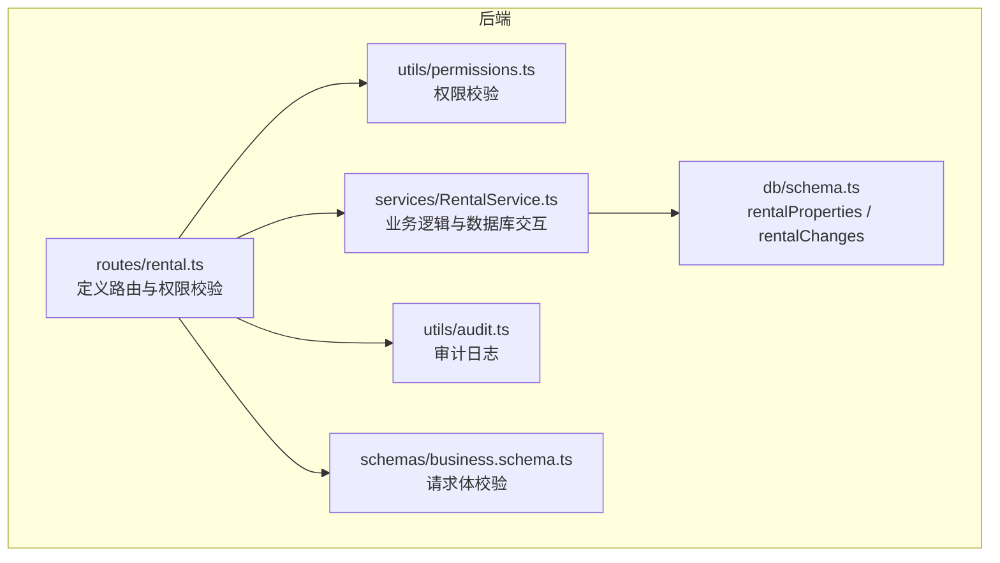
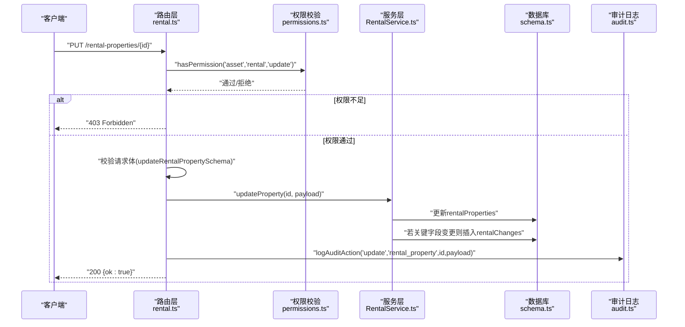
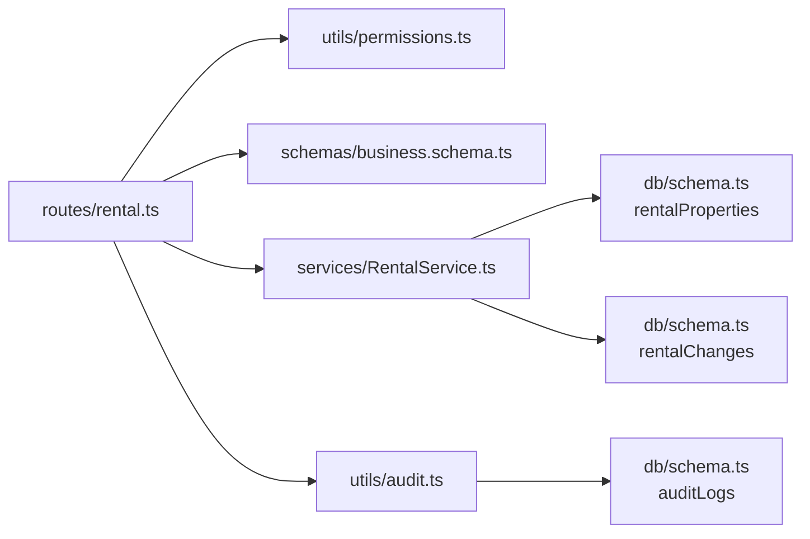

# 更新房产

<cite>
**本文引用的文件**
- [backend/src/routes/rental.ts](file://backend/src/routes/rental.ts)
- [backend/src/services/RentalService.ts](file://backend/src/services/RentalService.ts)
- [backend/src/schemas/business.schema.ts](file://backend/src/schemas/business.schema.ts)
- [backend/src/db/schema.ts](file://backend/src/db/schema.ts)
- [backend/src/utils/audit.ts](file://backend/src/utils/audit.ts)
- [backend/src/utils/permissions.ts](file://backend/src/utils/permissions.ts)
- [backend/test/routes/rental.test.ts](file://backend/test/routes/rental.test.ts)
</cite>

## 目录
1. [简介](#简介)
2. [项目结构](#项目结构)
3. [核心组件](#核心组件)
4. [架构总览](#架构总览)
5. [详细组件分析](#详细组件分析)
6. [依赖关系分析](#依赖关系分析)
7. [性能考量](#性能考量)
8. [故障排查指南](#故障排查指南)
9. [结论](#结论)

## 简介
本文件面向“房产管理API”的“更新租赁房产”能力，提供完整的接口说明与实现细节。内容覆盖：
- 接口方法与路径
- 权限要求
- 请求体字段与校验
- 关键字段变更触发的变更记录机制
- 成功响应与常见错误响应
- 审计日志记录

## 项目结构
更新房产功能位于后端路由层与服务层，配合数据库模式与权限/审计工具完成端到端流程。

图表来源
- [backend/src/routes/rental.ts](file://backend/src/routes/rental.ts#L297-L357)
- [backend/src/services/RentalService.ts](file://backend/src/services/RentalService.ts#L160-L188)
- [backend/src/db/schema.ts](file://backend/src/db/schema.ts#L534-L597)
- [backend/src/utils/audit.ts](file://backend/src/utils/audit.ts#L61-L92)
- [backend/src/utils/permissions.ts](file://backend/src/utils/permissions.ts#L88-L114)
- [backend/src/schemas/business.schema.ts](file://backend/src/schemas/business.schema.ts#L80-L116)

章节来源
- [backend/src/routes/rental.ts](file://backend/src/routes/rental.ts#L297-L357)
- [backend/src/services/RentalService.ts](file://backend/src/services/RentalService.ts#L160-L188)
- [backend/src/db/schema.ts](file://backend/src/db/schema.ts#L534-L597)
- [backend/src/utils/audit.ts](file://backend/src/utils/audit.ts#L61-L92)
- [backend/src/utils/permissions.ts](file://backend/src/utils/permissions.ts#L88-L114)
- [backend/src/schemas/business.schema.ts](file://backend/src/schemas/business.schema.ts#L80-L116)

## 核心组件
- 路由层（更新房产）：定义PUT /rental-properties/{id}端点，进行权限校验与请求体校验，并调用服务层执行更新与审计记录。
- 服务层（更新房产）：执行属性更新，并在关键字段发生变更时写入rental_changes变更记录。
- 数据库模式：rentalProperties用于存储房产基本信息；rentalChanges用于记录关键字段变更历史。
- 权限工具：基于职位权限模型校验“资产-租赁-更新”权限。
- 审计工具：统一记录操作者、实体、行为、详情与IP等信息。
- 请求体校验：基于business.schema.ts中的updateRentalPropertySchema对请求体进行严格校验。

章节来源
- [backend/src/routes/rental.ts](file://backend/src/routes/rental.ts#L297-L357)
- [backend/src/services/RentalService.ts](file://backend/src/services/RentalService.ts#L160-L188)
- [backend/src/db/schema.ts](file://backend/src/db/schema.ts#L534-L597)
- [backend/src/utils/permissions.ts](file://backend/src/utils/permissions.ts#L88-L114)
- [backend/src/utils/audit.ts](file://backend/src/utils/audit.ts#L61-L92)
- [backend/src/schemas/business.schema.ts](file://backend/src/schemas/business.schema.ts#L80-L116)

## 架构总览
更新流程概览如下：

图表来源
- [backend/src/routes/rental.ts](file://backend/src/routes/rental.ts#L297-L357)
- [backend/src/utils/permissions.ts](file://backend/src/utils/permissions.ts#L88-L114)
- [backend/src/services/RentalService.ts](file://backend/src/services/RentalService.ts#L160-L188)
- [backend/src/db/schema.ts](file://backend/src/db/schema.ts#L534-L597)
- [backend/src/utils/audit.ts](file://backend/src/utils/audit.ts#L61-L92)

## 详细组件分析

### 接口定义与权限
- 方法与路径：PUT /rental-properties/{id}
- 权限要求：asset:rental:update
- 请求体校验：使用updateRentalPropertySchema，字段与创建时一致，均为可选更新字段。

章节来源
- [backend/src/routes/rental.ts](file://backend/src/routes/rental.ts#L297-L357)
- [backend/src/schemas/business.schema.ts](file://backend/src/schemas/business.schema.ts#L80-L116)
- [backend/src/utils/permissions.ts](file://backend/src/utils/permissions.ts#L88-L114)

### 请求体字段说明（可更新字段）
以下字段均可在更新请求中传入（均为可选）：
- propertyCode、name、propertyType、address、areaSqm、rentType、monthlyRentCents、yearlyRentCents、currency、paymentPeriodMonths、landlordName、landlordContact、leaseStartDate、leaseEndDate、depositCents、paymentMethod、paymentAccountId、paymentDay、departmentId、status、memo、contractFileUrl

注意：
- 字段校验遵循updateRentalPropertySchema，例如rentType与月/年租金额度的关系约束。
- 未在请求体中提供的字段不会被更新（即保持不变）。

章节来源
- [backend/src/routes/rental.ts](file://backend/src/routes/rental.ts#L323-L356)
- [backend/src/schemas/business.schema.ts](file://backend/src/schemas/business.schema.ts#L80-L116)

### 关键字段变更与变更记录
当以下任一关键字段在更新时发生变化，服务层将自动在rental_changes表中插入一条变更记录：
- status
- monthlyRentCents
- yearlyRentCents
- rentType
- leaseStartDate
- leaseEndDate

变更记录字段含义（来自rentalChanges表）：
- changeType：modify（修改）
- changeDate：变更日期（格式为YYYY-MM-DD）
- fromLeaseStart / toLeaseStart：租赁起始日期的变更前/变更后值
- fromLeaseEnd / toLeaseEnd：租赁结束日期的变更前/变更后值
- fromMonthlyRentCents / toMonthlyRentCents：月租金额的变更前/变更后值
- fromStatus / toStatus：状态的变更前/变更后值
- memo：变更备注（来自请求体）
- createdBy：创建者（来自请求上下文）
- createdAt：创建时间戳

章节来源
- [backend/src/services/RentalService.ts](file://backend/src/services/RentalService.ts#L160-L188)
- [backend/src/db/schema.ts](file://backend/src/db/schema.ts#L581-L597)

### 成功响应与错误响应
- 成功响应（200 OK）：
  - 返回体：{ ok: true }
- 错误响应：
  - 403 Forbidden：权限不足（未满足asset:rental:update）
  - 404 Not Found：目标房产不存在
  - 400/422：请求体校验失败（字段类型、枚举值、金额非负等）

章节来源
- [backend/src/routes/rental.ts](file://backend/src/routes/rental.ts#L323-L356)
- [backend/src/services/RentalService.ts](file://backend/src/services/RentalService.ts#L160-L166)
- [backend/src/schemas/business.schema.ts](file://backend/src/schemas/business.schema.ts#L80-L116)

### 审计日志记录
- 路由层在成功更新后调用logAuditAction，记录操作行为、实体、实体ID与详情（请求体JSON）。
- 审计日志字段：actorId、action、entity、entityId、at、detail、ip、ipLocation。
- 日志记录采用异步等待（waitUntil），避免阻塞主流程。

章节来源
- [backend/src/routes/rental.ts](file://backend/src/routes/rental.ts#L355-L356)
- [backend/src/utils/audit.ts](file://backend/src/utils/audit.ts#L61-L92)
- [backend/src/db/schema.ts](file://backend/src/db/schema.ts#L633-L643)

### 失败场景与测试参考
- 测试用例覆盖了更新房产的200响应，以及权限不足时的错误处理（测试中通过mock模拟）。
- 实际运行中，若请求体不符合updateRentalPropertySchema，将返回400/422。

章节来源
- [backend/test/routes/rental.test.ts](file://backend/test/routes/rental.test.ts#L111-L122)

## 依赖关系分析
- 路由层依赖：
  - 权限工具：hasPermission('asset','rental','update')
  - 请求体校验：updateRentalPropertySchema
  - 审计工具：logAuditAction
  - 服务层：RentalService.updateProperty
- 服务层依赖：
  - 数据库：更新rentalProperties；必要时插入rentalChanges
- 数据库模式：
  - rentalProperties：存储房产基础信息
  - rentalChanges：记录关键字段变更历史
- 审计日志：
  - auditLogs：统一审计存储

图表来源
- [backend/src/routes/rental.ts](file://backend/src/routes/rental.ts#L297-L357)
- [backend/src/utils/permissions.ts](file://backend/src/utils/permissions.ts#L88-L114)
- [backend/src/schemas/business.schema.ts](file://backend/src/schemas/business.schema.ts#L80-L116)
- [backend/src/services/RentalService.ts](file://backend/src/services/RentalService.ts#L160-L188)
- [backend/src/db/schema.ts](file://backend/src/db/schema.ts#L534-L597)
- [backend/src/utils/audit.ts](file://backend/src/utils/audit.ts#L61-L92)

## 性能考量
- 更新操作为单条记录更新，复杂度低。
- 关键字段变更仅在必要时插入变更记录，避免冗余写入。
- 审计日志采用异步等待，不影响主流程吞吐。

[本节为通用建议，无需特定文件来源]

## 故障排查指南
- 403 Forbidden
  - 检查当前用户是否具备asset:rental:update权限。
  - 确认职位权限配置与部门模块授权。
- 404 Not Found
  - 确认id是否存在且有效。
- 400/422 验证失败
  - 检查请求体字段类型、枚举值、金额非负等约束。
  - 特别关注rentType与monthlyRentCents/yearlyRentCents的组合关系。
- 审计日志缺失
  - 确认logAuditAction是否被调用（路由层成功路径）。
  - 检查审计日志表写入是否异常。

章节来源
- [backend/src/routes/rental.ts](file://backend/src/routes/rental.ts#L323-L356)
- [backend/src/utils/permissions.ts](file://backend/src/utils/permissions.ts#L88-L114)
- [backend/src/schemas/business.schema.ts](file://backend/src/schemas/business.schema.ts#L80-L116)
- [backend/src/utils/audit.ts](file://backend/src/utils/audit.ts#L61-L92)

## 结论
更新租赁房产的API设计清晰、职责分明：
- 路由层负责权限与校验、调用服务层并记录审计日志；
- 服务层负责数据更新与关键字段变更记录；
- 数据库层通过rentalProperties与rentalChanges支撑业务与审计；
- 权限与审计工具保证了安全与可追溯性。