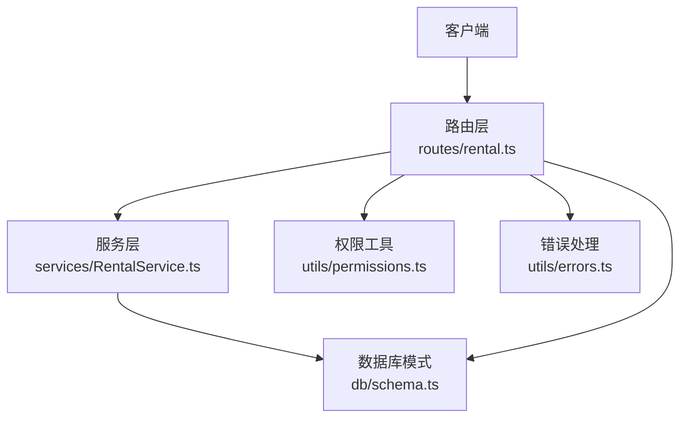
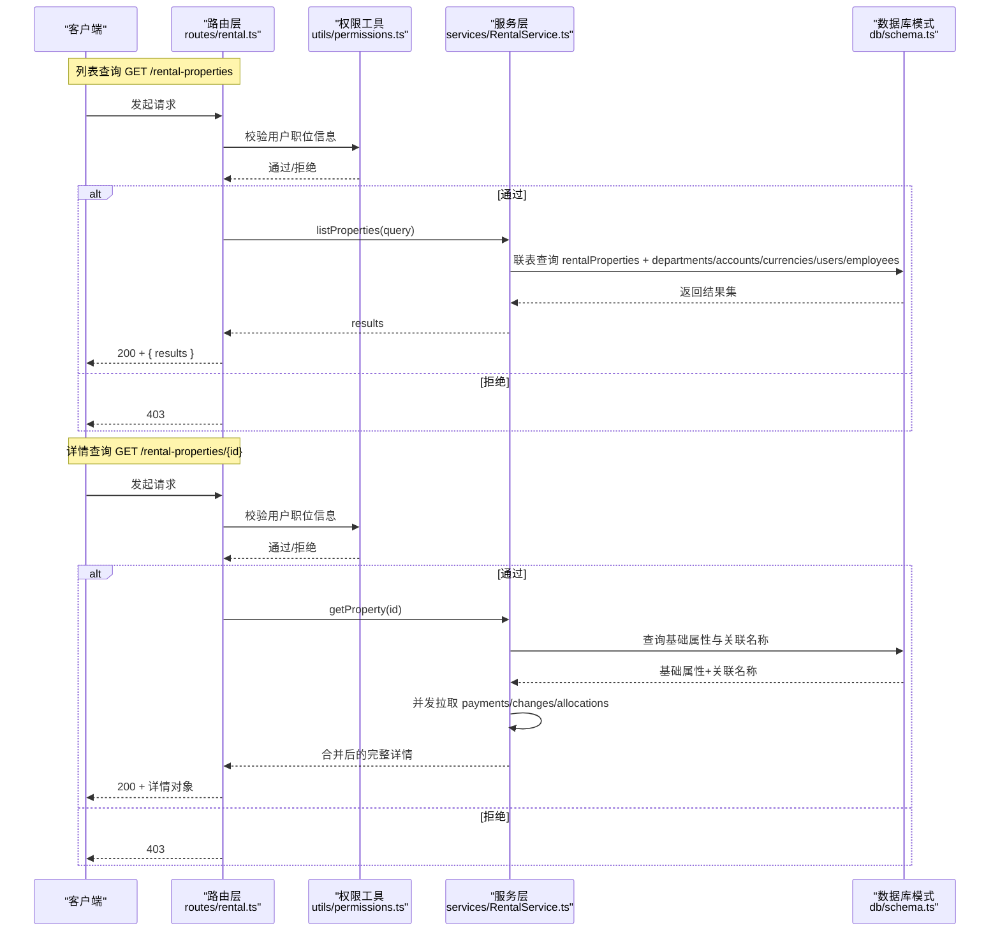
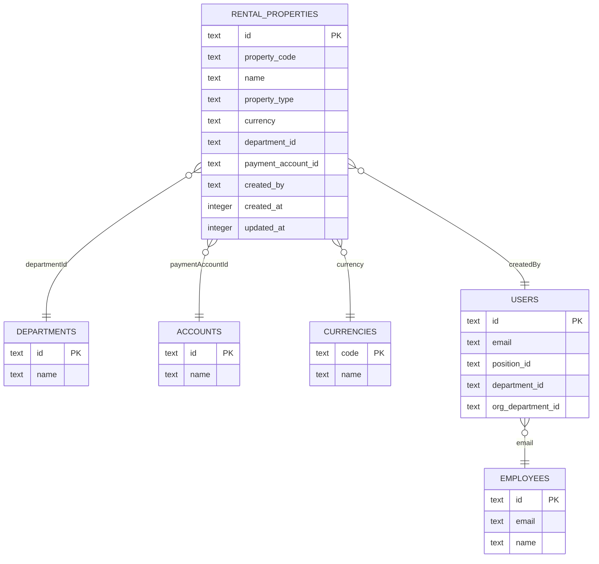
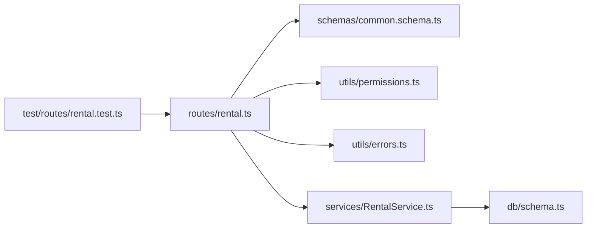

# 查询房产

<cite>
**本文引用的文件**
- [backend/src/routes/rental.ts](file://backend/src/routes/rental.ts)
- [backend/src/services/RentalService.ts](file://backend/src/services/RentalService.ts)
- [backend/src/schemas/common.schema.ts](file://backend/src/schemas/common.schema.ts)
- [backend/src/utils/permissions.ts](file://backend/src/utils/permissions.ts)
- [backend/src/utils/errors.ts](file://backend/src/utils/errors.ts)
- [backend/src/db/schema.ts](file://backend/src/db/schema.ts)
- [backend/openapi.json](file://backend/openapi.json)
- [backend/test/routes/rental.test.ts](file://backend/test/routes/rental.test.ts)
</cite>

## 目录
1. [简介](#简介)
2. [项目结构](#项目结构)
3. [核心组件](#核心组件)
4. [架构总览](#架构总览)
5. [详细组件分析](#详细组件分析)
6. [依赖关系分析](#依赖关系分析)
7. [性能考量](#性能考量)
8. [故障排查指南](#故障排查指南)
9. [结论](#结论)

## 简介
本文件面向“房产管理”模块中的“查询房产”能力，提供两个查询端点的权威说明：
- 列表查询：GET /rental-properties
- 详情查询：GET /rental-properties/{id}

内容覆盖：
- 支持的过滤参数与排序规则
- 响应数据结构及字段含义
- 关联信息（部门、付款账户、币种、创建人）
- 详情查询的扩展信息（付款记录、变更历史、宿舍分配）
- 成功与错误响应示例
- 权限要求与校验逻辑

## 项目结构
围绕查询房产的相关代码主要分布在以下位置：
- 路由层：定义端点、请求校验与响应结构
- 服务层：封装数据库查询与关联数据聚合
- 模式层：定义查询参数与响应结构
- 权限与错误：统一的权限校验与错误处理

图表来源
- [backend/src/routes/rental.ts](file://backend/src/routes/rental.ts#L24-L49)
- [backend/src/services/RentalService.ts](file://backend/src/services/RentalService.ts#L15-L41)
- [backend/src/schemas/common.schema.ts](file://backend/src/schemas/common.schema.ts#L117-L121)
- [backend/src/utils/permissions.ts](file://backend/src/utils/permissions.ts#L29-L32)
- [backend/src/utils/errors.ts](file://backend/src/utils/errors.ts#L34-L54)
- [backend/src/db/schema.ts](file://backend/src/db/schema.ts#L534-L631)

章节来源
- [backend/src/routes/rental.ts](file://backend/src/routes/rental.ts#L24-L49)
- [backend/src/services/RentalService.ts](file://backend/src/services/RentalService.ts#L15-L41)
- [backend/src/schemas/common.schema.ts](file://backend/src/schemas/common.schema.ts#L117-L121)
- [backend/src/utils/permissions.ts](file://backend/src/utils/permissions.ts#L29-L32)
- [backend/src/utils/errors.ts](file://backend/src/utils/errors.ts#L34-L54)
- [backend/src/db/schema.ts](file://backend/src/db/schema.ts#L534-L631)

## 核心组件
- 路由与端点
  - GET /rental-properties：列表查询，支持 propertyType、status、departmentId 过滤，按创建时间倒序
  - GET /rental-properties/{id}：详情查询，返回基础属性与关联信息，并附带付款记录、变更历史、宿舍分配（若为宿舍类型）

- 服务层
  - listProperties：构建条件并联表查询，返回基础属性与关联名称字段
  - getProperty：先查询基础属性与关联名称，再并发拉取付款记录、变更历史、宿舍分配（仅宿舍类型）

- 模式与校验
  - rentalPropertyQuerySchema：定义查询参数的合法值域
  - OpenAPI 定义了响应结构（results 数组，每项含 property 及关联名称字段）

- 权限与错误
  - 列表与详情均要求用户提供职位信息（getUserPosition），否则返回 403
  - 详情查询当房产不存在时返回 404

章节来源
- [backend/src/routes/rental.ts](file://backend/src/routes/rental.ts#L24-L49)
- [backend/src/routes/rental.ts](file://backend/src/routes/rental.ts#L202-L227)
- [backend/src/services/RentalService.ts](file://backend/src/services/RentalService.ts#L15-L41)
- [backend/src/services/RentalService.ts](file://backend/src/services/RentalService.ts#L43-L95)
- [backend/src/schemas/common.schema.ts](file://backend/src/schemas/common.schema.ts#L117-L121)
- [backend/src/utils/permissions.ts](file://backend/src/utils/permissions.ts#L29-L32)
- [backend/src/utils/errors.ts](file://backend/src/utils/errors.ts#L34-L54)

## 架构总览
下图展示查询流程的关键步骤与组件交互：

图表来源
- [backend/src/routes/rental.ts](file://backend/src/routes/rental.ts#L24-L49)
- [backend/src/routes/rental.ts](file://backend/src/routes/rental.ts#L202-L227)
- [backend/src/utils/permissions.ts](file://backend/src/utils/permissions.ts#L29-L32)
- [backend/src/services/RentalService.ts](file://backend/src/services/RentalService.ts#L15-L41)
- [backend/src/services/RentalService.ts](file://backend/src/services/RentalService.ts#L43-L95)
- [backend/src/db/schema.ts](file://backend/src/db/schema.ts#L534-L631)

## 详细组件分析

### 端点：GET /rental-properties（列表查询）
- 请求方法与路径
  - GET /rental-properties

- 查询参数
  - propertyType：枚举 office、warehouse、dormitory、other
  - status：字符串（例如 active、inactive 等，具体值取决于业务状态定义）
  - departmentId：UUID（部门ID）

- 排序规则
  - 按创建时间倒序（createdAt DESC）

- 响应结构
  - results：数组，每项包含
    - property：基础房产信息对象
    - departmentName：所属部门名称
    - paymentAccountName：付款账户名称
    - currencyName：币种名称
    - createdByName：创建人姓名

- OpenAPI 定义
  - 参数与响应结构由 OpenAPI 描述文件维护，确保前后端一致

- 权限要求
  - 需要用户具备职位信息（getUserPosition），否则返回 403

- 错误响应
  - 403：权限不足（无职位信息）
  - 400：参数校验失败（Zod 验证错误）
  - 500：服务器内部错误

章节来源
- [backend/src/routes/rental.ts](file://backend/src/routes/rental.ts#L24-L49)
- [backend/src/schemas/common.schema.ts](file://backend/src/schemas/common.schema.ts#L117-L121)
- [backend/openapi.json](file://backend/openapi.json#L11246-L11282)
- [backend/src/utils/permissions.ts](file://backend/src/utils/permissions.ts#L29-L32)
- [backend/src/utils/errors.ts](file://backend/src/utils/errors.ts#L88-L112)

### 端点：GET /rental-properties/{id}（详情查询）
- 请求方法与路径
  - GET /rental-properties/{id}

- 路径参数
  - id：UUID（房产ID）

- 响应结构
  - 返回基础房产信息与关联名称字段，同时包含：
    - payments：该房产的付款记录列表（按年、月、创建时间倒序）
    - changes：该房产的变更历史列表（按变更日期倒序）
    - allocations：宿舍分配记录列表（仅当 propertyType=dormitory 时返回），包含员工姓名与部门名称

- 关联字段说明
  - departmentName：所属部门名称
  - paymentAccountName：付款账户名称
  - currencyName：币种名称
  - createdByName：创建人姓名

- 权限要求
  - 需要用户具备职位信息（getUserPosition），否则返回 403

- 错误响应
  - 403：权限不足（无职位信息）
  - 404：房产不存在
  - 400：参数校验失败（Zod 验证错误）
  - 500：服务器内部错误

- 实现要点
  - 详情查询会并发拉取三类数据：付款记录、变更历史、宿舍分配（仅宿舍类型）
  - 若非宿舍类型，则 allocations 为空数组

章节来源
- [backend/src/routes/rental.ts](file://backend/src/routes/rental.ts#L202-L227)
- [backend/src/services/RentalService.ts](file://backend/src/services/RentalService.ts#L43-L95)
- [backend/src/db/schema.ts](file://backend/src/db/schema.ts#L534-L631)
- [backend/src/utils/permissions.ts](file://backend/src/utils/permissions.ts#L29-L32)
- [backend/src/utils/errors.ts](file://backend/src/utils/errors.ts#L34-L54)

### 数据模型与联表关系
- 房产主表：rentalProperties
- 关联表：
  - departments：部门名称
  - accounts：付款账户名称
  - currencies：币种名称
  - users/employees：创建人姓名

图表来源
- [backend/src/db/schema.ts](file://backend/src/db/schema.ts#L534-L631)

## 依赖关系分析
- 路由层依赖
  - 模式校验：rentalPropertyQuerySchema
  - 权限工具：getUserPosition
  - 错误处理：Errors 工具

- 服务层依赖
  - 数据库模式：rentalProperties、departments、accounts、currencies、users、employees
  - 并发策略：对付款记录、变更历史、宿舍分配采用 Promise.all 并行拉取

- 测试覆盖
  - 单元测试验证列表与详情端点的返回结构与状态码

图表来源
- [backend/src/routes/rental.ts](file://backend/src/routes/rental.ts#L24-L49)
- [backend/src/routes/rental.ts](file://backend/src/routes/rental.ts#L202-L227)
- [backend/src/schemas/common.schema.ts](file://backend/src/schemas/common.schema.ts#L117-L121)
- [backend/src/utils/permissions.ts](file://backend/src/utils/permissions.ts#L29-L32)
- [backend/src/utils/errors.ts](file://backend/src/utils/errors.ts#L34-L54)
- [backend/src/services/RentalService.ts](file://backend/src/services/RentalService.ts#L15-L41)
- [backend/src/services/RentalService.ts](file://backend/src/services/RentalService.ts#L43-L95)
- [backend/src/db/schema.ts](file://backend/src/db/schema.ts#L534-L631)
- [backend/test/routes/rental.test.ts](file://backend/test/routes/rental.test.ts#L66-L88)

章节来源
- [backend/src/routes/rental.ts](file://backend/src/routes/rental.ts#L24-L49)
- [backend/src/routes/rental.ts](file://backend/src/routes/rental.ts#L202-L227)
- [backend/src/services/RentalService.ts](file://backend/src/services/RentalService.ts#L15-L41)
- [backend/src/services/RentalService.ts](file://backend/src/services/RentalService.ts#L43-L95)
- [backend/test/routes/rental.test.ts](file://backend/test/routes/rental.test.ts#L66-L88)

## 性能考量
- 列表查询
  - 使用联表查询并按创建时间倒序，建议在相关列上建立索引以提升排序与过滤性能
  - 过滤条件为等值匹配，适合使用索引优化

- 详情查询
  - 并发拉取三类数据（付款记录、变更历史、宿舍分配），减少往返次数
  - 对于大列表场景，建议结合分页参数（如存在）或限制返回数量

- 数据一致性
  - 详情查询在获取基础属性后，再并发拉取关联数据，避免阻塞主流程

[本节为通用指导，无需列出章节来源]

## 故障排查指南
- 403 权限不足
  - 现象：调用列表或详情端点返回 403
  - 原因：未提供有效的用户职位信息（getUserPosition 为空）
  - 处理：确认登录态与用户职位信息是否正确注入

- 404 房产不存在
  - 现象：详情查询返回 404
  - 原因：传入的房产ID在数据库中不存在
  - 处理：核对ID是否正确，或确认该房产是否已被删除

- 400 参数校验失败
  - 现象：请求参数不符合 schema 定义
  - 原因：propertyType、status、departmentId 或 id 的格式不正确
  - 处理：根据 OpenAPI 定义修正参数类型与取值范围

- 500 服务器内部错误
  - 现象：服务异常
  - 原因：数据库连接、事务或并发拉取异常
  - 处理：查看服务端日志，定位具体异常栈

章节来源
- [backend/src/utils/errors.ts](file://backend/src/utils/errors.ts#L34-L54)
- [backend/src/utils/errors.ts](file://backend/src/utils/errors.ts#L88-L112)
- [backend/src/utils/permissions.ts](file://backend/src/utils/permissions.ts#L29-L32)
- [backend/src/services/RentalService.ts](file://backend/src/services/RentalService.ts#L43-L95)

## 结论
- 列表查询支持按物业类型、状态与部门ID过滤，并按创建时间倒序返回，响应包含部门、付款账户、币种与创建人等关联信息。
- 详情查询在基础信息之上，补充付款记录、变更历史与宿舍分配（宿舍类型）等扩展信息，并通过并发拉取保证性能。
- 所有查询端点均要求用户提供职位信息，否则返回 403；详情查询在资源不存在时返回 404。
- 建议在生产环境中为常用过滤字段建立索引，并结合分页策略控制返回规模，以获得更佳性能与稳定性。