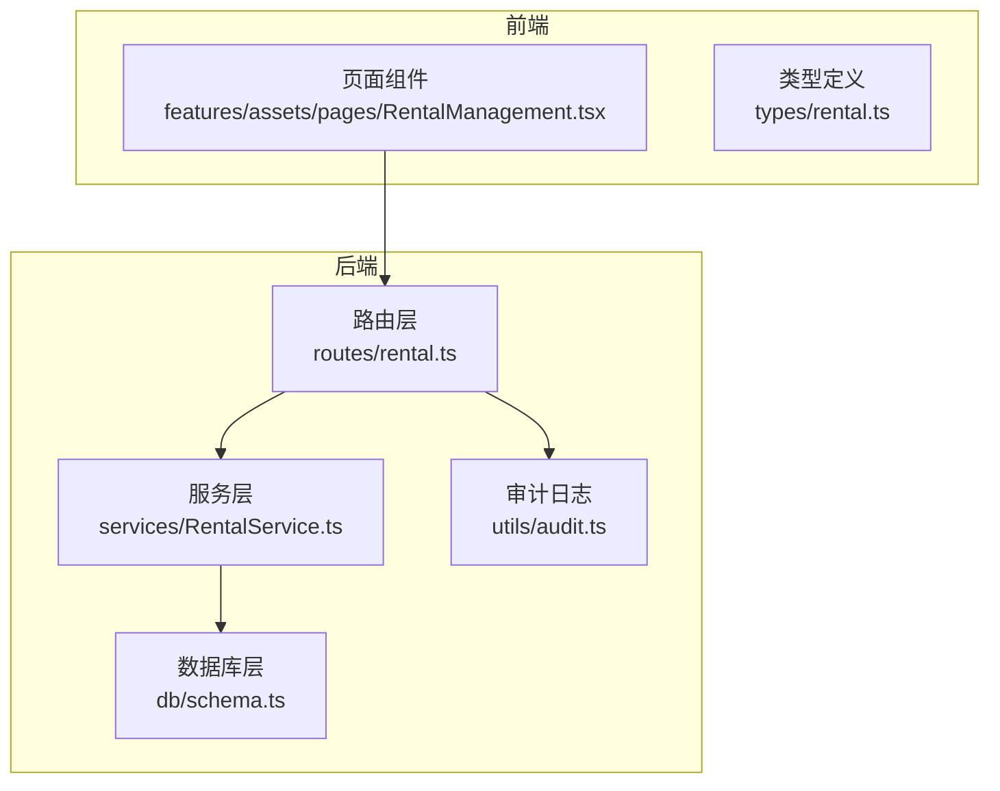
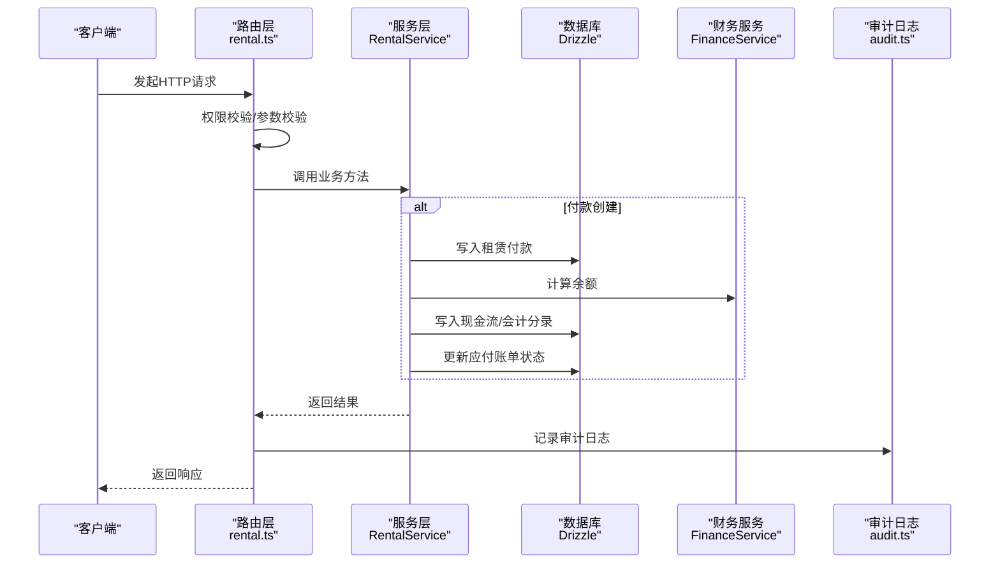
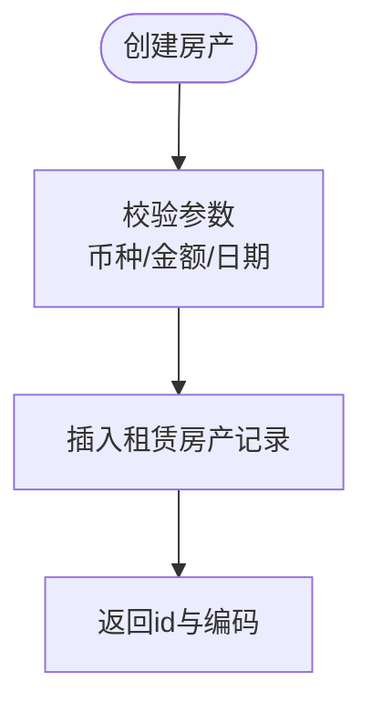
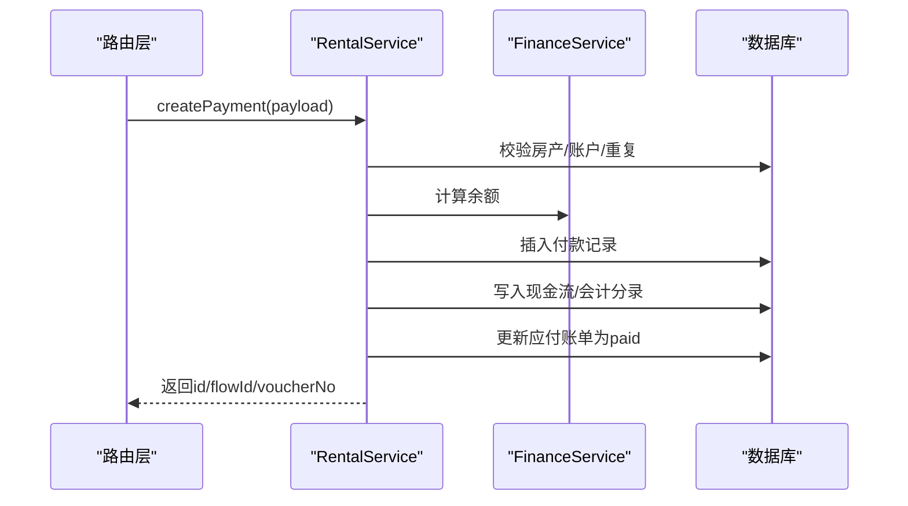
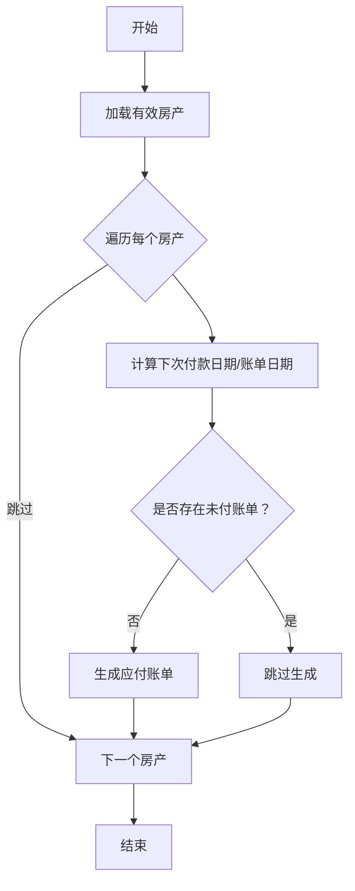
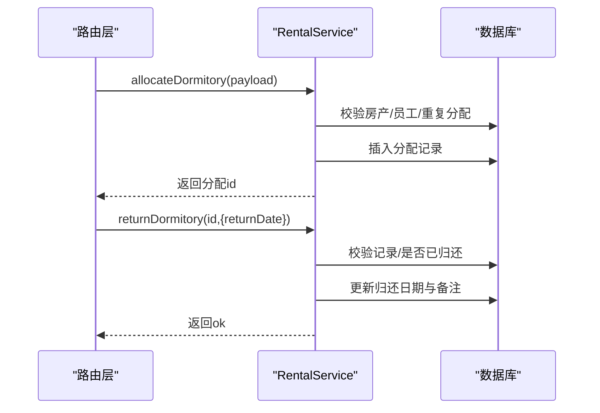
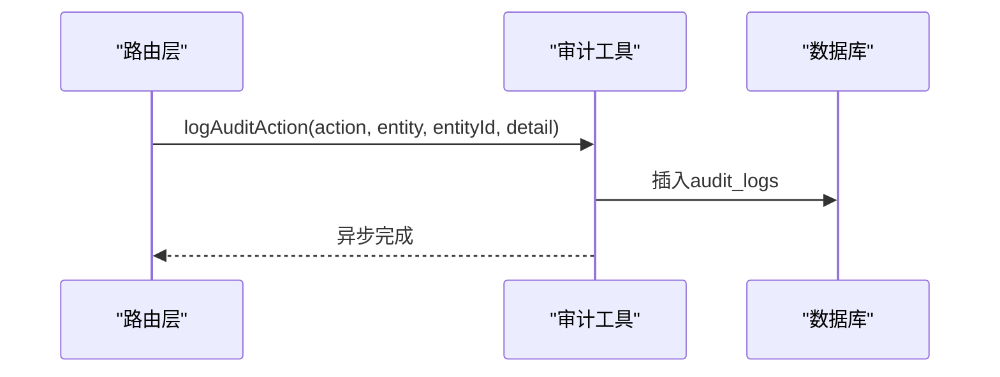
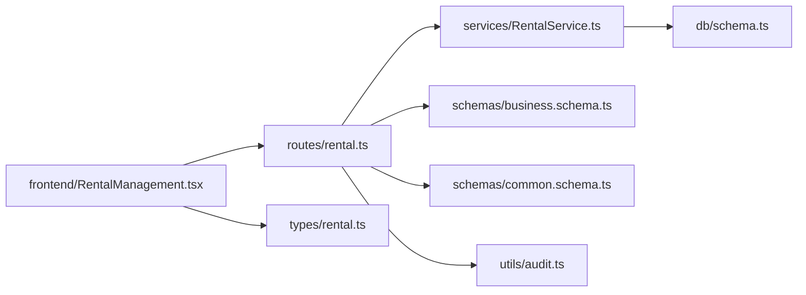
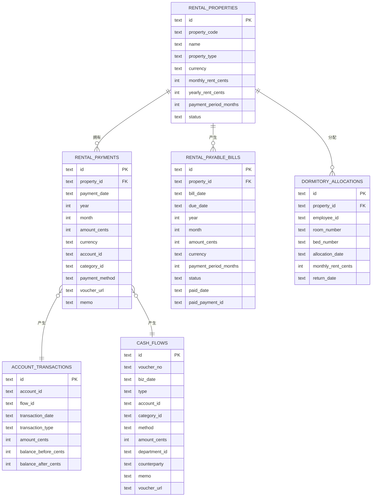

# 租赁管理API

<cite>
**本文引用的文件**
- [backend/src/routes/rental.ts](file://backend/src/routes/rental.ts)
- [backend/src/services/RentalService.ts](file://backend/src/services/RentalService.ts)
- [backend/src/schemas/business.schema.ts](file://backend/src/schemas/business.schema.ts)
- [backend/src/schemas/common.schema.ts](file://backend/src/schemas/common.schema.ts)
- [backend/src/db/schema.ts](file://backend/src/db/schema.ts)
- [backend/src/db/schema.sql](file://backend/src/db/schema.sql)
- [backend/src/utils/audit.ts](file://backend/src/utils/audit.ts)
- [backend/test/routes/rental.test.ts](file://backend/test/routes/rental.test.ts)
- [frontend/src/features/assets/pages/RentalManagement.tsx](file://frontend/src/features/assets/pages/RentalManagement.tsx)
- [frontend/src/types/rental.ts](file://frontend/src/types/rental.ts)
</cite>

## 目录
1. [简介](#简介)
2. [项目结构](#项目结构)
3. [核心组件](#核心组件)
4. [架构总览](#架构总览)
5. [详细组件分析](#详细组件分析)
6. [依赖关系分析](#依赖关系分析)
7. [性能考量](#性能考量)
8. [故障排查指南](#故障排查指南)
9. [结论](#结论)
10. [附录](#附录)

## 简介
本文件面向财务与HR系统中的“租赁管理”模块，提供完整的API使用说明与实现解析。内容覆盖：
- 租赁房产的全生命周期管理：创建、查询、更新、删除
- 租赁付款的创建、更新、删除与查询
- 应付账单的生成与标记已付
- 员工宿舍分配与归还流程及状态管理
- 租赁与财务数据（现金流、会计分录）的关联
- 租赁合同信息、付款计划与账单状态的查询接口使用示例
- 租赁审计日志的记录机制

## 项目结构
后端采用Hono + Drizzle ORM + Cloudflare D1数据库，路由层负责权限校验与参数校验，服务层封装业务逻辑与事务处理，数据库层通过Drizzle映射SQLite表结构。

图表来源
- [backend/src/routes/rental.ts](file://backend/src/routes/rental.ts#L1-L677)
- [backend/src/services/RentalService.ts](file://backend/src/services/RentalService.ts#L1-L617)
- [backend/src/db/schema.ts](file://backend/src/db/schema.ts#L1-L200)
- [backend/src/utils/audit.ts](file://backend/src/utils/audit.ts#L1-L92)
- [frontend/src/features/assets/pages/RentalManagement.tsx](file://frontend/src/features/assets/pages/RentalManagement.tsx#L1-L800)
- [frontend/src/types/rental.ts](file://frontend/src/types/rental.ts#L1-L143)

章节来源
- [backend/src/routes/rental.ts](file://backend/src/routes/rental.ts#L1-L677)
- [backend/src/services/RentalService.ts](file://backend/src/services/RentalService.ts#L1-L617)
- [backend/src/db/schema.ts](file://backend/src/db/schema.ts#L1-L200)
- [backend/src/utils/audit.ts](file://backend/src/utils/audit.ts#L1-L92)
- [frontend/src/features/assets/pages/RentalManagement.tsx](file://frontend/src/features/assets/pages/RentalManagement.tsx#L1-L800)
- [frontend/src/types/rental.ts](file://frontend/src/types/rental.ts#L1-L143)

## 核心组件
- 路由层：定义所有租赁相关REST接口，包含鉴权、参数校验、响应结构与审计日志记录。
- 服务层：实现业务逻辑，包括：
  - 房产CRUD与变更记录
  - 付款创建（联动财务流水与会计分录）
  - 宿舍分配与归还
  - 应付账单生成与状态更新
- 数据库层：通过Drizzle映射SQLite表，包含租赁房产、付款、应付账单、宿舍分配、审计日志等。
- 审计日志：统一记录用户对租赁实体的操作行为，便于合规与追踪。

章节来源
- [backend/src/routes/rental.ts](file://backend/src/routes/rental.ts#L1-L677)
- [backend/src/services/RentalService.ts](file://backend/src/services/RentalService.ts#L1-L617)
- [backend/src/db/schema.ts](file://backend/src/db/schema.ts#L570-L644)
- [backend/src/utils/audit.ts](file://backend/src/utils/audit.ts#L1-L92)

## 架构总览
下图展示从HTTP请求到数据库写入与财务联动的整体流程。

图表来源
- [backend/src/routes/rental.ts](file://backend/src/routes/rental.ts#L390-L568)
- [backend/src/services/RentalService.ts](file://backend/src/services/RentalService.ts#L238-L350)
- [backend/src/utils/audit.ts](file://backend/src/utils/audit.ts#L36-L92)

## 详细组件分析

### 1. 租赁房产管理
- 接口
  - GET /rental-properties：分页查询租赁房产列表（支持按类型、状态、部门过滤）
  - GET /rental-properties/{id}：获取单个房产详情（含付款、变更、宿舍分配）
  - POST /rental-properties：创建房产
  - PUT /rental-properties/{id}：更新房产
  - DELETE /rental-properties/{id}：删除房产（存在付款记录时禁止删除）
- 关键字段
  - 房产类型：office、dormitory等
  - 租金类型：monthly、yearly
  - 付款周期：月份数
  - 付款日：每月固定日期
  - 押金、房东信息、合同文件链接
- 变更记录
  - 更新关键字段（如状态、月租、合同期）时，自动记录变更历史

图表来源
- [backend/src/routes/rental.ts](file://backend/src/routes/rental.ts#L229-L358)
- [backend/src/services/RentalService.ts](file://backend/src/services/RentalService.ts#L97-L204)
- [backend/src/schemas/business.schema.ts](file://backend/src/schemas/business.schema.ts#L80-L116)

章节来源
- [backend/src/routes/rental.ts](file://backend/src/routes/rental.ts#L229-L358)
- [backend/src/services/RentalService.ts](file://backend/src/services/RentalService.ts#L97-L204)
- [backend/src/schemas/business.schema.ts](file://backend/src/schemas/business.schema.ts#L80-L116)

### 2. 租赁付款管理
- 接口
  - GET /rental-payments：查询付款列表（支持按房产、年、月过滤）
  - POST /rental-payments：创建付款记录
  - PUT /rental-payments/{id}：更新付款记录
  - DELETE /rental-payments/{id}：删除付款记录
- 财务联动
  - 付款创建时，调用财务服务计算账户余额，生成凭证号，写入现金流与会计分录
  - 自动将对应应付账单标记为已付
- 字段要点
  - 金额以“分”存储
  - 凭证URL、付款方式、分类、账户等

图表来源
- [backend/src/routes/rental.ts](file://backend/src/routes/rental.ts#L436-L568)
- [backend/src/services/RentalService.ts](file://backend/src/services/RentalService.ts#L238-L350)

章节来源
- [backend/src/routes/rental.ts](file://backend/src/routes/rental.ts#L390-L568)
- [backend/src/services/RentalService.ts](file://backend/src/services/RentalService.ts#L238-L350)
- [backend/src/schemas/business.schema.ts](file://backend/src/schemas/business.schema.ts#L581-L603)

### 3. 应付账单管理
- 接口
  - POST /rental-properties/generate-payable-bills：批量生成应付账单
  - GET /rental-payable-bills：查询应付账单列表（支持按状态、日期范围、房产过滤）
  - POST /rental-payable-bills/:id/mark-paid：标记账单为已付
- 生成逻辑
  - 基于合同起止日期、付款周期、付款日与当前日期，推导应出账期
  - 年租/月租按周期折算金额
  - 仅生成未存在的“未付”账单
- 状态流转
  - 付款创建时自动更新对应账单为paid，并回写付款记录ID与付款日期

图表来源
- [backend/src/routes/rental.ts](file://backend/src/routes/rental.ts#L572-L677)
- [backend/src/services/RentalService.ts](file://backend/src/services/RentalService.ts#L489-L575)
- [backend/src/db/schema.ts](file://backend/src/db/schema.ts#L614-L631)

章节来源
- [backend/src/routes/rental.ts](file://backend/src/routes/rental.ts#L572-L677)
- [backend/src/services/RentalService.ts](file://backend/src/services/RentalService.ts#L489-L575)
- [backend/src/db/schema.ts](file://backend/src/db/schema.ts#L614-L631)

### 4. 员工宿舍分配与归还
- 接口
  - POST /rental-properties/{id}/allocate-dormitory：分配宿舍（员工、房间号、床号、月租、分配日期）
  - POST /rental-properties/allocations/{id}/return：归还宿舍（归还日期、备注）
  - GET /rental-properties/allocations：查询分配记录（支持按房产、员工、是否已归还过滤）
- 状态管理
  - 同一员工在同一房产不可重复分配（未归还状态下）
  - 归还后可再次分配
- 关联数据
  - 分配记录与员工、部门、创建人等关联

图表来源
- [backend/src/routes/rental.ts](file://backend/src/routes/rental.ts#L109-L200)
- [backend/src/services/RentalService.ts](file://backend/src/services/RentalService.ts#L431-L486)
- [backend/src/db/schema.ts](file://backend/src/db/schema.ts#L599-L612)

章节来源
- [backend/src/routes/rental.ts](file://backend/src/routes/rental.ts#L109-L200)
- [backend/src/services/RentalService.ts](file://backend/src/services/RentalService.ts#L431-L486)
- [backend/src/db/schema.ts](file://backend/src/db/schema.ts#L599-L612)

### 5. 租赁与财务数据关联
- 付款创建时，服务层通过财务服务计算账户余额，生成凭证号，写入：
  - 现金流表（cash_flows）
  - 会计分录表（account_transactions）
- 应付账单与付款记录双向关联：
  - 付款创建时更新应付账单状态为paid并回写付款ID
  - 标记已付接口直接更新账单状态

章节来源
- [backend/src/services/RentalService.ts](file://backend/src/services/RentalService.ts#L238-L350)
- [backend/src/db/schema.ts](file://backend/src/db/schema.ts#L165-L193)

### 6. 租赁合同信息、付款计划与账单状态查询
- 前端页面提供：
  - 房产列表与筛选（类型、状态）
  - 房产详情（含付款、变更、宿舍分配）
  - 付款记录录入（自动计算金额与年月）
  - 应付账单列表（默认未付）
- 接口使用示例（路径与参数）
  - 获取房产列表：GET /rental-properties?propertyType=office&status=active
  - 获取某房产详情：GET /rental-properties/{id}
  - 获取付款列表：GET /rental-payments?propertyId={id}&year=2024&month=1
  - 获取应付账单：GET /rental-payable-bills?status=unpaid&startDate=2024-01-01&endDate=2024-12-31

章节来源
- [frontend/src/features/assets/pages/RentalManagement.tsx](file://frontend/src/features/assets/pages/RentalManagement.tsx#L1-L800)
- [backend/src/routes/rental.ts](file://backend/src/routes/rental.ts#L229-L677)
- [frontend/src/types/rental.ts](file://frontend/src/types/rental.ts#L1-L143)

### 7. 审计日志记录机制
- 路由层在每次成功操作后调用审计工具记录：
  - 操作者、动作（create/update/delete/allocate/return/generate/mark-paid）、实体、实体ID、详情、IP与IP归属地
- 日志持久化至audit_logs表，支持后续查询与追溯

图表来源
- [backend/src/routes/rental.ts](file://backend/src/routes/rental.ts#L135-L159)
- [backend/src/utils/audit.ts](file://backend/src/utils/audit.ts#L36-L92)
- [backend/src/db/schema.ts](file://backend/src/db/schema.ts#L633-L643)

章节来源
- [backend/src/routes/rental.ts](file://backend/src/routes/rental.ts#L135-L159)
- [backend/src/utils/audit.ts](file://backend/src/utils/audit.ts#L36-L92)
- [backend/src/db/schema.ts](file://backend/src/db/schema.ts#L633-L643)

## 依赖关系分析
- 路由层依赖权限校验与参数校验Schema
- 服务层依赖Drizzle ORM与FinanceService进行余额与凭证计算
- 数据库层通过schema.ts映射SQLite表，包含租赁、付款、应付账单、宿舍分配、审计日志等
- 前端通过API配置与类型定义对接后端接口

图表来源
- [backend/src/routes/rental.ts](file://backend/src/routes/rental.ts#L1-L677)
- [backend/src/services/RentalService.ts](file://backend/src/services/RentalService.ts#L1-L617)
- [backend/src/schemas/business.schema.ts](file://backend/src/schemas/business.schema.ts#L1-L800)
- [backend/src/schemas/common.schema.ts](file://backend/src/schemas/common.schema.ts#L1-L230)
- [backend/src/db/schema.ts](file://backend/src/db/schema.ts#L1-L200)
- [backend/src/utils/audit.ts](file://backend/src/utils/audit.ts#L1-L92)
- [frontend/src/features/assets/pages/RentalManagement.tsx](file://frontend/src/features/assets/pages/RentalManagement.tsx#L1-L800)
- [frontend/src/types/rental.ts](file://frontend/src/types/rental.ts#L1-L143)

章节来源
- [backend/src/routes/rental.ts](file://backend/src/routes/rental.ts#L1-L677)
- [backend/src/services/RentalService.ts](file://backend/src/services/RentalService.ts#L1-L617)
- [backend/src/schemas/business.schema.ts](file://backend/src/schemas/business.schema.ts#L1-L800)
- [backend/src/schemas/common.schema.ts](file://backend/src/schemas/common.schema.ts#L1-L230)
- [backend/src/db/schema.ts](file://backend/src/db/schema.ts#L1-L200)
- [backend/src/utils/audit.ts](file://backend/src/utils/audit.ts#L1-L92)
- [frontend/src/features/assets/pages/RentalManagement.tsx](file://frontend/src/features/assets/pages/RentalManagement.tsx#L1-L800)
- [frontend/src/types/rental.ts](file://frontend/src/types/rental.ts#L1-L143)

## 性能考量
- 查询优化
  - 对常用过滤条件（propertyId、year、month、status、dueDate）建立索引可提升查询效率（建议在数据库层补充）
- 事务与一致性
  - 付款创建涉及多表写入（付款、现金流、会计分录、应付账单），已在服务层使用事务包裹，保证原子性
- 并发控制
  - 付款按“年+月+房产”去重，避免重复入账
  - 宿舍分配同一员工同一房产在同一时间仅允许一条未归还记录
- 前端交互
  - 前端在创建/编辑/分配/付款时进行本地校验与格式化，减少无效请求

[本节为通用指导，无需特定文件来源]

## 故障排查指南
- 权限不足
  - 现象：返回403
  - 处理：确认用户岗位权限包含资产-租赁模块的create/update/delete/allocate等权限
- 参数校验失败
  - 现象：返回400，提示字段格式或必填项缺失
  - 处理：对照Schema校验字段类型、长度、枚举值与必填要求
- 业务约束错误
  - 房产删除失败：若存在付款记录则拒绝删除
  - 宿舍重复分配：同一员工同一房产未归还状态下不允许再次分配
  - 已归还：重复归还会报错
  - 账单已付：重复标记已付会报错
- 财务异常
  - 账户不存在或停用、币种不匹配会导致付款创建失败
- 审计日志
  - 若审计记录未写入，检查IP与会话解析逻辑，必要时降级处理

章节来源
- [backend/src/routes/rental.ts](file://backend/src/routes/rental.ts#L135-L200)
- [backend/src/services/RentalService.ts](file://backend/src/services/RentalService.ts#L190-L204)
- [backend/src/services/RentalService.ts](file://backend/src/services/RentalService.ts#L431-L486)
- [backend/src/services/RentalService.ts](file://backend/src/services/RentalService.ts#L352-L365)
- [backend/src/utils/audit.ts](file://backend/src/utils/audit.ts#L36-L92)

## 结论
本模块通过清晰的路由与服务分层，实现了租赁房产、付款、应付账单、宿舍分配与归还的完整闭环，并与财务系统深度集成，确保每笔付款均可追溯到现金流与会计分录。审计日志贯穿关键操作，满足合规与审计需求。前端页面提供直观的查询与录入体验，配合后端严格的参数与业务校验，保障系统稳定可靠。

[本节为总结，无需特定文件来源]

## 附录

### A. 接口一览与使用示例
- 房产
  - GET /rental-properties?propertyType=...&status=...
  - GET /rental-properties/{id}
  - POST /rental-properties
  - PUT /rental-properties/{id}
  - DELETE /rental-properties/{id}
- 付款
  - GET /rental-payments?propertyId=...&year=...&month=...
  - POST /rental-payments
  - PUT /rental-payments/{id}
  - DELETE /rental-payments/{id}
- 应付账单
  - POST /rental-properties/generate-payable-bills
  - GET /rental-payable-bills?status=...&startDate=...&endDate=...
  - POST /rental-payable-bills/:id/mark-paid
- 宿舍
  - POST /rental-properties/{id}/allocate-dormitory
  - POST /rental-properties/allocations/{id}/return
  - GET /rental-properties/allocations?propertyId=...&employeeId=...&returned=true|false

章节来源
- [backend/src/routes/rental.ts](file://backend/src/routes/rental.ts#L229-L677)
- [frontend/src/features/assets/pages/RentalManagement.tsx](file://frontend/src/features/assets/pages/RentalManagement.tsx#L1-L800)

### B. 数据模型关系

图表来源
- [backend/src/db/schema.ts](file://backend/src/db/schema.ts#L165-L193)
- [backend/src/db/schema.ts](file://backend/src/db/schema.ts#L570-L644)