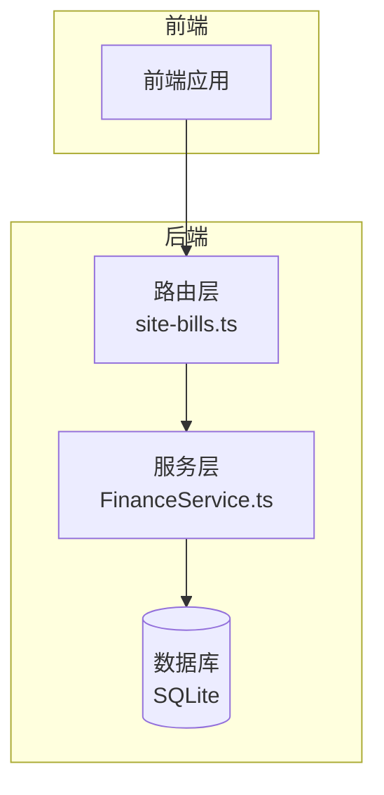
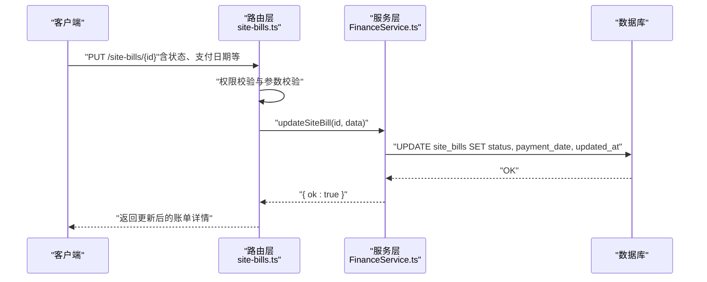
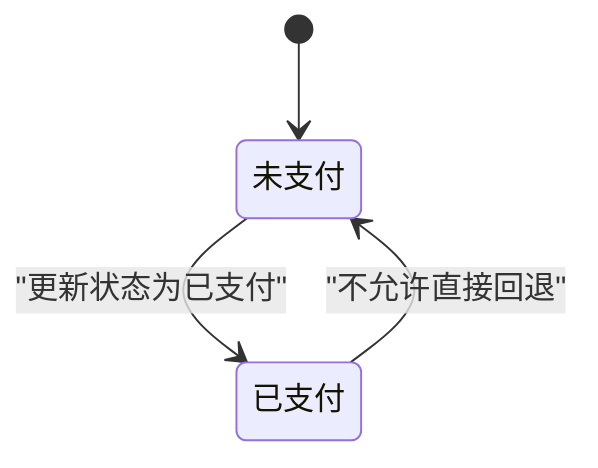
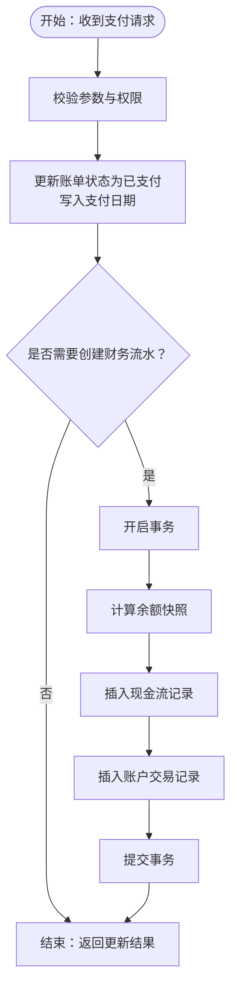
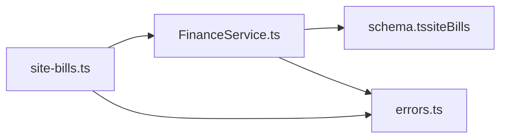

# 状态更新

<cite>
**本文引用的文件**
- [backend/src/routes/site-bills.ts](file://backend/src/routes/site-bills.ts)
- [backend/src/services/FinanceService.ts](file://backend/src/services/FinanceService.ts)
- [backend/src/db/schema.ts](file://backend/src/db/schema.ts)
- [backend/test/routes/site-bills.test.ts](file://backend/test/routes/site-bills.test.ts)
- [backend/test/services/FinanceService.test.ts](file://backend/test/services/FinanceService.test.ts)
- [backend/src/utils/errors.ts](file://backend/src/utils/errors.ts)
- [backend/src/routes/ar-ap.ts](file://backend/src/routes/ar-ap.ts)
- [backend/src/services/RentalService.ts](file://backend/src/services/RentalService.ts)
- [backend/src/services/ReportService.ts](file://backend/src/services/ReportService.ts)
- [frontend/src/types/schema.d.ts](file://frontend/src/types/schema.d.ts)
- [backend/openapi.json](file://backend/openapi.json)
</cite>

## 目录
1. [简介](#简介)
2. [项目结构](#项目结构)
3. [核心组件](#核心组件)
4. [架构总览](#架构总览)
5. [详细组件分析](#详细组件分析)
6. [依赖关系分析](#依赖关系分析)
7. [性能考量](#性能考量)
8. [故障排查指南](#故障排查指南)
9. [结论](#结论)
10. [附录](#附录)

## 简介
本文件聚焦“账单状态更新API”的完整实现与使用说明，覆盖以下要点：
- 账单状态机：明确“未支付”和“已支付”两种状态及其转换条件
- 支付后处理流程：更新账单状态、记录支付日期、关联付款记录
- 业务验证规则：防止重复支付、非法状态变更等
- 与财务系统集成：同步更新账户余额、生成财务流水与账户交易
- 错误处理示例：常见失败场景与解决方案

## 项目结构
围绕“站点账单”（site-bills）的路由、服务与数据库模型，形成清晰的分层：
- 路由层：负责请求校验、鉴权、调用服务层、返回结果
- 服务层：封装业务逻辑，如账单创建、更新、删除、状态变更
- 数据层：基于 Drizzle ORM 的 SQLite 表结构定义
- 测试层：覆盖路由与服务的行为验证

图表来源
- [backend/src/routes/site-bills.ts](file://backend/src/routes/site-bills.ts#L1-L374)
- [backend/src/services/FinanceService.ts](file://backend/src/services/FinanceService.ts#L590-L614)
- [backend/src/db/schema.ts](file://backend/src/db/schema.ts#L436-L452)

章节来源
- [backend/src/routes/site-bills.ts](file://backend/src/routes/site-bills.ts#L1-L374)
- [backend/src/services/FinanceService.ts](file://backend/src/services/FinanceService.ts#L590-L614)
- [backend/src/db/schema.ts](file://backend/src/db/schema.ts#L436-L452)

## 核心组件
- 路由接口：提供 GET/POST/PUT/DELETE 站点账单操作，包含列表、详情、创建、更新、删除
- 服务方法：提供创建、更新、删除站点账单的服务方法
- 数据模型：站点账单表包含状态字段，默认“未支付”，支持更新为“已支付”
- 错误体系：统一的错误类型与中间件，便于定位业务异常

章节来源
- [backend/src/routes/site-bills.ts](file://backend/src/routes/site-bills.ts#L1-L374)
- [backend/src/services/FinanceService.ts](file://backend/src/services/FinanceService.ts#L590-L614)
- [backend/src/db/schema.ts](file://backend/src/db/schema.ts#L436-L452)
- [backend/src/utils/errors.ts](file://backend/src/utils/errors.ts#L1-L59)

## 架构总览
从“状态更新”视角，核心调用链如下：
- 客户端发起 PUT 请求至“更新站点账单”接口
- 路由层进行权限校验与参数校验
- 服务层执行账单更新（写入数据库）
- 返回更新后的账单详情

图表来源
- [backend/src/routes/site-bills.ts](file://backend/src/routes/site-bills.ts#L216-L285)
- [backend/src/services/FinanceService.ts](file://backend/src/services/FinanceService.ts#L592-L607)

章节来源
- [backend/src/routes/site-bills.ts](file://backend/src/routes/site-bills.ts#L216-L285)
- [backend/src/services/FinanceService.ts](file://backend/src/services/FinanceService.ts#L592-L607)

## 详细组件分析

### 状态机与转换规则
- 状态定义
  - 未支付：默认状态
  - 已支付：通过更新接口将状态置为“已支付”
- 转换条件
  - 仅当账单处于“未支付”状态时，才允许更新为“已支付”
  - 更新时可同时填写支付日期字段，用于记录实际支付时间
- 业务约束
  - 若账单已是“已支付”，再次更新将触发业务错误，防止重复支付

图表来源
- [backend/src/db/schema.ts](file://backend/src/db/schema.ts#L436-L452)
- [backend/test/services/FinanceService.test.ts](file://backend/test/services/FinanceService.test.ts#L254-L271)

章节来源
- [backend/src/db/schema.ts](file://backend/src/db/schema.ts#L436-L452)
- [backend/test/services/FinanceService.test.ts](file://backend/test/services/FinanceService.test.ts#L254-L271)

### 支付后处理流程
- 更新账单状态与支付日期
  - 通过服务层的“更新站点账单”方法，将状态更新为“已支付”，并写入支付日期
- 关联付款记录
  - 当前“站点账单”表未直接存储付款记录ID；若需强关联，可在后续扩展中引入外键字段
- 财务集成（账户余额与流水）
  - 本仓库中“站点账单”更新不直接创建财务流水
  - 财务流水与账户交易的创建逻辑集中在“现金流”与“账户交易”模块
  - 参考“租金管理”中的支付流程，展示如何在事务中创建现金流与账户交易，并计算余额快照

图表来源
- [backend/src/services/FinanceService.ts](file://backend/src/services/FinanceService.ts#L41-L128)
- [backend/src/services/RentalService.ts](file://backend/src/services/RentalService.ts#L238-L333)

章节来源
- [backend/src/services/FinanceService.ts](file://backend/src/services/FinanceService.ts#L41-L128)
- [backend/src/services/RentalService.ts](file://backend/src/services/RentalService.ts#L238-L333)

### 业务验证规则
- 防止重复支付
  - 若账单状态已是“已支付”，再次更新将抛出业务错误，避免重复支付
- 权限控制
  - 更新接口要求具备相应权限（finance/site + site_bill/update）
- 参数校验
  - 路由层对请求体进行结构化校验（Zod），确保字段完整性与类型正确

章节来源
- [backend/src/routes/site-bills.ts](file://backend/src/routes/site-bills.ts#L243-L263)
- [backend/src/utils/errors.ts](file://backend/src/utils/errors.ts#L1-L59)
- [backend/test/routes/site-bills.test.ts](file://backend/test/routes/site-bills.test.ts#L167-L202)

### 与财务系统的集成
- 余额快照与流水
  - 通过“账户余额快照”算法，在指定业务日期前查找最近一笔交易，决定“余额前值”
  - 基于余额快照，创建“现金流”与“账户交易”记录，保证历史时序一致性
- 报表与余额
  - 提供账户余额报表能力，按账户维度汇总期初、收入、支出与期末余额

章节来源
- [backend/src/services/FinanceService.ts](file://backend/src/services/FinanceService.ts#L41-L128)
- [backend/src/services/ReportService.ts](file://backend/src/services/ReportService.ts#L336-L361)

### API 规范与示例
- 接口定义
  - 列表：GET /site-bills（支持按站点、日期范围、类型、状态筛选）
  - 创建：POST /site-bills（默认状态为“未支付”）
  - 更新：PUT /site-bills/{id}（可更新状态、支付日期等）
  - 删除：DELETE /site-bills/{id}
  - 详情：GET /site-bills/{id}
- 字段说明（节选）
  - 状态：pending（未支付）、paid（已支付）
  - 支付日期：paymentDate（可选）
  - 账户与分类：accountId、categoryId（可选）
- 前端类型与 OpenAPI
  - 前端类型定义与 OpenAPI 文档中均包含上述字段

章节来源
- [backend/src/routes/site-bills.ts](file://backend/src/routes/site-bills.ts#L70-L138)
- [backend/src/routes/site-bills.ts](file://backend/src/routes/site-bills.ts#L140-L214)
- [backend/src/routes/site-bills.ts](file://backend/src/routes/site-bills.ts#L216-L285)
- [backend/src/routes/site-bills.ts](file://backend/src/routes/site-bills.ts#L287-L374)
- [frontend/src/types/schema.d.ts](file://frontend/src/types/schema.d.ts#L5166-L5198)
- [backend/openapi.json](file://backend/openapi.json#L8787-L8875)

## 依赖关系分析
- 路由依赖服务层：路由层仅负责鉴权、校验与调用服务层
- 服务层依赖数据库：通过 Drizzle ORM 操作 SQLite 表
- 数据层定义状态字段：站点账单表包含状态与支付日期字段
- 错误体系统一：服务层与路由层共享错误类型，便于一致化处理

图表来源
- [backend/src/routes/site-bills.ts](file://backend/src/routes/site-bills.ts#L1-L374)
- [backend/src/services/FinanceService.ts](file://backend/src/services/FinanceService.ts#L590-L614)
- [backend/src/db/schema.ts](file://backend/src/db/schema.ts#L436-L452)
- [backend/src/utils/errors.ts](file://backend/src/utils/errors.ts#L1-L59)

章节来源
- [backend/src/routes/site-bills.ts](file://backend/src/routes/site-bills.ts#L1-L374)
- [backend/src/services/FinanceService.ts](file://backend/src/services/FinanceService.ts#L590-L614)
- [backend/src/db/schema.ts](file://backend/src/db/schema.ts#L436-L452)
- [backend/src/utils/errors.ts](file://backend/src/utils/errors.ts#L1-L59)

## 性能考量
- 查询与排序
  - 列表接口支持多条件过滤与排序，建议在高频查询上建立索引以提升性能
- 事务与一致性
  - 在涉及余额快照与流水创建时，采用事务保证原子性
- 并发控制
  - 对于状态更新，建议在数据库层面增加唯一性约束或使用乐观锁策略，避免并发冲突

## 故障排查指南
- 常见错误与原因
  - 权限不足：未满足 finance/site + site_bill/update 权限
  - 资源不存在：账单ID不存在
  - 重复支付：账单状态已是“已支付”
  - 参数校验失败：缺少必填字段或类型不符
- 定位方法
  - 查看路由层抛出的错误类型与状态码
  - 检查服务层的业务判断逻辑
  - 核对数据库中账单当前状态
- 解决方案
  - 补充权限或调整角色
  - 确认账单状态是否为“未支付”
  - 修正请求体字段与类型
  - 如需创建财务流水，请参考“租金管理”中的事务写法

章节来源
- [backend/src/routes/site-bills.ts](file://backend/src/routes/site-bills.ts#L243-L263)
- [backend/src/utils/errors.ts](file://backend/src/utils/errors.ts#L1-L59)
- [backend/src/services/RentalService.ts](file://backend/src/services/RentalService.ts#L238-L333)

## 结论
- “站点账单”状态更新API提供了清晰的状态机与严格的业务验证
- 支付后处理可通过事务与余额快照机制与财务系统深度集成
- 建议在需要时扩展“站点账单”与“付款记录”的关联关系，以满足更复杂的业务需求

## 附录
- 相关接口与模型
  - 站点账单：状态、支付日期、账户与分类等字段
  - 现金流与账户交易：余额快照、凭证号、摘要等
  - 应收应付：状态机与结算流程（可作为参考）

章节来源
- [backend/src/db/schema.ts](file://backend/src/db/schema.ts#L165-L193)
- [backend/src/db/schema.ts](file://backend/src/db/schema.ts#L436-L452)
- [backend/src/routes/ar-ap.ts](file://backend/src/routes/ar-ap.ts#L1-L353)