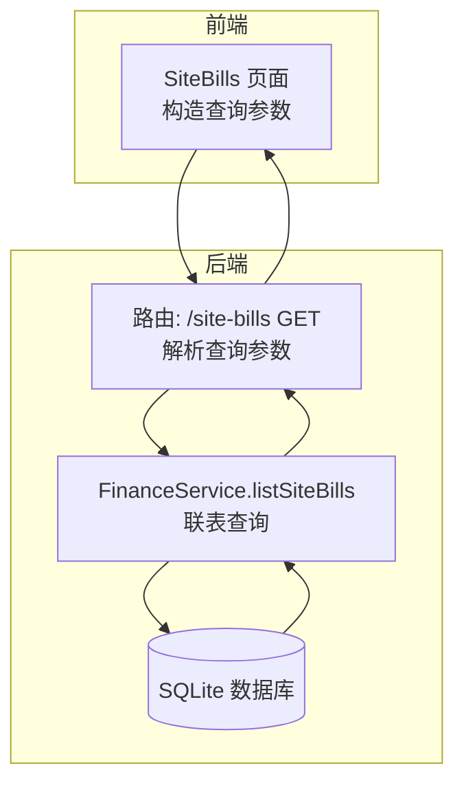
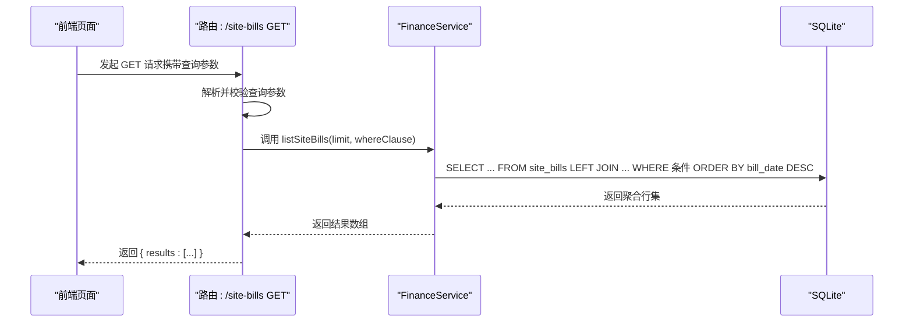
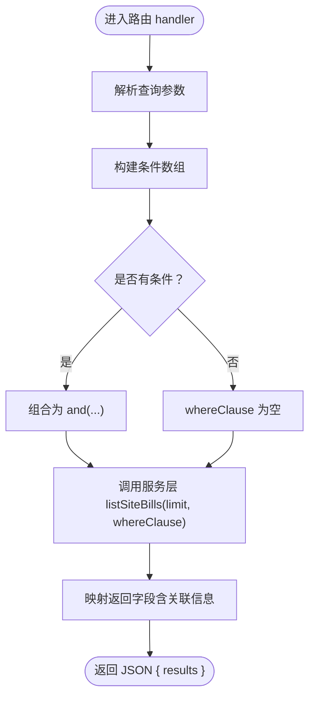
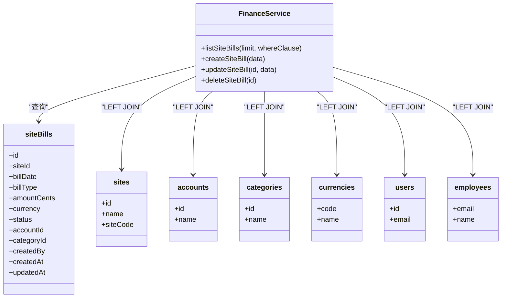
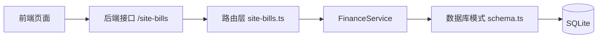

# 账单查询

<cite>
**本文引用的文件**
- [backend/src/routes/site-bills.ts](file://backend/src/routes/site-bills.ts)
- [backend/src/services/FinanceService.ts](file://backend/src/services/FinanceService.ts)
- [backend/src/db/schema.ts](file://backend/src/db/schema.ts)
- [backend/src/db/schema.sql](file://backend/src/db/schema.sql)
- [backend/src/schemas/common.schema.ts](file://backend/src/schemas/common.schema.ts)
- [backend/openapi.json](file://backend/openapi.json)
- [frontend/src/features/sites/pages/SiteBills.tsx](file://frontend/src/features/sites/pages/SiteBills.tsx)
- [backend/test/routes/site-bills.test.ts](file://backend/test/routes/site-bills.test.ts)
</cite>

## 目录
1. [简介](#简介)
2. [项目结构](#项目结构)
3. [核心组件](#核心组件)
4. [架构总览](#架构总览)
5. [详细组件分析](#详细组件分析)
6. [依赖关系分析](#依赖关系分析)
7. [性能考量](#性能考量)
8. [故障排查指南](#故障排查指南)
9. [结论](#结论)
10. [附录](#附录)

## 简介
本文件面向“账单查询API”的使用者与维护者，系统性说明站点账单列表查询接口的实现与使用方式。内容涵盖：
- 支持的查询条件：按站点、账单类型、状态、账单日期范围
- 排序规则：按到期日期升序排列
- 返回数据结构：包含账单基本信息与关联的站点、账户、类别、币种、创建人等扩展信息
- 查询性能优化建议：基于现有索引与查询逻辑的优化方向
- 实际使用示例：如何构造不同条件的查询请求

## 项目结构
账单查询功能由后端路由、服务层、数据库模式与前端页面共同组成，关键文件如下：
- 后端路由：负责接收HTTP请求、解析查询参数、调用服务层并返回JSON响应
- 服务层：封装数据库查询逻辑，执行联表查询并返回聚合后的结果
- 数据库模式：定义站点账单表及关联表结构
- 前端页面：提供筛选器与表格展示，并将筛选条件拼接为查询字符串发起请求

图表来源
- [backend/src/routes/site-bills.ts](file://backend/src/routes/site-bills.ts#L71-L138)
- [backend/src/services/FinanceService.ts](file://backend/src/services/FinanceService.ts#L532-L554)
- [backend/src/db/schema.ts](file://backend/src/db/schema.ts#L436-L452)

章节来源
- [backend/src/routes/site-bills.ts](file://backend/src/routes/site-bills.ts#L71-L138)
- [backend/src/services/FinanceService.ts](file://backend/src/services/FinanceService.ts#L532-L554)
- [backend/src/db/schema.ts](file://backend/src/db/schema.ts#L436-L452)

## 核心组件
- 路由层（站点账单）：定义查询接口、校验查询参数、组织where条件、调用服务层并映射返回字段
- 服务层（FinanceService）：执行联表查询，返回账单主表与关联表的聚合结果
- 数据库模式（site_bills）：定义账单主表字段与外键关系
- 查询Schema（common.schema）：统一约束查询参数格式（日期格式、UUID格式）

章节来源
- [backend/src/routes/site-bills.ts](file://backend/src/routes/site-bills.ts#L71-L138)
- [backend/src/services/FinanceService.ts](file://backend/src/services/FinanceService.ts#L532-L554)
- [backend/src/db/schema.ts](file://backend/src/db/schema.ts#L436-L452)
- [backend/src/schemas/common.schema.ts](file://backend/src/schemas/common.schema.ts#L202-L211)

## 架构总览
账单查询的端到端流程如下：
- 前端页面收集筛选条件（站点、账单类型、状态、日期范围），拼接为查询字符串
- 后端路由解析查询参数，构建where条件
- 服务层执行联表查询，按账单日期降序返回
- 前端渲染表格，展示账单与关联信息

图表来源
- [backend/src/routes/site-bills.ts](file://backend/src/routes/site-bills.ts#L71-L138)
- [backend/src/services/FinanceService.ts](file://backend/src/services/FinanceService.ts#L532-L554)

## 详细组件分析

### 路由层：账单列表查询
- 接口路径：/site-bills
- 方法：GET
- 查询参数：
  - siteId：站点ID（UUID）
  - startDate：开始日期（YYYY-MM-DD）
  - endDate：结束日期（YYYY-MM-DD）
  - billType：账单类型（字符串）
  - status：状态（字符串）
- where条件构建策略：
  - 若任一参数存在，则加入对应条件；最终通过逻辑与连接
- 排序规则：
  - 按账单日期降序（bill_date DESC），再按创建时间降序（createdAt DESC）
- 返回结构：
  - results：数组，每项包含账单基本信息与关联信息（站点名称/编码、账户名、类别名、币种名、创建人名等）

图表来源
- [backend/src/routes/site-bills.ts](file://backend/src/routes/site-bills.ts#L71-L138)

章节来源
- [backend/src/routes/site-bills.ts](file://backend/src/routes/site-bills.ts#L71-L138)
- [backend/openapi.json](file://backend/openapi.json#L8595-L8641)

### 服务层：listSiteBills
- 功能：联表查询站点账单，返回账单主表与多张关联表的聚合结果
- 关联表：
  - sites：站点名称、站点编码
  - accounts：账户名称
  - categories：类别名称
  - currencies：币种名称
  - users/employees：创建人姓名
- 排序：
  - 先按账单日期降序，再按创建时间降序
- 限制：
  - 默认返回最多200条记录

图表来源
- [backend/src/services/FinanceService.ts](file://backend/src/services/FinanceService.ts#L532-L554)
- [backend/src/db/schema.ts](file://backend/src/db/schema.ts#L436-L452)

章节来源
- [backend/src/services/FinanceService.ts](file://backend/src/services/FinanceService.ts#L532-L554)
- [backend/src/db/schema.ts](file://backend/src/db/schema.ts#L436-L452)

### 数据模型与索引
- 账单主表（site_bills）字段要点：
  - 主键：id
  - 外键：siteId（sites）、accountId（accounts）、categoryId（categories）
  - 时间字段：billDate、createdAt、updatedAt
  - 状态字段：status
- 当前数据库脚本未显式为账单表创建复合索引，但服务层查询会按账单日期与创建时间排序，且路由层支持按站点、账单类型、状态、账单日期范围进行过滤。

章节来源
- [backend/src/db/schema.ts](file://backend/src/db/schema.ts#L436-L452)
- [backend/src/db/schema.sql](file://backend/src/db/schema.sql#L425-L442)

### 查询参数与返回结构
- 查询参数（均非必填）：
  - siteId：站点ID（UUID）
  - startDate：开始日期（YYYY-MM-DD）
  - endDate：结束日期（YYYY-MM-DD）
  - billType：账单类型（字符串）
  - status：状态（字符串）
- 返回结构（results 数组中的对象）：
  - 账单基本信息：id、siteId、billDate、billType、amountCents、currency、description、accountId、categoryId、status、paymentDate、memo、createdBy、createdAt、updatedAt
  - 关联信息：siteName、siteCode、accountName、categoryName、currencyName、creatorName

章节来源
- [backend/src/schemas/common.schema.ts](file://backend/src/schemas/common.schema.ts#L202-L211)
- [backend/src/routes/site-bills.ts](file://backend/src/routes/site-bills.ts#L13-L35)
- [backend/src/routes/site-bills.ts](file://backend/src/routes/site-bills.ts#L71-L138)
- [backend/openapi.json](file://backend/openapi.json#L8595-L8641)

### 前端使用示例
- 前端页面通过URLSearchParams将筛选条件拼接到查询字符串中，然后调用后端接口获取数据
- 示例场景（仅说明参数含义，不展示具体代码）：
  - 仅按站点筛选：/site-bills?siteId=站点ID
  - 按日期范围筛选：/site-bills?startDate=YYYY-MM-DD&endDate=YYYY-MM-DD
  - 按类型与状态筛选：/site-bills?billType=income&status=pending
  - 组合条件：/site-bills?siteId=站点ID&startDate=YYYY-MM-DD&endDate=YYYY-MM-DD&billType=expense&status=paid

章节来源
- [frontend/src/features/sites/pages/SiteBills.tsx](file://frontend/src/features/sites/pages/SiteBills.tsx#L45-L62)
- [backend/test/routes/site-bills.test.ts](file://backend/test/routes/site-bills.test.ts#L90-L120)

## 依赖关系分析
- 路由依赖服务层：路由层通过c.var.services.finance调用服务方法
- 服务层依赖数据库：使用Drizzle ORM对SQLite进行查询
- 数据库依赖模式：服务层联表查询依赖schema.ts中定义的表关系
- 前端依赖后端接口：前端页面通过API客户端调用后端接口

图表来源
- [backend/src/routes/site-bills.ts](file://backend/src/routes/site-bills.ts#L71-L138)
- [backend/src/services/FinanceService.ts](file://backend/src/services/FinanceService.ts#L532-L554)
- [backend/src/db/schema.ts](file://backend/src/db/schema.ts#L436-L452)

章节来源
- [backend/src/routes/site-bills.ts](file://backend/src/routes/site-bills.ts#L71-L138)
- [backend/src/services/FinanceService.ts](file://backend/src/services/FinanceService.ts#L532-L554)
- [backend/src/db/schema.ts](file://backend/src/db/schema.ts#L436-L452)

## 性能考量
- 现状分析：
  - 服务层按账单日期降序返回，默认限制200条记录
  - 路由层支持按站点、账单类型、状态、账单日期范围过滤
  - 数据库脚本未显式为账单表创建复合索引
- 可行的优化建议（基于现有代码与表结构）：
  - 为账单表增加复合索引以覆盖常用查询条件，例如：
    - idx_site_bills_site_date_type_status：site_id + bill_date + bill_type + status
    - idx_site_bills_date_created：bill_date + created_at
  - 在高频查询场景下，考虑分页参数（当前路由层未暴露分页Schema，服务层默认limit=200）
- 注意事项：
  - 索引会提升查询速度，但可能影响写入性能，应结合实际业务量评估
  - 若未来查询条件增多，建议在迁移脚本中统一添加索引

章节来源
- [backend/src/services/FinanceService.ts](file://backend/src/services/FinanceService.ts#L532-L554)
- [backend/src/routes/site-bills.ts](file://backend/src/routes/site-bills.ts#L71-L138)
- [backend/src/db/schema.sql](file://backend/src/db/schema.sql#L425-L442)

## 故障排查指南
- 常见问题与定位：
  - 参数格式错误：确保日期格式为YYYY-MM-DD，ID为合法UUID
  - 无数据返回：检查过滤条件是否过于严格；尝试放宽条件或清空筛选
  - 排序不符合预期：当前按账单日期降序返回，若需升序，请在前端或后端调整排序逻辑
- 测试参考：
  - 单元测试展示了GET请求返回results数组的结构与字段映射
  - 前端页面展示了如何将筛选条件拼接为查询字符串并发起请求

章节来源
- [backend/test/routes/site-bills.test.ts](file://backend/test/routes/site-bills.test.ts#L90-L120)
- [frontend/src/features/sites/pages/SiteBills.tsx](file://frontend/src/features/sites/pages/SiteBills.tsx#L45-L62)

## 结论
- 账单查询接口已完整实现，支持按站点、账单类型、状态、账单日期范围进行过滤
- 返回结构包含账单基本信息与关联的站点、账户、类别、币种、创建人等信息
- 排序规则为账单日期降序；若业务需要升序，请在前端或后端调整排序逻辑
- 建议在数据库层面增加复合索引以提升查询性能，并根据业务量评估写入性能影响

## 附录

### API定义与示例
- 接口：GET /site-bills
- 查询参数：
  - siteId：站点ID（UUID）
  - startDate：开始日期（YYYY-MM-DD）
  - endDate：结束日期（YYYY-MM-DD）
  - billType：账单类型（字符串）
  - status：状态（字符串）
- 返回结构：results数组，每项包含账单基本信息与关联信息
- 使用示例（仅说明参数，不展示具体代码）：
  - /site-bills?siteId=站点ID
  - /site-bills?startDate=YYYY-MM-DD&endDate=YYYY-MM-DD
  - /site-bills?billType=income&status=pending
  - /site-bills?siteId=站点ID&startDate=YYYY-MM-DD&endDate=YYYY-MM-DD&billType=expense&status=paid

章节来源
- [backend/src/schemas/common.schema.ts](file://backend/src/schemas/common.schema.ts#L202-L211)
- [backend/src/routes/site-bills.ts](file://backend/src/routes/site-bills.ts#L71-L138)
- [backend/openapi.json](file://backend/openapi.json#L8595-L8641)
- [frontend/src/features/sites/pages/SiteBills.tsx](file://frontend/src/features/sites/pages/SiteBills.tsx#L45-L62)