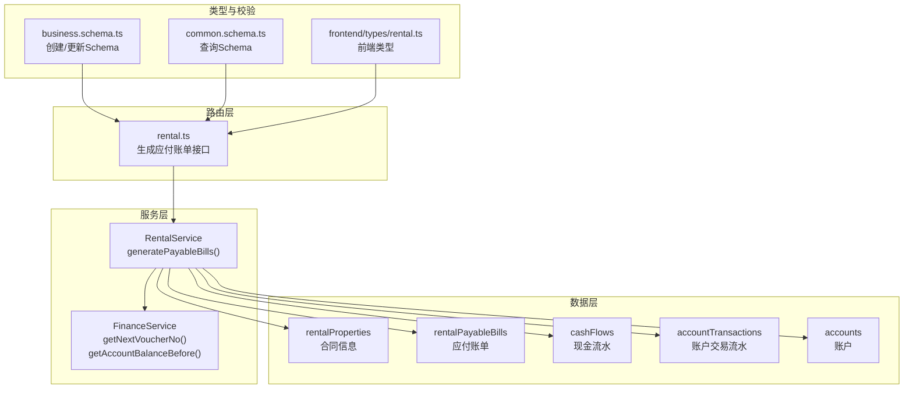
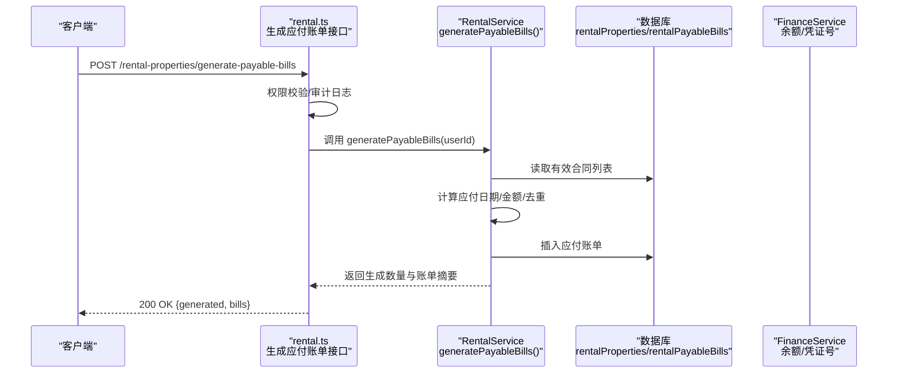
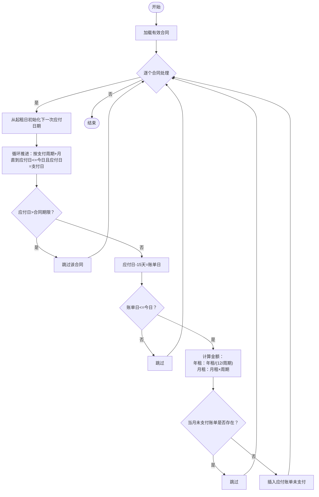
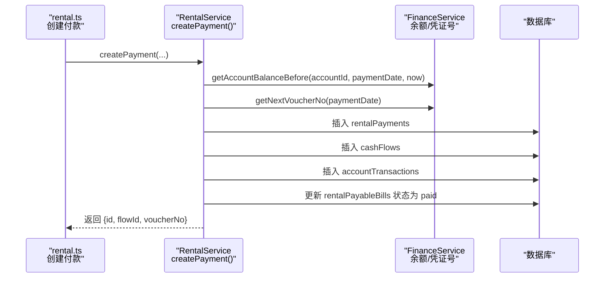
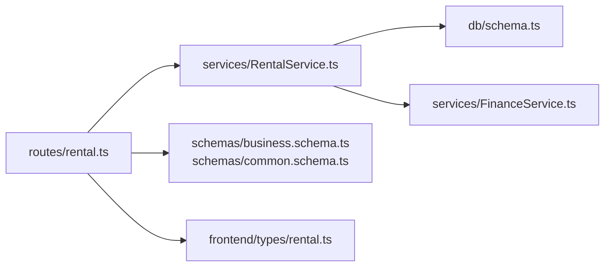

# 账单生成

<cite>
**本文引用的文件**
- [backend/src/routes/rental.ts](file://backend/src/routes/rental.ts)
- [backend/src/services/RentalService.ts](file://backend/src/services/RentalService.ts)
- [backend/src/services/FinanceService.ts](file://backend/src/services/FinanceService.ts)
- [backend/src/db/schema.ts](file://backend/src/db/schema.ts)
- [backend/src/schemas/business.schema.ts](file://backend/src/schemas/business.schema.ts)
- [backend/src/schemas/common.schema.ts](file://backend/src/schemas/common.schema.ts)
- [backend/test/routes/rental.test.ts](file://backend/test/routes/rental.test.ts)
- [frontend/src/types/rental.ts](file://frontend/src/types/rental.ts)
</cite>

## 目录
1. [简介](#简介)
2. [项目结构](#项目结构)
3. [核心组件](#核心组件)
4. [架构总览](#架构总览)
5. [详细组件分析](#详细组件分析)
6. [依赖关系分析](#依赖关系分析)
7. [性能考量](#性能考量)
8. [故障排查指南](#故障排查指南)
9. [结论](#结论)
10. [附录](#附录)

## 简介
本文件面向“账单生成API”的实现与使用，聚焦于“根据租赁合同自动生成应付账单”的完整流程。内容涵盖：
- 应付账单的触发条件与生成时机
- 根据租赁开始日期、支付周期与支付日推导应付日期的算法
- 月租与年租两种计费模式下的金额计算规则
- 生成前的验证逻辑（合同有效性、重复账单检查等）
- 生成后的财务处理流程（账户余额更新、创建财务流水、关联已生成账单状态）
- 实际代码示例的路径定位，便于开发者快速定位实现细节

## 项目结构
围绕“账单生成”功能，涉及以下关键模块：
- 路由层：暴露生成应付账单的HTTP接口
- 服务层：实现账单生成算法、校验与财务处理
- 数据层：定义账单、合同、账户、流水等核心表结构
- 类型与校验：前端类型定义与后端OpenAPI Schema约束
- 测试：路由层对账单生成接口的端到端覆盖

图表来源
- [backend/src/routes/rental.ts](file://backend/src/routes/rental.ts#L572-L606)
- [backend/src/services/RentalService.ts](file://backend/src/services/RentalService.ts#L490-L575)
- [backend/src/services/FinanceService.ts](file://backend/src/services/FinanceService.ts#L28-L69)
- [backend/src/db/schema.ts](file://backend/src/db/schema.ts#L534-L631)
- [backend/src/schemas/business.schema.ts](file://backend/src/schemas/business.schema.ts#L80-L116)
- [backend/src/schemas/common.schema.ts](file://backend/src/schemas/common.schema.ts#L221-L229)
- [frontend/src/types/rental.ts](file://frontend/src/types/rental.ts#L1-L143)

章节来源
- [backend/src/routes/rental.ts](file://backend/src/routes/rental.ts#L572-L606)
- [backend/src/services/RentalService.ts](file://backend/src/services/RentalService.ts#L490-L575)
- [backend/src/db/schema.ts](file://backend/src/db/schema.ts#L534-L631)

## 核心组件
- 路由接口：提供“生成应付账单”的POST接口，权限控制与审计日志记录
- 服务算法：遍历有效合同，按周期与支付日推导应付日期，计算金额并去重，插入应付账单
- 财务处理：通过FinanceService计算账户余额快照，创建现金流水与账户交易流水，并将对应应付账单标记为已支付

章节来源
- [backend/src/routes/rental.ts](file://backend/src/routes/rental.ts#L572-L606)
- [backend/src/services/RentalService.ts](file://backend/src/services/RentalService.ts#L490-L575)
- [backend/src/services/FinanceService.ts](file://backend/src/services/FinanceService.ts#L28-L69)

## 架构总览
账单生成的端到端调用序列如下：

图表来源
- [backend/src/routes/rental.ts](file://backend/src/routes/rental.ts#L572-L606)
- [backend/src/services/RentalService.ts](file://backend/src/services/RentalService.ts#L490-L575)

## 详细组件分析

### 1) 生成应付账单接口（路由层）
- 接口路径：POST /rental-properties/generate-payable-bills
- 权限要求：资产-租赁-创建
- 审计日志：记录生成数量与涉及的物业编码
- 返回体：包含生成数量与账单摘要数组

章节来源
- [backend/src/routes/rental.ts](file://backend/src/routes/rental.ts#L572-L606)

### 2) 账单生成算法（服务层）
- 输入：系统当前时间、合同集合（状态为有效且有起租日期）
- 输出：生成数量与账单摘要
- 关键步骤：
  - 遍历有效合同
  - 从起租日期开始，按支付周期推进，直到找到“应付日期”落在当前日期之前且“应付日期”的日数等于“支付日”
  - 若应付日期超过合同期限则跳过
  - 生成日期为应付日期前15天，若仍晚于今天则跳过
  - 金额计算：
    - 年租：按“年租金额 ÷ (12 / 支付周期月数)”四舍五入
    - 月租：按“月租金额 × 支付周期月数”四舍五入
  - 去重：若当月未支付的应付账单已存在则跳过
  - 写入：插入应付账单记录，状态为未支付

图表来源
- [backend/src/services/RentalService.ts](file://backend/src/services/RentalService.ts#L490-L575)

章节来源
- [backend/src/services/RentalService.ts](file://backend/src/services/RentalService.ts#L490-L575)

### 3) 金额计算规则（月租 vs 年租）
- 年租：amount = round(yearlyRentCents / (12 / paymentPeriodMonths))
- 月租：amount = round(monthlyRentCents × paymentPeriodMonths)
- 采用四舍五入保证金额精度

章节来源
- [backend/src/services/RentalService.ts](file://backend/src/services/RentalService.ts#L531-L536)

### 4) 生成前验证逻辑
- 合同有效性：
  - 状态为“active”
  - 存在有效的 leaseStartDate
- 重复账单检查：
  - 按 propertyId、year、month、status='unpaid' 查询是否存在未支付账单，存在则跳过
- 金额与周期一致性：
  - 通过业务Schema确保年租/月租字段与模式一致（rentType与对应金额字段）

章节来源
- [backend/src/services/RentalService.ts](file://backend/src/services/RentalService.ts#L495-L545)
- [backend/src/schemas/business.schema.ts](file://backend/src/schemas/business.schema.ts#L80-L116)

### 5) 生成后的财务处理流程
- 当用户通过“创建付款记录”完成支付时，系统执行事务：
  - 计算账户余额快照（getAccountBalanceBefore）
  - 生成凭证号（getNextVoucherNo）
  - 写入现金流水（cashFlows）
  - 写入账户交易流水（accountTransactions）
  - 将对应应付账单标记为“paid”，并回写 paidDate 与 paidPaymentId

图表来源
- [backend/src/services/RentalService.ts](file://backend/src/services/RentalService.ts#L238-L350)
- [backend/src/services/FinanceService.ts](file://backend/src/services/FinanceService.ts#L28-L69)

章节来源
- [backend/src/services/RentalService.ts](file://backend/src/services/RentalService.ts#L238-L350)
- [backend/src/services/FinanceService.ts](file://backend/src/services/FinanceService.ts#L28-L69)

### 6) 数据模型与字段说明
- 合同表（rentalProperties）：包含 rentType、monthlyRentCents、yearlyRentCents、paymentPeriodMonths、paymentDay、leaseStartDate、leaseEndDate、currency、status 等
- 应付账单表（rentalPayableBills）：包含 billDate、dueDate、year、month、amountCents、currency、status、paidDate、paidPaymentId 等
- 现金流水（cashFlows）与账户交易（accountTransactions）用于财务流水与余额更新
- 账户（accounts）用于余额计算与凭证号生成

章节来源
- [backend/src/db/schema.ts](file://backend/src/db/schema.ts#L534-L631)

### 7) 前端类型与校验
- 前端类型定义了应付账单的字段结构，便于UI展示与交互
- 后端OpenAPI Schema对创建/更新接口进行参数校验，确保年租/月租与金额字段的一致性

章节来源
- [frontend/src/types/rental.ts](file://frontend/src/types/rental.ts#L90-L110)
- [backend/src/schemas/business.schema.ts](file://backend/src/schemas/business.schema.ts#L80-L116)
- [backend/src/schemas/common.schema.ts](file://backend/src/schemas/common.schema.ts#L221-L229)

## 依赖关系分析
- 路由层依赖服务层：生成接口委托给 RentalService 的 generatePayableBills
- 服务层依赖数据层：读取合同、写入应付账单、读写账户与流水
- 服务层依赖财务服务：余额快照与凭证号生成
- 类型与校验：前后端类型与OpenAPI Schema共同保障数据一致性

图表来源
- [backend/src/routes/rental.ts](file://backend/src/routes/rental.ts#L572-L606)
- [backend/src/services/RentalService.ts](file://backend/src/services/RentalService.ts#L490-L575)
- [backend/src/services/FinanceService.ts](file://backend/src/services/FinanceService.ts#L28-L69)
- [backend/src/db/schema.ts](file://backend/src/db/schema.ts#L534-L631)
- [backend/src/schemas/business.schema.ts](file://backend/src/schemas/business.schema.ts#L80-L116)
- [backend/src/schemas/common.schema.ts](file://backend/src/schemas/common.schema.ts#L221-L229)
- [frontend/src/types/rental.ts](file://frontend/src/types/rental.ts#L90-L110)

章节来源
- [backend/src/routes/rental.ts](file://backend/src/routes/rental.ts#L572-L606)
- [backend/src/services/RentalService.ts](file://backend/src/services/RentalService.ts#L490-L575)
- [backend/src/services/FinanceService.ts](file://backend/src/services/FinanceService.ts#L28-L69)
- [backend/src/db/schema.ts](file://backend/src/db/schema.ts#L534-L631)

## 性能考量
- 生成账单时对合同列表进行顺序扫描，建议在合同数量较大时：
  - 在数据库层面增加索引：rentalProperties(status, leaseStartDate)
  - 对应付日期计算使用纯SQL表达式（如需扩展）减少应用层循环成本
- 生成账单与创建付款均使用数据库事务，确保一致性但可能带来锁竞争，建议：
  - 控制批量生成频率，避免高频触发
  - 将“生成应付账单”作为定时任务或后台作业执行
- 余额计算依赖最近一笔交易快照，建议：
  - 保持账户交易流水有序（按日期与创建时间排序），避免全表扫描

[本节为通用指导，不直接分析具体文件]

## 故障排查指南
- 生成结果为0：
  - 检查合同状态是否为“active”且存在 leaseStartDate
  - 确认应付日期推进后仍早于或等于今日，且应付日等于支付日
  - 排查当月是否已有未支付账单
- 金额异常：
  - 年租/月租模式与对应金额字段是否匹配（业务Schema已校验）
  - 支付周期月数是否为正数
- 付款后应付账单未更新为已支付：
  - 检查 createPayment 是否正确传入 propertyId、year、month
  - 确认账单状态为 unpaid 且未被并发修改
- 凭证号或余额不正确：
  - 确认 getNextVoucherNo 与 getAccountBalanceBefore 的调用顺序与参数
  - 核对业务日期与创建时间戳的先后关系

章节来源
- [backend/src/services/RentalService.ts](file://backend/src/services/RentalService.ts#L238-L350)
- [backend/src/services/RentalService.ts](file://backend/src/services/RentalService.ts#L490-L575)
- [backend/src/services/FinanceService.ts](file://backend/src/services/FinanceService.ts#L28-L69)

## 结论
账单生成API通过“合同-周期-支付日”三要素自动推导应付日期，并结合月租/年租两种计费模式计算应付金额。系统在生成前进行合同有效性与重复账单检查，在生成后通过事务化流程完成财务流水与应付账单状态更新，确保数据一致性与可追溯性。建议配合定时任务与索引优化，提升大规模场景下的稳定性与性能。

[本节为总结性内容，不直接分析具体文件]

## 附录

### A. 代码示例路径定位（不含具体代码内容）
- 生成应付账单接口定义与审计日志
  - [backend/src/routes/rental.ts](file://backend/src/routes/rental.ts#L572-L606)
- 账单生成算法（应付日期推进、金额计算、去重）
  - [backend/src/services/RentalService.ts](file://backend/src/services/RentalService.ts#L490-L575)
- 付款创建与财务处理（余额快照、凭证号、流水与账单状态更新）
  - [backend/src/services/RentalService.ts](file://backend/src/services/RentalService.ts#L238-L350)
  - [backend/src/services/FinanceService.ts](file://backend/src/services/FinanceService.ts#L28-L69)
- 数据表结构（合同、应付账单、流水、账户）
  - [backend/src/db/schema.ts](file://backend/src/db/schema.ts#L534-L631)
- 参数校验与前端类型
  - [backend/src/schemas/business.schema.ts](file://backend/src/schemas/business.schema.ts#L80-L116)
  - [backend/src/schemas/common.schema.ts](file://backend/src/schemas/common.schema.ts#L221-L229)
  - [frontend/src/types/rental.ts](file://frontend/src/types/rental.ts#L90-L110)
- 路由层单元测试（生成接口）
  - [backend/test/routes/rental.test.ts](file://backend/test/routes/rental.test.ts#L241-L253)