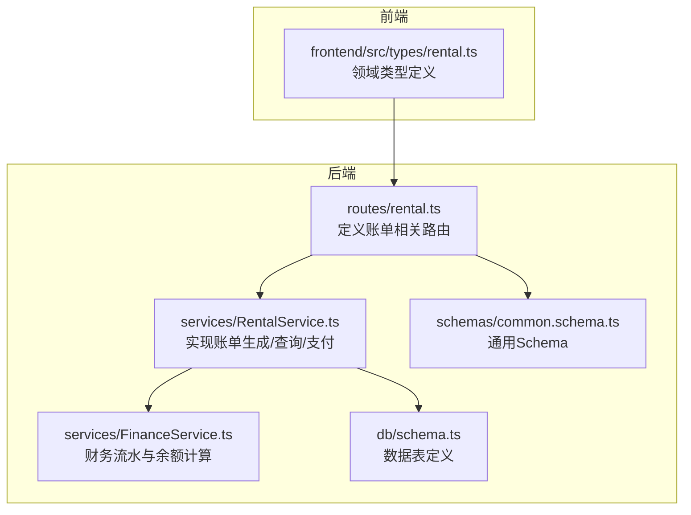
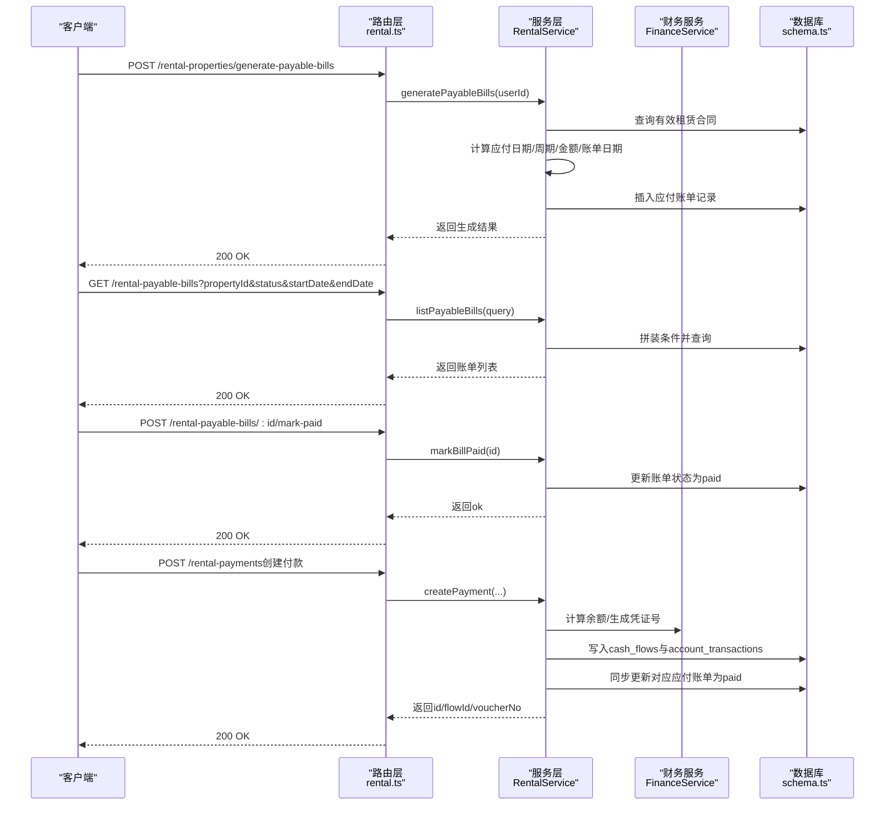
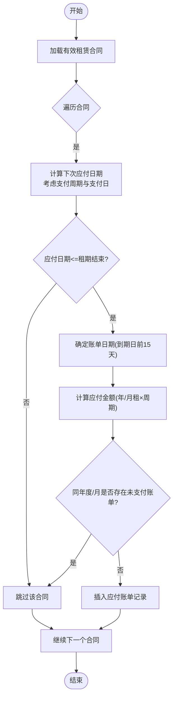
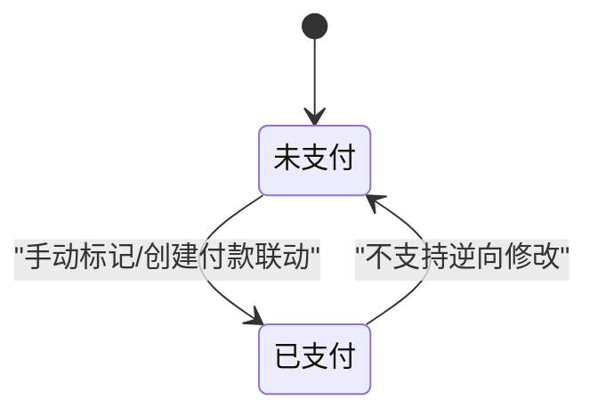
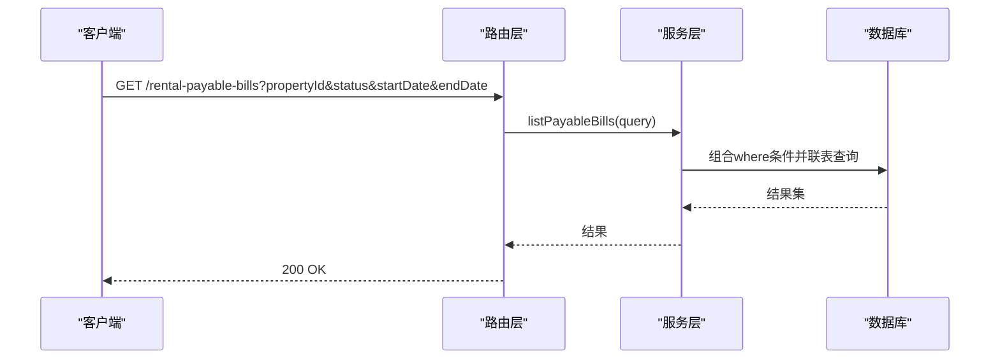
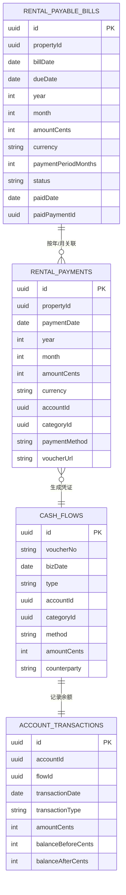
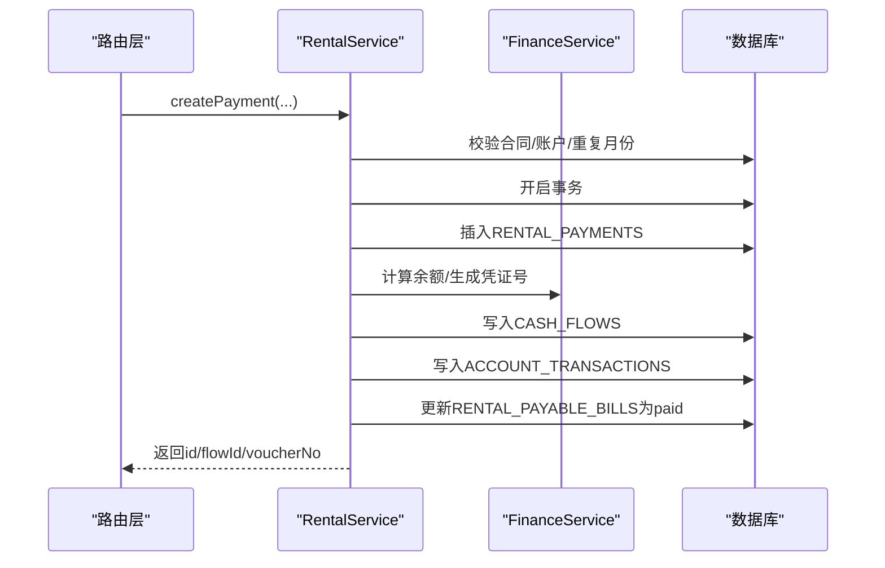
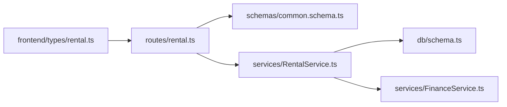

# 账单管理API

<cite>
**本文引用的文件**
- [backend/src/routes/rental.ts](file://backend/src/routes/rental.ts)
- [backend/src/services/RentalService.ts](file://backend/src/services/RentalService.ts)
- [backend/src/db/schema.ts](file://backend/src/db/schema.ts)
- [backend/src/schemas/common.schema.ts](file://backend/src/schemas/common.schema.ts)
- [frontend/src/types/rental.ts](file://frontend/src/types/rental.ts)
- [backend/test/routes/rental.test.ts](file://backend/test/routes/rental.test.ts)
- [backend/src/services/FinanceService.ts](file://backend/src/services/FinanceService.ts)
</cite>

## 目录
1. [简介](#简介)
2. [项目结构](#项目结构)
3. [核心组件](#核心组件)
4. [架构总览](#架构总览)
5. [详细组件分析](#详细组件分析)
6. [依赖关系分析](#依赖关系分析)
7. [性能考量](#性能考量)
8. [故障排查指南](#故障排查指南)
9. [结论](#结论)
10. [附录](#附录)

## 简介
本文件面向“账单管理API”，聚焦于租赁应付账单的生成、查询与状态更新。内容覆盖：
- 应付账单的自动生成逻辑（基于租赁合同自动计算应付日期、周期、金额与账单日期）
- 账单状态机（未支付、已支付）与状态变更机制
- 列表查询接口（按房产、状态、日期范围过滤）
- 账单与付款记录的关联关系
- 账单支付后的财务处理流程（现金流与会计分录）

## 项目结构
后端采用OpenAPI路由+服务层的分层设计，账单相关能力集中在租赁模块中：
- 路由层：定义HTTP接口与请求/响应Schema
- 服务层：封装业务逻辑（生成账单、查询账单、标记支付）
- 数据层：Drizzle ORM映射SQLite表结构
- 类型定义：前端共享的领域模型

图表来源
- [backend/src/routes/rental.ts](file://backend/src/routes/rental.ts#L572-L677)
- [backend/src/services/RentalService.ts](file://backend/src/services/RentalService.ts#L488-L616)
- [backend/src/services/FinanceService.ts](file://backend/src/services/FinanceService.ts#L1-L128)
- [backend/src/db/schema.ts](file://backend/src/db/schema.ts#L534-L631)
- [backend/src/schemas/common.schema.ts](file://backend/src/schemas/common.schema.ts#L221-L230)
- [frontend/src/types/rental.ts](file://frontend/src/types/rental.ts#L90-L110)

章节来源
- [backend/src/routes/rental.ts](file://backend/src/routes/rental.ts#L572-L677)
- [backend/src/services/RentalService.ts](file://backend/src/services/RentalService.ts#L488-L616)
- [backend/src/db/schema.ts](file://backend/src/db/schema.ts#L534-L631)
- [backend/src/schemas/common.schema.ts](file://backend/src/schemas/common.schema.ts#L221-L230)
- [frontend/src/types/rental.ts](file://frontend/src/types/rental.ts#L90-L110)

## 核心组件
- 账单生成接口：POST /rental-properties/generate-payable-bills
- 账单列表接口：GET /rental-payable-bills（支持按房产、状态、到期日期范围过滤）
- 账单支付标记接口：POST /rental-payable-bills/:id/mark-paid
- 财务处理：创建付款记录时，同时写入现金流与会计分录，并联动更新应付账单状态为“已支付”

章节来源
- [backend/src/routes/rental.ts](file://backend/src/routes/rental.ts#L572-L677)
- [backend/src/services/RentalService.ts](file://backend/src/services/RentalService.ts#L238-L350)
- [backend/src/services/RentalService.ts](file://backend/src/services/RentalService.ts#L488-L616)
- [backend/src/db/schema.ts](file://backend/src/db/schema.ts#L534-L631)

## 架构总览
账单管理API的调用链路如下：

图表来源
- [backend/src/routes/rental.ts](file://backend/src/routes/rental.ts#L572-L677)
- [backend/src/services/RentalService.ts](file://backend/src/services/RentalService.ts#L238-L350)
- [backend/src/services/RentalService.ts](file://backend/src/services/RentalService.ts#L488-L616)
- [backend/src/services/FinanceService.ts](file://backend/src/services/FinanceService.ts#L1-L128)
- [backend/src/db/schema.ts](file://backend/src/db/schema.ts#L534-L631)

## 详细组件分析

### 1) 账单生成逻辑
- 触发方式：管理员或具备权限用户调用“生成应付账单”接口
- 生成规则：
  - 仅对状态为“启用”的租赁合同生效
  - 基于租期起止、支付周期与支付日，推导下一次应付日期
  - 账单日期通常在应付日期前若干天（例如15天）
  - 金额按“年租/月租”与支付周期折算
  - 若当期应付账单已存在且未支付，则跳过重复生成
- 存储字段：包含账单日期、到期日、年、月、金额、币种、支付周期、状态等

图表来源
- [backend/src/services/RentalService.ts](file://backend/src/services/RentalService.ts#L490-L575)

章节来源
- [backend/src/services/RentalService.ts](file://backend/src/services/RentalService.ts#L490-L575)

### 2) 账单状态机与状态变更
- 状态枚举：未支付、已支付
- 变更入口：
  - 手动标记：POST /rental-payable-bills/:id/mark-paid
  - 自动联动：创建付款记录时，系统会同步将对应年/月/未支付的应付账单标记为已支付
- 并发保护：若账单不存在或已为“已支付”，接口返回错误

图表来源
- [backend/src/services/RentalService.ts](file://backend/src/services/RentalService.ts#L603-L615)
- [backend/src/services/RentalService.ts](file://backend/src/services/RentalService.ts#L336-L347)

章节来源
- [backend/src/services/RentalService.ts](file://backend/src/services/RentalService.ts#L603-L615)
- [backend/src/services/RentalService.ts](file://backend/src/services/RentalService.ts#L336-L347)

### 3) 账单列表查询接口
- 接口：GET /rental-payable-bills
- 支持过滤：
  - 房产ID（propertyId）
  - 状态（status）
  - 到期日期范围（startDate/endDate）
- 返回字段：账单主体信息及关联的房产编码/名称/类型/房东名称

图表来源
- [backend/src/routes/rental.ts](file://backend/src/routes/rental.ts#L608-L648)
- [backend/src/services/RentalService.ts](file://backend/src/services/RentalService.ts#L577-L601)
- [backend/src/schemas/common.schema.ts](file://backend/src/schemas/common.schema.ts#L221-L230)

章节来源
- [backend/src/routes/rental.ts](file://backend/src/routes/rental.ts#L608-L648)
- [backend/src/services/RentalService.ts](file://backend/src/services/RentalService.ts#L577-L601)
- [backend/src/schemas/common.schema.ts](file://backend/src/schemas/common.schema.ts#L221-L230)

### 4) 账单与付款记录的关联关系
- 关联键：同一房产、年、月、且状态为“未支付”的应付账单
- 创建付款记录时，系统会：
  - 写入cash_flows（凭证号、摘要、部门、对手方等）
  - 写入account_transactions（余额快照）
  - 将对应应付账单的状态更新为“已支付”，并记录paidDate与paidPaymentId

图表来源
- [backend/src/db/schema.ts](file://backend/src/db/schema.ts#L534-L631)
- [backend/src/services/RentalService.ts](file://backend/src/services/RentalService.ts#L238-L350)
- [backend/src/services/FinanceService.ts](file://backend/src/services/FinanceService.ts#L1-L128)

章节来源
- [backend/src/db/schema.ts](file://backend/src/db/schema.ts#L534-L631)
- [backend/src/services/RentalService.ts](file://backend/src/services/RentalService.ts#L238-L350)
- [backend/src/services/FinanceService.ts](file://backend/src/services/FinanceService.ts#L1-L128)

### 5) 财务处理流程（创建付款记录）
- 输入：propertyId、paymentDate、year、month、amountCents、currency、accountId、categoryId、paymentMethod、memo
- 处理步骤：
  1) 校验合同与账户有效性
  2) 事务内写入RENTAL_PAYMENTS
  3) 生成凭证号（按业务日期统计序号）
  4) 使用FinanceService计算余额并写入CASH_FLOWS与ACCOUNT_TRANSACTIONS
  5) 同步更新RENTAL_PAYABLE_BILLS为“已支付”
- 输出：返回paymentId、flowId、voucherNo

图表来源
- [backend/src/routes/rental.ts](file://backend/src/routes/rental.ts#L436-L491)
- [backend/src/services/RentalService.ts](file://backend/src/services/RentalService.ts#L238-L350)
- [backend/src/services/FinanceService.ts](file://backend/src/services/FinanceService.ts#L1-L128)

章节来源
- [backend/src/routes/rental.ts](file://backend/src/routes/rental.ts#L436-L491)
- [backend/src/services/RentalService.ts](file://backend/src/services/RentalService.ts#L238-L350)
- [backend/src/services/FinanceService.ts](file://backend/src/services/FinanceService.ts#L1-L128)

### 6) 前端类型与字段说明
- 账单类型：包含id、propertyId、billDate、dueDate、year、month、amountCents、currency、status、paid_date、paid_payment_id、memo等
- 状态枚举：unpaid、paid、cancelled（前端类型定义）

章节来源
- [frontend/src/types/rental.ts](file://frontend/src/types/rental.ts#L90-L110)

## 依赖关系分析
- 路由层依赖通用Schema进行输入校验
- 服务层依赖数据库Schema进行CRUD操作
- 服务层在创建付款时依赖FinanceService进行余额与凭证号计算
- 前端类型与后端Schema保持一致，便于跨端协作

图表来源
- [backend/src/routes/rental.ts](file://backend/src/routes/rental.ts#L572-L677)
- [backend/src/schemas/common.schema.ts](file://backend/src/schemas/common.schema.ts#L221-L230)
- [backend/src/services/RentalService.ts](file://backend/src/services/RentalService.ts#L238-L350)
- [backend/src/db/schema.ts](file://backend/src/db/schema.ts#L534-L631)
- [frontend/src/types/rental.ts](file://frontend/src/types/rental.ts#L90-L110)

章节来源
- [backend/src/routes/rental.ts](file://backend/src/routes/rental.ts#L572-L677)
- [backend/src/schemas/common.schema.ts](file://backend/src/schemas/common.schema.ts#L221-L230)
- [backend/src/services/RentalService.ts](file://backend/src/services/RentalService.ts#L238-L350)
- [backend/src/db/schema.ts](file://backend/src/db/schema.ts#L534-L631)
- [frontend/src/types/rental.ts](file://frontend/src/types/rental.ts#L90-L110)

## 性能考量
- 生成账单：按合同循环计算，建议在定时任务中执行，避免高并发触发
- 列表查询：使用联表与条件拼装，建议在相关列上建立索引（如propertyId/status/dueDate）
- 事务一致性：创建付款与更新账单在同一事务内完成，确保强一致
- 余额计算：FinanceService通过时间戳与日期排序定位最近交易，避免全表扫描

[本节提供一般性指导，无需特定文件来源]

## 故障排查指南
- 生成账单失败
  - 检查合同是否处于“启用”状态且有起止日期
  - 确认支付周期与支付日配置合理
  - 查看是否已有未支付的同年度/月账单导致跳过
- 标记账单为已支付失败
  - 账单不存在或已为“已支付”状态
- 创建付款失败
  - 合同或账户不存在/停用
  - 当月已存在付款记录
  - 账户币种与付款币种不匹配
- 财务流水异常
  - 检查凭证号生成逻辑与余额快照是否一致
  - 确认cash_flows与account_transactions是否成对写入

章节来源
- [backend/src/services/RentalService.ts](file://backend/src/services/RentalService.ts#L238-L350)
- [backend/src/services/RentalService.ts](file://backend/src/services/RentalService.ts#L490-L575)
- [backend/src/services/RentalService.ts](file://backend/src/services/RentalService.ts#L603-L615)

## 结论
账单管理API围绕“生成—查询—支付—财务入账”闭环构建，具备清晰的状态机与严格的业务约束。通过事务保证账单与付款的一致性，并借助财务服务完成凭证与余额的准确记录。建议在生产环境配合定时任务与索引优化，确保生成效率与查询性能。

[本节为总结性内容，无需特定文件来源]

## 附录

### A. 接口清单与字段说明
- 生成应付账单
  - 方法：POST
  - 路径：/rental-properties/generate-payable-bills
  - 权限：具备租赁管理创建权限
  - 返回：generated（生成数量）、bills（生成明细）
- 获取应付账单列表
  - 方法：GET
  - 路径：/rental-payable-bills
  - 查询参数：propertyId、status、startDate、endDate
  - 返回：results（账单+房产信息）
- 标记账单为已支付
  - 方法：POST
  - 路径：/rental-payable-bills/:id/mark-paid
  - 权限：具备租赁管理更新权限
  - 返回：ok
- 创建付款记录（与账单关联）
  - 方法：POST
  - 路径：/rental-payments
  - 返回：id、flowId、voucherNo

章节来源
- [backend/src/routes/rental.ts](file://backend/src/routes/rental.ts#L572-L677)
- [backend/src/schemas/common.schema.ts](file://backend/src/schemas/common.schema.ts#L221-L230)
- [backend/test/routes/rental.test.ts](file://backend/test/routes/rental.test.ts#L241-L266)

### B. 数据模型要点
- 应付账单表：包含账单日期、到期日、年、月、金额、币种、支付周期、状态、支付日期与付款记录ID等
- 付款记录表：包含付款日期、年、月、金额、币种、账户、分类、付款方式、凭证URL等
- 财务流水表：凭证号、业务日期、类型、账户、分类、方法、金额、摘要、附件URL等
- 会计分录表：账户、流水ID、交易日期、交易类型、金额、余额前后值等

章节来源
- [backend/src/db/schema.ts](file://backend/src/db/schema.ts#L534-L631)