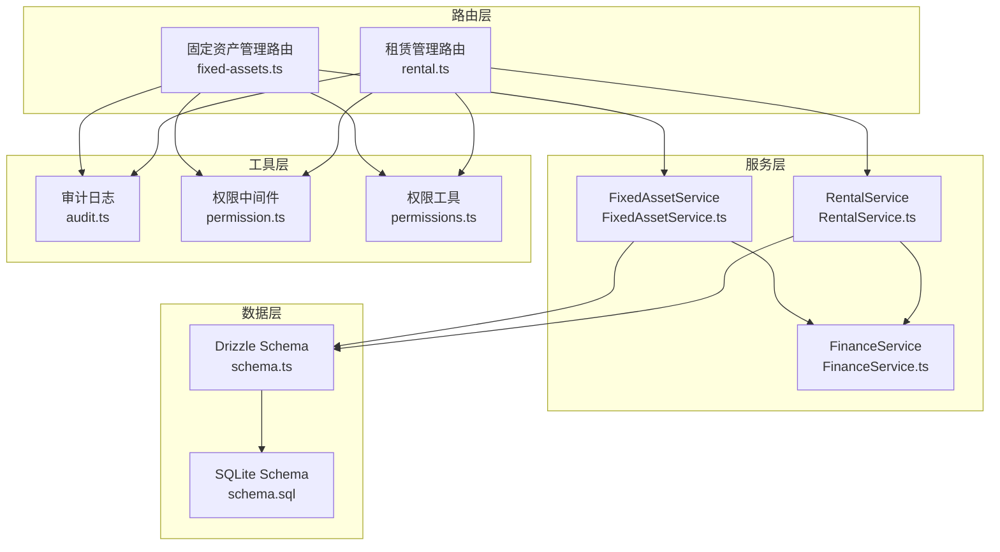
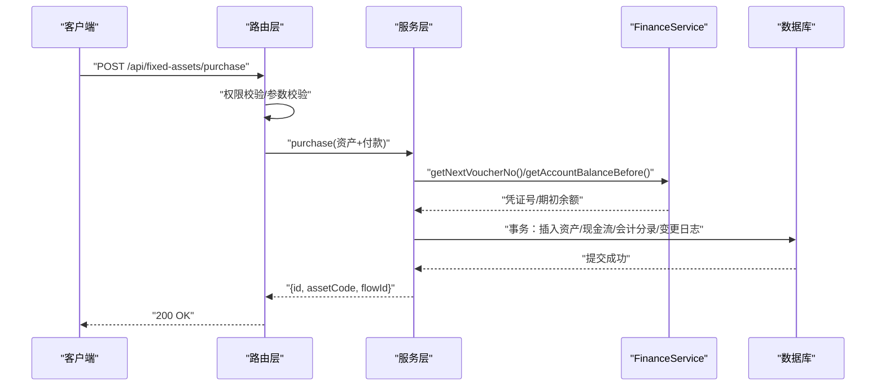
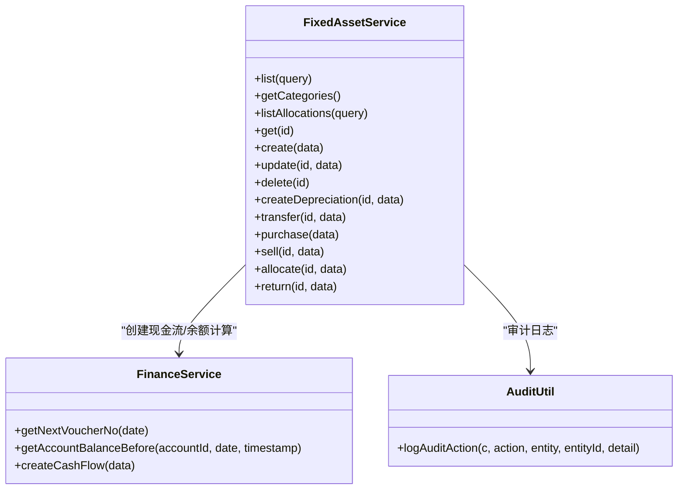
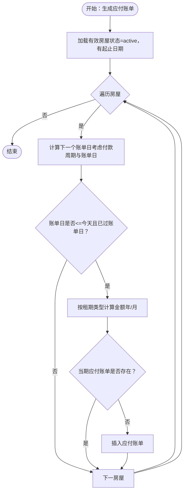
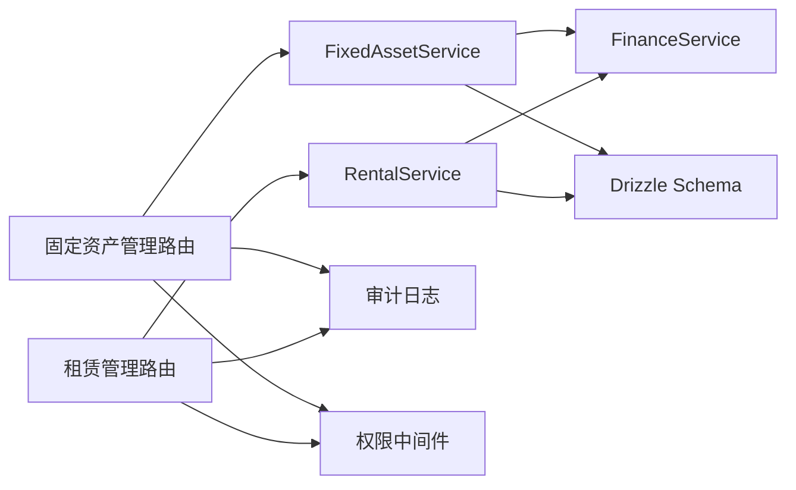
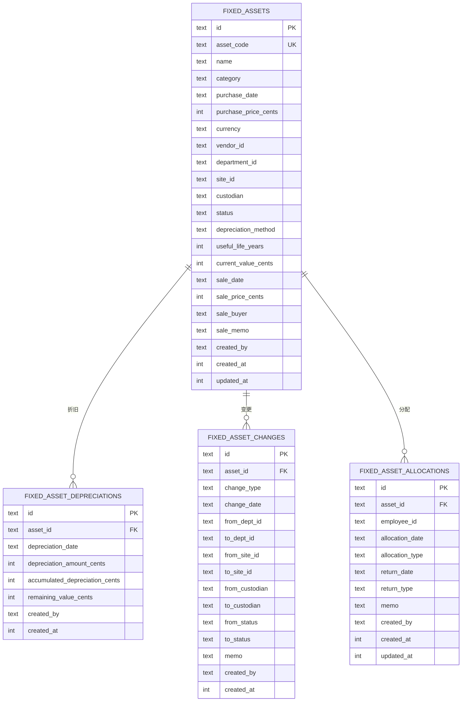
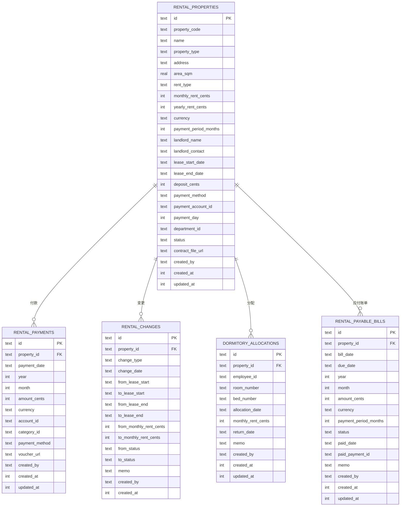

# 资产管理API

<cite>
**本文引用的文件**
- [backend/src/routes/fixed-assets.ts](file://backend/src/routes/fixed-assets.ts)
- [backend/src/routes/rental.ts](file://backend/src/routes/rental.ts)
- [backend/src/services/FixedAssetService.ts](file://backend/src/services/FixedAssetService.ts)
- [backend/src/services/RentalService.ts](file://backend/src/services/RentalService.ts)
- [backend/src/services/FinanceService.ts](file://backend/src/services/FinanceService.ts)
- [backend/src/db/schema.ts](file://backend/src/db/schema.ts)
- [backend/src/schemas/business.schema.ts](file://backend/src/schemas/business.schema.ts)
- [backend/src/utils/audit.ts](file://backend/src/utils/audit.ts)
- [backend/src/middleware/permission.ts](file://backend/src/middleware/permission.ts)
- [backend/src/utils/permissions.ts](file://backend/src/utils/permissions.ts)
- [backend/src/db/schema.sql](file://backend/src/db/schema.sql)
- [backend/init_prod.sql](file://backend/init_prod.sql)
</cite>

## 目录
1. [简介](#简介)
2. [项目结构](#项目结构)
3. [核心组件](#核心组件)
4. [架构总览](#架构总览)
5. [详细组件分析](#详细组件分析)
6. [依赖关系分析](#依赖关系分析)
7. [性能考量](#性能考量)
8. [故障排查指南](#故障排查指南)
9. [结论](#结论)
10. [附录](#附录)

## 简介
本文件面向财务与资产管理系统的前端与集成开发者，系统性梳理“固定资产”与“租赁管理”两大模块的API设计与实现要点，覆盖资产全生命周期（采购、分配、折旧、处置）、租赁合同与付款管理、财务流水联动、状态变更与位置追踪、以及资产盘点与审计能力。文档同时解释资产与财务数据（折旧费用）的关联机制，并提供常见问题的排查建议。

## 项目结构
- 后端采用基于 Hono 的 OpenAPI 路由层，结合 Drizzle ORM 访问 D1 数据库。
- 路由层负责权限校验、参数校验与响应封装；服务层负责业务逻辑与事务控制；工具层提供审计与鉴权辅助。
- 数据模型集中在 schema.ts 与 schema.sql 中，统一映射到 SQLite。

图表来源
- [backend/src/routes/fixed-assets.ts](file://backend/src/routes/fixed-assets.ts#L1-L730)
- [backend/src/routes/rental.ts](file://backend/src/routes/rental.ts#L1-L677)
- [backend/src/services/FixedAssetService.ts](file://backend/src/services/FixedAssetService.ts#L1-L779)
- [backend/src/services/RentalService.ts](file://backend/src/services/RentalService.ts#L1-L617)
- [backend/src/services/FinanceService.ts](file://backend/src/services/FinanceService.ts#L1-L614)
- [backend/src/db/schema.ts](file://backend/src/db/schema.ts#L464-L644)
- [backend/src/db/schema.sql](file://backend/src/db/schema.sql#L1-L200)
- [backend/src/utils/audit.ts](file://backend/src/utils/audit.ts#L1-L92)
- [backend/src/middleware/permission.ts](file://backend/src/middleware/permission.ts#L1-L200)
- [backend/src/utils/permissions.ts](file://backend/src/utils/permissions.ts#L1-L200)

章节来源
- [backend/src/routes/fixed-assets.ts](file://backend/src/routes/fixed-assets.ts#L1-L730)
- [backend/src/routes/rental.ts](file://backend/src/routes/rental.ts#L1-L677)
- [backend/src/db/schema.ts](file://backend/src/db/schema.ts#L464-L644)
- [backend/src/db/schema.sql](file://backend/src/db/schema.sql#L1-L200)

## 核心组件
- 固定资产模块
  - 路由：资产查询、分类、分配、详情、创建、更新、删除、折旧、转移、采购（含流水）、出售、分配、归还。
  - 服务：统一事务、余额计算、状态变更记录、折旧累计与剩余值校验、资产与供应商/部门/站点/币种等关联查询。
- 租赁模块
  - 路由：房屋查询/详情/创建/更新/删除；付款查询/创建/更新/删除；宿舍分配/归还；应付账单生成/查询/标记已付。
  - 服务：合同周期与账单生成算法、付款与应付账单联动、余额计算、变更记录。
- 财务联动
  - 通过 FinanceService 提供凭证号生成、账户余额计算、现金流与会计分录同步。
- 审计与权限
  - 审计日志记录用户行为与IP；路由层使用权限中间件进行细粒度授权。

章节来源
- [backend/src/services/FixedAssetService.ts](file://backend/src/services/FixedAssetService.ts#L1-L779)
- [backend/src/services/RentalService.ts](file://backend/src/services/RentalService.ts#L1-L617)
- [backend/src/services/FinanceService.ts](file://backend/src/services/FinanceService.ts#L1-L614)
- [backend/src/utils/audit.ts](file://backend/src/utils/audit.ts#L1-L92)
- [backend/src/middleware/permission.ts](file://backend/src/middleware/permission.ts#L1-L200)

## 架构总览
固定资产管理与租赁管理均通过路由层暴露REST接口，服务层执行业务规则与事务，FinanceService提供财务一致性保障，审计与权限贯穿各环节。

图表来源
- [backend/src/routes/fixed-assets.ts](file://backend/src/routes/fixed-assets.ts#L511-L576)
- [backend/src/services/FixedAssetService.ts](file://backend/src/services/FixedAssetService.ts#L417-L539)
- [backend/src/services/FinanceService.ts](file://backend/src/services/FinanceService.ts#L28-L69)

## 详细组件分析

### 固定资产模块 API

- 资产列表
  - 方法与路径：GET /api/fixed-assets
  - 查询参数：search、status、departmentId、category
  - 返回：资产列表（含部门/站点/供应商/币种/创建人名称）
  - 权限：需登录
  - 复杂度：O(n) 查询 + 关联表并行查询
  - 章节来源
    - [backend/src/routes/fixed-assets.ts](file://backend/src/routes/fixed-assets.ts#L28-L95)
    - [backend/src/services/FixedAssetService.ts](file://backend/src/services/FixedAssetService.ts#L15-L82)

- 资产分类
  - 方法与路径：GET /api/fixed-assets/categories
  - 返回：去重后的分类数组
  - 章节来源
    - [backend/src/routes/fixed-assets.ts](file://backend/src/routes/fixed-assets.ts#L97-L121)
    - [backend/src/services/FixedAssetService.ts](file://backend/src/services/FixedAssetService.ts#L84-L90)

- 资产分配列表
  - 方法与路径：GET /api/fixed-assets/allocations
  - 查询参数：assetId、employeeId、returned（true/false/undefined）
  - 返回：分配记录（含资产/员工/部门名称）
  - 章节来源
    - [backend/src/routes/fixed-assets.ts](file://backend/src/routes/fixed-assets.ts#L123-L175)
    - [backend/src/services/FixedAssetService.ts](file://backend/src/services/FixedAssetService.ts#L92-L148)

- 资产详情
  - 方法与路径：GET /api/fixed-assets/{id}
  - 返回：资产基础信息 + 折旧明细 + 变更历史（含部门/站点/人员名称映射）
  - 章节来源
    - [backend/src/routes/fixed-assets.ts](file://backend/src/routes/fixed-assets.ts#L177-L267)
    - [backend/src/services/FixedAssetService.ts](file://backend/src/services/FixedAssetService.ts#L150-L216)

- 创建资产
  - 方法与路径：POST /api/fixed-assets
  - 请求体：资产基础字段（含币种、部门、站点、供应商、折旧方法、使用年限等）
  - 返回：{id, assetCode}
  - 审计：记录 create 操作
  - 权限：asset.fixed.create
  - 章节来源
    - [backend/src/routes/fixed-assets.ts](file://backend/src/routes/fixed-assets.ts#L269-L327)
    - [backend/src/services/FixedAssetService.ts](file://backend/src/services/FixedAssetService.ts#L218-L251)
    - [backend/src/utils/audit.ts](file://backend/src/utils/audit.ts#L61-L92)

- 更新资产
  - 方法与路径：PUT /api/fixed-assets/{id}
  - 请求体：部分字段更新
  - 审计：记录 update 操作
  - 权限：asset.fixed.update
  - 章节来源
    - [backend/src/routes/fixed-assets.ts](file://backend/src/routes/fixed-assets.ts#L329-L380)
    - [backend/src/services/FixedAssetService.ts](file://backend/src/services/FixedAssetService.ts#L253-L302)

- 删除资产
  - 方法与路径：DELETE /api/fixed-assets/{id}
  - 约束：存在折旧记录时禁止删除
  - 审计：记录 delete 操作
  - 权限：asset.fixed.delete
  - 章节来源
    - [backend/src/routes/fixed-assets.ts](file://backend/src/routes/fixed-assets.ts#L382-L411)
    - [backend/src/services/FixedAssetService.ts](file://backend/src/services/FixedAssetService.ts#L304-L323)

- 创建折旧
  - 方法与路径：POST /api/fixed-assets/{id}/depreciation
  - 请求体：折旧日期、金额（分）、摘要
  - 事务：累计折旧与剩余价值更新，资产当前净值同步更新
  - 审计：记录 depreciate 操作
  - 权限：asset.fixed.depreciate
  - 章节来源
    - [backend/src/routes/fixed-assets.ts](file://backend/src/routes/fixed-assets.ts#L413-L458)
    - [backend/src/services/FixedAssetService.ts](file://backend/src/services/FixedAssetService.ts#L325-L369)

- 资产转移
  - 方法与路径：POST /api/fixed-assets/{id}/transfer
  - 请求体：to_departmentId、to_siteId、toCustodian、transferDate、memo
  - 事务：写入变更日志并更新资产的部门/站点/责任人
  - 审计：记录 transfer 操作
  - 权限：asset.fixed.transfer
  - 章节来源
    - [backend/src/routes/fixed-assets.ts](file://backend/src/routes/fixed-assets.ts#L460-L509)
    - [backend/src/services/FixedAssetService.ts](file://backend/src/services/FixedAssetService.ts#L371-L415)

- 资产采购（含财务流水）
  - 方法与路径：POST /api/fixed-assets/purchase
  - 请求体：资产+付款字段（账户、类别、供应商、币种、凭证URL等）
  - 事务：创建资产、生成凭证号、插入现金流与会计分录、写入资产变更日志
  - 审计：记录 purchase 操作
  - 权限：asset.fixed.create
  - 章节来源
    - [backend/src/routes/fixed-assets.ts](file://backend/src/routes/fixed-assets.ts#L511-L576)
    - [backend/src/services/FixedAssetService.ts](file://backend/src/services/FixedAssetService.ts#L417-L539)
    - [backend/src/services/FinanceService.ts](file://backend/src/services/FinanceService.ts#L28-L69)

- 资产出售
  - 方法与路径：POST /api/fixed-assets/{id}/sell
  - 请求体：销售日期、价格、账户、类别、币种、买方、摘要、凭证URL
  - 事务：更新资产状态为已售、生成收入现金流与会计分录、写入资产变更日志
  - 审计：记录 sell 操作
  - 权限：asset.fixed.dispose
  - 章节来源
    - [backend/src/routes/fixed-assets.ts](file://backend/src/routes/fixed-assets.ts#L578-L635)
    - [backend/src/services/FixedAssetService.ts](file://backend/src/services/FixedAssetService.ts#L541-L642)
    - [backend/src/services/FinanceService.ts](file://backend/src/services/FinanceService.ts#L28-L69)

- 资产分配
  - 方法与路径：POST /api/fixed-assets/allocate
  - 请求体：assetId、employeeId、allocationDate、allocationType、expectedReturnDate、memo
  - 约束：仅在 in_use/idle 状态下允许分配；同一资产不可重复未归还分配
  - 事务：创建分配记录、更新资产状态与责任人、写入变更日志
  - 审计：记录 allocate 操作
  - 权限：asset.fixed.allocate
  - 章节来源
    - [backend/src/routes/fixed-assets.ts](file://backend/src/routes/fixed-assets.ts#L637-L682)
    - [backend/src/services/FixedAssetService.ts](file://backend/src/services/FixedAssetService.ts#L644-L717)

- 资产归还
  - 方法与路径：POST /api/fixed-assets/{id}/return
  - 请求体：returnDate、returnType、memo
  - 约束：必须存在未归还的分配记录
  - 事务：更新分配记录与资产状态、写入变更日志
  - 审计：记录 return 操作
  - 权限：asset.fixed.allocate
  - 章节来源
    - [backend/src/routes/fixed-assets.ts](file://backend/src/routes/fixed-assets.ts#L684-L729)
    - [backend/src/services/FixedAssetService.ts](file://backend/src/services/FixedAssetService.ts#L719-L777)

- 参数与响应校验
  - 使用 OpenAPI Schema 进行严格校验，包括枚举、长度、正数、日期格式、凭证URL等。
  - 章节来源
    - [backend/src/schemas/business.schema.ts](file://backend/src/schemas/business.schema.ts#L248-L318)
    - [backend/src/schemas/business.schema.ts](file://backend/src/schemas/business.schema.ts#L287-L308)
    - [backend/src/schemas/business.schema.ts](file://backend/src/schemas/business.schema.ts#L691-L700)
    - [backend/src/schemas/business.schema.ts](file://backend/src/schemas/business.schema.ts#L702-L733)
    - [backend/src/schemas/business.schema.ts](file://backend/src/schemas/business.schema.ts#L736-L742)

- 数据模型与关联
  - 固定资产核心表：fixed_assets、fixed_asset_depreciations、fixed_asset_changes、fixed_asset_allocations
  - 关联表：departments、sites、vendors、currencies、users、employees、accounts、cash_flows、account_transactions
  - 章节来源
    - [backend/src/db/schema.ts](file://backend/src/db/schema.ts#L464-L644)

- 折旧与财务联动
  - 折旧金额累计不得超购买价；剩余价值实时更新；出售时资产状态与会计分录联动。
  - 凭证号生成遵循“业务日期+序号”规则；余额计算按交易时间倒序取上一笔余额。
  - 章节来源
    - [backend/src/services/FixedAssetService.ts](file://backend/src/services/FixedAssetService.ts#L325-L369)
    - [backend/src/services/FinanceService.ts](file://backend/src/services/FinanceService.ts#L28-L69)

- 状态变更与位置追踪
  - 资产状态：in_use、idle、maintenance、scrapped、sold
  - 变更日志：记录部门/站点/责任人/状态变化，支持查询与审计
  - 章节来源
    - [backend/src/services/FixedAssetService.ts](file://backend/src/services/FixedAssetService.ts#L280-L301)
    - [backend/src/services/FixedAssetService.ts](file://backend/src/services/FixedAssetService.ts#L371-L415)

- 资产盘点与审计
  - 审计日志记录操作者、实体、行为、详情与IP/地域信息，便于审计与追溯。
  - 章节来源
    - [backend/src/utils/audit.ts](file://backend/src/utils/audit.ts#L1-L92)

图表来源
- [backend/src/services/FixedAssetService.ts](file://backend/src/services/FixedAssetService.ts#L1-L779)
- [backend/src/services/FinanceService.ts](file://backend/src/services/FinanceService.ts#L1-L200)
- [backend/src/utils/audit.ts](file://backend/src/utils/audit.ts#L61-L92)

章节来源
- [backend/src/services/FixedAssetService.ts](file://backend/src/services/FixedAssetService.ts#L1-L779)
- [backend/src/services/FinanceService.ts](file://backend/src/services/FinanceService.ts#L1-L200)
- [backend/src/utils/audit.ts](file://backend/src/utils/audit.ts#L1-L92)

### 租赁管理模块 API

- 房屋列表
  - 方法与路径：GET /api/rental-properties
  - 查询参数：propertyType、status、departmentId
  - 返回：房屋列表（含部门/付款账户/币种/创建人名称）
  - 章节来源
    - [backend/src/routes/rental.ts](file://backend/src/routes/rental.ts#L24-L58)
    - [backend/src/services/RentalService.ts](file://backend/src/services/RentalService.ts#L15-L41)

- 房屋详情
  - 方法与路径：GET /api/rental-properties/{id}
  - 返回：房屋详情 + 付款/变更/分配记录
  - 章节来源
    - [backend/src/routes/rental.ts](file://backend/src/routes/rental.ts#L202-L227)
    - [backend/src/services/RentalService.ts](file://backend/src/services/RentalService.ts#L43-L95)

- 创建房屋
  - 方法与路径：POST /api/rental-properties
  - 请求体：propertyCode、name、propertyType、货币、租金类型、月/年租金、付款周期、房东信息、租期、押金、付款方式、部门、状态、合同文件URL、备注
  - 审计：记录 create 操作
  - 权限：asset.rental.create
  - 章节来源
    - [backend/src/routes/rental.ts](file://backend/src/routes/rental.ts#L229-L295)
    - [backend/src/services/RentalService.ts](file://backend/src/services/RentalService.ts#L97-L158)
    - [backend/src/utils/audit.ts](file://backend/src/utils/audit.ts#L61-L92)

- 更新房屋
  - 方法与路径：PUT /api/rental-properties/{id}
  - 请求体：部分字段更新（含状态、月/年租金、租期等）
  - 审计：记录 update 操作
  - 权限：asset.rental.update
  - 章节来源
    - [backend/src/routes/rental.ts](file://backend/src/routes/rental.ts#L297-L358)
    - [backend/src/services/RentalService.ts](file://backend/src/services/RentalService.ts#L160-L189)

- 删除房屋
  - 方法与路径：DELETE /api/rental-properties/{id}
  - 约束：存在付款记录时禁止删除
  - 审计：记录 delete 操作
  - 权限：asset.rental.delete
  - 章节来源
    - [backend/src/routes/rental.ts](file://backend/src/routes/rental.ts#L359-L388)
    - [backend/src/services/RentalService.ts](file://backend/src/services/RentalService.ts#L190-L204)

- 付款列表
  - 方法与路径：GET /api/rental-payments
  - 查询参数：propertyId、year、month
  - 返回：付款记录（含房屋、账户、类别、创建人名称）
  - 章节来源
    - [backend/src/routes/rental.ts](file://backend/src/routes/rental.ts#L391-L434)
    - [backend/src/services/RentalService.ts](file://backend/src/services/RentalService.ts#L208-L236)

- 创建付款
  - 方法与路径：POST /api/rental-payments
  - 请求体：propertyId、paymentDate、year、month、amountCents、currency、accountId、categoryId、paymentMethod、voucherUrl、memo
  - 事务：插入付款记录、生成凭证号、插入现金流与会计分录、联动更新应付账单状态
  - 审计：记录 create 操作
  - 权限：asset.rental.create
  - 章节来源
    - [backend/src/routes/rental.ts](file://backend/src/routes/rental.ts#L436-L491)
    - [backend/src/services/RentalService.ts](file://backend/src/services/RentalService.ts#L238-L350)
    - [backend/src/services/FinanceService.ts](file://backend/src/services/FinanceService.ts#L28-L69)

- 更新付款
  - 方法与路径：PUT /api/rental-payments/{id}
  - 请求体：部分字段更新
  - 审计：记录 update 操作
  - 权限：asset.rental.update
  - 章节来源
    - [backend/src/routes/rental.ts](file://backend/src/routes/rental.ts#L493-L535)
    - [backend/src/services/RentalService.ts](file://backend/src/services/RentalService.ts#L352-L366)

- 删除付款
  - 方法与路径：DELETE /api/rental-payments/{id}
  - 审计：记录 delete 操作
  - 权限：asset.rental.delete
  - 章节来源
    - [backend/src/routes/rental.ts](file://backend/src/routes/rental.ts#L536-L568)
    - [backend/src/services/RentalService.ts](file://backend/src/services/RentalService.ts#L369-L387)

- 宿舍分配列表
  - 方法与路径：GET /api/rental-properties/allocations
  - 查询参数：propertyId、employeeId、returned（true/false/undefined）
  - 返回：分配记录（含房屋、员工、部门名称）
  - 章节来源
    - [backend/src/routes/rental.ts](file://backend/src/routes/rental.ts#L61-L108)
    - [backend/src/services/RentalService.ts](file://backend/src/services/RentalService.ts#L369-L429)

- 宿舍分配
  - 方法与路径：POST /api/rental-properties/{id}/allocate-dormitory
  - 请求体：employeeId、allocationDate、roomNumber、bedNumber、monthlyRentCents、memo
  - 约束：仅对 dormitory 类型房屋有效；员工不可重复未归还分配
  - 审计：记录 allocate 操作
  - 权限：asset.rental.update
  - 章节来源
    - [backend/src/routes/rental.ts](file://backend/src/routes/rental.ts#L109-L160)
    - [backend/src/services/RentalService.ts](file://backend/src/services/RentalService.ts#L431-L474)

- 宿舍归还
  - 方法与路径：POST /api/rental-properties/allocations/{id}/return
  - 请求体：returnDate、memo
  - 约束：仅未归还的分配可归还
  - 审计：记录 return 操作
  - 权限：asset.rental.update
  - 章节来源
    - [backend/src/routes/rental.ts](file://backend/src/routes/rental.ts#L161-L201)
    - [backend/src/services/RentalService.ts](file://backend/src/services/RentalService.ts#L476-L487)

- 应付账单生成
  - 方法与路径：POST /api/rental-properties/generate-payable-bills
  - 触发条件：根据租期、付款周期、账单日生成未到期应付账单
  - 审计：记录 generate 操作
  - 权限：asset.rental.create
  - 章节来源
    - [backend/src/routes/rental.ts](file://backend/src/routes/rental.ts#L572-L607)
    - [backend/src/services/RentalService.ts](file://backend/src/services/RentalService.ts#L488-L575)

- 应付账单列表
  - 方法与路径：GET /api/rental-payable-bills
  - 查询参数：propertyId、status、startDate、endDate
  - 返回：账单列表（含房屋、类型、房东）
  - 章节来源
    - [backend/src/routes/rental.ts](file://backend/src/routes/rental.ts#L608-L648)
    - [backend/src/services/RentalService.ts](file://backend/src/services/RentalService.ts#L577-L601)

- 标记账单已付
  - 方法与路径：POST /api/rental-payable-bills/:id/mark-paid
  - 约束：仅未支付账单可标记
  - 审计：记录 update 操作
  - 权限：asset.rental.update
  - 章节来源
    - [backend/src/routes/rental.ts](file://backend/src/routes/rental.ts#L650-L677)
    - [backend/src/services/RentalService.ts](file://backend/src/services/RentalService.ts#L603-L616)

- 参数与响应校验
  - 使用 OpenAPI Schema 进行严格校验，包括枚举、正数、日期、URL、币种代码等。
  - 章节来源
    - [backend/src/schemas/business.schema.ts](file://backend/src/schemas/business.schema.ts#L80-L116)
    - [backend/src/schemas/business.schema.ts](file://backend/src/schemas/business.schema.ts#L580-L593)
    - [backend/src/schemas/business.schema.ts](file://backend/src/schemas/business.schema.ts#L596-L603)
    - [backend/src/schemas/business.schema.ts](file://backend/src/schemas/business.schema.ts#L606-L616)

- 数据模型与关联
  - 房屋表：rental_properties
  - 付款表：rental_payments
  - 变更表：rental_changes
  - 分配表：dormitory_allocations
  - 应付账单：rental_payable_bills
  - 关联表：accounts、departments、employees、currencies、cash_flows、account_transactions
  - 章节来源
    - [backend/src/db/schema.ts](file://backend/src/db/schema.ts#L534-L644)

- 财务联动与账单生成算法
  - 凭证号生成与余额计算同固定资产模块一致。
  - 应付账单生成：根据起止日期、付款周期、账单日推导应出账日期，按年/月租模式计算金额，避免重复生成。
  - 章节来源
    - [backend/src/services/RentalService.ts](file://backend/src/services/RentalService.ts#L488-L575)
    - [backend/src/services/FinanceService.ts](file://backend/src/services/FinanceService.ts#L28-L69)

图表来源
- [backend/src/services/RentalService.ts](file://backend/src/services/RentalService.ts#L488-L575)

章节来源
- [backend/src/services/RentalService.ts](file://backend/src/services/RentalService.ts#L488-L575)
- [backend/src/services/FinanceService.ts](file://backend/src/services/FinanceService.ts#L28-L69)

## 依赖关系分析

图表来源
- [backend/src/routes/fixed-assets.ts](file://backend/src/routes/fixed-assets.ts#L1-L730)
- [backend/src/routes/rental.ts](file://backend/src/routes/rental.ts#L1-L677)
- [backend/src/services/FixedAssetService.ts](file://backend/src/services/FixedAssetService.ts#L1-L779)
- [backend/src/services/RentalService.ts](file://backend/src/services/RentalService.ts#L1-L617)
- [backend/src/services/FinanceService.ts](file://backend/src/services/FinanceService.ts#L1-L200)
- [backend/src/db/schema.ts](file://backend/src/db/schema.ts#L464-L644)
- [backend/src/utils/audit.ts](file://backend/src/utils/audit.ts#L1-L92)
- [backend/src/middleware/permission.ts](file://backend/src/middleware/permission.ts#L1-L200)

章节来源
- [backend/src/routes/fixed-assets.ts](file://backend/src/routes/fixed-assets.ts#L1-L730)
- [backend/src/routes/rental.ts](file://backend/src/routes/rental.ts#L1-L677)
- [backend/src/services/FixedAssetService.ts](file://backend/src/services/FixedAssetService.ts#L1-L779)
- [backend/src/services/RentalService.ts](file://backend/src/services/RentalService.ts#L1-L617)
- [backend/src/services/FinanceService.ts](file://backend/src/services/FinanceService.ts#L1-L200)
- [backend/src/db/schema.ts](file://backend/src/db/schema.ts#L464-L644)
- [backend/src/utils/audit.ts](file://backend/src/utils/audit.ts#L1-L92)
- [backend/src/middleware/permission.ts](file://backend/src/middleware/permission.ts#L1-L200)

## 性能考量
- 并行查询优化：资产/分配/付款等列表接口会并行拉取关联表（部门、站点、供应商、用户、币种、账户等），减少N+1查询。
- 事务边界：采购/出售、付款等关键流程使用事务保证一致性，避免脏读与不一致。
- 余额计算：通过“交易日期+创建时间”倒序查找最近一笔交易，避免全表扫描。
- 章节来源
  - [backend/src/services/FixedAssetService.ts](file://backend/src/services/FixedAssetService.ts#L56-L82)
  - [backend/src/services/FixedAssetService.ts](file://backend/src/services/FixedAssetService.ts#L119-L147)
  - [backend/src/services/RentalService.ts](file://backend/src/services/RentalService.ts#L63-L95)
  - [backend/src/services/FinanceService.ts](file://backend/src/services/FinanceService.ts#L41-L69)

## 故障排查指南
- 权限不足
  - 现象：返回403 Forbidden
  - 排查：确认用户岗位权限是否包含 asset.fixed.asset.rental 对应操作
  - 章节来源
    - [backend/src/middleware/permission.ts](file://backend/src/middleware/permission.ts#L1-L200)
    - [backend/src/utils/permissions.ts](file://backend/src/utils/permissions.ts#L1-L200)

- 业务约束错误
  - 现象：删除资产失败（存在折旧记录）、出售失败（资产已售）、分配失败（资产已分配未归还）、付款失败（当月重复）
  - 排查：查看对应服务层的约束判断与错误抛出
  - 章节来源
    - [backend/src/services/FixedAssetService.ts](file://backend/src/services/FixedAssetService.ts#L304-L323)
    - [backend/src/services/FixedAssetService.ts](file://backend/src/services/FixedAssetService.ts#L541-L558)
    - [backend/src/services/FixedAssetService.ts](file://backend/src/services/FixedAssetService.ts#L644-L671)
    - [backend/src/services/RentalService.ts](file://backend/src/services/RentalService.ts#L252-L261)

- 财务一致性问题
  - 现象：折旧累计超购买价、余额异常
  - 排查：核对折旧事务与余额计算逻辑；检查凭证号生成与账单联动
  - 章节来源
    - [backend/src/services/FixedAssetService.ts](file://backend/src/services/FixedAssetService.ts#L325-L369)
    - [backend/src/services/FinanceService.ts](file://backend/src/services/FinanceService.ts#L28-L69)

- 审计与溯源
  - 现象：无法定位操作人与IP
  - 排查：确认审计中间件是否生效，检查审计日志表字段
  - 章节来源
    - [backend/src/utils/audit.ts](file://backend/src/utils/audit.ts#L1-L92)
    - [backend/src/db/schema.sql](file://backend/src/db/schema.sql#L115-L125)

## 结论
本系统围绕“固定资产”与“租赁管理”两大模块构建了完善的API体系，通过严格的参数校验、细粒度权限控制、事务化业务流程与财务一致性保障，实现了资产全生命周期与租赁合同的闭环管理。审计与变更日志为合规与审计提供了坚实支撑。建议在生产环境中：
- 配置合适的索引以优化查询性能；
- 对高频接口增加缓存策略；
- 定期审查权限矩阵与审计日志；
- 在前端做好错误提示与重试策略。

## 附录

### 数据模型概览（固定资产）

图表来源
- [backend/src/db/schema.ts](file://backend/src/db/schema.ts#L464-L644)

### 数据模型概览（租赁管理）

图表来源
- [backend/src/db/schema.ts](file://backend/src/db/schema.ts#L534-L644)

### 初始化与示例
- 初始化脚本包含总部、部门、岗位与管理员示例数据，便于快速启动。
- 章节来源
  - [backend/init_prod.sql](file://backend/init_prod.sql#L1-L20)