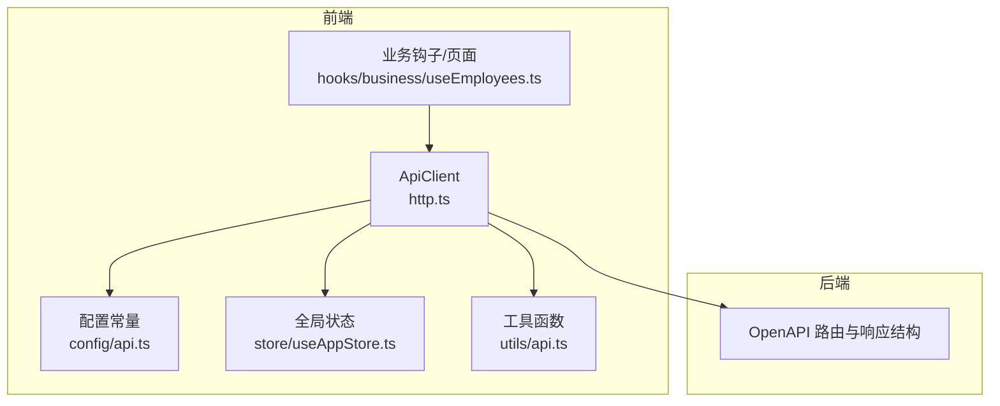
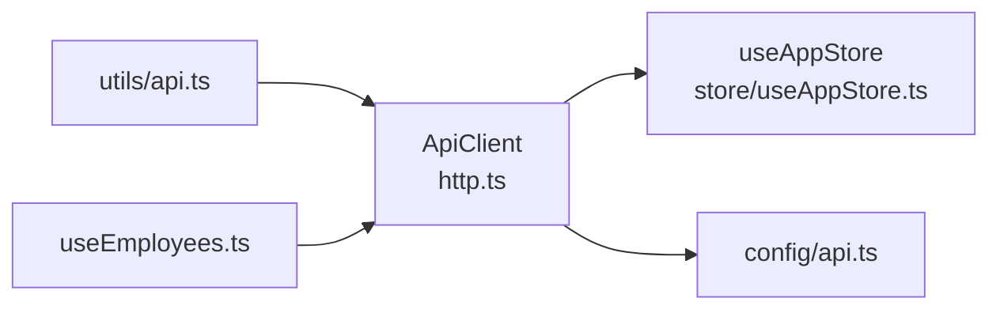

# API客户端配置

<cite>
**本文引用的文件**
- [frontend/src/api/http.ts](file://frontend/src/api/http.ts)
- [frontend/src/config/api.ts](file://frontend/src/config/api.ts)
- [frontend/src/store/useAppStore.ts](file://frontend/src/store/useAppStore.ts)
- [frontend/src/utils/api.ts](file://frontend/src/utils/api.ts)
- [frontend/src/hooks/business/useEmployees.ts](file://frontend/src/hooks/business/useEmployees.ts)
</cite>

## 目录
1. [简介](#简介)
2. [项目结构](#项目结构)
3. [核心组件](#核心组件)
4. [架构总览](#架构总览)
5. [详细组件分析](#详细组件分析)
6. [依赖关系分析](#依赖关系分析)
7. [性能考量](#性能考量)
8. [故障排查指南](#故障排查指南)
9. [结论](#结论)

## 简介
本文件面向前端开发者，系统性说明 API 客户端配置与使用，重点围绕 http.ts 中的 ApiClient 类实现，涵盖以下主题：
- 请求封装与拦截机制：自动注入 JWT 与 TOTP 认证头（Authorization 与 X-Caiwu-Token）
- 响应拦截机制：对 401 未授权状态的处理与自动跳转登录页
- 请求选项 RequestOptions：skipErrorHandle 控制错误静默处理；responseType 支持 json/text/blob 等响应类型
- BASE_URL 的配置方式与多环境应用策略
- 请求生命周期时序图：从发起请求到错误处理的完整流程

## 项目结构
API 客户端位于前端工程的 api 目录，配合后端 OpenAPI 配置与全局状态管理共同构成完整的调用链路。



图表来源
- [frontend/src/api/http.ts](file://frontend/src/api/http.ts#L1-L116)
- [frontend/src/config/api.ts](file://frontend/src/config/api.ts#L1-L188)
- [frontend/src/store/useAppStore.ts](file://frontend/src/store/useAppStore.ts#L1-L90)
- [frontend/src/utils/api.ts](file://frontend/src/utils/api.ts#L1-L71)
- [frontend/src/hooks/business/useEmployees.ts](file://frontend/src/hooks/business/useEmployees.ts#L1-L200)

章节来源
- [frontend/src/api/http.ts](file://frontend/src/api/http.ts#L1-L116)
- [frontend/src/config/api.ts](file://frontend/src/config/api.ts#L1-L188)

## 核心组件
- ApiClient 类：统一的 HTTP 客户端，封装 fetch 请求、自动注入认证头、解析响应、处理 401 未授权与业务错误。
- RequestOptions 接口：扩展自 RequestInit，新增 skipErrorHandle 与 responseType 两个关键字段。
- BASE_URL：当前代码中为空字符串，实际运行时通过 config/api.ts 中的 API_HOST 动态拼接。
- 全局状态 useAppStore：提供 token、logout 等能力，供 ApiClient 注入认证头与触发登出。

章节来源
- [frontend/src/api/http.ts](file://frontend/src/api/http.ts#L1-L116)
- [frontend/src/store/useAppStore.ts](file://frontend/src/store/useAppStore.ts#L1-L90)

## 架构总览
下图展示了 ApiClient 在请求生命周期中的角色与交互点。

```mermaid
sequenceDiagram
participant UI as "业务层/页面"
participant Hook as "业务钩子"
participant Client as "ApiClient"
participant Store as "useAppStore"
participant Backend as "后端服务"
UI->>Hook : 触发业务操作
Hook->>Client : 调用 api.get/post/put/delete/blob(...)
Client->>Store : 读取 token
Store-->>Client : 返回 token
Client->>Client : 自动设置 Authorization 与 X-Caiwu-Token
Client->>Backend : 发起 fetch 请求
Backend-->>Client : 返回响应含 content-type
alt responseType 为 blob
Client-->>Hook : 返回 Blob
else content-type 为 application/json
Client->>Client : 解析为 JSON
opt 后端统一响应结构
Client->>Client : 判断 success 字段
opt success 为 true
Client-->>Hook : 返回 data 字段
else success 为 false
Client->>Client : 抛出业务错误
Client-->>Hook : 抛出异常
end
end
else 其他类型
Client-->>Hook : 返回文本
end
opt 响应状态为 401
Client->>Store : 调用 logout()
Client->>Client : 强制跳转到 /login
Client-->>Hook : 抛出错误
end
opt 响应非 ok
Client->>Client : 抛出网络/业务错误
Client-->>Hook : 抛出异常
end
Hook-->>UI : 返回数据或处理错误
```

图表来源
- [frontend/src/api/http.ts](file://frontend/src/api/http.ts#L1-L116)
- [frontend/src/store/useAppStore.ts](file://frontend/src/store/useAppStore.ts#L1-L90)

## 详细组件分析

### ApiClient 类与请求拦截器
- 自动注入认证头
  - 当存在 token 时，自动设置 Authorization 与 X-Caiwu-Token 两个头部，确保后端能识别会话与二次验证令牌。
- Content-Type 默认处理
  - 若未显式设置且请求体不是 FormData，则默认设置为 application/json。
- 统一响应解析
  - 根据响应头 content-type 判断：
    - responseType 为 'blob' 时，直接返回 Blob；
    - content-type 包含 application/json 时，先解析为 JSON，再按后端统一响应结构处理：
      - 若包含 success 字段且为 true，返回 data 字段；
      - 若包含 success 字段且为 false，抛出业务错误（message 或 error.message）；
    - 其他情况返回文本。
- 401 未授权处理
  - 当响应状态为 401 时，调用 store.logout() 并强制跳转到 /login，随后抛出错误。
- 错误静默控制
  - 通过 skipErrorHandle 控制是否弹出错误提示与抛出异常，便于业务层自行处理错误。
- 方法别名
  - 提供 get/post/put/delete 便捷方法；blob 方法固定 responseType 为 'blob'，便于下载文件等场景。

章节来源
- [frontend/src/api/http.ts](file://frontend/src/api/http.ts#L1-L116)

### RequestOptions 详解
- skipErrorHandle: boolean
  - 为 true 时，避免自动弹出错误提示与抛出异常，适合需要自定义错误处理或静默重试的场景。
- responseType: 'json' | 'text' | 'blob'
  - 控制响应解析方式：
    - 'blob'：适用于下载文件、图片等二进制资源；
    - 'json'：默认解析为 JSON，结合后端统一响应结构；
    - 'text'：返回原始文本。

章节来源
- [frontend/src/api/http.ts](file://frontend/src/api/http.ts#L6-L9)

### BASE_URL 配置与多环境应用
- 当前实现
  - http.ts 中的 BASE_URL 为 ''，即不带前缀。
- 多环境策略
  - config/api.ts 通过 import.meta.env.DEV 切换开发与生产环境：
    - 开发环境：指向 Cloudflare Worker 地址；
    - 生产环境：使用空字符串，通过 Pages 内部绑定 Worker 访问。
- 使用建议
  - 将 BASE_URL 从 http.ts 迁移到 config/api.ts，统一由 api 常量拼接，避免硬编码在客户端类中，提升可维护性与可测试性。

章节来源
- [frontend/src/api/http.ts](file://frontend/src/api/http.ts#L4-L4)
- [frontend/src/config/api.ts](file://frontend/src/config/api.ts#L1-L12)

### 响应拦截与错误处理
- 401 未授权
  - 一旦收到 401，立即触发登出并跳转登录页，防止继续使用无效 token。
- 非 2xx 状态码
  - 若 response.ok 为 false，构造错误信息并根据 skipErrorHandle 决定是否抛错。
- 业务错误
  - 对于后端统一响应结构，当 success 为 false 时，优先使用 error.message 或 message 字段作为错误信息。
- 错误提示
  - 默认使用 antd message 组件进行错误提示，可通过 skipErrorHandle 关闭。

章节来源
- [frontend/src/api/http.ts](file://frontend/src/api/http.ts#L34-L83)

### 使用示例与最佳实践
- 业务层调用
  - 通过 hooks/business/useEmployees.ts 可见，业务层通常以 apiClient.get/post/put/delete 的形式发起请求，并结合 react-query 管理缓存与刷新。
- 文件下载
  - 使用 apiClient.blob(url, options) 直接获取 Blob，便于下载或预览。
- 错误静默
  - 对于需要重试或自定义提示的场景，传入 { skipErrorHandle: true }，并在业务层自行处理错误。

章节来源
- [frontend/src/hooks/business/useEmployees.ts](file://frontend/src/hooks/business/useEmployees.ts#L1-L200)
- [frontend/src/utils/api.ts](file://frontend/src/utils/api.ts#L1-L71)

## 依赖关系分析
- ApiClient 依赖
  - useAppStore：读取 token、触发 logout
  - config/api.ts：提供 API 常量与版本化路径
  - utils/api.ts：提供安全调用与冲突错误处理等工具
- 业务层依赖
  - hooks/business/useEmployees.ts：封装具体业务请求，复用 ApiClient



图表来源
- [frontend/src/api/http.ts](file://frontend/src/api/http.ts#L1-L116)
- [frontend/src/store/useAppStore.ts](file://frontend/src/store/useAppStore.ts#L1-L90)
- [frontend/src/config/api.ts](file://frontend/src/config/api.ts#L1-L188)
- [frontend/src/utils/api.ts](file://frontend/src/utils/api.ts#L1-L71)
- [frontend/src/hooks/business/useEmployees.ts](file://frontend/src/hooks/business/useEmployees.ts#L1-L200)

## 性能考量
- 响应解析优化
  - 优先使用 responseType 为 'blob' 下载二进制资源，避免不必要的 JSON 解析与内存占用。
- 错误处理成本
  - 合理使用 skipErrorHandle，减少重复提示与 UI 闪烁。
- 缓存与重试
  - 结合 react-query 的 staleTime 与重试策略，降低重复请求频率。

## 故障排查指南
- 401 未授权频繁出现
  - 检查 token 是否过期或被登出；确认 useAppStore 的 token 是否正确持久化；确认后端是否正确颁发与校验令牌。
- 业务错误未提示
  - 若设置了 { skipErrorHandle: true }，需在业务层自行处理错误；否则检查是否被全局错误处理器吞掉。
- 下载文件失败
  - 确认后端返回 content-type 为 application/octet-stream 或 multipart/form-data；使用 apiClient.blob(...) 获取 Blob。
- 跨环境访问异常
  - 确认 config/api.ts 中的 API_HOST 与 BASE_URL 配置是否正确；开发环境指向 Worker，生产环境使用相对路径。

章节来源
- [frontend/src/api/http.ts](file://frontend/src/api/http.ts#L34-L83)
- [frontend/src/store/useAppStore.ts](file://frontend/src/store/useAppStore.ts#L1-L90)
- [frontend/src/config/api.ts](file://frontend/src/config/api.ts#L1-L12)

## 结论
ApiClient 通过统一的请求/响应拦截机制，简化了前端与后端的交互复杂度，提供了：
- 自动化的认证头注入与 401 处理；
- 对后端统一响应结构的兼容；
- 对 blob 等特殊响应类型的灵活支持；
- 可配置的错误静默处理。

建议后续将 BASE_URL 迁移至 config 层，统一由 api 常量拼接，进一步提升可维护性与可测试性。