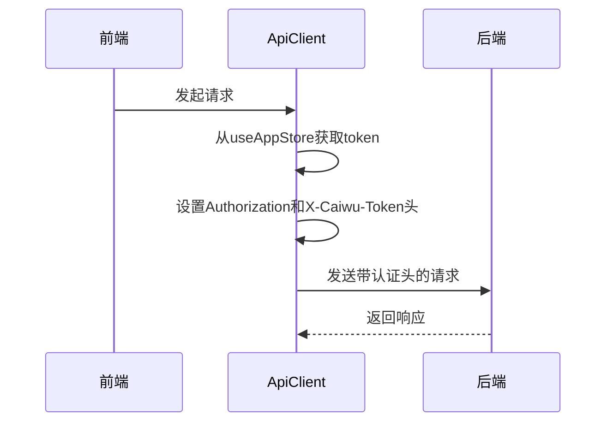
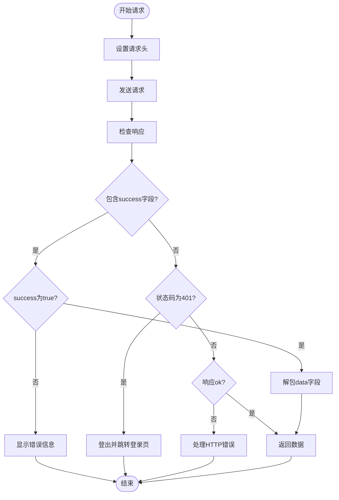
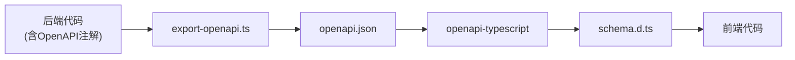
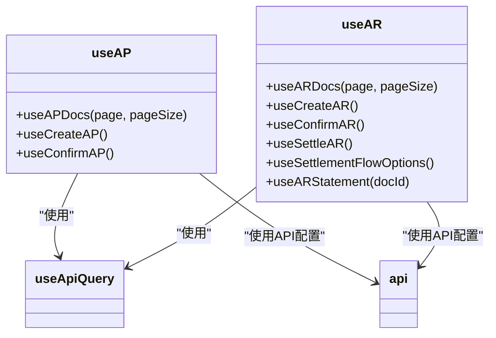
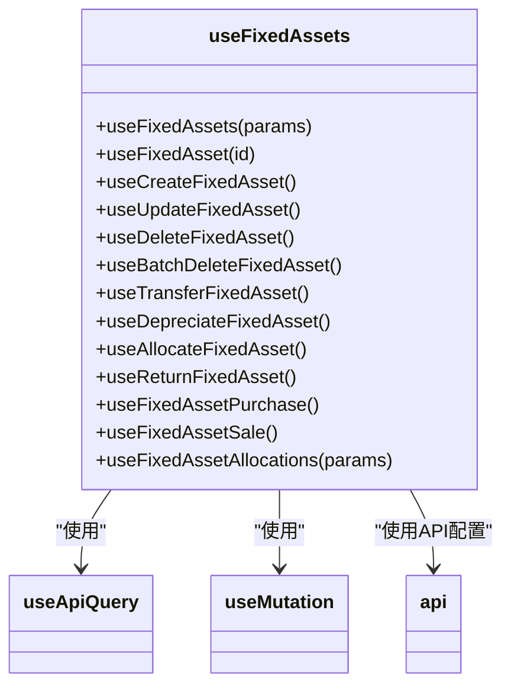
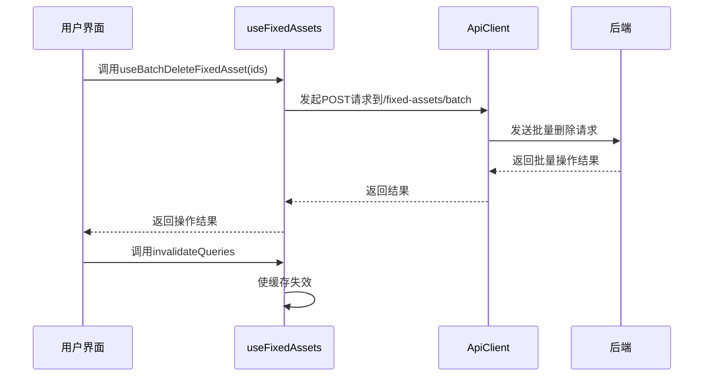
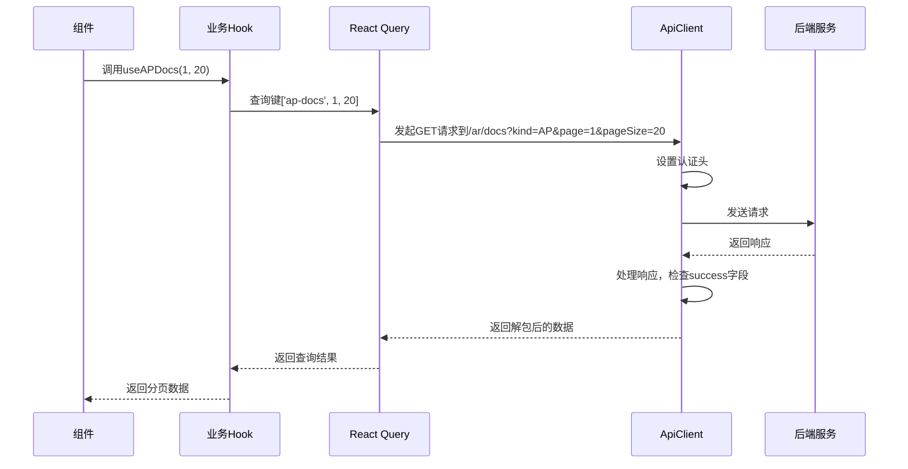
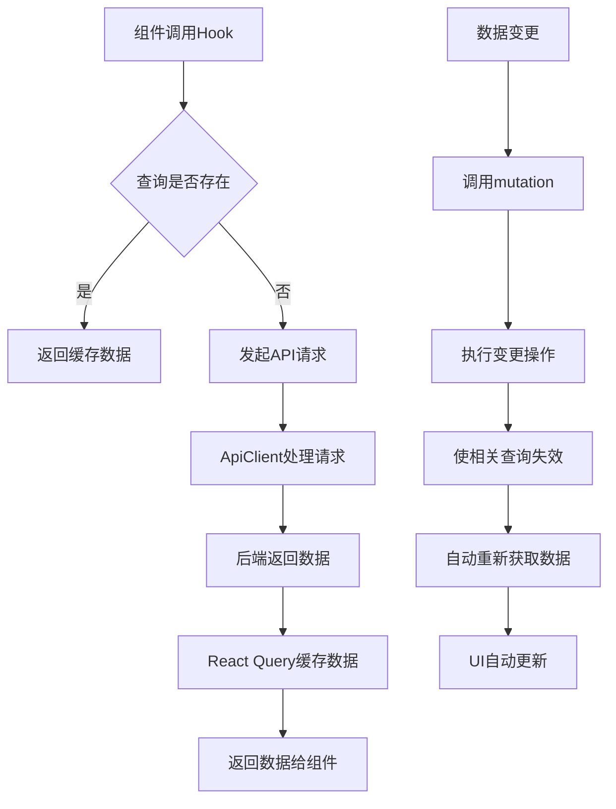
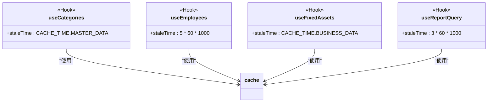
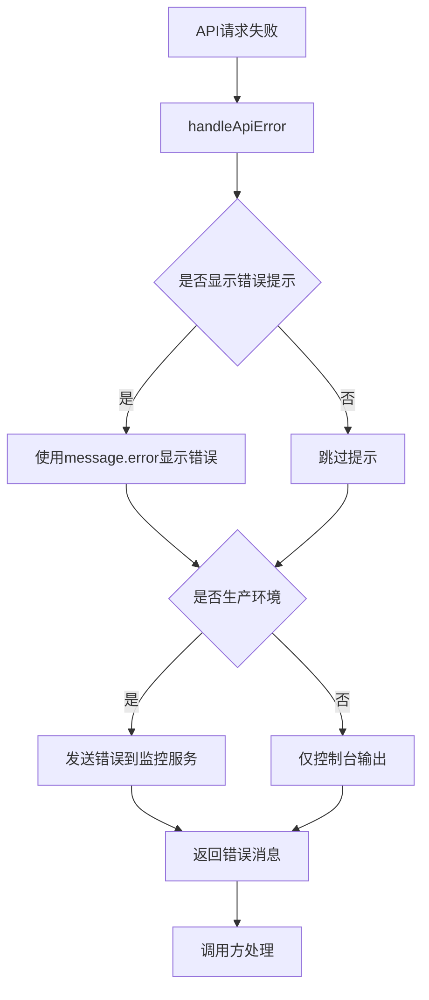

# API集成

<cite>
**本文档引用的文件**  
- [http.ts](file://frontend/src/api/http.ts)
- [api.ts](file://frontend/src/config/api.ts)
- [schema.d.ts](file://frontend/src/types/schema.d.ts)
- [useAP.ts](file://frontend/src/hooks/business/useAP.ts)
- [useAR.ts](file://frontend/src/hooks/business/useAR.ts)
- [useFixedAssets.ts](file://frontend/src/hooks/business/useFixedAssets.ts)
- [useApiQuery.ts](file://frontend/src/utils/useApiQuery.ts)
- [cache.ts](file://frontend/src/config/cache.ts)
- [useAppStore.ts](file://frontend/src/store/useAppStore.ts)
- [openapi.json](file://backend/openapi.json)
- [export-openapi.ts](file://backend/scripts/export-openapi.ts)
- [useEmployees.ts](file://frontend/src/hooks/business/useEmployees.ts)
- [useCategories.ts](file://frontend/src/hooks/business/useCategories.ts)
</cite>

## 目录
1. [API集成概述](#api集成概述)
2. [Axios实例配置](#axios实例配置)
3. [OpenAPI类型定义生成](#openapi类型定义生成)
4. [业务Hook封装机制](#业务hook封装机制)
5. [API调用时序与流程](#api调用时序与流程)
6. [缓存与性能优化](#缓存与性能优化)
7. [错误处理机制](#错误处理机制)

## API集成概述

本系统采用前后端分离架构，前端通过RESTful API与后端进行数据交互。API集成方案基于Axios封装，结合React Query实现数据获取、缓存、同步和状态管理。系统通过OpenAPI规范生成前端类型定义，确保类型安全。前端通过自定义Hook封装CRUD操作，支持分页、搜索和批量操作。

**Section sources**
- [http.ts](file://frontend/src/api/http.ts#L1-L116)
- [api.ts](file://frontend/src/config/api.ts#L1-L188)

## Axios实例配置

前端通过`ApiClient`类封装HTTP请求，配置了统一的请求拦截器、认证头和错误处理机制。

### 认证头配置
系统采用JWT+TOTP双因素认证机制，在请求头中同时携带`Authorization`和`X-Caiwu-Token`两个认证头。认证令牌从Zustand状态管理中获取。



**Diagram sources**
- [http.ts](file://frontend/src/api/http.ts#L11-L23)
- [useAppStore.ts](file://frontend/src/store/useAppStore.ts#L23-L90)

### 请求拦截器
请求拦截器自动设置`Content-Type`头，对于非FormData请求，默认设置为`application/json`。

### 响应处理
响应处理包含以下关键逻辑：
- 统一响应格式处理：检查`success`字段，成功则解包`data`，失败则抛出错误
- 401状态码处理：自动登出并重定向到登录页
- 错误统一处理：通过Ant Design的message组件显示错误信息



**Diagram sources**
- [http.ts](file://frontend/src/api/http.ts#L25-L78)

**Section sources**
- [http.ts](file://frontend/src/api/http.ts#L11-L116)

## OpenAPI类型定义生成

系统通过OpenAPI规范实现前后端类型契约，确保类型安全。

### 类型生成流程
后端使用`export-openapi.ts`脚本从代码注解生成OpenAPI规范，前端通过`openapi-typescript`工具将`openapi.json`转换为TypeScript类型定义。



**Diagram sources**
- [export-openapi.ts](file://backend/scripts/export-openapi.ts#L1-L15)
- [openapi.json](file://backend/openapi.json#L1-L200)

### 类型定义结构
生成的`schema.d.ts`文件包含完整的API路径和参数类型定义，前端通过`schema-helpers.ts`进行类型导出和简化。

```typescript
// schema-helpers.ts
import type { components } from './schema'
export type Schema<T extends keyof components['schemas']> = components['schemas'][T]
export type { components, paths } from './schema'
```

**Section sources**
- [schema.d.ts](file://frontend/src/types/schema.d.ts#L1-L800)
- [schema-helpers.ts](file://frontend/src/types/schema-helpers.ts#L1-L4)

## 业务Hook封装机制

前端通过自定义Hook封装业务逻辑，提供类型安全的CRUD操作。

### CRUD操作封装
每个业务模块都有对应的Hook，如`useAP`、`useAR`、`useFixedAssets`等，封装了查询、创建、更新、删除等操作。

#### AP/AR管理Hook
`useAP`和`useAR`Hook提供应付款和应收款的管理功能，支持分页查询和状态变更。



**Diagram sources**
- [useAP.ts](file://frontend/src/hooks/business/useAP.ts#L1-L48)
- [useAR.ts](file://frontend/src/hooks/business/useAR.ts#L1-L86)
- [api.ts](file://frontend/src/config/api.ts#L58-L63)

#### 固定资产管理Hook
`useFixedAssets`Hook提供完整的固定资产管理功能，包括采购、折旧、分配、转移等操作。



**Diagram sources**
- [useFixedAssets.ts](file://frontend/src/hooks/business/useFixedAssets.ts#L1-L200)
- [api.ts](file://frontend/src/config/api.ts#L137-L148)

### 分页与搜索
业务Hook支持分页和搜索功能，通过URL参数传递查询条件。

```typescript
export interface FixedAssetQueryParams {
    search?: string
    status?: string
    departmentId?: string
    category?: string
}

export function useFixedAssets(params: FixedAssetQueryParams = {}) {
    const queryParams = new URLSearchParams()
    if (params.search) queryParams.append('search', params.search)
    if (params.status) queryParams.append('status', params.status)
    if (params.departmentId) queryParams.append('departmentId', params.departmentId)
    if (params.category) queryParams.append('category', params.category)
    
    const url = `${api.fixedAssets}?${queryParams.toString()}`
    return useApiQuery<FixedAsset[]>(['fixedAssets', params], url)
}
```

**Section sources**
- [useFixedAssets.ts](file://frontend/src/hooks/business/useFixedAssets.ts#L16-L31)

### 批量操作
系统支持批量操作，通过`batch`接口实现批量创建、更新、删除。



**Diagram sources**
- [useFixedAssets.ts](file://frontend/src/hooks/business/useFixedAssets.ts#L89-L103)

## API调用时序与流程

### 请求生命周期
API调用遵循完整的生命周期，从请求发起、拦截、发送到响应处理。



**Diagram sources**
- [useAP.ts](file://frontend/src/hooks/business/useAP.ts#L10-L23)
- [http.ts](file://frontend/src/api/http.ts#L11-L78)

### 与React Query集成
系统深度集成React Query，实现数据缓存、自动重取和状态同步。



**Diagram sources**
- [useApiQuery.ts](file://frontend/src/utils/useApiQuery.ts#L11-L41)
- [useAP.ts](file://frontend/src/hooks/business/useAP.ts#L25-L34)

**Section sources**
- [useApiQuery.ts](file://frontend/src/utils/useApiQuery.ts#L1-L103)

## 缓存与性能优化

系统通过多层次缓存策略优化性能，减少不必要的API调用。

### 缓存配置
根据数据类型设置不同的缓存时间，平衡数据新鲜度和性能。

```typescript
export const CACHE_TIME = {
    // 主数据（变化极少）：币种、类别、部门、站点、配置等 - 1小时
    MASTER_DATA: 60 * 60 * 1000,
    
    // 业务数据（变化较少）：员工、供应商、账户等 - 30分钟
    BUSINESS_DATA: 30 * 60 * 1000,
    
    // 交易数据（变化频繁）：流水、单据、审批等 - 5分钟
    TRANSACTION_DATA: 5 * 60 * 1000,
    
    // 报表数据（允许一定延迟）：各类报表 - 10分钟
    REPORT_DATA: 10 * 60 * 1000,
    
    // 实时数据（不允许延迟）：状态检查、实时监控等 - 0
    REALTIME: 0,
}
```

**Section sources**
- [cache.ts](file://frontend/src/config/cache.ts#L1-L21)

### 缓存策略应用
不同业务Hook根据数据特性应用相应的缓存策略。



**Diagram sources**
- [useCategories.ts](file://frontend/src/hooks/business/useCategories.ts#L14-L24)
- [useEmployees.ts](file://frontend/src/hooks/business/useEmployees.ts#L20-L31)
- [useFixedAssets.ts](file://frontend/src/hooks/business/useFixedAssets.ts#L23-L38)
- [useApiQuery.ts](file://frontend/src/utils/useApiQuery.ts#L85-L102)

## 错误处理机制

系统实现统一的错误处理机制，确保用户体验一致。

### 错误处理流程
错误处理包含客户端错误捕获、用户提示和错误监控。



**Diagram sources**
- [errorHandler.ts](file://frontend/src/utils/errorHandler.ts#L12-L32)

### 操作包装器
提供`withErrorHandler`高阶函数，简化异步操作的错误处理。

```typescript
export function withErrorHandler<T = any, A extends any[] = any[]>(
    operation: (...args: A) => Promise<T>,
    options: ErrorHandlerOptions<T> = {}
): (...args: A) => Promise<T | undefined> {
    return async (...args: A) => {
        try {
            const result = await operation(...args)
            options.onSuccess?.(result)
            return result
        } catch (error: any) {
            handleApiError(error, options.errorMessage)
            options.onError?.(error)
            return undefined
        } finally {
            options.onFinally?.()
        }
    }
}
```

**Section sources**
- [errorHandler.ts](file://frontend/src/utils/errorHandler.ts#L80-L113)