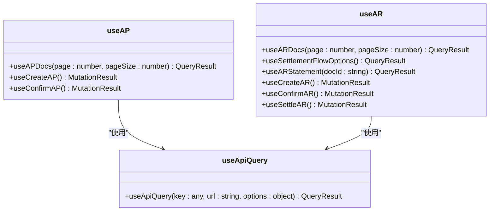
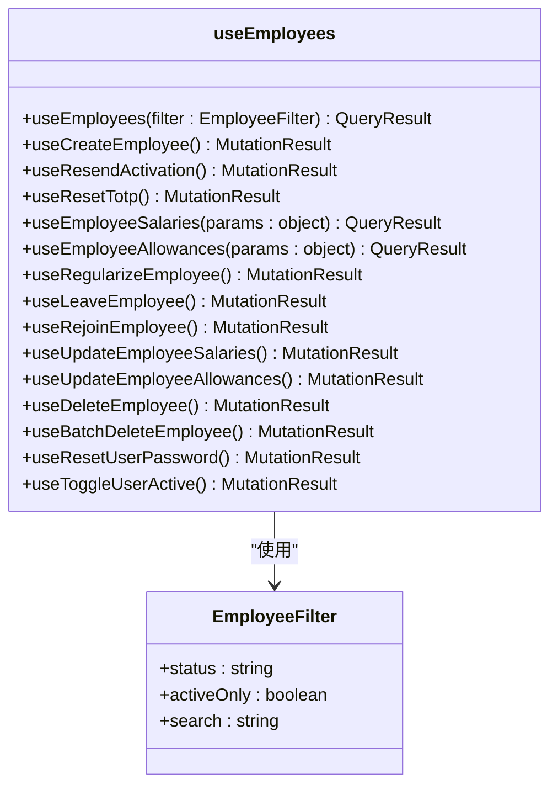
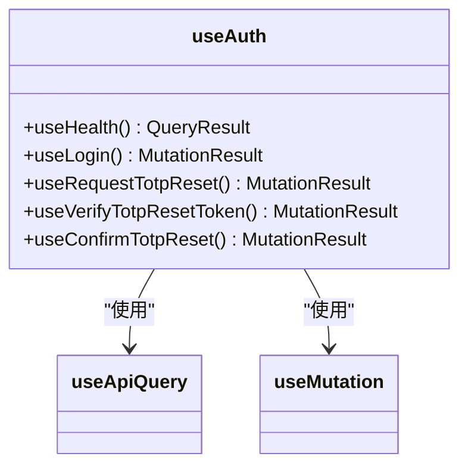
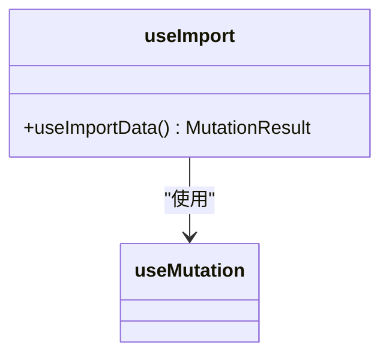
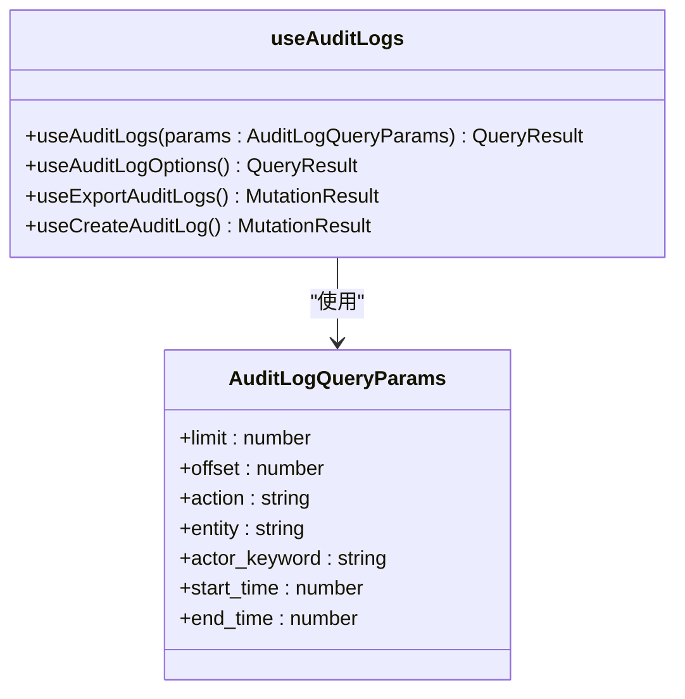
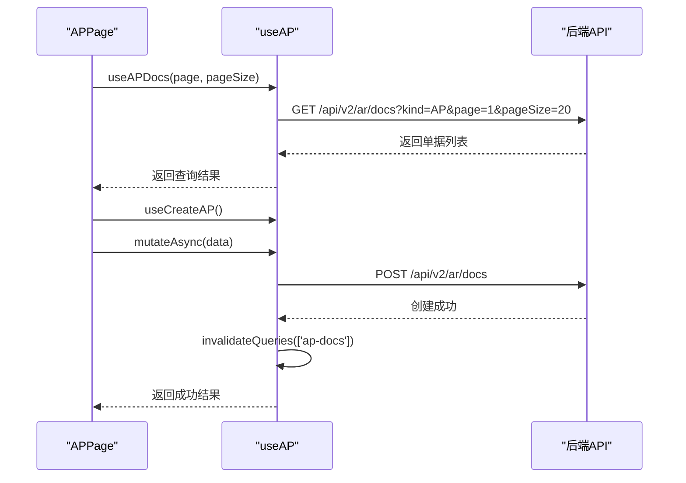
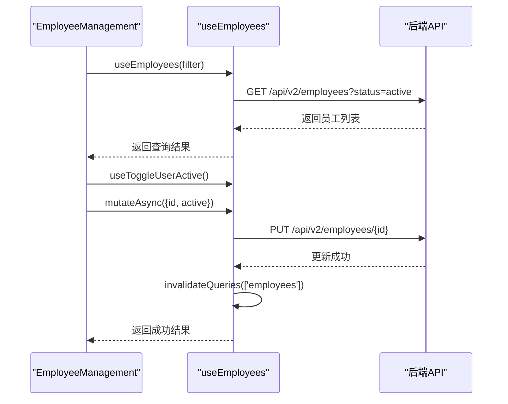
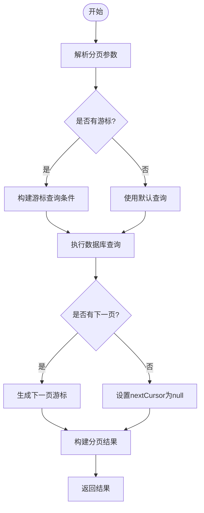
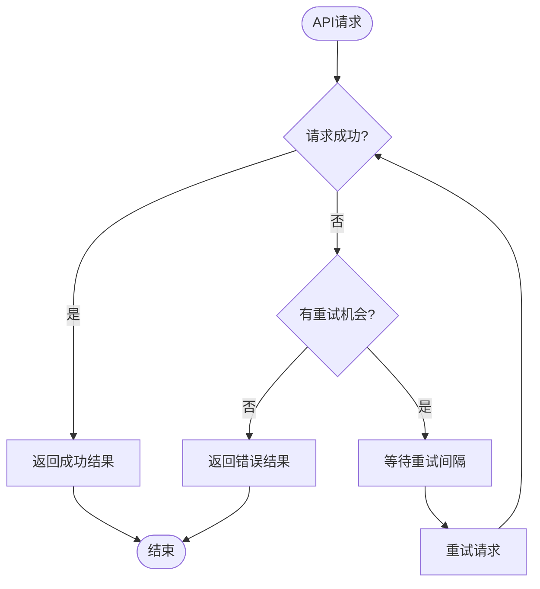

# 业务Hooks实现

<cite>
**本文档引用的文件**
- [useAP.ts](file://frontend/src/hooks/business/useAP.ts)
- [useAR.ts](file://frontend/src/hooks/business/useAR.ts)
- [useEmployees.ts](file://frontend/src/hooks/business/useEmployees.ts)
- [useAuth.ts](file://frontend/src/hooks/business/useAuth.ts)
- [useImport.ts](file://frontend/src/hooks/business/useImport.ts)
- [useAuditLogs.ts](file://frontend/src/hooks/business/useAuditLogs.ts)
- [useApiQuery.ts](file://frontend/src/utils/useApiQuery.ts)
- [api.ts](file://frontend/src/config/api.ts)
- [cache.ts](file://frontend/src/config/cache.ts)
- [business.ts](file://frontend/src/types/business.ts)
- [EmployeeManagementPage.tsx](file://frontend/src/features/hr/pages/EmployeeManagementPage.tsx)
- [APPage.tsx](file://frontend/src/features/finance/pages/APPage.tsx)
- [cursor-pagination.ts](file://backend/src/utils/cursor-pagination.ts)
- [cursor-pagination-example.ts](file://backend/src/utils/cursor-pagination-example.ts)
</cite>

## 目录
1. [简介](#简介)
2. [核心业务Hooks分析](#核心业务hooks分析)
3. [认证状态管理](#认证状态管理)
4. [文件上传与批量操作](#文件上传与批量操作)
5. [审计日志分页查询](#审计日志分页查询)
6. [Hook使用示例](#hook使用示例)
7. [分页参数与搜索过滤](#分页参数与搜索过滤)
8. [错误重试机制](#错误重试机制)
9. [总结](#总结)

## 简介
本文档深入分析财务系统中业务Hooks的实现模式，重点关注`useAP`、`useAR`、`useEmployees`等业务Hook的封装方式。这些Hook基于React Query的`useQuery`和`useMutation`构建，实现了数据获取、缓存、分页和乐观更新等核心功能。文档将详细说明这些Hook如何与后端API交互，以及它们在组件中的使用方式。

## 核心业务Hooks分析

### useAP和useAR Hook实现
`useAP`和`useAR` Hook用于管理应付（AP）和应收（AR）单据的业务逻辑。它们基于React Query的`useQuery`和`useMutation`构建，实现了数据获取、缓存和更新功能。

**Diagram sources**
- [useAP.ts](file://frontend/src/hooks/business/useAP.ts)
- [useAR.ts](file://frontend/src/hooks/business/useAR.ts)
- [useApiQuery.ts](file://frontend/src/utils/useApiQuery.ts)

**Section sources**
- [useAP.ts](file://frontend/src/hooks/business/useAP.ts)
- [useAR.ts](file://frontend/src/hooks/business/useAR.ts)

### useEmployees Hook实现
`useEmployees` Hook提供了员工管理的完整CRUD操作，包括创建、更新、删除员工，以及处理员工转正、离职、复职等特殊状态变更。

**Diagram sources**
- [useEmployees.ts](file://frontend/src/hooks/business/useEmployees.ts)

**Section sources**
- [useEmployees.ts](file://frontend/src/hooks/business/useEmployees.ts)

## 认证状态管理
`useAuth` Hook负责管理应用的认证状态，包括登录、健康检查、TOTP重置等功能。它使用`useMutation`处理登录等变更操作，因为这些操作不需要缓存。

**Diagram sources**
- [useAuth.ts](file://frontend/src/hooks/business/useAuth.ts)
- [useApiQuery.ts](file://frontend/src/utils/useApiQuery.ts)

**Section sources**
- [useAuth.ts](file://frontend/src/hooks/business/useAuth.ts)

## 文件上传与批量操作
`useImport` Hook处理文件上传和批量操作，支持CSV格式的数据导入。它使用`useMutation`来处理文件上传操作。

**Diagram sources**
- [useImport.ts](file://frontend/src/hooks/business/useImport.ts)

**Section sources**
- [useImport.ts](file://frontend/src/hooks/business/useImport.ts)

## 审计日志分页查询
`useAuditLogs` Hook实现了审计日志的分页查询功能，支持按操作、实体、时间范围等条件进行筛选。

**Diagram sources**
- [useAuditLogs.ts](file://frontend/src/hooks/business/useAuditLogs.ts)

**Section sources**
- [useAuditLogs.ts](file://frontend/src/hooks/business/useAuditLogs.ts)

## Hook使用示例
以下示例展示了如何在组件中使用这些业务Hook进行CRUD操作。

### AP管理页面使用示例
在AP管理页面中，`useAPDocs`用于获取应付单据列表，`useCreateAP`用于创建新的应付单据，`useConfirmAP`用于确认应付单据。

**Diagram sources**
- [APPage.tsx](file://frontend/src/features/finance/pages/APPage.tsx)
- [useAP.ts](file://frontend/src/hooks/business/useAP.ts)

**Section sources**
- [APPage.tsx](file://frontend/src/features/finance/pages/APPage.tsx)

### 员工管理页面使用示例
在员工管理页面中，`useEmployees`用于获取员工列表，`useToggleUserActive`用于启用/停用员工账号。

**Diagram sources**
- [EmployeeManagementPage.tsx](file://frontend/src/features/hr/pages/EmployeeManagementPage.tsx)
- [useEmployees.ts](file://frontend/src/hooks/business/useEmployees.ts)

**Section sources**
- [EmployeeManagementPage.tsx](file://frontend/src/features/hr/pages/EmployeeManagementPage.tsx)

## 分页参数与搜索过滤
系统实现了基于游标的分页机制，避免了传统offset分页在大数据量下的性能问题。

**Diagram sources**
- [cursor-pagination.ts](file://backend/src/utils/cursor-pagination.ts)
- [cursor-pagination-example.ts](file://backend/src/utils/cursor-pagination-example.ts)

**Section sources**
- [cursor-pagination.ts](file://backend/src/utils/cursor-pagination.ts)

## 错误重试机制
系统在`useApiQuery`中实现了错误重试机制，通过`retry`选项配置重试策略。

**Diagram sources**
- [useApiQuery.ts](file://frontend/src/utils/useApiQuery.ts)

**Section sources**
- [useApiQuery.ts](file://frontend/src/utils/useApiQuery.ts)

## 总结
本文档详细分析了财务系统中业务Hooks的实现模式。这些Hook基于React Query构建，实现了数据获取、缓存、分页和乐观更新等核心功能。通过统一的`useApiQuery`工具函数，系统实现了API调用的标准化和缓存策略的统一管理。各个业务Hook根据具体需求提供了相应的查询和变更操作，支持复杂的业务场景。游标分页机制解决了大数据量下的性能问题，而错误重试机制则提高了系统的健壮性。