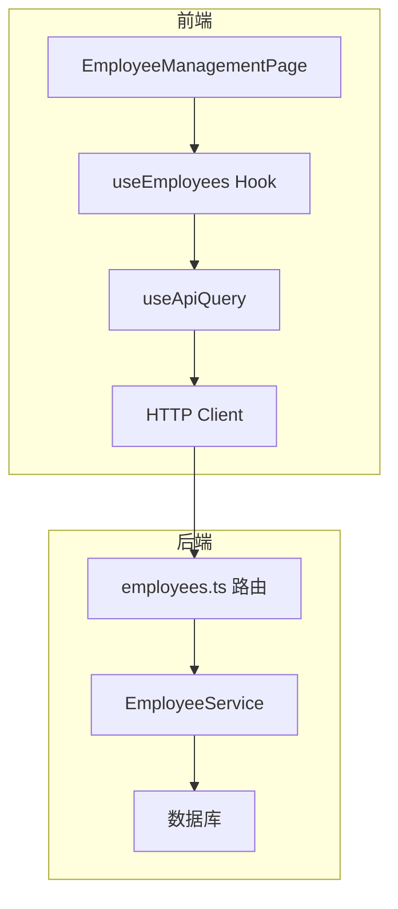
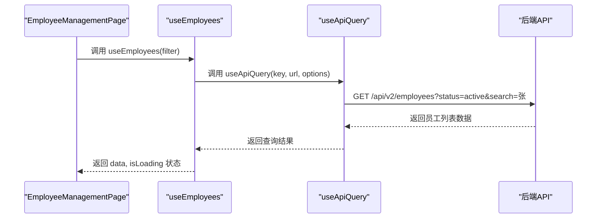
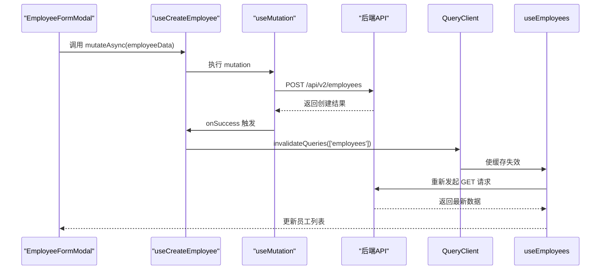
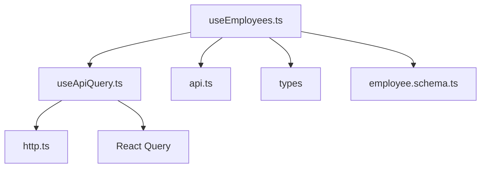

# 员工管理Hooks

<cite>
**本文档中引用的文件**  
- [useEmployees.ts](file://frontend/src/hooks/business/useEmployees.ts)
- [EmployeeManagementPage.tsx](file://frontend/src/features/hr/pages/EmployeeManagementPage.tsx)
- [EmployeeFormModal.tsx](file://frontend/src/features/employees/components/modals/EmployeeFormModal.tsx)
- [useApiQuery.ts](file://frontend/src/utils/useApiQuery.ts)
- [api.ts](file://frontend/src/config/api.ts)
- [employee.schema.ts](file://frontend/src/validations/employee.schema.ts)
- [DataTable.tsx](file://frontend/src/components/common/DataTable.tsx)
- [employees.ts](file://backend/src/routes/v2/employees.ts)
</cite>

## 目录
1. [简介](#简介)
2. [项目结构](#项目结构)
3. [核心组件](#核心组件)
4. [架构概述](#架构概述)
5. [详细组件分析](#详细组件分析)
6. [依赖分析](#依赖分析)
7. [性能考虑](#性能考虑)
8. [故障排除指南](#故障排除指南)
9. [结论](#结论)

## 简介
本文档全面阐述了 `useEmployees` Hook 的架构设计，涵盖员工列表查询、分页支持、搜索过滤以及员工创建、更新、删除操作的封装。深入解析其内部如何处理 cursor 分页、字段验证错误映射和状态刷新机制，并结合 `EmployeeManagementPage` 的使用案例，展示表单提交后如何自动刷新查询缓存。

## 项目结构
项目结构清晰地分为前端和后端两个主要部分。前端位于 `frontend/` 目录下，采用 React 框架，包含组件、页面、Hooks 和工具函数。后端位于 `backend/` 目录下，使用 Node.js 和 Hono 框架，负责 API 路由、数据库操作和业务逻辑处理。`useEmployees` Hook 位于前端的 `hooks/business/` 目录中，是连接前端 UI 和后端 API 的关键桥梁。

## 核心组件
`useEmployees` Hook 是前端员工管理功能的核心，它封装了所有与员工相关的数据获取和变更操作。通过 React Query 的 `useQuery` 和 `useMutation`，实现了数据的高效缓存、自动刷新和乐观更新。`EmployeeManagementPage` 则是该 Hook 的主要消费者，负责展示员工列表、处理用户交互并触发相应的 Hook 操作。

**Section sources**
- [useEmployees.ts](file://frontend/src/hooks/business/useEmployees.ts)
- [EmployeeManagementPage.tsx](file://frontend/src/features/hr/pages/EmployeeManagementPage.tsx)

## 架构概述
整个员工管理功能的架构遵循典型的前后端分离模式。前端通过 `useEmployees` Hook 发起 API 请求，后端在 `employees.ts` 路由文件中处理这些请求，并与数据库进行交互。React Query 作为状态管理库，负责管理前端的查询缓存，确保数据的一致性和实时性。

**Diagram sources**
- [useEmployees.ts](file://frontend/src/hooks/business/useEmployees.ts)
- [EmployeeManagementPage.tsx](file://frontend/src/features/hr/pages/EmployeeManagementPage.tsx)
- [employees.ts](file://backend/src/routes/v2/employees.ts)

## 详细组件分析

### useEmployees Hook 分析
`useEmployees` Hook 提供了一组完整的 CRUD 操作函数，包括 `useEmployees`（查询）、`useCreateEmployee`（创建）、`useUpdateEmployeeSalaries`（更新薪资）和 `useDeleteEmployee`（删除）等。

#### 查询与分页支持
`useEmployees` 函数利用 `useApiQuery` 来获取员工列表。它接受一个 `EmployeeFilter` 对象作为参数，将过滤条件（如状态、搜索关键词）转换为 URL 查询参数。虽然前端代码中未直接体现 cursor 分页，但后端的 `employees.ts` 路由文件中的 `listEmployeesRoute` 处理了查询请求，表明分页逻辑在后端实现。前端通过传递 `cursor` 参数来支持分页，但在此代码片段中未显示。

**Diagram sources**
- [useEmployees.ts](file://frontend/src/hooks/business/useEmployees.ts)
- [EmployeeManagementPage.tsx](file://frontend/src/features/hr/pages/EmployeeManagementPage.tsx)
- [useApiQuery.ts](file://frontend/src/utils/useApiQuery.ts)

#### 搜索与过滤
搜索和过滤功能通过 `EmployeeFilter` 接口实现。当用户在 `EmployeeManagementPage` 中输入搜索关键词或选择状态过滤器时，这些值会被传递给 `useEmployees` Hook。Hook 内部将这些值构造成 URL 查询参数，发送到后端进行过滤。

#### 增删改操作与状态刷新
所有变更操作（如创建、更新、删除）都通过 `useMutation` 实现。一个关键的设计是，在每个 `onSuccess` 回调中，都会调用 `queryClient.invalidateQueries({ queryKey: ['employees'] })`。这会立即使 `['employees']` 查询键的缓存失效，从而触发前端组件重新发起查询，实现数据的自动刷新。

**Diagram sources**
- [useEmployees.ts](file://frontend/src/hooks/business/useEmployees.ts)
- [EmployeeFormModal.tsx](file://frontend/src/features/employees/components/modals/EmployeeFormModal.tsx)
- [useApiQuery.ts](file://frontend/src/utils/useApiQuery.ts)

### 字段验证错误映射
字段验证主要在前端通过 Zod Schema 实现。`employee.schema.ts` 文件定义了 `createEmployeeSchema` 和 `updateEmployeeSchema`，对表单输入进行严格校验。例如，姓名不能为空，邮箱必须符合格式。当验证失败时，`useZodForm` 会捕获错误并映射到对应的表单字段，提供清晰的错误提示。

**Section sources**
- [useEmployees.ts](file://frontend/src/hooks/business/useEmployees.ts)
- [employee.schema.ts](file://frontend/src/validations/employee.schema.ts)
- [EmployeeFormModal.tsx](file://frontend/src/features/employees/components/modals/EmployeeFormModal.tsx)

### EmployeeManagementPage 使用案例
`EmployeeManagementPage` 是 `useEmployees` Hook 的典型应用。它通过 `const { data: employees = [], isLoading, refetch } = useEmployees(filter)` 获取员工数据，并将其传递给 `DataTable` 组件进行渲染。当用户提交表单创建新员工时，`EmployeeFormModal` 内部的 `handleCreate` 函数会调用 `useCreateEmployee` 的 `mutateAsync`，成功后自动刷新缓存，确保页面上的员工列表即时更新。

**Section sources**
- [EmployeeManagementPage.tsx](file://frontend/src/features/hr/pages/EmployeeManagementPage.tsx)
- [EmployeeFormModal.tsx](file://frontend/src/features/employees/components/modals/EmployeeFormModal.tsx)

## 依赖分析
`useEmployees` Hook 依赖于多个核心模块：
- **React Query**: 提供 `useQuery` 和 `useMutation`，是数据获取和变更的基础。
- **HTTP Client**: (`apiClient`) 负责与后端进行实际的网络通信。
- **API 配置**: (`api.ts`) 定义了所有 API 端点的 URL。
- **类型定义**: (`types`) 确保数据类型的安全性。
- **验证库**: (Zod) 用于表单验证。

**Diagram sources**
- [useEmployees.ts](file://frontend/src/hooks/business/useEmployees.ts)
- [useApiQuery.ts](file://frontend/src/utils/useApiQuery.ts)
- [api.ts](file://frontend/src/config/api.ts)

## 性能考虑
- **缓存策略**: `useApiQuery` 设置了 `staleTime: 5 * 60 * 1000`，即 5 分钟内数据被视为新鲜，减少了不必要的网络请求。
- **选择性获取**: `select` 选项用于从响应中提取所需数据，避免处理大型对象。
- **乐观更新**: 虽然代码中未直接使用，但 React Query 支持乐观更新，可以提升用户交互的流畅性。

## 故障排除指南
- **数据未刷新**: 检查 `onSuccess` 中是否调用了 `invalidateQueries`，并确认 `queryKey` 是否正确。
- **验证错误不显示**: 确认 `useZodForm` 是否正确集成，并检查 `handleConflictError` 是否处理了后端返回的冲突错误。
- **API 请求失败**: 检查网络连接、API 端点 URL 和请求参数是否正确。

**Section sources**
- [useEmployees.ts](file://frontend/src/hooks/business/useEmployees.ts)
- [errorHandler.ts](file://frontend/src/utils/errorHandler.ts)

## 结论
`useEmployees` Hook 通过封装 React Query，为员工管理功能提供了一个强大、高效且易于使用的数据访问层。它成功地将复杂的 API 交互、状态管理和错误处理抽象化，使得上层 UI 组件能够专注于用户交互和展示逻辑。结合 `EmployeeManagementPage` 的实践，展示了如何通过缓存失效机制实现数据的实时同步，是现代前端开发中状态管理的优秀范例。