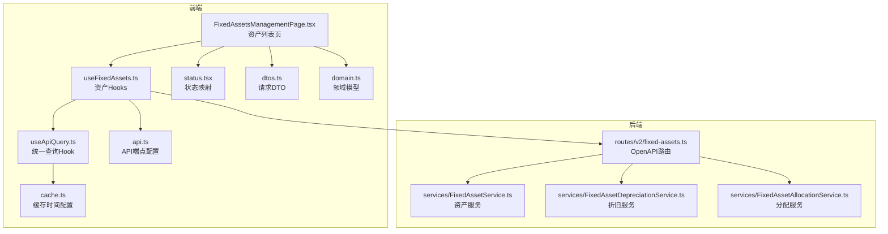
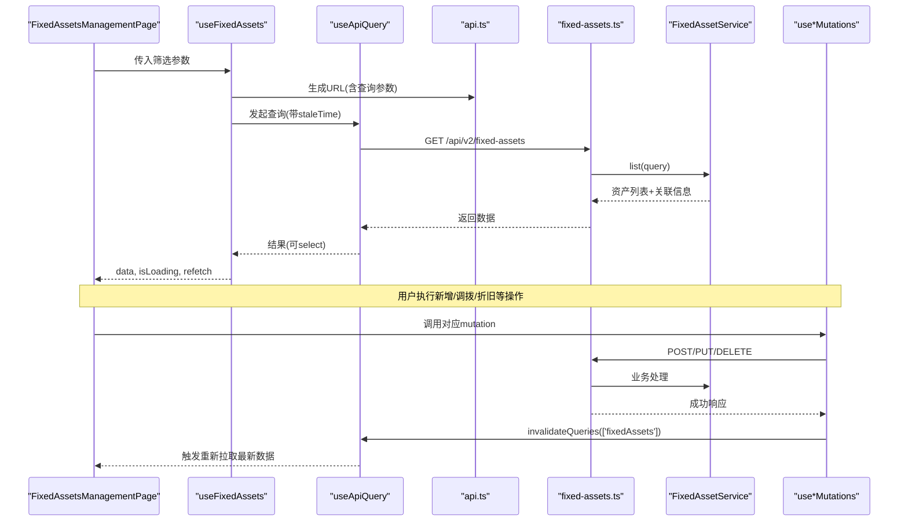
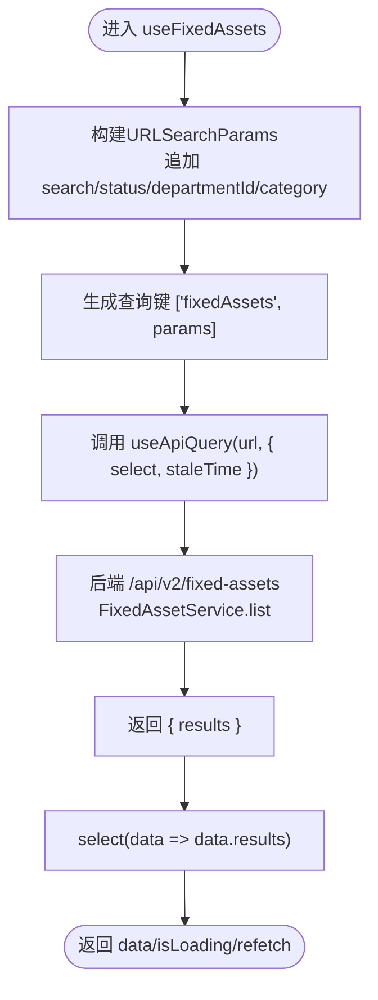
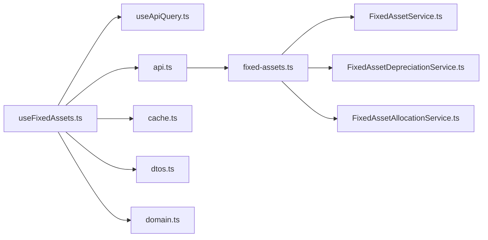

# 固定资产管理Hooks

<cite>
**本文引用的文件**
- [useFixedAssets.ts](file://frontend/src/hooks/business/useFixedAssets.ts)
- [FixedAssetsManagementPage.tsx](file://frontend/src/features/assets/pages/FixedAssetsManagementPage.tsx)
- [api.ts](file://frontend/src/config/api.ts)
- [useApiQuery.ts](file://frontend/src/utils/useApiQuery.ts)
- [cache.ts](file://frontend/src/config/cache.ts)
- [status.tsx](file://frontend/src/utils/status.tsx)
- [dtos.ts](file://frontend/src/types/dtos.ts)
- [domain.ts](file://frontend/src/types/domain.ts)
- [FixedAssetService.ts](file://backend/src/services/FixedAssetService.ts)
- [FixedAssetDepreciationService.ts](file://backend/src/services/FixedAssetDepreciationService.ts)
- [FixedAssetAllocationService.ts](file://backend/src/services/FixedAssetAllocationService.ts)
- [fixed-assets.ts](file://backend/src/routes/v2/fixed-assets.ts)
</cite>

## 目录
1. [简介](#简介)
2. [项目结构](#项目结构)
3. [核心组件](#核心组件)
4. [架构总览](#架构总览)
5. [详细组件分析](#详细组件分析)
6. [依赖关系分析](#依赖关系分析)
7. [性能考量](#性能考量)
8. [故障排查指南](#故障排查指南)
9. [结论](#结论)
10. [附录](#附录)

## 简介
本文件系统性阐述前端 useFixedAssets Hook 的实现细节与在 FixedAssetsManagementPage 中的应用方式，涵盖：
- 资产列表查询与筛选（关键词、状态、部门、类别）
- 分页加载与虚拟滚动配合
- 状态筛选与批量操作支持
- 集成 React Query 缓存机制以提升用户体验
- 资产新增、调拨、折旧等业务变更后的数据同步策略
- 在页面中的调用示例、分页参数传递与错误处理模式

## 项目结构
useFixedAssets Hook 位于前端业务层 hooks/business 下，页面组件位于 features/assets/pages 下，API 配置与缓存配置分别位于 config 与 utils 目录，类型定义位于 types 目录；后端固定资产管理接口与服务位于 backend/src/routes/v2 与 backend/src/services。

图表来源
- [useFixedAssets.ts](file://frontend/src/hooks/business/useFixedAssets.ts#L1-L200)
- [FixedAssetsManagementPage.tsx](file://frontend/src/features/assets/pages/FixedAssetsManagementPage.tsx#L1-L563)
- [api.ts](file://frontend/src/config/api.ts#L1-L188)
- [useApiQuery.ts](file://frontend/src/utils/useApiQuery.ts#L1-L103)
- [cache.ts](file://frontend/src/config/cache.ts#L1-L21)
- [status.tsx](file://frontend/src/utils/status.tsx#L82-L91)
- [dtos.ts](file://frontend/src/types/dtos.ts#L45-L94)
- [domain.ts](file://frontend/src/types/domain.ts#L1-L200)
- [fixed-assets.ts](file://backend/src/routes/v2/fixed-assets.ts#L113-L586)
- [FixedAssetService.ts](file://backend/src/services/FixedAssetService.ts#L25-L88)
- [FixedAssetDepreciationService.ts](file://backend/src/services/FixedAssetDepreciationService.ts#L1-L79)
- [FixedAssetAllocationService.ts](file://backend/src/services/FixedAssetAllocationService.ts#L23-L104)

章节来源
- [useFixedAssets.ts](file://frontend/src/hooks/business/useFixedAssets.ts#L1-L200)
- [FixedAssetsManagementPage.tsx](file://frontend/src/features/assets/pages/FixedAssetsManagementPage.tsx#L1-L563)
- [api.ts](file://frontend/src/config/api.ts#L136-L148)
- [useApiQuery.ts](file://frontend/src/utils/useApiQuery.ts#L1-L103)
- [cache.ts](file://frontend/src/config/cache.ts#L1-L21)
- [status.tsx](file://frontend/src/utils/status.tsx#L82-L91)
- [dtos.ts](file://frontend/src/types/dtos.ts#L45-L94)
- [domain.ts](file://frontend/src/types/domain.ts#L1-L200)
- [fixed-assets.ts](file://backend/src/routes/v2/fixed-assets.ts#L113-L586)
- [FixedAssetService.ts](file://backend/src/services/FixedAssetService.ts#L25-L88)
- [FixedAssetDepreciationService.ts](file://backend/src/services/FixedAssetDepreciationService.ts#L1-L79)
- [FixedAssetAllocationService.ts](file://backend/src/services/FixedAssetAllocationService.ts#L23-L104)

## 核心组件
- useFixedAssets(params): 构造查询参数并发起列表查询，返回数据、加载状态与刷新函数。支持关键词、状态、部门、类别筛选。
- useFixedAsset(id): 单条资产详情查询，按需启用。
- useCreateFixedAsset/useUpdateFixedAsset/useDeleteFixedAsset/useBatchDeleteFixedAsset: 资产增删改与批量删除。
- useTransferFixedAsset/useDepreciateFixedAsset/useAllocateFixedAsset/useReturnFixedAsset: 调拨、折旧、分配、归还。
- useFixedAssetAllocations(params): 资产分配记录查询，支持按员工、是否归还筛选。
- useFixedAssetPurchase/useFixedAssetSale: 购买与出售流程（后端事务封装）。

章节来源
- [useFixedAssets.ts](file://frontend/src/hooks/business/useFixedAssets.ts#L23-L200)

## 架构总览
前端通过 useApiQuery 封装 React Query，统一处理查询键、缓存时间、选择器与重试策略；useFixedAssets 将筛选参数转换为 URL 查询字符串，调用后端 /api/v2/fixed-assets 接口；后端 FixedAssetService.list 支持多条件过滤与排序，返回资产列表及关联信息；变更类操作通过 mutation 触发 API 并使相关查询失效，从而实现数据同步。

图表来源
- [FixedAssetsManagementPage.tsx](file://frontend/src/features/assets/pages/FixedAssetsManagementPage.tsx#L100-L117)
- [useFixedAssets.ts](file://frontend/src/hooks/business/useFixedAssets.ts#L23-L129)
- [useApiQuery.ts](file://frontend/src/utils/useApiQuery.ts#L11-L41)
- [api.ts](file://frontend/src/config/api.ts#L136-L148)
- [fixed-assets.ts](file://backend/src/routes/v2/fixed-assets.ts#L113-L140)
- [FixedAssetService.ts](file://backend/src/services/FixedAssetService.ts#L25-L88)

## 详细组件分析

### useFixedAssets 列表查询与筛选
- 参数构造：将 search、status、departmentId、category 转换为 URLSearchParams，拼接到 /api/v2/fixed-assets。
- 查询键：['fixedAssets', params]，确保不同筛选组合形成独立缓存键。
- 选择器：select(data => data.results)，适配后端 V2 响应结构。
- 缓存策略：staleTime 使用 BUSINESS_DATA（30分钟），兼顾性能与新鲜度。
- 返回值：data 为资产数组，isLoading 表示加载状态，refetch 支持手动刷新。

图表来源
- [useFixedAssets.ts](file://frontend/src/hooks/business/useFixedAssets.ts#L16-L40)
- [useApiQuery.ts](file://frontend/src/utils/useApiQuery.ts#L11-L41)
- [api.ts](file://frontend/src/config/api.ts#L136-L140)
- [FixedAssetService.ts](file://backend/src/services/FixedAssetService.ts#L25-L88)

章节来源
- [useFixedAssets.ts](file://frontend/src/hooks/business/useFixedAssets.ts#L16-L40)
- [useApiQuery.ts](file://frontend/src/utils/useApiQuery.ts#L11-L41)
- [cache.ts](file://frontend/src/config/cache.ts#L9-L11)
- [FixedAssetService.ts](file://backend/src/services/FixedAssetService.ts#L25-L88)

### 分页加载与虚拟表格
- 页面采用 VirtualTable 展示资产列表，通过 rowKey="id"、scroll 配置实现高性能渲染。
- 列表查询本身未显式传入分页参数，但后端 FixedAssetService.list 支持 limit/offset（默认 100/0），可结合后端分页方案扩展。
- 若需后端分页，建议在 useFixedAssets 中增加 page/size 参数并传递到 URLSearchParams，同时在 useApiQuery 中设置 keepPreviousData 以避免闪烁。

章节来源
- [FixedAssetsManagementPage.tsx](file://frontend/src/features/assets/pages/FixedAssetsManagementPage.tsx#L293-L360)
- [FixedAssetService.ts](file://backend/src/services/FixedAssetService.ts#L33-L58)

### 状态筛选与类别选项
- 页面提供状态与类别下拉筛选，状态映射来自 FIXED_ASSET_STATUS，类别来源于页面常量。
- useFixedAssets 支持 status 与 category 查询参数，后端 FixedAssetService.list 对应添加过滤条件。

章节来源
- [FixedAssetsManagementPage.tsx](file://frontend/src/features/assets/pages/FixedAssetsManagementPage.tsx#L45-L67)
- [status.tsx](file://frontend/src/utils/status.tsx#L82-L91)
- [useFixedAssets.ts](file://frontend/src/hooks/business/useFixedAssets.ts#L16-L21)
- [FixedAssetService.ts](file://backend/src/services/FixedAssetService.ts#L45-L47)

### 批量操作支持
- 页面通过 useTableActions 获取选中行，结合 useBatchOperation 封装批量删除逻辑。
- useBatchDeleteFixedAsset 调用 /api/v2/fixed-assets/batch，action 为 delete，成功后使 ['fixedAssets'] 查询失效，触发刷新。

章节来源
- [FixedAssetsManagementPage.tsx](file://frontend/src/features/assets/pages/FixedAssetsManagementPage.tsx#L202-L216)
- [useFixedAssets.ts](file://frontend/src/hooks/business/useFixedAssets.ts#L90-L103)

### React Query 缓存机制与数据同步
- 缓存时间：BUSINESS_DATA=30分钟，减少重复请求与网络开销。
- 选择器：select 将后端结果标准化为 results 数组，简化页面消费。
- 失效策略：各 mutation 成功回调中调用 invalidateQueries，使资产列表与详情查询失效，确保 UI 与后端一致。
- keepPreviousData：可在需要时开启以避免分页切换时的闪烁。

章节来源
- [useApiQuery.ts](file://frontend/src/utils/useApiQuery.ts#L11-L41)
- [cache.ts](file://frontend/src/config/cache.ts#L9-L11)
- [useFixedAssets.ts](file://frontend/src/hooks/business/useFixedAssets.ts#L53-L155)

### 业务变更后的数据同步
- 新增资产：useCreateFixedAsset 成功后失效 ['fixedAssets']，刷新列表。
- 更新资产：useUpdateFixedAsset 成功后失效 ['fixedAssets'] 与 ['fixedAsset', id]，保证列表与详情同步。
- 删除资产：useDeleteFixedAsset 成功后失效 ['fixedAssets']。
- 批量删除：useBatchDeleteFixedAsset 成功后失效 ['fixedAssets']。
- 调拨资产：useTransferFixedAsset 成功后失效 ['fixedAssets'] 与 ['fixedAsset', id]。
- 折旧记录：useDepreciateFixedAsset 成功后失效 ['fixedAssets'] 与 ['fixedAsset', id]。
- 分配/归还：useAllocateFixedAsset 与 useReturnFixedAsset 成功后失效 ['fixedAssets'] 与 ['fixedAssetsAllocations']。

章节来源
- [useFixedAssets.ts](file://frontend/src/hooks/business/useFixedAssets.ts#L53-L155)

### 后端接口与服务支撑
- 列表接口：/api/v2/fixed-assets，支持 search、status、departmentId、category 等查询参数；返回 results。
- 详情接口：/api/v2/fixed-assets/{id}，返回资产详情及折旧、变更记录。
- 折旧接口：/api/v2/fixed-assets/{id}/depreciations，创建折旧记录并更新资产净值。
- 分配接口：/api/v2/fixed-assets/{id}/allocate、/api/v2/fixed-assets/allocations/{id}/return，管理资产分配与归还。
- 购买/出售：/api/v2/fixed-assets/purchase、/api/v2/fixed-assets/{id}/sale，后端封装财务流水与变更日志。

章节来源
- [fixed-assets.ts](file://backend/src/routes/v2/fixed-assets.ts#L113-L586)
- [FixedAssetService.ts](file://backend/src/services/FixedAssetService.ts#L25-L88)
- [FixedAssetDepreciationService.ts](file://backend/src/services/FixedAssetDepreciationService.ts#L1-L79)
- [FixedAssetAllocationService.ts](file://backend/src/services/FixedAssetAllocationService.ts#L23-L104)

### 在 FixedAssetsManagementPage 中的调用示例
- 传入筛选参数：search、status、department、category，通过 setSearchParams 与 refetch 控制刷新。
- 错误处理模式：页面对表单校验与 API 错误采用 try/catch 与 message 提示；mutation 成功回调中统一 refetch 与提示。
- 批量删除：通过 useBatchOperation 封装，统一 onSuccess 与错误消息。

章节来源
- [FixedAssetsManagementPage.tsx](file://frontend/src/features/assets/pages/FixedAssetsManagementPage.tsx#L99-L117)
- [FixedAssetsManagementPage.tsx](file://frontend/src/features/assets/pages/FixedAssetsManagementPage.tsx#L202-L216)

## 依赖关系分析
- useFixedAssets 依赖：
  - useApiQuery：统一查询与缓存
  - api.ts：API 端点
  - cache.ts：缓存时间
  - dtos.ts：请求 DTO 类型
  - domain.ts：资产类型
- 后端依赖：
  - FixedAssetService.list：多条件过滤与关联数据聚合
  - FixedAssetDepreciationService：折旧计算与资产净值更新
  - FixedAssetAllocationService：分配与归还流程

图表来源
- [useFixedAssets.ts](file://frontend/src/hooks/business/useFixedAssets.ts#L1-L200)
- [useApiQuery.ts](file://frontend/src/utils/useApiQuery.ts#L1-L103)
- [api.ts](file://frontend/src/config/api.ts#L136-L148)
- [cache.ts](file://frontend/src/config/cache.ts#L1-L21)
- [dtos.ts](file://frontend/src/types/dtos.ts#L45-L94)
- [domain.ts](file://frontend/src/types/domain.ts#L1-L200)
- [fixed-assets.ts](file://backend/src/routes/v2/fixed-assets.ts#L113-L586)
- [FixedAssetService.ts](file://backend/src/services/FixedAssetService.ts#L25-L88)
- [FixedAssetDepreciationService.ts](file://backend/src/services/FixedAssetDepreciationService.ts#L1-L79)
- [FixedAssetAllocationService.ts](file://backend/src/services/FixedAssetAllocationService.ts#L23-L104)

## 性能考量
- 缓存时间：BUSINESS_DATA=30分钟，适合资产这类变化频率较低的数据。
- keepPreviousData：在分页场景可减少闪烁，提升体验。
- select：将后端结果标准化为 results，降低页面解析成本。
- 虚拟表格：VirtualTable 在大数据量下显著降低 DOM 渲染压力。
- 批量操作：批量删除通过一次请求完成，减少多次无效刷新。

[本节为通用指导，无需列出具体文件来源]

## 故障排查指南
- 列表不刷新：确认 mutation 成功回调中是否调用了 invalidateQueries(['fixedAssets'])。
- 详情不更新：确认更新/调拨/折旧等 mutation 是否失效了 ['fixedAsset', id]。
- 筛选无效：检查 useFixedAssets 中是否正确拼接了查询参数，以及后端 FixedAssetService.list 是否包含相应过滤条件。
- 折旧异常：若折旧金额超过购买价格，后端会拒绝；检查前端输入与后端错误提示。
- 分配/归还异常：资产状态需为 in_use/idle，且同一资产不可重复分配；检查资产状态与分配记录。

章节来源
- [useFixedAssets.ts](file://frontend/src/hooks/business/useFixedAssets.ts#L53-L155)
- [FixedAssetDepreciationService.ts](file://backend/src/services/FixedAssetDepreciationService.ts#L42-L47)
- [FixedAssetAllocationService.ts](file://backend/src/services/FixedAssetAllocationService.ts#L120-L151)

## 结论
useFixedAssets Hook 通过 React Query 实现了稳定的资产列表查询与缓存，结合后端多条件过滤与关联数据聚合，满足了关键词、状态、部门、类别等筛选需求；通过一系列 mutation 与查询失效策略，实现了资产新增、调拨、折旧、分配、归还等业务变更后的数据同步；在 FixedAssetsManagementPage 中，通过分页参数传递与批量操作封装，提供了良好的用户体验与可维护性。

[本节为总结性内容，无需列出具体文件来源]

## 附录
- 关键类型与DTO
  - CreateFixedAssetDTO/UpdateFixedAssetDTO/TransferFixedAssetDTO/DepreciateFixedAssetDTO/AllocateFixedAssetDTO/ReturnFixedAssetDTO
- 状态映射
  - FIXED_ASSET_STATUS：in_use/idle/maintenance/scrapped/sold

章节来源
- [dtos.ts](file://frontend/src/types/dtos.ts#L45-L94)
- [status.tsx](file://frontend/src/utils/status.tsx#L82-L91)