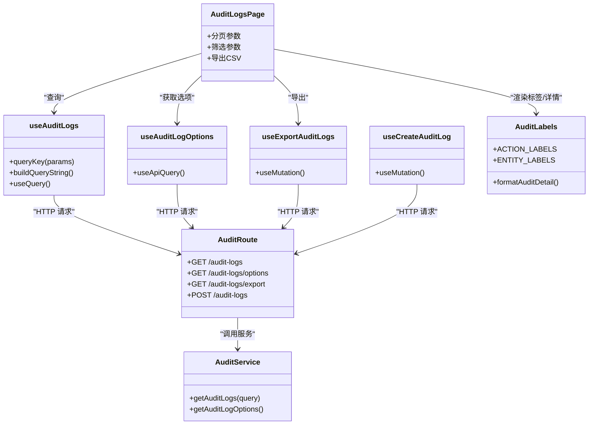

# 审计日志Hooks

<cite>
**本文引用的文件**
- [useAuditLogs.ts](file://frontend/src/hooks/business/useAuditLogs.ts)
- [AuditLogsPage.tsx](file://frontend/src/features/system/pages/AuditLogsPage.tsx)
- [audit.ts](file://backend/src/routes/v2/audit.ts)
- [AuditService.ts](file://backend/src/services/AuditService.ts)
- [api.ts](file://frontend/src/config/api.ts)
- [auditLabels.ts](file://frontend/src/config/auditLabels.ts)
- [common.schema.ts](file://backend/src/schemas/common.schema.ts)
- [audit.ts](file://backend/src/utils/audit.ts)
- [schema.ts](file://backend/src/db/schema.ts)
- [useApiQuery.ts](file://frontend/src/utils/useApiQuery.ts)
- [cache.ts](file://frontend/src/config/cache.ts)
</cite>

## 目录
1. [简介](#简介)
2. [项目结构](#项目结构)
3. [核心组件](#核心组件)
4. [架构总览](#架构总览)
5. [详细组件分析](#详细组件分析)
6. [依赖关系分析](#依赖关系分析)
7. [性能考量](#性能考量)
8. [故障排查指南](#故障排查指南)
9. [结论](#结论)
10. [附录](#附录)

## 简介
本文件系统性阐述前端 useAuditLogs Hook 的实现机制，重点覆盖：
- 审计日志的分页查询、操作类型过滤、对象类型过滤、操作人关键词过滤、时间范围筛选
- 大规模日志数据的高效加载策略
- 与后端审计服务的数据接口规范
- AuditLogsPage 页面中的使用场景，以及日志详情查看与导出功能的集成方式

该实现采用前端 React Query 管理状态与缓存，后端基于 Hono + Drizzle ORM 提供 REST 接口与数据库查询，前后端通过统一的查询参数与响应结构协同工作。

## 项目结构
围绕审计日志的核心文件分布如下：
- 前端
  - Hooks：useAuditLogs.ts
  - 页面：AuditLogsPage.tsx
  - API 配置：api.ts
  - 标签与格式化：auditLabels.ts
  - 通用查询 Hook：useApiQuery.ts
  - 缓存配置：cache.ts
- 后端
  - 路由：routes/v2/audit.ts
  - 服务：services/AuditService.ts
  - 数据库 Schema：db/schema.ts
  - 通用 Schema：schemas/common.schema.ts
  - 审计工具：utils/audit.ts

图表来源
- [useAuditLogs.ts](file://frontend/src/hooks/business/useAuditLogs.ts#L1-L116)
- [AuditLogsPage.tsx](file://frontend/src/features/system/pages/AuditLogsPage.tsx#L1-L192)
- [api.ts](file://frontend/src/config/api.ts#L80-L84)
- [auditLabels.ts](file://frontend/src/config/auditLabels.ts#L1-L263)
- [useApiQuery.ts](file://frontend/src/utils/useApiQuery.ts#L1-L103)
- [cache.ts](file://frontend/src/config/cache.ts#L1-L21)
- [audit.ts](file://backend/src/routes/v2/audit.ts#L1-L224)
- [AuditService.ts](file://backend/src/services/AuditService.ts#L1-L277)
- [schema.ts](file://backend/src/db/schema.ts#L675-L692)
- [common.schema.ts](file://backend/src/schemas/common.schema.ts#L193-L206)
- [audit.ts](file://backend/src/utils/audit.ts#L1-L90)

章节来源
- [useAuditLogs.ts](file://frontend/src/hooks/business/useAuditLogs.ts#L1-L116)
- [AuditLogsPage.tsx](file://frontend/src/features/system/pages/AuditLogsPage.tsx#L1-L192)
- [audit.ts](file://backend/src/routes/v2/audit.ts#L1-L224)

## 核心组件
- useAuditLogs(params)
  - 功能：封装审计日志列表查询，支持 limit/offset 分页与多维过滤（action、entity、actor_keyword、start_time、end_time）
  - 返回：React Query 查询对象，含 data、isLoading、refetch 等
  - 关键点：queryKey 包含完整 params；使用 keepPreviousData 减少闪烁；staleTime 依据缓存策略
- useAuditLogOptions()
  - 功能：获取审计日志筛选选项（操作类型、对象类型、操作人）
  - 返回：React Query 查询对象，含 actions/entities/actors
- useExportAuditLogs()
  - 功能：导出 CSV，后端按固定上限拉取并生成 CSV
  - 返回：React Query Mutation，调用后端 /audit-logs/export
- useCreateAuditLog()
  - 功能：记录审计日志（幂等、失败不阻塞）
  - 返回：React Query Mutation

章节来源
- [useAuditLogs.ts](file://frontend/src/hooks/business/useAuditLogs.ts#L1-L116)

## 架构总览
从前端到后端的数据流如下：
- 前端页面 AuditLogsPage 构造查询参数（分页+过滤），调用 useAuditLogs 获取数据
- useAuditLogs 将参数编码为 URL 查询串，请求后端 /api/v2/audit-logs
- 后端路由校验权限，调用 AuditService 执行数据库查询，返回 results + total
- 页面渲染表格、分页器与导出按钮，导出时调用 /api/v2/audit-logs/export

图表来源
- [AuditLogsPage.tsx](file://frontend/src/features/system/pages/AuditLogsPage.tsx#L12-L192)
- [useAuditLogs.ts](file://frontend/src/hooks/business/useAuditLogs.ts#L39-L70)
- [audit.ts](file://backend/src/routes/v2/audit.ts#L27-L60)
- [AuditService.ts](file://backend/src/services/AuditService.ts#L170-L242)
- [schema.ts](file://backend/src/db/schema.ts#L675-L692)

## 详细组件分析

### useAuditLogs Hook 分析
- 参数与查询键
  - queryKey 为数组 ['auditLogs', params]，确保参数变化触发重新查询
  - URL 查询串包含 limit、offset、action、entity、actor_keyword、start_time、end_time
- 查询逻辑
  - 使用 useQuery + keepPreviousData，避免翻页时闪烁
  - staleTime 使用 TRANSACTION_DATA 缓存策略，平衡实时性与性能
- 返回数据
  - 返回 { results, total }，供页面渲染与分页控件使用

图表来源
- [useAuditLogs.ts](file://frontend/src/hooks/business/useAuditLogs.ts#L39-L70)

章节来源
- [useAuditLogs.ts](file://frontend/src/hooks/business/useAuditLogs.ts#L1-L116)
- [useApiQuery.ts](file://frontend/src/utils/useApiQuery.ts#L1-L41)
- [cache.ts](file://frontend/src/config/cache.ts#L1-L21)

### useAuditLogOptions Hook 分析
- 作用：获取可选的操作类型、对象类型与操作人列表，用于前端筛选器下拉
- 缓存：MASTER_DATA 缓存 1 小时，降低选项请求频率
- 返回：{ actions, entities, actors }

章节来源
- [useAuditLogs.ts](file://frontend/src/hooks/business/useAuditLogs.ts#L72-L83)
- [cache.ts](file://frontend/src/config/cache.ts#L1-L21)

### useExportAuditLogs Hook 分析
- 作用：导出 CSV 文件
- 参数：不包含 limit/offset，后端默认拉取上限并生成 CSV
- 响应：Blob 类型，前端下载
- 权限：需要 export 权限

图表来源
- [AuditLogsPage.tsx](file://frontend/src/features/system/pages/AuditLogsPage.tsx#L38-L54)
- [useAuditLogs.ts](file://frontend/src/hooks/business/useAuditLogs.ts#L85-L102)
- [audit.ts](file://backend/src/routes/v2/audit.ts#L102-L174)
- [AuditService.ts](file://backend/src/services/AuditService.ts#L170-L242)

章节来源
- [useAuditLogs.ts](file://frontend/src/hooks/business/useAuditLogs.ts#L85-L102)
- [audit.ts](file://backend/src/routes/v2/audit.ts#L102-L174)

### AuditLogsPage 页面集成
- 分页与查询
  - 通过 pagination.current/pageSize 计算 limit/offset
  - filters 支持 action、entity、actor_keyword、timeRange（起止时间）
- 列渲染
  - 时间、操作人、动作、对象类型、对象ID、详情、IP 地址与归属地
  - 使用 auditLabels 映射中文标签与颜色
- 导出
  - 调用 useExportAuditLogs，下载 CSV

章节来源
- [AuditLogsPage.tsx](file://frontend/src/features/system/pages/AuditLogsPage.tsx#L1-L192)
- [auditLabels.ts](file://frontend/src/config/auditLabels.ts#L1-L263)

### 后端审计服务与接口规范

#### 路由与权限
- GET /api/v2/audit-logs
  - 权限：system.audit.view
  - 请求体：查询参数（见下节）
  - 响应：{ success: boolean, data: { results: [], total: number } }
- GET /api/v2/audit-logs/options
  - 权限：system.audit.view
  - 响应：{ actions: string[], entities: string[], actors: [{ id, name, email }] }
- GET /api/v2/audit-logs/export
  - 权限：system.audit.export
  - 请求体：同上，后端强制 limit=10000, offset=0
  - 响应：text/csv（UTF-8 + BOM）
- POST /api/v2/audit-logs
  - 权限：需要登录（userId）
  - 请求体：{ action, entity, entityId?, detail? }
  - 响应：{ ok: boolean }

章节来源
- [audit.ts](file://backend/src/routes/v2/audit.ts#L27-L224)

#### 查询参数与校验
- 前端传递的参数
  - limit: number（默认 20，后端限制最大 1000）
  - offset: number
  - action: string?
  - entity: string?
  - actor_keyword: string?（前端字段名，后端 schema 中为 actorKeyword）
  - start_time: number?（毫秒时间戳）
  - end_time: number?（毫秒时间戳）
- 后端 Schema 校验
  - action: string?
  - entity: string?
  - actorId: uuid?
  - actorKeyword: string?
  - startTime: number?
  - endTime: number?
  - limit: 1..1000
  - offset: >=0

章节来源
- [useAuditLogs.ts](file://frontend/src/hooks/business/useAuditLogs.ts#L26-L34)
- [common.schema.ts](file://backend/src/schemas/common.schema.ts#L193-L206)

#### 服务层实现要点
- 条件构建
  - action、entity、actorId、actor_keyword（模糊匹配员工姓名/邮箱）、start_time、end_time
- 排序与分页
  - 按 at 降序，limit/offset
- 总数统计
  - 单独执行 COUNT 统计，保证 total 正确
- 详情解析
  - detail 字段为 JSON，前端格式化为可读文本

章节来源
- [AuditService.ts](file://backend/src/services/AuditService.ts#L170-L242)
- [schema.ts](file://backend/src/db/schema.ts#L675-L692)

#### 审计日志记录工具
- 日志记录入口：logAuditAction
  - 从请求头提取 IP 与归属地
  - 优先使用 userId，否则尝试从会话恢复
  - 在 Cloudflare 上下文中使用 waitUntil 异步记录，不影响主流程

章节来源
- [audit.ts](file://backend/src/utils/audit.ts#L1-L90)

## 依赖关系分析

图表来源
- [AuditLogsPage.tsx](file://frontend/src/features/system/pages/AuditLogsPage.tsx#L1-L192)
- [useAuditLogs.ts](file://frontend/src/hooks/business/useAuditLogs.ts#L1-L116)
- [audit.ts](file://backend/src/routes/v2/audit.ts#L1-L224)
- [AuditService.ts](file://backend/src/services/AuditService.ts#L1-L277)
- [auditLabels.ts](file://frontend/src/config/auditLabels.ts#L1-L263)

章节来源
- [AuditLogsPage.tsx](file://frontend/src/features/system/pages/AuditLogsPage.tsx#L1-L192)
- [useAuditLogs.ts](file://frontend/src/hooks/business/useAuditLogs.ts#L1-L116)
- [audit.ts](file://backend/src/routes/v2/audit.ts#L1-L224)
- [AuditService.ts](file://backend/src/services/AuditService.ts#L1-L277)
- [auditLabels.ts](file://frontend/src/config/auditLabels.ts#L1-L263)

## 性能考量
- 分页与缓存
  - 前端使用 keepPreviousData，减少翻页闪烁
  - staleTime 采用 TRANSACTION_DATA（5 分钟），兼顾实时性与缓存命中
- 查询优化
  - 后端按 at、entityId 建有索引，排序与过滤走索引
  - 导出接口限制最大拉取量（10000），避免超大数据集一次性导出
- 前端渲染
  - 使用虚拟表格组件（如 VirtualTable）可进一步提升大数据渲染性能（页面中已引入）

章节来源
- [useAuditLogs.ts](file://frontend/src/hooks/business/useAuditLogs.ts#L61-L70)
- [cache.ts](file://frontend/src/config/cache.ts#L1-L21)
- [schema.ts](file://backend/src/db/schema.ts#L675-L692)
- [audit.ts](file://backend/src/routes/v2/audit.ts#L117-L174)

## 故障排查指南
- 无数据或总数异常
  - 检查时间范围是否合理（start_time <= end_time）
  - 确认 actor_keyword 是否匹配员工姓名/邮箱
- 导出失败
  - 确认当前用户具备 system.audit.export 权限
  - 检查网络与后端响应头 Content-Type 是否为 text/csv
- 日志详情不可读
  - 后端 detail 为 JSON，前端格式化失败时回退原文
- 记录审计日志失败
  - 后端记录可能因上下文缺失（userId/session）而跳过，属预期行为

章节来源
- [audit.ts](file://backend/src/routes/v2/audit.ts#L117-L174)
- [AuditService.ts](file://backend/src/services/AuditService.ts#L170-L242)
- [auditLabels.ts](file://frontend/src/config/auditLabels.ts#L200-L236)

## 结论
useAuditLogs Hook 通过清晰的参数体系与 React Query 的缓存策略，实现了对审计日志的高效分页查询与多维过滤。配合 AuditLogsPage 的筛选与导出能力，满足了日常审计与合规需求。后端以 Drizzle ORM 与索引优化支撑了大规模数据的稳定查询，同时提供导出接口与权限控制，保障数据安全与可用性。

## 附录

### 前端 API 配置
- /api/v2/audit-logs
- /api/v2/audit-logs/options
- /api/v2/audit-logs/export
- /api/v2/audit-logs（POST）

章节来源
- [api.ts](file://frontend/src/config/api.ts#L80-L84)

### 前端类型与常量
- AuditLog 接口字段：id、at、actorName、actorEmail、action、entity、entityId、detail、ip、ipLocation
- AuditLogQueryParams：limit、offset、action、entity、actor_keyword、start_time、end_time
- 缓存时间：TRANSACTION_DATA（5 分钟）

章节来源
- [useAuditLogs.ts](file://frontend/src/hooks/business/useAuditLogs.ts#L7-L34)
- [cache.ts](file://frontend/src/config/cache.ts#L1-L21)