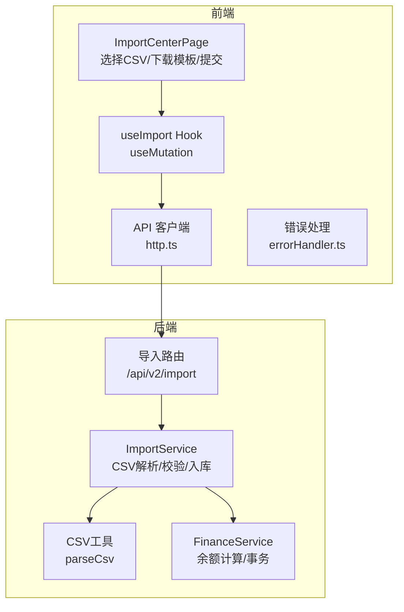
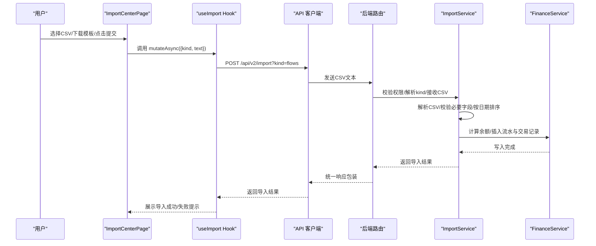
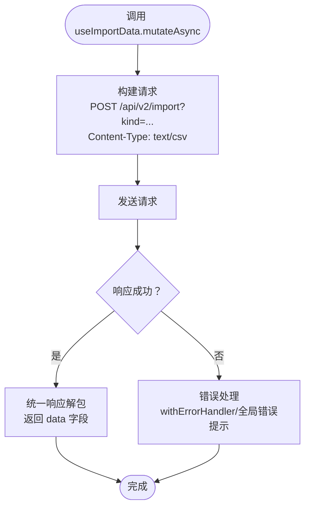
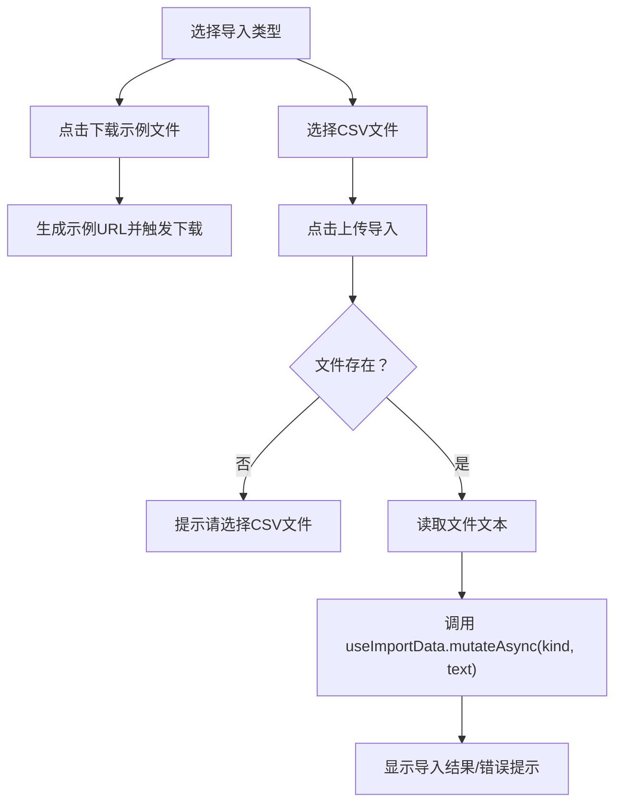
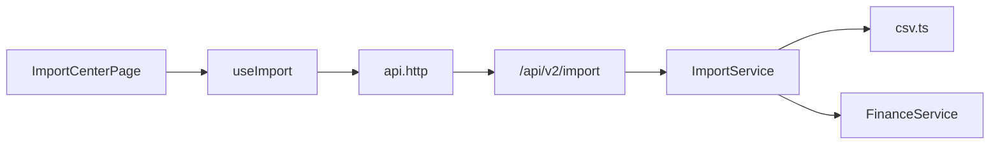

# 导入功能Hooks

<cite>
**本文引用的文件列表**
- [frontend/src/hooks/business/useImport.ts](file://frontend/src/hooks/business/useImport.ts)
- [frontend/src/features/finance/pages/ImportCenterPage.tsx](file://frontend/src/features/finance/pages/ImportCenterPage.tsx)
- [frontend/src/config/api.ts](file://frontend/src/config/api.ts)
- [frontend/src/api/http.ts](file://frontend/src/api/http.ts)
- [frontend/src/utils/errorHandler.ts](file://frontend/src/utils/errorHandler.ts)
- [backend/src/routes/v2/import.ts](file://backend/src/routes/v2/import.ts)
- [backend/src/services/ImportService.ts](file://backend/src/services/ImportService.ts)
- [backend/src/utils/csv.ts](file://backend/src/utils/csv.ts)
- [backend/src/services/FinanceService.ts](file://backend/src/services/FinanceService.ts)
- [backend/test/services/ImportService.test.ts](file://backend/test/services/ImportService.test.ts)
- [frontend/public/examples/import-flows-example.csv](file://frontend/public/examples/import-flows-example.csv)
</cite>

## 目录
1. [简介](#简介)
2. [项目结构](#项目结构)
3. [核心组件](#核心组件)
4. [架构总览](#架构总览)
5. [详细组件分析](#详细组件分析)
6. [依赖关系分析](#依赖关系分析)
7. [性能考量](#性能考量)
8. [故障排查指南](#故障排查指南)
9. [结论](#结论)
10. [附录](#附录)

## 简介
本文件系统性阐述 useImport Hook 的设计与实现，覆盖文件上传、CSV 解析、批量数据校验与导入进度跟踪等能力；并结合 ImportCenterPage 的实际应用，展示导入模板下载、预览与提交的完整交互流程。文档同时说明如何处理大文件分块上传、错误反馈收集与导入结果通知，帮助读者快速理解前端 Hook 与后端服务的协作方式。

## 项目结构
导入功能由前端 Hook、页面组件、API 客户端与后端路由/服务共同组成：
- 前端
  - useImport Hook：封装导入请求的 React Query 变更（mutation），负责将 CSV 文本以指定 kind 发送到后端。
  - ImportCenterPage 页面：提供模板下载、文件选择、字段说明与提交入口。
  - API 客户端与错误处理：统一封装网络请求、鉴权头注入、统一响应解包与错误提示。
- 后端
  - 路由层：校验权限、解析查询参数 kind、接收 CSV 文本并转发至服务层。
  - 服务层：解析 CSV、校验必要字段、按日期排序、逐条插入流水与交易记录、计算余额。
  - 工具层：基础 CSV 解析工具。



图表来源
- [frontend/src/features/finance/pages/ImportCenterPage.tsx](file://frontend/src/features/finance/pages/ImportCenterPage.tsx#L1-L87)
- [frontend/src/hooks/business/useImport.ts](file://frontend/src/hooks/business/useImport.ts#L1-L15)
- [frontend/src/config/api.ts](file://frontend/src/config/api.ts#L1-L188)
- [frontend/src/api/http.ts](file://frontend/src/api/http.ts#L1-L116)
- [frontend/src/utils/errorHandler.ts](file://frontend/src/utils/errorHandler.ts#L1-L178)
- [backend/src/routes/v2/import.ts](file://backend/src/routes/v2/import.ts#L1-L84)
- [backend/src/services/ImportService.ts](file://backend/src/services/ImportService.ts#L1-L126)
- [backend/src/utils/csv.ts](file://backend/src/utils/csv.ts#L1-L15)
- [backend/src/services/FinanceService.ts](file://backend/src/services/FinanceService.ts#L1-L200)

章节来源
- [frontend/src/features/finance/pages/ImportCenterPage.tsx](file://frontend/src/features/finance/pages/ImportCenterPage.tsx#L1-L87)
- [frontend/src/hooks/business/useImport.ts](file://frontend/src/hooks/business/useImport.ts#L1-L15)
- [frontend/src/config/api.ts](file://frontend/src/config/api.ts#L1-L188)
- [frontend/src/api/http.ts](file://frontend/src/api/http.ts#L1-L116)
- [frontend/src/utils/errorHandler.ts](file://frontend/src/utils/errorHandler.ts#L1-L178)
- [backend/src/routes/v2/import.ts](file://backend/src/routes/v2/import.ts#L1-L84)
- [backend/src/services/ImportService.ts](file://backend/src/services/ImportService.ts#L1-L126)
- [backend/src/utils/csv.ts](file://backend/src/utils/csv.ts#L1-L15)
- [backend/src/services/FinanceService.ts](file://backend/src/services/FinanceService.ts#L1-L200)

## 核心组件
- useImport Hook：基于 React Query 的 useMutation，封装导入请求，将 CSV 文本以 text/csv 形式 POST 到后端 /api/v2/import，携带 kind 查询参数。
- ImportCenterPage 页面：提供导入类别选择、模板下载、文件选择、字段说明与提交按钮；提交时读取文件文本并通过 useImportData 触发导入。
- API 客户端：统一封装 fetch 请求、鉴权头注入、统一响应解包、错误提示与 401 登出逻辑。
- 错误处理：withErrorHandler 包装器统一处理成功/失败提示与回调，避免重复样板代码。
- 后端路由：校验权限、解析 kind、接收 CSV 文本并调用服务层。
- 服务层：CSV 解析、必要字段校验、按日期排序、逐条插入流水与交易记录、计算余额。
- 工具层：parseCsv 简易 CSV 解析器。

章节来源
- [frontend/src/hooks/business/useImport.ts](file://frontend/src/hooks/business/useImport.ts#L1-L15)
- [frontend/src/features/finance/pages/ImportCenterPage.tsx](file://frontend/src/features/finance/pages/ImportCenterPage.tsx#L1-L87)
- [frontend/src/api/http.ts](file://frontend/src/api/http.ts#L1-L116)
- [frontend/src/utils/errorHandler.ts](file://frontend/src/utils/errorHandler.ts#L1-L178)
- [backend/src/routes/v2/import.ts](file://backend/src/routes/v2/import.ts#L1-L84)
- [backend/src/services/ImportService.ts](file://backend/src/services/ImportService.ts#L1-L126)
- [backend/src/utils/csv.ts](file://backend/src/utils/csv.ts#L1-L15)

## 架构总览
导入流程从页面发起，经由 Hook 与 API 客户端，到达后端路由，再由服务层进行 CSV 解析与数据校验，最终写入数据库并返回导入结果。



图表来源
- [frontend/src/features/finance/pages/ImportCenterPage.tsx](file://frontend/src/features/finance/pages/ImportCenterPage.tsx#L1-L87)
- [frontend/src/hooks/business/useImport.ts](file://frontend/src/hooks/business/useImport.ts#L1-L15)
- [frontend/src/api/http.ts](file://frontend/src/api/http.ts#L1-L116)
- [backend/src/routes/v2/import.ts](file://backend/src/routes/v2/import.ts#L1-L84)
- [backend/src/services/ImportService.ts](file://backend/src/services/ImportService.ts#L1-L126)
- [backend/src/services/FinanceService.ts](file://backend/src/services/FinanceService.ts#L1-L200)

## 详细组件分析

### useImport Hook 设计与实现
- 职责：封装导入请求，暴露 mutateAsync 用于触发导入；通过 useMutation 管理加载态与结果缓存。
- 请求细节：POST 到 api.import，查询参数 kind 指定导入类型；Content-Type 设置为 text/csv；body 为 CSV 文本。
- 结果处理：返回后端统一响应中的 data 字段（导入结果对象，如 inserted）。



图表来源
- [frontend/src/hooks/business/useImport.ts](file://frontend/src/hooks/business/useImport.ts#L1-L15)
- [frontend/src/config/api.ts](file://frontend/src/config/api.ts#L1-L188)
- [frontend/src/api/http.ts](file://frontend/src/api/http.ts#L1-L116)
- [frontend/src/utils/errorHandler.ts](file://frontend/src/utils/errorHandler.ts#L1-L178)

章节来源
- [frontend/src/hooks/business/useImport.ts](file://frontend/src/hooks/business/useImport.ts#L1-L15)
- [frontend/src/config/api.ts](file://frontend/src/config/api.ts#L1-L188)
- [frontend/src/api/http.ts](file://frontend/src/api/http.ts#L1-L116)
- [frontend/src/utils/errorHandler.ts](file://frontend/src/utils/errorHandler.ts#L1-L178)

### ImportCenterPage 交互逻辑
- 模板下载：根据所选导入类型（flows/AR/AP/opening）生成示例文件链接并触发下载。
- 文件选择：使用 Ant Design Upload 组件，beforeUpload 回调保存文件句柄，阻止自动上传。
- 字段说明：根据 kind 动态展示必填/可选字段说明。
- 提交流程：withErrorHandler 包装上传逻辑，读取文件文本，调用 useImportData.mutateAsync，成功后弹出导入成功的统计信息。



图表来源
- [frontend/src/features/finance/pages/ImportCenterPage.tsx](file://frontend/src/features/finance/pages/ImportCenterPage.tsx#L1-L87)
- [frontend/src/hooks/business/useImport.ts](file://frontend/src/hooks/business/useImport.ts#L1-L15)
- [frontend/src/utils/errorHandler.ts](file://frontend/src/utils/errorHandler.ts#L1-L178)

章节来源
- [frontend/src/features/finance/pages/ImportCenterPage.tsx](file://frontend/src/features/finance/pages/ImportCenterPage.tsx#L1-L87)

### 后端路由与服务层
- 路由层：校验权限（finance.flow.create），解析查询参数 kind，接收 CSV 文本，按 kind 调用对应服务方法。
- 服务层：CSV 解析、必要字段校验、按 biz_date 排序、逐条插入 cash_flows 与 account_transactions，并计算余额。
- 工具层：parseCsv 简易 CSV 解析器，按逗号分割并去除空白。
- 测试验证：包含 CSV 数据行缺失、正常导入与余额计算的断言。

```mermaid
classDiagram
class ImportService {
+importFlows(csvContent, userId) Promise~{inserted}~
}
class FinanceService {
+getAccountBalanceBefore(accountId, date, timestamp, tx?) Promise~number~
}
class CsvUtil {
+parseCsv(text) string[][]
}
ImportService --> FinanceService : "计算余额/插入交易"
ImportService --> CsvUtil : "解析CSV"
```

图表来源
- [backend/src/services/ImportService.ts](file://backend/src/services/ImportService.ts#L1-L126)
- [backend/src/services/FinanceService.ts](file://backend/src/services/FinanceService.ts#L1-L200)
- [backend/src/utils/csv.ts](file://backend/src/utils/csv.ts#L1-L15)

章节来源
- [backend/src/routes/v2/import.ts](file://backend/src/routes/v2/import.ts#L1-L84)
- [backend/src/services/ImportService.ts](file://backend/src/services/ImportService.ts#L1-L126)
- [backend/src/utils/csv.ts](file://backend/src/utils/csv.ts#L1-L15)
- [backend/src/services/FinanceService.ts](file://backend/src/services/FinanceService.ts#L1-L200)
- [backend/test/services/ImportService.test.ts](file://backend/test/services/ImportService.test.ts#L1-L75)

### 数据模型与导入字段
- flows 类型 CSV 必填字段：biz_date、type、account_id、amount；可选字段：site_id、department_id、counterparty、memo、category_id、voucher_no、method。
- 示例模板位于 public/examples/import-flows-example.csv，包含表头与两条示例数据。

章节来源
- [frontend/src/features/finance/pages/ImportCenterPage.tsx](file://frontend/src/features/finance/pages/ImportCenterPage.tsx#L49-L57)
- [frontend/public/examples/import-flows-example.csv](file://frontend/public/examples/import-flows-example.csv#L1-L5)

## 依赖关系分析
- 前端依赖链
  - ImportCenterPage 依赖 useImport Hook 与错误处理工具。
  - useImport 依赖 API 客户端与 api 配置。
  - API 客户端依赖全局 token 注入与统一响应解包。
- 后端依赖链
  - 路由依赖权限校验与统一错误处理。
  - 服务层依赖 CSV 工具与金融服务（余额计算）。
  - 金融服务依赖数据库 schema 与乐观锁策略。



图表来源
- [frontend/src/features/finance/pages/ImportCenterPage.tsx](file://frontend/src/features/finance/pages/ImportCenterPage.tsx#L1-L87)
- [frontend/src/hooks/business/useImport.ts](file://frontend/src/hooks/business/useImport.ts#L1-L15)
- [frontend/src/api/http.ts](file://frontend/src/api/http.ts#L1-L116)
- [backend/src/routes/v2/import.ts](file://backend/src/routes/v2/import.ts#L1-L84)
- [backend/src/services/ImportService.ts](file://backend/src/services/ImportService.ts#L1-L126)
- [backend/src/utils/csv.ts](file://backend/src/utils/csv.ts#L1-L15)
- [backend/src/services/FinanceService.ts](file://backend/src/services/FinanceService.ts#L1-L200)

章节来源
- [frontend/src/features/finance/pages/ImportCenterPage.tsx](file://frontend/src/features/finance/pages/ImportCenterPage.tsx#L1-L87)
- [frontend/src/hooks/business/useImport.ts](file://frontend/src/hooks/business/useImport.ts#L1-L15)
- [frontend/src/api/http.ts](file://frontend/src/api/http.ts#L1-L116)
- [backend/src/routes/v2/import.ts](file://backend/src/routes/v2/import.ts#L1-L84)
- [backend/src/services/ImportService.ts](file://backend/src/services/ImportService.ts#L1-L126)
- [backend/src/utils/csv.ts](file://backend/src/utils/csv.ts#L1-L15)
- [backend/src/services/FinanceService.ts](file://backend/src/services/FinanceService.ts#L1-L200)

## 性能考量
- CSV 解析与校验
  - 当前 parseCsv 为简易实现，适合 MVP 场景；若需处理复杂引号与转义，建议引入成熟的 CSV 解析库。
- 数据处理
  - 服务层按日期排序并逐条插入，保证余额计算的正确性；对于大批量数据，逐条插入可能成为瓶颈。
- 并发与一致性
  - 金融服务采用乐观锁（更新账户版本号）防止并发写入导致的余额不一致；导入流程在事务内执行，确保原子性。
- 前端体验
  - useMutation 默认启用缓存与重试策略（可按需配置）；页面通过 loading 状态提示导入中。

章节来源
- [backend/src/utils/csv.ts](file://backend/src/utils/csv.ts#L1-L15)
- [backend/src/services/ImportService.ts](file://backend/src/services/ImportService.ts#L1-L126)
- [backend/src/services/FinanceService.ts](file://backend/src/services/FinanceService.ts#L1-L200)

## 故障排查指南
- 常见错误与定位
  - 缺少必要列：后端会抛出“缺少必要列”错误，检查 CSV 表头是否包含 biz_date、type、account_id、amount。
  - CSV 数据行不足：当 CSV 行数小于等于 1 时，抛出“没有数据行”错误。
  - 权限不足：未满足 finance.flow.create 权限时，返回 403。
  - 网络错误：API 客户端统一捕获非 2xx 响应并提示；401 时触发登出。
- 前端错误处理
  - withErrorHandler 包装器自动显示成功/失败提示，支持自定义成功消息与错误消息。
  - API 客户端对统一响应格式进行解包，业务失败也会抛出错误以便统一处理。
- 单元测试参考
  - 后端测试覆盖了正常导入与无效 CSV 的场景，可作为回归测试依据。

章节来源
- [backend/src/services/ImportService.ts](file://backend/src/services/ImportService.ts#L1-L126)
- [backend/src/routes/v2/import.ts](file://backend/src/routes/v2/import.ts#L1-L84)
- [frontend/src/api/http.ts](file://frontend/src/api/http.ts#L1-L116)
- [frontend/src/utils/errorHandler.ts](file://frontend/src/utils/errorHandler.ts#L1-L178)
- [backend/test/services/ImportService.test.ts](file://backend/test/services/ImportService.test.ts#L1-L75)

## 结论
useImport Hook 与 ImportCenterPage 共同实现了从页面到后端的完整导入闭环：页面负责模板下载与文件选择，Hook 负责请求封装与结果展示，后端路由与服务层负责权限校验、CSV 解析与数据写入。当前实现具备清晰的数据流与错误处理机制，适合 MVP 场景；针对大文件与高并发，可在 CSV 解析、批量入库与事务优化方面进一步增强。

## 附录
- 导入模板示例
  - flows 类型示例文件位于 public/examples/import-flows-example.csv，包含表头与两条示例数据。
- API 配置
  - 导入接口路径为 /api/v2/import，查询参数 kind 指定导入类型。

章节来源
- [frontend/public/examples/import-flows-example.csv](file://frontend/public/examples/import-flows-example.csv#L1-L5)
- [frontend/src/config/api.ts](file://frontend/src/config/api.ts#L1-L188)