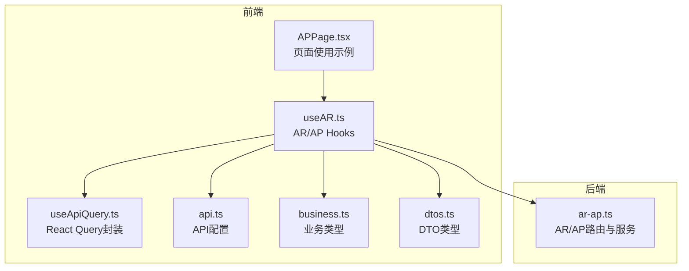
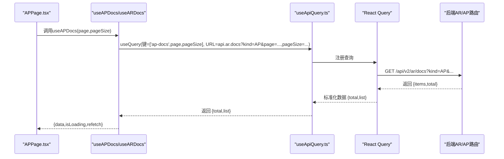
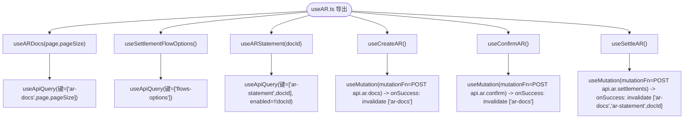
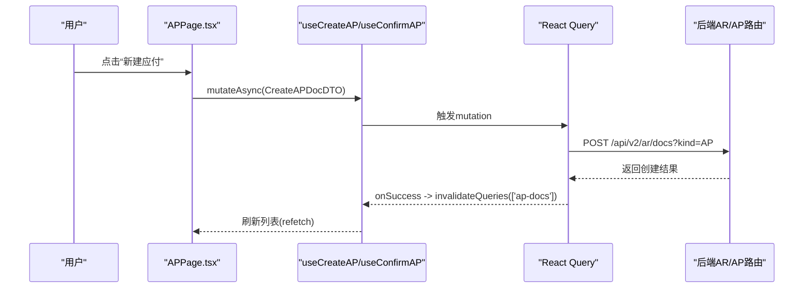
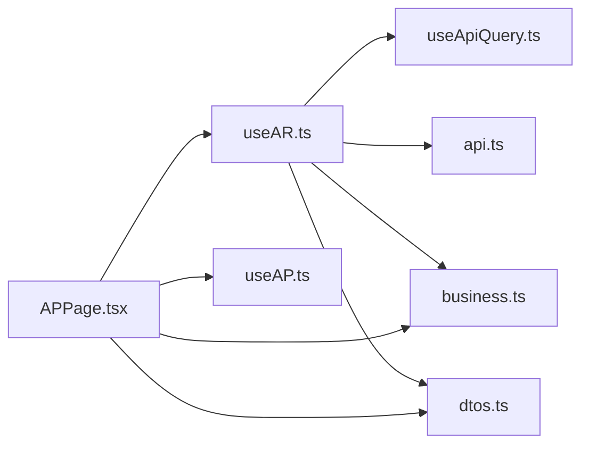

# 应付管理Hooks

<cite>
**本文引用的文件**
- [useAR.ts](file://frontend/src/hooks/business/useAR.ts)
- [useApiQuery.ts](file://frontend/src/utils/useApiQuery.ts)
- [api.ts](file://frontend/src/config/api.ts)
- [business.ts](file://frontend/src/types/business.ts)
- [dtos.ts](file://frontend/src/types/dtos.ts)
- [APPage.tsx](file://frontend/src/features/finance/pages/APPage.tsx)
- [useAP.ts](file://frontend/src/hooks/business/useAP.ts)
- [optimisticUpdates.ts](file://frontend/src/utils/optimisticUpdates.ts)
- [ar-ap.ts](file://backend/src/routes/v2/ar-ap.ts)
</cite>

## 目录
1. [简介](#简介)
2. [项目结构](#项目结构)
3. [核心组件](#核心组件)
4. [架构总览](#架构总览)
5. [详细组件分析](#详细组件分析)
6. [依赖关系分析](#依赖关系分析)
7. [性能考量](#性能考量)
8. [故障排查指南](#故障排查指南)
9. [结论](#结论)
10. [附录](#附录)

## 简介
本文围绕前端业务Hooks“应付管理Hooks”展开，重点解析useAR Hook的设计与实现，涵盖应付账款的数据获取、分页、搜索与状态同步机制；说明其如何封装React Query的useQuery与useMutation实现数据请求与变更操作；并结合APPage页面的实际使用场景，解释参数传递、缓存键生成与乐观更新处理逻辑。同时对AR/AP服务端接口进行映射，帮助读者理解前后端协作的数据流。

## 项目结构
- 前端业务Hooks位于frontend/src/hooks/business，其中useAR.ts提供AR/AP相关数据与变更能力；useAP.ts提供AP专用的列表与变更Hook。
- 前端通用数据获取封装位于frontend/src/utils/useApiQuery.ts，统一了React Query的useQuery与useMutation封装。
- API地址配置位于frontend/src/config/api.ts，集中管理后端接口路径。
- 类型定义位于frontend/src/types/business.ts与frontend/src/types/dtos.ts，分别描述业务实体与DTO。
- 页面示例位于frontend/src/features/finance/pages/APPage.tsx，展示如何在页面中使用useAPDocs等Hook。
- 后端AR/AP路由位于backend/src/routes/v2/ar-ap.ts，提供应付/应收文档列表、确认、结算、对账单等接口。

图表来源
- [useAR.ts](file://frontend/src/hooks/business/useAR.ts#L1-L86)
- [useApiQuery.ts](file://frontend/src/utils/useApiQuery.ts#L1-L49)
- [api.ts](file://frontend/src/config/api.ts#L58-L63)
- [business.ts](file://frontend/src/types/business.ts#L101-L116)
- [dtos.ts](file://frontend/src/types/dtos.ts#L95-L126)
- [APPage.tsx](file://frontend/src/features/finance/pages/APPage.tsx#L1-L320)
- [ar-ap.ts](file://backend/src/routes/v2/ar-ap.ts#L92-L160)

章节来源
- [useAR.ts](file://frontend/src/hooks/business/useAR.ts#L1-L86)
- [useApiQuery.ts](file://frontend/src/utils/useApiQuery.ts#L1-L49)
- [api.ts](file://frontend/src/config/api.ts#L58-L63)
- [business.ts](file://frontend/src/types/business.ts#L101-L116)
- [dtos.ts](file://frontend/src/types/dtos.ts#L95-L126)
- [APPage.tsx](file://frontend/src/features/finance/pages/APPage.tsx#L1-L320)
- [ar-ap.ts](file://backend/src/routes/v2/ar-ap.ts#L92-L160)

## 核心组件
- useAR.ts：提供应付/应收文档列表、结算选项、对账单、创建、确认、结算等Hook，均基于useApiQuery与React Query的useMutation封装。
- useApiQuery.ts：统一的React Query封装，支持启用/禁用、staleTime、placeholderData、select等常用配置。
- api.ts：集中管理AR/AP相关后端接口路径，如文档列表、确认、结算、对账单等。
- business.ts：定义ARAP实体类型，包含应付/应收文档的核心字段。
- dtos.ts：定义CreateARDocDTO、ConfirmARDocDTO、SettleARDocDTO等请求DTO，确保变更操作的类型安全。
- APPage.tsx：页面示例，演示useAPDocs、useCreateAP、useConfirmAP等Hook的组合使用，以及分页、搜索与状态同步。

章节来源
- [useAR.ts](file://frontend/src/hooks/business/useAR.ts#L1-L86)
- [useApiQuery.ts](file://frontend/src/utils/useApiQuery.ts#L1-L49)
- [api.ts](file://frontend/src/config/api.ts#L58-L63)
- [business.ts](file://frontend/src/types/business.ts#L101-L116)
- [dtos.ts](file://frontend/src/types/dtos.ts#L95-L126)
- [APPage.tsx](file://frontend/src/features/finance/pages/APPage.tsx#L1-L320)

## 架构总览
前端通过useAR.ts与useAP.ts封装AR/AP业务，统一调用useApiQuery.ts提供的useQuery与useMutation，以API配置api.ts中的路径发起HTTP请求。后端在ar-ap.ts中提供AR/AP文档列表、确认、结算、对账单等接口，返回标准化的数据结构，前端通过select与placeholderData等配置优化用户体验与性能。

图表来源
- [APPage.tsx](file://frontend/src/features/finance/pages/APPage.tsx#L43-L48)
- [useAP.ts](file://frontend/src/hooks/business/useAP.ts#L10-L23)
- [useApiQuery.ts](file://frontend/src/utils/useApiQuery.ts#L11-L41)
- [api.ts](file://frontend/src/config/api.ts#L58-L63)
- [ar-ap.ts](file://backend/src/routes/v2/ar-ap.ts#L440-L536)

## 详细组件分析

### useAR.ts 设计与实现
- 列表Hook：useARDocs(page,pageSize)基于useApiQuery，构造查询键['ar-docs',page,pageSize]，请求api.ar.docs并传入kind=AR，通过select将后端返回的items映射为list，total映射为total，同时设置staleTime与keepPreviousData以提升滚动体验。
- 结算选项Hook：useSettlementFlowOptions()请求api.flows，通过select将后端results映射为[{value,label}]，label包含业务日期、凭证号、金额与类型等信息，便于结算时选择对应流水。
- 对账单Hook：useARStatement(docId)请求api.ar.statement?docId=docId，当docId存在时才启用查询，避免无效请求。
- 变更Hook：
  - useCreateAR()：POST api.ar.docs，kind固定为'AR'，成功后使['ar-docs']失效，触发重新拉取。
  - useConfirmAR()：POST api.ar.confirm，成功后同样失效['ar-docs']。
  - useSettleAR()：POST api.ar.settlements，成功后失效['ar-docs']与['ar-statement',docId]，保证列表与对账单同步更新。

图表来源
- [useAR.ts](file://frontend/src/hooks/business/useAR.ts#L11-L86)

章节来源
- [useAR.ts](file://frontend/src/hooks/business/useAR.ts#L11-L86)

### useApiQuery.ts 封装与配置
- 统一封装useQuery，支持：
  - enabled：按条件启用/禁用查询
  - staleTime：缓存新鲜度
  - gcTime：垃圾回收时间
  - refetchInterval/refetchOnWindowFocus：自动刷新策略
  - select：数据选择器，用于标准化后端响应
  - placeholderData：配合keepPreviousData，滚动时保持上一页数据
  - retry：重试策略
- 通用useApiMutation封装（未在useAR.ts中直接使用，但与useMutation配合）

章节来源
- [useApiQuery.ts](file://frontend/src/utils/useApiQuery.ts#L11-L41)

### API配置与类型映射
- api.ts中定义了ar/docs、ar/confirm、ar/settlements、ar/statement等路径，与后端ar-ap.ts路由一一对应。
- business.ts定义ARAP类型，包含id、kind、docNo、partyId、issueDate、dueDate、amountCents、status、settledCents、remainingCents、memo等字段。
- dtos.ts定义CreateARDocDTO、ConfirmARDocDTO、SettleARDocDTO等请求DTO，确保创建、确认、结算的payload类型安全。

章节来源
- [api.ts](file://frontend/src/config/api.ts#L58-L63)
- [business.ts](file://frontend/src/types/business.ts#L101-L116)
- [dtos.ts](file://frontend/src/types/dtos.ts#L95-L126)

### APPage 页面中的使用场景
- 分页与搜索：
  - 通过useState维护page与pageSize，传入useAPDocs(page,pageSize)，得到docs、isLoading、refetch。
  - 通过SearchFilters组件收集搜索参数searchParams，页面内对docs.list进行过滤（如按party或status），形成filteredDocs。
- 参数传递：
  - useAPDocs内部通过api.ar.docs拼接kind=AP、page、pageSize等查询参数。
  - useConfirmAP与useCreateAP接收DTO参数，最终通过api.ar.confirm与api.ar.docs提交。
- 缓存键生成：
  - useAPDocs的查询键为['ap-docs',page,pageSize]，useCreateAP/ConfirmAP通过invalidateQueries(['ap-docs'])使列表缓存失效，触发重新拉取。
- 乐观更新处理逻辑：
  - 当前useAP.ts中的创建与确认Hook采用“失败即回滚”的策略，通过onSuccess失效查询键，让React Query自动拉取最新数据，从而达到“乐观更新”的效果。
  - 若需更精细的乐观更新，可参考frontend/src/utils/optimisticUpdates.ts中提供的工具函数，为分页列表或单项操作提供更平滑的交互体验。

图表来源
- [APPage.tsx](file://frontend/src/features/finance/pages/APPage.tsx#L43-L65)
- [useAP.ts](file://frontend/src/hooks/business/useAP.ts#L25-L35)
- [api.ts](file://frontend/src/config/api.ts#L58-L63)
- [ar-ap.ts](file://backend/src/routes/v2/ar-ap.ts#L163-L221)

章节来源
- [APPage.tsx](file://frontend/src/features/finance/pages/APPage.tsx#L1-L320)
- [useAP.ts](file://frontend/src/hooks/business/useAP.ts#L10-L47)

### 后端AR/AP接口映射
- 文档列表：GET /api/v2/ar/docs，kind=AR/AP，支持分页与状态过滤，返回items与pagination。
- 创建文档：POST /api/v2/ar/docs，kind=AR/AP，返回id与docNo。
- 确认文档：POST /api/v2/ar/confirm，提交凭证与账户、类别等信息。
- 结算：POST /api/v2/ar/settlements，按docId与flowId进行结算。
- 对账单：GET /api/v2/ar/statement?docId=...，返回文档、结算明细与余额。

章节来源
- [ar-ap.ts](file://backend/src/routes/v2/ar-ap.ts#L92-L160)
- [ar-ap.ts](file://backend/src/routes/v2/ar-ap.ts#L163-L221)
- [ar-ap.ts](file://backend/src/routes/v2/ar-ap.ts#L223-L316)
- [ar-ap.ts](file://backend/src/routes/v2/ar-ap.ts#L574-L600)

## 依赖关系分析
- useAR.ts依赖：
  - useApiQuery.ts：统一useQuery封装
  - api.ts：后端接口路径
  - business.ts：ARAP类型
  - dtos.ts：CreateARDocDTO、ConfirmARDocDTO、SettleARDocDTO
  - @tanstack/react-query：useMutation、useQueryClient、keepPreviousData
- APPage.tsx依赖：
  - useAPDocs/useCreateAP/useConfirmAP：列表与变更
  - DataTable、SearchFilters等UI组件
  - ARAP_STATUS状态映射与AmountDisplay、StatusTag等渲染组件

图表来源
- [useAR.ts](file://frontend/src/hooks/business/useAR.ts#L1-L86)
- [useApiQuery.ts](file://frontend/src/utils/useApiQuery.ts#L1-L49)
- [api.ts](file://frontend/src/config/api.ts#L58-L63)
- [business.ts](file://frontend/src/types/business.ts#L101-L116)
- [dtos.ts](file://frontend/src/types/dtos.ts#L95-L126)
- [APPage.tsx](file://frontend/src/features/finance/pages/APPage.tsx#L1-L320)
- [useAP.ts](file://frontend/src/hooks/business/useAP.ts#L10-L47)

章节来源
- [useAR.ts](file://frontend/src/hooks/business/useAR.ts#L1-L86)
- [useApiQuery.ts](file://frontend/src/utils/useApiQuery.ts#L1-L49)
- [api.ts](file://frontend/src/config/api.ts#L58-L63)
- [business.ts](file://frontend/src/types/business.ts#L101-L116)
- [dtos.ts](file://frontend/src/types/dtos.ts#L95-L126)
- [APPage.tsx](file://frontend/src/features/finance/pages/APPage.tsx#L1-L320)
- [useAP.ts](file://frontend/src/hooks/business/useAP.ts#L10-L47)

## 性能考量
- 缓存与新鲜度：
  - useApiQuery支持staleTime与gcTime，合理设置可减少网络请求次数。
  - keepPreviousData与placeholderData配合，滚动加载时保持上一页数据，改善体验。
- 查询键设计：
  - useAPDocs使用['ap-docs',page,pageSize]作为查询键，确保分页切换时正确缓存。
  - useCreateAP/ConfirmAP通过invalidateQueries(['ap-docs'])精准失效，避免全站刷新。
- 自动刷新：
  - refetchInterval与refetchOnWindowFocus可用于后台定时刷新，但需谨慎使用以免造成资源浪费。
- 乐观更新：
  - 当前采用“失败即回滚”的策略，通过失效查询键触发重新拉取，简单可靠。
  - 若需更流畅的交互，可参考optimisticUpdates.ts中的工具函数，为分页列表或单项操作提供更细粒度的乐观更新。

章节来源
- [useApiQuery.ts](file://frontend/src/utils/useApiQuery.ts#L11-L41)
- [useAP.ts](file://frontend/src/hooks/business/useAP.ts#L10-L47)
- [optimisticUpdates.ts](file://frontend/src/utils/optimisticUpdates.ts#L1-L159)

## 故障排查指南
- 列表不刷新或显示旧数据：
  - 确认变更Hook的onSuccess是否调用了invalidateQueries(['ap-docs'])。
  - 检查查询键是否一致，避免键不匹配导致缓存未失效。
- 查询未执行：
  - 检查useApiQuery的enabled条件，确保满足后再启用查询。
  - 确认API路径与后端路由一致，避免404或权限问题。
- 数据格式不匹配：
  - 检查select函数是否正确映射后端返回结构，避免运行时报错。
- 乐观更新冲突：
  - 若采用自定义乐观更新，注意在onError中回滚到context.previousData，并在onSettled后统一失效查询键。

章节来源
- [useAP.ts](file://frontend/src/hooks/business/useAP.ts#L25-L47)
- [useApiQuery.ts](file://frontend/src/utils/useApiQuery.ts#L11-L41)
- [optimisticUpdates.ts](file://frontend/src/utils/optimisticUpdates.ts#L1-L159)

## 结论
useAR.ts通过useApiQuery与React Query的useMutation，实现了应付/应收文档的完整生命周期管理：数据获取、分页、搜索、状态同步与变更操作。其查询键设计清晰，缓存策略合理，变更后通过失效查询键实现“乐观更新”效果。在APPage中，这些Hook被组合使用，展示了从列表加载到创建、确认、结算的典型业务流程。若需进一步优化交互体验，可引入更细粒度的乐观更新工具，提升用户感知速度与一致性。

## 附录
- 实际使用建议：
  - 在列表页中，优先使用keepPreviousData与placeholderData提升滚动体验。
  - 对于频繁变更的列表，合理设置staleTime，避免过度刷新。
  - 对于关键业务（创建/确认/结算），采用“失败即回滚”的策略，确保数据一致性。
- 扩展方向：
  - 引入optimisticUpdates.ts中的工具函数，为分页列表提供更平滑的乐观更新。
  - 在搜索场景中，将前端过滤改为后端过滤，减少前端渲染压力。