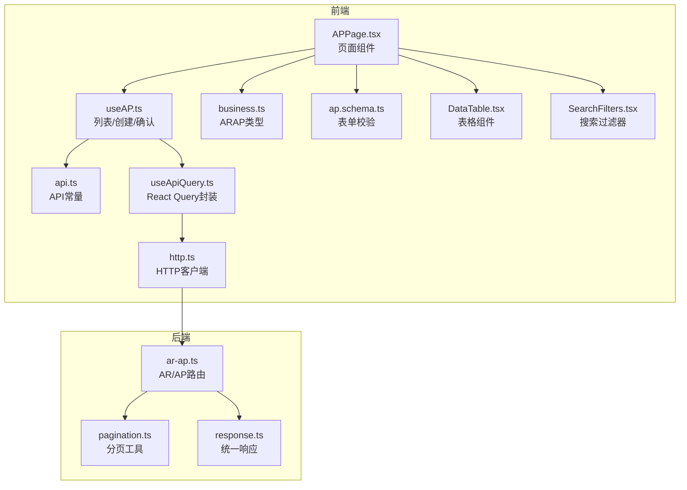
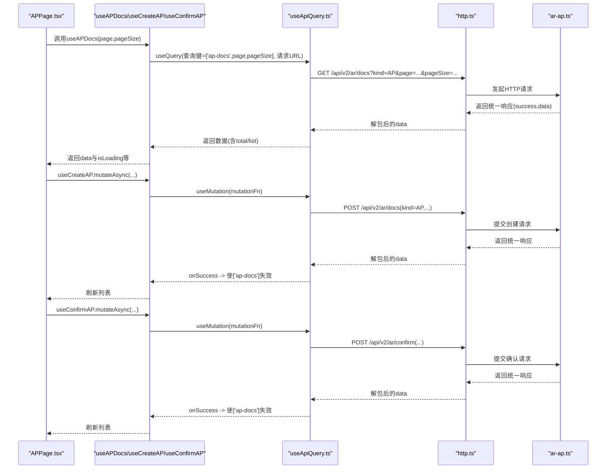
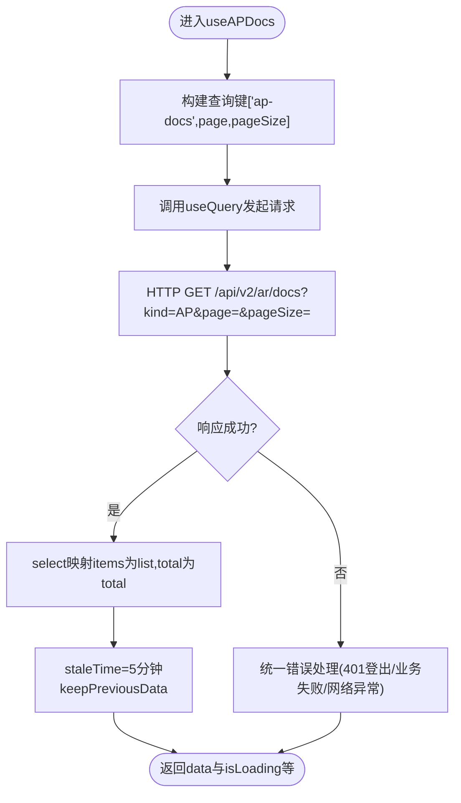
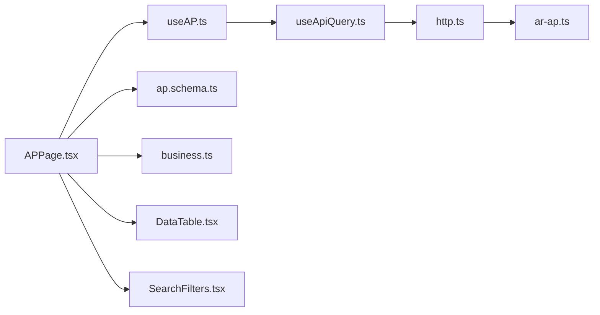

# 应收管理Hooks

<cite>
**本文引用的文件**
- [useAP.ts](file://frontend/src/hooks/business/useAP.ts)
- [business.ts](file://frontend/src/types/business.ts)
- [api.ts](file://frontend/src/config/api.ts)
- [useApiQuery.ts](file://frontend/src/utils/useApiQuery.ts)
- [http.ts](file://frontend/src/api/http.ts)
- [APPage.tsx](file://frontend/src/features/finance/pages/APPage.tsx)
- [ap.schema.ts](file://frontend/src/validations/ap.schema.ts)
- [ar-ap.ts](file://backend/src/routes/v2/ar-ap.ts)
- [pagination.ts](file://backend/src/utils/pagination.ts)
- [response.ts](file://backend/src/utils/response.ts)
- [SearchFilters.tsx](file://frontend/src/components/common/SearchFilters.tsx)
- [DataTable.tsx](file://frontend/src/components/common/DataTable.tsx)
- [status.tsx](file://frontend/src/utils/status.tsx)
</cite>

## 目录
1. [简介](#简介)
2. [项目结构](#项目结构)
3. [核心组件](#核心组件)
4. [架构总览](#架构总览)
5. [详细组件分析](#详细组件分析)
6. [依赖关系分析](#依赖关系分析)
7. [性能考量](#性能考量)
8. [故障排查指南](#故障排查指南)
9. [结论](#结论)
10. [附录](#附录)

## 简介
本文件系统性阐述前端“应收管理Hooks”中的useAP系列Hook的实现与使用方法，重点覆盖：
- 如何通过React Query获取和管理应收账款数据
- 分页查询、过滤条件处理、数据缓存策略及错误重试机制
- 在组件中调用useAP进行列表查询、详情获取和状态更新的实践示例
- 与后端API的交互方式，以及响应数据结构映射

## 项目结构
围绕应收管理的核心文件分布如下：
- 前端Hooks层：useAP.ts（列表、创建、确认）
- 类型定义：business.ts（ARAP接口）
- API配置：api.ts（后端接口地址常量）
- 通用查询封装：useApiQuery.ts（基于React Query的统一封装）
- HTTP客户端：http.ts（fetch封装、统一响应处理）
- 页面组件：APPage.tsx（列表、过滤、分页、创建、确认）
- 验证模式：ap.schema.ts（创建/确认表单校验）
- 后端路由：ar-ap.ts（AR/AP文档、确认、结算、账单详情）
- 分页与响应：pagination.ts、response.ts（分页元信息、统一响应结构）

图表来源
- [useAP.ts](file://frontend/src/hooks/business/useAP.ts#L1-L48)
- [business.ts](file://frontend/src/types/business.ts#L101-L116)
- [api.ts](file://frontend/src/config/api.ts#L58-L63)
- [useApiQuery.ts](file://frontend/src/utils/useApiQuery.ts#L1-L103)
- [http.ts](file://frontend/src/api/http.ts#L1-L116)
- [APPage.tsx](file://frontend/src/features/finance/pages/APPage.tsx#L1-L320)
- [ap.schema.ts](file://frontend/src/validations/ap.schema.ts#L1-L23)
- [ar-ap.ts](file://backend/src/routes/v2/ar-ap.ts#L56-L160)
- [pagination.ts](file://backend/src/utils/pagination.ts#L1-L35)
- [response.ts](file://backend/src/utils/response.ts#L1-L132)

章节来源
- [useAP.ts](file://frontend/src/hooks/business/useAP.ts#L1-L48)
- [APPage.tsx](file://frontend/src/features/finance/pages/APPage.tsx#L1-L320)

## 核心组件
- useAPDocs(page, pageSize)
  - 功能：获取AP单据列表，支持分页与占位数据
  - 关键点：查询键包含page与pageSize；使用select将后端返回的items映射为list；设置staleTime与keepPreviousData提升体验
- useCreateAP()
  - 功能：创建AP单据
  - 关键点：mutationFn提交数据并注入kind=AP；成功后使['ap-docs']失效，触发列表刷新
- useConfirmAP()
  - 功能：确认AP单据并生成流水
  - 关键点：mutationFn提交确认参数；成功后同样失效['ap-docs']，触发列表刷新

章节来源
- [useAP.ts](file://frontend/src/hooks/business/useAP.ts#L10-L48)

## 架构总览
前端通过useApiQuery封装统一请求，HTTP客户端对后端统一响应结构进行解包，并在401时触发登出流程。页面组件通过useAPDocs获取数据，结合SearchFilters与DataTable实现过滤与分页展示；创建与确认通过useCreateAP与useConfirmAP完成。

图表来源
- [useAP.ts](file://frontend/src/hooks/business/useAP.ts#L10-L48)
- [useApiQuery.ts](file://frontend/src/utils/useApiQuery.ts#L11-L41)
- [http.ts](file://frontend/src/api/http.ts#L1-L116)
- [ar-ap.ts](file://backend/src/routes/v2/ar-ap.ts#L162-L220)
- [ar-ap.ts](file://backend/src/routes/v2/ar-ap.ts#L372-L437)

## 详细组件分析

### useAPDocs：分页查询与数据映射
- 查询键：['ap-docs', page, pageSize]
- URL参数：kind=AP&page=page&pageSize=pageSize
- 数据映射：select将后端的items映射为前端的list，total映射为total
- 缓存策略：staleTime=5分钟；keepPreviousData避免切换页时闪烁
- 错误处理：HTTP客户端统一处理401登出、业务失败提示与网络异常

图表来源
- [useAP.ts](file://frontend/src/hooks/business/useAP.ts#L10-L23)
- [useApiQuery.ts](file://frontend/src/utils/useApiQuery.ts#L11-L41)
- [http.ts](file://frontend/src/api/http.ts#L1-L116)

章节来源
- [useAP.ts](file://frontend/src/hooks/business/useAP.ts#L10-L23)
- [useApiQuery.ts](file://frontend/src/utils/useApiQuery.ts#L11-L41)
- [http.ts](file://frontend/src/api/http.ts#L1-L116)

### useCreateAP：创建AP单据
- mutationFn：向/api/v2/ar/docs发送POST，注入kind=AP
- 成功回调：使['ap-docs']失效，触发列表刷新
- 页面侧：通过withErrorHandler包装提交流程，成功后调用refetch刷新

章节来源
- [useAP.ts](file://frontend/src/hooks/business/useAP.ts#L25-L35)
- [APPage.tsx](file://frontend/src/features/finance/pages/APPage.tsx#L49-L65)
- [ap.schema.ts](file://frontend/src/validations/ap.schema.ts#L1-L12)

### useConfirmAP：确认AP并生成流水
- mutationFn：向/api/v2/ar/confirm发送POST，携带docId、accountId、categoryId、bizDate、memo、voucherUrl
- 成功回调：使['ap-docs']失效，触发列表刷新
- 页面侧：先上传凭证，再提交确认，成功后清理表单与文件列表

章节来源
- [useAP.ts](file://frontend/src/hooks/business/useAP.ts#L37-L48)
- [APPage.tsx](file://frontend/src/features/finance/pages/APPage.tsx#L67-L92)
- [ap.schema.ts](file://frontend/src/validations/ap.schema.ts#L14-L23)

### 页面集成与过滤
- 列表渲染：DataTable接收data={docs.list}、total={docs.total}、loading={loading}
- 分页控制：onChange中更新page与pageSize，驱动useAPDocs重新查询
- 过滤逻辑：SearchFilters收集字段，APPage中对docs.list进行二次过滤（如party、status），并支持日期范围

章节来源
- [APPage.tsx](file://frontend/src/features/finance/pages/APPage.tsx#L1-L320)
- [SearchFilters.tsx](file://frontend/src/components/common/SearchFilters.tsx#L1-L435)
- [DataTable.tsx](file://frontend/src/components/common/DataTable.tsx#L1-L189)

### 数据模型与状态映射
- ARAP接口字段：id、type、issueDate、dueDate、partyName、amountCents、currency、status、settledCents、remainingCents、description等
- 状态映射：ARAP_STATUS用于渲染状态标签

章节来源
- [business.ts](file://frontend/src/types/business.ts#L101-L116)
- [status.tsx](file://frontend/src/utils/status.tsx#L71-L81)

### 与后端API交互细节
- 列表接口：/api/v2/ar/docs?kind=AP&page=&pageSize=
- 创建接口：/api/v2/ar/docs（POST，kind=AP）
- 确认接口：/api/v2/ar/confirm（POST）
- 后端统一响应：success字段为true时解包data，否则抛出业务错误；401时登出

章节来源
- [api.ts](file://frontend/src/config/api.ts#L58-L63)
- [ar-ap.ts](file://backend/src/routes/v2/ar-ap.ts#L56-L160)
- [ar-ap.ts](file://backend/src/routes/v2/ar-ap.ts#L162-L220)
- [ar-ap.ts](file://backend/src/routes/v2/ar-ap.ts#L372-L437)
- [response.ts](file://backend/src/utils/response.ts#L1-L132)
- [http.ts](file://frontend/src/api/http.ts#L1-L116)

## 依赖关系分析

图表来源
- [APPage.tsx](file://frontend/src/features/finance/pages/APPage.tsx#L1-L320)
- [useAP.ts](file://frontend/src/hooks/business/useAP.ts#L1-L48)
- [useApiQuery.ts](file://frontend/src/utils/useApiQuery.ts#L1-L103)
- [http.ts](file://frontend/src/api/http.ts#L1-L116)
- [ar-ap.ts](file://backend/src/routes/v2/ar-ap.ts#L56-L160)
- [ap.schema.ts](file://frontend/src/validations/ap.schema.ts#L1-L23)
- [business.ts](file://frontend/src/types/business.ts#L101-L116)
- [DataTable.tsx](file://frontend/src/components/common/DataTable.tsx#L1-L189)
- [SearchFilters.tsx](file://frontend/src/components/common/SearchFilters.tsx#L1-L435)

## 性能考量
- 缓存与占位：useAPDocs设置staleTime=5分钟，并使用keepPreviousData避免翻页闪烁，提升用户体验
- 列表渲染：DataTable支持虚拟滚动（virtual=true且数据量>100时启用），降低大列表渲染成本
- 并行查询：后端账单详情接口采用Promise.all并行查询文档与结算记录，减少往返延迟
- 分页参数：后端默认page=1、pageSize=20，前端可按需调整，避免一次性加载过多数据

章节来源
- [useAP.ts](file://frontend/src/hooks/business/useAP.ts#L10-L23)
- [DataTable.tsx](file://frontend/src/components/common/DataTable.tsx#L132-L164)
- [ar-ap.ts](file://backend/src/routes/v2/ar-ap.ts#L341-L370)
- [pagination.ts](file://backend/src/utils/pagination.ts#L1-L35)

## 故障排查指南
- 401未授权
  - 现象：登录态失效或令牌过期
  - 处理：HTTP客户端检测到401时触发登出并跳转登录页
- 业务失败
  - 现象：success=false时弹出错误消息
  - 处理：统一错误处理会显示业务错误信息，可在调用处添加withErrorHandler增强提示
- 网络异常
  - 现象：fetch失败或响应非JSON
  - 处理：统一错误处理会显示网络错误，必要时可设置skipErrorHandle避免重复提示
- 列表不刷新
  - 现象：创建/确认后列表未更新
  - 处理：确认useCreateAP/useConfirmAP的成功回调是否执行了queryClient.invalidateQueries(['ap-docs'])

章节来源
- [http.ts](file://frontend/src/api/http.ts#L1-L116)
- [useAP.ts](file://frontend/src/hooks/business/useAP.ts#L25-L48)
- [APPage.tsx](file://frontend/src/features/finance/pages/APPage.tsx#L49-L92)

## 结论
useAP系列Hook通过React Query实现了对AP单据的高效查询、缓存与更新，配合统一的HTTP客户端与后端统一响应结构，提供了稳定可靠的前端数据流。页面组件通过SearchFilters与DataTable实现了灵活的过滤与分页展示，同时通过useCreateAP与useConfirmAP完成业务闭环。整体设计具备良好的扩展性与可维护性。

## 附录

### 组件调用示例（路径指引）
- 列表查询与分页
  - 使用位置：APPage.tsx
  - 关键调用：useAPDocs(page, pageSize)、DataTable分页onChange
  - 参考路径
    - [APPage.tsx](file://frontend/src/features/finance/pages/APPage.tsx#L21-L120)
    - [useAP.ts](file://frontend/src/hooks/business/useAP.ts#L10-L23)
    - [DataTable.tsx](file://frontend/src/components/common/DataTable.tsx#L112-L130)
- 详情获取
  - 使用位置：页面中打开确认模态时读取当前记录
  - 参考路径
    - [APPage.tsx](file://frontend/src/features/finance/pages/APPage.tsx#L117-L125)
- 状态更新（创建/确认）
  - 使用位置：APPage.tsx
  - 关键调用：useCreateAP.mutateAsync(...)、useConfirmAP.mutateAsync(...)
  - 参考路径
    - [useAP.ts](file://frontend/src/hooks/business/useAP.ts#L25-L48)
    - [APPage.tsx](file://frontend/src/features/finance/pages/APPage.tsx#L49-L92)
    - [ap.schema.ts](file://frontend/src/validations/ap.schema.ts#L1-L23)

### 数据结构映射
- 前端ARAP接口字段与后端返回字段映射
  - id、kind、docNo、partyId、siteId、departmentId、issueDate、dueDate、amountCents、status、memo、createdAt、settledCents、siteName
  - 映射逻辑：后端返回items，useAPDocs通过select映射为list与total
- 统一响应结构
  - success为true时解包data，否则抛出业务错误
  - 参考路径
    - [response.ts](file://backend/src/utils/response.ts#L1-L132)
    - [http.ts](file://frontend/src/api/http.ts#L1-L116)
    - [ar-ap.ts](file://backend/src/routes/v2/ar-ap.ts#L56-L160)