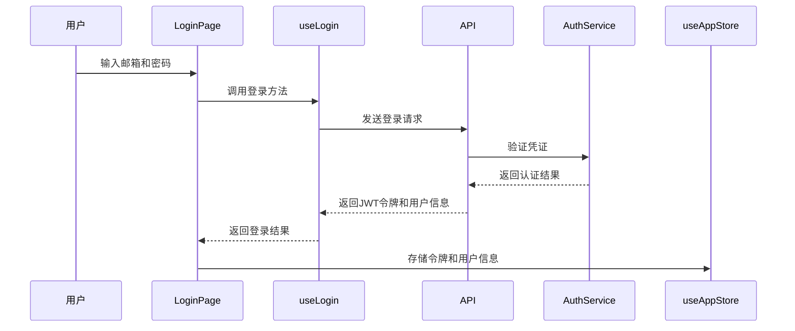
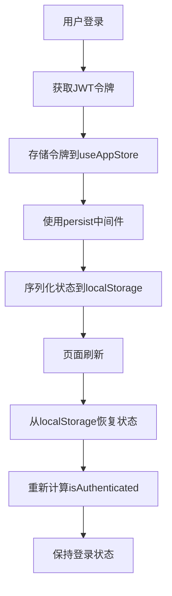
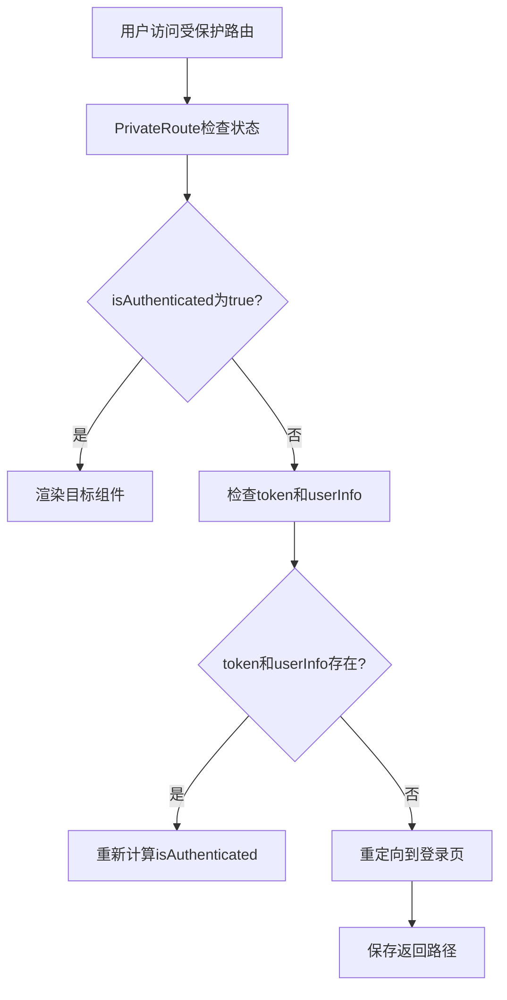
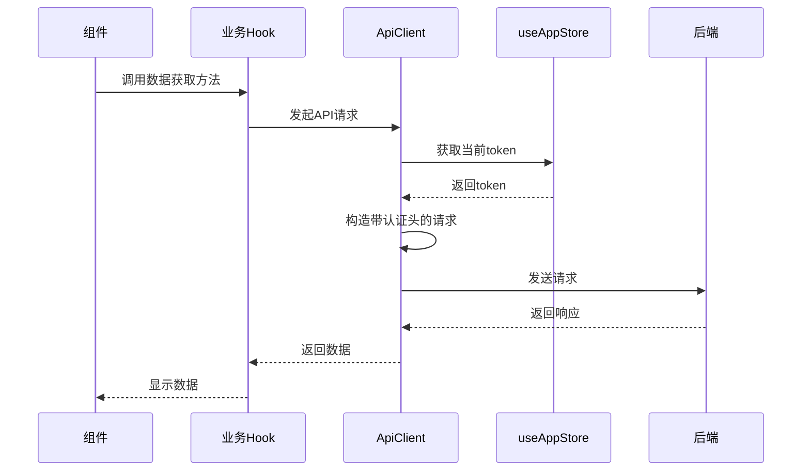
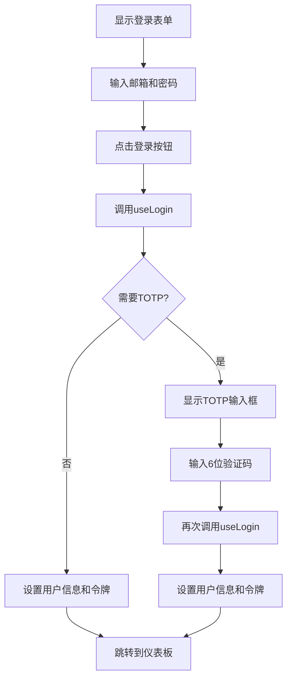
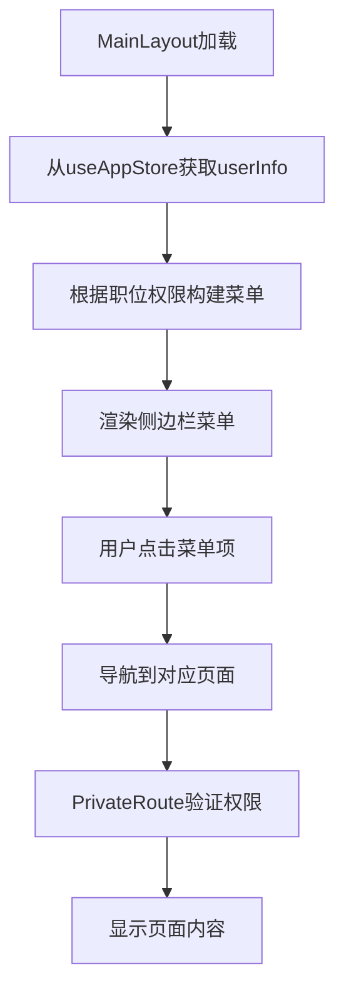
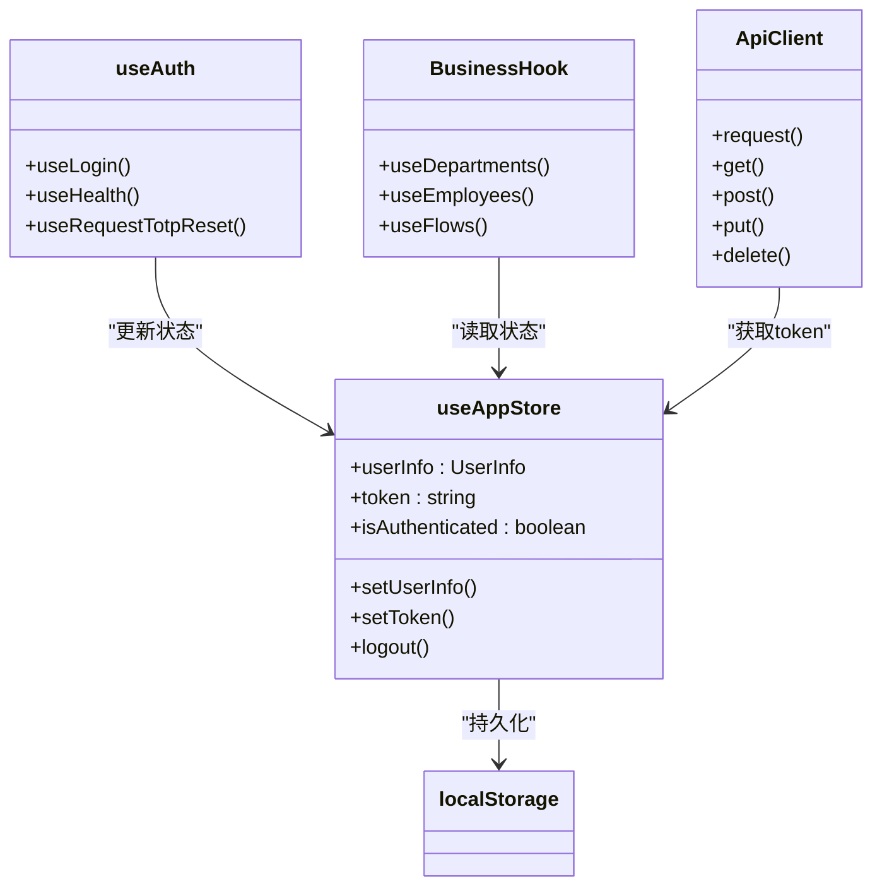
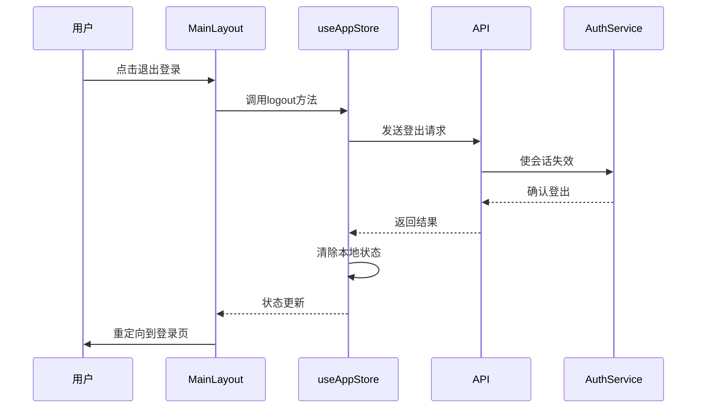

# 认证状态管理Hooks

<cite>
**本文档引用的文件**  
- [useAuth.ts](file://frontend/src/hooks/business/useAuth.ts)
- [useAppStore.ts](file://frontend/src/store/useAppStore.ts)
- [http.ts](file://frontend/src/api/http.ts)
- [LoginPage.tsx](file://frontend/src/features/auth/pages/LoginPage.tsx)
- [MainLayout.tsx](file://frontend/src/layouts/MainLayout.tsx)
- [api.ts](file://frontend/src/config/api.ts)
- [PrivateRoute.tsx](file://frontend/src/router/PrivateRoute.tsx)
- [jwt.ts](file://backend/src/utils/jwt.ts)
- [auth.ts](file://backend/src/routes/v2/auth.ts)
</cite>

## 目录
1. [简介](#简介)
2. [核心认证状态管理](#核心认证状态管理)
3. [JWT令牌管理机制](#jwt令牌管理机制)
4. [用户信息持久化与同步](#用户信息持久化与同步)
5. [登录状态监听与自动刷新](#登录状态监听与自动刷新)
6. [认证头自动附加机制](#认证头自动附加机制)
7. [登录页面实现示例](#登录页面实现示例)
8. [主布局中的权限控制](#主布局中的权限控制)
9. [与其他业务Hook的协同工作](#与其他业务hook的协同工作)
10. [安全退出机制](#安全退出机制)

## 简介
`useAuth` Hook是本系统认证流程的核心组件，负责管理用户的认证状态、JWT令牌、用户信息持久化和登录状态。该Hook通过与Zustand状态管理store、API客户端和路由系统紧密协作，实现了完整的认证生命周期管理。本文档将深入分析`useAuth` Hook在认证流程中的核心作用，包括其如何与其他业务Hook协同工作以确保请求认证头的正确附加，以及在LoginPage和MainLayout中的使用示例。

## 核心认证状态管理

`useAuth` Hook通过`useAppStore`集中管理认证状态，确保应用各部分对用户认证状态的一致性认知。认证状态包括用户信息、JWT令牌和认证状态标志，这些状态在用户登录、登出和页面刷新时保持同步。

**Section sources**
- [useAppStore.ts](file://frontend/src/store/useAppStore.ts#L58-L89)
- [useAuth.ts](file://frontend/src/hooks/business/useAuth.ts#L27-L34)

## JWT令牌管理机制

系统采用JWT（JSON Web Token）作为认证令牌，通过`useAuth` Hook实现令牌的获取、存储和验证。当用户成功登录时，后端生成包含用户信息和会话ID的JWT令牌，前端通过`useLogin` Hook获取并存储该令牌。

**Diagram sources**
- [jwt.ts](file://backend/src/utils/jwt.ts#L72-L131)
- [auth.ts](file://backend/src/routes/v2/auth.ts#L43-L80)
- [useAuth.ts](file://frontend/src/hooks/business/useAuth.ts#L27-L34)

## 用户信息持久化与同步

用户信息通过Zustand的`persist`中间件实现持久化存储，确保页面刷新后用户状态不丢失。`useAppStore`中的`partialize`配置指定了需要持久化的状态字段，包括用户信息、令牌和认证状态。

**Diagram sources**
- [useAppStore.ts](file://frontend/src/store/useAppStore.ts#L73-L88)
- [useAuth.ts](file://frontend/src/hooks/business/useAuth.ts#L27-L34)

## 登录状态监听与自动刷新

系统通过`PrivateRoute`组件实现登录状态的实时监听和自动重定向。当用户访问受保护的路由时，`PrivateRoute`会检查用户的认证状态，如果用户未登录或令牌失效，则自动重定向到登录页面。

**Diagram sources**
- [PrivateRoute.tsx](file://frontend/src/router/PrivateRoute.tsx#L4-L15)
- [useAppStore.ts](file://frontend/src/store/useAppStore.ts#L62-L70)

## 认证头自动附加机制

所有API请求通过`ApiClient`类发送，该类自动从`useAppStore`中获取当前用户的JWT令牌，并将其作为`Authorization`头附加到每个请求中。这种机制确保了所有需要认证的API调用都能正确携带认证信息。

**Diagram sources**
- [http.ts](file://frontend/src/api/http.ts#L11-L23)
- [useAppStore.ts](file://frontend/src/store/useAppStore.ts#L59-L61)

## 登录页面实现示例

登录页面通过`useLogin` Hook实现完整的登录流程，包括邮箱密码验证和TOTP二步验证。页面还使用`useHealth` Hook检查API连接状态，为用户提供实时的连接信息。

**Diagram sources**
- [LoginPage.tsx](file://frontend/src/features/auth/pages/LoginPage.tsx#L26-L194)
- [useAuth.ts](file://frontend/src/hooks/business/useAuth.ts#L11-L20)

## 主布局中的权限控制

主布局组件通过`useAppStore`中的用户信息实现动态菜单渲染和权限控制。用户的职位信息包含权限配置，系统根据这些权限决定用户可以访问哪些功能模块。

**Diagram sources**
- [MainLayout.tsx](file://frontend/src/layouts/MainLayout.tsx#L14-L286)
- [useAppStore.ts](file://frontend/src/store/useAppStore.ts#L18-L24)

## 与其他业务Hook的协同工作

`useAuth` Hook与其他业务Hook通过共享的认证状态实现无缝协作。所有业务Hook都依赖于`useAppStore`中的认证状态来确保请求的合法性，形成了统一的认证管理体系。

**Diagram sources**
- [useAppStore.ts](file://frontend/src/store/useAppStore.ts#L23-L42)
- [http.ts](file://frontend/src/api/http.ts#L11-L115)
- [useAuth.ts](file://frontend/src/hooks/business/useAuth.ts#L1-L69)

## 安全退出机制

系统的退出机制不仅清除前端的认证状态，还通过调用后端API使当前会话失效，确保用户在多设备登录时的安全性。这种双重保障机制有效防止了认证令牌的滥用。

**Diagram sources**
- [MainLayout.tsx](file://frontend/src/layouts/MainLayout.tsx#L77-L95)
- [useAppStore.ts](file://frontend/src/store/useAppStore.ts#L70-L71)