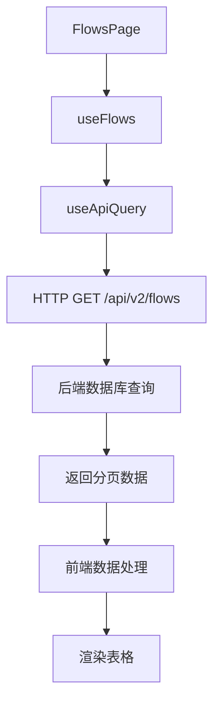
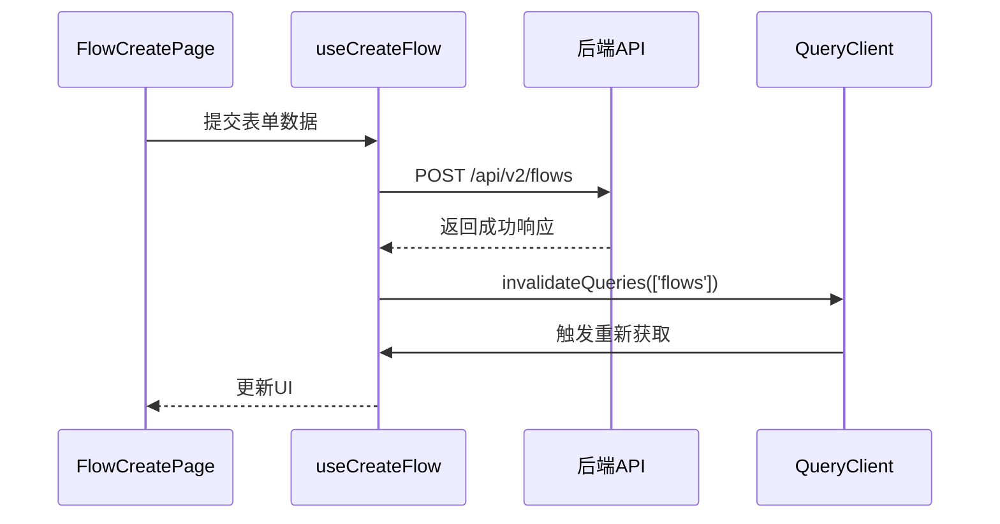

# 财务流水Hooks

<cite>
**本文档引用的文件**
- [useFlows.ts](file://frontend/src/hooks/business/useFlows.ts)
- [FlowCreatePage.tsx](file://frontend/src/features/finance/pages/FlowCreatePage.tsx)
- [FlowsPage.tsx](file://frontend/src/features/finance/pages/FlowsPage.tsx)
- [api.ts](file://frontend/src/config/api.ts)
- [business.ts](file://frontend/src/types/business.ts)
- [useApiQuery.ts](file://frontend/src/utils/useApiQuery.ts)
- [flows.ts](file://backend/src/routes/v2/flows.ts)
- [pagination.ts](file://backend/src/utils/pagination.ts)
- [route-helpers.ts](file://backend/src/utils/route-helpers.ts)
- [FinanceService.ts](file://backend/src/services/FinanceService.ts)
</cite>

## 目录
1. [简介](#简介)
2. [核心组件](#核心组件)
3. [分页查询与过滤机制](#分页查询与过滤机制)
4. [数据创建与缓存更新](#数据创建与缓存更新)
5. [后端分页实现原理](#后端分页实现原理)
6. [结论](#结论)

## 简介
`useFlows` Hook 是财务管理模块的核心数据获取工具，负责处理财务流水的分页查询、时间范围过滤、金额区间筛选等功能。该Hook基于React Query构建，利用`useInfiniteQuery`实现无限滚动加载，并通过mutation处理流水的创建和状态变更。本文档将详细解析其内部实现原理，并结合`FlowCreatePage`的实际用例，演示数据提交与缓存更新的联动机制。

## 核心组件

`useFlows` Hook 提供了财务流水数据的获取和操作接口。它封装了对后端API的调用，提供了分页查询、创建、更新凭证和批量删除等操作。该Hook的设计遵循了单一职责原则，将数据获取与数据变更操作分离，提高了代码的可维护性和可测试性。

**Section sources**
- [useFlows.ts](file://frontend/src/hooks/business/useFlows.ts#L8-L75)

## 分页查询与过滤机制

`useFlows` Hook 通过 `useApiQuery` 实现分页查询功能。它接受页码和页面大小作为参数，构建查询URL并发送请求。查询结果经过`select`函数处理，统一了凭证URL的格式，确保前端数据的一致性。`FlowsPage` 组件使用该Hook获取数据，并结合`SearchFilters`组件实现时间范围、账户、类别等多维度过滤。

**Diagram sources**
- [useFlows.ts](file://frontend/src/hooks/business/useFlows.ts#L8-L28)
- [FlowsPage.tsx](file://frontend/src/features/finance/pages/FlowsPage.tsx#L40-L43)
- [flows.ts](file://backend/src/routes/v2/flows.ts#L98-L126)

**Section sources**
- [useFlows.ts](file://frontend/src/hooks/business/useFlows.ts#L8-L28)
- [FlowsPage.tsx](file://frontend/src/features/finance/pages/FlowsPage.tsx#L40-L43)
- [flows.ts](file://backend/src/routes/v2/flows.ts#L98-L126)

## 数据创建与缓存更新

`useCreateFlow` mutation 用于创建新的财务流水。当数据提交成功后，通过 `queryClient.invalidateQueries` 使相关查询缓存失效，触发数据的重新获取。这种机制确保了前端数据的实时性和一致性。`FlowCreatePage` 组件展示了完整的数据提交流程，包括表单验证、数据提交和状态重置。

**Diagram sources**
- [useFlows.ts](file://frontend/src/hooks/business/useFlows.ts#L31-L41)
- [FlowCreatePage.tsx](file://frontend/src/features/finance/pages/FlowCreatePage.tsx#L100-L117)

**Section sources**
- [useFlows.ts](file://frontend/src/hooks/business/useFlows.ts#L31-L41)
- [FlowCreatePage.tsx](file://frontend/src/features/finance/pages/FlowCreatePage.tsx#L100-L117)

## 后端分页实现原理

后端通过 `createPaginatedHandler` 和 `getPagination` 函数实现分页逻辑。`createPaginatedHandler` 是一个高阶函数，它包装了路由处理函数，自动解析分页参数并构建分页响应。`getPagination` 函数计算分页元数据，包括总页数、偏移量和限制。这种设计模式提高了代码的复用性和一致性。

**Diagram sources**
- [route-helpers.ts](file://backend/src/utils/route-helpers.ts#L34-L58)
- [pagination.ts](file://backend/src/utils/pagination.ts#L14-L34)

**Section sources**
- [route-helpers.ts](file://backend/src/utils/route-helpers.ts#L34-L58)
- [pagination.ts](file://backend/src/utils/pagination.ts#L14-L34)

## 结论
`useFlows` Hook 通过React Query的强大功能，实现了财务流水数据的高效管理和实时更新。其设计充分考虑了用户体验和系统性能，通过合理的缓存策略和分页机制，确保了大规模数据的流畅展示。后端的分页实现遵循了RESTful API的最佳实践，提供了稳定可靠的接口支持。整体架构体现了前后端分离的设计思想，为系统的可扩展性和可维护性奠定了坚实基础。