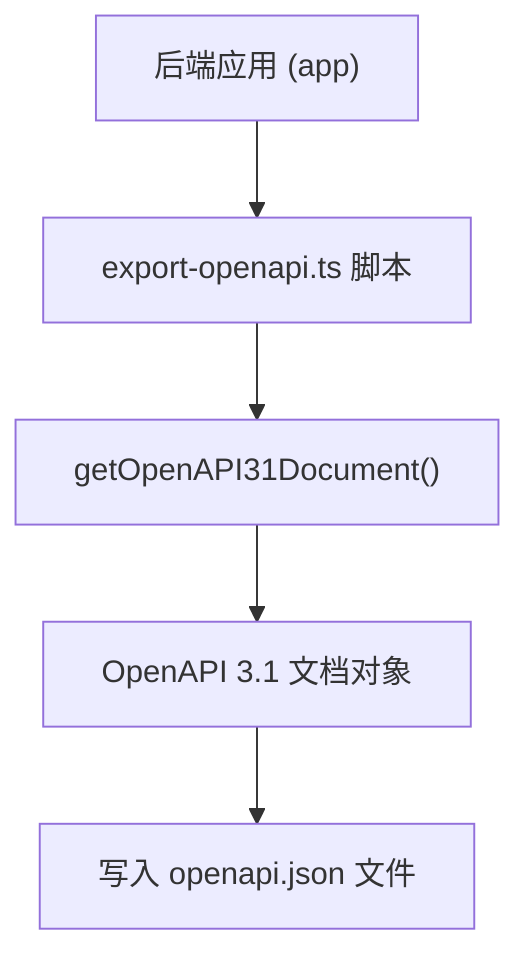
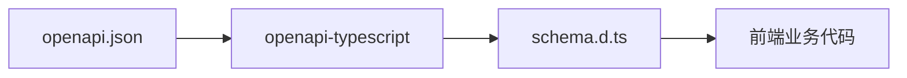
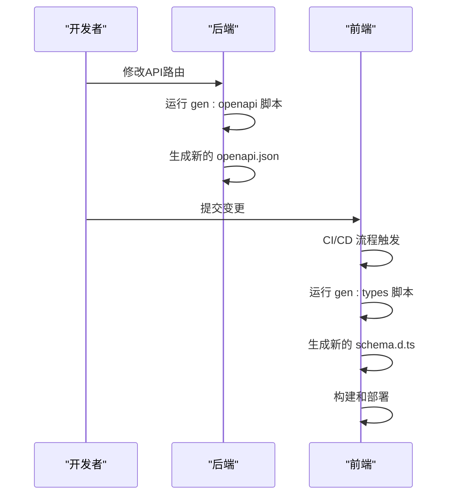

# 类型安全与模式生成

<cite>
**本文档引用的文件**   
- [export-openapi.ts](file://backend/scripts/export-openapi.ts)
- [openapi.json](file://backend/openapi.json)
- [schema.d.ts](file://frontend/src/types/schema.d.ts)
- [useEmployees.ts](file://frontend/src/hooks/business/useEmployees.ts)
- [useAP.ts](file://frontend/src/hooks/business/useAP.ts)
- [api.ts](file://frontend/src/config/api.ts)
- [http.ts](file://frontend/src/api/http.ts)
- [useApiQuery.ts](file://frontend/src/utils/useApiQuery.ts)
- [index.ts](file://backend/src/index.ts)
- [schema-helpers.ts](file://frontend/src/types/schema-helpers.ts)
- [index.ts](file://frontend/src/types/index.ts)
- [package.json](file://backend/package.json)
- [package.json](file://frontend/package.json)
</cite>

## 目录
1. [简介](#简介)
2. [OpenAPI规范生成](#openapi规范生成)
3. [前端类型生成](#前端类型生成)
4. [类型定义结构](#类型定义结构)
5. [类型在Hook中的使用](#类型在hook中的使用)
6. [工作流集成](#工作流集成)
7. [总结](#总结)

## 简介
本项目通过OpenAPI规范实现了前后端之间的类型共享，确保了API接口的类型安全。后端使用Hono框架和zod-openapi库定义路由和验证规则，通过export-openapi.ts脚本将这些定义导出为标准的OpenAPI 3.1规范文件(openapi.json)。前端则利用openapi-typescript工具从该文件生成TypeScript类型定义(schema.d.ts)，并在各种业务Hook中使用这些类型，实现了编译时的类型安全，避免了手动维护接口类型带来的错误和不一致。

**Section sources**
- [export-openapi.ts](file://backend/scripts/export-openapi.ts#L1-L15)
- [openapi.json](file://backend/openapi.json#L1-L800)
- [schema.d.ts](file://frontend/src/types/schema.d.ts#L1-L800)

## OpenAPI规范生成
后端的OpenAPI规范生成是通过`backend/scripts/export-openapi.ts`脚本完成的。该脚本导入了应用的主入口文件`index.ts`，并调用其`getOpenAPI31Document`方法来生成完整的OpenAPI 3.1文档。



**Diagram sources **
- [export-openapi.ts](file://backend/scripts/export-openapi.ts#L1-L15)
- [index.ts](file://backend/src/index.ts#L53-L361)

**Section sources**
- [export-openapi.ts](file://backend/scripts/export-openapi.ts#L1-L15)
- [index.ts](file://backend/src/index.ts#L53-L361)

## 前端类型生成
前端的类型生成是通过`openapi-typescript`工具从`openapi.json`文件自动生成`schema.d.ts`文件。这个过程在`frontend/package.json`中定义为一个npm脚本`gen:types`。



**Diagram sources **
- [package.json](file://frontend/package.json#L14)
- [schema.d.ts](file://frontend/src/types/schema.d.ts#L1-L800)

**Section sources**
- [package.json](file://frontend/package.json#L14)
- [schema.d.ts](file://frontend/src/types/schema.d.ts#L1-L800)

## 类型定义结构
生成的`schema.d.ts`文件定义了`paths`接口，该接口映射了所有API端点。每个端点都包含了其参数、请求体和响应体的详细类型定义。

```typescript
export interface paths {
    "/api/auth/login": {
        post: {
            requestBody: {
                content: {
                    "application/json": {
                        email: string;
                        password: string;
                        totp?: string;
                    };
                };
            };
            responses: {
                200: {
                    content: {
                        "application/json": {
                            ok: boolean;
                            token?: string;
                            user?: unknown;
                        };
                    };
                };
            };
        };
    };
    // ... 其他端点
}
```

这种结构确保了在编译时就能检查API调用的正确性，包括请求参数的格式、请求体的字段以及预期的响应结构。

**Section sources**
- [schema.d.ts](file://frontend/src/types/schema.d.ts#L6-L800)

## 类型在Hook中的使用
生成的类型在前端的业务Hook中被广泛使用，例如`useEmployees`和`useAP`。这些Hook利用`useApiQuery`和`@tanstack/react-query`来处理数据获取和缓存，同时通过导入生成的类型来确保类型安全。

### useEmployees Hook分析
`useEmployees` Hook使用了生成的类型来定义员工相关的API操作，包括获取员工列表、创建员工、更新员工状态等。

```mermaid
classDiagram
class useEmployees {
+useEmployees(filter? : EmployeeFilter) QueryResult~Employee[]~
+useCreateEmployee() Mutation~Employee, Partial~Employee~~
+useResendActivation() Mutation~void, string~
+useResetTotp() Mutation~void, string~
+useEmployeeSalaries(params) QueryResult~any[]~
+useEmployeeAllowances(params) QueryResult~any[]~
+useRegularizeEmployee() Mutation~void, {id, data}~
+useLeaveEmployee() Mutation~void, {id, data}~
+useRejoinEmployee() Mutation~void, {id, data}~
+useUpdateEmployeeSalaries() Mutation~void, UpdateEmployeeSalariesDTO~
+useUpdateEmployeeAllowances() Mutation~void, UpdateEmployeeAllowancesDTO~
+useDeleteEmployee() Mutation~void, string~
+useBatchDeleteEmployee() Mutation~void, string[]~
+useResetUserPassword() Mutation~void, string~
+useToggleUserActive() Mutation~void, {id, active}~
}
useEmployees --> Employee : "使用"
useEmployees --> RegularizeEmployeeDTO : "使用"
useEmployees --> LeaveEmployeeDTO : "使用"
useEmployees --> RejoinEmployeeDTO : "使用"
useEmployees --> UpdateEmployeeSalariesDTO : "使用"
useEmployees --> UpdateEmployeeAllowancesDTO : "使用"
```

**Diagram sources **
- [useEmployees.ts](file://frontend/src/hooks/business/useEmployees.ts#L20-L212)
- [schema.d.ts](file://frontend/src/types/schema.d.ts#L6-L800)

**Section sources**
- [useEmployees.ts](file://frontend/src/hooks/business/useEmployees.ts#L20-L212)

### useAP Hook分析
`useAP` Hook用于处理应付账款（AP）相关的API操作，包括获取AP单据列表、创建AP单据和确认AP单据。

```mermaid
classDiagram
class useAP {
+useAPDocs(page : number, pageSize : number) QueryResult~{total : number, list : ARAP[]}~
+useCreateAP() Mutation~void, CreateAPDocDTO~
+useConfirmAP() Mutation~void, ConfirmARDocDTO~
}
useAP --> ARAP : "使用"
useAP --> CreateAPDocDTO : "使用"
useAP --> ConfirmARDocDTO : "使用"
```

**Diagram sources **
- [useAP.ts](file://frontend/src/hooks/business/useAP.ts#L10-L48)
- [schema.d.ts](file://frontend/src/types/schema.d.ts#L6-L800)

**Section sources**
- [useAP.ts](file://frontend/src/hooks/business/useAP.ts#L10-L48)

## 工作流集成
类型生成的工作流已经集成到项目的开发流程中。当后端API发生变更时，开发者需要重新运行`gen:types`脚本来更新前端的类型定义。这个过程可以手动触发，也可以集成到CI/CD流程中，以确保API变更时前端类型能够自动更新。



**Diagram sources **
- [package.json](file://backend/package.json#L22)
- [package.json](file://frontend/package.json#L14)
- [export-openapi.ts](file://backend/scripts/export-openapi.ts#L1-L15)

**Section sources**
- [package.json](file://backend/package.json#L22)
- [package.json](file://frontend/package.json#L14)
- [export-openapi.ts](file://backend/scripts/export-openapi.ts#L1-L15)

## 总结
通过OpenAPI规范和自动化工具链，本项目实现了前后端之间高效的类型共享。后端通过`export-openapi.ts`脚本生成标准化的API描述文件，前端则利用`openapi-typescript`工具将其转换为TypeScript类型。这些类型在`useEmployees`、`useAP`等业务Hook中被直接使用，确保了API调用的类型安全，避免了手动维护接口类型带来的错误。整个工作流可以通过npm脚本轻松集成，保证了API变更时前端类型的自动更新，极大地提高了开发效率和代码质量。