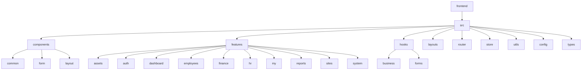
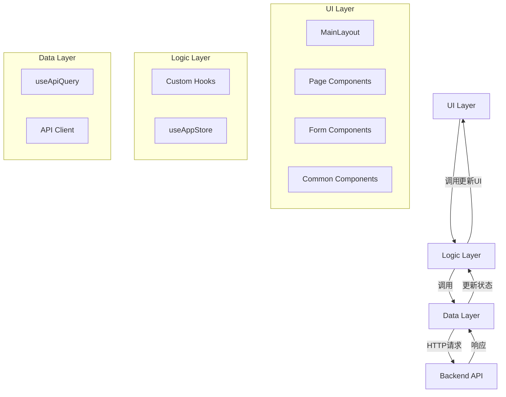
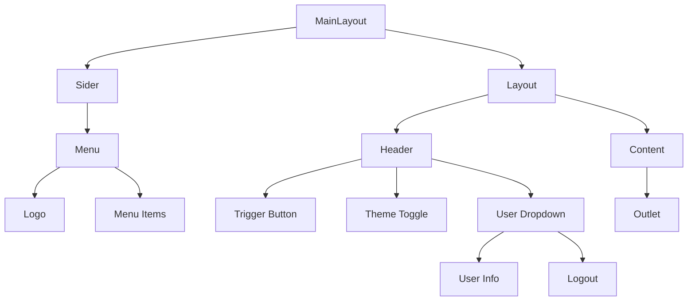
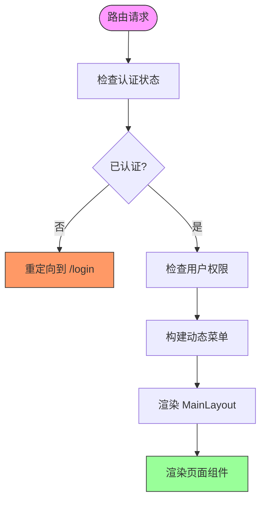
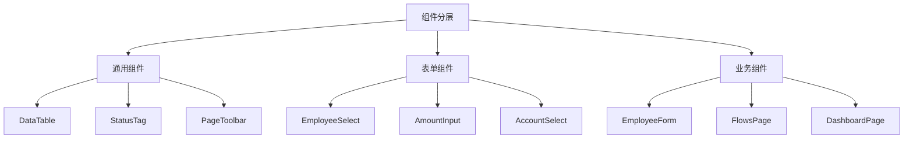
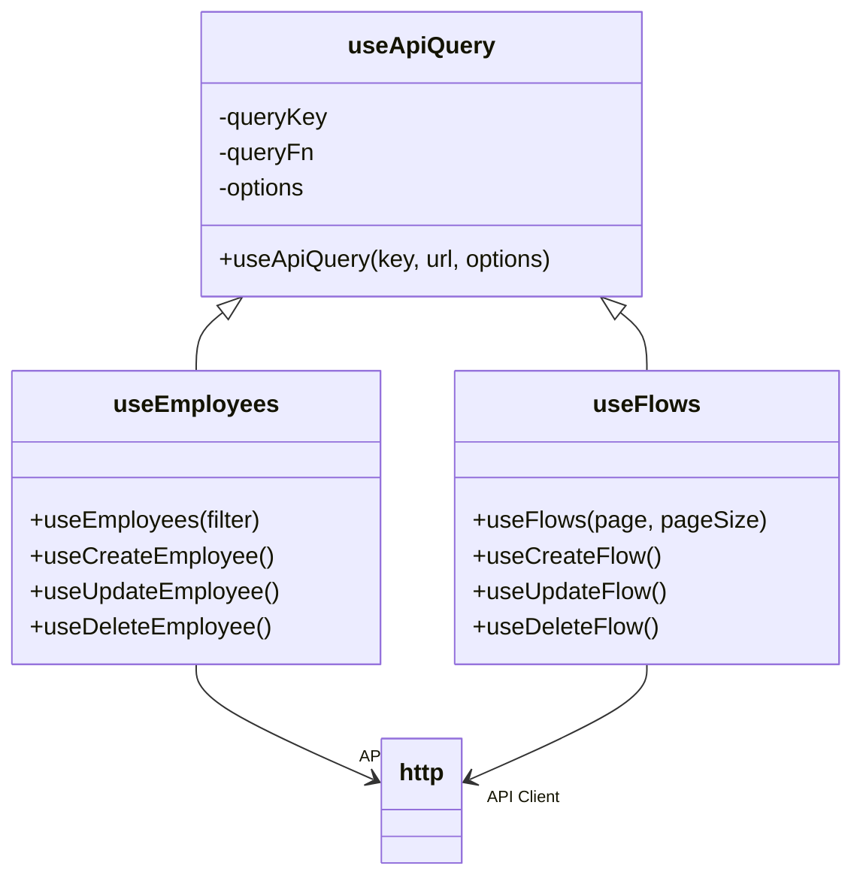
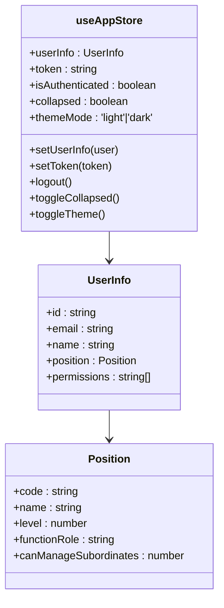
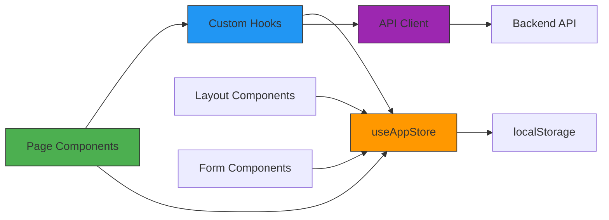

# 前端架构

<cite>
**本文档引用的文件**  
- [MainLayout.tsx](file://frontend/src/layouts/MainLayout.tsx)
- [PrivateRoute.tsx](file://frontend/src/router/PrivateRoute.tsx)
- [index.tsx](file://frontend/src/router/index.tsx)
- [useEmployees.ts](file://frontend/src/hooks/business/useEmployees.ts)
- [useFlows.ts](file://frontend/src/hooks/business/useFlows.ts)
- [useAppStore.ts](file://frontend/src/store/useAppStore.ts)
- [useApiQuery.ts](file://frontend/src/utils/useApiQuery.ts)
- [menu.ts](file://frontend/src/config/menu.ts)
- [EmployeeForm.tsx](file://frontend/src/features/employees/components/forms/EmployeeForm.tsx)
- [DataTable.tsx](file://frontend/src/components/common/DataTable.tsx)
- [index.ts](file://frontend/src/hooks/index.ts)
- [form/index.ts](file://frontend/src/components/form/index.ts)
- [common/index.ts](file://frontend/src/components/common/index.ts)
- [main.tsx](file://frontend/src/main.tsx)
- [permissions.ts](file://frontend/src/utils/permissions.ts)
</cite>

## 目录
1. [简介](#简介)
2. [项目结构](#项目结构)
3. [核心组件](#核心组件)
4. [架构概览](#架构概览)
5. [详细组件分析](#详细组件分析)
6. [依赖分析](#依赖分析)
7. [性能考虑](#性能考虑)
8. [故障排除指南](#故障排除指南)
9. [结论](#结论)

## 简介
本架构文档系统阐述了基于React的前端应用结构设计。文档详细说明了主布局（MainLayout）如何组织页面布局，路由系统如何通过私有路由（PrivateRoute）实现权限控制，以及features目录如何按功能域划分业务模块。文档还深入描述了组件分层策略，包括通用组件（common）、表单组件（form）和业务组件（features下各模块）。此外，文档解释了自定义Hooks（如useEmployees、useFlows等）如何封装API调用逻辑并与React Query集成实现高效状态管理，以及Zustand在全局状态（如用户信息、权限）中的应用。最后，文档提供了UI架构图来展示组件树结构和数据流方向。

## 项目结构

前端应用采用功能驱动的目录结构，将业务逻辑按功能域进行划分。核心目录包括：`components`（通用和表单组件）、`features`（功能模块）、`hooks`（自定义Hooks）、`layouts`（布局组件）、`router`（路由配置）、`store`（全局状态）和`utils`（工具函数）。

**图源**  
- [项目结构](file://frontend)

**本节来源**  
- [项目结构](file://frontend)

## 核心组件

该前端应用的核心组件包括主布局（MainLayout）、私有路由（PrivateRoute）、全局状态存储（useAppStore）和数据获取工具（useApiQuery）。MainLayout负责组织页面的整体布局，包括侧边栏、头部和内容区域。PrivateRoute通过检查用户认证状态来实现路由级别的权限控制。useAppStore使用Zustand管理全局状态，如用户信息、认证状态和UI状态。useApiQuery是基于React Query的通用数据获取Hook，提供缓存、重试和错误处理等高级功能。

**本节来源**  
- [MainLayout.tsx](file://frontend/src/layouts/MainLayout.tsx#L1-L286)
- [PrivateRoute.tsx](file://frontend/src/router/PrivateRoute.tsx#L1-L16)
- [useAppStore.ts](file://frontend/src/store/useAppStore.ts#L1-L90)
- [useApiQuery.ts](file://frontend/src/utils/useApiQuery.ts#L1-L103)

## 架构概览

该应用采用现代化的React架构，结合了React Router进行路由管理，Zustand进行全局状态管理，以及React Query进行数据状态管理。整体架构分为三层：UI层（组件）、逻辑层（Hooks）和数据层（API调用）。UI层负责展示和用户交互，逻辑层封装业务逻辑和状态管理，数据层处理与后端API的通信。

**图源**  
- [MainLayout.tsx](file://frontend/src/layouts/MainLayout.tsx#L1-L286)
- [useAppStore.ts](file://frontend/src/store/useAppStore.ts#L1-L90)
- [useApiQuery.ts](file://frontend/src/utils/useApiQuery.ts#L1-L103)

**本节来源**  
- [MainLayout.tsx](file://frontend/src/layouts/MainLayout.tsx#L1-L286)
- [useAppStore.ts](file://frontend/src/store/useAppStore.ts#L1-L90)
- [useApiQuery.ts](file://frontend/src/utils/useApiQuery.ts#L1-L103)

## 详细组件分析

### MainLayout分析
MainLayout组件是应用的主布局容器，负责组织页面的整体结构。它包含一个可折叠的侧边栏、一个头部区域和一个内容区域。侧边栏显示导航菜单，头部区域显示用户信息和操作按钮，内容区域通过`<Outlet />`渲染当前路由的页面组件。布局支持响应式设计，侧边栏可以折叠以节省空间。

**图源**  
- [MainLayout.tsx](file://frontend/src/layouts/MainLayout.tsx#L1-L286)

**本节来源**  
- [MainLayout.tsx](file://frontend/src/layouts/MainLayout.tsx#L1-L286)

### 路由与权限控制分析
路由系统通过React Router实现，使用`createBrowserRouter`配置路由。私有路由（PrivateRoute）组件用于保护需要认证的页面。它通过`useAppStore`检查用户的认证状态，如果用户未登录，则重定向到登录页面。权限控制不仅基于认证状态，还基于用户的角色和权限，在菜单构建时通过`hasPermission`函数动态生成可见的菜单项。

**图源**  
- [PrivateRoute.tsx](file://frontend/src/router/PrivateRoute.tsx#L1-L16)
- [menu.ts](file://frontend/src/config/menu.ts#L1-L313)

**本节来源**  
- [PrivateRoute.tsx](file://frontend/src/router/PrivateRoute.tsx#L1-L16)
- [menu.ts](file://frontend/src/config/menu.ts#L1-L313)

### 组件分层策略分析
应用采用清晰的组件分层策略，将组件分为三个主要类别：通用组件、表单组件和业务组件。通用组件（位于`components/common`）是可复用的UI元素，如表格、标签和按钮。表单组件（位于`components/form`）是专门用于表单输入的组件，如选择器和输入框。业务组件（位于`features`目录下）是与特定业务功能相关的组件，如员工管理、财务管理等。

**图源**  
- [common/index.ts](file://frontend/src/components/common/index.ts#L1-L25)
- [form/index.ts](file://frontend/src/components/form/index.ts#L1-L23)
- [EmployeeForm.tsx](file://frontend/src/features/employees/components/forms/EmployeeForm.tsx#L1-L315)

**本节来源**  
- [common/index.ts](file://frontend/src/components/common/index.ts#L1-L25)
- [form/index.ts](file://frontend/src/components/form/index.ts#L1-L23)
- [EmployeeForm.tsx](file://frontend/src/features/employees/components/forms/EmployeeForm.tsx#L1-L315)

### 自定义Hooks分析
自定义Hooks是应用逻辑层的核心，封装了数据获取和业务逻辑。`useApiQuery`是基础Hook，基于React Query提供数据获取、缓存和状态管理功能。业务Hooks（如`useEmployees`、`useFlows`）在此基础上构建，封装了特定业务领域的API调用。这些Hooks返回数据状态和操作函数，使组件能够以声明式的方式处理数据。

**图源**  
- [useApiQuery.ts](file://frontend/src/utils/useApiQuery.ts#L1-L103)
- [useEmployees.ts](file://frontend/src/hooks/business/useEmployees.ts#L1-L212)
- [useFlows.ts](file://frontend/src/hooks/business/useFlows.ts#L1-L77)

**本节来源**  
- [useApiQuery.ts](file://frontend/src/utils/useApiQuery.ts#L1-L103)
- [useEmployees.ts](file://frontend/src/hooks/business/useEmployees.ts#L1-L212)
- [useFlows.ts](file://frontend/src/hooks/business/useFlows.ts#L1-L77)

### 全局状态管理分析
全局状态通过Zustand库进行管理，`useAppStore`是应用的全局状态存储。它使用`persist`中间件将状态持久化到localStorage，确保页面刷新后状态不丢失。状态包括用户信息、认证令牌、UI状态（如侧边栏折叠状态）和主题模式。组件通过`useAppStore` Hook订阅所需的状态片段。

**图源**  
- [useAppStore.ts](file://frontend/src/store/useAppStore.ts#L1-L90)

**本节来源**  
- [useAppStore.ts](file://frontend/src/store/useAppStore.ts#L1-L90)

## 依赖分析

应用的依赖关系清晰，遵循单向数据流原则。UI组件依赖于自定义Hooks获取数据和执行操作，Hooks依赖于API客户端与后端通信，全局状态被多个组件和Hook共享。这种分层架构降低了组件间的耦合度，提高了代码的可维护性和可测试性。

**图源**  
- [main.tsx](file://frontend/src/main.tsx#L1-L78)
- [index.ts](file://frontend/src/hooks/index.ts#L1-L40)

**本节来源**  
- [main.tsx](file://frontend/src/main.tsx#L1-L78)
- [index.ts](file://frontend/src/hooks/index.ts#L1-L40)

## 性能考虑

应用在性能方面做了多项优化。首先，使用React Query的缓存机制避免了重复的网络请求。其次，通过`Suspense`和`lazy`实现路由级别的代码分割，减少初始加载时间。第三，`MainLayout`中的菜单项在悬停时预加载对应路由的代码，提升导航体验。最后，表格组件支持虚拟滚动，优化大数据量的渲染性能。

## 故障排除指南

当遇到权限问题时，请检查`useAppStore`中的`userInfo`和`token`是否正确设置。当数据未更新时，请检查`useApiQuery`的`queryKey`是否正确，以及`invalidateQueries`是否被正确调用。当页面无法访问时，请检查`PrivateRoute`的认证逻辑和路由配置。当状态丢失时，请检查Zustand的持久化配置是否正确。

**本节来源**  
- [useAppStore.ts](file://frontend/src/store/useAppStore.ts#L1-L90)
- [PrivateRoute.tsx](file://frontend/src/router/PrivateRoute.tsx#L1-L16)
- [useApiQuery.ts](file://frontend/src/utils/useApiQuery.ts#L1-L103)

## 结论

该前端架构设计合理，采用了现代化的技术栈和最佳实践。通过清晰的分层、合理的状态管理和高效的路由控制，构建了一个可维护、可扩展的React应用。建议继续保持组件的单一职责原则，定期审查和优化性能，并完善错误处理和用户体验。