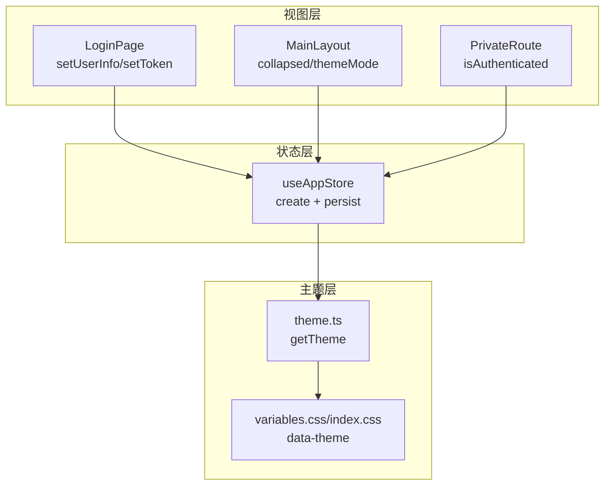
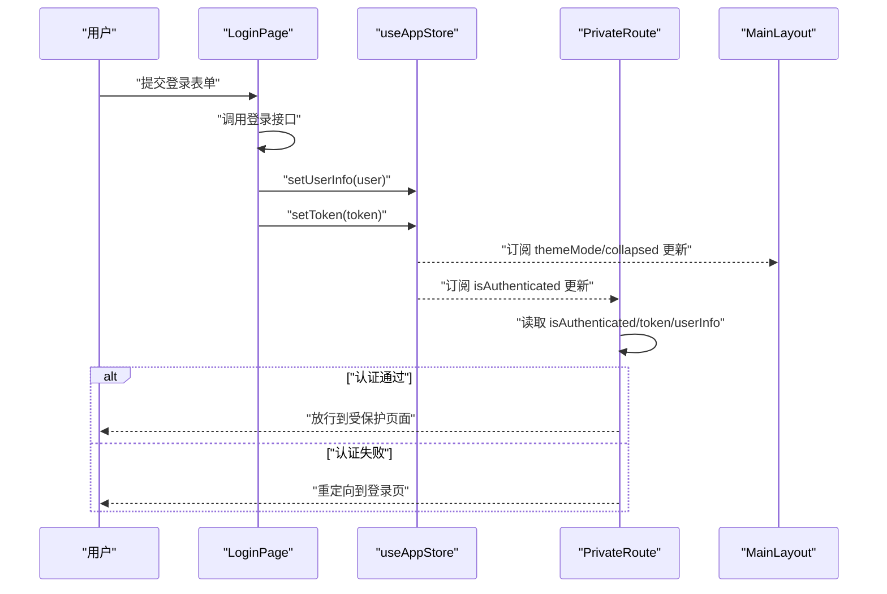
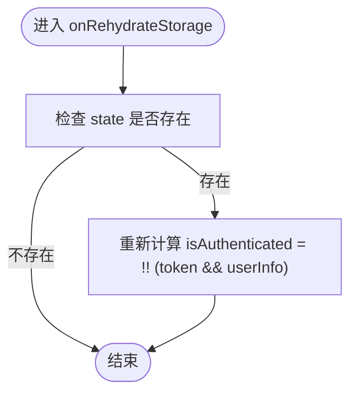
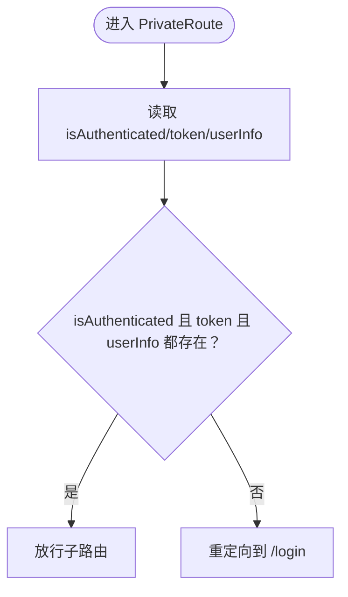
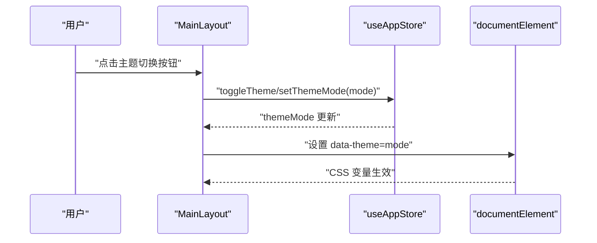
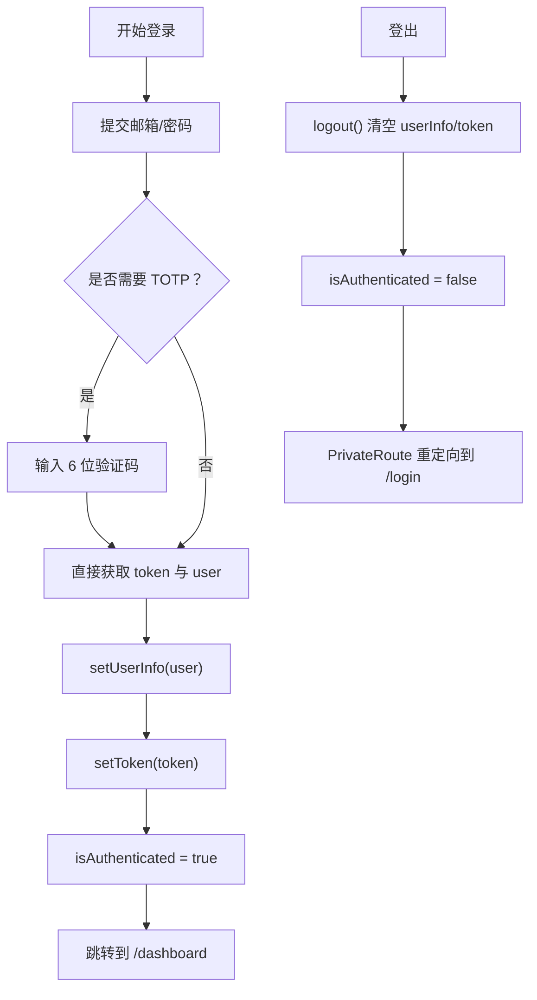
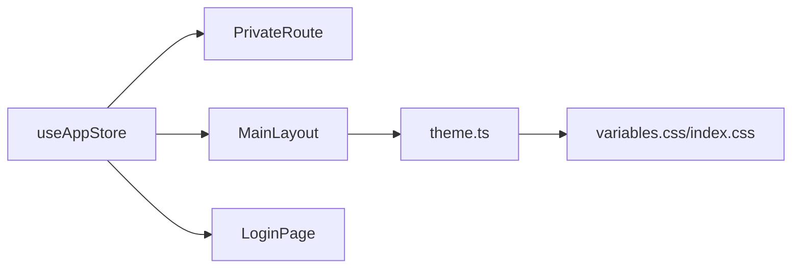

# 全局状态管理

<cite>
**本文引用的文件列表**
- [useAppStore.ts](file://frontend/src/store/useAppStore.ts)
- [PrivateRoute.tsx](file://frontend/src/router/PrivateRoute.tsx)
- [MainLayout.tsx](file://frontend/src/layouts/MainLayout.tsx)
- [LoginPage.tsx](file://frontend/src/features/auth/pages/LoginPage.tsx)
- [theme.ts](file://frontend/src/config/theme.ts)
- [index.css](file://frontend/src/index.css)
- [variables.css](file://frontend/src/styles/variables.css)
- [main.tsx](file://frontend/src/main.tsx)
</cite>

## 目录
1. [简介](#简介)
2. [项目结构](#项目结构)
3. [核心组件](#核心组件)
4. [架构总览](#架构总览)
5. [详细组件分析](#详细组件分析)
6. [依赖关系分析](#依赖关系分析)
7. [性能考量](#性能考量)
8. [故障排查指南](#故障排查指南)
9. [结论](#结论)

## 简介
本文件系统性阐述前端基于 Zustand 的全局状态管理方案，重点围绕 useAppStore 的设计与实现，解释其如何通过 create 和 persist 中间件实现用户会话（userInfo、token）、认证状态（isAuthenticated）、UI 状态（collapsed、themeMode）的持久化存储与响应式更新；说明状态切片（partialize）策略如何优化 localStorage 序列化内容；以及 onRehydrateStorage 如何在页面重载后重新计算 isAuthenticated。文档还提供状态变更流程图，覆盖登录、登出、主题切换等关键操作，并给出错误边界处理与状态恢复的最佳实践建议。

## 项目结构
- 全局状态位于 store/useAppStore.ts，采用 create + persist 中间件，将状态持久化到浏览器本地存储。
- 路由守卫 PrivateRoute 读取 useAppStore 的认证状态，确保受保护页面的安全访问。
- 主布局 MainLayout 通过 useAppStore 控制侧边栏折叠与主题切换。
- 登录页 LoginPage 在登录成功后写入 userInfo 与 token，从而驱动 isAuthenticated 的计算与 UI 更新。
- 主题配置 theme.ts 与样式 variables.css/index.css 将主题模式同步到 DOM 与 CSS 变量，形成统一的视觉体系。

图表来源
- [useAppStore.ts](file://frontend/src/store/useAppStore.ts#L43-L89)
- [PrivateRoute.tsx](file://frontend/src/router/PrivateRoute.tsx#L1-L16)
- [MainLayout.tsx](file://frontend/src/layouts/MainLayout.tsx#L220-L286)
- [LoginPage.tsx](file://frontend/src/features/auth/pages/LoginPage.tsx#L1-L194)
- [theme.ts](file://frontend/src/config/theme.ts#L175-L177)
- [index.css](file://frontend/src/index.css#L67-L126)
- [variables.css](file://frontend/src/styles/variables.css#L76-L117)

章节来源
- [useAppStore.ts](file://frontend/src/store/useAppStore.ts#L1-L89)
- [PrivateRoute.tsx](file://frontend/src/router/PrivateRoute.tsx#L1-L16)
- [MainLayout.tsx](file://frontend/src/layouts/MainLayout.tsx#L220-L286)
- [LoginPage.tsx](file://frontend/src/features/auth/pages/LoginPage.tsx#L1-L194)
- [theme.ts](file://frontend/src/config/theme.ts#L1-L180)
- [index.css](file://frontend/src/index.css#L67-L126)
- [variables.css](file://frontend/src/styles/variables.css#L76-L117)

## 核心组件
- useAppStore：定义应用状态切片（UI 折叠、主题模式、用户信息、令牌、认证标志），并以 persist 中间件实现本地持久化。
- PrivateRoute：基于 useAppStore 的 isAuthenticated、token、userInfo 进行双重校验，防止本地存储被篡改导致越权访问。
- MainLayout：消费 useAppStore 的 collapsed 与 themeMode，控制侧边栏折叠与主题切换按钮交互。
- LoginPage：登录成功后调用 setUserInfo 与 setToken，驱动 isAuthenticated 计算与页面跳转。

章节来源
- [useAppStore.ts](file://frontend/src/store/useAppStore.ts#L1-L89)
- [PrivateRoute.tsx](file://frontend/src/router/PrivateRoute.tsx#L1-L16)
- [MainLayout.tsx](file://frontend/src/layouts/MainLayout.tsx#L220-L286)
- [LoginPage.tsx](file://frontend/src/features/auth/pages/LoginPage.tsx#L1-L194)

## 架构总览
Zustand 状态通过 persist 中间件写入 localStorage，键名为 caiwu-app-storage。persist 提供：
- partialize：仅序列化必要的字段（collapsed、themeMode、userInfo、token、isAuthenticated），减少冗余数据与序列化成本。
- onRehydrateStorage：在从 localStorage 恢复后，重新计算 isAuthenticated，确保即使本地存储被篡改也能正确反映当前会话状态。

图表来源
- [LoginPage.tsx](file://frontend/src/features/auth/pages/LoginPage.tsx#L1-L194)
- [useAppStore.ts](file://frontend/src/store/useAppStore.ts#L43-L89)
- [PrivateRoute.tsx](file://frontend/src/router/PrivateRoute.tsx#L1-L16)
- [MainLayout.tsx](file://frontend/src/layouts/MainLayout.tsx#L220-L286)

## 详细组件分析

### useAppStore：状态切片与持久化策略
- 状态切片
  - UI 状态：collapsed（布尔）
  - 主题状态：themeMode（'light' | 'dark'）
  - 认证/用户状态：userInfo（用户对象或 null）、token（字符串或 null）、isAuthenticated（布尔）
- 状态更新
  - setUserInfo：设置用户信息并联动计算 isAuthenticated（当 userInfo 与 token 同时存在时为真）
  - setToken：设置令牌并联动计算 isAuthenticated（当 token 与 userInfo 同时存在时为真）
  - logout：清空用户信息与令牌，强制 isAuthenticated 为假
  - toggleCollapsed/setCollapsed：控制侧边栏折叠
  - toggleTheme/setThemeMode：切换主题模式
- 持久化策略
  - name：localStorage 键名 caiwu-app-storage
  - partialize：仅持久化 collapsed、themeMode、userInfo、token、isAuthenticated，避免将大对象或临时数据写入存储
  - onRehydrateStorage：在从 localStorage 恢复后，再次计算 isAuthenticated，确保状态一致性

图表来源
- [useAppStore.ts](file://frontend/src/store/useAppStore.ts#L72-L89)

章节来源
- [useAppStore.ts](file://frontend/src/store/useAppStore.ts#L1-L89)

### 认证状态与路由守卫
- PrivateRoute 读取 useAppStore 的 isAuthenticated、token、userInfo，进行双重校验：
  - 若任一为假，则重定向至登录页
  - 此设计可有效防止用户手动修改 localStorage 导致的越权访问
- LoginPage 在登录成功后调用 setUserInfo 与 setToken，从而驱动 isAuthenticated 变为真并跳转到仪表盘

图表来源
- [PrivateRoute.tsx](file://frontend/src/router/PrivateRoute.tsx#L1-L16)
- [LoginPage.tsx](file://frontend/src/features/auth/pages/LoginPage.tsx#L1-L194)
- [useAppStore.ts](file://frontend/src/store/useAppStore.ts#L43-L89)

章节来源
- [PrivateRoute.tsx](file://frontend/src/router/PrivateRoute.tsx#L1-L16)
- [LoginPage.tsx](file://frontend/src/features/auth/pages/LoginPage.tsx#L1-L194)
- [useAppStore.ts](file://frontend/src/store/useAppStore.ts#L43-L89)

### 主题切换与 UI 状态
- 主题切换
  - MainLayout 中的切换按钮调用 useAppStore 的 toggleTheme/setThemeMode
  - 应用入口 main.tsx 将 themeMode 同步到 documentElement 的 data-theme 属性，配合 theme.ts 与 CSS 变量实现主题切换
- 侧边栏折叠
  - MainLayout 中的折叠按钮调用 useAppStore 的 toggleCollapsed/setCollapsed
  - collapsed 影响布局宽度与菜单显示效果

图表来源
- [MainLayout.tsx](file://frontend/src/layouts/MainLayout.tsx#L220-L286)
- [useAppStore.ts](file://frontend/src/store/useAppStore.ts#L43-L89)
- [main.tsx](file://frontend/src/main.tsx#L34-L77)
- [theme.ts](file://frontend/src/config/theme.ts#L175-L177)
- [index.css](file://frontend/src/index.css#L67-L126)
- [variables.css](file://frontend/src/styles/variables.css#L76-L117)

章节来源
- [MainLayout.tsx](file://frontend/src/layouts/MainLayout.tsx#L220-L286)
- [useAppStore.ts](file://frontend/src/store/useAppStore.ts#L43-L89)
- [main.tsx](file://frontend/src/main.tsx#L34-L77)
- [theme.ts](file://frontend/src/config/theme.ts#L1-L180)
- [index.css](file://frontend/src/index.css#L67-L126)
- [variables.css](file://frontend/src/styles/variables.css#L76-L117)

### 登录与登出流程
- 登录流程
  - 用户提交邮箱与密码，若需要二次验证则进入 TOTP 步骤
  - 登录成功后，前端调用 setUserInfo 与 setToken，触发 isAuthenticated 为真并跳转
- 登出流程
  - 调用 logout 清空 userInfo、token、isAuthenticated
  - 路由守卫检测到认证失败，重定向到登录页

图表来源
- [LoginPage.tsx](file://frontend/src/features/auth/pages/LoginPage.tsx#L1-L194)
- [useAppStore.ts](file://frontend/src/store/useAppStore.ts#L43-L89)
- [PrivateRoute.tsx](file://frontend/src/router/PrivateRoute.tsx#L1-L16)

章节来源
- [LoginPage.tsx](file://frontend/src/features/auth/pages/LoginPage.tsx#L1-L194)
- [useAppStore.ts](file://frontend/src/store/useAppStore.ts#L43-L89)
- [PrivateRoute.tsx](file://frontend/src/router/PrivateRoute.tsx#L1-L16)

## 依赖关系分析
- useAppStore 作为全局状态源，被多个组件依赖：
  - PrivateRoute：用于路由安全校验
  - MainLayout：用于 UI 与主题状态
  - LoginPage：用于写入用户会话与令牌
- 主题系统通过 theme.ts 与 CSS 变量实现解耦，避免在业务逻辑中直接操作 DOM

图表来源
- [useAppStore.ts](file://frontend/src/store/useAppStore.ts#L43-L89)
- [PrivateRoute.tsx](file://frontend/src/router/PrivateRoute.tsx#L1-L16)
- [MainLayout.tsx](file://frontend/src/layouts/MainLayout.tsx#L220-L286)
- [LoginPage.tsx](file://frontend/src/features/auth/pages/LoginPage.tsx#L1-L194)
- [theme.ts](file://frontend/src/config/theme.ts#L175-L177)
- [index.css](file://frontend/src/index.css#L67-L126)
- [variables.css](file://frontend/src/styles/variables.css#L76-L117)

章节来源
- [useAppStore.ts](file://frontend/src/store/useAppStore.ts#L43-L89)
- [PrivateRoute.tsx](file://frontend/src/router/PrivateRoute.tsx#L1-L16)
- [MainLayout.tsx](file://frontend/src/layouts/MainLayout.tsx#L220-L286)
- [LoginPage.tsx](file://frontend/src/features/auth/pages/LoginPage.tsx#L1-L194)
- [theme.ts](file://frontend/src/config/theme.ts#L1-L180)
- [index.css](file://frontend/src/index.css#L67-L126)
- [variables.css](file://frontend/src/styles/variables.css#L76-L117)

## 性能考量
- 状态切片（partialize）仅持久化必要字段，降低序列化与反序列化开销，缩短页面加载时间。
- onRehydrateStorage 在恢复后即时重算 isAuthenticated，避免因本地存储不一致导致的额外渲染与判断。
- 主题切换通过 data-theme 与 CSS 变量实现，避免频繁重排与重绘，提升交互流畅度。
- 路由守卫采用轻量级状态读取，避免复杂计算带来的性能负担。

## 故障排查指南
- 登录后仍提示未登录
  - 检查 setUserInfo 与 setToken 是否被正确调用
  - 确认 localStorage 中 caiwu-app-storage 是否包含 userInfo 与 token
  - onRehydrateStorage 是否被触发并重新计算 isAuthenticated
- 主题切换无效
  - 确认 main.tsx 已将 themeMode 同步到 documentElement 的 data-theme
  - 检查 theme.ts 的 getTheme 与 CSS 变量是否匹配
- 页面刷新后状态异常
  - 检查 localStorage 中的持久化字段是否完整
  - 若字段缺失或损坏，可清理 localStorage 并重新登录
- 路由守卫误判
  - 确保 PrivateRoute 同时检查 isAuthenticated、token、userInfo 三者
  - 避免仅依赖单一字段进行判断

章节来源
- [useAppStore.ts](file://frontend/src/store/useAppStore.ts#L72-L89)
- [PrivateRoute.tsx](file://frontend/src/router/PrivateRoute.tsx#L1-L16)
- [main.tsx](file://frontend/src/main.tsx#L34-L77)
- [theme.ts](file://frontend/src/config/theme.ts#L175-L177)
- [index.css](file://frontend/src/index.css#L67-L126)
- [variables.css](file://frontend/src/styles/variables.css#L76-L117)

## 结论
本项目通过 Zustand + persist 实现了简洁而稳健的全局状态管理：以最小化的持久化字段保障性能与安全；以 onRehydrateStorage 在重载后恢复一致性；以路由守卫与主题系统形成完整的用户体验闭环。该方案易于扩展与维护，适合中大型前端应用的状态治理。