# 业务数据集成

<cite>
**本文档引用的文件**  
- [useBusinessData.ts](file://frontend/src/hooks/useBusinessData.ts)
- [useEmployees.ts](file://frontend/src/hooks/business/useEmployees.ts)
- [useFlows.ts](file://frontend/src/hooks/business/useFlows.ts)
- [useAccounts.ts](file://frontend/src/hooks/business/useAccounts.ts)
- [useCurrencies.ts](file://frontend/src/hooks/business/useCurrencies.ts)
- [useDepartments.ts](file://frontend/src/hooks/business/useDepartments.ts)
- [useCategories.ts](file://frontend/src/hooks/business/useCategories.ts)
- [useApiQuery.ts](file://frontend/src/utils/useApiQuery.ts)
- [cache.ts](file://frontend/src/config/cache.ts)
- [api.ts](file://frontend/src/config/api.ts)
- [business.ts](file://frontend/src/types/business.ts)
- [EmployeeSelect.tsx](file://frontend/src/components/form/EmployeeSelect.tsx)
- [CurrencySelect.tsx](file://frontend/src/components/form/CurrencySelect.tsx)
- [AccountSelect.tsx](file://frontend/src/components/form/AccountSelect.tsx)
- [DepartmentSelect.tsx](file://frontend/src/components/form/DepartmentSelect.tsx)
</cite>

## 目录
1. [引言](#引言)
2. [核心数据获取机制](#核心数据获取机制)
3. [useApiQuery 统一查询接口](#useapiquery-统一查询接口)
4. [主数据查询Hook实现](#主数据查询hook实现)
5. [业务数据查询Hook实现](#业务数据查询hook实现)
6. [数据选择器组件集成](#数据选择器组件集成)
7. [缓存策略与失效机制](#缓存策略与失效机制)
8. [错误处理与加载状态](#错误处理与加载状态)
9. [实际应用场景](#实际应用场景)
10. [总结](#总结)

## 引言

本文档系统阐述了财务系统中业务数据集成的实现机制，重点分析各类业务Hook如何基于`useApiQuery`实现数据获取。文档详细解释了`useEmployees`、`useFlows`等Hook如何定义查询键、配置缓存策略并处理特定业务数据，以及`useBusinessData`如何抽象主数据查询逻辑，为表单选择器等通用组件提供统一的数据访问接口。通过实际代码示例展示员工、财务流水、账户、币种、部门等核心业务数据的获取模式，说明数据选择器（select）的转换逻辑和缓存失效策略。

## 核心数据获取机制

系统采用React Query作为数据获取和状态管理的核心库，通过自定义Hook封装数据获取逻辑，实现数据获取、缓存、错误处理和后台刷新的统一管理。核心机制包括：

- **查询键（Query Key）**：使用数组定义查询键，支持参数化查询，确保不同参数的查询结果独立缓存
- **数据选择（Select）**：通过`select`函数对原始API响应进行转换，提取和格式化所需数据
- **缓存时间（Stale Time）**：根据数据类型配置不同的缓存策略，优化性能和数据新鲜度
- **查询失效（Invalidation）**：在数据变更后自动失效相关查询，触发数据刷新

**Section sources**
- [useApiQuery.ts](file://frontend/src/utils/useApiQuery.ts#L1-L102)

## useApiQuery 统一查询接口

`useApiQuery`是系统中所有数据获取Hook的基础，封装了React Query的`useQuery`功能，提供统一的数据获取接口。

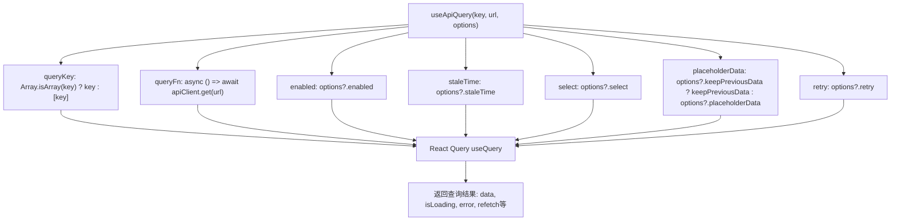

**Diagram sources**
- [useApiQuery.ts](file://frontend/src/utils/useApiQuery.ts#L11-L41)

**Section sources**
- [useApiQuery.ts](file://frontend/src/utils/useApiQuery.ts#L1-L102)

## 主数据查询Hook实现

主数据是指变化频率较低的基础数据，如币种、类别、部门等。系统为每种主数据提供了专门的Hook，遵循统一的设计模式。

### 币种数据查询

`useCurrencies` Hook用于获取币种数据，支持按激活状态过滤。

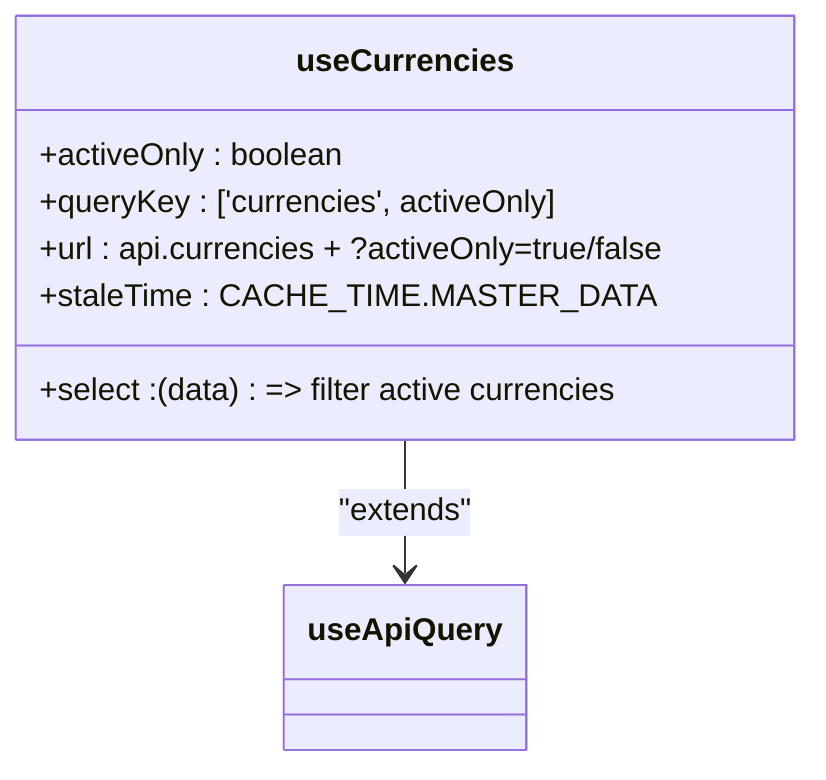

**Diagram sources**
- [useCurrencies.ts](file://frontend/src/hooks/business/useCurrencies.ts#L15-L31)
- [useApiQuery.ts](file://frontend/src/utils/useApiQuery.ts#L11-L41)

**Section sources**
- [useCurrencies.ts](file://frontend/src/hooks/business/useCurrencies.ts#L1-L122)
- [cache.ts](file://frontend/src/config/cache.ts#L7-L8)

### 类别数据查询

`useCategories` Hook用于获取收入和支出类别数据，支持按类别类型过滤。

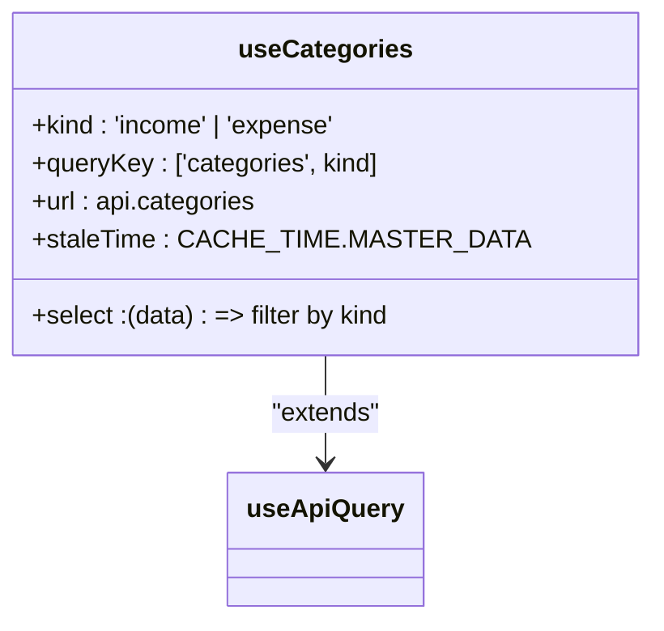

**Diagram sources**
- [useCategories.ts](file://frontend/src/hooks/business/useCategories.ts#L14-L26)
- [useApiQuery.ts](file://frontend/src/utils/useApiQuery.ts#L11-L41)

**Section sources**
- [useCategories.ts](file://frontend/src/hooks/business/useCategories.ts#L1-L90)
- [cache.ts](file://frontend/src/config/cache.ts#L7-L8)

### 部门数据查询

`useDepartments` Hook用于获取部门数据，提供基础查询和选项格式化功能。

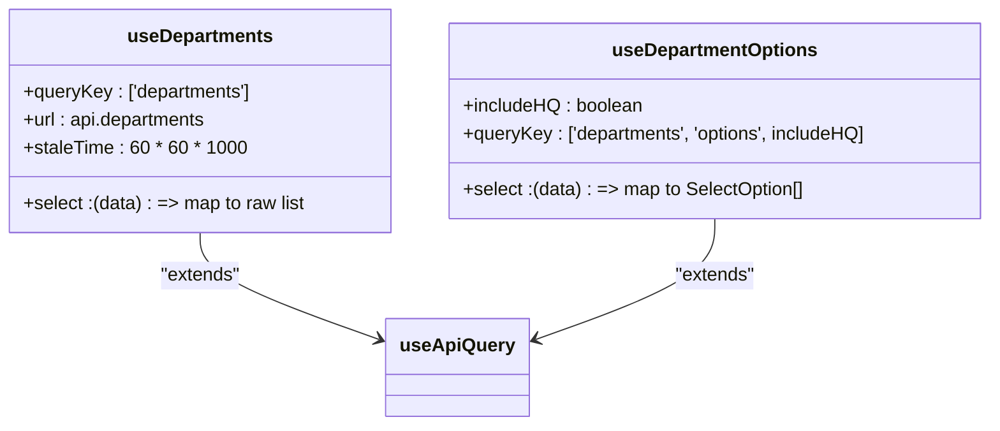

**Diagram sources**
- [useDepartments.ts](file://frontend/src/hooks/business/useDepartments.ts#L18-L49)
- [useApiQuery.ts](file://frontend/src/utils/useApiQuery.ts#L11-L41)

**Section sources**
- [useDepartments.ts](file://frontend/src/hooks/business/useDepartments.ts#L1-L97)
- [cache.ts](file://frontend/src/config/cache.ts#L7-L8)

## 业务数据查询Hook实现

业务数据是指变化频率较高的操作数据，如员工、财务流水等。这些Hook通常包含更复杂的查询逻辑和数据处理。

### 员工数据查询

`useEmployees` Hook用于获取员工数据，支持多种过滤条件。

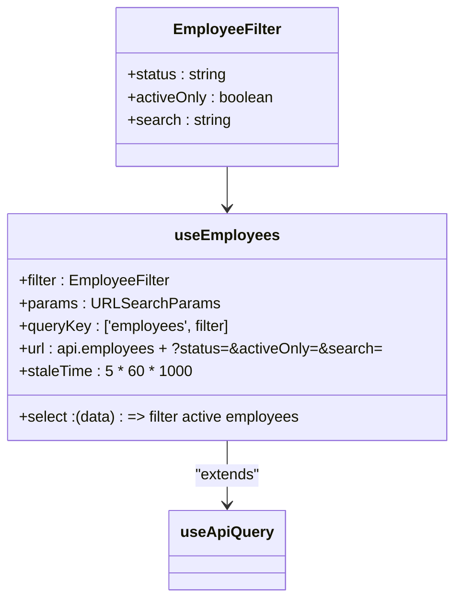

**Diagram sources**
- [useEmployees.ts](file://frontend/src/hooks/business/useEmployees.ts#L20-L33)
- [useApiQuery.ts](file://frontend/src/utils/useApiQuery.ts#L11-L41)

**Section sources**
- [useEmployees.ts](file://frontend/src/hooks/business/useEmployees.ts#L1-L212)
- [api.ts](file://frontend/src/config/api.ts#L91-L98)

### 财务流水数据查询

`useFlows` Hook用于获取财务流水数据，支持分页查询和数据预处理。

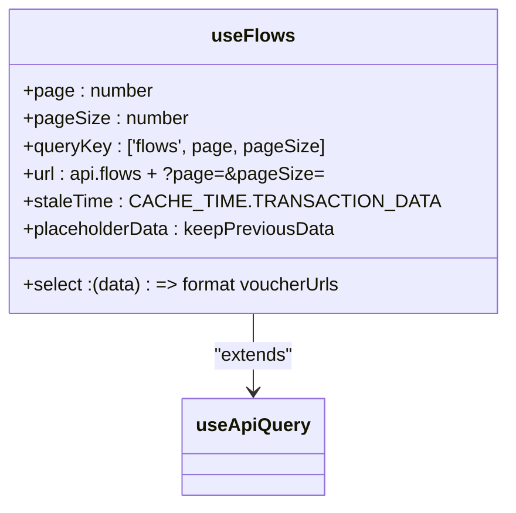

**Diagram sources**
- [useFlows.ts](file://frontend/src/hooks/business/useFlows.ts#L8-L27)
- [useApiQuery.ts](file://frontend/src/utils/useApiQuery.ts#L11-L41)

**Section sources**
- [useFlows.ts](file://frontend/src/hooks/business/useFlows.ts#L1-L77)
- [cache.ts](file://frontend/src/config/cache.ts#L13-L14)

### 账户数据查询

`useAccounts` Hook用于获取账户数据，支持多种过滤条件和选项格式化。

```mermaid
classDiagram
class useAccounts {
+filters : { activeOnly, currency, accountType, search }
+params : URLSearchParams
+queryKey : ['accounts', filters]
+url : api.accounts + ?active=&currency=&accountType=&search=
+select : (data) => map to Account[]
+staleTime : CACHE_TIME.BUSINESS_DATA
}
class useAccountOptions {
+currency : string
+queryKey : ['accounts', 'options', currency]
+select : (data) => filter by currency and map to SelectOption[]
}
useAccounts --> useApiQuery : "extends"
useAccountOptions --> useApiQuery : "extends"
```

**Diagram sources**
- [useAccounts.ts](file://frontend/src/hooks/business/useAccounts.ts#L15-L49)
- [useApiQuery.ts](file://frontend/src/utils/useApiQuery.ts#L11-L41)

**Section sources**
- [useAccounts.ts](file://frontend/src/hooks/business/useAccounts.ts#L1-L129)
- [cache.ts](file://frontend/src/config/cache.ts#L10-L11)

## 数据选择器组件集成

系统提供了一系列数据选择器组件，将业务Hook与UI组件（如Ant Design的Select）集成，简化表单开发。

### 员工选择器

`EmployeeSelect`组件封装了员工选择逻辑，提供统一的UI和数据格式。

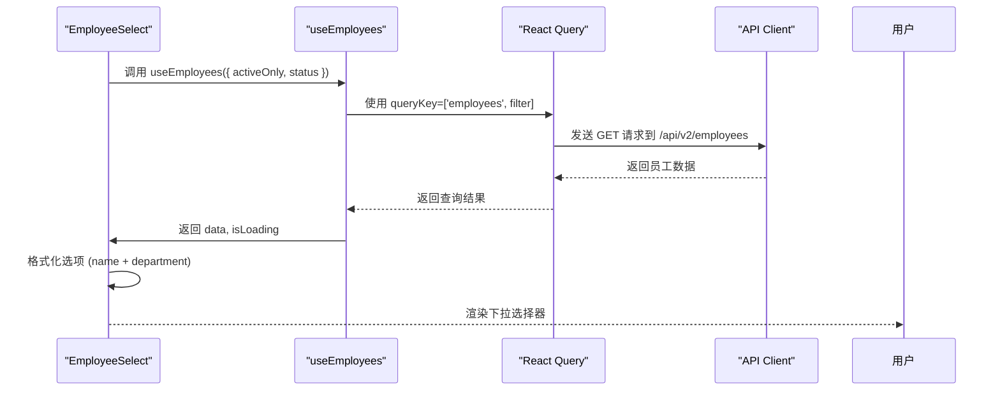

**Diagram sources**
- [EmployeeSelect.tsx](file://frontend/src/components/form/EmployeeSelect.tsx#L36-L62)
- [useEmployees.ts](file://frontend/src/hooks/business/useEmployees.ts#L20-L33)

**Section sources**
- [EmployeeSelect.tsx](file://frontend/src/components/form/EmployeeSelect.tsx#L1-L74)
- [useEmployees.ts](file://frontend/src/hooks/business/useEmployees.ts#L20-L33)

### 币种选择器

`CurrencySelect`组件封装了币种选择逻辑，支持代码和名称显示。

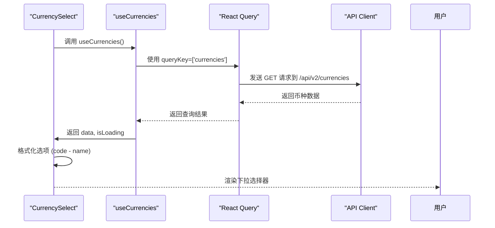

**Diagram sources**
- [CurrencySelect.tsx](file://frontend/src/components/form/CurrencySelect.tsx#L32-L60)
- [useCurrencies.ts](file://frontend/src/hooks/business/useCurrencies.ts#L15-L31)

**Section sources**
- [CurrencySelect.tsx](file://frontend/src/components/form/CurrencySelect.tsx#L1-L81)
- [useCurrencies.ts](file://frontend/src/hooks/business/useCurrencies.ts#L15-L31)

### 账户选择器

`AccountSelect`组件封装了账户选择逻辑，支持币种过滤和选择回调。

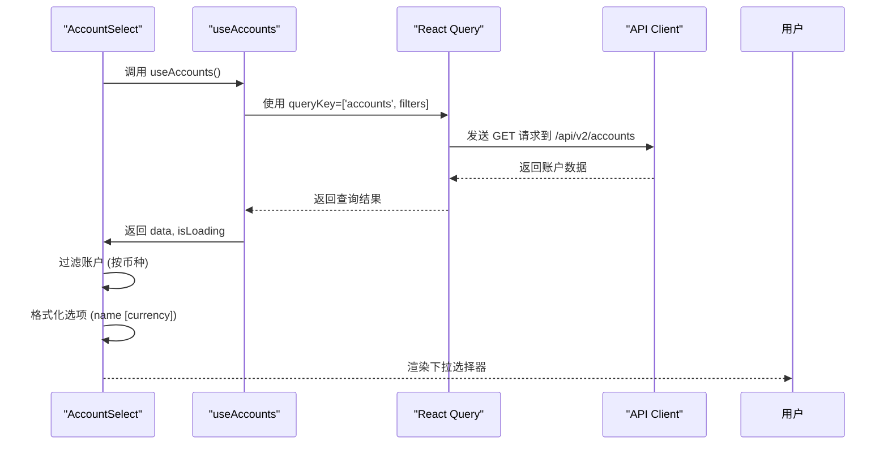

**Diagram sources**
- [AccountSelect.tsx](file://frontend/src/components/form/AccountSelect.tsx#L46-L92)
- [useAccounts.ts](file://frontend/src/hooks/business/useAccounts.ts#L15-L49)

**Section sources**
- [AccountSelect.tsx](file://frontend/src/components/form/AccountSelect.tsx#L1-L104)
- [useAccounts.ts](file://frontend/src/hooks/business/useAccounts.ts#L15-L49)

### 部门选择器

`DepartmentSelect`组件封装了部门选择逻辑，提供简单的部门选择功能。

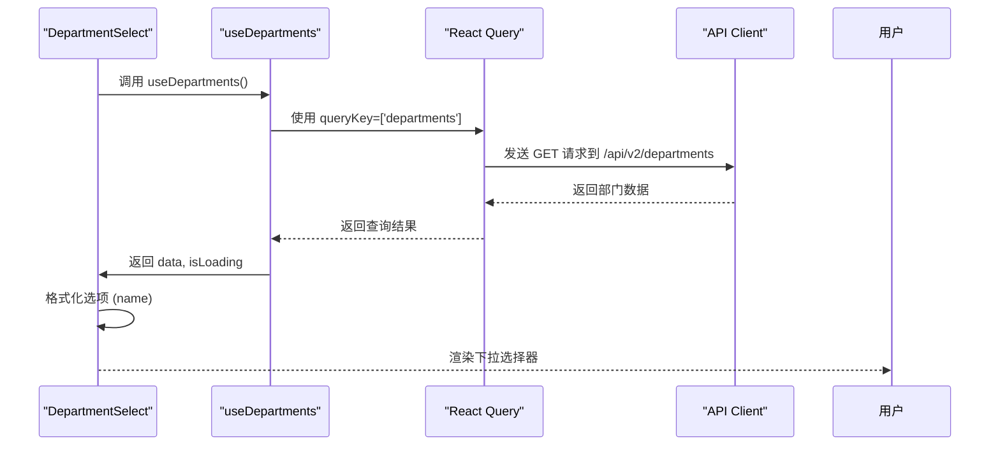

**Diagram sources**
- [DepartmentSelect.tsx](file://frontend/src/components/form/DepartmentSelect.tsx#L29-L53)
- [useDepartments.ts](file://frontend/src/hooks/business/useDepartments.ts#L18-L30)

**Section sources**
- [DepartmentSelect.tsx](file://frontend/src/components/form/DepartmentSelect.tsx#L1-L64)
- [useDepartments.ts](file://frontend/src/hooks/business/useDepartments.ts#L18-L30)

## 缓存策略与失效机制

系统采用分层缓存策略，根据数据类型和变化频率配置不同的缓存时间。

### 缓存时间配置

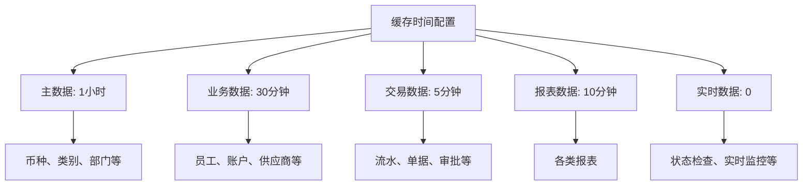

**Diagram sources**
- [cache.ts](file://frontend/src/config/cache.ts#L5-L20)

**Section sources**
- [cache.ts](file://frontend/src/config/cache.ts#L1-L21)

### 查询失效机制

当数据发生变更时，系统通过`useMutation`的`onSuccess`回调自动失效相关查询。

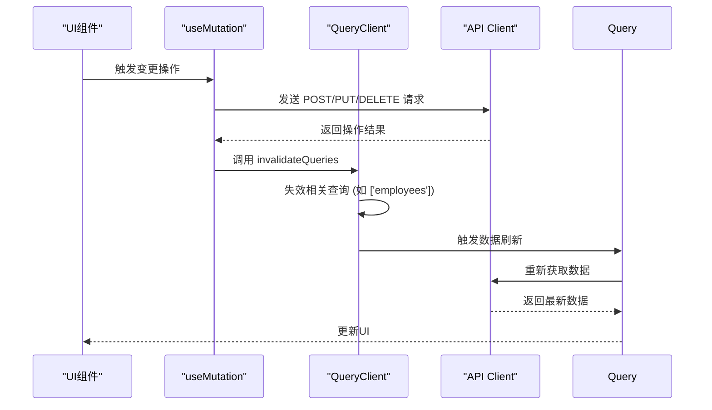

**Diagram sources**
- [useEmployees.ts](file://frontend/src/hooks/business/useEmployees.ts#L37-L45)
- [useAccounts.ts](file://frontend/src/hooks/business/useAccounts.ts#L81-L88)

**Section sources**
- [useEmployees.ts](file://frontend/src/hooks/business/useEmployees.ts#L36-L47)
- [useAccounts.ts](file://frontend/src/hooks/business/useAccounts.ts#L80-L91)

## 错误处理与加载状态

系统通过React Query的内置机制处理错误和加载状态，提供一致的用户体验。

### 查询状态管理

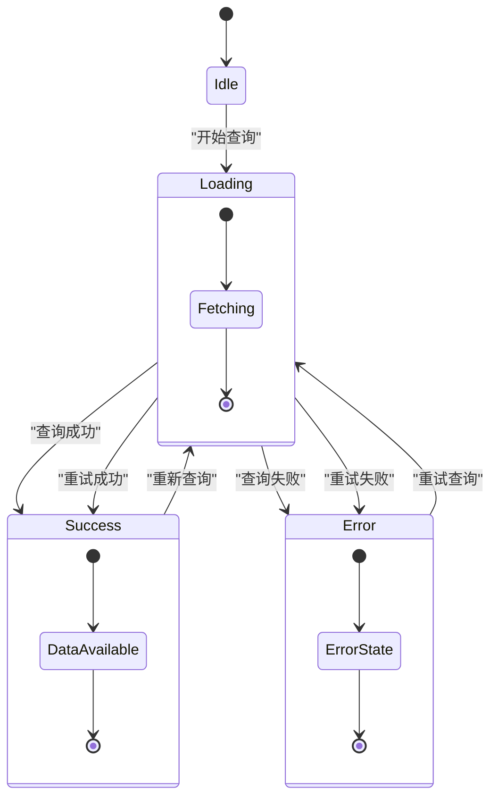

**Diagram sources**
- [useApiQuery.ts](file://frontend/src/utils/useApiQuery.ts#L26-L40)

**Section sources**
- [useApiQuery.ts](file://frontend/src/utils/useApiQuery.ts#L1-L102)

### 错误处理策略

系统在`useApiQuery`中配置了重试机制，并在组件中通过`error`状态显示错误信息。

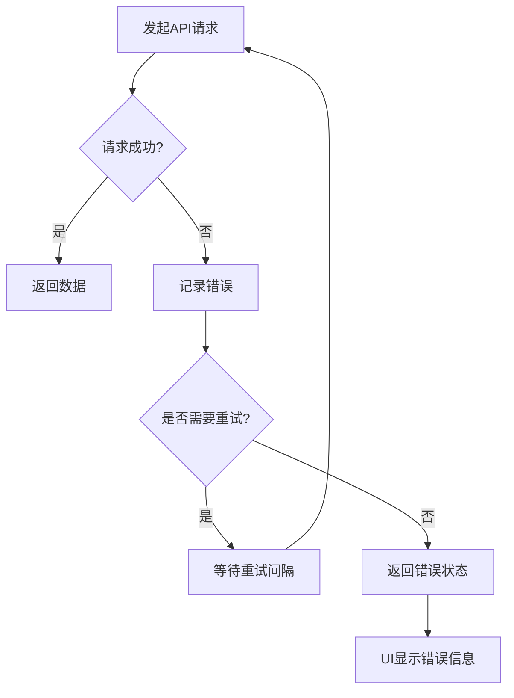

**Diagram sources**
- [useApiQuery.ts](file://frontend/src/utils/useApiQuery.ts#L39-L40)

**Section sources**
- [useApiQuery.ts](file://frontend/src/utils/useApiQuery.ts#L1-L102)

## 实际应用场景

### 员工管理页面

在员工管理页面中，`useEmployees` Hook用于获取员工列表，支持搜索和状态过滤。

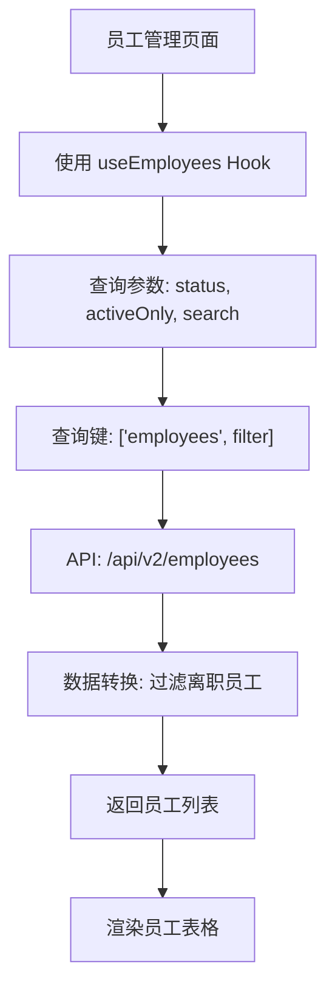

**Section sources**
- [useEmployees.ts](file://frontend/src/hooks/business/useEmployees.ts#L20-L33)

### 财务流水页面

在财务流水页面中，`useFlows` Hook用于获取分页的流水数据，支持后台刷新。

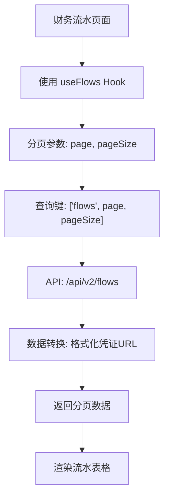

**Section sources**
- [useFlows.ts](file://frontend/src/hooks/business/useFlows.ts#L8-L27)

### 表单创建场景

在表单创建场景中，各种选择器组件用于选择关联数据。

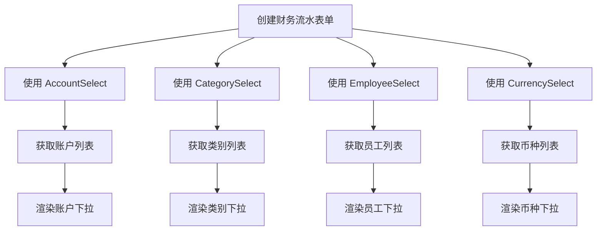

**Section sources**
- [AccountSelect.tsx](file://frontend/src/components/form/AccountSelect.tsx#L46-L92)
- [EmployeeSelect.tsx](file://frontend/src/components/form/EmployeeSelect.tsx#L36-L62)
- [CurrencySelect.tsx](file://frontend/src/components/form/CurrencySelect.tsx#L32-L60)

## 总结

本系统通过`useApiQuery`统一的数据获取接口，实现了业务数据的高效集成。核心要点包括：

1. **分层缓存策略**：根据数据类型配置不同的缓存时间，平衡性能和数据新鲜度
2. **参数化查询**：使用数组作为查询键，支持复杂的查询参数
3. **数据转换**：通过`select`函数对原始数据进行格式化，满足UI需求
4. **自动刷新**：通过查询失效机制，在数据变更后自动刷新相关数据
5. **组件集成**：将数据获取逻辑与UI组件封装，提供易用的开发接口

这种架构设计使得业务数据获取变得简单、一致和可靠，为系统的可维护性和扩展性提供了坚实基础。