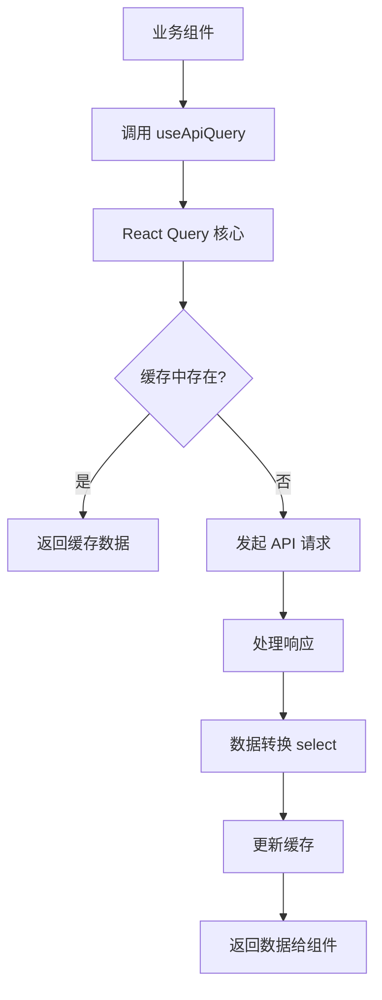
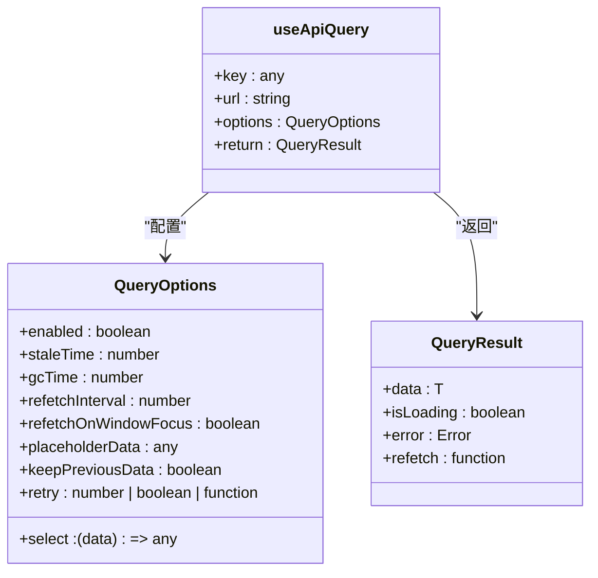
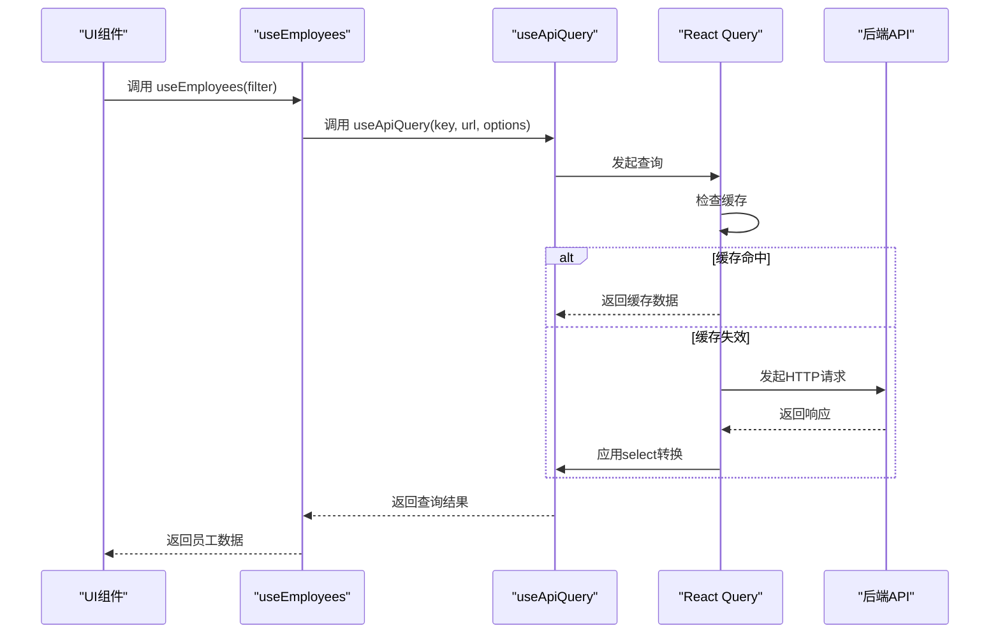
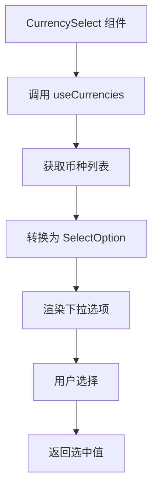
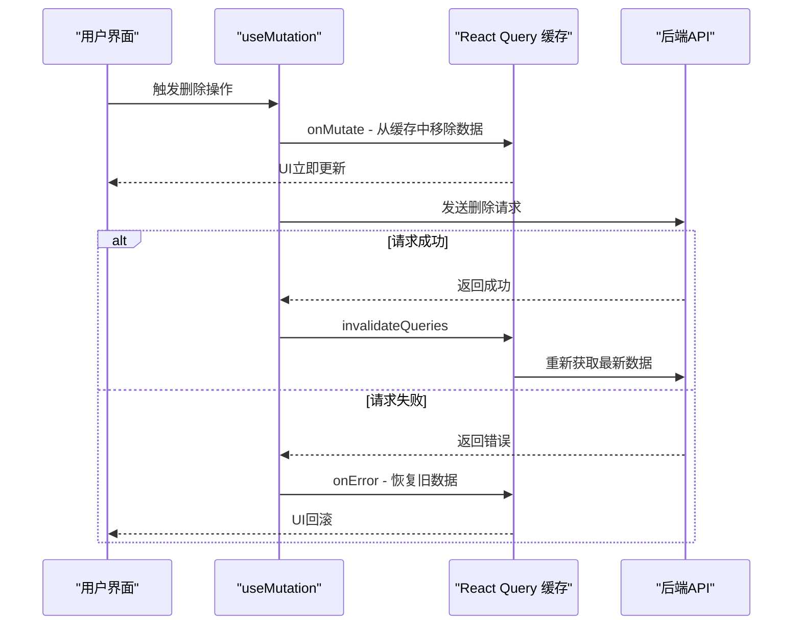

# 数据获取与缓存

<cite>
**本文档引用文件**  
- [useApiQuery.ts](file://frontend/src/utils/useApiQuery.ts)
- [useEmployees.ts](file://frontend/src/hooks/business/useEmployees.ts)
- [useFlows.ts](file://frontend/src/hooks/business/useFlows.ts)
- [useBusinessData.ts](file://frontend/src/hooks/useBusinessData.ts)
- [cache.ts](file://frontend/src/config/cache.ts)
- [api.ts](file://frontend/src/config/api.ts)
- [http.ts](file://frontend/src/api/http.ts)
- [DataTable.tsx](file://frontend/src/components/common/DataTable.tsx)
- [FlowsPage.tsx](file://frontend/src/features/finance/pages/FlowsPage.tsx)
- [EmployeeManagementPage.tsx](file://frontend/src/features/hr/pages/EmployeeManagementPage.tsx)
- [CurrencySelect.tsx](file://frontend/src/components/form/CurrencySelect.tsx)
- [optimisticUpdates.ts](file://frontend/src/utils/optimisticUpdates.ts)
- [business.ts](file://frontend/src/types/business.ts)
</cite>

## 目录
1. [引言](#引言)
2. [核心数据获取机制](#核心数据获取机制)
3. [useApiQuery 封装详解](#useapiquery-封装详解)
4. [业务数据查询 Hook 分析](#业务数据查询-hook-分析)
5. [主数据抽象查询逻辑](#主数据抽象查询逻辑)
6. [缓存与刷新策略](#缓存与刷新策略)
7. [乐观更新实现](#乐观更新实现)
8. [错误处理与 UI 集成](#错误处理与-ui-集成)
9. [总结](#总结)

## 引言
本系统采用 React Query 作为核心的远程状态管理方案，构建了一套高效、统一的数据获取与缓存机制。通过封装 `useApiQuery` 等自定义 Hook，实现了对 API 请求、错误重试、缓存策略和数据转换的集中管理。该机制不仅提升了数据加载性能，还确保了跨组件的数据一致性，为员工管理、财务流水等核心业务功能提供了坚实的数据支撑。

## 核心数据获取机制
系统通过 `useApiQuery` 这一通用 Hook 统一处理所有数据获取逻辑。该 Hook 基于 React Query 构建，封装了 `useQuery` 的核心功能，为上层业务组件提供了简洁、一致的接口。其核心职责包括：发起 API 请求、管理查询状态（加载、错误、成功）、处理数据缓存和转换。

**Diagram sources**
- [useApiQuery.ts](file://frontend/src/utils/useApiQuery.ts#L11-L41)

**Section sources**
- [useApiQuery.ts](file://frontend/src/utils/useApiQuery.ts#L1-L103)

## useApiQuery 封装详解
`useApiQuery` 是系统数据获取的基石，它接收查询键（queryKey）、API URL 和配置选项，返回一个包含数据、加载状态和错误信息的查询对象。

### 核心参数
- **key**: 查询的唯一标识符，通常为数组，用于缓存和失效。
- **url**: 要请求的 API 端点。
- **options**: 配置对象，支持以下关键属性：
  - `staleTime`: 数据的“陈旧时间”，在此时间内被视为新鲜，不会重新请求。
  - `select`: 数据转换函数，用于从原始响应中提取或格式化所需数据。
  - `retry`: 错误重试策略，可指定重试次数或自定义重试逻辑。
  - `enabled`: 条件性启用查询，例如在用户登录后才加载数据。

### 实现逻辑
该 Hook 内部调用 React Query 的 `useQuery`，并配置 `queryFn` 为使用 `apiClient.get` 发起请求。它将 `select` 选项直接传递给 React Query，实现了数据的预处理。通过 `keepPreviousData` 选项，可以在分页或参数变更时保持上一页数据，提升用户体验。

**Diagram sources**
- [useApiQuery.ts](file://frontend/src/utils/useApiQuery.ts#L11-L41)

**Section sources**
- [useApiQuery.ts](file://frontend/src/utils/useApiQuery.ts#L1-L103)

## 业务数据查询 Hook 分析
系统为不同的业务实体（如员工、财务流水）创建了专用的 Hook，这些 Hook 基于 `useApiQuery` 进行二次封装，实现了业务逻辑的复用和解耦。

### useEmployees Hook
`useEmployees` 用于获取员工列表。它接收一个过滤器对象（`EmployeeFilter`），构建查询参数，并设置 5 分钟的 `staleTime`。其 `select` 函数确保返回的数据为数组，即使后端返回的是对象。

**Diagram sources**
- [useEmployees.ts](file://frontend/src/hooks/business/useEmployees.ts#L20-L33)

**Section sources**
- [useEmployees.ts](file://frontend/src/hooks/business/useEmployees.ts#L1-L212)

### useFlows Hook
`useFlows` 用于获取财务流水列表。它支持分页参数，并设置了 `TRANSACTION_DATA` 的缓存时间（5分钟）。其 `select` 函数对返回数据进行映射，统一了凭证 URL 的格式（将单个 `voucherUrl` 转换为数组 `voucherUrls`），并返回包含 `total` 和 `list` 的分页结构。

**Section sources**
- [useFlows.ts](file://frontend/src/hooks/business/useFlows.ts#L8-L28)

## 主数据抽象查询逻辑
`useBusinessData` 模块提供了一系列用于获取主数据（Master Data）的 Hook，如 `useCurrencies`、`useDepartments`、`useAccounts` 等。这些数据变化频率极低，因此被设计为在表单选择器等组件中广泛复用。

### 数据转换与格式化
这些 Hook 的核心在于 `select` 函数，它将原始的 API 响应转换为符合前端 UI 需求的 `SelectOption` 格式。例如：
- `useCurrencies` 将币种代码和名称组合成 `label`。
- `useAccounts` 在账户名称后附加别名和币种信息。
- 所有 Hook 都会过滤掉非活跃（`active !== 1`）的记录。

### 在表单选择器中的应用
这些 Hook 被直接集成到表单组件中。例如，`CurrencySelect` 组件内部调用 `useCurrencies`，自动处理数据加载、缓存和下拉选项的渲染，开发者只需使用该组件即可，无需关心底层数据获取逻辑。

**Diagram sources**
- [useBusinessData.ts](file://frontend/src/hooks/useBusinessData.ts#L6-L135)
- [CurrencySelect.tsx](file://frontend/src/components/form/CurrencySelect.tsx#L27-L81)

**Section sources**
- [useBusinessData.ts](file://frontend/src/hooks/useBusinessData.ts#L1-L136)

## 缓存与刷新策略
系统通过 `config/cache.ts` 文件集中定义了不同数据类型的缓存时间，实现了精细化的缓存管理。

### 缓存时间分级
- **主数据 (MASTER_DATA)**: 1小时，适用于币种、部门等几乎不变的数据。
- **业务数据 (BUSINESS_DATA)**: 30分钟，适用于员工、账户等变化较少的数据。
- **交易数据 (TRANSACTION_DATA)**: 5分钟，适用于财务流水等频繁变动的数据。
- **报表数据 (REPORT_DATA)**: 10分钟，允许一定延迟以提升性能。

### 后台数据刷新
React Query 默认在窗口重新获得焦点时重新获取数据（`refetchOnWindowFocus`）。对于需要实时性的数据，可以通过设置 `refetchInterval` 实现定时轮询。

### 缓存失效
当数据发生变更（如创建、更新、删除）时，相关的 `useMutation` Hook 会在 `onSuccess` 回调中调用 `queryClient.invalidateQueries`，使指定查询键的缓存失效，从而在下次访问时重新获取最新数据。例如，创建新员工后，会失效 `['employees']` 的缓存。

**Section sources**
- [cache.ts](file://frontend/src/config/cache.ts#L1-L21)

## 乐观更新实现
系统通过 `optimisticUpdates.ts` 工具库实现了乐观更新模式，以提升用户交互的流畅性。当用户执行变更操作（如删除一条流水）时，UI 会立即更新，而无需等待服务器响应。

### 实现方式
通过 `createOptimisticUpdater` 等工具函数，可以在 `useMutation` 的 `onMutate` 阶段手动更新缓存数据。如果服务器响应成功，更新将被确认；如果失败，则通过 `onError` 回调回滚到 `onMutate` 阶段保存的旧数据。

**Diagram sources**
- [optimisticUpdates.ts](file://frontend/src/utils/optimisticUpdates.ts#L41-L161)

**Section sources**
- [optimisticUpdates.ts](file://frontend/src/utils/optimisticUpdates.ts#L1-L161)

## 错误处理与 UI 集成
系统在多个层面实现了完善的错误处理和加载状态展示。

### API 客户端错误处理
`http.ts` 中的 `ApiClient` 类统一处理 HTTP 错误。对于 401 未授权错误，会自动登出用户并重定向到登录页。对于业务逻辑错误（`success: false`），会提取错误信息并使用 `message.error` 显示。

### UI 组件集成
- **DataTable 组件**: 接收 `loading` 属性，当 `useApiQuery` 返回 `isLoading: true` 时，表格会显示加载动画。
- **页面组件**: 如 `FlowsPage` 和 `EmployeeManagementPage`，通过 `useQuery` 返回的 `isLoading` 和 `error` 状态来控制整个页面的加载和错误提示。
- **错误边界**: `ErrorBoundary` 组件捕获未处理的异常，显示友好的错误页面，并提供“重试”和“刷新”按钮。

**Section sources**
- [http.ts](file://frontend/src/api/http.ts#L1-L116)
- [DataTable.tsx](file://frontend/src/components/common/DataTable.tsx#L1-L189)
- [FlowsPage.tsx](file://frontend/src/features/finance/pages/FlowsPage.tsx#L1-L200)
- [EmployeeManagementPage.tsx](file://frontend/src/features/hr/pages/EmployeeManagementPage.tsx#L1-L200)

## 总结
本系统通过 React Query 构建了一套高效、健壮的数据获取与缓存机制。`useApiQuery` 的封装实现了数据获取逻辑的统一，`useBusinessData` 提供了主数据的便捷访问，而精细化的缓存策略和乐观更新则显著提升了应用性能和用户体验。结合完善的错误处理和 UI 集成，该机制为整个财务管理系统提供了稳定可靠的数据支撑。