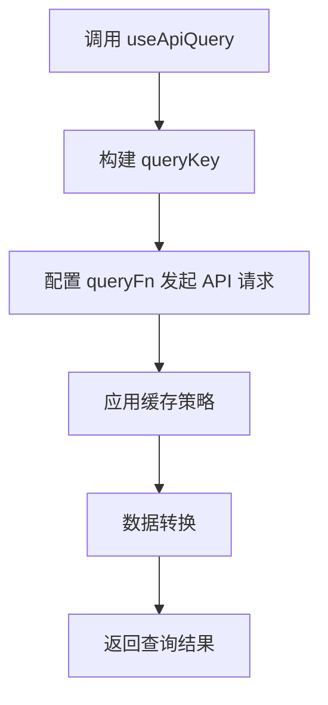
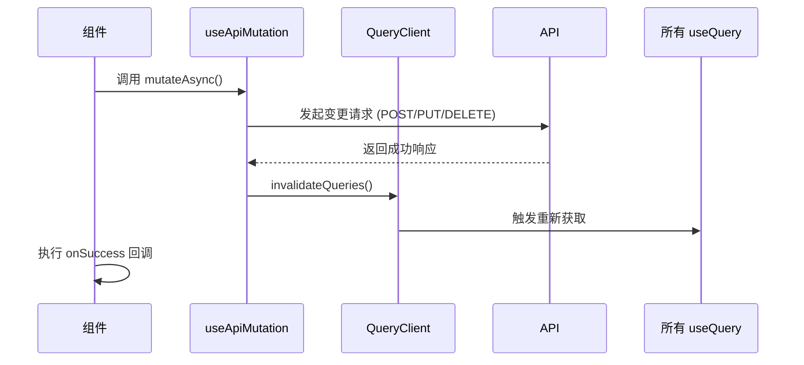
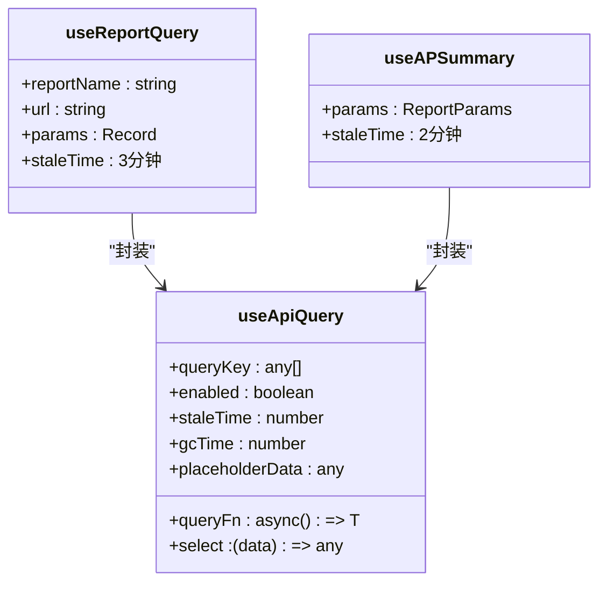

# 数据获取机制

<cite>
**本文档引用的文件**
- [useApiQuery.ts](file://frontend/src/utils/useApiQuery.ts)
- [useReports.ts](file://frontend/src/hooks/business/useReports.ts)
- [api.ts](file://frontend/src/config/api.ts)
- [http.ts](file://frontend/src/api/http.ts)
</cite>

## 目录
1. [简介](#简介)
2. [核心数据获取 Hook 概述](#核心数据获取-hook-概述)
3. [useApiQuery 实现原理](#useapiquery-实现原理)
4. [useApiMutation 实现原理](#useapimutation-实现原理)
5. [useReportQuery 特殊缓存策略](#usereportquery-特殊缓存策略)
6. [实际应用示例](#实际应用示例)
7. [性能优化与错误处理](#性能优化与错误处理)
8. [总结](#总结)

## 简介
本系统采用 React Query 作为核心数据获取和状态管理库，通过封装 `useApiQuery`、`useApiMutation` 和 `useReportQuery` 三个核心 Hook，实现了统一的数据获取机制。这些 Hook 封装了 API 请求、缓存策略、错误处理和数据转换等通用逻辑，为前端组件提供了简洁、一致且可靠的数据访问接口。

**Section sources**
- [useApiQuery.ts](file://frontend/src/utils/useApiQuery.ts)

## 核心数据获取 Hook 概述
系统定义了三个主要的自定义 Hook 来处理不同类型的数据获取需求：

- **`useApiQuery`**: 通用查询 Hook，封装了 React Query 的 `useQuery`，用于获取只读数据。
- **`useApiMutation`**: 通用变更 Hook，封装了 React Query 的 `useMutation`，用于处理创建、更新、删除等变更操作。
- **`useReportQuery`**: 专门用于报表场景的查询 Hook，具有特殊的缓存策略。

这些 Hook 通过统一的 API 客户端进行通信，确保了整个应用中数据获取行为的一致性。

**Section sources**
- [useApiQuery.ts](file://frontend/src/utils/useApiQuery.ts)

## useApiQuery 实现原理
`useApiQuery` 是系统中最基础的查询 Hook，它对 React Query 的 `useQuery` 进行了深度封装，提供了统一的配置和行为。

### 核心功能

**Diagram sources**
- [useApiQuery.ts](file://frontend/src/utils/useApiQuery.ts#L11-L41)

### 参数配置与功能
`useApiQuery` 支持以下关键参数，用于精细化控制查询行为：

| 参数 | 类型 | 描述 | 默认值 |
| :--- | :--- | :--- | :--- |
| `key` | any | 查询的唯一标识符，用于缓存和失效 | 必需 |
| `url` | string | 要请求的 API 端点 | 必需 |
| `enabled` | boolean | 是否启用查询 | true |
| `staleTime` | number | 数据被视为“新鲜”的时间（毫秒） | 无 |
| `gcTime` | number | 缓存数据在内存中保留的时间（毫秒） | 无 |
| `refetchInterval` | number | 自动重新获取数据的间隔（毫秒） | 无 |
| `refetchOnWindowFocus` | boolean | 窗口获得焦点时是否重新获取数据 | false |
| `select` | function | 数据选择器，用于从响应中提取或转换数据 | 无 |
| `placeholderData` | any | 在数据加载或重新获取时显示的占位数据 | 无 |
| `keepPreviousData` | boolean | 在获取新数据时是否保留旧数据 | false |
| `retry` | number/function | 请求失败时的重试次数或重试策略 | 无 |

### 缓存与数据转换
`useApiQuery` 巧妙地结合了 `keepPreviousData` 和 `placeholderData` 参数，实现了平滑的数据更新体验。当 `keepPreviousData` 为 `true` 时，会使用 React Query 提供的 `keepPreviousData` 占位符，确保在获取新数据时，UI 不会显示加载状态或空白内容。

**Section sources**
- [useApiQuery.ts](file://frontend/src/utils/useApiQuery.ts#L11-L41)

## useApiMutation 实现原理
`useApiMutation` 用于处理所有变更操作（如创建、更新、删除），其核心特点是**在操作成功后自动失效所有查询缓存**。

### 自动缓存失效机制

**Diagram sources**
- [useApiQuery.ts](file://frontend/src/utils/useApiQuery.ts#L46-L79)

### 实现细节
1.  **统一的变更函数**: `mutationFn` 内部根据 `method` 参数（POST, PUT, DELETE）调用相应的 API 客户端方法。
2.  **核心失效逻辑**: `onSuccess` 回调中调用 `queryClient.invalidateQueries()`，这会标记所有缓存为“过期”，并触发所有活跃的 `useQuery` Hook 重新获取最新数据。
3.  **成功回调**: 支持传入 `onSuccessCallback`，在缓存失效后执行自定义逻辑（如关闭模态框、显示成功消息）。

这种设计确保了数据的一致性：任何变更操作后，所有相关的 UI 都能自动更新到最新状态，无需手动指定需要刷新的特定查询。

**Section sources**
- [useApiQuery.ts](file://frontend/src/utils/useApiQuery.ts#L46-L79)

## useReportQuery 特殊缓存策略
`useReportQuery` 是专门为报表场景设计的 Hook，其核心特点是**设置了 3 分钟的固定缓存时间**。

### 报表场景的缓存需求
报表数据通常计算成本较高，但对实时性的要求相对较低。因此，`useReportQuery` 采用以下策略：
- **staleTime: 3 * 60 * 1000**: 将缓存的“新鲜”时间设置为 3 分钟。
- **效果**: 在 3 分钟内，即使组件重新渲染或用户切换页面再返回，也会直接使用缓存中的数据，避免了不必要的重复请求，显著提升了性能和用户体验。

### 与业务 Hook 的关系
`useReportQuery` 本身是一个基础 Hook，实际业务中通常由更具体的 Hook（如 `useAPSummary`）来调用。例如，在 `useReports.ts` 中，`useAPSummary` 等函数内部调用了 `useApiQuery`，并设置了 `staleTime` 为 2 分钟，这覆盖了 `useReportQuery` 的默认值，实现了更精细的控制。

**Diagram sources**
- [useApiQuery.ts](file://frontend/src/utils/useApiQuery.ts#L85-L103)
- [useReports.ts](file://frontend/src/hooks/business/useReports.ts#L32-L45)

**Section sources**
- [useApiQuery.ts](file://frontend/src/utils/useApiQuery.ts#L85-L103)
- [useReports.ts](file://frontend/src/hooks/business/useReports.ts#L32-L45)

## 实际应用示例
### 使用 useApiQuery 获取报表数据
在 `ReportAPSummaryPage.tsx` 中，`useAPSummary` Hook 被用来获取应付账款汇总数据。它接收日期范围参数，构建查询键和 URL，并在查询成功后将数据渲染到表格和统计卡片中。

**Section sources**
- [ReportAPSummaryPage.tsx](file://frontend/src/features/reports/pages/ReportAPSummaryPage.tsx#L17-L20)

### 使用 useApiMutation 执行变更操作
在 `EmployeeManagementPage.tsx` 中，`useToggleUserActive` 等 Hook 封装了 `useApiMutation`。当用户点击“启用/停用账号”按钮时，会调用 `mutateAsync` 方法。操作成功后，`useApiMutation` 内部的 `invalidateQueries` 会自动触发，刷新员工列表，确保 UI 状态与后端数据保持一致。

**Section sources**
- [EmployeeManagementPage.tsx](file://frontend/src/features/hr/pages/EmployeeManagementPage.tsx#L40-L42)

## 性能优化与错误处理
### 性能优化策略
1.  **缓存复用**: `useApiQuery` 的 `staleTime` 和 `gcTime` 避免了重复请求。
2.  **平滑更新**: `keepPreviousData` 确保了数据更新时的 UI 流畅性。
3.  **按需获取**: `enabled` 参数可以控制查询的执行时机，避免不必要的请求。

### 错误处理机制
系统的错误处理分为两层：
1.  **HTTP 层**: `http.ts` 中的 `ApiClient` 统一处理 HTTP 状态码（如 401 重定向到登录页）和网络错误，并通过 `message.error` 显示错误信息。
2.  **业务层**: `useApiQuery` 和 `useApiMutation` 继承了 React Query 的错误处理能力，组件可以通过 `error` 状态来展示更具体的错误信息或重试按钮。

**Section sources**
- [http.ts](file://frontend/src/api/http.ts#L26-L83)
- [useApiQuery.ts](file://frontend/src/utils/useApiQuery.ts)

## 总结
通过 `useApiQuery`、`useApiMutation` 和 `useReportQuery` 三个核心 Hook，本系统建立了一套高效、一致且可靠的数据获取机制。`useApiQuery` 提供了强大的缓存和数据转换能力，`useApiMutation` 通过自动失效缓存保证了数据一致性，而 `useReportQuery` 则针对报表场景优化了性能。这套机制极大地简化了前端开发，提升了用户体验和系统性能。