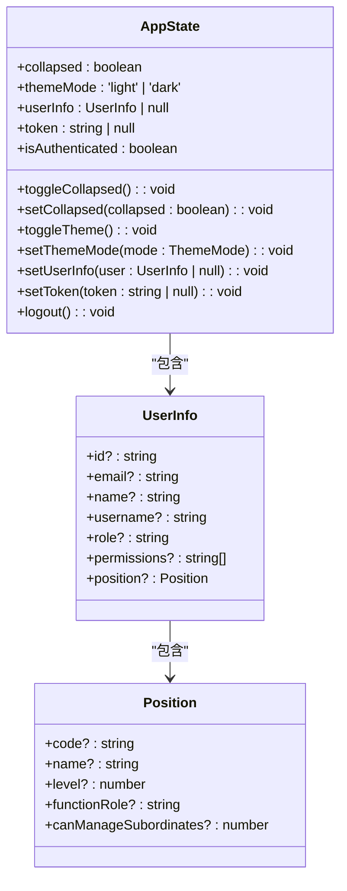
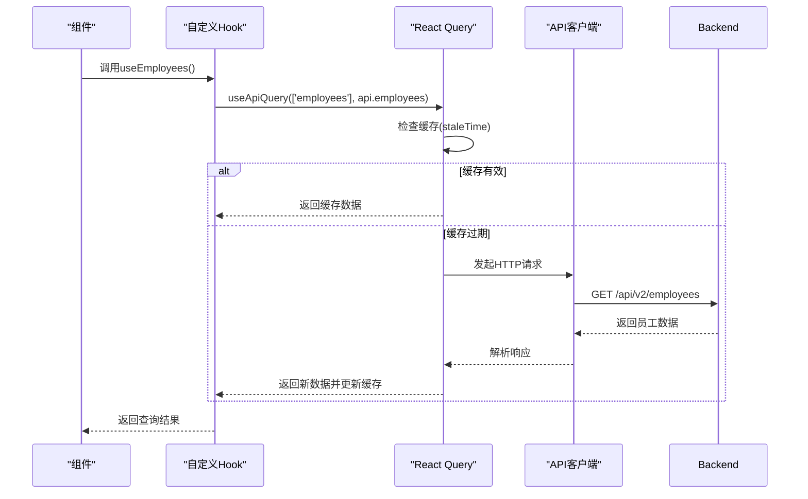
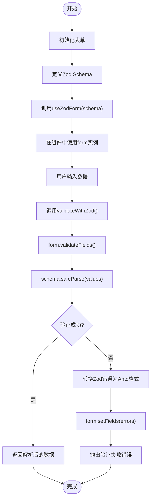
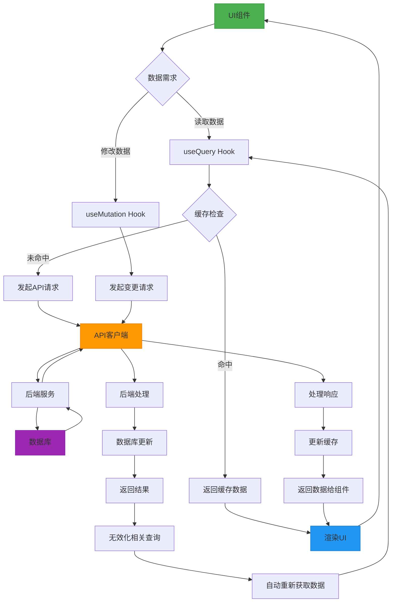
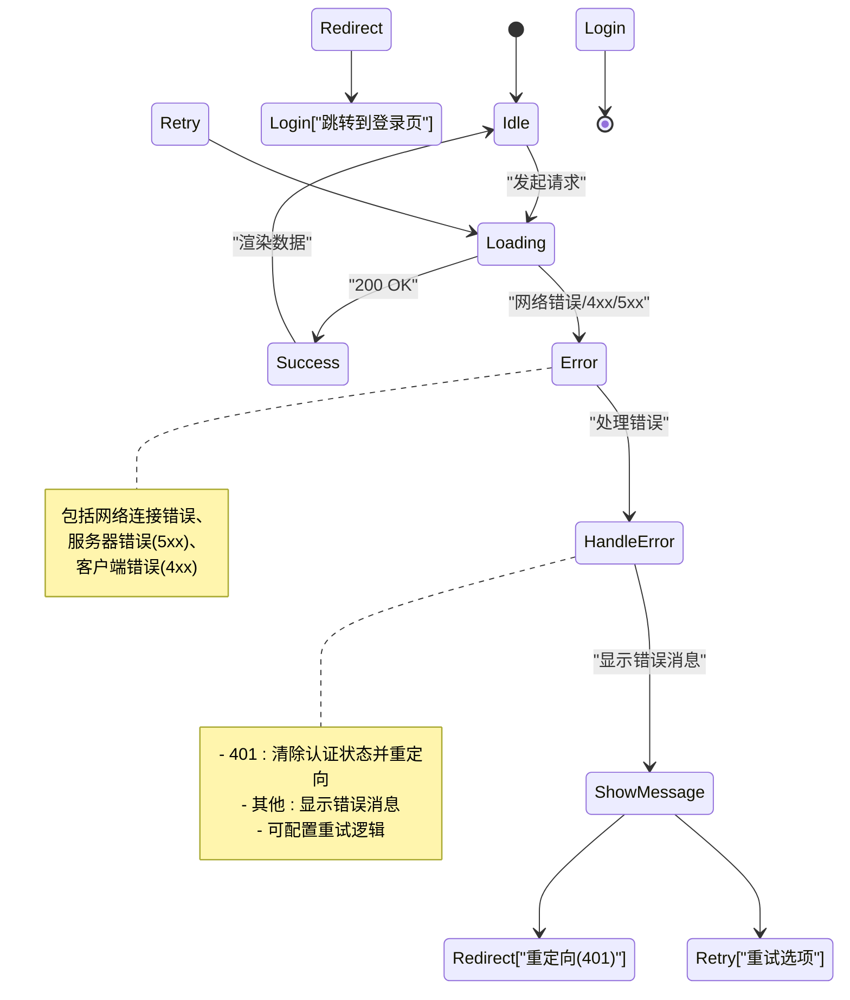

# 状态管理

<cite>
**本文档引用的文件**
- [useAppStore.ts](file://frontend/src/store/useAppStore.ts)
- [useBusinessData.ts](file://frontend/src/hooks/useBusinessData.ts)
- [useZodForm.ts](file://frontend/src/hooks/forms/useZodForm.ts)
- [useEmployees.ts](file://frontend/src/hooks/business/useEmployees.ts)
- [useFlows.ts](file://frontend/src/hooks/business/useFlows.ts)
- [useApiQuery.ts](file://frontend/src/utils/useApiQuery.ts)
- [http.ts](file://frontend/src/api/http.ts)
- [api.ts](file://frontend/src/config/api.ts)
- [cache.ts](file://frontend/src/config/cache.ts)
- [PrivateRoute.tsx](file://frontend/src/router/PrivateRoute.tsx)
</cite>

## 目录
1. [简介](#简介)
2. [全局状态管理](#全局状态管理)
3. [数据获取与缓存](#数据获取与缓存)
4. [表单验证与状态管理](#表单验证与状态管理)
5. [状态流图](#状态流图)
6. [错误处理与加载状态](#错误处理与加载状态)
7. [总结](#总结)

## 简介
本系统采用Zustand管理全局状态，React Query处理数据获取和缓存，并通过自定义Hook抽象业务逻辑。全局状态包括用户会话、权限配置和UI状态，而局部状态则通过React Query的查询和变更机制管理。系统还实现了统一的API请求逻辑和基于Zod的表单验证。

## 全局状态管理

系统使用Zustand库创建`useAppStore`来管理全局状态，包括用户认证信息、UI状态和主题模式。该状态通过`persist`中间件持久化到localStorage中，确保页面刷新后状态不丢失。

**图示来源**
- [useAppStore.ts](file://frontend/src/store/useAppStore.ts#L23-L89)

**本节来源**
- [useAppStore.ts](file://frontend/src/store/useAppStore.ts#L1-L89)
- [PrivateRoute.tsx](file://frontend/src/router/PrivateRoute.tsx#L5-L12)
- [main.tsx](file://frontend/src/main.tsx#L38-L43)

## 数据获取与缓存

系统使用React Query通过`useApiQuery` Hook实现数据获取、缓存和轮询功能。`useBusinessData`抽象层封装了API请求逻辑，提供了统一的数据访问接口。

**图示来源**
- [useApiQuery.ts](file://frontend/src/utils/useApiQuery.ts#L11-L41)
- [useBusinessData.ts](file://frontend/src/hooks/useBusinessData.ts#L6-L135)
- [http.ts](file://frontend/src/api/http.ts#L11-L115)

**本节来源**
- [useApiQuery.ts](file://frontend/src/utils/useApiQuery.ts#L1-L103)
- [useBusinessData.ts](file://frontend/src/hooks/useBusinessData.ts#L1-L136)
- [cache.ts](file://frontend/src/config/cache.ts#L5-L21)
- [api.ts](file://frontend/src/config/api.ts#L12-L188)

## 表单验证与状态管理

系统通过`useZodForm` Hook结合Zod Schema实现表单验证，将Ant Design的表单组件与Zod的类型安全验证相结合。`useBusinessData`抽象层统一了API请求逻辑，确保数据获取的一致性。

**图示来源**
- [useZodForm.ts](file://frontend/src/hooks/forms/useZodForm.ts#L25-L60)
- [useBusinessData.ts](file://frontend/src/hooks/useBusinessData.ts#L6-L135)

**本节来源**
- [useZodForm.ts](file://frontend/src/hooks/forms/useZodForm.ts#L1-L61)
- [useBusinessData.ts](file://frontend/src/hooks/useBusinessData.ts#L1-L136)

## 状态流图

以下状态流图展示了从API请求到UI渲染的数据流动路径，包括查询、变更和缓存更新的完整流程。

**图示来源**
- [useApiQuery.ts](file://frontend/src/utils/useApiQuery.ts#L11-L41)
- [useEmployees.ts](file://frontend/src/hooks/business/useEmployees.ts#L36-L47)
- [useFlows.ts](file://frontend/src/hooks/business/useFlows.ts#L31-L41)
- [http.ts](file://frontend/src/api/http.ts#L11-L115)

## 错误处理与加载状态

系统实现了全面的错误处理和加载状态管理机制。React Query自动管理加载、错误和成功状态，而API客户端则处理网络错误和认证失效。

**图示来源**
- [http.ts](file://frontend/src/api/http.ts#L25-L83)
- [useApiQuery.ts](file://frontend/src/utils/useApiQuery.ts#L28-L31)
- [PrivateRoute.tsx](file://frontend/src/router/PrivateRoute.tsx#L10-L12)

**本节来源**
- [http.ts](file://frontend/src/api/http.ts#L1-L116)
- [useApiQuery.ts](file://frontend/src/utils/useApiQuery.ts#L1-L103)

## 总结
本系统通过Zustand、React Query和自定义Hook的组合，实现了高效的状态管理。全局状态由Zustand管理并持久化，数据获取由React Query处理缓存和同步，表单验证通过Zod和Ant Design集成实现。这种架构确保了状态的一致性、可预测性和可维护性。