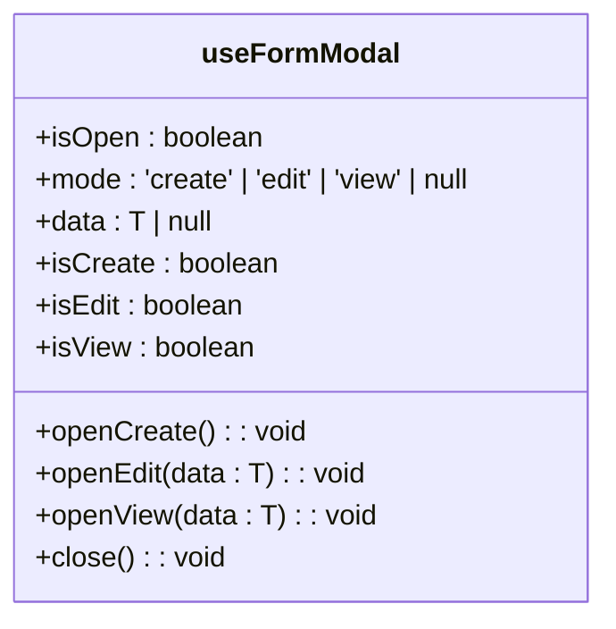
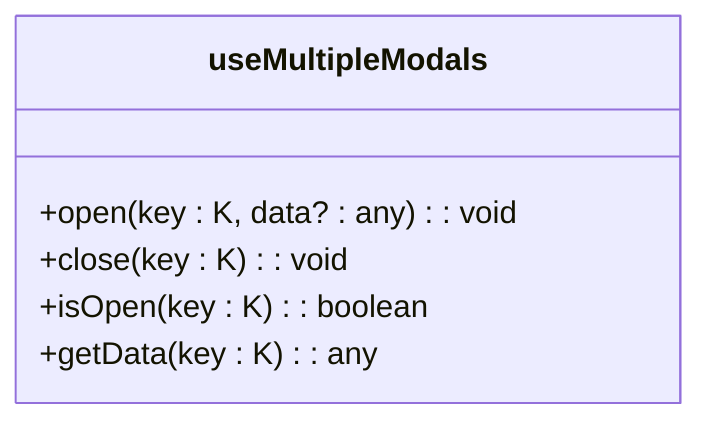

# 表单模态框状态管理

<cite>
**本文档引用的文件**  
- [useFormModal.ts](file://frontend/src/hooks/forms/useFormModal.ts)
- [FormModal.tsx](file://frontend/src/components/FormModal.tsx)
- [FixedAssetsManagementPage.tsx](file://frontend/src/features/assets/pages/FixedAssetsManagementPage.tsx)
- [EmployeeManagementPage.tsx](file://frontend/src/features/hr/pages/EmployeeManagementPage.tsx)
- [EmployeeFormModal.tsx](file://frontend/src/features/employees/components/modals/EmployeeFormModal.tsx)
</cite>

## 目录
1. [简介](#简介)
2. [核心Hook解析](#核心hook解析)
3. [useFormModal详解](#useformmodal详解)
4. [useMultipleModals详解](#usemultiplemodals详解)
5. [实际应用场景](#实际应用场景)
6. [最佳实践](#最佳实践)
7. [总结](#总结)

## 简介
本文档深入解析财务系统中表单模态框的状态管理机制，重点介绍`useFormModal`和`useMultipleModals`两个核心Hook。这两个Hook为固定资产管理和员工管理等复杂页面提供了高效、统一的状态管理方案，解决了传统开发中模态框状态管理重复、混乱的问题。

## 核心Hook解析
系统提供了两个核心Hook用于模态框状态管理：
- `useFormModal`: 用于管理单一类型模态框（创建、编辑、查看）的状态
- `useMultipleModals`: 用于管理同一页面中多个独立模态框的状态

这两个Hook通过React的函数式组件和Hook机制，实现了状态的封装和复用，大大提高了代码的可维护性和开发效率。

**Section sources**
- [useFormModal.ts](file://frontend/src/hooks/forms/useFormModal.ts)

## useFormModal详解
`useFormModal`是一个泛型Hook，用于统一管理创建、编辑、查看三种模式的模态框状态。

### 泛型支持与类型安全
该Hook通过泛型`<T>`支持不同类型的数据管理，如员工、资产等，确保了类型安全：

```typescript
const modal = useFormModal<Employee>()
```

这种设计使得Hook可以被不同类型的组件复用，同时保持类型检查的完整性。

### 核心状态管理
Hook内部维护了一个包含`mode`和`data`的状态对象：
- `mode`: 可以是`create`、`edit`、`view`或`null`
- `data`: 存储当前操作的数据对象

### 计算属性的便捷性
Hook提供了多个计算属性，简化了条件判断：

- `isOpen`: 当前是否有模态框打开
- `isCreate`: 是否处于创建模式
- `isEdit`: 是否处于编辑模式  
- `isView`: 是否处于查看模式

这些计算属性避免了在组件中重复编写`state.mode === 'create'`这样的判断逻辑。

### 操作方法
Hook提供了简洁的操作方法：
- `openCreate()`: 打开创建模态框
- `openEdit(data)`: 打开编辑模态框并传入数据
- `openView(data)`: 打开查看模态框并传入数据
- `close()`: 关闭所有模态框

**Diagram sources**
- [useFormModal.ts](file://frontend/src/hooks/forms/useFormModal.ts#L29-L71)



**Section sources**
- [useFormModal.ts](file://frontend/src/hooks/forms/useFormModal.ts#L3-L71)

## useMultipleModals详解
`useMultipleModals`用于管理复杂页面中多个独立模态框的状态。

### 应用场景
在固定资产管理系统中，一个页面可能需要同时管理多种模态框：
- 创建资产
- 编辑资产
- 查看详情
- 资产调拨
- 记录折旧

### 实现机制
该Hook接收一个模态框类型的数组作为参数：

```typescript
const modals = useMultipleModals(['create', 'edit', 'detail', 'transfer', 'depreciation'])
```

内部使用`Record<K, { open: boolean; data: any }>`结构来管理每个模态框的状态。

### 核心方法
- `open(key, data)`: 打开指定类型的模态框
- `close(key)`: 关闭指定类型的模态框
- `isOpen(key)`: 判断指定模态框是否打开
- `getData(key)`: 获取指定模态框的数据

这种方法实现了多个模态框的状态隔离，避免了相互干扰。

**Diagram sources**
- [useFormModal.ts](file://frontend/src/hooks/forms/useFormModal.ts#L89-L125)



**Section sources**
- [useFormModal.ts](file://frontend/src/hooks/forms/useFormModal.ts#L73-L125)

## 实际应用场景
### 固定资产管理系统
在`FixedAssetsManagementPage`中，`useMultipleModals`被用于管理五种不同类型的模态框：

```typescript
const modals = useMultipleModals(['create', 'edit', 'detail', 'transfer', 'depreciation'])
```

每个模态框都有独立的状态和数据，实现了复杂业务场景下的状态隔离。

### 员工管理系统
在`EmployeeManagementPage`中，`useFormModal`被用于管理员工的创建和编辑操作：

```typescript
const modal = useFormModal<Employee>()
```

通过`isCreate`和`isEdit`等计算属性，可以轻松区分不同的操作模式，并相应地渲染不同的界面。

**Section sources**
- [FixedAssetsManagementPage.tsx](file://frontend/src/features/assets/pages/FixedAssetsManagementPage.tsx#L96-L97)
- [EmployeeManagementPage.tsx](file://frontend/src/features/hr/pages/EmployeeManagementPage.tsx#L333-L350)

## 最佳实践
### 模态框打开与关闭
使用Hook提供的方法来控制模态框的打开和关闭，确保状态的一致性：

```typescript
// 打开创建模态框
modals.open('create')

// 关闭模态框
modals.close('create')
```

### 数据传递
通过`open`方法的第二个参数传递数据，在模态框中通过`getData`方法获取：

```typescript
// 打开时传递数据
modals.open('edit', asset)

// 在模态框中获取数据
const data = modals.getData('edit')
```

### 状态隔离
确保不同类型的模态框状态相互隔离，避免状态污染：

```typescript
// 正确：独立管理每个模态框
modals.open('detail', asset)
modals.open('edit', asset)

// 错误：不应同时打开相同类型的多个模态框
```

### 表单重置
在关闭模态框时，重置相关表单数据，避免下次打开时显示旧数据：

```typescript
modals.close('create')
form.resetFields()
```

**Section sources**
- [FixedAssetsManagementPage.tsx](file://frontend/src/features/assets/pages/FixedAssetsManagementPage.tsx#L126-L127)
- [EmployeeFormModal.tsx](file://frontend/src/features/employees/components/modals/EmployeeFormModal.tsx#L145-L146)

## 总结
`useFormModal`和`useMultipleModals`两个Hook为系统的模态框状态管理提供了优雅的解决方案。通过泛型支持，`useFormModal`实现了不同类型数据的统一管理；通过多模态框管理，`useMultipleModals`解决了复杂页面中多个模态框的状态隔离问题。这两个Hook的使用大大提高了代码的可维护性和开发效率，是系统前端架构中的重要组成部分。