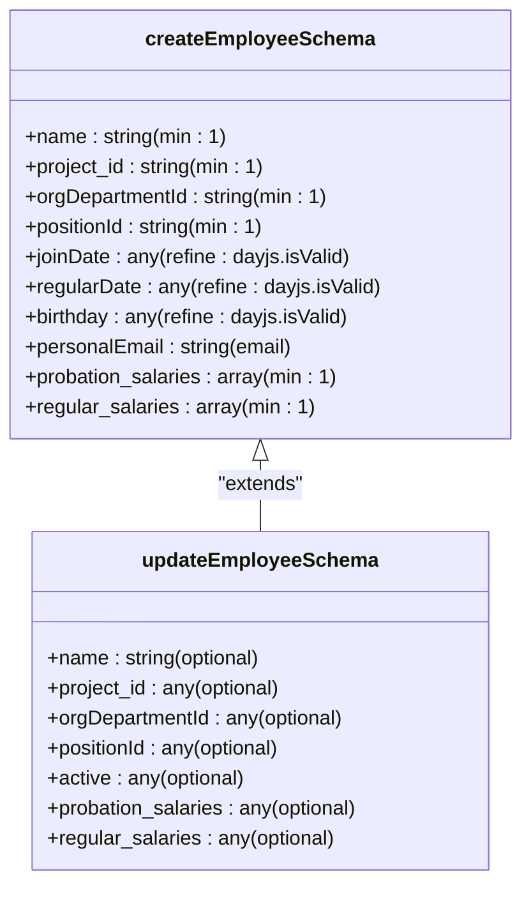
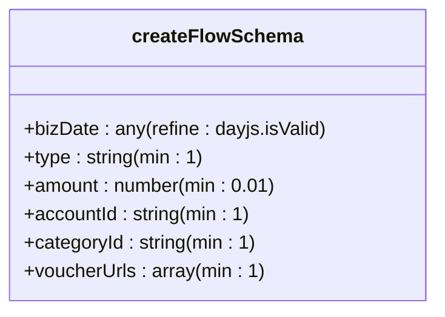
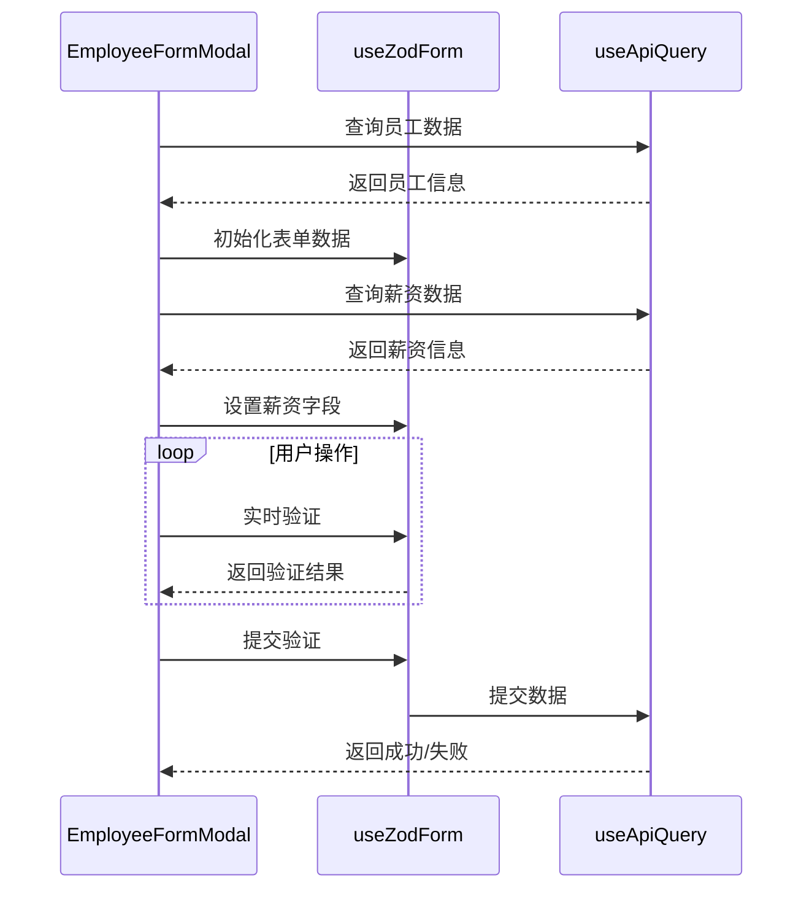
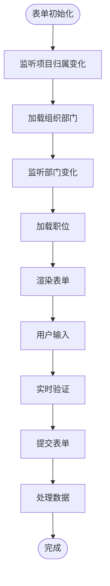
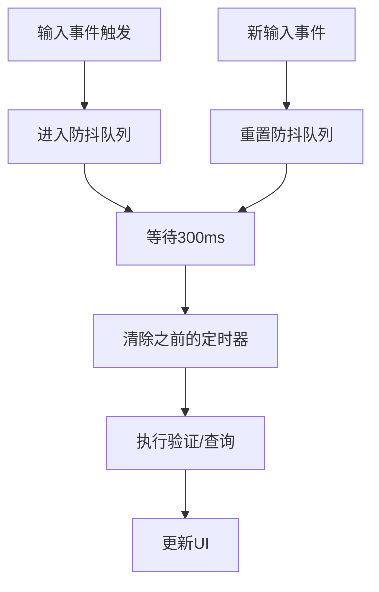

# 表单状态管理

<cite>
**本文档引用文件**  
- [useZodForm.ts](file://frontend/src/hooks/forms/useZodForm.ts)
- [useFormModal.ts](file://frontend/src/hooks/forms/useFormModal.ts)
- [employee.schema.ts](file://frontend/src/validations/employee.schema.ts)
- [flow.schema.ts](file://frontend/src/validations/flow.schema.ts)
- [EmployeeForm.tsx](file://frontend/src/features/employees/components/forms/EmployeeForm.tsx)
- [FlowCreatePage.tsx](file://frontend/src/features/finance/pages/FlowCreatePage.tsx)
- [EmployeeFormModal.tsx](file://frontend/src/features/employees/components/modals/EmployeeFormModal.tsx)
- [common.schema.ts](file://frontend/src/validations/common.schema.ts)
- [FormModal.tsx](file://frontend/src/components/FormModal.tsx)
- [useDebounce.ts](file://frontend/src/hooks/useDebounce.ts)
</cite>

## 目录
1. [简介](#简介)
2. [核心表单状态管理Hook](#核心表单状态管理hook)
3. [Zod Schema与表单验证体系](#zod-schema与表单验证体系)
4. [表单模态框状态管理](#表单模态框状态管理)
5. [实际应用场景分析](#实际应用场景分析)
6. [复杂交互实现](#复杂交互实现)
7. [性能优化策略](#性能优化策略)
8. [自定义验证规则扩展](#自定义验证规则扩展)
9. [结论](#结论)

## 简介
本系统采用基于Zod Schema的表单验证与状态控制体系，实现了类型安全的表单输入、实时验证与错误提示。通过`useZodForm`和`useFormModal`等自定义Hook，统一管理表单验证逻辑和模态框状态，减少重复代码。系统在员工管理、财务流水创建等场景中广泛应用该体系，支持表单初始化、字段联动、异步验证等复杂交互，并通过防抖、延迟验证等技术优化表单性能。

## 核心表单状态管理Hook

### useZodForm
`useZodForm`是系统核心的表单验证Hook，它将Zod验证规则集成到Ant Design Form中，实现类型安全的表单验证。

该Hook接收Zod Schema作为参数，返回Ant Design Form实例和`validateWithZod`验证函数。当调用`validateWithZod`时，首先通过`form.validateFields()`触发Ant Design的字段验证，然后使用Zod对表单值进行类型验证。如果Zod验证失败，会将Zod错误转换为Ant Design Form可识别的错误格式，并通过`form.setFields()`显示在表单中。

这种双重验证机制既利用了Ant Design Form的UI集成优势，又获得了Zod强大的类型验证能力，实现了无缝的验证体验。

**Section sources**
- [useZodForm.ts](file://frontend/src/hooks/forms/useZodForm.ts#L25-L59)

### useFormModal
`useFormModal`用于管理表单模态框的打开/关闭、提交状态与结果反馈。它统一管理create/edit/view等模态框状态，减少了重复的`useState`代码。

该Hook返回模态框的当前模式（创建、编辑、查看）、数据对象以及相应的操作方法（`openCreate`、`openEdit`、`openView`、`close`）。通过`isOpen`、`isCreate`、`isEdit`、`isView`等布尔值，组件可以方便地判断当前状态并相应地渲染UI。

此外，系统还提供了`useMultipleModals`用于管理多个不同类型的模态框，适用于需要同时管理多个模态框的复杂场景。

**Section sources**
- [useFormModal.ts](file://frontend/src/hooks/forms/useFormModal.ts#L29-L125)

## Zod Schema与表单验证体系

### 员工表单验证Schema
系统为员工管理创建了详细的Zod Schema，包括`createEmployeeSchema`、`updateEmployeeSchema`等。这些Schema定义了表单字段的验证规则，如必填性、数据类型、最小长度等。

例如，`createEmployeeSchema`要求姓名、项目归属、部门、职位等字段为必填项，并对邮箱格式进行验证。对于日期字段，使用`z.any().refine()`方法结合dayjs进行有效性验证。



**Diagram sources**
- [employee.schema.ts](file://frontend/src/validations/employee.schema.ts#L4-L49)

### 财务流水验证Schema
财务流水创建表单使用`createFlowSchema`进行验证，确保记账数据的完整性和准确性。

该Schema要求日期、类型、金额、账户、类别等核心字段为必填项，并对金额设置最小值限制（大于0）。凭证上传要求至少上传一张图片，确保每笔交易都有凭证支持。



**Diagram sources**
- [flow.schema.ts](file://frontend/src/validations/flow.schema.ts#L4-L27)

### 通用验证规则
系统定义了通用的验证规则，如`emailSchema`、`phoneSchema`、`amountSchema`等，可在多个表单中复用。

```mermaid
classDiagram
class emailSchema {
+string
+email("邮箱格式不正确")
+or(z.literal(''))
}
class phoneSchema {
+string
+regex(/^\+\d{1,4}\d{7,15}$/, "手机号格式不正确")
}
class amountSchema {
+number
+positive("金额必须大于0")
+finite("金额必须是有效数字")
}
class dateSchema {
+string
+regex(/^\d{4}-\d{2}-\d{2}$/, "日期格式不正确")
}
```

**Diagram sources**
- [common.schema.ts](file://frontend/src/validations/common.schema.ts#L6-L23)

## 表单模态框状态管理

### 通用表单模态框组件
`FormModal`是一个通用的表单模态框组件，减少了重复的表单模态框代码。它支持表单验证和错误处理，通过`onSubmit`回调处理表单提交，`onCancel`回调处理取消操作。

该组件在提交时自动进行表单验证，如果验证失败则不显示错误消息（由Ant Design自动处理），如果发生其他错误则显示错误提示。`destroyOnClose`属性确保模态框关闭时销毁其内容，避免状态残留。

**Section sources**
- [FormModal.tsx](file://frontend/src/components/FormModal.tsx#L26-L94)

### 员工表单模态框实现
`EmployeeFormModal`是员工管理的具体实现，它结合了`useZodForm`和`useFormModal`的功能。

在编辑模式下，模态框会根据员工ID查询薪资和补贴数据，并初始化表单。表单包含多个标签页，分别管理基本信息、联系方式、薪资与补贴、状态管理等。



**Diagram sources**
- [EmployeeFormModal.tsx](file://frontend/src/features/employees/components/modals/EmployeeFormModal.tsx#L30-L389)

## 实际应用场景分析

### 员工管理场景
在员工管理场景中，系统需要处理复杂的表单数据，包括基本信息、联系方式、薪资结构等。

`EmployeeForm`组件使用Ant Design的Tabs组件将表单分为多个标签页，提高用户体验。通过`Form.useWatch`监听项目归属和部门的变化，动态加载相应的组织部门和职位数据。



**Diagram sources**
- [EmployeeForm.tsx](file://frontend/src/features/employees/components/forms/EmployeeForm.tsx#L28-L314)

### 财务流水创建场景
财务流水创建页面`FlowCreatePage`展示了完整的表单工作流程，包括数据加载、表单验证、文件上传和提交处理。

该页面使用`useZodForm`进行表单验证，`useCreateFlow`处理数据提交，并实现了凭证图片的上传和预览功能。通过`useEffect`监听类型变化，动态过滤类别选项，实现字段联动。

**Section sources**
- [FlowCreatePage.tsx](file://frontend/src/features/finance/pages/FlowCreatePage.tsx#L16-L307)

## 复杂交互实现

### 字段联动
系统通过`Form.useWatch`和`useEffect`实现字段联动。当用户选择项目归属时，自动加载相应的组织部门；当选择部门时，加载可用的职位列表。

这种级联选择模式确保了数据的一致性，避免了无效的组合。同时，在编辑模式下，如果当前选中的部门不在列表中（可能被停用），会添加一个临时选项以正确显示。

### 异步验证
对于需要后端验证的场景（如唯一性检查），系统通过API调用实现异步验证。虽然当前代码中未直接展示，但可以通过Zod的`.superRefine()`方法集成异步验证逻辑。

### 动态表单
系统支持动态表单字段，如多币种薪资和补贴。通过Ant Design的`Form.List`组件，用户可以添加、删除薪资项，灵活配置员工的薪酬结构。

## 性能优化策略

### 减少重渲染
系统通过`useCallback`和`useMemo`等React Hook优化组件性能，避免不必要的重渲染。`useZodForm`和`useFormModal`等自定义Hook将表单逻辑封装，减少组件间的耦合。

### 延迟验证
对于频繁变化的字段（如搜索输入），系统使用`useDebounce`Hook实现防抖，延迟验证和API调用。



**Diagram sources**
- [useDebounce.ts](file://frontend/src/hooks/useDebounce.ts#L3-L17)

### 数据缓存
系统使用React Query进行数据缓存，避免重复的API调用。`useApiQuery`Hook提供了`staleTime`、`gcTime`等配置，合理管理缓存生命周期。

## 自定义验证规则扩展

### 组合验证
系统支持组合验证规则，如密码确认验证。通过Zod的`.refine()`方法，可以定义跨字段的验证逻辑。

```typescript
export const resetUserSchema = z.object({
    password: z.string().min(6, '密码长度不能少于6位'),
    confirm_password: z.string().min(6, '密码长度不能少于6位'),
}).refine((data) => data.password === data.confirm_password, {
    message: "两次输入的密码不一致",
    path: ["confirm_password"],
})
```

### 自定义验证函数
对于复杂的业务规则，可以定义自定义验证函数。例如，验证日期范围、金额限制、业务逻辑约束等。

系统可以通过扩展Zod Schema，添加业务特定的验证规则，确保数据符合业务要求。

**Section sources**
- [employee.schema.ts](file://frontend/src/validations/employee.schema.ts#L120-L126)

## 结论
本系统的表单状态管理体系通过`useZodForm`和`useFormModal`等自定义Hook，实现了类型安全、可复用的表单验证与状态管理。结合Zod Schema的强类型验证，确保了表单数据的完整性和准确性。在员工管理、财务流水创建等实际场景中，该体系支持复杂的表单交互，包括字段联动、动态表单、异步验证等。通过防抖、缓存等技术优化表单性能，提升了用户体验。该体系具有良好的扩展性，可以方便地添加自定义验证规则，满足不断变化的业务需求。